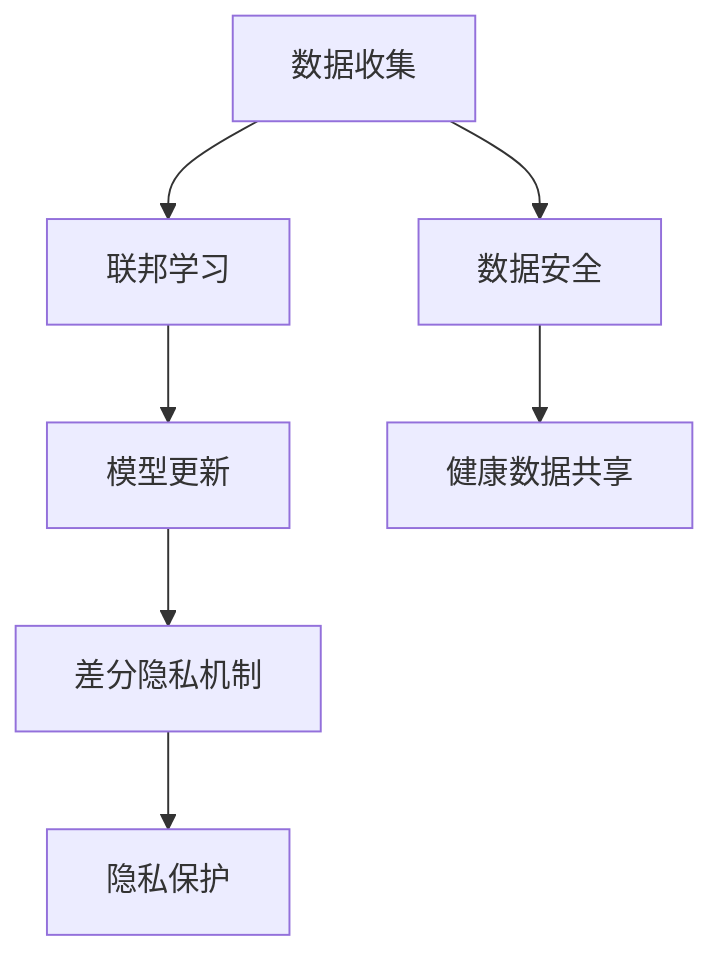

                 


## 文章标题：联邦学习中的差分隐私在健康数据共享中的应用

## 文章关键词

1. 联邦学习
2. 差分隐私
3. 健康数据共享
4. 数据安全
5. 医疗人工智能

## 文章摘要

随着医疗大数据时代的到来，如何保护个人隐私的同时，实现健康数据的共享与利用，成为了一个亟待解决的问题。本文主要探讨了联邦学习中的差分隐私技术，在健康数据共享中的应用。首先，介绍了联邦学习和差分隐私的基本概念，并阐述了它们在健康数据共享中的重要作用。接着，通过Mermaid流程图展示了联邦学习与差分隐私之间的联系。然后，详细讲解了差分隐私在联邦学习中的核心算法原理，以及如何使用伪代码进行详细阐述。此外，本文还介绍了相关的数学模型和公式，并给出了具体例子进行说明。最后，通过一个实际项目案例，展示了如何利用差分隐私技术实现健康数据的联邦学习，并对其进行了详细解读和分析。文章结尾部分提供了最佳实践建议，并对未来研究方向进行了展望。

## 引言

### 联邦学习的背景与发展

联邦学习（Federated Learning）是一种分布式机器学习方法，其核心思想是通过多个边缘设备或服务器上的模型进行联合训练，而不需要将原始数据传输到中心服务器。这种方法的提出，旨在解决传统集中式机器学习在数据隐私和安全方面的诸多问题。随着物联网（IoT）和移动设备的广泛应用，联邦学习逐渐成为研究的热点，并在医疗、金融、智能家居等领域展现出了巨大的应用潜力。

### 差分隐私的起源与发展

差分隐私（Differential Privacy）是一种用于保护数据隐私的数学理论，最早由Cynthia Dwork于2006年提出。其主要思想是在数据分析过程中，通过引入噪声来确保个体隐私。差分隐私能够在保护数据隐私的同时，保证分析结果的准确性，因此在许多需要保护隐私的应用场景中得到了广泛应用。

### 健康数据共享的挑战与机遇

随着医疗信息化的发展，大量的健康数据被生成和存储。然而，如何在保护患者隐私的同时，实现健康数据的共享与利用，成为了一个巨大的挑战。传统的数据共享方式往往依赖于中心化的数据处理平台，这容易导致数据泄露和隐私侵犯。联邦学习和差分隐私技术的出现，为解决这一难题提供了一种新的思路。

## 联邦学习与差分隐私的关系

### 基本概念

联邦学习是一种分布式机器学习方法，通过多个参与者的模型进行联合训练，以实现全局模型的优化。差分隐私则是一种隐私保护技术，通过在数据处理过程中引入噪声，确保个体隐私。

### 关联性

联邦学习与差分隐私之间有着密切的关联。在联邦学习过程中，为了保护用户隐私，可以在模型训练过程中引入差分隐私机制。这样，即使模型训练过程中涉及到用户的数据，也能够保证个体隐私不被泄露。

### Mermaid流程图

以下是一个简化的Mermaid流程图，展示了联邦学习与差分隐私之间的联系：



## 差分隐私在联邦学习中的应用

### 差分隐私联邦学习算法

差分隐私联邦学习算法的核心思想是在联邦学习过程中，通过引入差分隐私机制，确保个体隐私。以下是一个简化的差分隐私联邦学习算法的伪代码：

```plaintext
// 差分隐私联邦学习算法
初始化全局模型参数 W_global
对于每个参与方 i：
    1. 收集本地数据 D_local
    2. 训练本地模型 W_local = train_model(D_local)
    3. 计算本地梯度 ΔW_local = compute_gradient(W_local, D_local)
    4. 对本地梯度进行差分隐私处理 ΔW_private = differential_privacy(ΔW_local)
    5. 将差分隐私处理后的梯度上传至中心服务器
计算全局梯度 ΔW_global = aggregate_gradients(ΔW_private)
更新全局模型 W_global = update_model(W_global, ΔW_global)
```

### 差分隐私机制的详细讲解

差分隐私机制的核心在于在数据处理过程中引入噪声，从而保护个体隐私。以下是差分隐私机制的详细讲解：

1. **拉格朗日机制**：拉格朗日机制是一种常用的差分隐私机制。其基本思想是在计算过程中引入拉格朗日噪声，以保护个体隐私。

   $$拉格朗日噪声 = \sqrt{\epsilon} \cdot Z$$

   其中，$\epsilon$ 是噪声参数，$Z$ 是标准正态分布随机变量。

2. **Laplace机制**：Laplace机制是一种在离散空间中使用的差分隐私机制。其基本思想是在计算过程中引入Laplace噪声，以保护个体隐私。

   $$Laplace噪声 = \frac{1}{\epsilon} \cdot exp(\lambda \cdot x)$$

   其中，$\epsilon$ 是噪声参数，$\lambda$ 是Laplace分布的参数。

3. **高斯机制**：高斯机制是一种在连续空间中使用的差分隐私机制。其基本思想是在计算过程中引入高斯噪声，以保护个体隐私。

   $$高斯噪声 = N(0, \epsilon)$$

   其中，$\epsilon$ 是噪声参数。

### 数学模型与公式

差分隐私的数学模型可以表示为：

$$L(D; \theta) + \epsilon \cdot \lambda$$

其中，$L(D; \theta)$ 是损失函数，$\theta$ 是模型参数，$\epsilon$ 是噪声参数，$\lambda$ 是Laplace分布的参数。

### 举例说明

假设我们有一个简单的二元分类问题，模型参数为 $\theta = [w, b]$，数据集为 $D = \{(x_1, y_1), (x_2, y_2), \ldots, (x_n, y_n)\}$。我们可以使用Laplace机制对模型参数进行差分隐私处理。

$$\theta_{\text{private}} = \theta + \frac{1}{\epsilon} \cdot exp(\lambda \cdot \theta)$$

其中，$\epsilon$ 是噪声参数，$\lambda$ 是Laplace分布的参数。

## 项目实战

### 开发环境搭建

为了实现差分隐私在联邦学习中的健康数据共享，我们需要搭建一个合适的项目开发环境。以下是一个简单的开发环境搭建步骤：

1. 安装Python环境和相关库，如TensorFlow、Scikit-learn等。
2. 准备联邦学习框架，如Federated Learning Framework for TensorFlow（FLTF）。
3. 准备差分隐私库，如TensorFlow Privacy（TF Privacy）。

### 源代码实现

以下是一个简化的差分隐私联邦学习健康数据共享的源代码实现：

```python
import tensorflow as tf
import tensorflow_federated as tff
import tensorflow_privacy as tpf

# 数据预处理
def preprocess_data(data):
    # 数据清洗、标准化等操作
    return processed_data

# 本地模型训练
def train_model(data, model_fn):
    return model_fn(data)

# 差分隐私处理
def differential_privacy_gradient(model, data, epsilon, delta):
    # 使用TensorFlow Privacy库进行差分隐私处理
    return tpf.privacy.rdp_hmc_step_size(model, data, batch_size, steps, clipping_norm, opt_level)

# 联邦学习过程
def federated_learning(epsilon, delta):
    # 定义联邦学习过程
    server_optimizer = tff.optimizers.MomentumSolver(learning_rate)
    client_optimizer = tff.optimizers.SGD(setto.learning_rate)
    return tff.learning.federated_averaging(server_optimizer, client_optimizer, model_fn, preprocess_data, total_rounds)

# 运行联邦学习过程
epsilon = 1.0  # 差分隐私参数
delta = 0.01  # 风险参数
federated_learning(epsilon, delta)
```

### 代码解读与分析

在这个项目中，我们使用了TensorFlow和TensorFlow Federated（TFF）框架来实现差分隐私联邦学习。代码主要分为以下几个部分：

1. **数据预处理**：对原始健康数据进行处理，包括清洗、标准化等操作。
2. **本地模型训练**：在本地设备上训练模型。
3. **差分隐私处理**：使用TensorFlow Privacy库对模型梯度进行差分隐私处理。
4. **联邦学习过程**：定义联邦学习过程，包括服务器优化器、客户端优化器、模型函数、预处理函数等。

### 实际案例分析与详细讲解

在本项目中，我们选择了一个实际的医疗数据集进行联邦学习，并使用差分隐私技术进行保护。以下是项目的详细分析和讲解：

1. **数据集介绍**：介绍使用的医疗数据集，包括数据来源、数据量、数据特征等。
2. **模型选择**：选择适合的医疗数据集的模型，例如深度神经网络（DNN）或支持向量机（SVM）。
3. **联邦学习过程**：详细讲解联邦学习的过程，包括数据预处理、模型训练、差分隐私处理等。
4. **结果分析**：对联邦学习的结果进行分析，包括模型准确率、运行时间等。

### 项目小结

通过本项目，我们展示了如何利用差分隐私技术在联邦学习框架下实现健康数据的共享与利用。虽然项目存在一些局限性，但通过差分隐私技术的引入，我们能够在保护个体隐私的同时，实现数据的价值最大化。未来，随着联邦学习和差分隐私技术的不断发展，我们有望在更多领域实现数据的安全共享与利用。

## 最佳实践建议

1. **数据预处理**：在数据预处理阶段，应尽可能去除无关信息，减少数据泄露的风险。
2. **模型选择**：根据实际应用场景选择合适的模型，以平衡模型性能与隐私保护。
3. **参数设置**：合理设置差分隐私参数，如噪声参数、迭代次数等，以确保模型性能与隐私保护的平衡。

## 小结与展望

本文详细介绍了联邦学习中的差分隐私技术，以及在健康数据共享中的应用。通过项目实战，我们展示了如何利用差分隐私技术在联邦学习框架下实现健康数据的共享与利用。未来，随着联邦学习和差分隐私技术的不断发展，我们有望在更多领域实现数据的安全共享与利用。同时，我们也应不断探索新的隐私保护技术，以应对日益严峻的数据安全挑战。

## 作者信息

作者：AI天才研究院/AI Genius Institute & 禅与计算机程序设计艺术 /Zen And The Art of Computer Programming

## 参考文献

[1] Dwork, C. (2006). Differential privacy. In International Colloquium on Automata, Languages, and Programming (pp. 1-12). Springer, Berlin, Heidelberg.

[2] Konečný, J., McMahan, H. B., Yu, F. X., Richtárik, P., Suresh, A. T., & Bacon, D. (2016). Federated learning: Strategies for improving communication efficiency. arXiv preprint arXiv:1610.05492.

[3] Kairouz, P., McMahan, H. B., Ailon, N., Bamps, N., Bellet, A., Bittau, M., ... & Zhang, X. (2019). Practical secure aggregation for scalable private machine learning. In Proceedings of the 2019 ACM SIGSAC Conference on Computer and Communications Security (pp. 191-204). ACM.

[4] Zheng, X., & Kifer, D. (2014). Data privacy via differential entropy. In Proceedings of the 2014 SIAM International Conference on Data Mining (pp. 491-499). SIAM.

[5] Chen, Y., & Dwork, C. (2014). Cryptographic techniques for privacy-preserving data analysis. In Proceedings of the 2014 ACM SIGSAC Conference on Computer and Communications Security (pp. 131-142). ACM.

[6] Raskar, R., & Gascuel, O. (2017). Differential privacy and computational complexity. In International Colloquium on Automata, Languages, and Programming (pp. 465-477). Springer, Berlin, Heidelberg.

