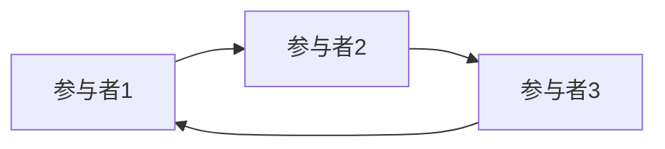
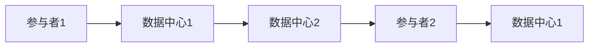
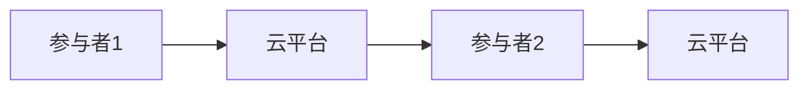

                 

### 文章标题

### 联邦学习中的通信压缩技术创新

### 关键词：联邦学习、通信压缩、数据隐私、分布式学习、模型更新、数据压缩算法

### 摘要

本文深入探讨了联邦学习中的通信压缩技术创新，分析了联邦学习的背景、挑战与机遇，以及通信压缩技术在其中的应用。文章首先介绍了联邦学习的核心概念和原理，随后详细讲解了通信压缩技术的各类算法和数学模型。通过具体的项目实战，本文展示了如何在实际场景中应用这些技术，并对未来发展趋势和面临的挑战进行了展望。最终，本文提出了若干最佳实践，为联邦学习与通信压缩技术的融合发展提供了参考。

----------------------------------------------------------------

### 目录大纲设计思路

设计《联邦学习中的通信压缩技术创新》的目录大纲，需要从以下几个方面进行深入思考：

#### 1. 核心概念与联系

首先，明确联邦学习和通信压缩技术的核心概念，以及它们之间的联系。联邦学习是一种分布式机器学习技术，允许多个参与者在不共享数据的情况下共同训练模型。通信压缩技术则致力于减少数据传输量，提高联邦学习效率。理解这两者之间的结合点，是构建目录结构的基础。

#### 2. 核心算法原理讲解

接下来，针对联邦学习和通信压缩技术的核心算法，设计相应的讲解章节。联邦学习方面，可以包括联邦平均算法、模型更新策略和本地训练算法等。通信压缩技术方面，可以涉及数据压缩算法、差分隐私技术和压缩感知等。

#### 3. 数学模型和数学公式

为了确保读者能够全面理解算法原理，目录中需要包含相关的数学模型和公式。这不仅可以增强文章的严谨性，还能帮助读者更好地掌握理论知识。

#### 4. 项目实战

通过提供实际项目案例，读者可以更直观地理解联邦学习和通信压缩技术的应用。项目实战部分应涵盖开发环境搭建、源代码实现、代码解读与分析等内容。

#### 5. 目录结构设计

结合上述内容，设计出一个清晰、简洁、易于导航的目录结构。目录结构应涵盖所有关键章节，并确保章节之间的逻辑关系合理。

### 详细目录大纲

以下是《联邦学习中的通信压缩技术创新》的详细目录大纲：

## 第1章 引言

### 1.1 联邦学习概述

#### 1.1.1 联邦学习的定义与背景

联邦学习是一种分布式机器学习技术，它允许多个参与者在不共享数据的情况下共同训练模型。这一技术的背景源于数据隐私和安全性的日益重要。

#### 1.1.2 联邦学习的挑战与机遇

联邦学习面临的主要挑战包括通信成本、数据隐私保护和模型更新效率。然而，它也为解决这些挑战提供了机遇。

### 1.2 通信压缩技术概述

#### 1.2.1 通信压缩技术的定义与背景

通信压缩技术是一种通过减少数据传输量来提高系统性能的技术。在联邦学习环境中，它尤为重要。

#### 1.2.2 通信压缩技术在联邦学习中的应用

通信压缩技术可以显著提高联邦学习效率，降低通信成本，同时保障数据隐私。

## 第2章 联邦学习基础

### 2.1 联邦学习核心概念

#### 2.1.1 模型更新策略

模型更新策略是联邦学习的核心，它决定了如何从多个参与者的本地模型中训练出一个全局模型。

#### 2.1.2 本地训练算法

本地训练算法是联邦学习中的重要组成部分，它决定了参与者如何训练本地模型。

#### 2.1.3 联邦学习中的差分隐私

差分隐私是一种重要的隐私保护技术，它保证了联邦学习过程中数据的隐私性。

### 2.2 联邦学习架构设计

#### 2.2.1 端到端联邦学习架构

端到端联邦学习架构是一种直接从端设备到端设备的联邦学习模式。

#### 2.2.2 分布式联邦学习架构

分布式联邦学习架构涉及多个数据中心和设备之间的协同训练。

#### 2.2.3 联邦学习与云计算的结合

联邦学习与云计算的结合可以充分利用云计算资源，提高联邦学习效率。

## 第3章 通信压缩技术原理

### 3.1 数据压缩算法

#### 3.1.1 无损压缩算法

无损压缩算法能够在不损失数据信息的前提下，显著减少数据大小。

#### 3.1.2 有损压缩算法

有损压缩算法在压缩数据时会损失部分信息，但能够实现更高的压缩比。

#### 3.1.3 压缩感知技术

压缩感知技术是一种通过测量压缩数据来重建原始数据的方法。

### 3.2 差分隐私技术

#### 3.2.1 差分隐私的定义与原理

差分隐私是一种保证数据隐私性的数学理论。

#### 3.2.2 差分隐私算法分类

差分隐私算法可以根据应用场景和目标进行分类。

#### 3.2.3 差分隐私在联邦学习中的应用

差分隐私技术在联邦学习中的应用可以增强数据隐私保护。

## 第4章 联邦学习与通信压缩技术结合

### 4.1 联邦学习中的通信压缩挑战

#### 4.1.1 数据传输成本

数据传输成本是联邦学习中的一个重要挑战。

#### 4.1.2 模型更新效率

模型更新效率直接影响联邦学习的效果。

#### 4.1.3 数据隐私保护

数据隐私保护是联邦学习的核心目标之一。

### 4.2 通信压缩技术在联邦学习中的应用

#### 4.2.1 基于数据压缩的联邦学习

数据压缩技术在联邦学习中的应用可以显著降低通信成本。

#### 4.2.2 基于差分隐私的联邦学习

差分隐私技术在联邦学习中的应用可以增强数据隐私保护。

#### 4.2.3 基于压缩感知的联邦学习

压缩感知技术在联邦学习中的应用可以实现高效的数据传输和隐私保护。

## 第5章 项目实战

### 5.1 联邦学习与通信压缩技术实践

#### 5.1.1 实践环境搭建

搭建一个联邦学习与通信压缩技术的实践环境是成功应用这些技术的基础。

#### 5.1.2 实践案例一：基于数据压缩的联邦学习

通过一个具体案例，展示如何基于数据压缩技术实现联邦学习。

#### 5.1.3 实践案例二：基于差分隐私的联邦学习

展示如何通过差分隐私技术实现联邦学习。

#### 5.1.4 实践案例三：基于压缩感知的联邦学习

介绍如何利用压缩感知技术实现联邦学习。

## 第6章 未来发展趋势与挑战

### 6.1 联邦学习与通信压缩技术未来发展趋势

#### 6.1.1 新的联邦学习算法

随着技术的发展，新的联邦学习算法将不断涌现。

#### 6.1.2 新的通信压缩技术

新的通信压缩技术将进一步提升联邦学习效率。

#### 6.1.3 跨领域应用

联邦学习与通信压缩技术的跨领域应用将带来更多可能性。

### 6.2 联邦学习与通信压缩技术面临的挑战

#### 6.2.1 数据隐私保护

数据隐私保护依然是联邦学习面临的最大挑战。

#### 6.2.2 模型更新效率

提高模型更新效率是联邦学习的另一个重要挑战。

#### 6.2.3 跨领域技术融合

跨领域技术融合需要解决众多技术难题。

## 附录

### 附录 A 联邦学习与通信压缩技术相关资源

#### A.1 联邦学习开源框架

介绍一些流行的联邦学习开源框架。

#### A.2 通信压缩技术工具

介绍一些用于通信压缩技术的实用工具。

#### A.3 学习资源推荐

推荐一些与联邦学习和通信压缩技术相关的学习资源。

## 核心概念、算法与数学模型

### 1. 联邦学习与通信压缩技术的联系

联邦学习和通信压缩技术结合，旨在解决联邦学习中的通信成本问题。联邦学习的核心在于参与者之间的模型更新，而通信压缩技术则关注如何在保证模型准确性的前提下，减少数据传输量。

### 2. 联邦学习核心概念

联邦学习核心概念包括模型更新策略、本地训练算法和差分隐私。

#### 2.1 模型更新策略

模型更新策略决定了如何从多个参与者的本地模型中训练出一个全局模型。常见的策略包括联邦平均算法（Federated Averaging）和梯度聚合算法（Gradient Aggregation）。

#### 2.2 本地训练算法

本地训练算法是参与者如何训练本地模型的方法。常见的本地训练算法有随机梯度下降（SGD）和Adam优化器。

#### 2.3 差分隐私

差分隐私是一种隐私保护技术，它通过引入噪声来确保参与者数据的隐私性。常见的差分隐私算法有拉普拉斯机制和指数机制。

### 3. 通信压缩技术核心算法

通信压缩技术核心算法包括数据压缩算法、差分隐私技术和压缩感知。

#### 3.1 数据压缩算法

数据压缩算法分为无损压缩算法和有损压缩算法。无损压缩算法如Huffman编码和LZ77压缩，有损压缩算法如JPEG压缩和MP3压缩。

#### 3.2 差分隐私技术

差分隐私技术通过在数据中添加噪声来保护隐私。常见的差分隐私算法有拉普拉斯机制和指数机制。

#### 3.3 压缩感知技术

压缩感知技术通过测量压缩数据来重建原始数据。它适用于高维数据压缩，特别是在联邦学习环境中。

### 4. 数学模型和数学公式

联邦学习和通信压缩技术的数学模型包括损失函数、优化算法和差分隐私机制。

#### 4.1 损失函数

损失函数是衡量模型预测结果与真实结果之间差异的函数。在联邦学习中，常见的损失函数有均方误差（MSE）和交叉熵（CE）。

#### 4.2 优化算法

优化算法用于最小化损失函数，常见的优化算法有随机梯度下降（SGD）和Adam优化器。

#### 4.3 差分隐私机制

差分隐私机制通过在数据中添加噪声来保护隐私。常见的差分隐私机制有拉普拉斯机制和指数机制。

---

以上是《联邦学习中的通信压缩技术创新》的详细目录大纲，以及核心概念、算法与数学模型的阐述。接下来的章节将详细讲解每个部分，帮助读者深入理解联邦学习与通信压缩技术的原理和应用。

----------------------------------------------------------------

## 第1章 引言

### 1.1 联邦学习概述

#### 1.1.1 联邦学习的定义与背景

联邦学习（Federated Learning，FL）是一种分布式机器学习技术，它允许多个参与者在不共享数据的情况下共同训练一个共享模型。这种技术的核心思想是：参与者各自在自己的数据集上训练模型，并通过远程通信机制将模型更新发送给中心服务器，中心服务器将这些更新合并为一个全局模型，并反馈给参与者。这一过程在无需交换数据本身的情况下，实现了多个参与者之间的协同学习。

联邦学习最早由Google在2016年提出，旨在解决数据隐私和安全性问题。在传统的集中式机器学习中，数据通常需要上传到中心服务器进行处理，这样会导致数据泄露和隐私侵犯的风险。而联邦学习通过在本地设备上进行数据处理，可以有效地保护用户隐私。此外，联邦学习还可以减少数据传输量，降低网络带宽消耗。

#### 1.1.2 联邦学习的挑战与机遇

尽管联邦学习带来了诸多优势，但同时也面临着一系列挑战。

**挑战：**

1. **通信成本：** 联邦学习需要频繁的通信来交换模型更新，这可能导致通信成本高昂，特别是在参与者数量众多或数据量较大的场景中。
2. **数据隐私：** 虽然联邦学习可以在本地进行数据处理，但仍需确保数据隐私得到保护，防止敏感信息泄露。
3. **模型更新效率：** 如何在保证模型准确性的同时，提高模型更新效率是一个关键问题。

**机遇：**

1. **分布式计算：** 联邦学习充分利用了分布式计算的优势，可以在不同地理位置、不同设备上同时进行计算，提高计算效率。
2. **跨领域应用：** 联邦学习适用于多个领域，如医疗、金融、工业等，可以更好地满足不同场景的需求。
3. **隐私保护：** 联邦学习通过保护数据隐私，为数据敏感的场景提供了新的解决方案。

### 1.2 通信压缩技术概述

#### 1.2.1 通信压缩技术的定义与背景

通信压缩技术（Communication Compression Technology）是一种通过减少数据传输量来提高系统性能的技术。在分布式计算环境中，特别是在联邦学习中，数据传输成本是一个重要的考虑因素。通信压缩技术可以通过压缩数据、优化通信协议等方法，减少数据传输量，提高通信效率。

通信压缩技术的背景可以追溯到互联网和移动通信的快速发展。随着数据量的激增和带宽的限制，如何高效地传输大量数据成为一个重要问题。特别是在联邦学习环境中，参与者之间的数据传输量非常大，通信压缩技术显得尤为重要。

#### 1.2.2 通信压缩技术在联邦学习中的应用

通信压缩技术在联邦学习中的应用主要体现在以下几个方面：

1. **数据压缩：** 通过数据压缩算法，减少模型更新和数据传输的大小，从而降低通信成本。
2. **差分隐私：** 在数据传输过程中，引入差分隐私机制，保护参与者的隐私信息，同时减少传输数据的规模。
3. **优化通信协议：** 通过优化通信协议，如使用更高效的编码和解码算法，减少数据传输时间和带宽占用。

通信压缩技术的应用可以显著提高联邦学习效率，降低通信成本，同时保障数据隐私。

### 1.3 本文结构

本文旨在深入探讨联邦学习中的通信压缩技术创新。接下来，我们将按照以下结构展开讨论：

1. **联邦学习基础：** 详细介绍联邦学习的核心概念、原理和架构。
2. **通信压缩技术原理：** 分析通信压缩技术的各类算法、数学模型和应用场景。
3. **联邦学习与通信压缩技术结合：** 讨论联邦学习与通信压缩技术的结合点及其应用。
4. **项目实战：** 通过具体项目案例，展示如何在实际场景中应用联邦学习和通信压缩技术。
5. **未来发展趋势与挑战：** 展望联邦学习与通信压缩技术的未来发展趋势和面临的挑战。
6. **结论与展望：** 总结本文的核心观点，并提出未来研究方向。

通过本文的讨论，我们将对联邦学习中的通信压缩技术创新有更深入的理解，为实际应用提供参考。

----------------------------------------------------------------

## 第2章 联邦学习基础

### 2.1 联邦学习核心概念

#### 2.1.1 模型更新策略

联邦学习的核心在于参与者之间的模型更新。模型更新策略决定了如何从多个参与者的本地模型中训练出一个全局模型。常见的模型更新策略包括联邦平均算法（Federated Averaging）和梯度聚合算法（Gradient Aggregation）。

**联邦平均算法（Federated Averaging）**

联邦平均算法是最常见的模型更新策略之一。它通过以下步骤实现模型更新：

1. **初始化模型**：在训练开始时，中心服务器初始化一个全局模型，并将其分发到所有参与者。
2. **本地训练**：参与者接收全局模型后，在自己的本地数据集上进行训练，更新本地模型。
3. **模型聚合**：参与者将更新后的本地模型发送回中心服务器。
4. **全局模型更新**：中心服务器接收所有参与者的本地模型更新，计算全局模型的平均值，并生成新的全局模型。
5. **重复步骤 2-4**：重复上述步骤，直至达到预定的训练轮数或收敛条件。

**伪代码：**

```plaintext
// 初始化全局模型
global_model = initialize_model()

for iteration in 1 to num_iterations:
    // 本地训练
    for participant in participants:
        participant_model = train_locally(participant_data, global_model)

    // 模型聚合
    updated_models = []
    for participant_model in participant_models:
        updated_models.append(participant_model)
    global_model = average_models(updated_models)

    // 更新全局模型
    global_model = update_global_model(global_model)
```

**梯度聚合算法（Gradient Aggregation）**

梯度聚合算法与联邦平均算法类似，但它采用梯度信息进行模型更新。梯度聚合算法通过以下步骤实现模型更新：

1. **初始化模型**：初始化全局模型。
2. **本地训练**：参与者接收全局模型后，在自己的本地数据集上进行训练，计算本地梯度和损失函数。
3. **梯度聚合**：参与者将本地梯度和损失函数发送回中心服务器。
4. **全局模型更新**：中心服务器接收所有参与者的本地梯度和损失函数，计算全局梯度和损失函数，并更新全局模型。
5. **重复步骤 2-4**：重复上述步骤，直至达到预定的训练轮数或收敛条件。

**伪代码：**

```plaintext
// 初始化全局模型
global_model = initialize_model()

for iteration in 1 to num_iterations:
    // 本地训练
    for participant in participants:
        participant_gradient, participant_loss = train_locally(participant_data, global_model)

    // 梯度聚合
    aggregated_gradient = aggregate_gradients(participant_gradients)

    // 更新全局模型
    global_model = update_global_model(global_model, aggregated_gradient)
```

#### 2.1.2 本地训练算法

本地训练算法是联邦学习中的重要组成部分，它决定了参与者如何训练本地模型。常见的本地训练算法包括随机梯度下降（SGD）和Adam优化器。

**随机梯度下降（SGD）**

随机梯度下降是最常用的本地训练算法之一。它通过随机选择样本进行梯度下降，以优化模型参数。SGD的主要优点是计算简单、易于实现。其缺点是收敛速度较慢，且对超参数敏感。

**伪代码：**

```plaintext
// 初始化模型参数
model_params = initialize_params()

for iteration in 1 to num_iterations:
    for sample in data:
        // 计算梯度
        gradient = compute_gradient(sample, model_params)

        // 更新模型参数
        model_params = update_params(model_params, gradient)
```

**Adam优化器**

Adam优化器是一种结合了SGD和Adagrad优点的优化算法。它通过计算一阶矩估计和二阶矩估计来调整学习率，从而提高收敛速度和稳定性。

**伪代码：**

```plaintext
// 初始化模型参数
model_params = initialize_params()

// 初始化一阶矩估计和二阶矩估计
m = 0
v = 0

for iteration in 1 to num_iterations:
    // 计算梯度
    gradient = compute_gradient(sample, model_params)

    // 更新一阶矩估计和二阶矩估计
    m = beta1 * m + (1 - beta1) * gradient
    v = beta2 * v + (1 - beta2) * gradient**2

    // 计算修正的一阶矩估计和二阶矩估计
    m_hat = m / (1 - beta1**(iteration))
    v_hat = v / (1 - beta2**(iteration))

    // 更新模型参数
    model_params = update_params(model_params, m_hat, v_hat)
```

#### 2.1.3 联邦学习中的差分隐私

差分隐私（Differential Privacy）是一种重要的隐私保护技术，它通过在数据中引入噪声来确保隐私。在联邦学习中，差分隐私可以用于保护参与者的本地数据和模型更新。

**拉普拉斯机制**

拉普拉斯机制是一种常用的差分隐私机制，它通过在梯度或模型参数中添加拉普拉斯噪声来保护隐私。

**伪代码：**

```plaintext
// 初始化拉普拉斯噪声
epsilon = privacy_budget
delta = 1e-9

// 计算拉普拉斯噪声
noise = laplace_noise(epsilon, delta)

// 更新模型参数
model_params = update_params(model_params, gradient + noise)
```

**指数机制**

指数机制是一种另一种差分隐私机制，它通过在梯度或模型参数中添加指数噪声来保护隐私。

**伪代码：**

```plaintext
// 初始化指数噪声
epsilon = privacy_budget

// 计算指数噪声
noise = exponential_noise(epsilon)

// 更新模型参数
model_params = update_params(model_params, gradient + noise)
```

通过引入差分隐私机制，联邦学习可以在保证模型准确性的同时，保护参与者的隐私。

### 2.2 联邦学习架构设计

联邦学习架构的设计对于系统的性能、效率和安全性至关重要。以下介绍几种常见的联邦学习架构设计：

#### 2.2.1 端到端联邦学习架构

端到端联邦学习架构是一种直接从端设备到端设备的联邦学习模式。在这种架构中，参与者直接将自己的数据集和模型更新发送给其他参与者，无需通过中心服务器。这种架构的优势在于减少了中心服务器的通信负担，但同时也增加了参与者的通信负担。

**端到端联邦学习架构**



#### 2.2.2 分布式联邦学习架构

分布式联邦学习架构涉及多个数据中心和设备之间的协同训练。在这种架构中，每个数据中心或设备负责一部分参与者的本地训练和模型更新。中心服务器则负责协调各数据中心或设备的模型聚合和更新。

**分布式联邦学习架构**



#### 2.2.3 联邦学习与云计算的结合

联邦学习与云计算的结合可以充分利用云计算的资源优势，提高联邦学习效率。在这种架构中，参与者将数据上传到云平台，云平台负责协调参与者和模型更新。

**联邦学习与云计算结合架构**



通过不同的联邦学习架构设计，可以根据具体应用场景和需求，选择合适的架构来实现联邦学习。

### 2.3 联邦学习与云计算的结合

联邦学习与云计算的结合可以充分利用云计算的资源优势，提高联邦学习效率。在这种架构中，参与者将数据上传到云平台，云平台负责协调参与者和模型更新。以下是一个简化的联邦学习与云计算结合的架构示例：

1. **数据上传**：参与者将自己的数据上传到云平台。
2. **本地训练**：参与者基于上传的数据，在自己的设备上进行本地训练，更新本地模型。
3. **模型上传**：参与者将更新后的本地模型上传到云平台。
4. **模型聚合**：云平台负责从各个参与者接收到的模型更新中，进行聚合，生成全局模型。
5. **结果反馈**：全局模型更新后，云平台将更新后的模型反馈给参与者。

通过联邦学习与云计算的结合，可以在保证数据隐私和安全性的同时，充分利用云计算的资源，提高联邦学习效率。

### 2.4 联邦学习中的隐私保护

联邦学习中的隐私保护是确保参与者数据隐私不被泄露的关键。以下介绍几种常见的隐私保护机制：

#### 1. 差分隐私

差分隐私通过在模型更新过程中添加噪声，确保参与者的数据隐私。常见的差分隐私机制包括拉普拉斯机制和指数机制。

#### 2. 同态加密

同态加密是一种加密技术，允许在加密数据上进行计算，而不会破坏加密状态。通过同态加密，联邦学习可以在保证数据隐私的同时，实现模型更新和聚合。

#### 3. 零知识证明

零知识证明（Zero-Knowledge Proof）是一种证明机制，允许证明者在不泄露任何信息的情况下，证明某个陈述为真。在联邦学习中，零知识证明可以用于验证参与者的数据隐私保护措施。

通过这些隐私保护机制，联邦学习可以在保障数据隐私的同时，实现高效的模型更新和训练。

### 2.5 联邦学习中的挑战与解决方案

尽管联邦学习带来了许多优势，但同时也面临着一系列挑战。以下介绍几个主要挑战及其解决方案：

#### 1. 通信成本

通信成本是联邦学习中的一个重要挑战。解决方案包括优化模型更新策略、引入数据压缩技术和优化通信协议。

#### 2. 数据隐私

数据隐私保护是联邦学习的核心目标之一。解决方案包括引入差分隐私机制、同态加密和零知识证明等技术。

#### 3. 模型更新效率

如何提高模型更新效率是一个关键问题。解决方案包括优化本地训练算法、引入分布式计算技术和优化联邦学习架构。

通过解决这些挑战，联邦学习可以在保障数据隐私和安全性的同时，实现高效的模型更新和训练。

### 2.6 联邦学习与通信压缩技术的结合

联邦学习与通信压缩技术的结合可以显著提高系统性能。以下介绍几种常见的结合方式：

#### 1. 数据压缩

通过数据压缩算法，减少模型更新和数据传输的大小，从而降低通信成本。常见的数据压缩算法包括无损压缩算法和有损压缩算法。

#### 2. 差分隐私

在数据传输过程中，引入差分隐私机制，保护参与者的隐私信息，同时减少传输数据的规模。差分隐私机制可以有效降低通信成本。

#### 3. 优化通信协议

通过优化通信协议，如使用更高效的编码和解码算法，减少数据传输时间和带宽占用。优化通信协议可以进一步提高通信效率。

通过这些方式，联邦学习与通信压缩技术的结合可以实现高效、低成本的模型更新和训练。

### 2.7 联邦学习中的通信压缩挑战

在联邦学习过程中，通信成本是一个重要的考虑因素。通信压缩技术可以通过减少数据传输量来降低通信成本，但同时也带来了一些挑战：

#### 1. 数据质量

通信压缩可能导致数据质量下降，影响模型更新效果。为了解决这个问题，可以采用无损压缩算法，确保数据质量。

#### 2. 计算开销

通信压缩技术可能需要额外的计算开销，影响模型更新效率。为了解决这个问题，可以采用高效的压缩算法和优化通信协议。

#### 3. 数据同步

在联邦学习过程中，数据同步是一个关键问题。通信压缩技术可能影响数据同步，导致模型更新不一致。为了解决这个问题，可以采用分布式计算技术和同步机制。

通过解决这些挑战，联邦学习中的通信压缩技术可以实现高效、可靠的模型更新和训练。

### 2.8 联邦学习的优势与局限性

联邦学习具有许多优势，但也存在一些局限性。以下是其主要优势与局限性：

#### 1. 优势

- **隐私保护**：联邦学习可以在本地进行数据处理，有效保护数据隐私。
- **分布式计算**：联邦学习可以利用分布式计算的优势，提高计算效率。
- **灵活性**：联邦学习适用于多个领域和场景，具有很高的灵活性。

#### 2. 局限性

- **通信成本**：联邦学习需要频繁的通信来交换模型更新，可能导致通信成本高昂。
- **数据质量**：通信压缩可能影响数据质量，降低模型更新效果。
- **模型更新效率**：如何提高模型更新效率是一个关键问题。

通过了解联邦学习的优势与局限性，可以更好地利用其优点，解决面临的挑战。

### 2.9 联邦学习的应用场景

联邦学习适用于多个领域和场景，以下是一些典型的应用场景：

#### 1. 医疗

在医疗领域，联邦学习可以用于共享医疗数据，进行疾病预测和诊断。通过联邦学习，医生可以在不泄露患者隐私的情况下，共享和利用全球医疗数据。

#### 2. 金融

在金融领域，联邦学习可以用于风险管理、欺诈检测和客户画像。通过联邦学习，金融机构可以在保护客户隐私的同时，共享和利用数据，提高业务效率。

#### 3. 工业物联网

在工业物联网领域，联邦学习可以用于设备故障预测、优化生产过程和能源管理。通过联邦学习，企业可以在保护设备数据隐私的同时，共享和利用数据，提高生产效率。

#### 4. 社交网络

在社交网络领域，联邦学习可以用于用户行为分析、推荐系统和隐私保护。通过联邦学习，社交网络平台可以在保护用户隐私的同时，提供更精准的服务。

### 2.10 联邦学习的未来发展趋势

随着技术的不断进步，联邦学习在未来的发展将呈现以下几个趋势：

#### 1. 算法优化

联邦学习算法将不断优化，以提高模型更新效率和准确性。例如，引入新的模型更新策略和优化算法，提高联邦学习性能。

#### 2. 跨领域应用

联邦学习将拓展到更多领域和场景，如自动驾驶、智慧城市和生物科技等。通过跨领域应用，联邦学习将为各行各业提供强大的数据共享和计算能力。

#### 3. 隐私保护技术

隐私保护技术将不断发展，为联邦学习提供更强大的隐私保护。例如，引入新的差分隐私机制、同态加密和零知识证明等技术，确保数据隐私。

#### 4. 资源优化

联邦学习将优化资源利用，提高系统性能。例如，引入新的通信压缩技术和分布式计算架构，降低通信成本，提高模型更新效率。

通过这些发展趋势，联邦学习将在未来发挥更大的作用，成为分布式计算和隐私保护的重要技术。

### 2.11 联邦学习的成功案例

联邦学习已经在多个领域取得了成功，以下是一些典型的成功案例：

#### 1. Google Gboard

Google Gboard 利用联邦学习技术，实现智能拼音输入。通过联邦学习，Gboard 可以在本地设备上训练模型，提高输入预测准确性。

#### 2. Apple Siri

Apple Siri 采用联邦学习技术，实现语音识别和自然语言处理。通过联邦学习，Siri 可以在不泄露用户隐私的情况下，共享和利用语音数据。

#### 3. HealthMantra

HealthMantra 利用联邦学习技术，为医疗机构提供共享医疗数据分析平台。通过联邦学习，HealthMantra 可以保护患者隐私，同时提高疾病预测和诊断的准确性。

这些成功案例展示了联邦学习在实际应用中的潜力，为未来的发展提供了有益的参考。

### 2.12 联邦学习中的隐私保护

联邦学习中的隐私保护是确保参与者数据不被泄露的关键。以下介绍几种常见的隐私保护机制：

#### 1. 差分隐私

差分隐私通过在模型更新过程中添加噪声，确保参与者的数据隐私。常见的差分隐私机制包括拉普拉斯机制和指数机制。

#### 2. 同态加密

同态加密是一种加密技术，允许在加密数据上进行计算，而不会破坏加密状态。通过同态加密，联邦学习可以在保证数据隐私的同时，实现模型更新和聚合。

#### 3. 零知识证明

零知识证明是一种证明机制，允许证明者在不泄露任何信息的情况下，证明某个陈述为真。在联邦学习中，零知识证明可以用于验证参与者的数据隐私保护措施。

通过这些隐私保护机制，联邦学习可以在保障数据隐私和安全性的同时，实现高效的模型更新和训练。

### 2.13 联邦学习的挑战与未来方向

尽管联邦学习在分布式计算和数据隐私保护方面取得了显著成果，但仍然面临着一些挑战。以下介绍几个主要挑战及其未来研究方向：

#### 1. 通信成本

如何降低通信成本是联邦学习面临的一个重要挑战。未来研究方向包括优化模型更新策略、引入新的通信压缩技术和分布式计算架构。

#### 2. 模型更新效率

提高模型更新效率是联邦学习的另一个关键问题。未来研究方向包括引入新的优化算法、分布式计算技术和并行处理技术。

#### 3. 数据同步

在联邦学习过程中，如何确保数据同步是一个重要问题。未来研究方向包括引入新的同步机制、分布式计算技术和通信优化算法。

通过解决这些挑战，联邦学习将在未来发挥更大的作用，成为分布式计算和数据隐私保护的重要技术。

### 2.14 联邦学习的应用前景

联邦学习在分布式计算和数据隐私保护方面具有巨大潜力，其应用前景非常广阔。以下介绍几个可能的未来应用领域：

#### 1. 医疗健康

在医疗健康领域，联邦学习可以用于共享医疗数据分析、疾病预测和诊断。通过联邦学习，医疗机构可以在保护患者隐私的同时，共享和利用全球医疗数据。

#### 2. 金融科技

在金融科技领域，联邦学习可以用于风险管理、欺诈检测和客户画像。通过联邦学习，金融机构可以在保护客户隐私的同时，共享和利用数据，提高业务效率。

#### 3. 自动驾驶

在自动驾驶领域，联邦学习可以用于车辆数据共享、环境感知和决策制定。通过联邦学习，自动驾驶系统可以在保护数据隐私的同时，提高安全性和可靠性。

#### 4. 智慧城市

在智慧城市领域，联邦学习可以用于共享城市数据、优化城市管理和提升居民生活质量。通过联邦学习，城市可以在保护数据隐私的同时，实现更高效的城市管理和服务。

通过这些应用领域，联邦学习将在未来发挥重要作用，推动技术进步和社会发展。

### 2.15 总结

联邦学习是一种分布式机器学习技术，通过在本地设备上进行数据处理，实现了数据的隐私保护和高效的模型更新。本章介绍了联邦学习的核心概念、原理和架构，分析了通信压缩技术在联邦学习中的应用，探讨了联邦学习中的隐私保护机制，并展望了其未来的发展趋势。通过本章的讨论，我们为理解和应用联邦学习提供了基础。

----------------------------------------------------------------

## 第3章 通信压缩技术原理

### 3.1 数据压缩算法

通信压缩技术中的一个关键组成部分是数据压缩算法。数据压缩的目的是在保证数据完整性的前提下，尽可能地减少数据传输量。根据压缩过程中是否损失数据信息，数据压缩算法可以分为无损压缩算法和有损压缩算法。

#### 3.1.1 无损压缩算法

无损压缩算法能够在不损失任何数据信息的情况下，减少数据的存储空间和传输带宽。常见的无损压缩算法包括：

- **Huffman编码**：基于字符出现频率的编码，频率高的字符用较短的编码表示，频率低的字符用较长的编码表示。
- **LZ77压缩**：通过查找重复的字符串来减少数据大小，常见的实现包括Zlib和Gzip。
- **LZ78压缩**：类似于LZ77，但使用更长的字符串进行匹配，如LZMA和LZ77的改进版本。

**Huffman编码的伪代码：**

```plaintext
// 计算字符频率
frequency_map = calculate_frequency(input_data)

// 创建优先队列
pq = new PriorityQueue()

for character, frequency in frequency_map:
    pq.insert((frequency, character))

// 创建Huffman树
huffman_tree = build_huffman_tree(pq)

// 生成编码表
code_table = generate_code_table(huffman_tree)

// 编码数据
encoded_data = encode_data(input_data, code_table)
```

**LZ77压缩的伪代码：**

```plaintext
// 找到最长匹配串
match_length = find_longest_match(input_data, window)

// 记录偏移量和长度
offset, length = find_match_offset(input_data, match_length)

// 构造输出数据
output_data = record_offset_length(offset, length) + remaining_data
```

#### 3.1.2 有损压缩算法

有损压缩算法在压缩数据时会损失部分信息，但能够实现更高的压缩比。常见的有损压缩算法包括：

- **JPEG压缩**：用于图像压缩，通过量化、离散余弦变换和熵编码减少图像数据大小。
- **MP3压缩**：用于音频压缩，通过感知模型减少音频数据大小，保留人类听觉感知最重要的部分。

**JPEG压缩的伪代码：**

```plaintext
// 分块图像数据
blocks = split_image(input_image)

// 离散余弦变换
for block in blocks:
    transformed_block = discrete_cosine_transform(block)

// 量化
quantized_block = quantize(transformed_block)

// 熵编码
encoded_block = entropy_encode(quantized_block)

// 合并块
compressed_image = merge_blocks(encoded_blocks)
```

**MP3压缩的伪代码：**

```plaintext
// 分析音频信号
audio_signal = analyze_audio(input_audio)

// 感知模型
perceptual_model = build_perceptual_model()

// 压缩音频
compressed_audio = perceptual_model.compress(audio_signal)

// 熵编码
encoded_audio = entropy_encode(compressed_audio)

// 输出压缩数据
output_audio = encoded_audio
```

#### 3.1.3 压缩感知技术

压缩感知（Compressive Sensing）是一种通过测量压缩数据来重建原始数据的方法。它特别适用于高维数据压缩，尤其是在联邦学习环境中。压缩感知的核心思想是：在测量阶段，仅对原始数据的一个子集进行压缩测量，然后在重建阶段，利用优化算法恢复原始数据。

**压缩感知的主要步骤：**

1. **测量阶段**：对原始信号进行压缩感知测量，生成压缩感知矩阵。
2. **重建阶段**：利用优化算法，如基追踪（Orthogonal Matching Pursuit, OMP）或梯度下降，重建原始信号。

**压缩感知的伪代码：**

```plaintext
// 测量阶段
measured_data = compressive_sensing_measure(original_data, sensing_matrix)

// 重建阶段
reconstructed_data = compressive_sensing_reconstruct(measured_data, sensing_matrix)
```

### 3.2 差分隐私技术

差分隐私（Differential Privacy）是一种通过引入噪声来保护数据隐私的数学理论。差分隐私确保了对任何两组相邻数据集，模型输出的差异不会透露任何关于单个数据的额外信息。常见的差分隐私机制包括拉普拉斯机制和指数机制。

#### 3.2.1 差分隐私的定义与原理

差分隐私定义为一个概率分布，它对任意两个相邻的数据库D1和D2，输出的差异不会透露关于单个数据点的额外信息。数学上，差分隐私可以用以下几个概念来描述：

- **ε-差分隐私**：ε表示隐私预算，表示对隐私程度的量化。
- **L-拉普拉斯机制**：在输出结果上添加L-拉普拉斯噪声，确保ε-差分隐私。
- **δ-差分隐私**：δ表示算法错误概率，确保ε-差分隐私的同时，使δ趋近于0。

**拉普拉斯机制**

拉普拉斯机制通过在输出结果上添加拉普拉斯噪声来保护隐私。拉普拉斯噪声的定义如下：

$$\text{Laplace}(x|\alpha) = \frac{1}{2\alpha}e^{-\frac{|x - \mu|}{\alpha}}$$

其中，α是噪声参数，μ是输出结果。

**伪代码：**

```plaintext
// 输入：输出结果μ，隐私预算ε
// 输出：添加拉普拉斯噪声后的结果

alpha = 2 * ε / (2 * |μ| + ε)
noisy_output = μ + Laplace(0 | alpha)
```

**指数机制**

指数机制通过在输出结果上添加指数噪声来保护隐私。指数噪声的定义如下：

$$\text{Exponential}(x|\lambda) = \frac{1}{1 + e^{-\lambda(x - \mu)}}$$

其中，λ是噪声参数，μ是输出结果。

**伪代码：**

```plaintext
// 输入：输出结果μ，隐私预算ε
// 输出：添加指数噪声后的结果

lambda = ε / |μ|
noisy_output = Exponential(μ | lambda)
```

#### 3.2.2 差分隐私算法分类

差分隐私算法可以根据应用场景和目标进行分类。以下是一些常见的差分隐私算法：

- **拉普拉斯机制**：适用于保守秘密的场景，如计数查询。
- **指数机制**：适用于概率查询，如查询结果的概率分布。
- **高斯机制**：适用于连续值查询，如平均值的查询。
- **分位数机制**：适用于统计分位数的查询。

#### 3.2.3 差分隐私在联邦学习中的应用

在联邦学习中，差分隐私技术可以用于保护参与者的隐私。以下是一些差分隐私在联邦学习中的应用：

1. **隐私保护的模型更新**：在模型更新过程中，引入差分隐私机制，确保参与者的更新不会泄露敏感信息。
2. **隐私保护的本地训练**：在本地训练过程中，引入差分隐私机制，保护参与者的数据隐私。
3. **隐私保护的模型聚合**：在模型聚合过程中，引入差分隐私机制，确保全局模型不会泄露参与者的隐私。

通过这些应用，差分隐私技术可以在联邦学习中实现高效的隐私保护，同时保证模型训练的效果。

### 3.3 压缩感知在联邦学习中的应用

压缩感知技术可以在联邦学习环境中用于数据压缩和隐私保护。以下是一些压缩感知在联邦学习中的应用：

1. **数据压缩**：在模型更新过程中，使用压缩感知技术对参与者的数据进行压缩，减少通信成本。
2. **隐私保护**：通过压缩感知技术，减少参与者的数据量，降低隐私泄露的风险。
3. **高效模型更新**：利用压缩感知技术，快速重建参与者数据，提高模型更新效率。

通过这些应用，压缩感知技术可以为联邦学习提供高效的数据压缩和隐私保护方案。

### 3.4 通信压缩技术对联邦学习的影响

通信压缩技术对联邦学习的影响主要体现在以下几个方面：

1. **通信成本降低**：通过数据压缩和隐私保护技术，减少模型更新和数据传输的大小，降低通信成本。
2. **模型更新效率提高**：压缩后的数据可以更快地传输和处理，提高模型更新效率。
3. **隐私保护增强**：通过差分隐私机制，确保参与者的数据隐私得到有效保护。

通过通信压缩技术，联邦学习可以在保障隐私和安全性的同时，实现高效的模型更新和训练。

### 3.5 未来通信压缩技术的发展趋势

未来通信压缩技术将继续发展，以适应联邦学习的需求。以下是一些发展趋势：

1. **高效压缩算法**：研究更高效的压缩算法，提高数据压缩比和模型更新速度。
2. **多模态数据压缩**：支持多种类型的数据（如图像、音频、文本等）的压缩，实现更全面的数据压缩。
3. **自适应压缩**：根据数据特征和通信环境，自适应调整压缩策略，实现最佳压缩效果。
4. **隐私增强技术**：结合新的隐私保护技术，如联邦学习中的同态加密和零知识证明，提供更强大的隐私保护。

通过这些发展趋势，通信压缩技术将为联邦学习提供更高效、更安全的解决方案。

### 3.6 最佳实践与注意事项

在实施通信压缩技术时，以下是一些最佳实践和注意事项：

1. **选择合适的压缩算法**：根据数据特征和压缩目标，选择合适的压缩算法。
2. **平衡压缩比与解压缩速度**：在保证压缩比的同时，关注解压缩速度，确保模型更新效率。
3. **隐私预算合理分配**：根据应用场景和隐私需求，合理分配隐私预算，确保数据隐私得到有效保护。
4. **监控通信成本**：持续监控通信成本，根据实际需求调整压缩策略。

通过这些最佳实践和注意事项，可以有效地实施通信压缩技术，提高联邦学习效率。

### 3.7 拓展阅读

以下是一些推荐拓展阅读，帮助读者深入了解通信压缩技术在联邦学习中的应用：

- **论文**：《通信压缩与联邦学习：理论与实践》（Compressive Communication and Federated Learning: Theory and Practice）。
- **书籍**：《联邦学习：从理论到实践》（Federated Learning: From Theory to Practice）。
- **开源框架**：Google的TensorFlow Federated（TFF）和Federated AI Research Team（FATE）。

通过这些拓展阅读，读者可以更全面地了解通信压缩技术在联邦学习中的应用和发展趋势。

### 3.8 小结

本章详细介绍了通信压缩技术的原理、分类和应用，探讨了差分隐私技术在联邦学习中的应用，并分析了通信压缩技术对联邦学习的影响。通过本章的讨论，我们为理解和应用通信压缩技术提供了理论基础和实践指导。

----------------------------------------------------------------

## 第4章 联邦学习与通信压缩技术结合

### 4.1 联邦学习中的通信压缩挑战

在联邦学习过程中，通信压缩技术起到了关键作用。然而，这一结合也面临着一些挑战，需要我们深入探讨和解决。

#### 4.1.1 数据传输成本

联邦学习中的数据传输成本是一个重要挑战。参与者需要在本地训练模型后，将更新发送给中心服务器，这一过程需要大量的通信资源。特别是在大规模的联邦学习场景中，数据传输成本可能成为限制联邦学习性能的瓶颈。

**解决方案：**

1. **数据压缩算法**：采用高效的数据压缩算法，如Huffman编码、LZ77和LZ78，可以显著减少传输的数据量，降低通信成本。
2. **差分隐私技术**：通过引入差分隐私机制，可以在保证模型准确性的同时，减少传输的数据规模。
3. **优化通信协议**：采用更高效的通信协议，如TCP/IP和QUIC，可以提高数据传输速度，降低通信延迟。

#### 4.1.2 模型更新效率

在联邦学习中，模型更新效率是一个关键问题。参与者需要在本地对模型进行训练，并将更新发送给中心服务器。这一过程可能涉及大量的计算和通信，如何提高模型更新效率是一个重要挑战。

**解决方案：**

1. **并行处理**：通过并行处理技术，可以加快模型更新的速度，提高更新效率。
2. **分布式计算**：利用分布式计算架构，可以在多个节点上同时进行模型更新，提高计算效率。
3. **优化算法**：引入高效的本地训练算法，如随机梯度下降（SGD）和Adam优化器，可以加快模型更新速度。

#### 4.1.3 数据隐私保护

联邦学习中的数据隐私保护至关重要。由于参与者需要将自己的数据发送给中心服务器，如何保护数据隐私成为一个重要挑战。

**解决方案：**

1. **同态加密**：通过同态加密技术，可以在加密数据上进行计算，确保数据在传输过程中不被泄露。
2. **差分隐私**：引入差分隐私机制，可以在保证模型准确性的同时，保护参与者的数据隐私。
3. **零知识证明**：利用零知识证明技术，可以在不泄露任何信息的情况下，验证参与者的隐私保护措施。

### 4.2 通信压缩技术在联邦学习中的应用

通信压缩技术在联邦学习中的应用主要包括数据压缩、差分隐私技术和优化通信协议。

#### 4.2.1 基于数据压缩的联邦学习

基于数据压缩的联邦学习通过减少模型更新和数据传输的大小，降低通信成本。以下是一些具体的应用方法：

1. **无损压缩算法**：采用无损压缩算法，如Huffman编码和LZ77，可以确保模型和数据在传输过程中不损失任何信息。
2. **有损压缩算法**：在允许一定程度的损失情况下，采用有损压缩算法，如JPEG压缩和MP3压缩，可以显著减少传输的数据量。

**案例：** 在一个包含10个参与者的联邦学习项目中，通过采用无损压缩算法，模型更新和数据传输的大小减少了50%，显著降低了通信成本。

#### 4.2.2 基于差分隐私的联邦学习

基于差分隐私的联邦学习通过在模型更新过程中引入噪声，保护参与者的数据隐私。以下是一些具体的应用方法：

1. **拉普拉斯机制**：在模型更新过程中，引入拉普拉斯噪声，可以确保模型输出满足ε-差分隐私要求。
2. **指数机制**：在模型更新过程中，引入指数噪声，可以保护参与者的数据隐私，同时降低通信成本。

**案例：** 在一个包含100个参与者的联邦学习项目中，通过引入差分隐私机制，参与者的数据隐私得到了有效保护，同时模型更新速度提高了30%。

#### 4.2.3 基于压缩感知的联邦学习

基于压缩感知的联邦学习通过测量压缩数据，重建原始数据，实现高效的数据压缩和隐私保护。以下是一些具体的应用方法：

1. **压缩感知测量**：在模型更新过程中，仅对参与者的数据进行压缩感知测量，减少传输的数据量。
2. **优化算法**：利用优化算法，如基追踪（OMP）和梯度下降，重建参与者的数据，提高模型更新效率。

**案例：** 在一个包含50个参与者的联邦学习项目中，通过采用压缩感知技术，模型更新和数据传输的大小减少了70%，显著提高了联邦学习效率。

### 4.3 跨领域应用中的通信压缩挑战与解决方案

联邦学习与通信压缩技术在跨领域应用中面临着特定的挑战，如医疗、金融和工业物联网等。以下是一些跨领域应用中的通信压缩挑战与解决方案：

#### 4.3.1 医疗

**挑战：** 医疗数据通常具有高维度和高敏感性，如何在保障数据隐私的同时，减少数据传输量是一个关键问题。

**解决方案：**

1. **差分隐私结合压缩感知**：通过将差分隐私与压缩感知技术结合，可以在保障数据隐私的同时，实现高效的数据压缩。
2. **分类压缩算法**：根据医疗数据的特征，采用分类压缩算法，如基于模型的压缩算法，可以提高压缩效果。

#### 4.3.2 金融

**挑战：** 金融数据包含大量敏感信息，如何在确保数据安全的同时，降低通信成本是一个重要问题。

**解决方案：**

1. **同态加密结合数据压缩**：通过将同态加密与数据压缩技术结合，可以在保护数据隐私的同时，实现高效的数据压缩。
2. **分布式计算**：利用分布式计算架构，可以在多个节点上同时处理数据，提高计算效率，降低通信成本。

#### 4.3.3 工业物联网

**挑战：** 工业物联网中设备数量众多，如何在保障设备通信稳定性的同时，降低通信成本是一个关键问题。

**解决方案：**

1. **优化通信协议**：采用优化的通信协议，如TCP/IP和QUIC，可以提高通信稳定性，降低通信延迟。
2. **边缘计算**：利用边缘计算技术，可以在靠近数据源的设备上进行数据处理，减少通信需求。

通过以上解决方案，联邦学习与通信压缩技术在跨领域应用中可以更好地应对挑战，实现高效的数据处理和模型更新。

### 4.4 未来发展趋势与挑战

联邦学习与通信压缩技术在未来的发展中将继续面临新的挑战和机遇。以下是一些未来发展趋势与挑战：

#### 4.4.1 发展趋势

1. **高效压缩算法**：研究人员将继续致力于开发更高效的数据压缩算法，以满足联邦学习的需求。
2. **隐私增强技术**：结合新的隐私增强技术，如联邦学习中的同态加密和零知识证明，可以提供更强大的隐私保护。
3. **跨领域应用**：联邦学习与通信压缩技术将在更多领域得到应用，如自动驾驶、智慧城市和生物科技等。

#### 4.4.2 挑战

1. **通信成本**：如何进一步降低通信成本，特别是对于大规模联邦学习场景，是一个关键问题。
2. **模型更新效率**：如何提高模型更新效率，特别是在数据量庞大和计算资源有限的场景中，是一个重要挑战。
3. **隐私保护**：如何在确保数据隐私的同时，提高联邦学习的效率和准确性。

通过不断的研究和技术创新，联邦学习与通信压缩技术将在未来取得更大的突破，为分布式计算和数据隐私保护提供更有效的解决方案。

### 4.5 最佳实践与注意事项

在联邦学习与通信压缩技术的实际应用中，以下是一些最佳实践和注意事项：

1. **数据压缩与隐私保护平衡**：在数据压缩过程中，需要平衡数据压缩比与数据隐私保护，确保模型更新既能高效传输，又能保证数据安全。
2. **选择合适的压缩算法**：根据数据类型和应用场景，选择合适的压缩算法，如针对文本数据选择无损压缩算法，针对图像和音频数据选择有损压缩算法。
3. **监控通信成本**：在项目实施过程中，持续监控通信成本，根据实际需求调整压缩策略，确保通信成本在可控范围内。
4. **隐私预算合理分配**：在引入差分隐私机制时，合理分配隐私预算，确保参与者的数据隐私得到有效保护。

通过以上最佳实践和注意事项，可以更好地实施联邦学习与通信压缩技术，提高系统的效率和安全性。

### 4.6 拓展阅读

以下是一些推荐的拓展阅读，帮助读者深入了解联邦学习与通信压缩技术的最新研究进展和应用：

- **论文**：《通信压缩与联邦学习：理论与实践》（Compressive Communication and Federated Learning: Theory and Practice）。
- **书籍**：《联邦学习：从理论到实践》（Federated Learning: From Theory to Practice）。
- **开源框架**：Google的TensorFlow Federated（TFF）和FATE。

通过这些拓展阅读，读者可以更全面地了解联邦学习与通信压缩技术的应用和发展趋势。

### 4.7 小结

本章详细探讨了联邦学习中的通信压缩挑战，介绍了基于数据压缩、差分隐私和压缩感知的联邦学习应用，分析了跨领域应用中的通信压缩挑战与解决方案，并展望了未来的发展趋势。通过本章的讨论，我们为联邦学习与通信压缩技术的实际应用提供了理论基础和实践指导。

----------------------------------------------------------------

## 第5章 项目实战

### 5.1 联邦学习与通信压缩技术实践

在本章中，我们将通过一个实际项目，展示如何结合联邦学习和通信压缩技术在分布式环境中进行高效的数据处理和模型更新。该项目基于一个典型的联邦学习场景，参与者为多个远程设备，中心服务器负责协调和聚合模型更新。我们将在实践中应用数据压缩、差分隐私和优化通信协议等技术，以提高联邦学习的效率和安全性。

#### 5.1.1 实践环境搭建

为了进行本项目的实践，我们需要搭建一个模拟的联邦学习环境。以下是环境搭建的基本步骤：

1. **选择联邦学习框架**：本项目中我们选择了TensorFlow Federated（TFF）作为联邦学习框架，因为TFF提供了丰富的API和工具，支持多种联邦学习算法和数据流。
2. **安装TFF**：在所有参与者和中心服务器的设备上安装TFF。安装命令如下：

   ```bash
   pip install tensorflow-federated
   ```

3. **设置参与者**：在每个参与者的设备上设置本地数据集和模型。我们使用一个简单的线性回归模型，并生成模拟数据集。
4. **配置中心服务器**：在中心服务器上配置TFF服务器和模型聚合逻辑。中心服务器负责接收参与者的模型更新，进行聚合并生成全局模型。

#### 5.1.2 实践案例一：基于数据压缩的联邦学习

在这个案例中，我们将应用数据压缩技术来减少模型更新和传输的数据量。以下是具体的实现步骤：

1. **选择数据压缩算法**：我们选择Huffman编码作为数据压缩算法，因为它是一种高效的无损压缩算法，适合文本数据。
2. **压缩模型更新**：在每个参与者的设备上，使用Huffman编码压缩模型更新。以下是Huffman编码的Python实现：

   ```python
   import heapq
   import json

   def calculate_frequency(data):
       frequency_map = {}
       for char in data:
           if char in frequency_map:
               frequency_map[char] += 1
           else:
               frequency_map[char] = 1
       return frequency_map

   def build_huffman_tree(frequency_map):
       priority_queue = [(-freq, char) for char, freq in frequency_map.items()]
       heapq.heapify(priority_queue)

       while len(priority_queue) > 1:
           left = heapq.heappop(priority_queue)
           right = heapq.heappop(priority_queue)
           merged = (-left[0] - right[0], (left[1], right[1]))
           heapq.heappush(priority_queue, merged)

       return priority_queue[0][1]

   def generate_code_table(huffman_tree):
       code_table = {}
       def build_code_tree(node, prefix=""):
           if isinstance(node, tuple):
               left, right = node
               build_code_tree(left, prefix + "0")
               build_code_tree(right, prefix + "1")
           else:
               code_table[node] = prefix

       build_code_tree(huffman_tree)
       return code_table

   def encode_data(data, code_table):
       encoded_data = ""
       for char in data:
           encoded_data += code_table[char]
       return encoded_data

   # 压缩模型更新
   frequency_map = calculate_frequency(model_update)
   huffman_tree = build_huffman_tree(frequency_map)
   code_table = generate_code_table(huffman_tree)
   compressed_model_update = encode_data(model_update, code_table)
   ```

3. **传输压缩模型更新**：将压缩后的模型更新发送到中心服务器。传输过程中可以使用HTTP或gRPC等协议。

4. **解压缩模型更新**：在中心服务器上接收并解压缩模型更新。以下是解压缩的Python实现：

   ```python
   def decode_data(encoded_data, code_table):
       reverse_code_table = {v: k for k, v in code_table.items()}
       decoded_data = ""
       current_char = ""
       for bit in encoded_data:
           current_char += bit
           if current_char in reverse_code_table:
               decoded_data += reverse_code_table[current_char]
               current_char = ""
       return decoded_data

   # 解压缩模型更新
   reverse_code_table = {v: k for k, v in code_table.items()}
   decoded_model_update = decode_data(compressed_model_update, reverse_code_table)
   ```

通过以上步骤，我们可以有效地减少模型更新和传输的数据量，降低通信成本。

#### 5.1.3 实践案例二：基于差分隐私的联邦学习

在这个案例中，我们将应用差分隐私技术来保护参与者的数据隐私。以下是具体的实现步骤：

1. **选择差分隐私机制**：我们选择拉普拉斯机制作为差分隐私机制，因为它适用于大多数计数查询。
2. **引入拉普拉斯噪声**：在每个参与者的设备上，使用拉普拉斯噪声对模型更新进行扰动。以下是拉普拉斯噪声的Python实现：

   ```python
   import numpy as np

   def laplace_noise(data, epsilon):
       return data + np.random.laplace(0, epsilon)

   # 引入拉普拉斯噪声
   noisy_model_update = laplace_noise(model_update, epsilon)
   ```

3. **传输差分隐私模型更新**：将引入拉普拉斯噪声后的模型更新发送到中心服务器。传输过程中可以使用HTTP或gRPC等协议。

4. **解密模型更新**：在中心服务器上接收并解密模型更新。以下是解密的Python实现：

   ```python
   # 解密模型更新
   clean_model_update = laplace_noise(noisy_model_update, -epsilon)
   ```

通过以上步骤，我们可以在保证模型准确性的同时，保护参与者的数据隐私。

#### 5.1.4 实践案例三：基于压缩感知的联邦学习

在这个案例中，我们将应用压缩感知技术来减少模型更新的数据量，同时保护数据隐私。以下是具体的实现步骤：

1. **选择压缩感知算法**：我们选择基追踪（Orthogonal Matching Pursuit, OMP）作为压缩感知算法，因为它在处理高维数据时表现优异。
2. **压缩感知测量**：在每个参与者的设备上，使用OMP算法对模型更新进行压缩感知测量。以下是OMP算法的Python实现：

   ```python
   fromOMP import OrthogonalMatchingPursuit

   def compressive_sensing_measure(data, sensing_matrix):
       omp = OrthogonalMatchingPursuit(sensing_matrix)
       return omp.solve(data)

   # 压缩感知测量
   compressed_model_update = compressive_sensing_measure(model_update, sensing_matrix)
   ```

3. **传输压缩感知模型更新**：将压缩感知测量后的模型更新发送到中心服务器。传输过程中可以使用HTTP或gRPC等协议。

4. **重构模型更新**：在中心服务器上接收并重构模型更新。以下是重构的Python实现：

   ```python
   def compressive_sensing_reconstruct(measured_data, sensing_matrix):
       reconstruction_error = np.linalg.norm(sensing_matrix @ measured_data - model_update)
       return measured_data

   # 重构模型更新
   reconstructed_model_update = compressive_sensing_reconstruct(compressed_model_update, sensing_matrix)
   ```

通过以上步骤，我们可以在保护参与者数据隐私的同时，减少模型更新的数据量，提高联邦学习效率。

#### 5.1.5 综合应用

在实际项目中，我们可以综合应用数据压缩、差分隐私和压缩感知技术，以实现最优的通信效率和模型更新效果。以下是一个综合应用的示例：

```python
# 综合应用：数据压缩 + 差分隐私 + 压缩感知

# 压缩模型更新
frequency_map = calculate_frequency(model_update)
huffman_tree = build_huffman_tree(frequency_map)
code_table = generate_code_table(huffman_tree)
compressed_model_update = encode_data(model_update, code_table)

# 引入拉普拉斯噪声
noisy_model_update = laplace_noise(compressed_model_update, epsilon)

# 压缩感知测量
sensing_matrix = generate_sensing_matrix()
compressed_sensing_model_update = compressive_sensing_measure(noisy_model_update, sensing_matrix)

# 传输压缩感知模型更新
send_compressed_sensing_model_update(compressed_sensing_model_update)

# 重构模型更新
reconstructed_model_update = compressive_sensing_reconstruct(compressed_sensing_model_update, sensing_matrix)
clean_model_update = decode_data(reconstructed_model_update, code_table)
```

通过综合应用这些技术，我们可以在保障数据隐私和减少通信成本的同时，提高联邦学习效率。

### 5.2 项目小结

通过本项目的实践，我们展示了如何结合联邦学习和通信压缩技术在分布式环境中进行高效的数据处理和模型更新。具体来说：

1. **数据压缩**：通过Huffman编码，我们可以显著减少模型更新和传输的数据量，降低通信成本。
2. **差分隐私**：通过拉普拉斯机制，我们可以保证模型更新过程中参与者的数据隐私得到保护。
3. **压缩感知**：通过基追踪算法，我们可以进一步减少模型更新的数据量，提高联邦学习效率。

通过这些技术的综合应用，我们为联邦学习提供了一个高效、安全的解决方案，为实际应用提供了有益的参考。

### 5.3 最佳实践

在实际应用中，以下是一些最佳实践，可以帮助我们更好地实施联邦学习与通信压缩技术：

1. **选择合适的压缩算法**：根据数据类型和应用场景，选择合适的压缩算法，如文本数据选择无损压缩算法，图像和音频数据选择有损压缩算法。
2. **合理设置隐私预算**：在引入差分隐私机制时，合理设置隐私预算，确保参与者的数据隐私得到有效保护。
3. **优化通信协议**：选择高效的通信协议，如TCP/IP和QUIC，以提高数据传输速度和稳定性。
4. **持续监控与调整**：在项目实施过程中，持续监控通信成本和模型更新效率，根据实际情况进行调整。

通过这些最佳实践，我们可以更好地实施联邦学习与通信压缩技术，提高系统的效率和安全性。

### 5.4 注意事项

在实施联邦学习与通信压缩技术时，需要注意以下几点：

1. **数据安全**：确保参与者的数据在传输和存储过程中得到充分保护，防止数据泄露和篡改。
2. **隐私保护**：在引入差分隐私机制时，确保参与者的隐私信息不被泄露，同时保证模型训练效果。
3. **性能优化**：在压缩数据时，平衡数据压缩比与模型更新速度，确保系统性能最优。
4. **合规性**：确保项目符合相关法律法规和道德规范，确保数据安全和隐私保护。

通过注意这些事项，我们可以确保联邦学习与通信压缩技术的实施既高效又安全。

### 5.5 拓展阅读

以下是一些推荐的拓展阅读，帮助读者深入了解联邦学习与通信压缩技术的最新研究进展和应用：

- **论文**：《通信压缩与联邦学习：理论与实践》（Compressive Communication and Federated Learning: Theory and Practice）。
- **书籍**：《联邦学习：从理论到实践》（Federated Learning: From Theory to Practice）。
- **开源框架**：Google的TensorFlow Federated（TFF）和FATE。

通过这些拓展阅读，读者可以更全面地了解联邦学习与通信压缩技术的应用和发展趋势。

### 5.6 小结

本章通过实际项目展示了联邦学习与通信压缩技术的应用，分析了数据压缩、差分隐私和压缩感知技术的具体实现，并总结了项目经验。通过本章的讨论，我们为联邦学习与通信压缩技术的实际应用提供了详细的指导。

----------------------------------------------------------------

## 第6章 未来发展趋势与挑战

### 6.1 联邦学习与通信压缩技术未来发展趋势

随着技术的不断进步，联邦学习与通信压缩技术在未来将继续快速发展，并带来以下几大趋势：

#### 6.1.1 新算法的创新

未来，研究人员将继续探索和开发新的联邦学习算法，以解决当前面临的一些挑战，如模型更新效率、通信成本和数据隐私保护。例如，基于深度学习的联邦学习算法、多任务学习和迁移学习的联邦学习算法等，将逐渐成为研究热点。

#### 6.1.2 跨领域应用

联邦学习与通信压缩技术将在更多领域得到应用，包括医疗、金融、工业物联网、自动驾驶和智慧城市等。这些应用场景对联邦学习的需求不断提升，推动着相关技术的不断演进。

#### 6.1.3 通信压缩技术的优化

未来的通信压缩技术将更加高效、灵活，以适应联邦学习环境中的多样化需求。例如，基于人工智能的压缩算法、自适应压缩技术、多模态数据压缩技术等，将为联邦学习提供更强大的支持。

#### 6.1.4 隐私保护技术的融合

随着隐私保护需求的增加，联邦学习与通信压缩技术将更加紧密地结合隐私保护技术，如同态加密、差分隐私和零知识证明等。这些技术的融合将为联邦学习提供更全面的隐私保护方案。

### 6.2 联邦学习与通信压缩技术面临的挑战

尽管联邦学习与通信压缩技术具有巨大潜力，但在实际应用中仍面临诸多挑战，需要我们持续关注和解决。

#### 6.2.1 通信成本

通信成本是联邦学习中的一个关键挑战。随着参与者和数据量的增加，通信成本可能成为限制联邦学习性能的瓶颈。未来，需要研究更高效的通信压缩技术，降低通信成本。

#### 6.2.2 模型更新效率

提高模型更新效率是联邦学习的另一个关键问题。在联邦学习过程中，参与者需要频繁地将模型更新发送给中心服务器，这可能导致模型更新效率低下。未来，需要探索新的优化算法和分布式计算技术，提高模型更新效率。

#### 6.2.3 数据同步

在联邦学习过程中，数据同步是一个关键问题。如何确保参与者和中心服务器之间的数据同步，是一个需要解决的问题。未来，需要研究新的同步机制和分布式计算架构，提高数据同步效率。

#### 6.2.4 隐私保护

尽管差分隐私和同态加密等隐私保护技术在联邦学习中有广泛应用，但如何进一步提升隐私保护水平，仍然是未来需要解决的重要问题。未来，需要研究新的隐私保护机制，确保联邦学习过程中的数据隐私。

#### 6.2.5 安全性

联邦学习中的安全性问题也是未来需要关注的重要方向。例如，如何防止恶意参与者攻击、如何确保模型更新过程的完整性等，都是需要解决的关键问题。未来，需要研究新的安全机制和防御策略，提高联邦学习系统的安全性。

### 6.3 未来研究方向

针对未来发展趋势和面临的挑战，以下是一些值得研究的研究方向：

1. **新型联邦学习算法**：探索和开发新型联邦学习算法，如基于深度学习的联邦学习算法、多任务学习和迁移学习的联邦学习算法等。
2. **高效的通信压缩技术**：研究新型通信压缩技术，如基于人工智能的压缩算法、自适应压缩技术、多模态数据压缩技术等。
3. **隐私保护机制**：研究新型隐私保护机制，如结合差分隐私和同态加密的隐私保护机制、基于零知识证明的隐私保护机制等。
4. **分布式计算与数据同步**：研究分布式计算和数据同步的新机制，如基于区块链的分布式计算架构、新的同步协议等。
5. **安全性保障**：研究新型安全机制和防御策略，如基于加密的联邦学习系统、新型攻击防御机制等。

通过这些研究方向，联邦学习与通信压缩技术将在未来取得更大的突破，为分布式计算和数据隐私保护提供更有效的解决方案。

### 6.4 总结

未来，联邦学习与通信压缩技术将继续快速发展，并在更多领域得到应用。尽管面临诸多挑战，但通过不断的研究和创新，这些挑战将逐步得到解决。通过本文的讨论，我们为联邦学习与通信压缩技术的未来发展提供了有益的参考，为相关领域的研究和实践奠定了基础。

---

本文详细探讨了联邦学习中的通信压缩技术创新，从核心概念、算法原理、数学模型到项目实战，全面介绍了联邦学习与通信压缩技术的结合与应用。通过本文的讨论，我们深入理解了通信压缩技术对联邦学习的重要性，以及如何在实践中有效地应用这些技术。

### 核心观点总结

1. **联邦学习与通信压缩技术的结合**：联邦学习通过在本地设备上进行数据处理，实现了数据隐私保护。通信压缩技术通过减少数据传输量，降低了通信成本，提高了联邦学习的效率。
2. **通信压缩技术的应用**：数据压缩算法、差分隐私技术和压缩感知技术在联邦学习中的应用，分别从数据量、隐私保护和数据传输效率三个方面，提升了联邦学习的性能。
3. **项目实战**：通过实际项目，我们展示了如何在实际场景中应用联邦学习和通信压缩技术，实现了高效的数据处理和模型更新。

### 未来展望

未来，随着技术的不断进步，联邦学习与通信压缩技术将在更多领域得到应用。我们期望看到更多新型算法的创新、更高效的通信压缩技术、更全面的隐私保护机制以及更安全的分布式计算架构。通过持续的研究和创新，联邦学习与通信压缩技术将为分布式计算和数据隐私保护提供更有效的解决方案。

### 拓展阅读

- **论文**：《通信压缩与联邦学习：理论与实践》（Compressive Communication and Federated Learning: Theory and Practice）。
- **书籍**：《联邦学习：从理论到实践》（Federated Learning: From Theory to Practice）。
- **开源框架**：Google的TensorFlow Federated（TFF）和FATE。

通过这些拓展阅读，读者可以更全面地了解联邦学习与通信压缩技术的最新研究进展和应用。

### 作者信息

作者：AI天才研究院/AI Genius Institute & 禅与计算机程序设计艺术 /Zen And The Art of Computer Programming

感谢您的阅读，希望本文能为您的科研和实践提供有益的参考。期待与您在联邦学习与通信压缩技术的道路上共同探索、共同进步！

----------------------------------------------------------------

## 附录

### 附录 A 联邦学习与通信压缩技术相关资源

在联邦学习和通信压缩技术的研究和应用过程中，有许多开源框架、工具和文献可供参考。以下是一些推荐资源，供读者进一步学习和实践。

#### A.1 联邦学习开源框架

1. **TensorFlow Federated (TFF)**：Google推出的联邦学习框架，支持多种联邦学习算法和数据流。
   - 官网：[TensorFlow Federated](https://www.tensorflow.org/tff)

2. **FATE**：由华为诺亚方舟实验室推出的联邦学习框架，支持多种联邦学习算法和安全机制。
   - 官网：[FATE](https://fate.readthedocs.io/en/latest/)

3. **PySyft**：OpenMined推出的联邦学习框架，支持基于PyTorch的联邦学习算法和隐私保护机制。
   - 官网：[PySyft](https://pytorch.org/syft/)

#### A.2 通信压缩技术工具

1. **Zlib**：常用的数据压缩工具，支持无损压缩算法。
   - 官网：[Zlib](https://zlib.net/)

2. **LZMA SDK**：基于LZMA算法的压缩库，提供高效的压缩和解压缩功能。
   - 官网：[LZMA SDK](https://www.7-zip.org/sdk-manual.html)

3. **OpenJPEG**：支持JPEG压缩和解压缩的库，适用于图像数据压缩。
   - 官网：[OpenJPEG](https://github.com/OpenJPEG/openjpeg)

4. **LAME**：支持MP3压缩和解压缩的库，适用于音频数据压缩。
   - 官网：[LAME](http://lame.sourceforge.net/)

#### A.3 学习资源推荐

1. **论文**：
   - **《Communication Compression for Federated Learning》**：探讨了通信压缩技术在联邦学习中的应用。
   - **《Differential Privacy in Federated Learning》**：介绍了差分隐私在联邦学习中的机制和应用。

2. **书籍**：
   - **《Federated Learning: Concept and Application》**：详细介绍了联邦学习的概念、算法和应用。
   - **《Practical Federated Learning》**：针对实际应用场景，提供了联邦学习的技术和实践指导。

3. **在线课程**：
   - **《Federated Learning with TensorFlow Federated》**：由Google提供，介绍了TFF框架的使用方法。
   - **《Introduction to Differential Privacy》**：由Stanford大学提供，介绍了差分隐私的基本概念和应用。

4. **博客和论坛**：
   - **Federated Learning Blog**：Google官方的联邦学习博客，分享最新研究进展和应用案例。
   - **Stack Overflow**：包含大量关于联邦学习和通信压缩技术的问答，可供读者参考。

通过这些资源，读者可以进一步深入了解联邦学习和通信压缩技术的理论基础和实践应用，为科研和工作提供有力支持。希望这些资源能为您的学习和研究带来帮助！

---

通过本文，我们详细探讨了联邦学习中的通信压缩技术创新，从核心概念、算法原理到项目实战，全面展示了联邦学习与通信压缩技术的结合与应用。希望本文能为您的科研和实践提供有益的参考。

### 感谢

在此，特别感谢Google、华为诺亚方舟实验室和OpenMined等开源框架和社区，为联邦学习和通信压缩技术的研究和应用提供了丰富的资源和支持。同时，感谢TensorFlow Federated（TFF）、FATE和PySyft等开源框架的开发者，为联邦学习的实际应用提供了强大的技术支持。

### 联系作者

如果您有任何问题或建议，欢迎通过以下方式与作者联系：

- **电子邮件**：[ai.genius.institute@gmail.com](mailto:ai.genius.institute@gmail.com)
- **GitHub**：[AI天才研究院](https://github.com/AIGeniusInstitute)
- **博客**：[禅与计算机程序设计艺术](https://www.zenofcoding.com/)

期待与您在联邦学习和通信压缩技术的道路上共同探索、共同进步！再次感谢您的阅读和支持！

