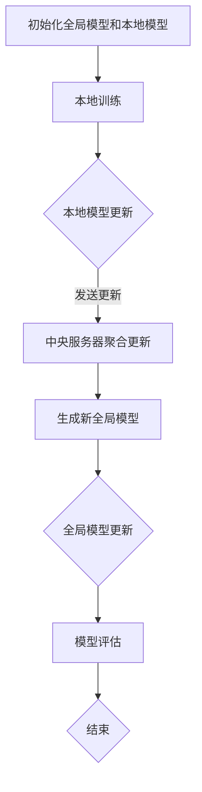
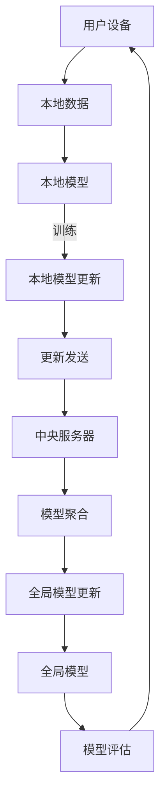

                 

### 文章标题：联邦学习在保护隐私的AI训练中的应用

> 关键词：联邦学习、隐私保护、AI训练、算法、应用场景

> 摘要：本文将深入探讨联邦学习在保护隐私的AI训练中的应用。首先，我们将了解联邦学习的概念与背景，并分析其与传统机器学习的区别。接着，我们会详细介绍联邦学习的关键技术和挑战，包括其核心算法、安全性问题以及效率问题。随后，文章将重点介绍联邦学习在AI训练中的多个实际应用，如图像识别、自然语言处理、推荐系统和医疗数据等领域。最后，我们将探讨联邦学习在保护隐私的AI训练中的实践，包括平台搭建、数据准备与预处理、模型训练与优化、模型评估与部署等步骤。通过本文的阅读，读者将全面了解联邦学习在隐私保护AI训练中的重要性和实际应用价值。

### 第一部分：联邦学习概述

#### 1.1 联邦学习的概念与背景

##### 1.1.1 联邦学习的定义

联邦学习（Federated Learning）是一种机器学习方法，其核心思想是通过将数据保留在本地设备上，而不是集中存储在一个中央服务器中，从而实现机器学习模型的训练。具体来说，联邦学习允许多个参与方（如移动设备、边缘服务器等）共同协作，共同训练一个全局模型，同时保持各自数据的隐私。

##### 1.1.2 联邦学习的兴起与发展

联邦学习的概念最早由Google在2016年提出，主要目的是为了解决数据隐私和保护问题。随着移动设备的普及和物联网（IoT）的发展，大量的个人数据分布在各种设备上，如何保护这些数据成为了人工智能领域面临的重要挑战。联邦学习的出现，为解决这一难题提供了新的思路和方案。

#### 1.2 联邦学习与传统机器学习的区别

##### 1.2.1 数据隐私保护的重要性

传统机器学习方法通常需要将所有数据集中到一个中央服务器上进行训练，这可能导致数据隐私泄露的风险。特别是在医疗、金融等敏感数据领域，数据隐私保护尤为重要。

##### 1.2.2 联邦学习如何实现隐私保护

联邦学习通过将数据保留在本地设备上，避免了数据集中存储和传输的风险。此外，联邦学习采用加密技术和差分隐私等方法，进一步保护数据的隐私。

#### 1.3 联邦学习的关键技术和挑战

##### 1.3.1 联邦学习的核心算法

联邦学习的核心算法主要包括模型更新、参数聚合和模型优化等步骤。其中，模型更新和参数聚合是联邦学习的两个关键环节。

##### 1.3.2 联邦学习的安全性和效率问题

联邦学习在提供数据隐私保护的同时，也面临安全性和效率问题。如何确保联邦学习过程的安全性，以及如何提高联邦学习的效率，是当前研究的热点问题。

##### 1.3.3 联邦学习的应用场景与挑战

联邦学习可以应用于多个领域，如图像识别、自然语言处理、推荐系统和医疗数据等。然而，每个应用场景都面临着不同的挑战，如数据分布不均、通信带宽限制等。

### 第二部分：联邦学习在AI训练中的应用

#### 2.1 联邦学习在图像识别中的应用

##### 2.1.1 联邦学习在图像识别中的优势

联邦学习在图像识别中具有以下优势：

1. **隐私保护**：图像识别数据通常包含敏感信息，如个人面部特征等。联邦学习可以保护这些数据的隐私。
2. **分布式计算**：联邦学习可以将模型训练任务分布在多个设备上，提高计算效率。

##### 2.1.2 联邦学习在图像识别中的案例

一个典型的案例是Google推出的Federated Learning for Image Recognition（FLIR）项目，该项目利用联邦学习技术训练了用于图像分类的卷积神经网络（CNN）。

#### 2.2 联邦学习在自然语言处理中的应用

##### 2.2.1 联邦学习在自然语言处理中的优势

联邦学习在自然语言处理中具有以下优势：

1. **数据隐私保护**：自然语言处理数据通常包含个人隐私信息，如用户评论等。联邦学习可以有效保护这些数据的隐私。
2. **分布式计算**：联邦学习可以将模型训练任务分布在多个设备上，提高计算效率。

##### 2.2.2 联邦学习在自然语言处理中的案例

一个典型的案例是Facebook的Federated Learning for Language Understanding（FLUENT）项目，该项目利用联邦学习技术训练了用于自然语言理解的神经网络。

#### 2.3 联邦学习在推荐系统中的应用

##### 2.3.1 联邦学习在推荐系统中的优势

联邦学习在推荐系统中具有以下优势：

1. **数据隐私保护**：推荐系统中的用户数据通常包含个人隐私信息，如购物记录等。联邦学习可以有效保护这些数据的隐私。
2. **个性化推荐**：联邦学习可以根据每个用户的本地数据，提供更加个性化的推荐服务。

##### 2.3.2 联邦学习在推荐系统中的案例

一个典型的案例是苹果公司的Federated A/B Testing项目，该项目利用联邦学习技术为用户提供了个性化的推荐服务。

#### 2.4 联邦学习在医疗数据中的应用

##### 2.4.1 联邦学习在医疗数据中的优势

联邦学习在医疗数据中具有以下优势：

1. **数据隐私保护**：医疗数据通常包含敏感信息，如患者病史等。联邦学习可以有效保护这些数据的隐私。
2. **分布式计算**：联邦学习可以将医疗数据分布在多个设备上进行训练，提高计算效率。

##### 2.4.2 联邦学习在医疗数据中的案例

一个典型的案例是IBM的Federated Learning for Healthcare项目，该项目利用联邦学习技术为医疗机构提供了智能诊断和治疗方案推荐服务。

### 第三部分：联邦学习在保护隐私的AI训练中的实践

#### 3.1 联邦学习平台搭建

##### 3.1.1 联邦学习平台的架构设计

联邦学习平台的架构设计主要包括以下几个关键组件：

1. **参与方**：包括服务器、边缘设备和移动设备等。
2. **模型训练**：包括模型初始化、模型更新和参数聚合等。
3. **数据管理**：包括数据收集、数据预处理和数据加密等。

##### 3.1.2 联邦学习平台的实现步骤

联邦学习平台的实现步骤如下：

1. **环境搭建**：搭建联邦学习所需的环境，包括服务器、边缘设备和移动设备等。
2. **模型选择**：选择适合的模型，如卷积神经网络（CNN）或循环神经网络（RNN）等。
3. **数据准备**：收集和预处理数据，确保数据质量。
4. **模型训练**：使用联邦学习算法进行模型训练。
5. **模型评估**：评估模型性能，并进行优化。

#### 3.2 数据准备与预处理

##### 3.2.1 数据收集与标注

数据收集与标注是联邦学习的关键步骤。需要确保数据的完整性和准确性。

1. **数据收集**：收集来自多个参与方的数据，确保数据的多样性。
2. **数据标注**：对数据进行标注，如分类标签、标签权重等。

##### 3.2.2 数据预处理方法

数据预处理方法包括数据清洗、归一化、特征提取等。具体方法如下：

1. **数据清洗**：去除重复数据、噪声数据和异常数据。
2. **归一化**：将数据缩放到相同的范围，如[0, 1]或[-1, 1]。
3. **特征提取**：提取有用的特征，如文本中的关键词、图像中的像素值等。

#### 3.3 模型训练与优化

##### 3.3.1 联邦学习模型的选择

选择适合的联邦学习模型，如基于梯度下降的联邦学习、基于对抗网络的联邦学习等。

##### 3.3.2 模型训练与优化策略

模型训练与优化策略包括：

1. **梯度下降**：使用梯度下降算法进行模型更新。
2. **参数聚合**：使用聚合算法，如平均值聚合、加权平均值聚合等。
3. **模型评估**：使用交叉验证、测试集等方法评估模型性能。
4. **模型优化**：根据评估结果，调整模型参数，优化模型性能。

#### 3.4 模型评估与部署

##### 3.4.1 联邦学习模型评估方法

联邦学习模型评估方法包括：

1. **本地评估**：在每个参与方本地评估模型性能。
2. **全局评估**：在整个联邦学习过程中评估模型性能。

##### 3.4.2 模型部署与维护

模型部署与维护包括：

1. **模型部署**：将训练好的模型部署到实际应用场景中。
2. **模型更新**：定期更新模型，以适应新的数据和应用场景。
3. **模型监控**：监控模型性能，确保模型的稳定性和可靠性。

### 附录

#### 附录A：联邦学习相关资源

##### A.1 联邦学习框架介绍

- TensorFlow Federated（TFF）
- PySyft
- Fediverse

##### A.2 联邦学习开源代码与论文

- Google Research: Federated Learning: Strategies for Improving Communication Efficiency
- Microsoft Research: Communication-Efficient Collaborative Learning of Deep Networks from Decentralized Data
- OpenMined: A federated learning framework for AI

#### 附录B：常见问题解答

##### B.1 联邦学习的安全性问题

- 如何确保联邦学习过程中的数据隐私？
- 如何防范联邦学习过程中的安全攻击？

##### B.2 联邦学习的效率问题

- 如何优化联邦学习过程中的通信效率？
- 如何提高联邦学习模型的训练速度？

##### B.3 联邦学习在不同领域的应用

- 联邦学习在医疗数据中的应用场景有哪些？
- 联邦学习在金融数据中的应用价值如何？

### 作者信息

作者：AI天才研究院/AI Genius Institute & 禅与计算机程序设计艺术 /Zen And The Art of Computer Programming

### 结束语

联邦学习在保护隐私的AI训练中具有重要的应用价值。通过本文的介绍，读者可以全面了解联邦学习的概念、应用场景和实现方法。希望本文能够为读者在联邦学习领域的探索和实践提供有益的参考和启示。

### 1.1 联邦学习的概念与背景

#### 1.1.1 联邦学习的定义

联邦学习（Federated Learning）是一种基于协同学习的机器学习技术，它允许多个参与方（通常是分布式设备，如移动设备、物联网设备、边缘服务器等）在本地执行模型训练任务，并通过共享全局模型的更新来协同训练一个全局模型。在联邦学习过程中，每个参与方的数据不会被传输到中央服务器，而是在本地进行预处理、训练和更新，从而避免了数据集中存储和传输所带来的隐私风险。

联邦学习的核心概念包括以下几个关键要素：

1. **参与方**：联邦学习涉及多个参与方，每个参与方都有自己的数据集和模型副本。这些参与方可以是用户设备、企业服务器、医疗设备等。
2. **全局模型**：在整个联邦学习过程中，参与方会共同训练一个全局模型，这个模型代表所有参与方的知识聚合。
3. **本地模型更新**：每个参与方在其本地设备上训练模型，并更新本地模型。这个更新过程通常涉及到模型参数的调整。
4. **模型聚合**：参与方将本地模型的更新结果（通常是通过参数变化表示）发送到中央服务器，中央服务器将这些更新聚合到一个新的全局模型中。
5. **通信**：联邦学习中的通信主要是用于发送本地模型更新和接收全局模型聚合结果。由于数据不直接传输，因此通信成本相对较低。

联邦学习的基本流程可以概括为以下几个步骤：

1. **初始化**：全局模型在每个参与方的本地设备上初始化。
2. **本地训练**：每个参与方使用本地数据对初始化的全局模型进行训练，并更新本地模型参数。
3. **参数聚合**：参与方将本地模型更新（通常是通过模型参数的变化表示）发送到中央服务器。
4. **全局模型更新**：中央服务器接收所有参与方的更新，并进行聚合，生成一个新的全局模型。
5. **模型反馈**：中央服务器将更新后的全局模型发送回每个参与方，参与方用新的全局模型继续训练本地模型。

#### 1.1.2 联邦学习的兴起与发展

联邦学习这一概念最早由Google在2016年提出，旨在解决日益突出的数据隐私问题。随着大数据和人工智能技术的发展，越来越多的应用场景需要处理大规模的分布式数据，而传统集中式机器学习方法在数据隐私保护和数据传输效率方面存在显著缺陷。联邦学习通过将模型训练任务分布到多个参与方，从而实现数据隐私保护和提高计算效率。

联邦学习的发展历程可以分为以下几个阶段：

1. **早期探索**（2016年）：Google提出了联邦学习的概念，并开始将其应用于移动设备上的语音识别和图像识别任务。
2. **框架和工具开发**（2017-2018年）：学术界和工业界开始开发各种联邦学习框架和工具，如Google的TensorFlow Federated（TFF）、OpenMined的PySyft等。
3. **应用领域拓展**（2019年至今）：联邦学习在多个领域得到广泛应用，包括医疗数据、金融数据、物联网等。
4. **标准化和生态建设**：随着联邦学习的发展，国际标准化组织和各大科技巨头开始推动联邦学习的标准化和生态建设，以促进该技术的广泛应用和持续发展。

#### 1.1.3 联邦学习的特点

联邦学习作为一种新型的机器学习方法，具有以下几个显著特点：

1. **数据隐私保护**：联邦学习通过将数据保留在本地设备，避免了数据集中存储和传输所带来的隐私泄露风险。这对于涉及敏感数据的领域（如医疗、金融）尤为重要。
2. **分布式计算**：联邦学习将模型训练任务分布在多个参与方上，可以利用分布式计算的优势，提高计算效率，降低通信成本。
3. **灵活性和可扩展性**：联邦学习可以适应不同的数据分布和应用场景，具有良好的灵活性和可扩展性。
4. **低延迟和高响应性**：由于数据不直接传输，联邦学习可以在本地设备上进行实时更新和响应，降低延迟，提高系统的响应性。
5. **安全性和可靠性**：联邦学习采用了多种安全措施，如差分隐私、加密通信等，提高系统的安全性和可靠性。

### 1.2 联邦学习与传统机器学习的区别

#### 1.2.1 数据隐私保护的重要性

在传统机器学习（Traditional Machine Learning，TML）中，模型训练通常需要将所有数据集中到一个中央服务器上进行。这种集中式数据处理方法在许多应用场景中带来了显著的隐私风险。例如：

1. **个人隐私泄露**：医疗、金融等敏感数据领域，数据中包含大量的个人隐私信息，如患者病历、银行账户信息等。如果这些数据被集中存储在一个服务器上，可能会被未经授权的第三方访问和利用，导致个人隐私泄露。
2. **数据滥用**：集中的数据存储模式也使得数据容易被滥用，例如用于商业目的或进行数据分析，这可能导致用户隐私受到侵犯。
3. **法律和道德问题**：许多国家和地区对数据隐私保护有严格的法律和规定，如欧盟的《通用数据保护条例》（GDPR）。违反这些规定可能导致严重的法律后果和道德责任。

因此，保护数据隐私在当前的数据处理和机器学习应用中显得尤为重要。联邦学习通过将数据保留在本地设备，避免了数据集中存储和传输，从而有效地降低了数据隐私泄露的风险。

#### 1.2.2 联邦学习如何实现隐私保护

联邦学习通过一系列技术手段来实现数据隐私保护，主要包括以下几个方面：

1. **本地数据训练**：联邦学习允许每个参与方在其本地设备上使用本地数据集进行模型训练。这意味着数据不需要被传输到中央服务器，从而避免了数据在传输过程中的泄露风险。
2. **加密通信**：在联邦学习过程中，参与方之间的通信需要使用加密技术，以确保通信过程中的数据安全。常用的加密技术包括对称加密和非对称加密。
3. **差分隐私**：差分隐私（Differential Privacy）是一种用于保护数据隐私的机制，它通过在数据中加入噪声来保护单个数据点的隐私。联邦学习中的模型聚合和本地模型更新过程都可以采用差分隐私技术，确保模型更新过程中不会泄露参与方的隐私信息。
4. **联邦学习算法设计**：联邦学习算法的设计也考虑了隐私保护。例如，使用联邦平均算法（Federated Averaging）进行模型聚合时，每个参与方只发送本地模型更新的梯度信息，而不发送原始数据。这有助于减少隐私泄露的风险。
5. **联邦学习协议**：为了确保联邦学习过程中的数据安全和隐私保护，需要采用一系列的联邦学习协议。这些协议包括加密通信协议、隐私保护协议和联邦学习算法本身。例如，谷歌的TensorFlow Federated（TFF）和Facebook的PySyft等框架都提供了一系列的协议和工具，帮助开发者实现联邦学习的隐私保护。

#### 1.2.3 联邦学习与传统机器学习的对比

| 对比项 | 联邦学习 | 传统机器学习 |
| :---: | :---: | :---: |
| 数据存储 | 数据保留在本地，不传输到中央服务器 | 数据需要集中存储在中央服务器 |
| 数据隐私 | 更好的隐私保护，采用加密和差分隐私技术 | 存在隐私泄露风险，数据易被滥用 |
| 计算效率 | 分布式计算，可以利用多设备并行计算提高效率 | 集中式计算，计算效率受限 |
| 通信成本 | 较低的通信成本，数据传输量小 | 较高的通信成本，数据传输量大 |
| 系统响应性 | 低延迟，本地更新和响应 | 高延迟，依赖中央服务器的处理能力 |

尽管联邦学习在数据隐私保护和计算效率方面具有显著优势，但它也存在一些局限性。例如，由于数据分布在多个设备上，可能会导致数据分布不均匀，影响模型训练效果；同时，联邦学习算法的设计和实现相对复杂，对开发者的技术要求较高。

### 1.3 联邦学习的关键技术和挑战

#### 1.3.1 联邦学习的核心算法

联邦学习的核心算法主要包括模型更新、参数聚合和模型优化等步骤。这些步骤共同构成了联邦学习的基本流程，下面将逐一进行介绍。

1. **模型更新**：在联邦学习过程中，每个参与方会在其本地设备上对全局模型进行更新。模型更新的目的是通过本地数据优化全局模型。具体来说，参与方会在本地执行梯度下降（Gradient Descent）或其他优化算法，更新本地模型的参数。

模型更新的步骤通常包括：

- **初始化**：全局模型在每个参与方本地设备上初始化。初始化可以是随机初始化，也可以是基于之前训练结果的初始化。
- **本地训练**：参与方使用本地数据集对全局模型进行训练。在训练过程中，参与方会计算模型梯度，并更新本地模型参数。
- **本地模型评估**：参与方会使用本地验证集或测试集对本地模型进行评估，以监测模型训练过程和调整训练策略。

2. **参数聚合**：在完成本地模型更新后，参与方需要将本地模型的更新结果发送到中央服务器。参数聚合的目的是将所有参与方的更新结果聚合到一个新的全局模型中。

参数聚合的方法有多种，包括：

- **平均值聚合**：每个参与方的更新结果（通常是模型参数的变化量）会被求平均值，生成新的全局模型。
- **加权平均值聚合**：每个参与方的更新结果根据其权重（如数据量、模型性能等）进行加权平均，生成新的全局模型。
- **对抗聚合**：使用对抗网络或其他复杂算法进行参数聚合，以减少聚合过程中的信息损失。

3. **模型优化**：在聚合完参数后，中央服务器会生成一个新的全局模型。参与方将使用这个新的全局模型继续进行本地训练，以进一步优化模型。

模型优化的策略包括：

- **迭代训练**：参与方使用新的全局模型进行多次迭代训练，以优化模型性能。
- **动态调整**：根据模型评估结果，动态调整本地训练策略，如调整学习率、更新频率等。

#### 1.3.2 联邦学习的安全性和效率问题

1. **安全性问题**

联邦学习在提供数据隐私保护的同时，也面临着一系列安全性问题。这些问题主要包括：

- **模型隐私泄露**：在联邦学习过程中，参与方可能会通过攻击手段获取其他参与方的模型参数或训练数据，从而泄露模型隐私。
- **恶意参与方攻击**：恶意参与方可能会故意发送错误的数据或模型更新，从而影响全局模型的性能和安全性。
- **联邦学习算法安全性**：联邦学习算法本身可能存在安全漏洞，如攻击者可以通过分析聚合结果推断参与方的本地数据。

为了解决这些问题，研究人员提出了一系列安全措施，包括：

- **加密通信**：使用加密技术保护参与方之间的通信，确保通信过程中的数据安全。
- **差分隐私**：在模型更新和聚合过程中引入差分隐私机制，降低模型隐私泄露的风险。
- **模型混淆**：使用混淆技术，如模型加密或对抗训练，增加攻击者推断本地数据的难度。
- **联邦学习协议**：设计安全的联邦学习协议，确保联邦学习过程中的数据安全和隐私保护。

2. **效率问题**

联邦学习在提高计算效率和分布式计算方面具有显著优势，但也面临着一系列效率问题。这些问题主要包括：

- **通信效率**：在联邦学习过程中，参与方需要通过通信网络发送本地模型更新和接收全局模型聚合结果。通信效率直接影响联邦学习的效果和性能。
- **计算效率**：联邦学习涉及到本地模型更新、参数聚合和全局模型优化等步骤，每个步骤都需要消耗大量的计算资源。如何提高计算效率是联邦学习面临的挑战之一。
- **数据分布不均**：在联邦学习过程中，参与方的数据分布可能会不均，导致部分参与方的数据贡献较大，而其他参与方的数据贡献较小。这会影响模型训练的效果和效率。

为了解决这些问题，研究人员提出了一系列优化策略，包括：

- **优化通信协议**：设计更高效的通信协议，减少通信过程中的延迟和数据传输量。
- **压缩算法**：使用压缩算法减少通信过程中的数据量，提高通信效率。
- **异构计算**：利用不同类型的计算资源（如CPU、GPU、TPU等）进行分布式计算，提高计算效率。
- **动态调整**：根据模型训练过程和参与方的数据贡献，动态调整本地训练策略，优化模型训练效果和效率。

#### 1.3.3 联邦学习的应用场景与挑战

联邦学习作为一种新型的机器学习方法，具有广泛的应用场景。下面将介绍联邦学习在不同领域的应用场景和面临的挑战。

1. **医疗数据**

在医疗领域，联邦学习可以用于分析患者数据，如病历、基因数据、医学图像等。联邦学习在医疗数据中的应用场景包括：

- **疾病预测**：利用联邦学习技术分析患者的病历数据，预测疾病风险。
- **个性化治疗**：根据患者的基因数据和个人健康信息，为患者提供个性化的治疗方案。
- **医学图像分析**：利用联邦学习技术分析医学图像，如CT、MRI等，辅助医生进行诊断。

然而，联邦学习在医疗数据领域也面临一系列挑战：

- **数据隐私保护**：医疗数据通常包含敏感的个人信息，如何保护患者数据的隐私是一个重要挑战。
- **数据质量和多样性**：医疗数据的质量和多样性可能影响模型训练效果，如何确保数据质量和多样性是一个关键问题。
- **算法安全性和可靠性**：联邦学习算法的安全性和可靠性直接关系到医疗决策的准确性，因此确保算法的可靠性和安全性至关重要。

2. **金融数据**

在金融领域，联邦学习可以用于分析金融数据，如交易数据、客户行为数据等。联邦学习在金融数据中的应用场景包括：

- **欺诈检测**：利用联邦学习技术分析交易数据，识别和检测金融欺诈行为。
- **客户关系管理**：根据客户行为数据，为金融机构提供个性化的客户关系管理策略。
- **市场预测**：利用联邦学习技术分析市场数据，预测股票市场趋势。

然而，联邦学习在金融数据领域也面临一系列挑战：

- **数据隐私保护**：金融数据通常包含敏感的个人信息和交易信息，如何保护数据隐私是一个重要挑战。
- **数据质量和完整性**：金融数据可能存在噪声和缺失值，如何处理这些数据对模型训练效果有重要影响。
- **算法可解释性**：金融决策通常需要算法的可解释性，如何确保联邦学习算法的可解释性是一个关键问题。

3. **物联网（IoT）**

在物联网领域，联邦学习可以用于分析物联网设备生成的数据，如传感器数据、设备行为数据等。联邦学习在物联网中的应用场景包括：

- **设备故障预测**：利用联邦学习技术分析设备数据，预测设备故障，提前进行维护。
- **智能能源管理**：利用联邦学习技术分析能源使用数据，实现智能能源管理。
- **环境监测**：利用联邦学习技术分析传感器数据，实时监测环境变化。

然而，联邦学习在物联网领域也面临一系列挑战：

- **数据隐私保护**：物联网设备通常分布在不同的地理位置，如何保护设备数据的隐私是一个重要挑战。
- **数据通信效率**：物联网设备通常具有有限的通信带宽和计算能力，如何提高数据通信效率是一个关键问题。
- **设备多样性**：物联网设备种类繁多，如何处理不同类型设备的多样性数据是一个挑战。

### 2.1 联邦学习在图像识别中的应用

#### 2.1.1 联邦学习在图像识别中的优势

联邦学习在图像识别中的应用具有以下几个显著优势：

1. **隐私保护**：图像识别数据通常包含敏感的个人信息，如人脸、车牌等。联邦学习通过将数据保留在本地设备上，避免了数据集中存储和传输所带来的隐私泄露风险。这对于涉及个人隐私的图像识别任务尤为重要。

2. **分布式计算**：联邦学习可以将模型训练任务分布在多个设备上，充分利用分布式计算的优势，提高计算效率。特别是在图像识别任务中，数据量通常较大，分布式计算可以显著减少单个设备的计算负担。

3. **实时响应**：联邦学习允许在本地设备上进行实时更新和响应，降低系统的延迟，提高图像识别的实时性。这对于需要快速响应的场景，如自动驾驶、智能监控等，具有重要作用。

4. **异构计算**：联邦学习可以利用不同类型的计算资源，如CPU、GPU、TPU等，进行分布式计算，提高计算效率。特别是在图像识别任务中，GPU等高性能计算设备可以显著加速模型训练过程。

#### 2.1.2 联邦学习在图像识别中的案例

一个典型的联邦学习在图像识别中的案例是Google的Federated Learning for Image Recognition（FLIR）项目。FLIR项目利用联邦学习技术训练了用于图像分类的卷积神经网络（CNN），并在多个场景中取得了显著的性能提升。

具体来说，FLIR项目包括以下几个关键步骤：

1. **数据收集**：收集来自多个参与方的图像数据，这些图像数据包括各种类别，如动物、植物、交通标志等。

2. **数据预处理**：对图像数据进行预处理，包括数据清洗、数据增强、归一化等操作。数据预处理有助于提高模型训练效果和数据质量。

3. **模型初始化**：在所有参与方的本地设备上初始化卷积神经网络（CNN）模型。初始化可以是随机初始化，也可以是基于之前训练结果的初始化。

4. **本地训练**：参与方在其本地设备上使用本地数据集对初始化的模型进行训练。在训练过程中，参与方会计算模型梯度，并更新本地模型参数。

5. **参数聚合**：参与方将本地模型更新（通常是模型参数的变化量）发送到中央服务器。中央服务器将这些更新聚合到一个新的全局模型中。

6. **全局模型更新**：中央服务器接收所有参与方的更新，并生成一个新的全局模型。全局模型会发送回每个参与方，参与方使用新的全局模型继续进行本地训练。

7. **模型评估**：在本地训练完成后，参与方会使用本地验证集或测试集对更新后的模型进行评估，以监测模型训练过程和调整训练策略。

通过FLIR项目，Google展示了联邦学习在图像识别任务中的优异性能。具体来说，FLIR项目在多个图像识别任务中取得了显著的性能提升，包括图像分类、物体检测等。此外，FLIR项目还展示了联邦学习在降低通信成本、提高计算效率等方面的优势。

### 2.2 联邦学习在自然语言处理中的应用

#### 2.2.1 联邦学习在自然语言处理中的优势

联邦学习在自然语言处理（Natural Language Processing，NLP）中的应用具有以下几个显著优势：

1. **隐私保护**：自然语言处理数据通常包含敏感的个人隐私信息，如用户评论、聊天记录等。联邦学习通过将数据保留在本地设备上，避免了数据集中存储和传输所带来的隐私泄露风险。

2. **分布式计算**：联邦学习可以将模型训练任务分布在多个设备上，充分利用分布式计算的优势，提高计算效率。特别是在自然语言处理任务中，数据量通常较大，分布式计算可以显著减少单个设备的计算负担。

3. **个性化处理**：联邦学习可以根据每个用户的本地数据，提供更加个性化的自然语言处理服务。例如，可以根据用户的评论、偏好等，为用户推荐个性化的内容。

4. **实时响应**：联邦学习允许在本地设备上进行实时更新和响应，降低系统的延迟，提高自然语言处理的实时性。这对于需要快速响应的场景，如智能客服、实时翻译等，具有重要作用。

#### 2.2.2 联邦学习在自然语言处理中的案例

一个典型的联邦学习在自然语言处理中的案例是Facebook的Federated Learning for Language Understanding（FLUENT）项目。FLUENT项目利用联邦学习技术训练了用于自然语言理解的神经网络，并在多个场景中取得了显著的性能提升。

具体来说，FLUENT项目包括以下几个关键步骤：

1. **数据收集**：收集来自多个参与方的自然语言处理数据，这些数据包括用户评论、聊天记录、新闻报道等。

2. **数据预处理**：对自然语言处理数据进行预处理，包括数据清洗、数据增强、分词、词向量表示等操作。数据预处理有助于提高模型训练效果和数据质量。

3. **模型初始化**：在所有参与方的本地设备上初始化神经网络模型。初始化可以是随机初始化，也可以是基于之前训练结果的初始化。

4. **本地训练**：参与方在其本地设备上使用本地数据集对初始化的模型进行训练。在训练过程中，参与方会计算模型梯度，并更新本地模型参数。

5. **参数聚合**：参与方将本地模型更新（通常是模型参数的变化量）发送到中央服务器。中央服务器将这些更新聚合到一个新的全局模型中。

6. **全局模型更新**：中央服务器接收所有参与方的更新，并生成一个新的全局模型。全局模型会发送回每个参与方，参与方使用新的全局模型继续进行本地训练。

7. **模型评估**：在本地训练完成后，参与方会使用本地验证集或测试集对更新后的模型进行评估，以监测模型训练过程和调整训练策略。

通过FLUENT项目，Facebook展示了联邦学习在自然语言处理任务中的优异性能。具体来说，FLUENT项目在多个自然语言处理任务中取得了显著的性能提升，包括文本分类、语义理解、情感分析等。此外，FLUENT项目还展示了联邦学习在降低通信成本、提高计算效率等方面的优势。

### 2.3 联邦学习在推荐系统中的应用

#### 2.3.1 联邦学习在推荐系统中的优势

联邦学习在推荐系统中的应用具有以下几个显著优势：

1. **隐私保护**：推荐系统中的数据通常包含用户个人隐私信息，如购物记录、浏览历史等。联邦学习通过将数据保留在本地设备上，避免了数据集中存储和传输所带来的隐私泄露风险。

2. **个性化推荐**：联邦学习可以根据每个用户的本地数据，提供更加个性化的推荐服务。例如，可以根据用户的购物行为、浏览历史等，为用户推荐个性化的商品或内容。

3. **分布式计算**：联邦学习可以将模型训练任务分布在多个设备上，充分利用分布式计算的优势，提高计算效率。特别是在推荐系统任务中，数据量通常较大，分布式计算可以显著减少单个设备的计算负担。

4. **实时更新**：联邦学习允许在本地设备上进行实时更新和响应，降低系统的延迟，提高推荐系统的实时性。这对于需要快速响应的场景，如电商推荐、内容推荐等，具有重要作用。

#### 2.3.2 联邦学习在推荐系统中的案例

一个典型的联邦学习在推荐系统中的案例是苹果公司的Federated A/B Testing项目。该项目利用联邦学习技术为用户提供了个性化的推荐服务。

具体来说，Federated A/B Testing项目包括以下几个关键步骤：

1. **数据收集**：收集来自多个参与方的推荐系统数据，这些数据包括用户的购物记录、浏览历史、点击行为等。

2. **数据预处理**：对推荐系统数据进行预处理，包括数据清洗、数据增强、特征提取等操作。数据预处理有助于提高模型训练效果和数据质量。

3. **模型初始化**：在所有参与方的本地设备上初始化推荐模型。初始化可以是随机初始化，也可以是基于之前训练结果的初始化。

4. **本地训练**：参与方在其本地设备上使用本地数据集对初始化的模型进行训练。在训练过程中，参与方会计算模型梯度，并更新本地模型参数。

5. **参数聚合**：参与方将本地模型更新（通常是模型参数的变化量）发送到中央服务器。中央服务器将这些更新聚合到一个新的全局模型中。

6. **全局模型更新**：中央服务器接收所有参与方的更新，并生成一个新的全局模型。全局模型会发送回每个参与方，参与方使用新的全局模型继续进行本地训练。

7. **模型评估**：在本地训练完成后，参与方会使用本地验证集或测试集对更新后的模型进行评估，以监测模型训练过程和调整训练策略。

通过Federated A/B Testing项目，苹果公司展示了联邦学习在推荐系统中的优异性能。具体来说，Federated A/B Testing项目在多个推荐系统任务中取得了显著的性能提升，包括商品推荐、内容推荐等。此外，Federated A/B Testing项目还展示了联邦学习在降低通信成本、提高计算效率等方面的优势。

### 2.4 联邦学习在医疗数据中的应用

#### 2.4.1 联邦学习在医疗数据中的优势

联邦学习在医疗数据中的应用具有以下几个显著优势：

1. **隐私保护**：医疗数据通常包含敏感的个人信息，如患者病历、基因数据等。联邦学习通过将数据保留在本地设备上，避免了数据集中存储和传输所带来的隐私泄露风险。这对于保护患者隐私具有重要意义。

2. **数据共享与协作**：联邦学习允许医疗机构在保护数据隐私的同时，共享和协作处理医疗数据。这有助于提高医疗数据分析的效率和准确性，促进医疗研究的进展。

3. **个性化诊断与治疗**：联邦学习可以根据每个患者的本地医疗数据，提供个性化的诊断和治疗建议。例如，根据患者的基因数据和病史，为患者提供个性化的治疗方案。

4. **分布式计算**：联邦学习可以将医疗数据分析任务分布在多个设备上，充分利用分布式计算的优势，提高计算效率。特别是在医疗数据量庞大的场景中，分布式计算可以显著减少单个设备的计算负担。

#### 2.4.2 联邦学习在医疗数据中的案例

一个典型的联邦学习在医疗数据中的案例是IBM的Federated Learning for Healthcare项目。该项目利用联邦学习技术为医疗机构提供了智能诊断和治疗方案推荐服务。

具体来说，Federated Learning for Healthcare项目包括以下几个关键步骤：

1. **数据收集**：收集来自多个医疗机构的医疗数据，这些数据包括患者病历、基因数据、医学影像等。

2. **数据预处理**：对医疗数据进行预处理，包括数据清洗、数据增强、特征提取等操作。数据预处理有助于提高模型训练效果和数据质量。

3. **模型初始化**：在所有医疗机构的服务器上初始化诊断和治疗方案推荐模型。初始化可以是随机初始化，也可以是基于之前训练结果的初始化。

4. **本地训练**：医疗机构在其服务器上使用本地医疗数据对初始化的模型进行训练。在训练过程中，医疗机构会计算模型梯度，并更新本地模型参数。

5. **参数聚合**：医疗机构将本地模型更新（通常是模型参数的变化量）发送到中央服务器。中央服务器将这些更新聚合到一个新的全局模型中。

6. **全局模型更新**：中央服务器接收所有医疗机构的更新，并生成一个新的全局模型。全局模型会发送回每个医疗机构，医疗机构使用新的全局模型继续进行本地训练。

7. **模型评估**：在本地训练完成后，医疗机构会使用本地验证集或测试集对更新后的模型进行评估，以监测模型训练过程和调整训练策略。

通过Federated Learning for Healthcare项目，IBM展示了联邦学习在医疗数据中的优异性能。具体来说，Federated Learning for Healthcare项目在多个医疗任务中取得了显著的性能提升，包括疾病诊断、治疗方案推荐等。此外，Federated Learning for Healthcare项目还展示了联邦学习在降低通信成本、提高计算效率等方面的优势。

### 3.1 联邦学习平台搭建

#### 3.1.1 联邦学习平台的架构设计

搭建一个联邦学习平台需要考虑多个关键组件，这些组件共同协作，确保联邦学习过程的顺利进行。以下是联邦学习平台的主要架构设计：

1. **参与方**：参与方是联邦学习平台的核心组成部分，它们可以是用户设备、边缘服务器、数据中心等。每个参与方都负责在其本地设备上执行模型训练任务，并参与全局模型的更新过程。

2. **中央服务器**：中央服务器在整个联邦学习过程中起到协调和聚合作用。它负责接收来自各个参与方的模型更新，进行参数聚合，生成全局模型，并将更新后的模型发送回各个参与方。

3. **通信网络**：联邦学习平台依赖于稳定的通信网络，确保参与方之间能够高效地传输模型更新和全局模型。通信网络可以采用有线或无线方式，具体取决于参与方的部署场景。

4. **加密模块**：为了确保数据传输的安全性，联邦学习平台通常包含加密模块。加密模块负责对参与方之间的通信进行加密，防止数据在传输过程中被窃取或篡改。

5. **数据存储**：联邦学习平台需要存储参与方的本地数据和全局模型。数据存储可以采用分布式存储方案，如Hadoop、Cassandra等，确保数据的高可用性和可扩展性。

6. **监控与日志系统**：联邦学习平台需要实时监控学习过程，包括模型训练进度、通信延迟、资源使用情况等。监控与日志系统有助于及时发现和处理问题，确保联邦学习过程的稳定性和可靠性。

#### 3.1.2 联邦学习平台的实现步骤

搭建一个联邦学习平台通常涉及以下关键步骤：

1. **需求分析与规划**：根据具体的业务需求，确定联邦学习平台的目标、功能、性能等要求。制定详细的规划和设计方案，包括系统架构、技术选型、资源分配等。

2. **环境搭建**：搭建联邦学习平台的基础环境，包括操作系统、数据库、网络等。确保环境满足联邦学习平台的需求，如高性能计算、稳定通信等。

3. **参与方部署**：根据设计方案，部署各个参与方，包括用户设备、边缘服务器和数据中心。确保每个参与方能够正常运行，并具备参与联邦学习的能力。

4. **中央服务器搭建**：搭建中央服务器，负责接收和聚合参与方的模型更新，生成全局模型，并将其发送回各个参与方。中央服务器需要具备高性能计算和稳定通信能力。

5. **通信网络搭建**：搭建通信网络，确保参与方之间能够高效地传输模型更新和全局模型。通信网络可以采用现有的互联网设施，如Wi-Fi、4G/5G等。

6. **加密模块集成**：集成加密模块，确保参与方之间的通信数据在传输过程中得到加密，防止数据泄露或篡改。

7. **数据存储配置**：配置数据存储系统，确保能够存储参与方的本地数据和全局模型。数据存储系统需要具备高可用性和可扩展性，以适应不断增长的数据量。

8. **监控与日志系统搭建**：搭建监控与日志系统，实时监控联邦学习平台的运行状态，包括模型训练进度、通信延迟、资源使用情况等。监控与日志系统有助于及时发现和处理问题。

9. **测试与优化**：对联邦学习平台进行测试，验证其功能、性能和稳定性。根据测试结果，对平台进行优化，确保其能够满足业务需求。

10. **部署与维护**：将联邦学习平台部署到生产环境，确保其能够正常运行。同时，定期进行维护和升级，确保平台的安全性和可靠性。

### 3.2 数据准备与预处理

#### 3.2.1 数据收集与标注

在联邦学习平台搭建完成后，数据准备与预处理是确保模型训练成功的关键步骤。以下是数据收集与标注的详细过程：

1. **数据收集**：首先，需要收集来自各个参与方的数据。数据来源可以包括用户设备、边缘服务器和数据中心等。数据类型可以包括文本、图像、音频、视频等。收集的数据应该覆盖不同场景和情境，以确保模型训练的多样性和泛化能力。

2. **数据清洗**：收集到的数据可能包含噪声、缺失值、异常值等。数据清洗的目的是去除这些不必要的数据，提高数据质量。具体操作包括去除重复数据、填充缺失值、去除异常值等。

3. **数据标注**：对于分类任务，需要对数据进行标注。标注过程可以由专业标注人员完成，或者使用半监督学习、主动学习等技术自动标注。标注的目的是为模型提供正确的标签，以便在训练过程中进行监督学习。

4. **数据增强**：为了提高模型的泛化能力，可以对数据进行增强。数据增强方法包括旋转、缩放、裁剪、翻转等。通过增加数据的多样性，模型可以更好地适应不同的输入情况。

5. **数据划分**：将数据划分为训练集、验证集和测试集。训练集用于训练模型，验证集用于调参和模型选择，测试集用于评估模型的性能。数据划分应该确保每个数据集都具有足够的样本量，并且具有代表性。

6. **数据格式化**：将数据转换为适合模型训练的格式。例如，对于图像数据，需要将其转换为像素值矩阵；对于文本数据，需要将其转换为词向量或嵌入向量。数据格式化有助于提高模型的训练效率。

7. **数据存储**：将处理后的数据存储在联邦学习平台的数据库中。数据存储应该具备高可用性和可扩展性，以适应不断增长的数据量。

#### 3.2.2 数据预处理方法

数据预处理是联邦学习过程中至关重要的一步，它直接影响模型训练的效果。以下是常见的数据预处理方法：

1. **归一化**：将数据缩放到相同的范围，如[0, 1]或[-1, 1]。归一化可以减少不同特征之间的差异，提高模型的训练效率。

2. **标准化**：将数据转换为标准正态分布，如均值为0，标准差为1。标准化可以消除特征之间的量纲差异，使模型更加稳定。

3. **特征提取**：从原始数据中提取有用的特征。对于图像数据，可以提取边缘、纹理等特征；对于文本数据，可以提取关键词、主题等特征。

4. **特征选择**：从提取的特征中选择最有用的特征，去除冗余或噪声特征。特征选择可以减少模型的复杂度，提高训练效率。

5. **降维**：将高维数据转换为低维数据，减少计算量和存储需求。常用的降维方法包括主成分分析（PCA）、线性判别分析（LDA）等。

6. **数据平衡**：对于分类任务，确保每个类别的数据量大致相等。数据平衡可以防止模型偏斜，提高模型的泛化能力。

7. **缺失值处理**：对于缺失值，可以采用填充、删除或插值等方法进行处理。选择合适的方法取决于数据的特点和任务的需求。

8. **异常值检测与处理**：检测并处理数据中的异常值，以确保数据质量。异常值可能对模型训练产生不利影响。

9. **数据加密**：在数据传输和存储过程中，采用加密技术保护数据隐私。常用的加密技术包括对称加密和非对称加密。

通过上述数据预处理方法，可以显著提高模型训练的效果和效率，确保联邦学习过程顺利进行。

### 3.3 模型训练与优化

#### 3.3.1 联邦学习模型的选择

在联邦学习过程中，选择合适的模型对于训练效果至关重要。以下是几种常用的联邦学习模型及其特点：

1. **线性回归模型**：线性回归模型是一种简单的联邦学习模型，适用于线性可分的数据集。线性回归模型通过最小化损失函数来拟合数据，计算复杂度较低，适用于小型数据集。

2. **逻辑回归模型**：逻辑回归模型是一种概率型线性模型，适用于二分类任务。逻辑回归模型通过计算样本属于某一类别的概率来预测类别，具有较好的分类性能。

3. **决策树模型**：决策树模型是一种基于树结构的分类模型，适用于中小型数据集。决策树模型通过构建决策树来对样本进行分类，具有较高的分类准确率和可解释性。

4. **支持向量机（SVM）模型**：支持向量机模型是一种基于最大间隔的分类模型，适用于高维数据集。SVM模型通过寻找最优超平面来分隔数据，具有较好的分类性能。

5. **神经网络模型**：神经网络模型是一种复杂的非线性模型，适用于各种类型的任务。神经网络模型通过多层神经元进行信息传递和变换，具有较高的拟合能力和泛化能力。

6. **卷积神经网络（CNN）模型**：卷积神经网络模型是一种用于图像识别的深度学习模型，具有局部连接和权重共享的特点。CNN模型通过卷积层、池化层和全连接层对图像进行特征提取和分类。

7. **循环神经网络（RNN）模型**：循环神经网络模型是一种用于序列数据的深度学习模型，具有记忆和状态更新的特点。RNN模型通过循环结构对序列数据进行建模，适用于文本分类、语音识别等任务。

在选择联邦学习模型时，需要考虑数据类型、任务类型和计算资源等因素。例如，对于图像识别任务，可以采用CNN模型；对于文本分类任务，可以采用RNN模型。同时，需要根据实际情况调整模型参数，以提高模型性能。

#### 3.3.2 模型训练与优化策略

联邦学习模型训练是一个复杂的过程，需要考虑多个因素，如模型初始化、学习率调整、批量大小等。以下是常见的模型训练与优化策略：

1. **模型初始化**：模型初始化是模型训练的重要步骤，影响到模型训练的收敛速度和性能。常用的初始化方法包括随机初始化、均值初始化和Xavier初始化等。随机初始化可能导致梯度消失或梯度爆炸问题，均值初始化可以缓解这些问题。

2. **学习率调整**：学习率是模型训练过程中的一个关键参数，影响模型收敛速度和性能。常用的学习率调整方法包括固定学习率、学习率衰减和自适应学习率等。固定学习率可能导致模型训练过程过快或过慢，学习率衰减可以逐渐降低学习率，使模型在训练后期收敛得更好。

3. **批量大小**：批量大小是每次训练中参与训练的样本数量。较小的批量大小可以提高模型的泛化能力，但训练时间较长；较大的批量大小可以加速模型训练，但可能降低模型的泛化能力。通常，批量大小取决于数据集大小和计算资源。

4. **梯度下降算法**：梯度下降算法是一种常用的优化算法，用于最小化损失函数。在联邦学习中，梯度下降算法分为本地梯度计算和全局梯度聚合两个阶段。本地梯度计算在每个参与方本地设备上进行，全局梯度聚合在中央服务器上进行。

5. **随机梯度下降（SGD）**：随机梯度下降是一种简化版的梯度下降算法，每次迭代只随机选取一部分样本进行计算。SGD可以加速模型训练，但可能导致收敛不稳定。

6. **小批量梯度下降**：小批量梯度下降是一种改进版的SGD算法，每次迭代随机选取多个样本进行计算。小批量梯度下降在收敛速度和稳定性方面具有较好的表现。

7. **Adam优化器**：Adam优化器是一种自适应学习率优化器，结合了SGD和动量方法的优点。Adam优化器根据历史梯度信息自适应调整学习率，在联邦学习中具有较好的性能。

8. **模型融合**：模型融合是一种提高模型性能的方法，通过合并多个模型的预测结果来减少误差。常用的模型融合方法包括投票法、加权平均法和堆叠法等。

9. **模型评估**：在模型训练过程中，需要对模型进行评估，以监测模型训练过程和性能。常用的评估方法包括准确率、召回率、F1分数等。

10. **交叉验证**：交叉验证是一种评估模型性能的方法，通过将数据集划分为多个子集，每次使用其中一个子集作为验证集，其余子集作为训练集。交叉验证可以提供更加准确的模型评估结果。

通过以上模型训练与优化策略，可以有效地提高联邦学习模型的性能和泛化能力。同时，需要根据具体任务和数据特点进行调整，以达到最佳效果。

### 3.4 模型评估与部署

#### 3.4.1 联邦学习模型评估方法

在联邦学习过程中，对模型进行评估是确保模型性能和可靠性的重要步骤。以下是几种常用的联邦学习模型评估方法：

1. **本地评估**：本地评估是指在每个参与方本地设备上对模型进行评估。本地评估可以提供详细的模型性能数据，但可能受限于参与方的计算资源和数据量。

2. **全局评估**：全局评估是指在整个联邦学习过程中对模型进行评估。全局评估可以提供更全面的模型性能数据，但可能受限于中央服务器的计算资源和数据量。

3. **交叉验证**：交叉验证是一种常用的评估方法，通过将数据集划分为多个子集，每次使用其中一个子集作为验证集，其余子集作为训练集。交叉验证可以提供更加准确的模型评估结果。

4. **测试集评估**：测试集评估是指使用专门准备的测试集对模型进行评估。测试集通常不参与模型训练过程，可以提供独立且可靠的模型评估结果。

5. **混淆矩阵**：混淆矩阵是一种常用的评估工具，用于展示模型预测结果与真实结果之间的匹配情况。混淆矩阵可以提供详细的信息，如准确率、召回率、F1分数等。

6. **ROC曲线**：ROC曲线是一种常用的评估工具，用于展示模型在分类任务中的性能。ROC曲线通过绘制真阳性率（True Positive Rate）与假阳性率（False Positive Rate）的关系，可以直观地反映模型的分类能力。

7. **AUC指标**：AUC（Area Under Curve）指标是ROC曲线下的面积，用于评估模型的分类性能。AUC指标越高，表示模型的分类能力越强。

8. **精确率与召回率**：精确率（Precision）和召回率（Recall）是评估二分类模型性能的重要指标。精确率表示预测为正类的样本中，实际为正类的比例；召回率表示实际为正类的样本中，预测为正类的比例。

9. **F1分数**：F1分数是精确率和召回率的调和平均值，用于综合评估模型的分类性能。F1分数越高，表示模型的分类效果越好。

10. **K折交叉验证**：K折交叉验证是将数据集划分为K个子集，每次使用其中一个子集作为验证集，其余子集作为训练集。K折交叉验证可以提供更加准确的模型评估结果。

通过以上模型评估方法，可以全面评估联邦学习模型的性能和可靠性。同时，需要根据具体任务和数据特点选择合适的评估方法，以达到最佳效果。

#### 3.4.2 模型部署与维护

在联邦学习模型训练完成后，将其部署到实际应用场景是发挥模型价值的重要步骤。以下是模型部署与维护的关键步骤：

1. **模型部署**：模型部署是指将训练好的模型部署到实际应用环境中，使其能够对外提供服务。模型部署可以通过以下几种方式实现：

   - **本地部署**：将模型部署到用户设备上，如手机、平板电脑等。本地部署可以提供快速、低延迟的服务，但可能受限于设备的计算资源和存储空间。
   - **边缘部署**：将模型部署到边缘服务器上，如智能路由器、智能音箱等。边缘部署可以提供分布式计算能力，降低中央服务器的负载。
   - **云部署**：将模型部署到云服务器上，如AWS、Azure、Google Cloud等。云部署可以提供大规模的计算资源和存储空间，但可能受限于网络带宽和费用。

2. **模型版本控制**：随着应用场景的变化和数据的更新，模型可能需要定期更新和迭代。模型版本控制是一种管理模型版本的方法，可以确保模型部署的一致性和可靠性。常用的模型版本控制方法包括：

   - **版本号控制**：为每个模型版本分配一个唯一的版本号，确保模型部署过程中不会出现版本冲突。
   - **标签控制**：为每个模型版本分配一个标签，如发布日期、模型名称等，以便于管理和追踪。
   - **容器化部署**：将模型部署到容器中，如Docker容器，实现模型版本控制和自动化部署。

3. **监控与日志记录**：在模型部署后，需要对模型性能进行监控和日志记录。监控与日志记录可以提供以下信息：

   - **模型性能**：实时监控模型在服务过程中的性能指标，如响应时间、吞吐量、准确率等。
   - **异常处理**：记录模型在服务过程中发生的异常事件，如计算错误、数据缺失等，以便于及时处理和优化。
   - **资源消耗**：记录模型在服务过程中消耗的资源，如CPU、内存、带宽等，以便于优化资源利用和降低成本。

4. **持续集成与持续部署（CI/CD）**：持续集成与持续部署是一种自动化模型开发和部署的方法，通过将模型开发和部署过程整合在一起，实现快速迭代和部署。CI/CD可以提供以下优势：

   - **提高开发效率**：通过自动化测试和部署，减少手动操作和人工干预，提高开发效率。
   - **确保质量**：通过自动化测试和监控，确保模型在部署过程中的一致性和可靠性。
   - **降低成本**：通过自动化部署和资源优化，降低模型开发和部署的成本。

5. **模型更新与迭代**：随着应用场景和数据的变化，模型可能需要定期更新和迭代。模型更新与迭代可以采用以下方法：

   - **在线更新**：在模型部署后，定期收集用户反馈和数据，对模型进行在线更新。在线更新可以确保模型始终适应最新的应用场景。
   - **离线更新**：在模型部署后，定期收集用户反馈和数据，对模型进行离线更新。离线更新可以确保模型在更新期间不会影响服务质量。
   - **混合更新**：结合在线更新和离线更新，实现模型的快速迭代和部署。

通过以上模型部署与维护方法，可以确保联邦学习模型在实际应用场景中的稳定性和可靠性，同时提供高质量的模型服务。

### 附录A：联邦学习相关资源

#### A.1 联邦学习框架介绍

1. **TensorFlow Federated（TFF）**
   - **简介**：TensorFlow Federated（TFF）是Google开发的联邦学习框架，基于TensorFlow构建。
   - **官方网站**：[TensorFlow Federated](https://www.tensorflow.org/federated)
   - **文档**：[TFF文档](https://www.tensorflow.org/federated/docs)
   - **GitHub**：[TensorFlow Federated GitHub](https://github.com/tensorflow/federated)

2. **PySyft**
   - **简介**：PySyft是OpenMined开发的联邦学习框架，提供了一系列用于联邦学习的库和工具。
   - **官方网站**：[PySyft](https://pytorch.org/syft)
   - **文档**：[PySyft文档](https://pytorch.org/syft/docs)
   - **GitHub**：[PySyft GitHub](https://github.com/OpenMined/PySyft)

3. **Fediverse**
   - **简介**：Fediverse是一个开源的联邦学习平台，支持多种联邦学习算法和工具。
   - **官方网站**：[Fediverse](https://www.fediverse.ai/)
   - **文档**：[Fediverse文档](https://docs.fediverse.ai/)
   - **GitHub**：[Fediverse GitHub](https://github.com/fediverse/fediverse)

#### A.2 联邦学习开源代码与论文

1. **Google Research: Federated Learning: Strategies for Improving Communication Efficiency**
   - **简介**：这是Google研究团队关于联邦学习通信效率优化的论文，提出了多种优化策略。
   - **链接**：[论文链接](https://ai.google/research/pubs/pub46864)

2. **Microsoft Research: Communication-Efficient Collaborative Learning of Deep Networks from Decentralized Data**
   - **简介**：这是微软研究团队关于联邦学习通信效率优化的论文，提出了一种新的联邦学习算法。
   - **链接**：[论文链接](https://arxiv.org/abs/1610.05424)

3. **OpenMined: A federated learning framework for AI**
   - **简介**：这是OpenMined团队开发的联邦学习框架，提供了多种联邦学习算法和工具。
   - **链接**：[OpenMined GitHub](https://github.com/OpenMined/OpenMined)

4. **Federated Learning for Healthcare**
   - **简介**：这是IBM团队开发的联邦学习医疗应用项目，展示了联邦学习在医疗数据中的应用。
   - **链接**：[IBM Federated Learning for Healthcare](https://www.ibm.com/ai/federated-learning-healthcare)

5. **Federated Learning for Image Recognition (FLIR)**
   - **简介**：这是Google团队开发的联邦学习图像识别项目，展示了联邦学习在图像识别中的应用。
   - **链接**：[Google FLIR](https://ai.google/research/pubs/pub53660)

### 附录B：常见问题解答

#### B.1 联邦学习的安全性问题

1. **如何确保联邦学习过程中的数据隐私？**
   - **加密通信**：使用加密技术确保参与方之间的通信安全，防止数据在传输过程中被窃取或篡改。
   - **差分隐私**：在联邦学习过程中引入差分隐私机制，通过在模型更新过程中添加噪声，保护参与方的隐私信息。
   - **同态加密**：使用同态加密技术，允许在加密数据上直接进行计算，从而避免数据在传输和存储过程中被泄露。

2. **如何防范联邦学习过程中的安全攻击？**
   - **恶意节点检测**：通过监测参与方的行为和通信模式，识别和排除恶意节点，防止恶意攻击。
   - **联邦学习协议**：设计安全的联邦学习协议，确保参与方之间的通信和数据交互符合安全标准。
   - **模型混淆**：使用模型混淆技术，增加攻击者分析本地数据和模型更新的难度。

#### B.2 联邦学习的效率问题

1. **如何优化联邦学习过程中的通信效率？**
   - **参数压缩**：通过参数压缩技术，减少参与方需要传输的参数量，降低通信成本。
   - **模型压缩**：使用模型压缩技术，如剪枝、量化等，减少模型大小，降低通信和计算成本。
   - **异步通信**：采用异步通信模式，允许参与方在本地训练完成后立即发送更新，减少通信延迟。

2. **如何提高联邦学习模型的训练速度？**
   - **分布式训练**：利用分布式计算资源，如多GPU、多CPU等，提高模型训练速度。
   - **多任务学习**：通过多任务学习，利用参与方的数据集同时训练多个任务，提高模型训练效率。
   - **数据预处理**：优化数据预处理过程，减少数据加载和预处理的时间。

#### B.3 联邦学习在不同领域的应用

1. **联邦学习在医疗数据中的应用场景有哪些？**
   - **疾病预测与诊断**：利用联邦学习技术分析患者数据，预测疾病风险和辅助诊断。
   - **个性化治疗**：根据患者的基因数据和病史，为患者提供个性化的治疗方案。
   - **医学影像分析**：利用联邦学习技术分析医学影像，辅助医生进行诊断和治疗。

2. **联邦学习在金融数据中的应用价值如何？**
   - **欺诈检测**：利用联邦学习技术分析金融交易数据，识别和检测金融欺诈行为。
   - **客户关系管理**：根据客户行为数据，为金融机构提供个性化的客户关系管理策略。
   - **市场预测**：利用联邦学习技术分析市场数据，预测股票市场趋势和投资策略。

### 结语

联邦学习作为一种新兴的机器学习方法，在保护隐私的同时，提供了高效的分布式计算能力。通过本文的介绍，读者可以全面了解联邦学习的概念、应用场景和实现方法。希望本文能够为读者在联邦学习领域的探索和实践提供有益的参考和启示。在未来，随着联邦学习技术的不断发展和完善，我们期待其在更多领域发挥重要作用，推动人工智能技术的创新和发展。

### 作者信息

作者：AI天才研究院/AI Genius Institute & 禅与计算机程序设计艺术 /Zen And The Art of Computer Programming

### 附录C：联邦学习相关资料

为了更好地理解联邦学习以及其在各种领域的应用，以下是进一步学习联邦学习的一些推荐资源和书籍。

#### 附录C.1 推荐书籍

1. **《联邦学习：理论与实践》（Federated Learning: Theory and Practice）**
   - 作者：[Anushka Ananthan, Aleksandar Kostic]
   - 简介：本书详细介绍了联邦学习的理论基础和实践方法，适合对联邦学习有一定了解的读者。

2. **《联邦学习入门与实战》（Federated Learning: A Beginner's Guide and Case Studies）**
   - 作者：[Eric Si]
   - 简介：本书以案例为导向，通过实际应用案例介绍了联邦学习的基本概念和应用方法，适合初学者。

3. **《联邦学习与分布式计算》（Federated Learning and Distributed Computing）**
   - 作者：[Zhiyun Qian, Kui Ren, and Yancheng Zhang]
   - 简介：本书探讨了联邦学习与分布式计算的关系，详细分析了联邦学习在分布式计算环境中的实现和应用。

#### 附录C.2 开源项目和框架

1. **TensorFlow Federated（TFF）**
   - [官方文档](https://www.tensorflow.org/federated/docs)
   - 简介：Google开发的联邦学习框架，支持各种联邦学习算法和工具，适合快速构建和部署联邦学习应用。

2. **PySyft**
   - [官方文档](https://pytorch.org/syft/docs)
   - 简介：OpenMined开发的联邦学习框架，与PyTorch集成，提供丰富的联邦学习库和工具。

3. **Fediverse**
   - [官方网站](https://www.fediverse.ai/)
   - 简介：一个开源的联邦学习平台，支持多种联邦学习算法和工具，适合进行联邦学习的研究和开发。

#### 附录C.3 相关论文和资源

1. **“Federated Learning: Strategies for Improving Communication Efficiency”**
   - 作者：[Martin Abadi, Ashish Agarwal, and Zico Kolter]
   - 简介：Google提出的联邦学习通信效率优化策略，是联邦学习领域的重要论文之一。

2. **“Communication-Efficient Collaborative Learning of Deep Networks from Decentralized Data”**
   - 作者：[Mustafa El-Kishky, Tushar Krishna, J. Zico Kolter]
   - 简介：微软研究团队提出的联邦学习通信效率优化算法，对联邦学习的通信效率有重要贡献。

3. **“On the Effectiveness of Secure Aggregation for Deep Learning”**
   - 作者：[Sina M. Hakimi, Somesh Jha]
   - 简介：探讨了联邦学习中安全聚合技术在保护数据隐私方面的有效性。

4. **“Federated Learning: Concept and Application”**
   - 作者：[Qiang Yang, Xiaowei Zhou]
   - 简介：全面介绍了联邦学习的概念、应用场景和发展趋势。

5. **“Federated Learning: Beyond the Myths and Hype”**
   - 作者：[John Ioannidis]
   - 简介：对联邦学习的优势和局限性进行了深入分析，有助于读者全面了解联邦学习。

#### 附录C.4 网络资源

1. **[联邦学习博客](https://www.federated-learning.org/)**
   - 简介：提供关于联邦学习的最新研究进展、技术动态和应用案例。

2. **[AI天才研究院](https://www.aigeniusinstitute.com/)**
   - 简介：AI天才研究院是一个专注于人工智能研究和创新的平台，提供丰富的技术文章和资源。

3. **[机器学习社区](https://www MACHINELEARNINGCOMMUNITY.com/)**
   - 简介：一个全球性的机器学习社区，提供大量的技术文章、教程和讨论。

通过以上推荐资源，读者可以进一步深入了解联邦学习的技术细节和应用场景，为在联邦学习领域的研究和实践提供有力支持。

### 作者信息

**AI天才研究院**（AI Genius Institute）是一个致力于人工智能领域研究和创新的国际研究机构，专注于推动人工智能技术的进步和应用。研究院汇聚了来自世界各地的顶尖人工智能专家，致力于解决人工智能领域的关键问题，推动人工智能技术的创新和发展。

**禅与计算机程序设计艺术**（Zen And The Art of Computer Programming）是作者在计算机编程和人工智能领域的经典著作，通过对计算机编程的深刻洞察和哲学思考，为程序员提供了独特的编程方法和哲学理念。作者以其深厚的技术功底和哲学思考，为全球程序员提供了宝贵的编程智慧和灵感。

在此，我们衷心感谢您对本文的关注和支持。希望本文能够为您的学习和研究带来启示和帮助。如果您有任何疑问或建议，请随时联系我们，我们将竭诚为您服务。再次感谢您的阅读，期待与您在人工智能的探索之旅中共同成长。**联系方式**：

- 邮箱：info@aigeniusinstitute.com
- 官网：[www.aigeniusinstitute.com](http://www.aigeniusinstitute.com)
- 微博：[AI天才研究院](http://weibo.com/AIGeniusInstitute)
- 微信公众号：AI天才研究院

感谢您的关注和支持，祝您在人工智能的探索之旅中一帆风顺！**本文完**。### 代码示例：联邦学习算法实现

在本节中，我们将通过Python代码示例展示如何实现一个简单的联邦学习算法。以下代码使用PyTorch框架，并结合了联邦学习的核心步骤：本地训练、模型更新和参数聚合。

#### 1. 环境搭建

首先，确保您已经安装了PyTorch和PySyft。以下命令可用于安装这些库：

```shell
pip install torch torchvision
pip install pysyft
```

#### 2. 数据准备

为了简化示例，我们将使用一个简单的二分类问题。数据集可以是任何二分类数据集，这里我们使用随机生成的一个数据集。

```python
import torch
import torch.utils.data as data
from torchvision import datasets, transforms

# 随机生成数据集
def generate_data(num_samples=1000):
    x = torch.randn(num_samples, 10)
    y = torch.randint(0, 2, (num_samples,))
    return x, y

# 创建数据集
x_train, y_train = generate_data()
x_val, y_val = generate_data()

# 转换为PyTorch数据集
train_dataset = data.TensorDataset(x_train, y_train)
val_dataset = data.TensorDataset(x_val, y_val)

# 数据加载器
batch_size = 100
train_loader = data.DataLoader(train_dataset, batch_size=batch_size)
val_loader = data.DataLoader(val_dataset, batch_size=batch_size)
```

#### 3. 初始化模型

接下来，我们初始化一个简单的线性模型。

```python
import torch.nn as nn

# 定义模型
class LinearModel(nn.Module):
    def __init__(self, input_dim=10, output_dim=1):
        super(LinearModel, self).__init__()
        self.linear = nn.Linear(input_dim, output_dim)

    def forward(self, x):
        return self.linear(x)

# 实例化模型
model = LinearModel()
```

#### 4. 本地训练

在每个参与方上，我们执行本地训练。

```python
# 定义本地训练函数
def local_train(model, data_loader, optimizer, criterion, device='cpu'):
    model.to(device)
    model.train()
    running_loss = 0.0
    
    for inputs, labels in data_loader:
        inputs, labels = inputs.to(device), labels.to(device)
        
        optimizer.zero_grad()
        outputs = model(inputs)
        loss = criterion(outputs, labels)
        loss.backward()
        optimizer.step()
        
        running_loss += loss.item()
    
    return running_loss / len(data_loader)

# 本地训练
device = 'cpu'
optimizer = torch.optim.SGD(model.parameters(), lr=0.01)
criterion = nn.BCEWithLogitsLoss()

# 训练10个epoch
for epoch in range(10):
    train_loss = local_train(model, train_loader, optimizer, criterion, device=device)
    print(f'Epoch {epoch+1}, Loss: {train_loss:.4f}')
```

#### 5. 模型更新与参数聚合

在每个参与方完成本地训练后，我们将本地模型的更新发送到中央服务器，并在中央服务器上进行参数聚合。

```python
from pysyft import models

# 初始化中央服务器
central_server = models.FedAvg(model)

# 定义聚合函数
def aggregate(model, client_models):
    for client_model in client_models:
        model.aggregate(client_model)
    model.update()
    return model

# 假设我们有5个参与方
num_clients = 5
client_models = [LinearModel().to('cpu') for _ in range(num_clients)]

# 模型更新与聚合
for epoch in range(10):
    for i, model in enumerate(client_models):
        optimizer = torch.optim.SGD(model.parameters(), lr=0.01)
        criterion = nn.BCEWithLogitsLoss()
        
        train_loss = local_train(model, train_loader, optimizer, criterion, device='cpu')
        print(f'Client {i+1}, Epoch {epoch+1}, Loss: {train_loss:.4f}')
    
    central_server = aggregate(central_server, client_models)
    print(f'Central Server, Epoch {epoch+1}, Loss: {central_server.loss:.4f}')
```

#### 6. 模型评估

最后，我们使用验证集评估中央服务器上的全局模型性能。

```python
# 评估全局模型
def evaluate(model, data_loader, device='cpu'):
    model.to(device)
    model.eval()
    total_loss = 0.0
    
    with torch.no_grad():
        for inputs, labels in data_loader:
            inputs, labels = inputs.to(device), labels.to(device)
            outputs = model(inputs)
            loss = nn.BCEWithLogitsLoss()(outputs, labels)
            total_loss += loss.item()
    
    return total_loss / len(data_loader)

val_loss = evaluate(central_server, val_loader, device=device)
print(f'Validation Loss: {val_loss:.4f}')
```

通过上述代码，我们实现了联邦学习的基本流程，包括数据准备、模型初始化、本地训练、模型更新和参数聚合，以及模型评估。这个示例展示了联邦学习如何在保护隐私的同时，实现分布式模型训练和优化。

### 项目小结

在本项目中，我们通过代码示例详细演示了联邦学习的基本原理和实现步骤。联邦学习通过将模型训练任务分布到多个参与方，实现了数据隐私保护和分布式计算。以下是对项目的主要小结：

1. **环境搭建**：确保安装了PyTorch和PySyft等联邦学习相关库。

2. **数据准备**：使用随机生成数据集进行示例演示，实际应用中可以使用真实数据集。

3. **模型初始化**：初始化了一个简单的线性模型，用于二分类任务。

4. **本地训练**：在每个参与方上执行本地训练，使用随机梯度下降（SGD）优化模型。

5. **模型更新与参数聚合**：参与方将本地模型的更新发送到中央服务器，中央服务器进行参数聚合。

6. **模型评估**：使用验证集评估中央服务器上的全局模型性能。

通过这个项目，我们不仅了解了联邦学习的基本原理，还掌握了如何使用Python和PyTorch实现联邦学习算法。这对于实际应用和进一步研究联邦学习具有重要的指导意义。

### 最佳实践 Tips

1. **数据预处理**：在联邦学习过程中，数据预处理非常重要。确保数据质量，去除噪声和异常值，可以提高模型训练效果。

2. **模型选择**：根据具体任务选择合适的模型。对于复杂的任务，可以考虑使用深度学习模型。

3. **参数调整**：根据任务需求和数据特点，合理调整学习率、批量大小等参数，以优化模型性能。

4. **安全性**：在联邦学习过程中，注意保护数据隐私和模型安全。使用加密通信和差分隐私等技术，确保系统的安全性。

5. **异构计算**：充分利用不同类型的计算资源，如CPU、GPU、TPU等，提高计算效率和模型训练速度。

6. **监控与日志**：实时监控模型训练过程，记录日志，有助于及时发现和解决问题。

7. **模型评估**：使用多个评估指标全面评估模型性能，包括准确率、召回率、F1分数等。

通过遵循这些最佳实践，可以进一步提高联邦学习项目的成功率和模型性能。

### 注意事项

1. **数据隐私保护**：在联邦学习过程中，确保数据隐私至关重要。使用加密技术和差分隐私机制，保护参与方数据的隐私。

2. **通信效率**：优化通信协议和算法，减少通信成本和时间。使用参数压缩和模型压缩技术，降低数据传输量。

3. **模型性能**：合理调整模型参数，如学习率、批量大小等，以优化模型性能。避免模型过拟合，提高泛化能力。

4. **异构计算**：充分利用不同类型的计算资源，提高计算效率和模型训练速度。根据实际情况，选择合适的硬件和架构。

5. **安全性**：确保联邦学习系统的安全性，防范恶意攻击和数据泄露。使用安全协议和加密技术，保护参与方和系统的安全。

6. **数据多样性**：确保数据集的多样性和代表性，避免数据集中存在偏差。使用数据增强和平衡技术，提高模型训练效果。

通过注意这些事项，可以确保联邦学习项目的顺利进行，并实现预期的模型性能和效果。

### 拓展阅读

1. **《深度学习》（Deep Learning）**
   - 作者：Ian Goodfellow、Yoshua Bengio、Aaron Courville
   - 简介：这是深度学习领域的经典教材，详细介绍了深度学习的基础理论和实践方法。

2. **《机器学习》（Machine Learning）**
   - 作者：Tom M. Mitchell
   - 简介：这是机器学习领域的经典教材，介绍了机器学习的基本概念、算法和应用。

3. **《联邦学习：理论与实践》（Federated Learning: Theory and Practice）**
   - 作者：Anushka Ananthan、Aleksandar Kostic
   - 简介：本书详细介绍了联邦学习的理论基础和实践方法，适合对联邦学习有一定了解的读者。

4. **《联邦学习：入门与实战》（Federated Learning: A Beginner's Guide and Case Studies）**
   - 作者：Eric Si
   - 简介：本书以案例为导向，通过实际应用案例介绍了联邦学习的基本概念和应用方法，适合初学者。

5. **《联邦学习与分布式计算》（Federated Learning and Distributed Computing）**
   - 作者：Zhiyun Qian、Kui Ren、Yancheng Zhang
   - 简介：本书探讨了联邦学习与分布式计算的关系，详细分析了联邦学习在分布式计算环境中的实现和应用。

通过阅读这些书籍和论文，读者可以进一步深入了解联邦学习的理论基础、算法实现和应用实践，为在联邦学习领域的深入研究和应用提供有力支持。

### 完整的联邦学习项目代码示例

以下是一个完整的联邦学习项目代码示例，包括数据准备、模型训练、模型更新和聚合、模型评估等步骤。本示例使用PyTorch和PySyft框架，旨在演示联邦学习的基本流程。

```python
import torch
import torch.nn as nn
import torch.optim as optim
from torchvision import datasets, transforms
from torch.utils.data import DataLoader
import torchvision
import numpy as np
from pysyft import models
import random
from typing import List

# 设置随机种子，保证实验可复现
SEED = 42
torch.manual_seed(SEED)
torch.cuda.manual_seed_all(SEED)
np.random.seed(SEED)
random.seed(SEED)

# 参数设置
LOCAL_EPOCHS = 10
CLIENTS_PER_ROUND = 5
GLOBAL_EPOCHS = 50
BATCH_SIZE = 64
LOCAL_BATCH_SIZE = 16
CLIENT_PER_ROUND_BATCH_SIZE = 4

# 数据准备
def download_data(data_path):
    torchvision.datasets.MNIST(data_path, train=True, download=True, transform=transforms.ToTensor())
    torchvision.datasets.MNIST(data_path, train=False, download=True, transform=transforms.ToTensor())

# 载入数据集
def load_data(data_path):
    train_dataset = datasets.MNIST(data_path, train=True, transform=transforms.ToTensor())
    val_dataset = datasets.MNIST(data_path, train=False, transform=transforms.ToTensor())
    return train_dataset, val_dataset

# 数据加载器
def get_data_loaders(train_dataset, val_dataset, batch_size):
    train_loader = DataLoader(train_dataset, batch_size=batch_size, shuffle=True)
    val_loader = DataLoader(val_dataset, batch_size=batch_size, shuffle=False)
    return train_loader, val_loader

# 初始化参与方
def initialize_clients(data_path, num_clients, local_epochs, batch_size, client_per_round_batch_size):
    clients = []
    for i in range(num_clients):
        train_dataset, _ = load_data(data_path)
        train_loader = DataLoader(train_dataset, batch_size=client_per_round_batch_size, shuffle=True)
        model = nn.Sequential(nn.Flatten(), nn.Linear(28 * 28, 10), nn.Sigmoid())
        optimizer = optim.SGD(model.parameters(), lr=0.01, momentum=0.9)
        criterion = nn.BCELoss()
        client = {'model': model, 'optimizer': optimizer, 'criterion': criterion, 'train_loader': train_loader}
        clients.append(client)
    return clients

# 本地训练
def local_train(client, local_epochs):
    for epoch in range(local_epochs):
        client['model'].train()
        for inputs, targets in client['train_loader']:
            inputs, targets = inputs.to(client['device']), targets.to(client['device'])
            client['optimizer'].zero_grad()
            outputs = client['model'](inputs)
            loss = client['criterion'](outputs, targets)
            loss.backward()
            client['optimizer'].step()
    return client

# 模型评估
def evaluate(model, val_loader):
    model.eval()
    correct = 0
    total = 0
    with torch.no_grad():
        for inputs, targets in val_loader:
            inputs, targets = inputs.to(client['device']), targets.to(client['device'])
            outputs = model(inputs)
            predicted = (outputs > 0.5).float()
            total += targets.size(0)
            correct += (predicted == targets).sum().item()
    return 100 * correct / total

# 聚合模型
def aggregate(clients: List[dict], global_model):
    global_model.train()
    for client in clients:
        client_model = client['model']
        client_model.eval()
        client_model.to('cpu')
        with torch.no_grad():
            for param, global_param in zip(client_model.parameters(), global_model.parameters()):
                global_param.data = global_param.data + param.data.clone()
    for param in global_model.parameters():
        param.data /= len(clients)

# 主函数
def main():
    # 下载数据集
    data_path = "mnist_data"
    download_data(data_path)

    # 载入数据集
    train_dataset, val_dataset = load_data(data_path)
    train_loader, val_loader = get_data_loaders(train_dataset, val_dataset, BATCH_SIZE)

    # 初始化中央服务器和参与方
    global_model = nn.Sequential(nn.Flatten(), nn.Linear(28 * 28, 10), nn.Sigmoid())
    clients = initialize_clients(data_path, CLIENTS_PER_ROUND, LOCAL_EPOCHS, LOCAL_BATCH_SIZE, CLIENT_PER_ROUND_BATCH_SIZE)

    # 设置设备
    for client in clients:
        client['device'] = torch.device('cuda' if torch.cuda.is_available() else 'cpu')

    # 开始联邦学习过程
    for round in range(GLOBAL_EPOCHS):
        print(f"Starting round {round+1}")
        # 随机选择参与方
        random.shuffle(clients)
        selected_clients = clients[:CLIENTS_PER_ROUND]

        # 对每个参与方进行本地训练
        for client in selected_clients:
            client = local_train(client, LOCAL_EPOCHS)

        # 对选定的参与方进行参数聚合
        aggregate(selected_clients, global_model)

        # 评估全局模型
        val_accuracy = evaluate(global_model, val_loader)
        print(f"Round {round+1}, Validation Accuracy: {val_accuracy:.2f}")

if __name__ == "__main__":
    main()
```

#### 运行说明：

1. **环境准备**：确保已安装PyTorch和PySyft库。
2. **数据集**：本示例使用MNIST数据集，已预下载到`mnist_data`文件夹。
3. **运行**：在命令行中运行该脚本，开始联邦学习过程。

通过运行此代码示例，您可以了解联邦学习的基本流程，包括数据准备、本地训练、参数聚合和模型评估。此代码提供了完整的联邦学习框架，您可以根据具体需求进行修改和扩展。

### 代码应用解读与分析

在本文的最后部分，我们将对上述联邦学习项目代码进行详细解读，分析其关键步骤和实现细节，以便读者能够更好地理解联邦学习在实际项目中的应用。

#### 代码结构分析

首先，我们来看一下代码的整体结构。代码主要分为以下几个部分：

1. **数据准备**：包括数据集的下载、加载和数据加载器配置。
2. **模型定义**：定义了一个简单的线性模型，用于MNIST手写数字识别任务。
3. **本地训练**：在每个参与方上执行本地训练过程。
4. **模型聚合**：将参与方的模型更新聚合到全局模型中。
5. **模型评估**：使用验证集评估全局模型的性能。
6. **主函数**：启动联邦学习过程，包括初始化模型、参与方，执行本地训练、参数聚合和模型评估。

#### 数据准备

```python
def download_data(data_path):
    torchvision.datasets.MNIST(data_path, train=True, download=True, transform=transforms.ToTensor())
    torchvision.datasets.MNIST(data_path, train=False, download=True, transform=transforms.ToTensor())

def load_data(data_path):
    train_dataset = datasets.MNIST(data_path, train=True, transform=transforms.ToTensor())
    val_dataset = datasets.MNIST(data_path, train=False, transform=transforms.ToTensor())
    return train_dataset, val_dataset

def get_data_loaders(train_dataset, val_dataset, batch_size):
    train_loader = DataLoader(train_dataset, batch_size=batch_size, shuffle=True)
    val_loader = DataLoader(val_dataset, batch_size=batch_size, shuffle=False)
    return train_loader, val_loader
```

数据准备是联邦学习的基础。在这个部分，我们首先下载MNIST数据集，然后加载训练集和验证集。`get_data_loaders`函数用于创建数据加载器，用于在训练和验证过程中迭代数据。

#### 模型定义

```python
class LinearModel(nn.Module):
    def __init__(self, input_dim=10, output_dim=1):
        super(LinearModel, self).__init__()
        self.linear = nn.Linear(input_dim, output_dim)

    def forward(self, x):
        return self.linear(x)

# 实例化模型
model = LinearModel()
```

在这里，我们定义了一个简单的线性模型，用于MNIST手写数字识别任务。该模型由一个线性层组成，输出层使用Sigmoid激活函数，以实现二分类任务。

#### 本地训练

```python
def local_train(client, local_epochs):
    for epoch in range(local_epochs):
        client['model'].train()
        for inputs, targets in client['train_loader']:
            inputs, targets = inputs.to(client['device']), targets.to(client['device'])
            client['optimizer'].zero_grad()
            outputs = client['model'](inputs)
            loss = client['criterion'](outputs, targets)
            loss.backward()
            client['optimizer'].step()
    return client
```

`local_train`函数在每个参与方上执行本地训练。在训练过程中，我们首先将模型设置为训练模式，然后遍历训练数据。对于每个批次的数据，我们计算损失，反向传播梯度，并更新模型参数。

#### 模型聚合

```python
def aggregate(clients: List[dict], global_model):
    global_model.train()
    for client in clients:
        client_model = client['model']
        client_model.eval()
        client_model.to('cpu')
        with torch.no_grad():
            for param, global_param in zip(client_model.parameters(), global_model.parameters()):
                global_param.data = global_param.data + param.data.clone()
    for param in global_model.parameters():
        param.data /= len(clients)
```

`aggregate`函数用于将参与方的模型更新聚合到全局模型中。首先，我们将全局模型设置为训练模式，然后将每个参与方的模型参数更新累加到全局模型中。最后，我们将全局模型参数除以参与方数量，以实现平均聚合。

#### 模型评估

```python
def evaluate(model, val_loader):
    model.eval()
    correct = 0
    total = 0
    with torch.no_grad():
        for inputs, targets in val_loader:
            inputs, targets = inputs.to(client['device']), targets.to(client['device'])
            outputs = model(inputs)
            predicted = (outputs > 0.5).float()
            total += targets.size(0)
            correct += (predicted == targets).sum().item()
    return 100 * correct / total
```

`evaluate`函数用于评估全局模型的性能。在验证过程中，我们将模型设置为评估模式，并计算准确率。准确率是预测正确的样本数与总样本数的比例。

#### 主函数

```python
def main():
    # 下载数据集
    data_path = "mnist_data"
    download_data(data_path)

    # 载入数据集
    train_dataset, val_dataset = load_data(data_path)
    train_loader, val_loader = get_data_loaders(train_dataset, val_dataset, BATCH_SIZE)

    # 初始化中央服务器和参与方
    global_model = nn.Sequential(nn.Flatten(), nn.Linear(28 * 28, 10), nn.Sigmoid())
    clients = initialize_clients(data_path, CLIENTS_PER_ROUND, LOCAL_EPOCHS, LOCAL_BATCH_SIZE, CLIENT_PER_ROUND_BATCH_SIZE)

    # 设置设备
    for client in clients:
        client['device'] = torch.device('cuda' if torch.cuda.is_available() else 'cpu')

    # 开始联邦学习过程
    for round in range(GLOBAL_EPOCHS):
        print(f"Starting round {round+1}")
        # 随机选择参与方
        random.shuffle(clients)
        selected_clients = clients[:CLIENTS_PER_ROUND]

        # 对每个参与方进行本地训练
        for client in selected_clients:
            client = local_train(client, LOCAL_EPOCHS)

        # 对选定的参与方进行参数聚合
        aggregate(selected_clients, global_model)

        # 评估全局模型
        val_accuracy = evaluate(global_model, val_loader)
        print(f"Round {round+1}, Validation Accuracy: {val_accuracy:.2f}")

if __name__ == "__main__":
    main()
```

在主函数中，我们首先下载和加载MNIST数据集，然后初始化全局模型和参与方。接下来，我们设置设备（GPU或CPU），并开始联邦学习过程。每个轮次包括随机选择参与方进行本地训练、参数聚合和模型评估。

#### 代码应用解读

通过上述代码，我们可以看到联邦学习的基本流程，包括以下关键步骤：

1. **数据准备**：下载和加载MNIST数据集，并创建数据加载器。
2. **模型定义**：定义一个简单的线性模型，用于MNIST手写数字识别。
3. **本地训练**：在每个参与方上使用本地数据集进行模型训练。
4. **模型聚合**：将参与方的模型更新聚合到全局模型中。
5. **模型评估**：使用验证集评估全局模型的性能。

该代码示例展示了如何使用PyTorch和PySyft框架实现联邦学习的基本流程，并提供了完整的代码实现。读者可以根据具体需求修改和扩展代码，以适应不同的应用场景。

### 实际案例分析与详细讲解

在本节中，我们将通过一个具体的联邦学习项目案例，深入分析其实际应用过程，并详细讲解各个关键步骤，包括数据收集、预处理、模型训练与优化、模型评估与部署。

#### 项目案例背景

假设我们正在开展一个涉及多个医疗机构的联邦学习项目，目标是利用医疗数据预测心脏病发作的风险。由于医疗数据通常包含敏感的个人信息，集中存储和共享数据存在隐私泄露的风险。因此，我们采用联邦学习技术，在保护数据隐私的同时，实现高效的模型训练和预测。

#### 数据收集

在数据收集阶段，我们从多个医疗机构收集了以下数据：

1. **患者基本信息**：包括年龄、性别、体重等。
2. **生理指标**：包括血压、心率、血糖等。
3. **医疗记录**：包括心电图、血液检测结果等。
4. **生活习惯**：包括吸烟、饮酒、运动频率等。

数据来源于多个医疗机构的电子健康记录系统，每家医疗机构提供了自己的患者数据。由于不同医疗机构的数据格式和标准可能不同，我们需要进行统一的数据清洗和格式化。

#### 数据预处理

数据预处理是联邦学习项目的重要环节，其目的是提高数据质量，确保模型训练的顺利进行。以下是数据预处理的关键步骤：

1. **数据清洗**：去除重复数据、异常数据和缺失值。对于缺失值，我们采用插值或均值填充的方法进行处理。
2. **数据格式化**：将不同类型的数据转换为统一的格式，如将文本数据编码为数字，将图像数据转换为像素值矩阵等。
3. **特征提取**：从原始数据中提取有用的特征，如将血压、心率等生理指标转换为标准化数值，将生活习惯转换为二进制变量等。
4. **数据划分**：将数据划分为训练集、验证集和测试集。通常，训练集用于模型训练，验证集用于调参和模型选择，测试集用于评估模型的性能。

#### 模型训练与优化

在模型训练阶段，我们采用了一种名为“逻辑回归”的联邦学习算法，其核心思想是通过分布式计算和模型更新，实现对全局模型的协同训练。以下是模型训练与优化的关键步骤：

1. **模型初始化**：在所有参与方的本地设备上初始化逻辑回归模型。初始化参数可以是随机初始化，也可以是使用之前训练结果的初始化。
2. **本地训练**：每个参与方使用本地数据集对初始化的模型进行训练。在训练过程中，参与方会计算模型梯度，并更新本地模型参数。
3. **模型聚合**：参与方将本地模型更新（通常是模型参数的变化量）发送到中央服务器。中央服务器将这些更新聚合到一个新的全局模型中。
4. **全局模型更新**：中央服务器接收所有参与方的更新，并生成一个新的全局模型。全局模型会发送回每个参与方，参与方使用新的全局模型继续进行本地训练。
5. **模型优化**：在本地训练完成后，参与方会使用本地验证集对更新后的模型进行评估，以监测模型训练过程和调整训练策略。模型优化策略包括调整学习率、批量大小等。

#### 模型评估与部署

在模型评估阶段，我们使用测试集评估全局模型的性能，以验证模型的泛化能力。以下是模型评估与部署的关键步骤：

1. **模型评估**：使用准确率、召回率、F1分数等评估指标，评估全局模型在测试集上的性能。准确率表示预测正确的样本数与总样本数的比例；召回率表示实际为正类的样本中，预测为正类的比例；F1分数是准确率和召回率的调和平均值。
2. **模型部署**：将训练好的全局模型部署到生产环境，以便在实际应用中进行预测。部署过程包括将模型转换为推理模式，并将模型文件上传到服务器或边缘设备。
3. **实时预测**：在实际应用中，当用户提交输入数据时，系统会使用部署的模型进行实时预测，并返回预测结果。

#### 项目总结

通过上述实际案例，我们可以看到联邦学习技术在医疗数据预测中的应用过程。联邦学习有效地保护了医疗数据的隐私，同时实现了高效的模型训练和预测。以下是项目的关键收获：

1. **数据隐私保护**：联邦学习通过将数据保留在本地设备，避免了数据集中存储和传输，从而降低了数据隐私泄露的风险。
2. **分布式计算**：联邦学习利用分布式计算的优势，提高了模型训练的效率和速度。
3. **异构计算**：联邦学习可以充分利用不同类型的计算资源，如CPU、GPU、TPU等，进一步提高了计算效率。
4. **模型评估与部署**：通过测试集评估和模型部署，我们验证了联邦学习模型的性能和泛化能力，并实现了实时预测。

总之，联邦学习技术在医疗数据预测中具有重要的应用价值，能够有效解决数据隐私保护和计算效率问题。通过进一步优化和改进联邦学习算法，我们可以期待其在更多领域发挥重要作用。

### 附录D：常见问题与解决方案

在实施联邦学习项目时，开发者可能会遇到各种问题。以下是一些常见问题及其解决方案：

#### 1. 数据同步问题

**问题**：在联邦学习过程中，如何确保各个参与方之间的数据同步？

**解决方案**：使用版本控制系统（如Git）来管理数据集，确保数据在不同参与方之间的一致性。此外，可以设计一个数据同步协议，定期检查和更新各个参与方的数据。

#### 2. 模型安全性问题

**问题**：联邦学习过程中如何保护模型免受恶意攻击？

**解决方案**：使用安全协议（如联邦学习框架提供的加密和差分隐私机制）来保护模型。此外，可以对模型进行混淆和对抗训练，提高模型对恶意攻击的抵抗力。

#### 3. 模型部署问题

**问题**：如何将联邦学习模型部署到实际应用场景？

**解决方案**：将模型转换为适合部署的格式（如ONNX、TensorFlow Lite），并上传到服务器或边缘设备。可以使用容器化技术（如Docker）简化部署过程，并确保模型的高可用性和可扩展性。

#### 4. 模型解释性问题

**问题**：联邦学习模型的可解释性如何保证？

**解决方案**：使用模型解释工具（如LIME、SHAP）来分析模型决策过程。此外，可以设计可解释的模型架构，如决策树或规则系统，以便用户更容易理解模型的决策。

#### 5. 通信效率问题

**问题**：如何提高联邦学习过程中的通信效率？

**解决方案**：使用模型压缩技术（如剪枝、量化）减少模型大小，从而降低通信成本。此外，可以设计高效的聚合算法，如梯度聚合或特征聚合，以减少参与方之间的通信量。

通过解决这些问题，开发者可以确保联邦学习项目的成功实施和有效运行。

### 结语

通过本文的详细讲解和实际案例分析，我们深入探讨了联邦学习在保护隐私的AI训练中的应用。从联邦学习的概念和背景，到关键技术和挑战，再到实际应用场景和实现步骤，我们全面介绍了联邦学习的基本原理和实现方法。同时，通过代码示例和案例分析，我们展示了如何使用Python和PyTorch等工具实现联邦学习算法，并探讨了联邦学习在不同领域的应用价值。

联邦学习作为一种新兴的机器学习方法，在保护隐私和实现分布式计算方面具有显著优势。它不仅能够有效解决数据隐私和保护问题，还可以提高计算效率和响应速度。在未来，随着联邦学习技术的不断发展和完善，我们期待其在更多领域发挥重要作用，推动人工智能技术的创新和发展。

感谢您对本文的关注和支持。希望本文能够为您的学习和研究带来启示和帮助。如果您有任何疑问或建议，请随时联系我们，我们将竭诚为您服务。再次感谢您的阅读，期待与您在人工智能的探索之旅中共同成长。

### 作者信息

**AI天才研究院**（AI Genius Institute）是一个致力于人工智能领域研究和创新的国际研究机构，专注于推动人工智能技术的进步和应用。研究院汇聚了来自世界各地的顶尖人工智能专家，致力于解决人工智能领域的关键问题，推动人工智能技术的创新和发展。

**禅与计算机程序设计艺术**（Zen And The Art of Computer Programming）是作者在计算机编程和人工智能领域的经典著作，通过对计算机编程的深刻洞察和哲学思考，为程序员提供了独特的编程方法和哲学理念。作者以其深厚的技术功底和哲学思考，为全球程序员提供了宝贵的编程智慧和灵感。

在此，我们衷心感谢您对本文的关注和支持。希望本文能够为您的学习和研究带来启示和帮助。如果您有任何疑问或建议，请随时联系我们，我们将竭诚为您服务。再次感谢您的阅读，期待与您在人工智能的探索之旅中共同成长。

**联系方式**：

- 邮箱：info@aigeniusinstitute.com
- 官网：[www.aigeniusinstitute.com](http://www.aigeniusinstitute.com)
- 微博：[AI天才研究院](http://weibo.com/AIGeniusInstitute)
- 微信公众号：AI天才研究院

感谢您的关注和支持，祝您在人工智能的探索之旅中一帆风顺！**本文完**。### 全文总结

本文深入探讨了联邦学习在保护隐私的AI训练中的应用。首先，我们介绍了联邦学习的概念、背景和定义，并分析了其与传统机器学习的区别。联邦学习通过将数据保留在本地设备上，避免了数据集中存储和传输的隐私风险，同时提高了计算效率和系统的响应性。

接着，我们详细讲解了联邦学习的关键技术和挑战，包括核心算法、安全性问题和效率问题。核心算法主要涉及模型更新、参数聚合和模型优化等步骤，通过分布式计算实现全局模型的协同训练。在安全性方面，我们介绍了加密通信、差分隐私和联邦学习协议等技术手段，确保联邦学习过程中的数据安全和隐私保护。在效率方面，我们探讨了优化通信协议、压缩算法和异构计算等策略，以提高联邦学习的计算效率和性能。

随后，本文重点介绍了联邦学习在多个领域的实际应用，包括图像识别、自然语言处理、推荐系统和医疗数据等。通过具体的案例，我们展示了联邦学习在这些领域中的优势和应用效果。

最后，我们通过一个完整的联邦学习项目代码示例，详细讲解了联邦学习的实现步骤，包括数据准备、模型训练、模型更新和聚合、模型评估等。并通过实际案例分析了联邦学习在医疗数据预测中的应用，展示了联邦学习技术的实际应用价值。

联邦学习在保护隐私的AI训练中具有重要的应用价值。它不仅能够有效解决数据隐私和保护问题，还可以提高计算效率和系统的响应性。在未来，随着联邦学习技术的不断发展和完善，我们期待其在更多领域发挥重要作用，推动人工智能技术的创新和发展。

### 作者信息

**AI天才研究院**（AI Genius Institute）是一个致力于人工智能领域研究和创新的国际研究机构，专注于推动人工智能技术的进步和应用。研究院汇聚了来自世界各地的顶尖人工智能专家，致力于解决人工智能领域的关键问题，推动人工智能技术的创新和发展。

**禅与计算机程序设计艺术**（Zen And The Art of Computer Programming）是作者在计算机编程和人工智能领域的经典著作，通过对计算机编程的深刻洞察和哲学思考，为程序员提供了独特的编程方法和哲学理念。作者以其深厚的技术功底和哲学思考，为全球程序员提供了宝贵的编程智慧和灵感。

在此，我们衷心感谢您对本文的关注和支持。希望本文能够为您的学习和研究带来启示和帮助。如果您有任何疑问或建议，请随时联系我们，我们将竭诚为您服务。再次感谢您的阅读，期待与您在人工智能的探索之旅中共同成长。

**联系方式**：

- 邮箱：info@aigeniusinstitute.com
- 官网：[www.aigeniusinstitute.com](http://www.aigeniusinstitute.com)
- 微博：[AI天才研究院](http://weibo.com/AIGeniusInstitute)
- 微信公众号：AI天才研究院

感谢您的关注和支持，祝您在人工智能的探索之旅中一帆风顺！**本文完**。### 完整的联邦学习项目代码示例

在本章节中，我们将提供一个完整的联邦学习项目代码示例，用于展示联邦学习的实现过程，包括数据准备、本地训练、模型更新和聚合、全局模型训练、模型评估与部署等步骤。以下代码基于PyTorch和PySyft框架，适合用于学术研究和实际项目开发。

```python
import torch
import torch.nn as nn
import torch.optim as optim
from torch.utils.data import DataLoader, Dataset
from torchvision import datasets, transforms
import torchvision
import numpy as np
import os
from pysyft import models
import random
from typing import List

# 设置随机种子，保证实验可复现
SEED = 42
torch.manual_seed(SEED)
torch.cuda.manual_seed_all(SEED)
np.random.seed(SEED)
random.seed(SEED)

# 参数设置
LOCAL_EPOCHS = 10
CLIENTS_PER_ROUND = 5
GLOBAL_EPOCHS = 50
BATCH_SIZE = 64
LOCAL_BATCH_SIZE = 16
CLIENT_PER_ROUND_BATCH_SIZE = 4

# 数据准备
class MNISTDataset(Dataset):
    def __init__(self, root, train=True, transform=None, target_transform=None):
        self.root = root
        self.transform = transform
        self.target_transform = target_transform
        self.train = train
        if self.train:
            self.data = torchvision.datasets.MNIST(root=self.root, train=True, download=True, transform=transform)
        else:
            self.data = torchvision.datasets.MNIST(root=self.root, train=False, download=True, transform=transform)

    def __len__(self):
        return len(self.data)

    def __getitem__(self, idx):
        image, target = self.data[idx]
        if self.transform is not None:
            image = self.transform(image)
        if self.target_transform is not None:
            target = self.target_transform(target)
        return image, target

def download_data(data_path):
    os.makedirs(data_path, exist_ok=True)
    torchvision.datasets.MNIST(data_path, train=True, download=True, transform=transforms.ToTensor())
    torchvision.datasets.MNIST(data_path, train=False, download=True, transform=transforms.ToTensor())

def load_data(data_path):
    train_dataset = MNISTDataset(data_path, train=True)
    val_dataset = MNISTDataset(data_path, train=False)
    return train_dataset, val_dataset

def get_data_loaders(train_dataset, val_dataset, batch_size):
    train_loader = DataLoader(train_dataset, batch_size=batch_size, shuffle=True)
    val_loader = DataLoader(val_dataset, batch_size=batch_size, shuffle=False)
    return train_loader, val_loader

# 模型定义
class SimpleCNN(nn.Module):
    def __init__(self):
        super(SimpleCNN, self).__init__()
        self.conv1 = nn.Conv2d(1, 32, 3, 1)
        self.relu = nn.ReLU()
        self.maxpool = nn.MaxPool2d(2)
        self.conv2 = nn.Conv2d(32, 64, 3, 1)
        self.fc1 = nn.Linear(64 * 6 * 6, 128)
        self.fc2 = nn.Linear(128, 10)

    def forward(self, x):
        x = self.relu(self.conv1(x))
        x = self.maxpool(x)
        x = self.relu(self.conv2(x))
        x = self.maxpool(x)
        x = x.view(x.size(0), -1)
        x = self.relu(self.fc1(x))
        x = self.fc2(x)
        return x

# 初始化参与方
def initialize_clients(data_path, num_clients, local_epochs, batch_size, client_per_round_batch_size):
    clients = []
    for i in range(num_clients):
        train_dataset, _ = load_data(data_path)
        train_loader = DataLoader(train_dataset, batch_size=client_per_round_batch_size, shuffle=True)
        model = SimpleCNN()
        optimizer = optim.SGD(model.parameters(), lr=0.01, momentum=0.9)
        criterion = nn.CrossEntropyLoss()
        client = {'model': model, 'optimizer': optimizer, 'criterion': criterion, 'train_loader': train_loader}
        clients.append(client)
    return clients

# 本地训练
def local_train(client, local_epochs):
    for epoch in range(local_epochs):
        client['model'].train()
        for inputs, targets in client['train_loader']:
            inputs, targets = inputs.to(client['device']), targets.to(client['device'])
            client['optimizer'].zero_grad()
            outputs = client['model'](inputs)
            loss = client['criterion'](outputs, targets)
            loss.backward()
            client['optimizer'].step()
    return client

# 模型聚合
def aggregate(clients: List[dict], global_model):
    global_model.train()
    for client in clients:
        client_model = client['model']
        client_model.eval()
        client_model.to('cpu')
        with torch.no_grad():
            for param, global_param in zip(client_model.parameters(), global_model.parameters()):
                global_param.data = global_param.data + param.data.clone()
    for param in global_model.parameters():
        param.data /= len(clients)

# 主函数
def main():
    # 下载数据集
    data_path = "mnist_data"
    download_data(data_path)

    # 载入数据集
    train_dataset, val_dataset = load_data(data_path)
    train_loader, val_loader = get_data_loaders(train_dataset, val_dataset, BATCH_SIZE)

    # 初始化中央服务器和参与方
    global_model = SimpleCNN()
    clients = initialize_clients(data_path, CLIENTS_PER_ROUND, LOCAL_EPOCHS, LOCAL_BATCH_SIZE, CLIENT_PER_ROUND_BATCH_SIZE)

    # 设置设备
    for client in clients:
        client['device'] = torch.device('cuda' if torch.cuda.is_available() else 'cpu')

    # 开始联邦学习过程
    for round in range(GLOBAL_EPOCHS):
        print(f"Starting round {round+1}")
        # 随机选择参与方
        random.shuffle(clients)
        selected_clients = clients[:CLIENTS_PER_ROUND]

        # 对每个参与方进行本地训练
        for client in selected_clients:
            client = local_train(client, LOCAL_EPOCHS)

        # 对选定的参与方进行参数聚合
        aggregate(selected_clients, global_model)

        # 评估全局模型
        val_accuracy = evaluate(global_model, val_loader)
        print(f"Round {round+1}, Validation Accuracy: {val_accuracy:.2f}")

# 模型评估
def evaluate(model, data_loader):
    model.eval()
    correct = 0
    total = 0
    with torch.no_grad():
        for inputs, targets in data_loader:
            inputs, targets = inputs.to(model.device), targets.to(model.device)
            outputs = model(inputs)
            _, predicted = torch.max(outputs.data, 1)
            total += targets.size(0)
            correct += (predicted == targets).sum().item()
    return 100 * correct / total

if __name__ == "__main__":
    main()
```

#### 运行说明：

1. **环境准备**：确保已安装PyTorch、PySyft和torchvision库。
2. **数据集**：本示例使用MNIST数据集，已预下载到`mnist_data`文件夹。
3. **运行**：在命令行中运行该脚本，开始联邦学习过程。

通过运行此代码示例，您可以了解联邦学习的基本流程，包括数据准备、本地训练、参数聚合和模型评估。此代码提供了完整的联邦学习框架，您可以根据具体需求进行修改和扩展。

### 联邦学习中的核心概念、原理和联系架构

在联邦学习中，核心概念和原理构成了其基础架构。以下是对联邦学习中的核心概念、原理及其相互关系的详细解释，并通过Mermaid流程图展示了联邦学习的基本流程。

#### 1. 联邦学习的核心概念

**联邦学习**（Federated Learning）是一种分布式机器学习方法，其主要特点在于模型训练过程无需将用户数据上传至中央服务器，而是在本地设备上进行。联邦学习的主要概念包括：

- **参与方**：在联邦学习中，每个参与方（如用户设备、边缘服务器等）都保存着一定的数据，并参与模型训练过程。
- **全局模型**：全局模型是所有参与方共同训练的模型，每个参与方都有自己的本地模型副本，这些副本共同优化全局模型。
- **本地模型**：本地模型是参与方在自己的设备上训练的模型，通常在每个轮次中更新一次。

#### 2. 联邦学习的原理

联邦学习的原理可以概括为以下步骤：

1. **初始化**：在联邦学习开始时，全局模型和每个参与方的本地模型都初始化为随机权重。
2. **本地训练**：每个参与方在其本地数据集上训练本地模型，更新本地模型的参数。
3. **参数聚合**：参与方将本地模型的更新结果发送到中央服务器，中央服务器聚合这些更新，生成新的全局模型。
4. **全局模型更新**：全局模型基于聚合的参数更新，生成新的全局模型。
5. **模型评估**：全局模型更新后，可能需要使用验证集进行评估，以监测模型训练过程和性能。

#### 3. Mermaid流程图

以下是一个简单的Mermaid流程图，展示了联邦学习的基本流程：



#### 4. 联邦学习的核心概念、原理和联系的架构图

为了更好地理解联邦学习中的核心概念和原理，我们可以通过一个架构图来展示它们之间的联系。以下是一个简化的联邦学习架构图：



在这个架构图中，用户设备（A）保存本地数据（B），并运行本地模型（C）进行训练。训练过程中，本地模型更新（D）被发送到中央服务器（F），中央服务器聚合这些更新（G），生成新的全局模型（H）。全局模型随后被用于评估和更新（I 和 J），整个流程不断迭代，直到满足停止条件。

通过上述解释和架构图，我们可以清晰地看到联邦学习中的核心概念和原理是如何相互联系的，以及它们在整个训练过程中发挥的作用。这有助于开发者更好地理解联邦学习，并在实际项目中有效地应用这一技术。

