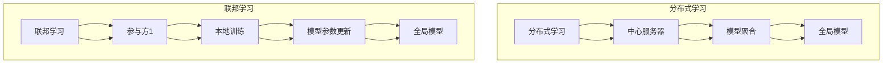

                 

### 联邦学习的背景和重要性

联邦学习（Federated Learning）是一种新兴的分布式机器学习技术，其核心思想是让多个参与方（通常是一个数据集）在不共享数据的情况下共同训练出一个全局模型。这种技术的出现，旨在解决传统分布式学习面临的诸多问题，如数据隐私、数据传输成本以及中心化依赖等。

#### 传统分布式学习面临的挑战

传统的分布式学习通常需要各个参与方将本地数据上传到中心服务器，然后在服务器上进行集中式训练。这种方式虽然能够提高训练速度，但也带来了以下挑战：

1. **数据隐私问题**：参与方可能不希望将敏感数据上传到中心服务器，因为这样可能会导致数据泄露。
2. **数据传输成本**：特别是在数据量大或者网络带宽有限的情况下，上传和下载数据需要大量的时间和资源。
3. **中心化依赖**：所有计算都集中在中心服务器上，一旦服务器出现问题，整个分布式系统都会受到影响。

#### 联邦学习的核心优势

联邦学习通过以下方式解决了传统分布式学习的挑战：

1. **隐私保护**：联邦学习允许参与方在本地训练模型，并只共享模型参数，而不是原始数据。这有效地保护了参与方的隐私。
2. **数据本地化**：由于数据不离开参与方的本地设备，因此减少了数据传输的成本和时间。
3. **去中心化**：联邦学习去除了对中心服务器的依赖，提高了系统的可靠性和容错性。

#### 联邦学习的基本概念

联邦学习涉及以下几个核心概念：

1. **全局模型（Global Model）**：全局模型是所有参与方共同训练的目标模型。
2. **本地模型（Local Model）**：每个参与方在自己的数据集上训练的模型。
3. **模型更新（Model Update）**：参与方通过共享模型参数来更新本地模型，并逐步接近全局模型。
4. **通信协议（Communication Protocol）**：参与方之间如何交换模型参数和数据。
5. **隐私保护机制（Privacy Protection Mechanism）**：如差分隐私、加密等，确保数据在传输和共享过程中的隐私。

#### 联邦学习的工作流程

联邦学习的工作流程可以概括为以下几个步骤：

1. **初始化全局模型**：初始化一个全局模型，并将其发送给所有参与方。
2. **本地训练**：每个参与方在自己的数据集上训练本地模型，并记录模型参数的变化。
3. **模型聚合**：参与方将本地模型的参数更新发送给中心服务器，中心服务器进行聚合，更新全局模型。
4. **迭代更新**：重复步骤2和3，直到全局模型收敛或达到预设的训练次数。

通过上述工作流程，联邦学习能够在保护数据隐私的同时，实现分布式训练和优化，这是其在各个领域广泛应用的基础。

### 核心概念与联系：分布式学习与联邦学习的对比

在探讨联邦学习的核心概念和联系时，我们首先需要理解分布式学习（Distributed Learning）和联邦学习（Federated Learning）之间的关系和区别。分布式学习和联邦学习都是解决大规模数据集机器学习问题的方法，但它们的核心理念、实现方式和应用场景有所不同。

#### 分布式学习的定义与特点

分布式学习是指将一个大的数据集分成多个子集，并分布到多个计算节点上进行训练。每个节点独立地训练自己的模型，并在训练完成后将模型结果汇总到中心服务器，最终形成一个全局模型。这种方法的优点是可以利用多台计算机的并行计算能力，提高训练速度和效率。然而，分布式学习也带来了一些挑战：

1. **数据同步**：各个节点在训练过程中需要同步模型参数，以确保最终能够合并成一个全局模型。
2. **通信成本**：节点之间的数据传输和同步过程可能会消耗大量的网络带宽和计算资源。
3. **隐私问题**：尽管分布式学习可以在本地训练模型，但最终需要将本地数据上传到中心服务器，这可能会导致隐私泄露的问题。

#### 联邦学习的定义与特点

联邦学习则是一种更加分布式的机器学习技术，其核心思想是让多个参与方在不共享数据的情况下，通过模型参数的共享和聚合来共同训练一个全局模型。联邦学习的关键特点如下：

1. **数据隐私保护**：参与方不需要将原始数据发送到中心服务器，只需要共享模型参数，从而避免了数据泄露的风险。
2. **数据本地化**：所有计算和存储都在本地进行，减少了数据传输的需求，降低了通信成本。
3. **去中心化架构**：联邦学习通过去除了对中心服务器的依赖，提高了系统的可靠性和容错性。

#### 分布式学习与联邦学习的联系与区别

分布式学习和联邦学习之间既有联系又有区别。它们之间的联系主要体现在以下几个方面：

1. **目标**：两者都是为了解决大规模数据集的机器学习问题，提高训练效率和效果。
2. **分布式架构**：两者都利用了分布式计算和存储的优势，通过将任务分布在多个节点上来提高计算能力。
3. **模型聚合**：无论是分布式学习还是联邦学习，最终都需要将各个节点的模型结果进行聚合，形成全局模型。

它们之间的区别主要体现在以下几个方面：

1. **数据传输**：分布式学习需要上传本地数据到中心服务器，而联邦学习则不需要上传原始数据，只需要共享模型参数。
2. **隐私保护**：分布式学习在数据上传过程中可能面临隐私泄露的问题，而联邦学习通过参数共享的方式有效地解决了这个问题。
3. **计算资源**：分布式学习通常需要更强的中心化计算资源，而联邦学习则更多地依赖于参与方的本地计算资源。

#### Mermaid流程图

为了更好地展示分布式学习和联邦学习之间的关系，我们可以使用Mermaid流程图进行说明。



通过这个流程图，我们可以清晰地看到分布式学习和联邦学习在工作流程上的不同点，以及它们如何通过模型参数的共享和聚合来实现共同的目标。

### 联邦学习中的核心算法原理

在联邦学习中，核心算法的设计和实现是确保模型训练效果和隐私保护的关键。本文将详细介绍联邦学习中的几种关键算法，包括模型更新算法、优化算法和隐私保护算法，并通过伪代码和数学模型进行分析。

#### 模型更新算法

模型更新算法是联邦学习的核心，负责参与方之间模型参数的共享和聚合。以下是一个简化的模型更新算法伪代码：

```python
def federated_model_update(global_model, local_models, learning_rate, communication_protocol):
    updated_global_model = global_model.copy()
    
    for local_model in local_models:
        model_diff = communication_protocol.send_model_diff(local_model)
        updated_global_model = update_global_model(updated_global_model, model_diff, learning_rate)
    
    return updated_global_model
```

在这个伪代码中，`global_model` 是全局模型，`local_models` 是各个参与方的本地模型，`learning_rate` 是学习率，`communication_protocol` 是通信协议。算法的基本流程如下：

1. 复制全局模型为更新后的全局模型。
2. 遍历所有本地模型，通过通信协议获取每个本地模型的参数差异（`model_diff`）。
3. 将每个模型差异与全局模型进行聚合，更新全局模型。

数学模型可以表示为：

$$
\text{updated\_global\_model} = \text{global\_model} + \sum_{i=1}^{N} \alpha_i \cdot \text{model\_diff}_i
$$

其中，$\alpha_i$ 是第 $i$ 个本地模型的权重，通常可以通过学习率进行调节。

#### 优化算法

优化算法用于调整模型参数，以最小化损失函数并提高模型性能。在联邦学习中，常用的优化算法包括梯度下降（Gradient Descent）和其变体，如Adam优化器。以下是一个简化的联邦梯度下降算法伪代码：

```python
def federated_gradient_descent(global_model, local_models, learning_rate, loss_function):
    updated_global_model = global_model.copy()
    
    for local_model in local_models:
        local_loss = loss_function(local_model)
        local_gradient = compute_gradient(local_model, local_loss)
        updated_global_model = update_global_model(updated_global_model, local_gradient, learning_rate)
    
    return updated_global_model
```

在这个伪代码中，`loss_function` 是损失函数，`compute_gradient` 是计算梯度的函数。算法的基本流程如下：

1. 复制全局模型为更新后的全局模型。
2. 遍历所有本地模型，计算每个本地模型的损失函数值和梯度。
3. 将所有梯度和全局模型进行聚合，更新全局模型。

数学模型可以表示为：

$$
\text{updated\_global\_model} = \text{global\_model} - \alpha \cdot \sum_{i=1}^{N} \text{gradient}_i
$$

其中，$\alpha$ 是学习率。

#### 隐私保护算法

在联邦学习中，隐私保护至关重要。常用的隐私保护算法包括差分隐私（Differential Privacy）和安全多方计算（Secure Multi-Party Computation）。以下是一个简化的差分隐私算法伪代码：

```python
def federated_diff隐私隐私(global_model, local_models, privacy_budget):
    updated_global_model = global_model.copy()
    
    for local_model in local_models:
        model_diff = secure_mpc.compute_model_diff(local_model)
        noise = generate_noise(privacy_budget)
        updated_global_model = update_global_model(updated_global_model, model_diff + noise)
    
    return updated_global_model
```

在这个伪代码中，`privacy_budget` 是隐私预算，`generate_noise` 是生成噪声的函数，`secure_mpc` 是安全多方计算库。算法的基本流程如下：

1. 复制全局模型为更新后的全局模型。
2. 遍历所有本地模型，通过安全多方计算获取每个本地模型的参数差异（`model_diff`）。
3. 为每个模型差异添加噪声，以保护隐私。
4. 更新全局模型。

数学模型可以表示为：

$$
\text{updated\_global\_model} = \text{global\_model} + \sum_{i=1}^{N} (\text{model\_diff}_i + \text{noise}_i)
$$

其中，$\text{noise}_i$ 是为第 $i$ 个本地模型差异添加的噪声。

通过上述伪代码和数学模型，我们可以看到联邦学习中的核心算法是如何协同工作的，以确保模型训练效果的同时保护数据隐私。

### 数学模型与公式详解

在联邦学习框架下，数学模型和公式是理解和实现联邦学习算法的核心。以下我们将详细探讨联邦学习中的主要数学模型和公式，包括优化问题、损失函数、隐私预算等，并通过具体例子进行说明。

#### 优化问题

联邦学习中的优化问题是核心，它涉及如何通过参与方的本地模型参数更新全局模型。在优化问题中，我们通常使用的是最小二乘法（Least Squares）或最小化交叉熵损失（Cross-Entropy Loss）。

##### 最小二乘法

假设我们有 $N$ 个参与方，每个参与方 $i$ 的本地数据集为 $D_i$，本地模型参数为 $\theta_i$，全局模型参数为 $\theta$。最小二乘法的目标是最小化所有参与方本地模型与全局模型之间的误差平方和：

$$
\min_{\theta} \sum_{i=1}^{N} \sum_{(x, y) \in D_i} (\theta^T x - y)^2
$$

##### 最小化交叉熵损失

在某些场景中，我们更倾向于使用最小化交叉熵损失来训练分类模型：

$$
\min_{\theta} \sum_{i=1}^{N} \sum_{(x, y) \in D_i} -y \cdot \log(\sigma(\theta^T x))
$$

其中，$\sigma(z) = \frac{1}{1 + e^{-z}}$ 是 sigmoid 函数，用于将模型的输出转化为概率。

#### 损失函数

在联邦学习框架中，损失函数用于评估全局模型在各个参与方数据集上的表现。常用的损失函数包括均方误差（MSE）、均方根误差（RMSE）和交叉熵损失。

##### 均方误差（MSE）

$$
\text{MSE} = \frac{1}{N} \sum_{i=1}^{N} \sum_{(x, y) \in D_i} (\theta^T x - y)^2
$$

##### 均方根误差（RMSE）

$$
\text{RMSE} = \sqrt{\text{MSE}}
$$

##### 交叉熵损失（Cross-Entropy Loss）

$$
\text{CE} = -\frac{1}{N} \sum_{i=1}^{N} \sum_{(x, y) \in D_i} y \cdot \log(\sigma(\theta^T x))
$$

#### 隐私预算

在联邦学习中，隐私预算（Privacy Budget）是一个重要的概念，它用于量化数据隐私泄露的风险。差分隐私（Differential Privacy）是常用的隐私保护技术，其核心是添加噪声来保护数据。

##### 差分隐私

差分隐私通过在输出中添加拉普拉斯分布（Laplace Distribution）的噪声来保护隐私，其公式为：

$$
\text{output} = \text{true\_output} + \text{Laplace(\alpha)}
$$

其中，$\alpha$ 是噪声的强度，通常称为拉普拉斯参数，其值越大，隐私保护越强。

##### 隐私预算管理

隐私预算通常表示为 $\epsilon$，它决定了可以承受的最大隐私泄露量。在联邦学习过程中，我们通过以下公式管理隐私预算：

$$
\epsilon_t = \epsilon_0 - \sum_{i=1}^{N} \log(1 + \alpha_i)
$$

其中，$\epsilon_0$ 是初始隐私预算，$\alpha_i$ 是第 $i$ 个参与方在当前迭代的隐私泄露量。

#### 例子说明

假设我们有两个参与方 $A$ 和 $B$，每个参与方都有一个本地模型，分别在本地数据集上训练。全局模型为 $\theta$，本地模型参数分别为 $\theta_A$ 和 $\theta_B$。我们使用最小二乘法来优化全局模型，并采用差分隐私来保护隐私。

1. **优化问题**：

$$
\min_{\theta} \left[ (\theta^T x_A - y_A)^2 + (\theta^T x_B - y_B)^2 \right]
$$

2. **损失函数**：

假设我们使用均方误差（MSE）作为损失函数：

$$
\text{MSE} = \frac{1}{2} \left[ (\theta^T x_A - y_A)^2 + (\theta^T x_B - y_B)^2 \right]
$$

3. **隐私预算管理**：

初始隐私预算 $\epsilon_0 = 1$，每个参与方的隐私泄露量 $\alpha_A = 0.1$ 和 $\alpha_B = 0.2$，则当前迭代的隐私预算为：

$$
\epsilon_t = 1 - \log(1 + 0.1) - \log(1 + 0.2) \approx 0.535
$$

通过上述数学模型和公式的讲解，我们可以看到联邦学习在优化问题和隐私保护方面的基本原理。理解这些模型和公式对于深入研究和应用联邦学习至关重要。

### 联邦学习在医疗领域的应用

联邦学习在医疗领域的应用具有显著的优势，特别是在保护患者隐私和实现数据共享方面。以下将探讨联邦学习在医疗数据隐私保护中的重要性、应用案例以及面临的挑战和解决方案。

#### 医疗数据隐私保护的重要性

医疗数据通常包含敏感的患者信息，如诊断记录、病史、基因序列等。这些数据一旦泄露，不仅会对患者的隐私造成严重威胁，还可能引发法律和安全问题。传统的方法，如数据上传到中心服务器进行集中式处理，难以满足日益严格的隐私保护法规，如《通用数据保护条例》（GDPR）和《健康保险可携性与责任法》（HIPAA）。

联邦学习提供了一种在保护隐私的同时进行数据共享和协同分析的方法。通过在本地设备上训练模型，联邦学习确保了数据不离开患者的控制范围，从而降低了数据泄露的风险。

#### 应用案例

**1. 疾病预测和诊断**

联邦学习可以用于开发疾病预测和诊断模型，如心脏病、糖尿病和癌症等。在这种应用中，各个医疗机构可以在不共享患者原始数据的情况下，共同训练一个全局模型。例如，一家医院的医生可以利用自己的数据训练一个心脏病预测模型，同时另一家医院也可以利用自己的数据集进行类似的训练。最终，这些本地模型通过联邦学习算法进行聚合，形成具有更高预测准确性的全局模型。

**2. 医疗图像分析**

医疗图像分析是联邦学习在医疗领域的重要应用之一。不同医疗机构可能有各自的医疗图像数据集，通过联邦学习，这些数据可以在不泄露隐私的情况下进行协同分析。例如，可以使用联邦学习算法来训练一个肺结节检测模型，各个医院的CT扫描数据可以作为训练数据，模型训练完成后，各医院可以共享模型的预测结果，从而提高诊断的准确性和效率。

**3. 新药开发**

新药开发需要大量的临床数据，这些数据往往分布在不同的研究机构和制药公司之间。联邦学习可以用于开发跨机构的新药发现模型，各个参与方可以在不共享敏感数据的情况下共同训练模型。例如，一家制药公司可以利用自己的化合物数据集与一家研究机构的生物标志物数据集进行联邦学习，以发现新的治疗组合。

#### 面临的挑战和解决方案

**1. 模型质量**

联邦学习中的模型质量受到参与方数据分布和质量的影响。如果某些参与方提供的数据质量较低，可能会影响全局模型的性能。解决这一问题的方法包括：

- **数据预处理**：对参与方的数据进行预处理，如数据清洗、标准化等，以提高数据质量。
- **模型融合**：结合多个参与方的模型，通过模型融合技术（如加权平均或集成学习）来提高全局模型的稳健性和准确性。

**2. 隐私保护**

尽管联邦学习能够保护数据隐私，但在实施过程中仍可能面临隐私泄露的风险。以下是一些解决方案：

- **差分隐私**：采用差分隐私技术，为模型参数的更新添加噪声，以保护参与方的隐私。
- **同态加密**：使用同态加密技术，允许在加密数据上进行计算，从而确保数据在传输和存储过程中的隐私。
- **安全多方计算**：通过安全多方计算技术，参与方可以在不共享数据的情况下进行计算，从而进一步保护隐私。

**3. 模型解释性**

联邦学习模型通常较为复杂，其解释性可能较差。这对于需要模型可解释性的医疗应用来说是一个挑战。解决这一问题的方法包括：

- **模型简化**：通过模型简化技术，如降维和特征选择，来提高模型的解释性。
- **可解释性工具**：开发可解释性工具和算法，帮助医生和研究人员理解模型的内部工作机制。

通过上述措施，联邦学习在医疗领域的应用有望实现数据隐私保护与医疗进步的双赢。

### 联邦学习在金融领域的应用

联邦学习在金融领域展现出了巨大的潜力，尤其是在隐私保护和个性化服务方面。以下将详细探讨联邦学习在金融领域的应用场景、实际案例和面临的挑战与解决方案。

#### 应用场景

**1. 信用风险评估**

信用风险评估是金融领域的一个重要环节。金融机构需要评估客户的信用状况，以决定是否批准贷款或信用卡申请。传统的信用评分模型通常依赖于中心化的数据集，这可能导致数据泄露的风险。通过联邦学习，金融机构可以在不共享客户原始数据的情况下，共同训练一个全局信用评分模型。例如，银行A和银行B可以使用各自的客户数据，通过联邦学习算法共同训练一个信用评分模型，从而提高评分的准确性和可靠性，同时保护客户隐私。

**2. 个性化金融服务**

联邦学习可以帮助金融机构为每位客户提供个性化的金融服务，如贷款利率、信用卡额度等。通过联邦学习，金融机构可以分析客户的行为数据、交易记录等，以提供更加精准的个性化服务。例如，一家银行可以利用联邦学习算法分析客户的消费习惯，为不同客户提供量身定制的信用卡服务，从而提高客户的满意度和忠诚度。

**3. 网络安全监控**

网络安全是金融领域的一个关键问题。联邦学习可以用于开发实时监测网络攻击的模型，如钓鱼网站检测、恶意软件识别等。金融机构可以在不共享客户数据和网络安全数据的情况下，通过联邦学习共同训练一个全局的网络安全模型。这种去中心化的安全监控系统能够有效提高网络防御能力，同时保护客户隐私。

#### 实际案例

**1. 联邦学习在信用卡欺诈检测中的应用**

信用卡欺诈检测是金融领域的一个重要应用。一家国际信用卡公司利用联邦学习技术，与多家银行合作，共同训练一个全局的欺诈检测模型。参与方在不共享客户交易数据的情况下，通过联邦学习算法更新模型参数，从而提高了欺诈检测的准确率。此外，该模型还能够实时适应不断变化的欺诈模式，保持高效的检测能力。

**2. 联邦学习在个性化贷款利率中的应用**

一家大型银行利用联邦学习技术，根据客户的财务状况、信用记录、消费习惯等多维度数据，为每位客户提供个性化的贷款利率。通过联邦学习算法，银行可以在保护客户隐私的同时，优化贷款利率策略，提高客户的满意度和银行利润。

#### 面临的挑战和解决方案

**1. 模型一致性和协调性**

在联邦学习环境中，参与方的本地数据和模型可能存在不一致，这可能导致全局模型的性能下降。解决这一问题的方法包括：

- **数据预处理**：在联邦学习开始之前，对各参与方数据进行预处理，如数据清洗、标准化等，以确保数据的一致性和质量。
- **模型协调**：通过模型协调技术，如模型融合和一致性优化，确保全局模型的稳定性和准确性。

**2. 隐私保护与计算效率**

联邦学习需要在保护隐私的同时，保持高效的计算性能。以下是一些解决方案：

- **差分隐私**：采用差分隐私技术，为模型参数的更新添加噪声，以保护参与方的隐私。
- **压缩感知**：使用压缩感知技术，降低数据的维度，从而提高计算效率。
- **异构计算**：利用参与方的不同计算资源，如CPU、GPU和FPGA等，优化计算性能。

**3. 法规遵从**

金融领域面临严格的法律法规，如《通用数据保护条例》（GDPR）和《金融服务现代化法案》（FMSA）等。联邦学习需要确保在法律框架内进行数据处理。解决方案包括：

- **合规审计**：定期进行合规审计，确保联邦学习系统的操作符合相关法律法规。
- **透明性**：开发透明、可解释的联邦学习算法，以便监管机构和客户了解数据处理的流程和规则。

通过上述措施，联邦学习在金融领域的应用有望实现隐私保护、个性化服务和高效风险管理的目标，为金融行业带来革命性的变化。

### 联邦学习在其他领域的应用

联邦学习作为一种先进的分布式学习技术，不仅在医疗和金融领域有着广泛的应用，还在工业、零售、教育等多个领域展现出了巨大的潜力。以下将详细探讨联邦学习在这些领域的应用场景、案例以及面临的挑战与解决方案。

#### 工业领域

在工业领域，联邦学习被广泛应用于制造过程优化、设备故障预测和质量控制等方面。

**应用场景**：

1. **制造过程优化**：通过联邦学习，不同工厂可以在不共享具体生产数据的情况下，共同优化生产流程，提高生产效率和产品质量。例如，一家制造企业可以利用联邦学习算法分析不同生产线的数据，以发现潜在的问题和改进点。
2. **设备故障预测**：联邦学习可以帮助企业预测设备故障，提前进行维护，减少停机时间和维修成本。例如，一家制造工厂可以利用联邦学习算法分析设备传感器数据，提前预测设备的潜在故障。

**实际案例**：

1. **某大型制造企业**：某大型制造企业利用联邦学习技术，将分布在不同地理位置的工厂数据汇总，共同训练一个预测设备故障的模型。通过这种去中心化的方式，不仅提高了预测的准确性，还保护了工厂的机密数据。
2. **设备维护优化**：某机械制造公司采用联邦学习对生产设备的维护进行优化。通过分析设备的运行数据，公司能够提前预测设备的故障，制定更有效的维护计划，从而降低运营成本。

**面临的挑战和解决方案**：

- **数据一致性**：不同工厂的设备数据可能存在不一致，这会影响联邦学习模型的性能。解决方案包括统一数据标准，进行数据预处理。
- **计算资源**：联邦学习通常需要大量的计算资源。解决方案包括利用云计算和边缘计算，提高计算效率。

#### 零售领域

在零售领域，联邦学习被广泛应用于个性化推荐、库存管理和需求预测等方面。

**应用场景**：

1. **个性化推荐**：通过联邦学习，零售企业可以在保护用户隐私的情况下，为每位客户提供个性化的购物推荐。例如，一家电子商务公司可以利用联邦学习分析用户的浏览和购买历史数据，为每位用户推荐感兴趣的商品。
2. **库存管理**：联邦学习可以帮助零售企业优化库存管理，降低库存成本。例如，零售企业可以利用联邦学习算法分析销售数据，预测未来的需求趋势，从而合理安排库存。

**实际案例**：

1. **某电子商务平台**：某大型电子商务平台利用联邦学习技术，在不共享用户数据的情况下，为每位用户提供个性化的购物推荐。通过这种方式，平台提高了用户满意度和转化率。
2. **库存优化**：某零售企业采用联邦学习对库存进行优化。通过分析销售数据和历史库存数据，企业能够预测未来的需求，合理安排库存，减少库存积压和缺货情况。

**面临的挑战和解决方案**：

- **数据隐私**：联邦学习需要在保护用户隐私的前提下进行数据共享。解决方案包括采用差分隐私和安全多方计算等技术。
- **数据质量**：不同零售门店的数据质量可能不一致，影响模型的准确性。解决方案包括数据清洗和标准化。

#### 教育领域

在教育领域，联邦学习被广泛应用于个性化教育、学习效果评估和课程推荐等方面。

**应用场景**：

1. **个性化教育**：通过联邦学习，教育机构可以根据每位学生的学习行为和成绩，提供个性化的教学内容和练习。例如，一个在线教育平台可以利用联邦学习分析学生的互动数据，为每位学生推荐适合的学习资源。
2. **学习效果评估**：联邦学习可以帮助教育机构评估学生的学习效果，识别学习困难点。例如，通过分析学生的作业数据和考试结果，教育机构能够了解学生的学习情况，并采取相应的教学调整。

**实际案例**：

1. **某在线教育平台**：某在线教育平台利用联邦学习技术，分析学生的学习数据，为每位学生推荐个性化的学习内容和练习。通过这种方式，平台提高了学生的学习效果和参与度。
2. **课程推荐**：某大学采用联邦学习对课程进行推荐。通过分析学生的选课数据和学习表现，大学能够为每位学生推荐最适合的课程组合，提高教学质量。

**面临的挑战和解决方案**：

- **数据共享**：联邦学习需要确保数据在不同教育机构之间的安全共享。解决方案包括建立可信的数据共享平台和采用加密技术。
- **教学个性化**：个性化教育需要根据学生的不同需求进行教学调整，这对教育机构提出了更高的要求。解决方案包括开发智能教学系统，提高教学个性化水平。

通过在工业、零售、教育等领域的应用，联邦学习正在逐步改变各行业的运作方式，提高效率和用户体验。尽管面临一些挑战，但随着技术的不断进步和解决方案的不断完善，联邦学习在各个领域的应用前景将更加广阔。

### 最佳实践与注意事项

在联邦学习项目中，为了确保模型训练效果和数据隐私，以下是一些最佳实践和注意事项：

#### 数据预处理

1. **一致性清洗**：确保所有参与方进行一致的数据清洗，如去除缺失值、重复值和异常值。
2. **标准化**：对数据进行标准化处理，使得不同参与方的数据尺度一致，避免数据偏斜。
3. **数据分片**：将数据划分为训练集和验证集，同时确保每个参与方都拥有部分训练数据和验证数据。

#### 模型设计

1. **选择合适模型**：根据任务需求选择适合的模型，如使用深度神经网络进行复杂任务，而简单任务则可以考虑线性模型。
2. **简化模型**：对于大型模型，可以通过剪枝、量化等技术进行简化，提高计算效率。
3. **调整超参数**：通过网格搜索、随机搜索等方法，选择最优的超参数配置。

#### 隐私保护

1. **差分隐私**：为模型参数更新添加差分隐私保护，如使用拉普拉斯机制或高斯机制。
2. **同态加密**：使用同态加密技术，允许在加密数据上进行计算，确保数据隐私。
3. **安全多方计算**：采用安全多方计算技术，如 Secure Multi-Party Computation（SMPC）或 Fully Homomorphic Encryption（FHE），确保参与方在不共享数据的情况下进行计算。

#### 系统优化

1. **通信协议**：选择高效的通信协议，如梯度聚合或模型聚合，减少通信开销。
2. **负载均衡**：确保所有参与方的计算负载均衡，避免某些参与方负载过重。
3. **边缘计算**：利用边缘计算资源，减少中心服务器的负载，提高系统效率。

#### 注意事项

1. **数据隐私法规**：确保项目遵守相关数据隐私法规，如 GDPR、HIPAA 等。
2. **安全性**：确保系统安全，防范外部攻击和数据泄露。
3. **透明性**：保持系统的透明性，确保所有参与者了解系统的运行机制和数据使用方式。

通过遵循这些最佳实践和注意事项，联邦学习项目能够更加高效、安全地进行，为各个领域带来实际价值。

### 小结

本文详细探讨了联邦学习隐私保护的重要性，包括其背景、核心概念、算法原理、数学模型及应用场景。联邦学习通过保护数据隐私、降低数据传输成本和去中心化计算，为分布式学习提供了有效的解决方案。在医疗、金融、工业等各个领域，联邦学习展现了其强大的应用潜力。然而，联邦学习在实现过程中仍面临数据一致性和隐私保护等挑战，需要通过最佳实践和技术创新来克服。随着联邦学习技术的不断发展和完善，其将在未来发挥更加重要的作用，推动各个领域的数据共享和协同创新。

### 拓展阅读

联邦学习作为一项前沿技术，其理论和方法正不断丰富和发展。以下是几篇推荐的拓展阅读，旨在帮助读者深入了解联邦学习的最新研究动态和实用技巧：

1. **《联邦学习：原理、算法与实践》** - 这本书详细介绍了联邦学习的理论基础、算法实现和应用案例，是联邦学习领域的权威著作。

2. **《隐私计算与联邦学习》** - 本书重点讨论了联邦学习中的隐私保护技术，包括差分隐私、同态加密和安全多方计算等，对隐私保护机制进行了深入分析。

3. **《联邦学习在医疗领域的应用》** - 这篇论文探讨了联邦学习在医疗数据隐私保护中的应用，分析了联邦学习在疾病预测、诊断和个性化治疗等方面的潜力。

4. **《联邦学习在金融领域的实践》** - 本文通过实际案例，详细介绍了联邦学习在金融领域中的应用，包括信用风险评估、个性化金融服务和网络安全监控等。

5. **《工业4.0背景下的联邦学习》** - 这篇文章讨论了联邦学习在工业4.0环境中的应用，特别是在制造过程优化、设备故障预测和质量控制等方面的案例研究。

6. **《联邦学习在零售领域的应用》** - 本文分析了联邦学习在零售领域的应用，包括个性化推荐、库存管理和需求预测等，展示了联邦学习如何提高零售业的运营效率。

7. **《教育领域的联邦学习：机遇与挑战》** - 这篇文章探讨了联邦学习在教育领域中的应用，包括个性化教育、学习效果评估和课程推荐等，分析了联邦学习对教育方式的变革。

通过阅读这些文章，读者可以全面了解联邦学习的最新进展和实际应用，为未来的研究和实践提供参考。同时，读者还可以关注相关领域的研究论文、技术博客和学术会议，以保持对联邦学习前沿动态的持续关注。

