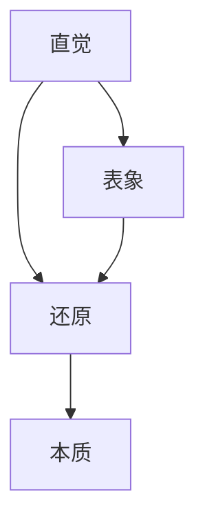

                 

### 现象学的起源与发展

现象学，作为一个哲学流派，起源于20世纪初。它的起源可以追溯到德国哲学家爱德蒙·胡塞尔（Edmund Husserl）的工作。胡塞尔于1859年出生于德国，他的思想在19世纪末和20世纪初的哲学环境中逐渐成形。胡塞尔对传统的哲学方法和科学方法进行了深刻的反思，试图寻找一种能够揭示事物本质的方法。

现象学的基本理念是“回到事物本身”（回到事物本质）。这个理念强调，我们不能依赖先入为主的观念或假设来理解事物，而是应该直接面对事物本身，通过直觉来把握事物的本质。胡塞尔认为，直觉是一种纯粹的、未被污染的意识活动，它能够直接接触到事物的本质。

胡塞尔在其著作《逻辑研究》（Logical Investigations）和《纯粹现象学通论》（General Introduction to a Pure Phenomenology）中，详细阐述了他的现象学方法。他提出了“还原法”（Reduction），这是一种思想实验，通过它，我们可以将日常生活的预设和偏见去除，从而接触到纯粹的现象。

胡塞尔的现象学方法对后来的哲学家产生了深远的影响，特别是在存在主义和结构主义等领域。他的学生和追随者，如马丁·海德格尔（Martin Heidegger），进一步发展了现象学，使其在20世纪哲学中占据了重要的位置。

### 胡塞尔与海德格尔的思想背景

爱德蒙·胡塞尔（Edmund Husserl）和马丁·海德格尔（Martin Heidegger）是现象学发展史上两位极为重要的哲学家。他们的思想虽然有着深刻的联系，但也在很多方面存在显著的差异。

胡塞尔，作为现象学的奠基人，他的哲学生涯充满了对知识和现实的深刻反思。他生于1859年，早年接受了传统的哲学和科学教育。胡塞尔深受黑格尔和康德的影响，但他也对这些哲学体系进行了批判。他认为，传统的哲学方法过于依赖于抽象和概念，而忽视了事物本身的直觉性。

胡塞尔的核心哲学观点包括“直觉”和“还原法”。他认为直觉是一种直接面对事物本质的方式，而还原法则是通过去除所有附加的假设和偏见，来揭示事物的纯粹现象。这种思想方法在胡塞尔的《逻辑研究》和《纯粹现象学通论》等著作中得到了详细阐述。

胡塞尔对现象学的贡献在于，他提供了一种全新的哲学方法论，这种方法论强调直接面对事物本身，而不是依赖先入为主的概念。胡塞尔的工作为后来的现象学家，如海德格尔，提供了重要的理论基础。

马丁·海德格尔，生于1889年，是胡塞尔的学生和追随者。海德格尔在胡塞尔的哲学背景下，对现象学进行了自己的发展。海德格尔与胡塞尔的不同在于，他更关注存在本身，而不是现象的描述。

海德格尔的核心哲学观点是“存在”和“时间”。他认为，存在不是静态的，而是动态的、流变的。他提出了“存在论现象学”（ontological phenomenology），试图通过探讨存在和时间的本质，来理解人类的存在状态。

海德格尔的《存在与时间》（Being and Time）是他的代表作，在这部作品中，他详细阐述了“存在”的概念，并探讨了人类在时间中的存在方式。海德格尔的思想对后来的哲学流派，如存在主义和解释学，产生了深远的影响。

### 胡塞尔现象学的基本概念

胡塞尔的现象学方法是一个多层次、多维度的哲学体系，其核心概念包括直觉、还原和本质。

直觉，在胡塞尔的现象学中，是一种纯粹的意识活动，它直接面对事物本身，不受任何预设或偏见的影响。直觉是胡塞尔现象学方法的基础，通过直觉，我们可以把握事物的本质，而不是其表象。

还原法，是胡塞尔提出的一种思想实验，目的是去除所有附加的假设和偏见，以揭示事物的纯粹现象。还原法分为两个步骤：首先是对对象的“自然态度”进行悬置，即暂时不考虑对象是如何被我们所知的；其次是通过逐步还原，去除所有附加的属性，直到只剩下纯粹的现象。

本质，是胡塞尔现象学的另一个核心概念。胡塞尔认为，本质是事物最基本、最核心的特性，它是通过直觉和还原法来揭示的。与表象不同，本质是普遍的、不变的，它是事物真正的“自我”。

胡塞尔的现象学方法通过对直觉、还原和本质的探讨，试图揭示事物最本质的一面，这种方法在哲学研究中具有重要的应用价值。以下是一个简单的Mermaid流程图，展示了胡塞尔现象学的基本步骤：



在这个流程图中，直觉是起点，通过还原法，我们逐渐去除表象，最终达到本质。这种方法不仅为哲学研究提供了新的视角，也为后来的现象学家提供了理论基础。

### 胡塞尔的核心著作与思想

爱德蒙·胡塞尔的核心著作奠定了现象学的理论基础，其中《逻辑研究》和《纯粹现象学通论》尤为重要。

《逻辑研究》是胡塞尔早期的代表作，出版于1901年。在这部作品中，胡塞尔批判了传统逻辑和科学方法，提出了一种新的逻辑方法，称为“直觉主义逻辑”。他强调，逻辑研究应该直接面对现实事物，而不是依赖于抽象的概念和符号。胡塞尔认为，直觉是理解逻辑关系的唯一途径，通过直觉，我们可以直接把握事物的本质。

《纯粹现象学通论》是胡塞尔晚年的代表作，出版于1928年。在这部作品中，胡塞尔系统地阐述了现象学的方法和理论。他提出了“还原法”和“本质直观”的概念，并详细阐述了现象学的应用范围。胡塞尔认为，现象学不仅适用于哲学，还可以应用于心理学、社会科学和自然科学。

胡塞尔的思想对后来的哲学家产生了深远的影响。他的直觉主义逻辑方法启发了数学家希尔伯特的形式主义逻辑，而他的现象学方法则影响了存在主义和结构主义等哲学流派。

### 海德格尔的生平与哲学发展

马丁·海德格尔（Martin Heidegger）生于1889年，是德国著名的哲学家。他的哲学思想深受胡塞尔现象学的影响，但他在许多方面对现象学进行了深刻的批判和发展。

海德格尔的哲学生涯可以分为三个阶段。第一阶段（1916-1924年），他在弗莱堡大学任教，发表了多篇论文，探讨存在论和本体论的问题。这一阶段，他提出了“存在论现象学”的概念，强调存在的动态性和流变性。

第二阶段（1924-1933年），海德格尔在弗莱堡大学担任校长，并发表了《存在与时间》（Being and Time）这一重要著作。在这部作品中，他详细阐述了存在的本质，并探讨了人类在时间中的存在方式。《存在与时间》被认为是现代哲学史上的经典之作，对后来的哲学流派产生了深远的影响。

第三阶段（1933-1945年），海德格尔的政治立场受到了广泛批评。他曾在纳粹时期担任弗莱堡大学校长，这一行为使他背负了沉重的道德负担。战后，他继续从事哲学研究，并发表了《诗人何为》（Poetry, Language, Thought）等著作。

海德格尔的哲学思想对存在主义和解释学产生了重要影响。他的“存在论现象学”试图揭示存在的本质，而他的“诗意地居住”的理念则启发了后来的生态哲学和文化哲学。

### 海德格尔现象学的基本概念

马丁·海德格尔的现象学方法，以其对“存在”和“时间”的深刻探讨而闻名。他的核心概念包括“存在”（Dasein）、“存在论”（Ontology）和“诗意地居住”（Dwelling）。

“存在”（Dasein），即“此在”，是海德格尔哲学中的中心概念。他认为，存在不是静态的实体，而是一种动态的、流变的过程。Dasein不仅指人类的存在，也指所有事物在时间中的存在方式。海德格尔强调，存在是在时间中展现的，它是一种持续的存在和消失的过程。

“存在论”（Ontology），在海德格尔的哲学中，是研究存在的本质和结构的科学。与传统的本体论不同，海德格尔的存在论关注存在的动态性和流变性。他提出了“存在论差异”（ontological difference）的概念，认为存在和本质之间存在着差异，这种差异是理解存在的关键。

“诗意地居住”（Dwelling），是海德格尔对人类存在方式的描述。他认为，人类不仅通过逻辑和理性来理解世界，还通过诗意的体验和感受来与宇宙相联系。诗意地居住是一种与自然和谐共存的方式，它超越了逻辑和理性的限制。

海德格尔的这些概念在他的《存在与时间》一书中得到了详细阐述。以下是一个Mermaid流程图，展示了海德格尔现象学的基本概念和它们之间的关系：

```mermaid
graph TD
    A[存在](#FF69B4) --> B[时间](#B0E0E6)
    B --> C[Dasein](#FFD700)
    C --> D[存在论](#DC143C)
    C --> E[诗意地居住](#87CEEB)
```

在这个流程图中，存在是起点和核心，时间是其展现方式，Dasein是存在的具体体现，存在论是研究存在的科学，而诗意地居住是人类与宇宙和谐共存的方式。

### 海德格尔的核心著作与思想

马丁·海德格尔的代表作品《存在与时间》（Being and Time）是现象学领域的重要著作，也是现代哲学史上的经典之作。在这部作品中，海德格尔探讨了存在的本质和人类的存在方式。

《存在与时间》的结构分为上下两卷。上卷主要探讨存在的本质，下卷则详细阐述了人类在时间中的存在方式。海德格尔在书中提出了“Dasein”（此在）的概念，他认为Dasein不仅指人类的存在，也包括所有事物在时间中的存在方式。

海德格尔认为，存在不是静态的，而是动态的、流变的。他提出了“存在论差异”（ontological difference）的概念，认为存在和本质之间存在着差异。这种差异是理解存在的关键。海德格尔还探讨了“时间性”（ temporality），他认为时间是人类存在的基础，人类的生命是在时间中展开的。

《存在与时间》不仅对后来的哲学流派，如存在主义和解释学，产生了深远的影响，也对文学、艺术和神学等领域产生了重要启示。它被视为现代哲学的里程碑，是理解海德格尔哲学思想的关键著作。

另一部重要的著作是《诗人何为》（Poetry, Language, Thought），在这部作品中，海德格尔探讨了诗与思的关系。他认为，诗不仅是语言的艺术，也是人类存在方式的一种表达。诗意的语言能够揭示存在的本质，超越逻辑和理性的限制。

海德格尔的思想不仅局限于哲学，他还对文学和艺术有着深刻的洞察。他认为，诗人和思想者 alike，都是通过语言来揭示存在的真相。他的思想启发了后来的文学批评和艺术哲学。

### 胡塞尔现象学的核心算法原理讲解

胡塞尔的现象学方法，可以被视为一种哲学算法，它通过一系列步骤，帮助我们揭示事物的本质。这个算法的核心原理包括直觉、还原和本质直观。

首先，直觉是胡塞尔现象学方法的基础。直觉是一种纯粹的、未被污染的意识活动，它直接面对事物本身，不受任何预设或偏见的影响。在现象学中，直觉是一种认知工具，通过它，我们可以直接把握事物的本质。

其次，还原法是胡塞尔提出的一种思想实验，通过它，我们可以去除所有附加的假设和偏见，以揭示事物的纯粹现象。还原法分为两个步骤：第一步是对对象的“自然态度”进行悬置，即暂时不考虑对象是如何被我们所知的；第二步是通过逐步还原，去除所有附加的属性，直到只剩下纯粹的现象。

最后，本质直观是胡塞尔现象学方法的最终目标。本质直观是通过直觉和还原法，最终揭示事物最本质的一面。本质是事物最基本、最核心的特性，它是通过直觉和还原法来把握的。

以下是一个简单的伪代码，展示了胡塞尔现象学方法的步骤：

```python
def HusserlPhenomenology(object):
    # 步骤1：直觉
    intuitive_insight = intuitive_insight(object)

    # 步骤2：悬置自然态度
    suspended_natural_attitude = suspend_natural_attitude(object)

    # 步骤3：逐步还原
    pure_phenomenon = step_by_step_reduction(suspended_natural_attitude)

    # 步骤4：本质直观
    essence = essential_intuition(pure_phenomenon)

    return essence
```

在这个伪代码中，`intuitive_insight`代表直觉，`suspend_natural_attitude`代表悬置自然态度，`step_by_step_reduction`代表逐步还原，`essential_intuition`代表本质直观。通过这个算法，我们可以逐步揭示事物的本质。

### 胡塞尔现象学的数学模型

胡塞尔的现象学方法不仅通过直觉和还原法来揭示事物的本质，还通过数学模型来阐述这些概念之间的关系。以下是一个简化的数学模型，用于描述胡塞尔现象学的核心原理。

首先，我们定义几个关键变量：

- \( E \)：表示事物的整体本质。
- \( P \)：表示事物的现象。
- \( N \)：表示自然态度。
- \( R \)：表示还原法。

现象学模型可以表示为以下等式：

$$
E = R(P \oplus N)
$$

其中，\( \oplus \) 表示还原操作，它通过去除自然态度 \( N \) 中的附加属性，来揭示事物的纯粹现象 \( P \)。最终，通过还原操作，我们得到事物的整体本质 \( E \)。

以下是一个简单的数学公式，用于描述胡塞尔现象学的核心原理：

$$
\text{本质} E = \text{现象} P - \text{自然态度} N
$$

这个公式表明，本质是通过从现象中去除自然态度的附加属性来得到的。以下是一个具体的例子：

假设我们有一个事物“苹果”，它的现象是“红色、圆形、可食用”。如果我们采用胡塞尔的还原法，去除自然态度中的附加属性，比如“可食用”，我们得到的纯粹现象是“红色、圆形”。最终，通过这些纯粹现象，我们得到苹果的本质。

### 海德格尔存在论的核心算法原理讲解

海德格尔的存在论现象学是一个复杂而深刻的哲学体系，它通过一系列的算法原理来揭示存在的本质和人类的存在方式。核心算法原理包括存在论差异、时间性和存在者的具体存在方式。

首先，存在论差异是海德格尔哲学中的一个关键概念。它强调存在和本质之间的区别。存在（Dasein）是一个动态的、流变的过程，而本质则是存在的稳定核心。以下是存在论差异的伪代码：

```python
def ExistenceDifference(Dasein):
    # 步骤1：识别存在的动态过程
    dynamic_process = identify_dynamic_process(Dasein)

    # 步骤2：确定存在的本质核心
    essence_core = determine_essence_core(Dasein)

    # 步骤3：计算存在论差异
    ontological_difference = calculate_ontological_difference(dynamic_process, essence_core)

    return ontological_difference
```

在这个算法中，`identify_dynamic_process`函数用于识别存在的动态过程，`determine_essence_core`函数用于确定存在的本质核心，`calculate_ontological_difference`函数则用于计算存在和本质之间的差异。

接下来，时间性是海德格尔哲学中的另一个核心概念。他认为，存在是在时间中展现的，时间是存在的根基。以下是时间性的伪代码：

```python
def Temporality(Dasein):
    # 步骤1：建立时间维度
    time_dimension = create_time_dimension()

    # 步骤2：将存在嵌入时间维度
    temporalized_existence = embed_existence_in_time_dimension(Dasein, time_dimension)

    # 步骤3：分析存在的流变过程
    temporal_flow = analyze_temporal_flow(temporalized_existence)

    return temporal_flow
```

在这个算法中，`create_time_dimension`函数用于建立时间维度，`embed_existence_in_time_dimension`函数用于将存在嵌入时间维度，`analyze_temporal_flow`函数则用于分析存在的流变过程。

最后，存在者的具体存在方式（Dasein）是海德格尔哲学中的核心概念。Dasein不仅指人类的存在，也包括所有事物在时间中的存在方式。以下是Dasein的伪代码：

```python
def Dasein(Dasein):
    # 步骤1：识别存在者
    existent = identify_existent(Dasein)

    # 步骤2：确定存在者的具体存在方式
    specific_existence = determine_specific_existence(existent)

    # 步骤3：分析存在者的存在状态
    existential_state = analyze_existential_state(specific_existence)

    return existential_state
```

在这个算法中，`identify_existent`函数用于识别存在者，`determine_specific_existence`函数用于确定存在者的具体存在方式，`analyze_existential_state`函数则用于分析存在者的存在状态。

通过这些算法原理，海德格尔试图揭示存在的本质和人类在时间中的存在方式，为后来的哲学流派提供了深刻的洞见。

### 海德格尔现象学的数学模型

海德格尔现象学的数学模型旨在通过数学语言来阐述其哲学思想中的核心概念，如存在、时间性和存在者。以下是一个简化的数学模型，用于描述这些概念之间的关系。

首先，我们定义几个关键变量：

- \( E \)：表示存在。
- \( T \)：表示时间。
- \( D \)：表示存在者。

存在论差异的数学模型可以表示为：

$$
E = T^{-1}(D)
$$

其中，\( T^{-1} \) 表示时间反演操作，它将存在者嵌入时间维度中，从而揭示存在的本质。这个公式表明，存在是在时间中展现的，时间是理解存在的关键。

时间性的数学模型可以表示为：

$$
T = E^T
$$

其中，\( E^T \) 表示存在者的时间展开，它反映了存在者在时间中的流变过程。这个公式表明，存在者的存在方式是在时间中不断变化的。

存在者的数学模型可以表示为：

$$
D = E \times T
$$

这个公式表明，存在者是存在和时间相互作用的结果。通过这个模型，我们可以理解存在者在时间中的具体存在方式。

以下是一个具体的例子：

假设一个存在者是一个“苹果”。它的存在（E）是一个动态的过程，时间（T）是其展现的维度，而存在者（D）是这两个变量的乘积。苹果的存在可以表示为：

$$
E_{\text{苹果}} = T_{\text{苹果}}^{-1}(D_{\text{苹果}}) = E^T_{\text{苹果}} \times T_{\text{苹果}}
$$

这个例子表明，苹果的存在是在时间中展现的动态过程，时间是理解苹果存在的关键。通过这个数学模型，我们可以更深入地理解海德格尔现象学的核心思想。

### 胡塞尔与海德格尔思想的比较分析

爱德蒙·胡塞尔和马丁·海德格尔虽然都是现象学的重要代表，但他们的思想在许多方面存在显著差异。首先，在基本观点上，胡塞尔强调直觉和还原法，试图通过直接面对事物本身来揭示其本质。而海德格尔则更关注存在本身，他认为存在是一个动态的过程，与时间紧密相连。

其次，在方法上，胡塞尔的现象学方法是一种纯粹的认识论研究，他试图通过直觉和还原法来揭示事物的本质。而海德格尔的现象学方法则更加存在论，他关注存在者的具体存在方式，以及存在在时间中的流变。

再者，在影响上，胡塞尔的现象学方法对后来的哲学流派，如存在主义和结构主义，产生了深远的影响。他的还原法和直觉主义逻辑方法为这些流派提供了理论基础。而海德格尔的存在论则对后来的存在主义和解释学产生了重要影响，他的“诗意地居住”理念启发了生态哲学和文化哲学。

总的来说，胡塞尔和海德格尔虽然在现象学的发展中起到了重要作用，但他们的思想在哲学方法、基本观点和影响上存在显著差异，这些差异不仅丰富了现象学的研究领域，也为后来的哲学流派提供了多样的理论基础。

### 现象学的两个阶段总结

现象学的发展可以分为两个主要阶段，第一阶段以爱德蒙·胡塞尔的工作为代表，第二阶段则由马丁·海德格尔进一步发展。第一阶段的特点是强调直觉和还原法，通过直接面对事物本身来揭示其本质。胡塞尔的方法论为后来的哲学家提供了重要的理论基础，他的直觉主义逻辑方法对数学和科学产生了深远影响。

第二阶段则更加关注存在本身，特别是人类在时间中的存在方式。海德格尔的存在论现象学试图揭示存在的动态性和流变性，他的思想对存在主义和解释学产生了重要影响。海德格尔的“诗意地居住”理念不仅丰富了现象学的内涵，也为后来的生态哲学和文化哲学提供了深刻的启示。

总的来说，现象学的两个阶段不仅扩展了哲学的研究领域，也为我们理解人类存在的本质提供了多样化的视角。胡塞尔和海德格尔的贡献使现象学在哲学史上占据了重要地位，他们的思想将继续影响未来的哲学发展。

### 胡塞尔与海德格尔对现象学的贡献

爱德蒙·胡塞尔和马丁·海德格尔对现象学的贡献分别体现在他们对这一哲学流派的深化和发展上。胡塞尔作为现象学的奠基者，他通过“还原法”和“本质直观”的概念，提供了一种全新的哲学方法论，使得哲学研究能够更直接地面对事物本身，而不受先入为主的观念影响。胡塞尔的工作不仅影响了后来的现象学家，也对逻辑学、数学和心理学等领域产生了深远的影响。

马丁·海德格尔则将现象学推向了存在论层面，他提出了“存在论现象学”的概念，强调存在是一个动态的过程，与时间密切相关。海德格尔的“Dasein”（此在）理论探讨了人类在时间中的存在方式，他的“诗意地居住”理念为后来的生态哲学和文化哲学提供了深刻的洞见。海德格尔的思想对存在主义和解释学的发展产生了重要影响，使现象学在哲学界占据了更加突出的地位。

总的来说，胡塞尔和海德格尔分别从认识论和存在论的角度对现象学进行了拓展和深化，他们的贡献不仅丰富了现象学的内涵，也为后来的哲学研究提供了丰富的理论资源和启示。

### 现象学的未来展望

现象学作为哲学的一个重要流派，其未来发展前景广阔。首先，现象学在跨学科研究中具有巨大的潜力。例如，它可以在认知科学、神经科学和心理学等领域得到应用，通过探讨人类意识和感知的本质，为这些领域提供新的理论框架和方法论。其次，现象学在当代哲学中的地位也将继续巩固。随着对存在、时间和意识等基本问题的深入研究，现象学将继续为哲学提供深刻的洞见。最后，现象学在解决当代社会问题，如技术伦理、生态危机和文化多样性等方面，也将发挥重要作用。通过反思人类的存在方式和世界观念，现象学为解决这些复杂问题提供了重要的理论支持。总的来说，现象学不仅将继续在哲学领域内发挥核心作用，也将通过跨学科研究和实践，对人类社会和科学的发展产生深远影响。

