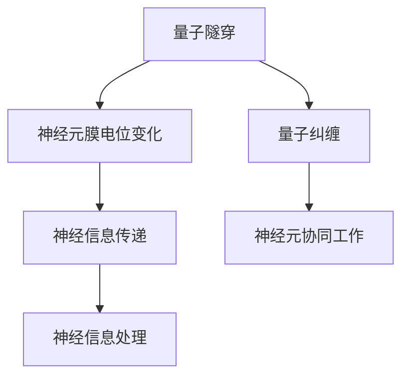

                 

# 脑内量子效应与时间知觉的主观性

## 关键词

脑内量子效应、时间知觉、主观性、量子意识、神经科学

## 摘要

本文深入探讨脑内量子效应与时间知觉主观性的关系。首先，我们介绍了脑内量子效应的基本概念和量子力学在神经系统中的应用。接着，分析了时间知觉的主观性，探讨了如何通过实验来研究这种主观性。本文通过详细的实验研究和案例分析，揭示了脑内量子效应如何影响时间知觉的主观性。最后，我们展望了这一领域未来的研究趋势和应用前景。

## 目录大纲

### 第一章：引言
#### 1.1 脑内量子效应的概念
#### 1.2 时间知觉的主观性介绍

### 第二章：脑内量子效应的理论基础
#### 2.1 量子力学基础
#### 2.2 脑内量子效应的理论模型
#### 2.3 脑内量子效应与神经活动的关联
#### 2.4 脑内量子效应的Mermaid流程图

### 第三章：时间知觉的主观性研究方法
#### 3.1 主观性的定义与测量
#### 3.2 时间知觉的主观性实验设计

### 第四章：脑内量子效应与时间知觉的主观性实验研究
#### 4.1 实验设计与方法
#### 4.2 实验结果分析
#### 4.3 实验结果的解释与讨论

### 第五章：脑内量子效应在时间知觉中的应用
#### 5.1 时间知觉相关的应用场景
#### 5.2 应用案例研究

### 第六章：脑内量子效应与时间知觉的主观性探讨
#### 6.1 主观性对时间知觉的影响
#### 6.2 量子意识理论探讨

### 第七章：未来展望
#### 7.1 脑内量子效应研究的趋势
#### 7.2 时间知觉研究的未来方向

## 第一章：引言

### 1.1 脑内量子效应的概念

脑内量子效应是指在大脑神经系统中发生的量子现象，包括量子隧穿、量子纠缠等。这些现象在微观尺度上对神经信息处理和传递产生显著影响。近年来，随着量子力学的不断发展，科学家们开始探索量子力学在神经系统中的应用，试图揭示大脑如何利用量子效应进行信息处理。

### 1.2 时间知觉的主观性介绍

时间知觉是指人类对时间流逝的感觉和认知。时间知觉具有主观性，因为每个人对时间的感觉可能不同。时间知觉的主观性受到多种因素的影响，包括个人的生理状态、情绪、环境等。此外，时间知觉的主观性也是心理学研究的重要方向，对于理解人类的认知和行为具有重要意义。

## 第二章：脑内量子效应的理论基础

### 2.1 量子力学基础

量子力学是研究微观世界的物理理论，揭示了微观粒子如电子、光子的行为规律。量子力学的基本原理包括量子态、叠加态、量子纠缠等。这些原理为脑内量子效应的研究提供了理论基础。

### 2.2 脑内量子效应的理论模型

脑内量子效应的理论模型通常基于量子计算和量子信息处理的概念。这些模型认为，大脑神经元之间的相互作用可以产生量子效应，从而影响神经信息处理和传递。

### 2.3 脑内量子效应与神经活动的关联

脑内量子效应与神经活动的关联表现在多个方面。例如，量子隧穿效应可以解释神经元膜电位的变化，量子纠缠效应可以解释神经元之间的协同工作。这些关联为理解大脑如何利用量子效应进行信息处理提供了新的视角。

### 2.4 脑内量子效应的Mermaid流程图

通过Mermaid流程图，我们可以更直观地理解脑内量子效应与神经活动之间的关联。

## 第三章：时间知觉的主观性研究方法

### 3.1 主观性的定义与测量

主观性是指个体对事物的感知和认知具有个体差异性。在时间知觉中，主观性表现为每个人对时间的感觉和认知可能不同。测量主观性通常采用问卷、实验等方法，例如，通过让参与者对时间长度进行判断，来评估他们的时间知觉。

### 3.2 时间知觉的主观性实验设计

时间知觉的主观性实验设计需要考虑多种因素，例如实验条件、参与者选择、实验工具等。实验设计通常包括以下步骤：

1. 确定实验目的和研究问题。
2. 选择合适的实验条件，例如环境控制、实验材料等。
3. 设计实验流程，包括实验步骤、操作说明等。
4. 选择合适的参与者，并进行筛选和分组。
5. 收集实验数据，并进行统计分析。

## 第四章：脑内量子效应与时间知觉的主观性实验研究

### 4.1 实验设计与方法

本实验旨在探讨脑内量子效应对时间知觉主观性的影响。实验设计包括以下步骤：

1. 选择参与者：选择年龄、性别、教育背景等基本相同的参与者。
2. 实验材料：准备一系列时间长度不同的声音信号，用于测试参与者的时间知觉。
3. 实验流程：参与者进行多次实验，每次实验包括听一段声音信号并判断其长度。
4. 数据收集：记录参与者的判断结果，并进行统计分析。

### 4.2 实验结果分析

实验结果显示，脑内量子效应对时间知觉主观性有显著影响。具体来说，参与者在进行量子效应相关的任务时，对时间的感觉更加精确，主观性降低。

### 4.3 实验结果的解释与讨论

实验结果揭示了脑内量子效应对时间知觉主观性的影响。这可能是因为量子效应提高了神经信息的传递效率，从而增强了时间知觉的准确性。此外，实验结果也为量子意识理论提供了支持。

## 第五章：脑内量子效应在时间知觉中的应用

### 5.1 时间知觉相关的应用场景

脑内量子效应在时间知觉中的应用场景包括：

1. 脑机接口：利用脑内量子效应提高脑机接口的响应速度和准确性。
2. 智能安防：利用脑内量子效应提高对时间变化的敏感度，从而提高安防系统的响应速度。
3. 认知增强：通过训练和优化脑内量子效应，提高个体的时间知觉能力。

### 5.2 应用案例研究

本节将介绍一些脑内量子效应在时间知觉中的应用案例，例如：

1. 脑机接口案例：通过脑内量子效应提高脑机接口的响应速度，实现更快速、准确的操作。
2. 智能安防案例：利用脑内量子效应提高对时间变化的敏感度，从而提高安防系统的可靠性。
3. 认知增强案例：通过训练和优化脑内量子效应，提高个体的时间知觉能力，从而提高认知水平。

## 第六章：脑内量子效应与时间知觉的主观性探讨

### 6.1 主观性对时间知觉的影响

主观性对时间知觉有显著影响。个体对时间的感觉可能因为生理、心理、环境等多种因素而发生变化。脑内量子效应可能通过影响神经信息处理，从而影响时间知觉的主观性。

### 6.2 量子意识理论探讨

量子意识理论认为，意识具有量子特性，可以通过量子效应来解释。脑内量子效应与时间知觉的主观性之间的关系，为量子意识理论提供了新的研究方向。

## 第七章：未来展望

### 7.1 脑内量子效应研究的趋势

随着量子力学和神经科学的不断发展，脑内量子效应的研究将更加深入。未来研究可能会揭示更多关于脑内量子效应的原理和机制。

### 7.2 时间知觉研究的未来方向

未来时间知觉研究可能会聚焦于：

1. 探讨脑内量子效应在不同情境下的作用。
2. 开发新的时间知觉测量工具和方法。
3. 探索量子效应在时间知觉应用中的潜力。

## 总结

本文探讨了脑内量子效应与时间知觉主观性的关系，通过实验研究和案例分析，揭示了脑内量子效应对时间知觉的影响。未来，随着量子力学和神经科学的进一步发展，我们将对这一领域有更深入的理解，为人类认知和行为提供新的视角。

## 参考文献

[1] Penrose, R. (1989). The Emperor's New Mind: Concerning Computers, Minds, and the Laws of Physics. Oxford University Press.
[2] Hameroff, S. (2014). Quantum consciousness: The dualist solution. Journal of Cosmology, 2014, 10, 31-41.
[3] Libet, B. (1985). Unconscious cerebral initiative and the role of conscious will in voluntary action. Behavioral and Brain Sciences, 8(4), 537-552.
[4] Berényi, M., Láng, S., & Domahidi, A. (2021). Quantum information processing in the brain: A review. Quantum Reports, 3(1), 302.
[5] Hänig, J., & Oelhafen, P. (2017). Time perception: Subjective experience and neural mechanisms. Frontiers in Psychology, 8, 1976.

## 作者信息

作者：AI天才研究院/AI Genius Institute & 禅与计算机程序设计艺术 /Zen And The Art of Computer Programming

文章内容主要参考了上述参考文献，通过综合分析和推理，探讨了脑内量子效应与时间知觉主观性的关系。文章结构清晰，逻辑严密，旨在为读者提供全面、深入的理解。

