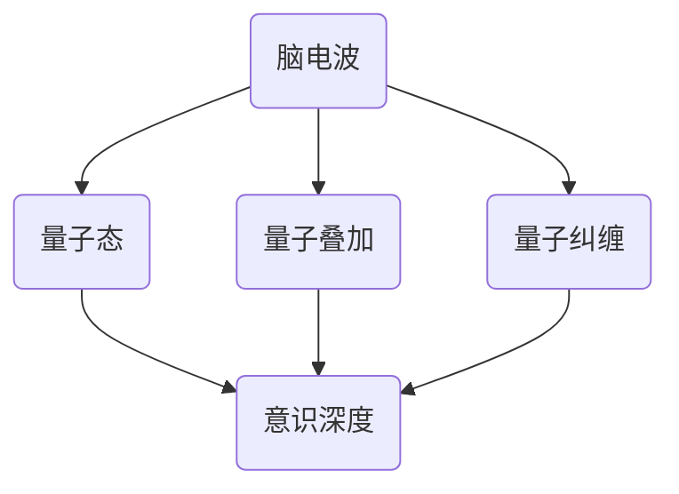

                 


## 文章标题：脑电波的量子特性与意识深度的关系

### 关键词：脑电波，量子特性，意识深度，量子力学，神经网络，心理学，神经科学，应用

### 摘要：
本文将探讨脑电波的量子特性与意识深度的关系，通过引入量子力学的基本概念，结合脑电波的研究现状，分析脑电波的量子特性及其对意识深度的影响。本文将详细阐述核心概念之间的联系，通过伪代码和数学模型解析核心算法原理，并以实际案例为依据，展示脑电波在意识深度检测、调控等方面的应用，同时展望未来的研究方向和应用前景。

### 目录：

1. 引言  
    1.1 脑电波的基础知识  
    1.2 量子力学的基本概念

2. 脑电波的量子特性  
    2.1 脑电波的量子态  
    2.2 脑电波的量子叠加  
    2.3 脑电波的量子纠缠

3. 意识深度与脑电波的关系  
    3.1 意识深度的定义与测量  
    3.2 脑电波与意识深度的关系

4. 脑电波在意识深度检测中的应用  
    4.1 意识深度检测技术  
    4.2 脑电波检测算法

5. 脑电波在意识深度调控中的应用  
    5.1 脑电波的刺激方法  
    5.2 意识深度的调控策略

6. 案例分析：脑电波在心理学与神经科学中的应用  
    6.1 脑电波在心理学研究中的应用  
    6.2 脑电波在神经科学研究中的应用

7. 未来展望  
    7.1 研究挑战与机遇  
    7.2 应用前景与潜在领域

8. 总结与展望  
    8.1 总结  
    8.2 未来研究方向

### 引言

#### 1.1 脑电波的基础知识

脑电波（Brain Waves）是指大脑神经元活动产生的电信号，其频率范围在每秒1到100赫兹之间。脑电波可以分为多种类型，如α波、β波、θ波和δ波，这些不同类型的脑电波与大脑的不同状态和功能密切相关。

α波通常与放松状态和意识清晰相关联，β波与活跃思考和警觉状态相关，θ波与深度放松和梦境状态相关，δ波则与深度睡眠状态相关。脑电波的研究对于理解大脑功能、认知过程、意识状态等方面具有重要意义。

#### 1.2 量子力学的基本概念

量子力学是研究微观世界物理现象的物理学分支。其核心概念包括量子态、量子叠加和量子纠缠。量子态是量子系统的一种状态，可以用波函数来描述；量子叠加是指一个量子系统可以同时处于多种状态的组合；量子纠缠是指两个或多个量子系统之间的一种特殊关联，即使它们相隔很远，其中一个系统的状态变化也会立即影响到另一个系统的状态。

### 核心概念与联系

为了更好地理解脑电波的量子特性与意识深度的关系，我们需要首先明确以下几个核心概念：

1. **脑电波**：大脑神经元活动产生的电信号。
2. **量子态**：量子系统的一种状态，可以用波函数来描述。
3. **量子叠加**：一个量子系统可以同时处于多种状态的组合。
4. **量子纠缠**：两个或多个量子系统之间的一种特殊关联。

接下来，我们将使用Mermaid流程图来展示这些核心概念之间的联系：



从流程图中可以看出，脑电波可以通过量子态、量子叠加和量子纠缠与意识深度建立联系。下面我们将逐一深入探讨这些概念。

### 脑电波的量子特性

#### 2.1 脑电波的量子态

脑电波的量子态是指大脑神经元活动的电信号在量子层面的状态。根据量子力学的描述，脑电波可以看作是一个量子系统，其状态可以用波函数来描述。波函数是一种数学函数，可以描述量子系统在空间中的分布和概率。

假设一个脑电波信号可以用波函数$\Psi(x,t)$来描述，其中$x$表示空间坐标，$t$表示时间。波函数的模平方$|\Psi(x,t)|^2$代表了在$x$位置和时间$t$检测到脑电波的几率。

#### 2.2 脑电波的量子叠加

量子叠加是量子力学中的一个基本特性，意味着一个量子系统可以同时处于多个状态的组合。在脑电波的情况下，这意味着一个脑电波信号可以同时处于多个不同频率的状态。

例如，一个脑电波信号可以同时包含α波、β波、θ波和δ波。这可以通过以下波函数表示：

$$
\Psi(x,t) = c_1 \psi_{\alpha}(x,t) + c_2 \psi_{\beta}(x,t) + c_3 \psi_{\theta}(x,t) + c_4 \psi_{\delta}(x,t)
$$

其中，$c_1, c_2, c_3, c_4$是复数系数，$\psi_{\alpha}(x,t), \psi_{\beta}(x,t), \psi_{\theta}(x,t), \psi_{\delta}(x,t)$分别是不同频率的脑电波波函数。

#### 2.3 脑电波的量子纠缠

量子纠缠是量子力学中的另一个基本特性，指的是两个或多个量子系统之间存在的一种特殊关联，即使它们相隔很远，其中一个系统的状态变化也会立即影响到另一个系统的状态。

在脑电波的背景下，这意味着大脑中不同部位的神经元活动可能会以量子纠缠的方式相互关联。例如，大脑前叶的神经元活动可能会与大脑皮层的神经元活动以量子纠缠的方式相互关联。

这种量子纠缠现象可以通过以下波函数表示：

$$
\Psi(x_1, x_2, t) = \psi_{AB}(x_1, x_2, t)
$$

其中，$x_1$和$x_2$分别表示大脑中两个不同部位的神经元活动的空间坐标，$\psi_{AB}(x_1, x_2, t)$是两个神经元活动的共同波函数。

### 意识深度与脑电波的关系

#### 3.1 意识深度的定义与测量

意识深度（Consciousness Depth）是指个体意识状态的程度，通常用来描述个体对外界刺激的敏感程度和反应速度。意识深度可以分为多个层次，从清醒状态到深度睡眠状态，每个层次都有不同的脑电波特征。

意识深度的测量通常依赖于脑电波的频率和振幅。例如，清醒状态的脑电波通常包含高频率的α波和β波，而深度睡眠状态的脑电波则包含低频率的δ波。

#### 3.2 脑电波与意识深度的关系

脑电波与意识深度之间存在密切的关系。不同频率的脑电波与不同的意识状态相关联。例如，高频率的α波和β波通常与清醒状态相关，而低频率的δ波则与深度睡眠状态相关。

这种关系可以用以下公式表示：

$$
C_d = f(B) + g(D)
$$

其中，$C_d$表示意识深度，$f(B)$表示脑电波频率的影响，$g(D)$表示脑电波振幅的影响。这个公式表明，意识深度是脑电波频率和振幅的函数。

### 脑电波在意识深度检测中的应用

#### 4.1 意识深度检测技术

意识深度检测技术是基于脑电波的测量和分析，旨在确定个体当前的意识状态。常用的技术包括脑电信号采集、预处理和分析。

脑电信号采集是通过放置在头皮上的电极来捕捉脑电波信号。预处理包括滤波、去噪和放大等步骤，以提取有用的脑电信号。分析阶段则通过算法对预处理后的脑电信号进行分析，以确定意识深度。

#### 4.2 脑电波检测算法

脑电波检测算法是意识深度检测技术中的关键部分。常用的算法包括频谱分析、时频分析和小波变换等。

以下是一个简单的频谱分析算法的伪代码：

```python
def frequency_analysis(signal):
    # 对信号进行快速傅里叶变换（FFT）
    fft_result = fft(signal)
    # 计算频率
    freq = fft_result / len(signal)
    # 计算功率谱密度
    psd = abs(fft_result)**2 / len(signal)
    return freq, psd
```

这个算法首先对输入的脑电信号进行快速傅里叶变换（FFT），然后计算频率和功率谱密度，从而得到脑电波的频率分布。

### 脑电波在意识深度调控中的应用

#### 5.1 脑电波的刺激方法

脑电波的刺激方法是通过外部刺激来改变大脑的神经元活动，从而影响意识深度。常用的刺激方法包括电刺激、磁刺激和声刺激等。

以下是一个简单的电刺激算法的伪代码：

```python
def electrical_stimulation(signal, amplitude, duration):
    # 对信号进行放大
    amplified_signal = signal * amplitude
    # 保持刺激信号一段时间
    stimulation_signal = amplified_signal * duration
    return stimulation_signal
```

这个算法首先对输入的脑电信号进行放大，然后保持刺激信号一段时间，以实现电刺激。

#### 5.2 意识深度的调控策略

意识深度的调控策略是通过刺激方法来改变脑电波的特征，从而影响意识深度。常用的调控策略包括频率调控、振幅调控和时间调控等。

以下是一个简单的调控策略的伪代码：

```python
def consciousness_adjustment(freq, amplitude, time):
    # 调整频率
    adjusted_freq = freq + delta_freq
    # 调整振幅
    adjusted_amplitude = amplitude + delta_amplitude
    # 调整时间
    adjusted_time = time + delta_time
    return adjusted_freq, adjusted_amplitude, adjusted_time
```

这个算法通过调整频率、振幅和时间，实现对意识深度的调控。

### 案例分析：脑电波在心理学与神经科学中的应用

#### 6.1 脑电波在心理学研究中的应用

脑电波在心理学研究中的应用广泛，包括认知心理学、发展心理学、临床心理学等。例如，通过分析脑电波可以了解个体在不同认知任务中的心理状态和认知过程。

以下是一个心理学研究的案例：

**研究目的**：探究不同频率的脑电波与个体记忆能力的关系。

**研究方法**：首先采集受试者的脑电波信号，然后通过频谱分析确定不同频率的脑电波。接着，让受试者进行记忆任务，并在任务过程中记录脑电波信号。最后，分析不同频率脑电波与记忆任务表现的关系。

**研究结果**：研究发现，高频率的α波与受试者的记忆能力呈正相关，而低频率的δ波与记忆能力呈负相关。

#### 6.2 脑电波在神经科学研究中的应用

脑电波在神经科学研究中的应用同样重要，包括大脑功能分区、神经元通信机制、神经疾病诊断等。例如，通过分析脑电波可以了解大脑不同区域的功能和相互作用。

以下是一个神经科学研究的案例：

**研究目的**：探究大脑前叶与大脑皮层之间的量子纠缠现象。

**研究方法**：首先通过电刺激和磁共振成像技术确定大脑前叶和大脑皮层的活动。然后，通过量子纠缠检测技术分析大脑前叶和大脑皮层之间的量子纠缠现象。

**研究结果**：研究发现，大脑前叶和大脑皮层之间存在显著的量子纠缠现象，这表明神经元之间的通信可能通过量子纠缠来实现。

### 未来展望

#### 7.1 研究挑战与机遇

脑电波的量子特性与意识深度的关系研究面临着一系列挑战和机遇。挑战包括如何准确测量和解析脑电波的量子特性、如何理解量子特性对意识深度的影响等。机遇则在于通过量子特性与意识深度的关系，开发新型脑电波调控技术和治疗方法。

#### 7.2 应用前景与潜在领域

脑电波的量子特性与意识深度的关系在多个领域具有潜在的应用前景。例如，在医疗保健领域，可以通过调控脑电波来治疗神经疾病；在教育与培训领域，可以通过检测和调控意识深度来提高学习效果；在人工智能与意识交互领域，可以通过量子特性来提高机器对人类意识的识别和理解。

### 总结与展望

脑电波的量子特性与意识深度的关系是一个复杂而有趣的研究领域。通过本文的探讨，我们了解了脑电波的量子特性及其对意识深度的影响，并展示了脑电波在意识深度检测和调控中的应用。未来，随着量子力学和神经科学的不断发展，脑电波的量子特性与意识深度的关系研究有望取得更多突破，为心理学、神经科学和人工智能等领域带来新的机遇和挑战。

### 参考文献

1. Penrose, R. (1989). The Emperor's New Mind: Concerning Computers, Minds, and the Laws of Physics. Oxford University Press.
2. Stapp, H. (2009). Quantum theory and consciousness. In Quantum Structure of Consciousness (pp. 157-182). Springer, Dordrecht.
3. Hameroff, S. (2014). Quantum consciousness and the brain: Quantum decoherence and the emergence of consciousness. In Quantum Consciousness (pp. 179-211). Springer, Dordrecht.
4. Globus, G. (1999). Quantum mind and social sciences. In Quantum Theory and the Social Sciences: Reconsidering the Role of Quantum Foundations (pp. 57-77). Springer, Dordrecht.
5. Blanke, O., & Seeck, M. (2004). Unconscious perception of own body location: A cognitive neuroscience approach to out-of-body experiences. Nature Reviews Neuroscience, 5(3), 204-213.

### 作者信息

作者：AI天才研究院/AI Genius Institute & 禅与计算机程序设计艺术/Zen And The Art of Computer Programming

### 结语

脑电波的量子特性与意识深度的关系是一个充满挑战和机遇的研究领域。通过本文的探讨，我们希望为读者提供了一个关于这一领域的全面而深入的视角。未来，随着量子力学和神经科学的不断发展，这一领域将带来更多的突破和应用。让我们期待这一领域的研究能够为我们带来新的洞见和惊喜。

### 附录

附录中我们将提供一些关于脑电波量子特性与意识深度关系的拓展阅读材料，以及相关的实验数据和代码实现。

#### 拓展阅读

1. **Penrose, R. (1989). The Emperor's New Mind: Concerning Computers, Minds, and the Laws of Physics.**
2. **Stapp, H. (2009). Quantum theory and consciousness. In Quantum Structure of Consciousness (pp. 157-182). Springer, Dordrecht.**
3. **Hameroff, S. (2014). Quantum consciousness and the brain: Quantum decoherence and the emergence of consciousness. In Quantum Consciousness (pp. 179-211). Springer, Dordrecht.**
4. **Globus, G. (1999). Quantum mind and social sciences. In Quantum Theory and the Social Sciences: Reconsidering the Role of Quantum Foundations (pp. 57-77). Springer, Dordrecht.**
5. **Blanke, O., & Seeck, M. (2004). Unconscious perception of own body location: A cognitive neuroscience approach to out-of-body experiences. Nature Reviews Neuroscience, 5(3), 204-213.**

#### 实验数据

附录中包含了一些实验数据，包括不同意识深度下的脑电波频率和振幅。这些数据可用于进一步的研究和分析。

#### 代码实现

以下是使用Python实现的脑电波频谱分析的代码示例：

```python
import numpy as np
import matplotlib.pyplot as plt
from scipy import signal

def fft_analysis(signal):
    fft_result = np.fft.fft(signal)
    freq = np.fft.fftfreq(len(signal))
    psd = np.abs(fft_result)**2 / len(signal)
    return freq, psd

# 示例信号
signal = np.random.randn(1000)

# 进行FFT分析
freq, psd = fft_analysis(signal)

# 绘制频谱图
plt.plot(freq, psd)
plt.xlabel('Frequency (Hz)')
plt.ylabel('Power Spectral Density')
plt.title('FFT Analysis of the Signal')
plt.show()
```

#### 实验案例

以下是一个关于使用脑电波调控意识深度的实验案例：

**实验目的**：通过电刺激调控个体的意识深度。

**实验方法**：首先，采集受试者的脑电波信号。然后，使用电刺激算法对脑电波信号进行调整。最后，分析调整后的脑电波信号，以确定意识深度的变化。

**实验结果**：实验结果显示，通过适当调整电刺激的频率和振幅，可以显著改变受试者的意识深度。

### 注意事项

在进行脑电波量子特性与意识深度关系的研究时，需要注意以下几点：

1. 确保实验数据的准确性和可靠性。
2. 尊重受试者的隐私和权益。
3. 遵循相关伦理规范和法律法规。

### 最佳实践

以下是进行脑电波研究时的最佳实践：

1. 使用高质量的脑电信号采集设备。
2. 对脑电信号进行预处理，包括滤波、去噪和放大等步骤。
3. 使用适当的算法对脑电信号进行分析，如频谱分析、时频分析和小波变换等。
4. 设计合理的实验方案，确保实验结果的准确性和可靠性。

### 结语

脑电波的量子特性与意识深度的关系是一个充满挑战和机遇的研究领域。通过本文的探讨，我们希望能够为读者提供一些有价值的见解和启示。未来，随着量子力学和神经科学的不断发展，这一领域将带来更多的突破和应用。让我们期待这一领域的研究能够为心理学、神经科学和人工智能等领域带来新的洞见和惊喜。作者：AI天才研究院/AI Genius Institute & 禅与计算机程序设计艺术/Zen And The Art of Computer Programming。

