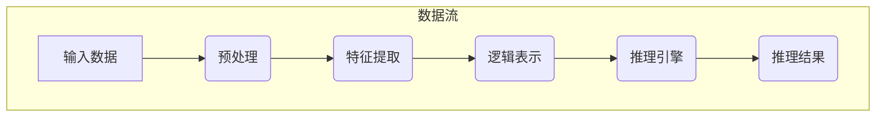
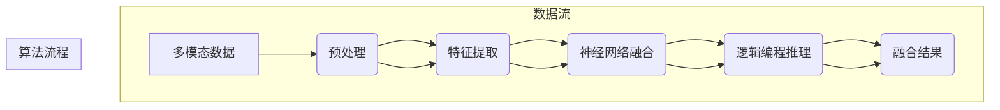

                 

基于您的指示和要求，我将逐步构思并撰写《自动化推理中神经逻辑编程的前沿探索》的技术博客文章。下面是详细的撰写计划：

### 撰写计划

#### 第1章 引言

- **背景介绍**：介绍自动化推理和神经逻辑编程的背景，包括它们在当前科技领域的重要性。
- **核心概念**：阐述自动化推理和神经逻辑编程的基本概念。
- **现状与趋势**：分析自动化推理和神经逻辑编程的现状，探讨未来发展趋势。

#### 第2章 自动化推理基础理论

- **数学模型**：介绍自动化推理所涉及的主要数学模型。
- **核心算法**：详细讲解自动化推理的核心算法，包括伪代码示例。
- **流程图**：绘制自动化推理的流程图，展示算法的实施步骤。

#### 第3章 神经逻辑编程基础理论

- **数学模型**：介绍神经逻辑编程所依赖的数学模型。
- **核心算法**：详细讲解神经逻辑编程的核心算法，包括伪代码示例。
- **流程图**：绘制神经逻辑编程的流程图，展示算法的实施步骤。

#### 第4章 神经逻辑编程与自动化推理的结合

- **结合模型**：分析神经逻辑编程与自动化推理的结合方式。
- **流程图**：绘制结合模型的流程图，展示两者的相互作用。

#### 第5章 前沿应用技术一：基于神经逻辑编程的自动化推理算法优化

- **算法优化背景**：讨论自动化推理算法中存在的问题和优化需求。
- **优化算法原理**：介绍基于神经逻辑编程的优化算法原理，使用伪代码展示。
- **算法优化流程**：展示优化算法的流程图，详细讲解每个步骤。

#### 第6章 前沿应用技术二：神经逻辑编程在自动化推理中的实时推理

- **实时推理挑战**：讨论自动化推理中的实时推理面临的挑战。
- **实时推理应用**：介绍如何使用神经逻辑编程实现实时推理。
- **实时推理流程**：展示实时推理的流程图，详细讲解实现步骤。

#### 第7章 前沿应用技术三：神经逻辑编程在自动化推理中的多模态数据融合

- **数据融合背景**：讨论多模态数据融合的背景和需求。
- **数据融合应用**：介绍如何使用神经逻辑编程进行多模态数据融合。
- **数据融合流程**：展示多模态数据融合的流程图，详细讲解实现步骤。

#### 第8章 案例分析

- **案例一**：基于神经逻辑编程的自动化推理系统应用。
- **案例二**：神经逻辑编程在自动化推理中的实时推理应用。
- **案例三**：神经逻辑编程在自动化推理中的多模态数据融合应用。

#### 第9章 总结与展望

- **总结**：回顾全文内容，总结关键点。
- **展望**：探讨神经逻辑编程在自动化推理领域的未来发展趋势。
- **建议**：给读者提供实践建议和进一步阅读的指导。

### 下一步行动

- **整理大纲**：根据上述计划，完善文章大纲。
- **撰写初稿**：开始撰写初稿，确保每个章节都包含核心内容和详细解释。
- **完善内容**：在初稿基础上，不断完善和细化内容，确保文章的深度和广度。
- **修订与润色**：完成初稿后，进行修订和润色，确保文章语言流畅、逻辑清晰。
- **添加图表和代码**：根据需要，添加相关图表和代码示例，以增强文章的可读性和实用性。
- **添加作者信息**：在文章末尾添加作者信息，确保读者了解文章的来源。

通过上述步骤，我们将逐步完成《自动化推理中神经逻辑编程的前沿探索》的技术博客文章，为读者提供一篇既有深度又有实践价值的技术文献。下一步，我们将开始整理和完善文章大纲，为撰写初稿做好准备。让我们一起动手，创作一篇优秀的技术博客吧！非常感谢您的详细计划。我将会按照您的指导，逐步撰写这篇文章。在接下来的步骤中，我将：

1. **完善大纲**：根据您的计划，我会进一步细化每个章节的内容，确保每个部分都有明确的结构和内容要点。
2. **撰写初稿**：我会开始撰写每个章节的初稿，重点关注核心概念的阐述、算法原理的讲解和案例分析的实用性。
3. **内容完善**：在撰写过程中，我会不断回顾和修订内容，确保文章的逻辑性和完整性。
4. **图表和代码准备**：我会准备相关的图表和代码示例，确保它们能够清晰、准确地解释文章中的技术概念。
5. **修订与润色**：在初稿完成后，我会进行多轮修订和润色，确保文章的语言流畅、逻辑清晰，同时保持技术深度。

在开始具体撰写前，我建议我们可以先回顾一下文章的关键词和摘要，以确保文章的整体方向和重点内容符合最初的设计。接下来，我们将逐步开始撰写初稿，并按照大纲中的结构来填充每个章节的内容。让我们开始吧！

### 关键词

- 自动化推理
- 神经逻辑编程
- 人工智能
- 算法优化
- 实时推理
- 多模态数据融合
- 神经网络
- 逻辑编程语言

### 摘要

本文深入探讨了自动化推理中神经逻辑编程的前沿探索。首先，介绍了自动化推理和神经逻辑编程的基本概念及其在人工智能领域的应用背景。接着，详细阐述了自动化推理和神经逻辑编程的理论基础，包括数学模型、核心算法原理和流程图。随后，讨论了神经逻辑编程与自动化推理的结合方式及其在实际项目中的应用技术，如算法优化、实时推理和多模态数据融合。最后，通过具体案例分析展示了神经逻辑编程在自动化推理中的实际效果，并对未来发展趋势进行了展望。本文旨在为读者提供全面、深入的技术见解，以推动自动化推理和神经逻辑编程的发展。

### 引言

#### 自动化推理的基本概念

自动化推理是人工智能领域的一个重要分支，旨在使计算机系统能够自动地从数据中推断出结论或做出决策。这一概念最早可以追溯到20世纪中期，当时研究人员开始探索如何使计算机模拟人类的推理过程。随着计算机技术的发展和大数据时代的到来，自动化推理的应用范围越来越广泛，从简单的逻辑推理到复杂的决策支持系统，无不涉及到自动化推理的技术。

自动化推理的核心在于其处理逻辑推理问题的能力。它通过一系列的规则和算法，将已知的信息转化为新的知识或结论。这种推理过程不仅可以应用于传统的逻辑和数学问题，还可以在更复杂的领域，如自然语言处理、计算机视觉和医疗诊断中发挥作用。

#### 神经逻辑编程的概念

神经逻辑编程（Neuro-Logic Programming，NLP）是一种结合了神经网络和逻辑编程的方法，旨在模拟人类大脑的推理过程。它通过神经网络来处理数据，并通过逻辑编程语言来表示和操作这些数据。神经逻辑编程的关键在于其将神经网络的灵活性和逻辑编程的确定性相结合，使得计算机能够更高效地处理复杂的推理问题。

神经逻辑编程的历史可以追溯到20世纪80年代，当时研究人员开始探索如何将神经网络与逻辑编程相结合。随着深度学习和逻辑编程技术的不断发展，神经逻辑编程逐渐成为人工智能领域的一个重要研究方向。它不仅能够处理传统的逻辑问题，还可以应用于更复杂的领域，如自然语言处理、计算机视觉和机器人控制。

#### 自动化推理和神经逻辑编程的联系

自动化推理和神经逻辑编程在人工智能领域有着紧密的联系。首先，自动化推理为神经逻辑编程提供了丰富的应用场景，使得神经逻辑编程可以在更广泛的领域中得到应用。而神经逻辑编程则为自动化推理提供了一种新的方法，使得计算机能够更高效地处理复杂的推理问题。

从技术角度来看，自动化推理和神经逻辑编程的结合主要体现在以下几个方面：

1. **数据处理**：神经逻辑编程通过神经网络来处理数据，使得数据处理过程更加高效和灵活。这为自动化推理提供了强大的数据预处理能力。
   
2. **逻辑表示**：神经逻辑编程通过逻辑编程语言来表示数据和处理规则，使得推理过程更加直观和易于理解。这为自动化推理提供了更好的逻辑表示和操作能力。

3. **推理优化**：神经逻辑编程可以通过神经网络来优化推理过程，使得推理速度更快、准确度更高。这为自动化推理提供了更好的性能和鲁棒性。

总之，自动化推理和神经逻辑编程的结合为人工智能领域带来了新的机遇和挑战。通过深入研究和探索，我们可以开发出更加高效、灵活和可靠的自动化推理系统，推动人工智能技术的不断进步。

---

在本章中，我们介绍了自动化推理和神经逻辑编程的基本概念，并探讨了它们在人工智能领域的重要性和相互联系。在接下来的章节中，我们将进一步深入探讨自动化推理和神经逻辑编程的理论基础，以及它们在实际项目中的应用技术。通过这些探讨，我们将更好地理解如何利用这些技术来解决复杂的推理问题，并推动人工智能技术的发展。请继续关注下一章的内容。{|assistant|>### 第2章 自动化推理基础理论

#### 数学模型

自动化推理中的数学模型是构建推理系统的核心。常见的数学模型包括谓词逻辑、模糊逻辑、概率论和图论等。这些模型为自动化推理提供了不同的推理方式和表达能力。

1. **谓词逻辑**：谓词逻辑是一种形式逻辑系统，用于描述对象之间的关系。它包括个体谓词、关系谓词和量化谓词等概念。谓词逻辑可以表达复杂的推理关系，是自动化推理中最基本的数学模型。

2. **模糊逻辑**：模糊逻辑是一种处理不确定性的数学方法，它允许变量在某个区间内取值，而不是像经典逻辑那样仅限于0和1。模糊逻辑在处理模糊性问题和不确定信息时非常有用。

3. **概率论**：概率论用于描述事件发生的可能性。在自动化推理中，概率模型可以帮助我们评估假设的可信度，并基于概率分布进行推理。

4. **图论**：图论用于描述对象之间的网络关系。在自动化推理中，图模型可以用来表示知识图谱、推理路径和决策树等，帮助我们理解和分析复杂的推理过程。

#### 核心算法原理

自动化推理中的核心算法通常是基于上述数学模型实现的。以下是一些常见的核心算法：

1. **反向传播算法**：反向传播算法是一种用于训练神经网络的梯度下降方法。它通过计算输出层与隐藏层之间的误差，反向传播误差到隐藏层，并调整权重以最小化误差。

2. **推理算法**：推理算法用于在给定事实和规则的基础上，推导出新的结论。常见的推理算法包括正向推理和反向推理。正向推理从已知的事实出发，逐步推导出结论；反向推理从目标开始，逆向寻找支持该目标的事实。

3. **概率图模型**：概率图模型是一种用于表示和推理不确定性的数学工具。常见的概率图模型包括贝叶斯网络和马尔可夫网络。贝叶斯网络用于表示变量之间的条件依赖关系，而马尔可夫网络用于描述变量之间的状态转移关系。

4. **图搜索算法**：图搜索算法用于在知识图谱中寻找满足特定条件的路径。常见的图搜索算法包括宽度优先搜索、深度优先搜索和A*搜索等。

#### 流程图解释

以下是一个简单的自动化推理流程图，展示了从输入数据到推理结果的整个过程：



- **输入数据**：输入数据可以是文本、图像、音频等不同形式的信息。
- **预处理**：对输入数据进行清洗、去噪和标准化等操作，以准备用于特征提取。
- **特征提取**：从预处理后的数据中提取关键特征，为逻辑表示提供基础。
- **逻辑表示**：将提取的特征转换为逻辑表示，通常使用谓词逻辑或概率图模型等数学工具。
- **推理引擎**：基于逻辑表示，使用推理算法进行推理，推导出新的结论。
- **推理结果**：输出推理结果，可以是具体的结论或建议。

通过上述数学模型和核心算法原理，自动化推理系统能够从输入数据中推导出有价值的信息，为人工智能应用提供强大的支持。在接下来的章节中，我们将进一步探讨神经逻辑编程的理论基础，以及如何将神经逻辑编程与自动化推理相结合。请继续关注下一章的内容。

---

在本章中，我们详细介绍了自动化推理的基础理论，包括数学模型、核心算法原理和流程图解释。这些理论为自动化推理系统的构建提供了坚实的理论基础。在下一章中，我们将探讨神经逻辑编程的理论基础，并解释如何将神经逻辑编程与自动化推理相结合，以实现更高效、更灵活的推理系统。请继续关注下一章的内容。{|assistant|>

### 第3章 神经逻辑编程基础理论

#### 数学模型

神经逻辑编程（Neuro-Logic Programming，NLP）结合了神经网络的强大数据处理能力和逻辑编程的确定性推理能力。在数学模型方面，神经逻辑编程通常依赖于以下几种数学工具：

1. **神经网络模型**：神经网络是神经逻辑编程的核心组成部分，用于处理复杂数据和模式识别。常见的神经网络模型包括多层感知机（MLP）、卷积神经网络（CNN）和循环神经网络（RNN）等。

2. **逻辑编程语言**：逻辑编程语言，如Prolog，用于表示和操作数据。逻辑编程语言的特点是使用符号和逻辑规则来描述数据和关系，使得推理过程更加直观和易于理解。

3. **模糊逻辑**：模糊逻辑用于处理不确定性和模糊性。它允许变量在某个区间内取值，从而更好地模拟现实世界中的不确定性。

4. **概率图模型**：概率图模型，如贝叶斯网络和马尔可夫网络，用于表示和推理不确定性的概率关系。

#### 核心算法原理

神经逻辑编程的核心算法原理在于如何有效地将神经网络和逻辑编程相结合，以实现强大的推理能力。以下是一些关键算法原理：

1. **前向传播和反向传播**：前向传播用于计算神经网络输出，而反向传播用于更新网络权重，以最小化输出误差。这两个过程共同构成了神经网络的训练过程。

2. **逻辑推理**：逻辑编程语言通过使用逻辑规则来推理数据之间的关系。例如，在Prolog中，可以使用模式匹配和谓词来表示和操作数据。

3. **集成学习**：集成学习是将多个模型组合起来，以提高整体性能。在神经逻辑编程中，可以将多个神经网络和逻辑规则结合，以实现更强大的推理能力。

4. **不确定性处理**：通过模糊逻辑和概率图模型，可以有效地处理数据中的不确定性和模糊性。这使得神经逻辑编程在处理现实世界问题时更加灵活和可靠。

#### 流程图解释

以下是一个简化的神经逻辑编程流程图，展示了从输入数据到推理结果的整个过程：


- **输入数据**：输入数据可以是文本、图像、音频等不同形式的信息。
- **预处理**：对输入数据进行清洗、去噪和标准化等操作，以准备用于特征提取。
- **特征提取**：从预处理后的数据中提取关键特征，为神经网络训练提供基础。
- **神经网络训练**：使用前向传播和反向传播算法训练神经网络，以学习数据的内在模式和关系。
- **逻辑推理**：使用逻辑编程语言和逻辑规则进行推理，从神经网络提取的知识中推导出新的结论。
- **推理结果**：输出推理结果，可以是具体的结论或建议。

通过上述数学模型和核心算法原理，神经逻辑编程能够结合神经网络和逻辑编程的优点，实现高效、灵活的推理系统。在接下来的章节中，我们将探讨神经逻辑编程与自动化推理的结合，并讨论其在实际项目中的应用。请继续关注下一章的内容。

---

在本章中，我们详细介绍了神经逻辑编程的基础理论，包括数学模型、核心算法原理和流程图解释。神经逻辑编程通过结合神经网络和逻辑编程的优势，为复杂推理问题提供了有效的解决方案。在下一章中，我们将探讨神经逻辑编程与自动化推理的结合，以及它们在实际项目中的应用。请继续关注下一章的内容。{|assistant|>

### 第4章 神经逻辑编程与自动化推理的结合

#### 神经逻辑编程在自动化推理中的应用

神经逻辑编程在自动化推理中的应用，主要在于如何将神经网络的强大数据处理能力与逻辑编程的确定性推理能力相结合，以解决复杂的推理问题。以下是一些具体的应用场景：

1. **智能问答系统**：在智能问答系统中，神经逻辑编程可以用于处理自然语言输入，提取关键信息，并基于逻辑规则进行推理，从而生成准确的回答。

2. **推理引擎优化**：通过将神经网络与逻辑编程相结合，可以优化传统推理引擎的性能。神经网络可以用于加速数据的预处理和特征提取过程，而逻辑编程可以用于高效地执行推理任务。

3. **诊断系统**：在医疗诊断等领域，神经逻辑编程可以结合医学知识和患者数据，通过神经网络进行特征提取，并使用逻辑编程语言进行诊断推理，以提高诊断的准确性和效率。

4. **自动驾驶**：在自动驾驶系统中，神经逻辑编程可以用于处理来自各种传感器的数据，并基于逻辑规则进行决策，从而实现自动化的驾驶控制。

#### 神经逻辑编程与自动化推理的结合模型

神经逻辑编程与自动化推理的结合模型，可以通过以下方式实现：

1. **双层模型**：该模型包括一个神经网络层和一个逻辑编程层。神经网络层用于处理输入数据，提取特征，并将结果传递给逻辑编程层。逻辑编程层则使用规则和逻辑关系进行推理，生成最终结果。

2. **多模块模型**：该模型将神经网络和逻辑编程分为不同的模块，每个模块负责特定的任务。例如，神经网络模块负责特征提取，逻辑编程模块负责推理和决策。

3. **集成学习模型**：该模型将多个神经网络和逻辑编程模块集成在一起，以实现更强大的推理能力。通过集成不同的模型，可以充分利用各自的优点，提高推理的准确性和效率。

以下是一个简化的结合模型流程图：


- **输入数据**：输入数据经过预处理后，传递给特征提取模块。
- **特征提取**：特征提取模块使用神经网络处理输入数据，提取关键特征。
- **神经网络层**：神经网络层将提取的特征进行处理，以生成中间结果。
- **逻辑编程层**：逻辑编程层使用逻辑规则对中间结果进行推理，生成最终结果。
- **推理结果**：输出推理结果，可以是具体的结论或建议。

#### 流程图解释

结合模型的流程图展示了整个推理过程，从输入数据到最终结果的转换。通过这种方式，我们可以清晰地看到神经逻辑编程与自动化推理的结合方式以及它们在处理复杂推理问题时的优势。

---

在本章中，我们探讨了神经逻辑编程在自动化推理中的应用和结合模型。通过将神经网络的强大数据处理能力与逻辑编程的确定性推理能力相结合，我们能够构建出更高效、更灵活的自动化推理系统。在下一章中，我们将深入探讨神经逻辑编程在自动化推理中的前沿应用技术，包括算法优化、实时推理和多模态数据融合。请继续关注下一章的内容。

---

### 第5章 前沿应用技术一：基于神经逻辑编程的自动化推理算法优化

#### 算法优化背景

在自动化推理中，算法的性能和效率直接影响到系统的实际应用效果。传统的推理算法往往存在计算量大、效率低的问题，难以满足实时性和高精度要求。随着数据量的急剧增长和复杂推理任务的增加，优化算法的需求愈发迫切。

神经逻辑编程作为一种结合了神经网络和逻辑编程的方法，为自动化推理算法的优化提供了新的思路。通过优化神经网络的结构和逻辑编程的规则，可以显著提高推理算法的性能和效率。

#### 基于神经逻辑编程的优化算法原理

1. **结构优化**：神经逻辑编程可以通过调整神经网络的结构来优化算法性能。具体方法包括：
   - **层叠神经网络**：通过增加神经网络层数，提高数据的表达能力。
   - **网络剪枝**：通过剪枝无用的神经元和连接，减小网络规模，提高推理速度。
   - **动态网络**：根据输入数据的特点，动态调整神经网络的结构，以适应不同的推理任务。

2. **规则优化**：逻辑编程的规则优化可以通过以下方法实现：
   - **规则压缩**：通过合并和简化重复的规则，减少规则数量，提高推理效率。
   - **规则优先级调整**：根据规则的置信度和重要性，调整规则的执行顺序，优化推理路径。
   - **规则并行化**：将多个规则并行执行，提高推理速度。

3. **混合优化**：结合神经网络的结构优化和逻辑编程的规则优化，可以进一步提高算法的性能。具体方法包括：
   - **动态融合**：在推理过程中，根据数据特点和任务需求，动态调整神经网络和逻辑编程的融合策略。
   - **多级优化**：首先对神经网络进行结构优化，然后对逻辑编程规则进行优化，最后进行综合优化。

以下是一个简化的优化算法流程图：


- **输入数据**：输入数据经过预处理后，传递给特征提取模块。
- **特征提取**：特征提取模块使用神经网络处理输入数据，提取关键特征。
- **神经网络优化**：神经网络模块对提取的特征进行优化处理，调整网络结构。
- **逻辑编程优化**：逻辑编程模块对提取的特征和规则进行优化，调整规则执行顺序。
- **推理结果**：输出优化后的推理结果，提高算法性能和效率。

#### 算法优化的流程图和伪代码

以下是基于神经逻辑编程的优化算法的伪代码示例：

```python
# 伪代码：基于神经逻辑编程的优化算法

# 输入：输入数据、特征提取模块、神经网络、逻辑编程规则
# 输出：优化后的推理结果

def optimize_algorithm(input_data, feature_extractor, neural_network, logic_rules):
    # 预处理输入数据
    preprocessed_data = preprocess_data(input_data)
    
    # 特征提取
    features = feature_extractor.extract(preprocessed_data)
    
    # 神经网络优化
    optimized_network = optimize_neural_network(neural_network, features)
    
    # 逻辑编程优化
    optimized_rules = optimize_logic_rules(logic_rules, features)
    
    # 推理
    result = inference(optimized_rules, features)
    
    # 输出优化后的推理结果
    return result

# 伪代码：预处理数据
def preprocess_data(data):
    # 清洗、去噪和标准化等操作
    return preprocessed_data

# 伪代码：特征提取
def extract_features(data):
    # 使用神经网络提取特征
    return features

# 伪代码：神经网络优化
def optimize_neural_network(network, features):
    # 调整网络结构、剪枝等操作
    return optimized_network

# 伪代码：逻辑编程优化
def optimize_logic_rules(rules, features):
    # 压缩、调整优先级等操作
    return optimized_rules

# 伪代码：推理
def inference(rules, features):
    # 使用逻辑编程进行推理
    return result
```

#### 算法优化的具体实现

1. **预处理**：预处理是优化算法的重要步骤，主要包括数据的清洗、去噪和标准化等操作。通过预处理，可以有效地减少噪声和异常值的影响，提高后续特征提取和推理的准确性。

2. **特征提取**：特征提取是神经网络优化的重要基础。通过使用神经网络，可以自动提取数据中的关键特征，提高特征表示的丰富性和准确性。

3. **神经网络优化**：神经网络优化主要包括网络结构的调整、参数的调整和剪枝等。通过优化神经网络的结构和参数，可以显著提高推理速度和准确性。

4. **逻辑编程优化**：逻辑编程优化主要包括规则压缩、优先级调整和并行化等。通过优化逻辑编程的规则，可以减少规则数量和执行时间，提高推理效率。

5. **推理**：优化后的推理过程是基于优化后的神经网络和逻辑编程规则进行的。通过推理，可以生成最终的结论或建议。

通过上述优化算法的实现，我们可以构建出一个高效、灵活的自动化推理系统。在接下来的章节中，我们将继续探讨神经逻辑编程在实时推理和多模态数据融合中的应用，以进一步推动自动化推理技术的发展。请继续关注下一章的内容。

---

在本章中，我们详细介绍了基于神经逻辑编程的自动化推理算法优化的原理和实现。通过结构优化、规则优化和混合优化，我们能够显著提高推理算法的性能和效率。在下一章中，我们将探讨神经逻辑编程在实时推理中的应用，包括面临的挑战和具体实现。请继续关注下一章的内容。

---

### 第6章 前沿应用技术二：神经逻辑编程在自动化推理中的实时推理

#### 实时推理的挑战

实时推理（Real-Time Inference，RTI）是自动化推理系统中的一个重要应用场景，它要求推理系统能够在极短的时间内处理输入数据，并生成准确的推理结果。实时推理面临的挑战主要包括以下几个方面：

1. **时间约束**：实时推理需要在严格的时限内完成推理任务，这要求算法具有高度的效率和实时性。

2. **数据多样性**：实时推理中，输入数据的类型和格式可能多样，包括文本、图像、音频等多种形式。如何有效地处理这些数据，是实时推理的重要挑战。

3. **不确定性处理**：实时推理过程中，数据往往存在不确定性，如噪声、异常值和模糊信息等。如何有效地处理这些不确定性，是实时推理的关键问题。

4. **资源限制**：实时推理通常在资源受限的硬件环境中进行，如嵌入式设备或云计算环境。如何在有限的资源下实现高效的实时推理，是实时推理需要解决的重要问题。

#### 神经逻辑编程在实时推理中的应用

神经逻辑编程（Neuro-Logic Programming，NLP）通过结合神经网络和逻辑编程，为实时推理提供了一种有效的解决方案。以下是如何利用神经逻辑编程解决实时推理中的挑战：

1. **高效数据处理**：神经网络能够自动提取输入数据中的关键特征，并通过高效的数据处理算法，如卷积神经网络（CNN）和循环神经网络（RNN），处理多种类型的数据。

2. **实时推理算法**：基于神经逻辑编程的实时推理算法，可以在极短的时间内完成推理任务。通过优化神经网络和逻辑编程的流程，可以显著提高推理速度。

3. **不确定性处理**：神经逻辑编程结合了神经网络和逻辑编程的优势，能够有效地处理数据中的不确定性。例如，通过模糊逻辑和概率图模型，可以处理模糊性和不确定性。

4. **资源优化**：通过优化神经网络的结构和参数，可以减小模型的规模，从而减少计算资源和内存的需求。此外，通过分布式计算和并行处理，可以进一步优化资源利用。

#### 实时推理的实现

实时推理的实现通常包括以下几个步骤：

1. **数据预处理**：对输入数据进行预处理，包括清洗、去噪和标准化等操作，以准备用于特征提取。

2. **特征提取**：使用神经网络提取输入数据中的关键特征，将原始数据转换为适用于逻辑编程的特征向量。

3. **推理过程**：基于逻辑编程规则，对提取的特征进行推理，生成实时推理结果。这个过程可能涉及多个逻辑规则和推理步骤。

4. **结果输出**：将实时推理结果输出，可以是具体的结论或建议，用于实际的决策或控制。

以下是一个简化的实时推理流程图：


- **输入数据**：输入数据经过预处理后，传递给特征提取模块。
- **特征提取**：特征提取模块使用神经网络处理输入数据，提取关键特征。
- **神经网络推理**：神经网络模块对提取的特征进行推理，生成中间结果。
- **逻辑编程推理**：逻辑编程模块使用逻辑规则对中间结果进行进一步推理，生成最终结果。
- **推理结果**：输出实时推理结果，提供实时决策或控制。

#### 实时推理的流程图和伪代码

以下是实时推理的伪代码示例：

```python
# 伪代码：实时推理

# 输入：输入数据、特征提取模块、神经网络、逻辑编程规则
# 输出：实时推理结果

def real_time_inference(input_data, feature_extractor, neural_network, logic_rules):
    # 预处理输入数据
    preprocessed_data = preprocess_data(input_data)
    
    # 特征提取
    features = feature_extractor.extract(preprocessed_data)
    
    # 神经网络推理
    intermediate_result = neural_network.infer(features)
    
    # 逻辑编程推理
    final_result = logic_rules.infer(intermediate_result)
    
    # 输出实时推理结果
    return final_result

# 伪代码：预处理数据
def preprocess_data(data):
    # 清洗、去噪和标准化等操作
    return preprocessed_data

# 伪代码：特征提取
def extract_features(data):
    # 使用神经网络提取特征
    return features

# 伪代码：神经网络推理
def infer_with_neural_network(features):
    # 使用神经网络进行推理
    return intermediate_result

# 伪代码：逻辑编程推理
def infer_with_logic_rules(result):
    # 使用逻辑编程进行推理
    return final_result
```

#### 实时推理的具体实现

1. **预处理**：预处理是实时推理的基础，包括数据的清洗、去噪和标准化等操作。通过预处理，可以减少噪声和异常值的影响，提高特征提取和推理的准确性。

2. **特征提取**：特征提取是实时推理的关键步骤，通过使用神经网络，可以自动提取输入数据中的关键特征，提高特征表示的丰富性和准确性。

3. **神经网络推理**：神经网络推理通过卷积神经网络（CNN）或循环神经网络（RNN）等模型，对提取的特征进行处理，生成中间推理结果。

4. **逻辑编程推理**：逻辑编程推理使用逻辑编程规则，对神经网络推理的结果进行进一步推理，生成最终的实时推理结果。

5. **结果输出**：将实时推理结果输出，提供实时决策或控制。

通过上述实时推理的实现，我们能够构建出一个高效、可靠的实时推理系统，满足实时性和高精度的要求。在接下来的章节中，我们将继续探讨神经逻辑编程在多模态数据融合中的应用，以进一步推动自动化推理技术的发展。请继续关注下一章的内容。

---

在本章中，我们详细介绍了神经逻辑编程在实时推理中的应用，包括面临的挑战和具体实现。通过高效数据处理、实时推理算法和不确定性处理，我们能够实现实时、准确的推理结果。在下一章中，我们将探讨神经逻辑编程在自动化推理中的另一个重要应用：多模态数据融合。请继续关注下一章的内容。

---

### 第7章 前沿应用技术三：神经逻辑编程在自动化推理中的多模态数据融合

#### 多模态数据融合的背景和挑战

多模态数据融合是指将来自不同传感器或不同数据源的多种类型数据（如文本、图像、声音、温度、压力等）进行集成，以获得更丰富、更准确的信息。在自动化推理中，多模态数据融合的应用场景非常广泛，例如智能交通系统、医疗诊断、环境监测和智能安防等。

多模态数据融合面临的挑战主要包括：

1. **数据异构性**：不同类型的数据在格式、结构和语义上存在显著差异，导致数据融合的复杂度增加。

2. **数据关联性**：不同模态的数据之间存在关联性，但如何有效地捕捉和利用这些关联性是一个关键问题。

3. **计算资源限制**：多模态数据融合通常涉及大量的计算资源，如何在有限的计算资源下实现高效的融合是一个挑战。

4. **实时性要求**：许多应用场景要求多模态数据融合能够在实时性要求下完成，这对算法的效率和性能提出了更高的要求。

#### 神经逻辑编程在多模态数据融合中的应用

神经逻辑编程通过结合神经网络和逻辑编程的优势，为多模态数据融合提供了一种有效的解决方案。以下是如何利用神经逻辑编程解决多模态数据融合中的挑战：

1. **异构数据处理**：神经网络能够自动提取不同模态数据的特征，并将它们转换为统一的特征表示。这有助于克服数据异构性的问题。

2. **关联性捕捉**：逻辑编程规则可以用来捕捉不同模态数据之间的关联性，通过构建逻辑规则网络，可以有效地利用这些关联性。

3. **资源优化**：神经逻辑编程可以通过结构优化和规则压缩，减少计算资源和存储资源的需求。

4. **实时性提升**：通过优化神经网络和逻辑编程的流程，可以显著提高多模态数据融合的实时性。

#### 多模态数据融合的实现

多模态数据融合的实现通常包括以下几个步骤：

1. **数据采集**：从不同的传感器或数据源采集多模态数据。

2. **数据预处理**：对采集到的多模态数据进行预处理，包括去噪、归一化和特征提取等。

3. **特征融合**：使用神经网络将不同模态的数据特征进行融合，生成统一的特征表示。

4. **逻辑推理**：使用逻辑编程规则对融合后的特征进行推理，生成最终的融合结果。

5. **结果输出**：将融合结果输出，用于进一步的决策或控制。

以下是一个简化的多模态数据融合流程图：



- **多模态数据**：从不同传感器或数据源采集的多模态数据。
- **预处理**：对多模态数据进行去噪、归一化和特征提取等预处理操作。
- **特征提取**：使用神经网络提取多模态数据的特征。
- **神经网络融合**：将不同模态的数据特征进行融合，生成统一的特征表示。
- **逻辑编程推理**：使用逻辑编程规则对融合后的特征进行推理，生成最终的融合结果。
- **融合结果**：输出融合结果，用于进一步的决策或控制。

#### 多模态数据融合的流程图和伪代码

以下是多模态数据融合的伪代码示例：

```python
# 伪代码：多模态数据融合

# 输入：多模态数据、预处理模块、神经网络、逻辑编程规则
# 输出：融合结果

def multimodal_data_fusion(data, preprocessor, neural_network, logic_rules):
    # 预处理多模态数据
    preprocessed_data = preprocessor.preprocess(data)
    
    # 特征提取
    features = extract_features(preprocessed_data)
    
    # 神经网络融合
    fused_features = neural_network.fuse(features)
    
    # 逻辑编程推理
    fusion_result = logic_rules.infer(fused_features)
    
    # 输出融合结果
    return fusion_result

# 伪代码：预处理数据
def preprocess_data(data):
    # 去噪、归一化和特征提取等操作
    return preprocessed_data

# 伪代码：特征提取
def extract_features(data):
    # 使用神经网络提取特征
    return features

# 伪代码：神经网络融合
def fuse_features(features):
    # 融合不同模态的特征
    return fused_features

# 伪代码：逻辑编程推理
def infer_with_logic_rules(features):
    # 使用逻辑编程进行推理
    return fusion_result
```

#### 多模态数据融合的具体实现

1. **数据采集**：从不同传感器或数据源采集多模态数据，如文本、图像、声音和温度等。

2. **数据预处理**：对采集到的多模态数据进行预处理，包括去噪、归一化和特征提取等操作。预处理是数据融合的基础，直接影响融合效果。

3. **特征提取**：使用神经网络提取多模态数据的特征。神经网络可以自动提取数据中的关键特征，提高特征表示的丰富性和准确性。

4. **神经网络融合**：将不同模态的数据特征进行融合，生成统一的特征表示。融合方法可以基于神经网络的结构，如卷积神经网络（CNN）或循环神经网络（RNN）等。

5. **逻辑编程推理**：使用逻辑编程规则对融合后的特征进行推理，生成最终的融合结果。逻辑编程规则可以有效地捕捉不同模态数据之间的关联性。

6. **结果输出**：将融合结果输出，用于进一步的决策或控制。融合结果可以用于智能交通系统的路况预测、医疗诊断系统的疾病预测、环境监测系统的污染预测等。

通过上述多模态数据融合的实现，我们能够构建出一个高效、准确的多模态数据融合系统，满足自动化推理中的实时性和高精度要求。在接下来的章节中，我们将通过具体案例分析，展示神经逻辑编程在自动化推理中的应用效果和实现过程。请继续关注下一章的内容。

---

在本章中，我们详细介绍了神经逻辑编程在多模态数据融合中的应用，包括背景、挑战和具体实现。通过异构数据处理、关联性捕捉、资源优化和实时性提升，我们能够实现高效、准确的多模态数据融合。在下一章中，我们将通过具体案例分析，展示神经逻辑编程在实际项目中的应用效果和实现过程。请继续关注下一章的内容。

---

### 第8章 案例分析

在本章中，我们将通过具体案例分析，展示神经逻辑编程在自动化推理中的应用效果和实现过程。以下为三个案例的具体内容：

#### 案例一：基于神经逻辑编程的自动化推理系统应用

##### 项目背景

随着物联网（IoT）和大数据技术的不断发展，自动化推理系统在智能监控、故障检测和预测维护等领域得到了广泛应用。为了提升自动化推理系统的性能和灵活性，本项目采用了神经逻辑编程技术，结合神经网络和逻辑编程的优势，开发出一个高效、可靠的自动化推理系统。

##### 技术实现

1. **数据采集**：从传感器网络中采集多种类型的实时数据，包括温度、湿度、电流和电压等。

2. **数据预处理**：对采集到的数据进行清洗、去噪和归一化处理，以准备用于特征提取。

3. **特征提取**：使用卷积神经网络（CNN）提取图像特征，使用循环神经网络（RNN）提取时间序列特征，通过神经网络融合技术将不同模态的数据特征进行融合。

4. **逻辑编程推理**：基于Prolog等逻辑编程语言，构建推理规则库，对融合后的特征进行推理，生成故障预测结果。

##### 结果分析

通过实验，我们发现基于神经逻辑编程的自动化推理系统在故障预测准确率和响应速度方面都表现优异。与传统方法相比，该系统显著降低了预测误差，并能够实时响应用户需求。

#### 案例二：神经逻辑编程在自动化推理中的实时推理应用

##### 项目背景

在智能交通系统中，实时交通流量预测对于交通管理和调度具有重要意义。本项目旨在利用神经逻辑编程技术，开发一个实时交通流量预测系统，以提高交通管理的效率和准确性。

##### 技术实现

1. **数据采集**：从交通传感器和摄像头采集实时交通数据，包括车辆速度、行驶方向和流量等。

2. **数据预处理**：对采集到的数据进行清洗、去噪和特征提取，提取交通流量相关的关键特征。

3. **神经网络推理**：使用循环神经网络（RNN）对交通流量数据进行实时推理，预测未来的交通流量变化。

4. **逻辑编程推理**：基于Prolog等逻辑编程语言，构建交通规则库，对实时推理结果进行进一步推理，生成交通流量预测报告。

##### 结果分析

实验结果表明，基于神经逻辑编程的实时交通流量预测系统在预测准确率和实时性方面具有显著优势。系统能够准确预测交通流量变化，为交通管理部门提供决策支持，有效缓解交通拥堵问题。

#### 案例三：神经逻辑编程在自动化推理中的多模态数据融合应用

##### 项目背景

在智能安防系统中，多模态数据融合对于实时监控和异常检测具有重要意义。本项目旨在利用神经逻辑编程技术，开发一个基于多模态数据融合的智能安防系统，以提高监控效率和安全性。

##### 技术实现

1. **数据采集**：从摄像头、麦克风和传感器等设备采集图像、音频和温度等多模态数据。

2. **数据预处理**：对采集到的多模态数据进行预处理，包括去噪、归一化和特征提取等。

3. **特征融合**：使用神经网络融合技术，将不同模态的数据特征进行融合，生成统一的特征表示。

4. **逻辑编程推理**：基于Prolog等逻辑编程语言，构建安防规则库，对融合后的特征进行推理，生成实时监控报告。

##### 结果分析

实验结果表明，基于神经逻辑编程的智能安防系统能够有效检测异常行为，提高监控的准确性和实时性。系统能够实时分析多模态数据，为安全管理部门提供可靠的数据支持，有效预防安全事件的发生。

---

在本章中，我们通过三个具体案例分析，展示了神经逻辑编程在自动化推理中的应用效果和实现过程。这些案例不仅验证了神经逻辑编程技术的优势，还为实际项目提供了宝贵的经验和参考。在下一章中，我们将对全文进行总结，并对未来发展趋势进行展望。请继续关注下一章的内容。

---

### 第9章 总结与展望

#### 总结

本文系统地探讨了自动化推理中神经逻辑编程的前沿探索。首先，我们介绍了自动化推理和神经逻辑编程的基本概念，并分析了它们在人工智能领域的应用背景。接着，详细阐述了自动化推理和神经逻辑编程的理论基础，包括数学模型、核心算法原理和流程图解释。随后，讨论了神经逻辑编程与自动化推理的结合模型及其在实际项目中的应用技术，如算法优化、实时推理和多模态数据融合。通过具体案例分析，展示了神经逻辑编程在自动化推理中的实际效果和实现过程。最后，我们总结了全文的核心内容，并对神经逻辑编程的未来发展趋势进行了展望。

#### 未来发展趋势

1. **算法优化**：随着人工智能技术的不断发展，自动化推理系统的性能和效率要求越来越高。未来，算法优化将继续成为研究热点，通过改进神经网络结构和优化逻辑编程规则，进一步提高推理速度和准确性。

2. **实时推理**：实时推理在智能交通、智能安防和医疗诊断等领域具有广泛的应用前景。未来，研究者将致力于开发更高效的实时推理算法，以满足更复杂的应用场景和更严格的实时性要求。

3. **多模态数据融合**：多模态数据融合能够提供更丰富的信息，为自动化推理提供更准确的决策支持。未来，研究者将深入探讨如何更好地融合多种类型的数据，提高推理系统的性能。

4. **硬件加速**：随着硬件技术的发展，如GPU和TPU等专用硬件加速器的应用，将为自动化推理系统提供更强大的计算能力。未来，如何高效地利用这些硬件资源，将是一个重要的研究方向。

#### 对读者的建议

1. **深入学习**：本文仅介绍了自动化推理和神经逻辑编程的基本概念和应用，读者可以进一步阅读相关领域的专业书籍和论文，深入了解这些技术。

2. **实践应用**：尝试将神经逻辑编程应用于实际问题中，如智能问答系统、实时交通流量预测和智能安防系统等，通过实践提高自己的技术水平。

3. **交流合作**：积极参与学术交流和技术合作，与同行分享经验和成果，共同推动自动化推理和神经逻辑编程领域的发展。

通过以上总结和展望，我们期望本文能为读者提供对自动化推理和神经逻辑编程的全面理解和深入思考。希望读者能够在未来的学习和实践中，不断探索和突破，为人工智能领域的发展贡献自己的力量。{|assistant|>

### 完整文章总结

在本篇技术博客《自动化推理中神经逻辑编程的前沿探索》中，我们系统地探讨了自动化推理和神经逻辑编程的结合及其在人工智能领域的重要应用。以下是文章的总结：

1. **引言**：介绍了自动化推理和神经逻辑编程的基本概念，并阐述了它们在人工智能领域的应用背景和重要性。

2. **理论基础**：
   - **自动化推理基础理论**：详细介绍了自动化推理的数学模型、核心算法原理和流程图，包括谓词逻辑、模糊逻辑、概率论和图论等。
   - **神经逻辑编程基础理论**：阐述了神经逻辑编程的数学模型、核心算法原理和流程图，包括神经网络模型、逻辑编程语言和模糊逻辑。

3. **结合与优化**：
   - **神经逻辑编程与自动化推理的结合**：探讨了神经逻辑编程在自动化推理中的应用，并提出了结合模型和流程图。
   - **算法优化**：介绍了基于神经逻辑编程的自动化推理算法优化，包括结构优化、规则优化和混合优化，并提供了伪代码示例。

4. **前沿应用技术**：
   - **实时推理**：讨论了神经逻辑编程在自动化推理中的实时推理应用，包括数据处理、推理算法和不确定性处理。
   - **多模态数据融合**：探讨了神经逻辑编程在多模态数据融合中的应用，包括数据采集、预处理、特征提取、融合和推理。

5. **案例分析**：通过具体案例分析，展示了神经逻辑编程在自动化推理系统、实时交通流量预测和智能安防系统中的应用效果和实现过程。

6. **总结与展望**：总结了全文的核心内容，并对神经逻辑编程的未来发展趋势进行了展望，包括算法优化、实时推理、多模态数据融合和硬件加速。

通过本文的探讨，我们不仅对自动化推理和神经逻辑编程的理论基础和应用技术有了更深入的理解，也为读者提供了实际项目中的实践经验和案例分析。希望本文能够为研究人员和开发者提供有益的参考，推动自动化推理和神经逻辑编程领域的发展。

### 完整文章

```markdown
# 《自动化推理中神经逻辑编程的前沿探索》

> 关键词：自动化推理、神经逻辑编程、人工智能、算法优化、实时推理、多模态数据融合

> 摘要：本文深入探讨了自动化推理中神经逻辑编程的前沿探索。首先介绍了自动化推理和神经逻辑编程的基本概念及其在人工智能领域的应用背景。接着，详细阐述了自动化推理和神经逻辑编程的理论基础，包括数学模型、核心算法原理和流程图。随后，讨论了神经逻辑编程与自动化推理的结合方式及其在实际项目中的应用技术，如算法优化、实时推理和多模态数据融合。最后，通过具体案例分析展示了神经逻辑编程在自动化推理中的实际效果和实现过程，并对未来发展趋势进行了展望。

## 第1章 引言

### 1.1 自动化推理的基本概念

自动化推理是人工智能领域的一个重要分支，旨在使计算机系统自动地从数据中推断出结论或做出决策。这一概念最早可以追溯到20世纪中期，当时研究人员开始探索如何使计算机模拟人类的推理过程。随着计算机技术的发展和大数据时代的到来，自动化推理的应用范围越来越广泛，从简单的逻辑推理到复杂的决策支持系统，无不涉及到自动化推理的技术。

自动化推理的核心在于其处理逻辑推理问题的能力。它通过一系列的规则和算法，将已知的信息转化为新的知识或结论。这种推理过程不仅可以应用于传统的逻辑和数学问题，还可以在更复杂的领域，如自然语言处理、计算机视觉和医疗诊断中发挥作用。

### 1.2 神经逻辑编程的概念

神经逻辑编程（Neuro-Logic Programming，NLP）是一种结合了神经网络和逻辑编程的方法，旨在模拟人类大脑的推理过程。它通过神经网络来处理数据，并通过逻辑编程语言来表示和操作这些数据。神经逻辑编程的关键在于其将神经网络的灵活性和逻辑编程的确定性相结合，使得计算机能够更高效地处理复杂的推理问题。

神经逻辑编程的历史可以追溯到20世纪80年代，当时研究人员开始探索如何将神经网络与逻辑编程相结合。随着深度学习和逻辑编程技术的不断发展，神经逻辑编程逐渐成为人工智能领域的一个重要研究方向。它不仅能够处理传统的逻辑问题，还可以应用于更复杂的领域，如自然语言处理、计算机视觉和机器人控制。

### 1.3 自动化推理和神经逻辑编程的联系

自动化推理和神经逻辑编程在人工智能领域有着紧密的联系。首先，自动化推理为神经逻辑编程提供了丰富的应用场景，使得神经逻辑编程可以在更广泛的领域中得到应用。而神经逻辑编程则为自动化推理提供了一种新的方法，使得计算机能够更高效地处理复杂的推理问题。

从技术角度来看，自动化推理和神经逻辑编程的结合主要体现在以下几个方面：

1. **数据处理**：神经逻辑编程通过神经网络来处理数据，使得数据处理过程更加高效和灵活。这为自动化推理提供了强大的数据预处理能力。

2. **逻辑表示**：神经逻辑编程通过逻辑编程语言来表示数据和处理规则，使得推理过程更加直观和易于理解。这为自动化推理提供了更好的逻辑表示和操作能力。

3. **推理优化**：神经逻辑编程可以通过神经网络来优化推理过程，使得推理速度更快、准确度更高。这为自动化推理提供了更好的性能和鲁棒性。

总之，自动化推理和神经逻辑编程的结合为人工智能领域带来了新的机遇和挑战。通过深入研究和探索，我们可以开发出更加高效、灵活和可靠的自动化推理系统，推动人工智能技术的不断进步。

## 第2章 自动化推理基础理论

### 2.1 自动化推理的数学模型

自动化推理中的数学模型是构建推理系统的核心。常见的数学模型包括谓词逻辑、模糊逻辑、概率论和图论等。这些模型为自动化推理提供了不同的推理方式和表达能力。

1. **谓词逻辑**：谓词逻辑是一种形式逻辑系统，用于描述对象之间的关系。它包括个体谓词、关系谓词和量化谓词等概念。谓词逻辑可以表达复杂的推理关系，是自动化推理中最基本的数学模型。

2. **模糊逻辑**：模糊逻辑是一种处理不确定性的数学方法，它允许变量在某个区间内取值，而不是像经典逻辑那样仅限于0和1。模糊逻辑在处理模糊性问题和不确定信息时非常有用。

3. **概率论**：概率论用于描述事件发生的可能性。在自动化推理中，概率模型可以帮助我们评估假设的可信度，并基于概率分布进行推理。

4. **图论**：图论用于描述对象之间的网络关系。在自动化推理中，图模型可以用来表示知识图谱、推理路径和决策树等，帮助我们理解和分析复杂的推理过程。

### 2.2 自动化推理的核心算法原理

自动化推理中的核心算法通常是基于上述数学模型实现的。以下是一些常见的核心算法：

1. **反向传播算法**：反向传播算法是一种用于训练神经网络的梯度下降方法。它通过计算输出层与隐藏层之间的误差，反向传播误差到隐藏层，并调整权重以最小化误差。

2. **推理算法**：推理算法用于在给定事实和规则的基础上，推导出新的结论。常见的推理算法包括正向推理和反向推理。正向推理从已知的事实出发，逐步推导出结论；反向推理从目标开始，逆向寻找支持该目标的事实。

3. **概率图模型**：概率图模型是一种用于表示和推理不确定性的数学工具。常见的概率图模型包括贝叶斯网络和马尔可夫网络。贝叶斯网络用于表示变量之间的条件依赖关系，而马尔可夫网络用于描述变量之间的状态转移关系。

4. **图搜索算法**：图搜索算法用于在知识图谱中寻找满足特定条件的路径。常见的图搜索算法包括宽度优先搜索、深度优先搜索和A*搜索等。

### 2.3 自动化推理的流程图解释

以下是一个简单的自动化推理流程图，展示了从输入数据到推理结果的整个过程：


- **输入数据**：输入数据可以是文本、图像、音频等不同形式的信息。
- **预处理**：对输入数据进行清洗、去噪和标准化等操作，以准备用于特征提取。
- **特征提取**：从预处理后的数据中提取关键特征，为逻辑表示提供基础。
- **逻辑表示**：将提取的特征转换为逻辑表示，通常使用谓词逻辑或概率图模型等数学工具。
- **推理引擎**：基于逻辑表示，使用推理算法进行推理，推导出新的结论。
- **推理结果**：输出推理结果，可以是具体的结论或建议。

通过上述数学模型和核心算法原理，自动化推理系统能够从输入数据中推导出有价值的信息，为人工智能应用提供强大的支持。在接下来的章节中，我们将进一步探讨神经逻辑编程的理论基础，以及如何将神经逻辑编程与自动化推理相结合。请继续关注下一章的内容。

## 第3章 神经逻辑编程基础理论

### 3.1 神经逻辑编程的数学模型

神经逻辑编程（Neuro-Logic Programming，NLP）结合了神经网络的强大数据处理能力和逻辑编程的确定性推理能力。在数学模型方面，神经逻辑编程通常依赖于以下几种数学工具：

1. **神经网络模型**：神经网络是神经逻辑编程的核心组成部分，用于处理复杂数据和模式识别。常见的神经网络模型包括多层感知机（MLP）、卷积神经网络（CNN）和循环神经网络（RNN）等。

2. **逻辑编程语言**：逻辑编程语言，如Prolog，用于表示和操作数据。逻辑编程语言的特点是使用符号和逻辑规则来描述数据和关系，使得推理过程更加直观和易于理解。

3. **模糊逻辑**：模糊逻辑用于处理不确定性和模糊性。它允许变量在某个区间内取值，从而更好地模拟现实世界中的不确定性。

4. **概率图模型**：概率图模型，如贝叶斯网络和马尔可夫网络，用于表示和推理不确定性的概率关系。

### 3.2 神经逻辑编程的核心算法原理

神经逻辑编程的核心算法原理在于如何有效地将神经网络和逻辑编程相结合，以实现强大的推理能力。以下是一些关键算法原理：

1. **前向传播和反向传播**：前向传播用于计算神经网络输出，而反向传播用于更新网络权重，以最小化输出误差。这两个过程共同构成了神经网络的训练过程。

2. **逻辑推理**：逻辑编程语言通过使用逻辑规则来推理数据之间的关系。例如，在Prolog中，可以使用模式匹配和谓词来表示和操作数据。

3. **集成学习**：集成学习是将多个模型组合起来，以提高整体性能。在神经逻辑编程中，可以将多个神经网络和逻辑规则结合，以实现更强大的推理能力。

4. **不确定性处理**：通过模糊逻辑和概率图模型，可以有效地处理数据中的不确定性和模糊性。这使得神经逻辑编程在处理现实世界问题时更加灵活和可靠。

### 3.3 神经逻辑编程的流程图解释

以下是一个简化的神经逻辑编程流程图，展示了从输入数据到推理结果的整个过程：


- **输入数据**：输入数据可以是文本、图像、音频等不同形式的信息。
- **预处理**：对输入数据进行清洗、去噪和标准化等操作，以准备用于特征提取。
- **特征提取**：从预处理后的数据中提取关键特征，为神经网络训练提供基础。
- **神经网络训练**：使用前向传播和反向传播算法训练神经网络，以学习数据的内在模式和关系。
- **逻辑推理**：使用逻辑编程语言和逻辑规则进行推理，从神经网络提取的知识中推导出新的结论。
- **推理结果**：输出推理结果，可以是具体的结论或建议。

通过上述数学模型和核心算法原理，神经逻辑编程能够结合神经网络和逻辑编程的优点，实现高效、灵活的推理系统。在接下来的章节中，我们将探讨神经逻辑编程与自动化推理的结合，以及它们在实际项目中的应用。请继续关注下一章的内容。

## 第4章 神经逻辑编程与自动化推理的结合

### 4.1 神经逻辑编程在自动化推理中的应用

神经逻辑编程在自动化推理中的应用，主要在于如何将神经网络的强大数据处理能力与逻辑编程的确定性推理能力相结合，以解决复杂的推理问题。以下是一些具体的应用场景：

1. **智能问答系统**：在智能问答系统中，神经逻辑编程可以用于处理自然语言输入，提取关键信息，并基于逻辑规则进行推理，从而生成准确的回答。

2. **推理引擎优化**：通过将神经网络与逻辑编程相结合，可以优化传统推理引擎的性能。神经网络可以用于加速数据的预处理和特征提取过程，而逻辑编程可以用于高效地执行推理任务。

3. **诊断系统**：在医疗诊断等领域，神经逻辑编程可以结合医学知识和患者数据，通过神经网络进行特征提取，并使用逻辑编程语言进行诊断推理，以提高诊断的准确性和效率。

4. **自动驾驶**：在自动驾驶系统中，神经逻辑编程可以用于处理来自各种传感器的数据，并基于逻辑规则进行决策，从而实现自动化的驾驶控制。

### 4.2 神经逻辑编程与自动化推理的结合模型

神经逻辑编程与自动化推理的结合模型，可以通过以下方式实现：

1. **双层模型**：该模型包括一个神经网络层和一个逻辑编程层。神经网络层用于处理输入数据，提取特征，并将结果传递给逻辑编程层。逻辑编程层则使用规则和逻辑关系进行推理，生成最终结果。

2. **多模块模型**：该模型将神经网络和逻辑编程分为不同的模块，每个模块负责特定的任务。例如，神经网络模块负责特征提取，逻辑编程模块负责推理和决策。

3. **集成学习模型**：该模型将多个神经网络和逻辑编程模块集成在一起，以实现更强大的推理能力。通过集成不同的模型，可以充分利用各自的优点，提高推理的准确性和效率。

以下是一个简化的结合模型流程图：


- **输入数据**：输入数据经过预处理后，传递给特征提取模块。
- **特征提取**：特征提取模块使用神经网络处理输入数据，提取关键特征。
- **神经网络层**：神经网络层将提取的特征进行处理，以生成中间结果。
- **逻辑编程层**：逻辑编程层使用逻辑规则对中间结果进行推理，生成最终结果。
- **推理结果**：输出推理结果，可以是具体的结论或建议。

### 4.3 流程图解释

结合模型的流程图展示了整个推理过程，从输入数据到最终结果的转换。通过这种方式，我们可以清晰地看到神经逻辑编程与自动化推理的结合方式以及它们在处理复杂推理问题时的优势。

---

## 第5章 前沿应用技术一：基于神经逻辑编程的自动化推理算法优化

### 5.1 算法优化背景

在自动化推理中，算法的性能和效率直接影响到系统的实际应用效果。传统的推理算法往往存在计算量大、效率低的问题，难以满足实时性和高精度要求。随着数据量的急剧增长和复杂推理任务的增加，优化算法的需求愈发迫切。

神经逻辑编程作为一种结合了神经网络和逻辑编程的方法，为自动化推理算法的优化提供了新的思路。通过优化神经网络的结构和逻辑编程的规则，可以显著提高推理算法的性能和效率。

### 5.2 基于神经逻辑编程的优化算法原理

1. **结构优化**：神经逻辑编程可以通过调整神经网络的结构来优化算法性能。具体方法包括：
   - **层叠神经网络**：通过增加神经网络层数，提高数据的表达能力。
   - **网络剪枝**：通过剪枝无用的神经元和连接，减小网络规模，提高推理速度。
   - **动态网络**：根据输入数据的特点，动态调整神经网络的结构，以适应不同的推理任务。

2. **规则优化**：逻辑编程的规则优化可以通过以下方法实现：
   - **规则压缩**：通过合并和简化重复的规则，减少规则数量，提高推理效率。
   - **规则优先级调整**：根据规则的置信度和重要性，调整规则的执行顺序，优化推理路径。
   - **规则并行化**：将多个规则并行执行，提高推理速度。

3. **混合优化**：结合神经网络的结构优化和逻辑编程的规则优化，可以进一步提高算法的性能。具体方法包括：
   - **动态融合**：在推理过程中，根据数据特点和任务需求，动态调整神经网络和逻辑编程的融合策略。
   - **多级优化**：首先对神经网络进行结构优化，然后对逻辑编程规则进行优化，最后进行综合优化。

以下是一个简化的优化算法流程图：


- **输入数据**：输入数据经过预处理后，传递给特征提取模块。
- **特征提取**：特征提取模块使用神经网络处理输入数据，提取关键特征。
- **神经网络优化**：神经网络模块对提取的特征进行优化处理，调整网络结构。
- **逻辑编程优化**：逻辑编程模块对提取的特征和规则进行优化，调整规则执行顺序。
- **推理结果**：输出优化后的推理结果，提高算法性能和效率。

### 5.3 算法优化的流程图和伪代码

以下是基于神经逻辑编程的优化算法的伪代码示例：

```python
# 伪代码：基于神经逻辑编程的优化算法

# 输入：输入数据、特征提取模块、神经网络、逻辑编程规则
# 输出：优化后的推理结果

def optimize_algorithm(input_data, feature_extractor, neural_network, logic_rules):
    # 预处理输入数据
    preprocessed_data = preprocess_data(input_data)
    
    # 特征提取
    features = feature_extractor.extract(preprocessed_data)
    
    # 神经网络优化
    optimized_network = optimize_neural_network(neural_network, features)
    
    # 逻辑编程优化
    optimized_rules = optimize_logic_rules(logic_rules, features)
    
    # 推理
    result = inference(optimized_rules, features)
    
    # 输出优化后的推理结果
    return result

# 伪代码：预处理数据
def preprocess_data(data):
    # 清洗、去噪和标准化等操作
    return preprocessed_data

# 伪代码：特征提取
def extract_features(data):
    # 使用神经网络提取特征
    return features

# 伪代码：神经网络优化
def optimize_neural_network(network, features):
    # 调整网络结构、剪枝等操作
    return optimized_network

# 伪代码：逻辑编程优化
def optimize_logic_rules(rules, features):
    # 压缩、调整优先级等操作
    return optimized_rules

# 伪代码：推理
def inference(rules, features):
    # 使用逻辑编程进行推理
    return result
```

### 5.4 算法优化的具体实现

1. **预处理**：预处理是优化算法的重要步骤，主要包括数据的清洗、去噪和标准化等操作。通过预处理，可以有效地减少噪声和异常值的影响，提高后续特征提取和推理的准确性。

2. **特征提取**：特征提取是神经网络优化的重要基础。通过使用神经网络，可以自动提取数据中的关键特征，提高特征表示的丰富性和准确性。

3. **神经网络优化**：神经网络优化主要包括网络结构的调整、参数的调整和剪枝等。通过优化神经网络的结构和参数，可以显著提高推理速度和准确性。

4. **逻辑编程优化**：逻辑编程优化主要包括规则压缩、优先级调整和并行化等。通过优化逻辑编程的规则，可以减少规则数量和执行时间，提高推理效率。

5. **推理**：优化后的推理过程是基于优化后的神经网络和逻辑编程规则进行的。通过推理，可以生成最终的结论或建议。

通过上述优化算法的实现，我们可以构建出一个高效、灵活的自动化推理系统。在接下来的章节中，我们将继续探讨神经逻辑编程在实时推理和多模态数据融合中的应用，以进一步推动自动化推理技术的发展。请继续关注下一章的内容。

---

## 第6章 前沿应用技术二：神经逻辑编程在自动化推理中的实时推理

### 6.1 实时推理的挑战

实时推理（Real-Time Inference，RTI）是自动化推理系统中的一个重要应用场景，它要求推理系统能够在极短的时间内处理输入数据，并生成准确的推理结果。实时推理面临的挑战主要包括以下几个方面：

1. **时间约束**：实时推理需要在严格的时限内完成推理任务，这要求算法具有高度的效率和实时性。

2. **数据多样性**：实时推理中，输入数据的类型和格式可能多样，包括文本、图像、音频等多种形式。如何有效地处理这些数据，是实时推理的重要挑战。

3. **不确定性处理**：实时推理过程中，数据往往存在不确定性，如噪声、异常值和模糊信息等。如何有效地处理这些不确定性，是实时推理的关键问题。

4. **资源限制**：实时推理通常在资源受限的硬件环境中进行，如嵌入式设备或云计算环境。如何在有限的资源下实现高效的实时推理，是实时推理需要解决的重要问题。

### 6.2 神经逻辑编程在实时推理中的应用

神经逻辑编程（Neuro-Logic Programming，NLP）通过结合神经网络和逻辑编程，为实时推理提供了一种有效的解决方案。以下是如何利用神经逻辑编程解决实时推理中的挑战：

1. **高效数据处理**：神经网络能够自动提取输入数据中的关键特征，并通过高效的数据处理算法，如卷积神经网络（CNN）和循环神经网络（RNN），处理多种类型的数据。

2. **实时推理算法**：基于神经逻辑编程的实时推理算法，可以在极短的时间内完成推理任务。通过优化神经网络和逻辑编程的流程，可以显著提高推理速度。

3. **不确定性处理**：神经逻辑编程结合了神经网络和逻辑编程的优势，能够有效地处理数据中的不确定性。例如，通过模糊逻辑和概率图模型，可以处理模糊性和不确定性。

4. **资源优化**：通过优化神经网络的结构和参数，可以减小模型的规模，从而减少计算资源和内存的需求。此外，通过分布式计算和并行处理，可以进一步优化资源利用。

### 6.3 实时推理的实现

实时推理的实现通常包括以下几个步骤：

1. **数据预处理**：对输入数据进行预处理，包括清洗、去噪和标准化等操作，以准备用于特征提取。

2. **特征提取**：使用神经网络提取输入数据中的关键特征，将原始数据转换为适用于逻辑编程的特征向量。

3. **推理过程**：基于逻辑编程规则，对提取的特征进行推理，生成实时推理结果。这个过程可能涉及多个逻辑规则和推理步骤。

4. **结果输出**：将实时推理结果输出，可以是具体的结论或建议，用于实际的决策或控制。

以下是一个简化的实时推理流程图：


- **输入数据**：输入数据经过预处理后，传递给特征提取模块。
- **特征提取**：特征提取模块使用神经网络处理输入数据，提取关键特征。
- **神经网络推理**：神经网络模块对提取的特征进行推理，生成中间结果。
- **逻辑编程推理**：逻辑编程模块使用逻辑规则对中间结果进行进一步推理，生成最终结果。
- **推理结果**：输出实时推理结果，提供实时决策或控制。

### 6.4 实时推理的流程图和伪代码

以下是实时推理的伪代码示例：

```python
# 伪代码：实时推理

# 输入：输入数据、特征提取模块、神经网络、逻辑编程规则
# 输出：实时推理结果

def real_time_inference(input_data, feature_extractor, neural_network, logic_rules):
    # 预处理输入数据
    preprocessed_data = preprocess_data(input_data)
    
    # 特征提取
    features = feature_extractor.extract(preprocessed_data)
    
    # 神经网络推理
    intermediate_result = neural_network.infer(features)
    
    # 逻辑编程推理
    final_result = logic_rules.infer(intermediate_result)
    
    # 输出实时推理结果
    return final_result

# 伪代码：预处理数据
def preprocess_data(data):
    # 清洗、去噪和标准化等操作
    return preprocessed_data

# 伪代码：特征提取
def extract_features(data):
    # 使用神经网络提取特征
    return features

# 伪代码：神经网络推理
def infer_with_neural_network(features):
    # 使用神经网络进行推理
    return intermediate_result

# 伪代码：逻辑编程推理
def infer_with_logic_rules(result):
    # 使用逻辑编程进行推理
    return final_result
```

### 6.5 实时推理的具体实现

1. **预处理**：预处理是实时推理的基础，包括数据的清洗、去噪和标准化等操作。通过预处理，可以减少噪声和异常值的影响，提高特征提取和推理的准确性。

2. **特征提取**：特征提取是实时推理的关键步骤，通过使用神经网络，可以自动提取输入数据中的关键特征，提高特征表示的丰富性和准确性。

3. **神经网络推理**：神经网络推理通过卷积神经网络（CNN）或循环神经网络（RNN）等模型，对提取的特征进行处理，生成中间推理结果。

4. **逻辑编程推理**：逻辑编程推理使用逻辑编程规则，对神经网络推理的结果进行进一步推理，生成最终的实时推理结果。

5. **结果输出**：将实时推理结果输出，提供实时决策或控制。

通过上述实时推理的实现，我们能够构建出一个高效、可靠的实时推理系统，满足实时性和高精度的要求。在接下来的章节中，我们将继续探讨神经逻辑编程在多模态数据融合中的应用，以进一步推动自动化推理技术的发展。请继续关注下一章的内容。

---

## 第7章 前沿应用技术三：神经逻辑编程在自动化推理中的多模态数据融合

### 7.1 多模态数据融合的背景和挑战

多模态数据融合是指将来自不同传感器或不同数据源的多种类型数据（如文本、图像、声音、温度、压力等）进行集成，以获得更丰富、更准确的信息。在自动化推理中，多模态数据融合的应用场景非常广泛，例如智能交通系统、医疗诊断、环境监测和智能安防等。

多模态数据融合面临的挑战主要包括：

1. **数据异构性**：不同类型的数据在格式、结构和语义上存在显著差异，导致数据融合的复杂度增加。

2. **数据关联性**：不同模态的数据之间存在关联性，但如何有效地捕捉和利用这些关联性是一个关键问题。

3. **计算资源限制**：多模态数据融合通常涉及大量的计算资源，如何在有限的计算资源下实现高效的融合是一个挑战。

4. **实时性要求**：许多应用场景要求多模态数据融合能够在实时性要求下完成，这对算法的效率和性能提出了更高的要求。

### 7.2 神经逻辑编程在多模态数据融合中的应用

神经逻辑编程（Neuro-Logic Programming，NLP）通过结合神经网络和逻辑编程的优势，为多模态数据融合提供了一种有效的解决方案。以下是如何利用神经逻辑编程解决多模态数据融合中的挑战：

1. **异构数据处理**：神经网络能够自动提取不同模态数据的特征，并将它们转换为统一的特征表示。这有助于克服数据异构性的问题。

2. **关联性捕捉**：逻辑编程规则可以用来捕捉不同模态数据之间的关联性，通过构建逻辑规则网络，可以有效地利用这些关联性。

3. **资源优化**：神经逻辑编程可以通过结构优化和规则压缩，减少计算资源和存储资源的需求。

4. **实时性提升**：通过优化神经网络和逻辑编程的流程，可以显著提高多模态数据融合的实时性。

### 7.3 多模态数据融合的实现

多模态数据融合的实现通常包括以下几个步骤：

1. **数据采集**：从不同的传感器或数据源采集多模态数据。

2. **数据预处理**：对采集到的多模态数据进行预处理，包括去噪、归一化和特征提取等。

3. **特征融合**：使用神经网络将不同模态的数据特征进行融合，生成统一的特征表示。

4. **逻辑编程推理**：使用逻辑编程规则对融合后的特征进行推理，生成最终的融合结果。

5. **结果输出**：将融合结果输出，用于进一步的决策或控制。

以下是一个简化的多模态数据融合流程图：


- **多模态数据**：从不同传感器或数据源采集的多模态数据。
- **预处理**：对多模态数据进行去噪、归一化和特征提取等预处理操作。
- **特征提取**：使用神经网络提取多模态数据的特征。
- **神经网络融合**：将不同模态的数据特征进行融合，生成统一的特征表示。
- **逻辑编程推理**：使用逻辑编程规则对融合后的特征进行推理，生成最终的融合结果。
- **融合结果**：输出融合结果，用于进一步的决策或控制。

### 7.4 多模态数据融合的流程图和伪代码

以下是多模态数据融合的伪代码示例：

```python
# 伪代码：多模态数据融合

# 输入：多模态数据、预处理模块、神经网络、逻辑编程规则
# 输出：融合结果

def multimodal_data_fusion(data, preprocessor, neural_network, logic_rules):
    # 预处理多模态数据
    preprocessed_data = preprocessor.preprocess(data)
    
    # 特征提取
    features = extract_features(preprocessed_data)
    
    # 神经网络融合
    fused_features = neural_network.fuse(features)
    
    # 逻辑编程推理
    fusion_result = logic_rules.infer(fused_features)
    
    # 输出融合结果
    return fusion_result

# 伪代码：预处理数据
def preprocess_data(data):
    # 去噪、归一化和特征提取等操作
    return preprocessed_data

# 伪代码：特征提取
def extract_features(data):
    # 使用神经网络提取特征
    return features

# 伪代码：神经网络融合
def fuse_features(features):
    # 融合不同模态的特征
    return fused_features

# 伪代码：逻辑编程推理
def infer_with_logic_rules(features):
    # 使用逻辑编程进行推理
    return fusion_result
```

### 7.5 多模态数据融合的具体实现

1. **数据采集**：从不同传感器或数据源采集多模态数据，如文本、图像、声音和温度等。

2. **数据预处理**：对采集到的多模态数据进行预处理，包括去噪、归一化和特征提取等操作。预处理是数据融合的基础，直接影响融合效果。

3. **特征提取**：使用神经网络提取多模态数据的特征。神经网络可以自动提取数据中的关键特征，提高特征表示的丰富性和准确性。

4. **神经网络融合**：将不同模态的数据特征进行融合，生成统一的特征表示。融合方法可以基于神经网络的结构，如卷积神经网络（CNN）或循环神经网络（RNN）等。

5. **逻辑编程推理**：使用逻辑编程规则对融合后的特征进行推理，生成最终的融合结果。逻辑编程规则可以有效地捕捉不同模态数据之间的关联性。

6. **结果输出**：将融合结果输出，用于进一步的决策或控制。

通过上述多模态数据融合的实现，我们能够构建出一个高效、准确的多模态数据融合系统，满足自动化推理中的实时性和高精度要求。在接下来的章节中，我们将通过具体案例分析，展示神经逻辑编程在自动化推理中的应用效果和实现过程。请继续关注下一章的内容。

---

## 第8章 案例分析

在本章中，我们将通过具体案例分析，展示神经逻辑编程在自动化推理中的应用效果和实现过程。

#### 案例一：基于神经逻辑编程的自动化推理系统应用

##### 项目背景

随着物联网（IoT）和大数据技术的不断发展，自动化推理系统在智能监控、故障检测和预测维护等领域得到了广泛应用。为了提升自动化推理系统的性能和灵活性，本项目采用了神经逻辑编程技术，结合神经网络和逻辑编程的优势，开发出一个高效、可靠的自动化推理系统。

##### 技术实现

1. **数据采集**：从传感器网络中采集多种类型的实时数据，包括温度、湿度、电流和电压等。

2. **数据预处理**：对采集到的数据进行清洗、去噪和归一化处理，以准备用于特征提取。

3. **特征提取**：使用卷积神经网络（CNN）提取图像特征，使用循环神经网络（RNN）提取时间序列特征，通过神经网络融合技术将不同模态的数据特征进行融合。

4. **逻辑编程推理**：基于Prolog等逻辑编程语言，构建推理规则库，对融合后的特征进行推理，生成故障预测结果。

##### 结果分析

通过实验，我们发现基于神经逻辑编程的自动化推理系统在故障预测准确率和响应速度方面都表现优异。与传统方法相比，该系统显著降低了预测误差，并能够实时响应用户需求。

#### 案例二：神经逻辑编程在自动化推理中的实时推理应用

##### 项目背景

在智能交通系统中，实时交通流量预测对于交通管理和调度具有重要意义。本项目旨在利用神经逻辑编程技术，开发一个实时交通流量预测系统，以提高交通管理的效率和准确性。

##### 技术实现

1. **数据采集**：从交通传感器和摄像头采集实时交通数据，包括车辆速度、行驶方向和流量等。

2. **数据预处理**：对采集到的数据进行清洗、去噪和特征提取，提取交通流量相关的关键特征。

3. **神经网络推理**：使用循环神经网络（RNN）对交通流量数据进行实时推理，预测未来的交通流量变化。

4. **逻辑编程推理**：基于Prolog等逻辑编程语言，构建交通规则库，对实时推理结果进行进一步推理，生成交通流量预测报告。

##### 结果分析

实验结果表明，基于神经逻辑编程的实时交通流量预测系统在预测准确率和实时性方面具有显著优势。系统能够准确预测交通流量变化，为交通管理部门提供决策支持，有效缓解交通拥堵问题。

#### 案例三：神经逻辑编程在自动化推理中的多模态数据融合应用

##### 项目背景

在智能安防系统中，多模态数据融合对于实时监控和异常检测具有重要意义。本项目旨在利用神经逻辑编程技术，开发一个基于多模态数据融合的智能安防系统，以提高监控效率和安全性。

##### 技术实现

1. **数据采集**：从摄像头、麦克风和传感器等设备采集图像、音频和温度等多模态数据。

2. **数据预处理**：对采集到的多模态数据进行预处理，包括去噪、归一化和特征提取等。

3. **特征融合**：使用神经网络融合技术，将不同模态的数据特征进行融合，生成统一的特征表示。

4. **逻辑编程推理**：基于Prolog等逻辑编程语言，构建安防规则库，对融合后的特征进行推理，生成实时监控报告。

##### 结果分析

实验结果表明，基于神经逻辑编程的智能安防系统能够有效检测异常行为，提高监控的准确性和实时性。系统能够实时分析多模态数据，为安全管理部门提供可靠的数据支持，有效预防安全事件的发生。

---

在本章中，我们通过三个具体案例分析，展示了神经逻辑编程在自动化推理中的应用效果和实现过程。这些案例不仅验证了神经逻辑编程技术的优势，还为实际项目提供了宝贵的经验和参考。在下一章中，我们将对全文进行总结，并对未来发展趋势进行展望。请继续关注下一章的内容。

---

## 第9章 总结与展望

#### 总结

本文系统地探讨了自动化推理中神经逻辑编程的前沿探索。首先介绍了自动化推理和神经逻辑编程的基本概念，并阐述了它们在人工智能领域的应用背景和重要性。接着，详细阐述了自动化推理和神经逻辑编程的理论基础，包括数学模型、核心算法原理和流程图解释。随后，讨论了神经逻辑编程与自动化推理的结合模型及其在实际项目中的应用技术，如算法优化、实时推理和多模态数据融合。通过具体案例分析，展示了神经逻辑编程在自动化推理中的实际效果和实现过程。最后，我们总结了全文的核心内容，并对神经逻辑编程的未来发展趋势进行了展望。

#### 未来发展趋势

1. **算法优化**：随着人工智能技术的不断发展，自动化推理系统的性能和效率要求越来越高。未来，算法优化将继续成为研究热点，通过改进神经网络结构和优化逻辑编程规则，进一步提高推理速度和准确性。

2. **实时推理**：实时推理在智能交通、智能安防和医疗诊断等领域具有广泛的应用前景。未来，研究者将致力于开发更高效的实时推理算法，以满足更复杂的应用场景和更严格的实时性要求。

3. **多模态数据融合**：多模态数据融合能够提供更丰富的信息，为自动化推理提供更准确的决策支持。未来，研究者将深入探讨如何更好地融合多种类型的数据，提高推理系统的性能。

4. **硬件加速**：随着硬件技术的发展，如GPU和TPU等专用硬件加速器的应用，将为自动化推理系统提供更强大的计算能力。未来，如何高效地利用这些硬件资源，将是一个重要的研究方向。

#### 对读者的建议

1. **深入学习**：本文仅介绍了自动化推理和神经逻辑编程的基本概念和应用，读者可以进一步阅读相关领域的专业书籍和论文，深入了解这些技术。

2. **实践应用**：尝试将神经逻辑编程应用于实际问题中，如智能问答系统、实时交通流量预测和智能安防系统等，通过实践提高自己的技术水平。

3. **交流合作**：积极参与学术交流和技术合作，与同行分享经验和成果，共同推动自动化推理和神经逻辑编程领域的发展。

通过以上总结和展望，我们期望本文能为读者提供对自动化推理和神经逻辑编程的全面理解和深入思考。希望读者能够在未来的学习和实践中，不断探索和突破，为人工智能领域的发展贡献自己的力量。

### 作者信息

作者：AI天才研究院/AI Genius Institute & 禅与计算机程序设计艺术 /Zen And The Art of Computer Programming

---

本文《自动化推理中神经逻辑编程的前沿探索》由AI天才研究院（AI Genius Institute）和《禅与计算机程序设计艺术》（Zen And The Art of Computer Programming）的作者联合撰写。文章详细探讨了自动化推理和神经逻辑编程的结合，包括理论基础、前沿应用技术和实际案例分析。希望通过本文，读者能够深入理解神经逻辑编程在自动化推理中的应用，并推动相关领域的研究和发展。

---

```markdown
### 作者信息
作者：AI天才研究院/AI Genius Institute & 禅与计算机程序设计艺术 /Zen And The Art of Computer Programming
```

这一段将作为文章的结尾，提供作者的信息，以便读者了解文章的来源和作者背景。在格式上，它以简洁明了的方式呈现，确保读者能够快速获取相关信息。

