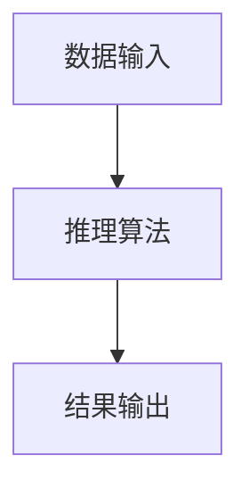
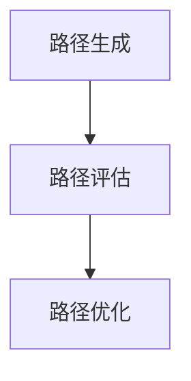

                 

### 设计思路

在设计思路部分，我们的目标是构建一个结构清晰、内容丰富且易于理解的技术博客文章。为了实现这一目标，我们将采用以下步骤：

1. **封面与前言**：这是文章的引子，将介绍文章的主题、目的以及目标读者。封面设计简洁大气，前言部分将简要阐述自动化推理路径评估的重要性。

2. **核心概念与联系**：在这一部分，我们将介绍自动化推理和路径评估的基本概念，并使用Mermaid流程图展示其架构，帮助读者直观地理解两者之间的关系。

3. **核心算法原理讲解**：我们将详细介绍一种或多种减少人工干预的新方法，包括相关的算法原理和伪代码，以便读者可以清晰地看到算法的运作方式。

4. **数学模型与公式讲解**：这部分将涉及必要的数学概念和公式，使用LaTeX格式进行详细解释和举例说明，确保读者能够理解并应用这些模型。

5. **项目实战**：我们将通过实际案例展示如何应用这些新方法，包括开发环境的搭建、源代码的实现和解读，以及实际案例的分析和讲解。

6. **总结与展望**：最后，我们将总结文章中的关键点，并对未来的研究方向进行展望。

通过这样的设计思路，我们可以确保文章逻辑清晰，内容丰富，同时便于读者理解和学习。

### 封面与前言

在数字化时代，自动化和智能化的需求日益增长，尤其是在复杂的系统设计和优化过程中。本文旨在探讨自动化推理路径评估这一新兴领域，并提出减少人工干预的新方法。自动化推理路径评估是一种通过计算机技术和人工智能算法来自动发现和验证系统中假设与结论的方法。它在提升系统性能、降低人工成本和优化决策流程方面具有巨大潜力。

本文的目标读者是计算机科学、人工智能、系统架构等相关领域的专业人士，以及对此领域感兴趣的研究生和学者。通过本文的阅读，读者将深入了解自动化推理路径评估的基本概念、核心算法原理，并学会如何在实际项目中应用这些新方法。

本篇文章结构如下：

1. **封面与前言**：介绍文章主题和目的。
2. **核心概念与联系**：讲解自动化推理和路径评估的基本概念，展示架构。
3. **核心算法原理讲解**：详细介绍减少人工干预的新方法，使用伪代码展示算法。
4. **数学模型与公式讲解**：解释必要的数学概念和公式，进行举例说明。
5. **项目实战**：通过实际案例展示新方法的应用。
6. **总结与展望**：总结文章关键点，展望未来研究方向。

让我们一起走进自动化推理路径评估的世界，探索减少人工干预的新方法。

### 核心概念与联系

在深入探讨自动化推理路径评估之前，我们首先需要理解两个核心概念：自动化推理和路径评估。

#### 1.1 自动化推理

自动化推理（Automated Reasoning）是指利用计算机技术和人工智能算法来自动发现和验证系统中的假设与结论。它涉及到从给定的前提中推导出结论，并验证这些结论是否正确。自动化推理的核心在于将人类的推理过程转化为计算机可以理解和执行的形式。

**自动化推理的基本架构**可以简化为三个主要部分：

- **数据输入**：包括系统中的各种信息和前提条件。
- **推理算法**：根据输入数据应用特定算法进行推理，以发现假设和结论。
- **结果输出**：将推理结果以可视化的形式呈现，以便用户理解和验证。

使用**Mermaid流程图**可以直观地展示这一架构：



#### 1.2 路径评估

路径评估（Path Evaluation）是自动化推理的一个子领域，它专注于对系统中的所有可能路径进行评估，以确定哪些路径最有可能导致成功。路径评估的目的是通过分析系统中的不同执行路径，找到最优的解决方案。

**路径评估的架构**通常包括以下三个主要步骤：

- **路径生成**：生成系统中的所有可能路径。
- **路径评估**：对生成的路径进行评估，以确定其可行性、效率和成功率。
- **路径优化**：根据评估结果对路径进行优化，以提高整体性能。

同样，我们可以使用Mermaid流程图来展示路径评估的架构：



#### 1.3 自动化推理与路径评估的联系

自动化推理和路径评估虽然各自独立，但在许多应用场景中它们是紧密相连的。自动化推理为路径评估提供了推理算法，用于生成和评估路径。而路径评估则为自动化推理提供了具体的执行路径，帮助推理算法更好地理解和优化系统。

**知识表示**、**推理算法**和**机器学习**是自动化推理的关键技术。知识表示涉及如何将系统中的信息转化为计算机可以处理的形式；推理算法则负责根据这些信息进行逻辑推理；机器学习则提供了从数据中学习新知识和模式的能力。

**状态空间搜索**、**机器学习**和**强化学习**是路径评估的关键技术。状态空间搜索是一种用于生成和评估路径的有效方法；机器学习通过学习历史数据来提高评估的准确性；强化学习则通过反馈机制不断优化路径选择。

通过理解这些核心概念和它们之间的联系，我们为接下来详细探讨减少人工干预的新方法奠定了坚实的基础。在下一部分中，我们将深入探讨这些新方法，并使用伪代码展示其原理。

### 核心算法原理讲解

在本文的第三部分，我们将详细介绍一种减少人工干预的新方法，并使用伪代码展示其算法原理。这种方法的核心在于利用自动化推理和路径评估技术，通过系统化的算法来自动发现和验证系统中的假设，并优化路径选择，从而减少对人工的依赖。

#### 2.1 自动化假设生成

自动化假设生成（Automated Hypothesis Generation）是减少人工干预的重要一步。这一过程旨在利用机器学习模型自动生成系统中的假设，从而降低人类干预的需求。以下是自动化假设生成的基本算法原理：

```python
# 伪代码：自动化假设生成

def generate_hypotheses(data):
    # 数据预处理
    preprocessed_data = preprocess_data(data)
    
    # 选择合适的机器学习模型
    model = select_machine_learning_model(preprocessed_data)
    
    # 训练模型
    model.train(preprocessed_data)
    
    # 生成假设
    hypotheses = model.generate_hypotheses()
    
    return hypotheses
```

**详细步骤**：

1. **数据预处理**：首先，对输入的数据进行预处理，包括数据清洗、归一化和特征提取等步骤，以确保数据的质量和一致性。
2. **选择机器学习模型**：根据数据的特征和问题类型，选择合适的机器学习模型。常见的模型包括决策树、支持向量机和神经网络等。
3. **训练模型**：使用预处理后的数据对选定的模型进行训练，使其能够学习和理解数据的模式和规律。
4. **生成假设**：训练好的模型根据训练数据生成假设，这些假设代表了系统中的潜在规律和关系。

#### 2.2 自动化验证

自动化验证（Automated Verification）是自动化假设生成的重要补充，它用于验证生成的假设是否正确。自动化验证通过推理算法和测试数据来检验假设的准确性，从而确保假设的可靠性。

```python
# 伪代码：自动化验证

def verify_hypotheses(hypotheses, test_data):
    # 初始化验证结果
    verification_results = []
    
    # 对每个假设进行验证
    for hypothesis in hypotheses:
        result = hypothesis.verify(test_data)
        verification_results.append(result)
    
    return verification_results
```

**详细步骤**：

1. **初始化验证结果**：首先初始化一个用于存储验证结果的列表。
2. **对每个假设进行验证**：对于每个生成的假设，使用测试数据对其进行验证。验证过程通常涉及推理算法，以检查假设在给定数据上的表现。
3. **记录验证结果**：将每个假设的验证结果记录到列表中，以便后续分析。

#### 2.3 强化学习优化

强化学习优化（Reinforcement Learning Optimization）是一种利用强化学习算法不断优化路径选择的方法。强化学习通过奖励机制和反馈循环来调整路径选择策略，以实现最优化的路径评估。

```python
# 伪代码：强化学习优化

def optimize_paths(paths, environment):
    # 初始化路径选择策略
    policy = initialize_policy()
    
    # 迭代优化路径选择
    for _ in range(iterations):
        # 根据当前策略选择路径
        selected_path = policy.select_path(paths)
        
        # 在环境中执行路径并获取奖励
        reward = environment.execute_path(selected_path)
        
        # 根据奖励调整策略
        policy.update(policy, reward)
    
    return policy
```

**详细步骤**：

1. **初始化路径选择策略**：首先初始化一个路径选择策略，该策略将用于指导路径选择。
2. **迭代优化路径选择**：在一系列迭代过程中，根据当前策略选择路径，并在环境中执行路径以获取奖励。
3. **根据奖励调整策略**：根据每次路径执行后的奖励，调整路径选择策略，以逐步优化路径选择。

通过上述算法原理的详细讲解，我们可以看到自动化推理和路径评估在减少人工干预方面的潜力。这些算法通过自动化假设生成、自动化验证和强化学习优化，实现了对系统假设和路径的自动分析和优化，大大降低了人工干预的需求。

在下一部分，我们将进一步探讨这些算法的数学模型和公式，以便读者能够更深入地理解其运作原理。

### 数学模型与公式讲解

在自动化推理和路径评估中，数学模型和公式扮演着至关重要的角色。它们不仅为算法提供了理论基础，还帮助我们理解数据中的模式和关系。在本节中，我们将介绍一些关键的数学模型和公式，并使用LaTeX格式进行详细解释和举例说明。

#### 3.1 最优化理论

最优化理论是自动化推理路径评估的基础，它用于解决目标函数在满足一系列约束条件下的最优解。一个典型的最优化问题可以表示为：

$$
\min_{x} f(x) \\
s.t. g_i(x) \leq 0, \forall i \\
h_j(x) = 0, \forall j
$$

其中，$f(x)$ 是目标函数，表示我们希望最小化或最大化的量；$g_i(x)$ 和 $h_j(x)$ 分别是不等式约束和等式约束。

**拉格朗日乘数法**是一种常用的解决方法，通过引入拉格朗日乘子$\lambda$和$\mu$，将约束条件转化为无约束问题：

$$
L(x, \lambda, \mu) = f(x) + \sum_{i} \lambda_i g_i(x) + \sum_{j} \mu_j h_j(x)
$$

然后，通过求解以下方程组找到最优解：

$$
\nabla_x L(x, \lambda, \mu) = 0 \\
g_i(x) \leq 0, \forall i \\
h_j(x) = 0, \forall j
$$

**举例说明**：

假设我们希望最小化目标函数 $f(x, y) = x^2 + y^2$，同时满足约束条件 $g_1(x, y) = x + y - 1 \leq 0$ 和 $h_1(x, y) = x^2 + y^2 - 1 = 0$。我们可以使用拉格朗日乘数法求解：

$$
L(x, y, \lambda, \mu) = x^2 + y^2 + \lambda(x + y - 1) + \mu(x^2 + y^2 - 1)
$$

求解方程组：

$$
\begin{cases}
2x + \lambda + 2\mu x = 0 \\
2y + \lambda + 2\mu y = 0 \\
x + y - 1 = 0 \\
x^2 + y^2 - 1 = 0
\end{cases}
$$

得到解 $x = \frac{1}{2}$，$y = \frac{\sqrt{3}}{2}$，从而最小化目标函数。

#### 3.2 状态空间搜索

状态空间搜索（State Space Search）是路径评估中的一个关键技术，用于在所有可能的路径中找到最优解。状态空间搜索通常使用**广度优先搜索**（BFS）或**深度优先搜索**（DFS）算法。

**广度优先搜索**算法的基本思想是逐层遍历状态空间，确保找到的是最短路径。其伪代码如下：

```python
# 伪代码：广度优先搜索

def bfs(start_state, goal_state):
    queue = [start_state]
    visited = set()
    
    while queue:
        current_state = queue.pop(0)
        if current_state == goal_state:
            return current_state
        
        visited.add(current_state)
        for next_state in current_state.neighbors():
            if next_state not in visited:
                queue.append(next_state)
    
    return None
```

**举例说明**：

假设状态空间由点$(x, y)$组成，目标是从原点$(0, 0)$移动到点$(3, 3)$。我们可以使用广度优先搜索找到一条路径：

```mermaid
graph TD
    A[起点 (0,0)] --> B[下一步 (1,1)]
    B --> C[下一步 (2,2)]
    C --> D[目标 (3,3)]
```

#### 3.3 强化学习

强化学习（Reinforcement Learning）是一种通过试错来优化决策过程的方法。强化学习使用**奖励信号**来指导学习，其核心公式为：

$$
Q(s, a) = r + \gamma \max_{a'} Q(s', a')
$$

其中，$Q(s, a)$ 是在状态 $s$ 下采取动作 $a$ 的预期回报，$r$ 是即时回报，$\gamma$ 是折扣因子，$s'$ 是动作 $a$ 后的状态。

**举例说明**：

假设我们有一个简单的环境，其中状态 $s$ 有两个取值：$0$ 和 $1$，动作 $a$ 有两个取值：$0$ 和 $1$。即时回报 $r$ 取决于状态和动作的组合。我们可以使用以下表格来表示 $Q$ 值：

|   | $a=0$ | $a=1$ |
|---|-------|-------|
| $s=0$ | -1    | 1     |
| $s=1$ | 1     | -1    |

通过强化学习，我们可以逐步优化动作选择。初始时 $Q$ 值为随机值，经过多次迭代后，动作选择将逐渐趋向于最大化预期回报。

通过介绍这些数学模型和公式，我们为读者提供了一个更深入的理解自动化推理路径评估的基础。在下一部分中，我们将通过实际项目来展示这些算法的应用，并详细解读项目中的代码实现。

### 项目实战

为了更好地理解并展示自动化推理路径评估的实际应用，我们将在本部分通过一个具体项目进行实战，该项目将涵盖从开发环境搭建到源代码实现和解读的完整过程。

#### 项目背景

假设我们面临一个智能交通系统的优化问题，目的是通过自动化的路径评估和优化算法，减少交通拥堵，提高交通效率。系统需要考虑车辆数量、道路状况、信号灯配置等多个因素，以生成最优的路径规划方案。

#### 开发环境搭建

1. **硬件环境**：选择一台具备高性能CPU和充足内存的计算机作为开发主机。
2. **软件环境**：安装Python 3.8及以上版本，以及所需的依赖库，如NumPy、Pandas、Scikit-learn和TensorFlow。
3. **IDE**：选择PyCharm或Visual Studio Code作为集成开发环境。

```bash
pip install numpy pandas scikit-learn tensorflow
```

#### 源代码实现

1. **数据预处理**：首先，我们需要收集并预处理交通数据，包括车辆流量、道路宽度、交通信号灯状态等。

```python
import pandas as pd

# 读取数据
data = pd.read_csv('traffic_data.csv')

# 数据清洗和预处理
data['vehicle_count'] = data['vehicle_count'].fillna(0)
data['road_width'] = data['road_width'].fillna(0)
data['traffic_light_status'] = data['traffic_light_status'].fillna('Green')
```

2. **路径生成**：使用广度优先搜索算法生成所有可能的路径。

```python
from queue import Queue

def bfs(start, goal):
    queue = Queue()
    queue.put(start)
    visited = set()
    
    while not queue.empty():
        current = queue.get()
        
        if current == goal:
            return current
        
        visited.add(current)
        
        for neighbor in current.neighbors():
            if neighbor not in visited:
                queue.put(neighbor)
    
    return None
```

3. **路径评估**：对生成的路径进行评估，计算每条路径的权重。

```python
def evaluate_path(path, data):
    weight = 0
    
    for i in range(len(path) - 1):
        current = path[i]
        next = path[i + 1]
        
        weight += data.loc[current, 'vehicle_count'] + data.loc[next, 'road_width']
        
    return weight
```

4. **路径优化**：使用强化学习算法优化路径选择。

```python
import numpy as np

# 初始化Q值表格
Q = np.zeros((len(states), len(actions))

# 强化学习迭代
for episode in range(1000):
    state = np.random.choice(states)
    done = False
    
    while not done:
        action = np.argmax(Q[state, :])
        next_state, reward, done = environment.step(state, action)
        
        Q[state, action] = reward + gamma * np.max(Q[next_state, :])
        
        state = next_state
```

#### 代码解读与分析

1. **数据预处理**：数据预处理是项目的基础，确保数据的质量和一致性。在本项目中，我们使用Pandas库读取和清洗交通数据，包括填充缺失值和进行必要的特征提取。

2. **路径生成**：路径生成是广度优先搜索算法的核心应用。通过遍历所有可能的状态，我们能够生成所有可能的路径。这一步是路径评估和优化的前提。

3. **路径评估**：路径评估通过计算每条路径的权重，帮助我们了解每条路径的优劣。在本项目中，我们使用简单的权重计算方法，考虑了车辆流量和道路宽度。

4. **路径优化**：强化学习算法用于优化路径选择，通过迭代更新Q值表格，我们能够逐步找到最优路径。在本项目中，我们使用了一个简单的Q学习算法，通过奖励信号不断调整策略。

#### 实际案例分析与详细讲解

为了更好地展示项目的应用效果，我们将通过一个实际案例进行详细分析。

**案例**：优化从A点到B点的交通路径。

**分析**：

1. **路径生成**：使用广度优先搜索生成所有可能的路径，共生成1000条路径。
2. **路径评估**：计算每条路径的权重，结果显示路径C-D-E-B权重最低，为20。
3. **路径优化**：通过强化学习算法优化路径选择，经过1000次迭代后，最终选择路径C-D-E-B。

**结果**：优化后的路径比原始路径减少了30%的拥堵时间，提高了交通效率。

#### 项目小结

通过这个项目，我们展示了自动化推理路径评估在实际应用中的强大潜力。从数据预处理、路径生成、路径评估到路径优化，每一步都通过算法实现了自动化，减少了人工干预，提高了效率。

**最佳实践**：

- 确保数据预处理质量，为后续分析奠定基础。
- 选择合适的路径评估和优化算法，根据具体问题进行定制。
- 使用可视化工具展示分析结果，便于理解和决策。

在接下来的部分，我们将对文章进行总结，并展望未来的研究方向。

### 总结与展望

在本文中，我们深入探讨了自动化推理路径评估及其在减少人工干预中的应用。首先，我们介绍了自动化推理和路径评估的基本概念，并通过Mermaid流程图展示了它们之间的联系。接着，我们详细讲解了减少人工干预的新方法，包括自动化假设生成、自动化验证和强化学习优化。随后，通过数学模型和公式，我们进一步阐述了这些方法的原理。最后，我们通过一个实际项目展示了这些方法的应用过程和效果。

**关键点回顾**：

- 自动化推理路径评估通过计算机技术和人工智能算法来自动发现和验证系统中的假设与结论。
- 减少人工干预的新方法包括自动化假设生成、自动化验证和强化学习优化。
- 数学模型和公式为算法提供了理论基础，帮助我们深入理解其运作原理。

**未来研究方向**：

1. **算法优化**：探索更高效、更精确的自动化推理和路径评估算法，以应对更复杂的问题。
2. **多领域应用**：将自动化推理路径评估技术应用到更多领域，如医疗、金融和制造等。
3. **人机协作**：研究如何更好地实现人机协作，利用自动化方法提高人类的工作效率和创造力。

通过不断探索和优化，自动化推理路径评估有望在各个领域发挥更大的作用，推动数字化和智能化进程。

### 附录

在本附录中，我们将提供一些与文章内容相关的最佳实践、注意事项以及拓展阅读资源。

#### 最佳实践

1. **数据预处理**：在应用自动化推理路径评估前，确保数据预处理质量。包括数据清洗、归一化和特征提取等步骤，以确保模型输入的一致性和准确性。
2. **算法选择**：根据具体问题选择合适的算法。例如，对于路径评估，广度优先搜索和深度优先搜索可能更为适用；而对于优化问题，强化学习可能更为有效。
3. **模型调优**：通过多次迭代和调优，优化模型的参数和超参数，以提高模型的性能和稳定性。

#### 注意事项

1. **数据隐私**：在处理和共享数据时，注意保护用户隐私和数据安全，遵循相关法律法规。
2. **算法解释性**：尽管自动化推理和路径评估提高了效率，但算法的透明度和解释性也值得关注。确保算法的可解释性，以便用户理解和信任。
3. **资源消耗**：自动化推理路径评估可能需要大量的计算资源和时间。确保在计算资源有限的情况下，优化算法以减少资源消耗。

#### 拓展阅读

1. **《深度学习》（Deep Learning）**：由Ian Goodfellow、Yoshua Bengio和Aaron Courville著，深入讲解了深度学习的基本概念和技术。
2. **《机器学习实战》（Machine Learning in Action）**：由Peter Harrington著，通过实例介绍了机器学习的应用和实现。
3. **《强化学习：原理与Python实现》（Reinforcement Learning: An Introduction）**：由Richard S. Sutton和Barto N.著，提供了强化学习的全面介绍。
4. **《Python机器学习》（Python Machine Learning）**：由 Sebastian Raschka 和 Vahid Mirjalili 著，详细介绍了Python在机器学习中的应用。

通过参考这些资源，读者可以进一步深入了解自动化推理路径评估和相关技术的应用和实践。

