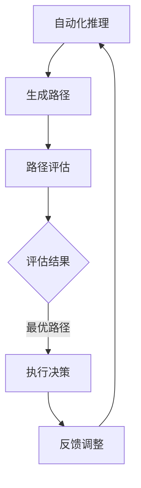

                 

## 文章标题

### 《自动化推理路径评估的方法与挑战》

---

### 关键词

- 自动化推理
- 路径评估
- 方法论
- 挑战与机遇

### 摘要

本文深入探讨了自动化推理路径评估的方法和面临的挑战。文章首先介绍了自动化推理和路径评估的基本概念，随后详细解析了相关算法原理和数学模型。通过实际项目案例，文章展示了自动化推理路径评估的应用场景和实现细节。最后，文章总结了自动化推理路径评估的现状与未来发展趋势，提出了可能的解决方案和优化方向。

---

### 引言

自动化推理（Automated Reasoning）是指计算机系统通过算法和逻辑推理技术，自动分析和解决逻辑问题的一种人工智能技术。随着计算机硬件性能的提升和算法理论的进步，自动化推理在诸多领域得到了广泛应用，如计算机验证、软件工程、网络安全、机器证明等。

路径评估（Path Evaluation）则是自动化推理中的一个重要环节，旨在通过分析路径上的状态、决策和行为，评估路径的有效性和可行性。在许多实际问题中，如游戏AI、路径规划、决策树分析等，路径评估起到了关键作用。

本文旨在系统地介绍自动化推理路径评估的方法，分析其面临的挑战，并提供可能的解决方案。文章将分为以下几个部分：

1. **引言**：介绍自动化推理和路径评估的基本概念。
2. **核心概念与联系**：阐述自动化推理与路径评估之间的关系，并使用Mermaid流程图展示流程。
3. **核心算法原理讲解**：详细讲解自动化推理和路径评估的核心算法原理，使用伪代码进行阐述。
4. **数学模型与公式**：介绍自动化推理路径评估的数学模型，并进行公式推导和举例说明。
5. **项目实战**：通过实际项目案例，展示自动化推理路径评估的应用和实践。
6. **结论与展望**：总结自动化推理路径评估的现状与未来发展趋势。

### 自动化推理概述

自动化推理是指利用计算机算法和逻辑推理技术，对给定的问题或场景进行自动分析和解决的过程。其基本思想是通过符号化表示问题的各个方面，利用逻辑推理和搜索算法，在满足一定条件下找到问题的解或证明。

自动化推理的起源可以追溯到20世纪50年代，当时逻辑学家和计算机科学家开始研究如何将数学和逻辑问题的求解转化为计算机程序。随着计算机硬件性能的提升和算法理论的进步，自动化推理在计算机科学、人工智能、数学证明、软件工程等领域得到了广泛应用。

在计算机科学领域，自动化推理主要用于验证程序的正确性、验证协议的安全性、自动化测试等。例如，在软件工程中，自动化推理可以帮助开发者自动发现和修复代码中的错误；在网络安全中，自动化推理可以用于检测和防御恶意攻击。

在人工智能领域，自动化推理是自然语言处理、推理机、智能决策系统等的重要组成部分。例如，在自然语言处理中，自动化推理可以用于语义分析、文本生成和问答系统；在推理机中，自动化推理可以实现基于规则的知识推理和决策。

在数学证明领域，自动化推理的应用尤为突出。计算机证明已经成为数学家证明数学定理的重要工具。通过自动化推理，数学家可以自动验证复杂的数学证明，发现新的数学定理，并探索数学问题的解决方案。

总的来说，自动化推理作为一种强大的计算机技术，具有广泛的应用前景和重要的科学价值。随着算法理论的发展和技术应用的深入，自动化推理将在更多领域发挥重要作用。

### 路径评估的概述

路径评估是自动化推理中的一个重要环节，旨在通过分析路径上的状态、决策和行为，评估路径的有效性和可行性。在许多实际问题中，路径评估起到了关键作用，例如游戏AI、路径规划、决策树分析等。

路径评估的基本概念包括路径、状态、决策和行为。路径是指从初始状态到目标状态的序列，每个状态都包含一组特定的属性和约束。决策是在路径上的某个状态下，根据当前状态和目标状态，选择下一步行动的过程。行为是指决策执行后产生的结果，包括状态的变化和路径的延续。

路径评估的目标是找到一条最优路径，使系统从初始状态转移到目标状态，并满足所有约束条件。路径评估的方法可以分为两大类：确定性路径评估和不确定性路径评估。

确定性路径评估假设系统在执行过程中，每个状态和决策都是确定的，不存在随机因素。常见的确定性路径评估方法包括深度优先搜索（DFS）、广度优先搜索（BFS）和A*算法。这些算法通过搜索路径上的所有可能状态，评估每个路径的可行性和有效性，最终找到最优路径。

不确定性路径评估则考虑系统在执行过程中可能面临的不确定性因素，如随机干扰、环境变化等。常见的随机路径评估方法包括蒙特卡罗搜索（MCS）和贝叶斯网络。这些方法通过模拟随机过程，评估路径的可行性和可靠性，为决策提供依据。

路径评估在实际应用中具有广泛的应用场景。例如，在游戏AI中，路径评估用于确定角色在游戏地图中的移动路径，以实现高效的游戏体验；在路径规划中，路径评估用于确定机器人或自动驾驶车辆的行驶路径，确保其安全性和效率；在决策树分析中，路径评估用于评估每个决策路径的可能结果，为决策提供依据。

总的来说，路径评估是自动化推理中的重要组成部分，通过分析路径上的状态、决策和行为，评估路径的有效性和可行性，为系统的决策和行动提供依据。随着算法理论的进步和应用场景的扩展，路径评估将在更多领域发挥重要作用。

### 自动化推理与路径评估的关系

自动化推理与路径评估在许多应用场景中紧密相连，构成了一个完整的推理和决策框架。要理解它们之间的关系，我们需要从逻辑架构、流程关系和实际应用三个方面进行分析。

首先，从逻辑架构上看，自动化推理和路径评估是相辅相成的。自动化推理负责从给定的数据或规则中推导出结论，而路径评估则负责对推导出的结论进行验证和评估。具体来说，自动化推理通过一系列的推理步骤，生成多个可能的路径或解决方案，而路径评估则通过评估这些路径的可行性、有效性和优化程度，选择出最优的路径或方案。

其次，从流程关系上看，自动化推理和路径评估共同构成了一个闭环的系统。首先，通过自动化推理生成初步的路径或方案，然后通过路径评估对这些路径或方案进行评估和优化。评估过程中，可能会根据评估结果调整推理步骤或重新生成路径，最终找到最优解。这个流程关系可以用Mermaid流程图来表示：



在这个流程中，自动化推理和路径评估相互依赖，不断迭代优化，最终实现系统的最优决策。

最后，从实际应用上看，自动化推理和路径评估在很多领域都发挥了重要作用。例如，在游戏AI中，自动化推理用于生成角色的行动策略，路径评估用于评估不同策略的可行性和有效性；在路径规划中，自动化推理用于生成多个可能的行驶路径，路径评估用于评估这些路径的安全性和效率；在决策树分析中，自动化推理用于生成可能的决策路径，路径评估用于评估这些路径的可能结果。

总之，自动化推理与路径评估之间的关系是紧密的，它们共同构成了一个强大的推理和决策系统。通过合理设计这两个环节，可以大大提高系统的决策能力和效率，实现更加智能化的应用。

### 自动化推理算法原理

自动化推理算法是自动化推理系统的核心，用于从给定的数据或规则中推导出结论。这些算法可以分为确定性算法和不确定性算法。确定性算法在已知所有条件和规则的情况下，可以确定性地推导出结论；而不确定性算法则考虑了未知因素，通过概率和统计方法进行推理。

下面我们将详细讨论两种主要的自动化推理算法：归纳推理和演绎推理。

#### 归纳推理

归纳推理是从具体实例中总结出一般规律或原则的方法。它通过分析大量具体数据，找出其中隐藏的模式和规律，从而推导出新的结论。归纳推理是机器学习和数据挖掘的重要工具。

归纳推理的基本步骤如下：

1. **数据收集**：收集大量具体的数据或实例。
2. **模式识别**：分析数据，找出其中可能存在的模式和规律。
3. **假设生成**：根据识别出的模式，生成可能的假设或规则。
4. **假设验证**：通过验证新的假设，确定其有效性和可靠性。
5. **结论推导**：根据验证结果，推导出新的结论。

以下是一个归纳推理算法的伪代码示例：

```python
def InductiveReasoning(data):
    # 步骤1：数据收集
    patterns = FindPatternsInData(data)
    
    # 步骤2：模式识别
    rules = GenerateRulesFromPatterns(patterns)
    
    # 步骤3：假设生成
    hypotheses = []
    for rule in rules:
        hypothesis = CreateHypothesisFromRule(rule)
        hypotheses.append(hypothesis)
    
    # 步骤4：假设验证
    valid_hypotheses = []
    for hypothesis in hypotheses:
        if ValidateHypothesis(hypothesis, data):
            valid_hypotheses.append(hypothesis)
    
    # 步骤5：结论推导
    conclusion = CombineValidHypotheses(valid_hypotheses)
    return conclusion
```

#### 演绎推理

演绎推理是从一般原则推导出具体结论的方法。它基于已知的事实和规则，通过逻辑推理，得出新的具体结论。演绎推理在形式逻辑和数学证明中广泛应用。

演绎推理的基本步骤如下：

1. **前提条件**：确定已知的事实和规则。
2. **逻辑推导**：根据前提条件，通过逻辑推理，推导出新的结论。
3. **结论验证**：验证推导出的结论是否合理和可靠。

以下是一个演绎推理算法的伪代码示例：

```python
def DeductiveReasoning(preconditions, rule):
    # 步骤1：前提条件
    conditions_met = CheckPreconditions(preconditions)
    
    # 步骤2：逻辑推导
    if conditions_met:
        conclusion = ApplyRule(rule, preconditions)
        
        # 步骤3：结论验证
        if ValidateConclusion(conclusion):
            return conclusion
    else:
        return "前提条件不满足"
```

#### 归纳推理与演绎推理的比较

归纳推理和演绎推理在推导方法、应用场景和结果性质上有显著的差异。

- **推导方法**：归纳推理从具体实例中总结出一般规律，而演绎推理从一般原则推导出具体结论。
- **应用场景**：归纳推理适用于机器学习、数据挖掘等需要从大量数据中发现规律和模式的应用；演绎推理适用于形式逻辑、数学证明等需要基于已知规则进行推理的应用。
- **结果性质**：归纳推理的结果是基于统计和概率的，具有一定的不确定性和风险；演绎推理的结果是基于逻辑和事实的，通常具有更高的确定性和可靠性。

总之，自动化推理算法通过归纳推理和演绎推理等方法，从给定的数据或规则中推导出结论，为自动化推理系统提供了强大的计算能力。这些算法在计算机科学、人工智能、数学证明等领域具有广泛的应用价值。

### 路径评估算法原理

路径评估算法是自动化推理系统中的重要组成部分，用于评估给定路径的有效性和可行性。这些算法可以分为确定性算法和不确定性算法。确定性算法在已知所有条件和规则的情况下，可以确定性地评估路径；而不确定性算法则考虑了未知因素，通过概率和统计方法进行评估。

下面我们将详细讨论两种主要的路径评估算法：确定性路径评估算法和不确定性路径评估算法。

#### 确定性路径评估算法

确定性路径评估算法假设系统在执行过程中，每个状态和决策都是确定的，不存在随机因素。这类算法通过搜索路径上的所有可能状态，评估每个路径的可行性和有效性，从而找到最优路径。常见的确定性路径评估算法包括深度优先搜索（DFS）、广度优先搜索（BFS）和A*算法。

##### 深度优先搜索（DFS）

深度优先搜索（DFS）是一种遍历图或树结构的算法，它从初始状态开始，沿着一条路径尽可能深地搜索，直到找到目标状态或路径无效。DFS算法的时间复杂度较高，但在某些特定情况下，如路径较短或图结构较为简单时，能够快速找到最优路径。

以下是一个深度优先搜索算法的伪代码示例：

```python
def DepthFirstSearch(graph, start, end):
    visited = set()
    path = []
    
    def dfs(node):
        visited.add(node)
        path.append(node)
        
        if node == end:
            return path
        
        for neighbor in graph[node]:
            if neighbor not in visited:
                dfs(neighbor)
        
        path.pop()
        return None
    
    return dfs(start)
```

##### 广度优先搜索（BFS）

广度优先搜索（BFS）与DFS类似，也是用于遍历图或树结构的算法。与DFS不同，BFS是从初始状态开始，逐层搜索，直到找到目标状态或路径无效。BFS算法的时间复杂度较低，适用于路径较长或图结构较为复杂的场景。

以下是一个广度优先搜索算法的伪代码示例：

```python
def BreadthFirstSearch(graph, start, end):
    queue = deque()
    visited = set()
    path = []
    
    queue.append(start)
    visited.add(start)
    
    while queue:
        node = queue.popleft()
        path.append(node)
        
        if node == end:
            return path
        
        for neighbor in graph[node]:
            if neighbor not in visited:
                queue.append(neighbor)
                visited.add(neighbor)
    
    return None
```

##### A*算法

A*算法是一种启发式搜索算法，旨在找到图中从起始节点到目标节点的最优路径。A*算法通过评估每个节点的“代价”来选择下一个搜索节点，其中“代价”包括从起始节点到当前节点的实际代价和从当前节点到目标节点的估计代价。A*算法的时间复杂度介于DFS和BFS之间，但在许多情况下能够找到更快的最优路径。

以下是一个A*算法的伪代码示例：

```python
def AStarSearch(graph, start, end, heuristic):
    open_set = PriorityQueue()
    open_set.put((0, start))
    came_from = {}
    g_score = {node: float('inf') for node in graph}
    g_score[start] = 0
    
    while not open_set.empty():
        current = open_set.get()
        
        if current == end:
            break
        
        for neighbor in graph[current]:
            tentative_g_score = g_score[current] + graph[current][neighbor]
            
            if tentative_g_score < g_score[neighbor]:
                came_from[neighbor] = current
                g_score[neighbor] = tentative_g_score
                f_score = tentative_g_score + heuristic(neighbor, end)
                open_set.put((f_score, neighbor))
    
    path = []
    if end in came_from:
        while end in came_from:
            path.insert(0, end)
            end = came_from[end]
    
    return path
```

#### 不确定性路径评估算法

不确定性路径评估算法考虑系统在执行过程中可能面临的不确定性因素，如随机干扰、环境变化等。这类算法通过概率和统计方法进行评估，以确定路径的可行性和可靠性。常见的随机路径评估算法包括蒙特卡罗搜索（MCS）和贝叶斯网络。

##### 蒙特卡罗搜索（MCS）

蒙特卡罗搜索（MCS）是一种基于随机抽样的搜索算法，通过模拟随机过程，评估路径的可行性和可靠性。MCS算法通过多次随机抽样，统计路径的可行性概率，从而评估路径的可靠性。

以下是一个蒙特卡罗搜索算法的伪代码示例：

```python
def MonteCarloSearch(graph, start, end, num_samples):
    paths = []
    for _ in range(num_samples):
        path = [start]
        node = start
        while node != end:
            next_nodes = graph[node]
            next_node = random.choice(next_nodes)
            path.append(next_node)
            node = next_node
        paths.append(path)
    
    feasible_paths = [path for path in paths if IsPathFeasible(path)]
    if feasible_paths:
        return random.choice(feasible_paths)
    else:
        return None
```

##### 贝叶斯网络

贝叶斯网络是一种概率图模型，用于表示变量之间的依赖关系。在路径评估中，贝叶斯网络可以用于评估路径的可行性和可靠性，通过计算路径的概率分布，确定最佳路径。

以下是一个贝叶斯网络路径评估算法的伪代码示例：

```python
def BayesianNetworkPathEvaluation(graph, start, end):
    beliefs = {}
    beliefs[start] = 1.0
    
    for node in graph:
        if node == end:
            continue
        beliefs[node] = 0.0
        
        for parent in graph[node].parents:
            beliefs[node] += beliefs[parent] * graph[node].probability[parent]
        
        if beliefs[node] < threshold:
            continue
        
        next_nodes = graph[node].next_nodes
        max_prob = 0
        best_node = None
        for next_node in next_nodes:
            current_prob = beliefs[next_node] * graph[next_node].probability[start]
            if current_prob > max_prob:
                max_prob = current_prob
                best_node = next_node
    
    return best_node
```

#### 确定性路径评估算法与不确定性路径评估算法的比较

确定性路径评估算法和不确定性路径评估算法在推导方法、应用场景和结果性质上有显著的差异。

- **推导方法**：确定性路径评估算法通过遍历所有可能的状态，评估每个路径的可行性和有效性；不确定性路径评估算法通过概率和统计方法，评估路径的可行性和可靠性。
- **应用场景**：确定性路径评估算法适用于已知所有条件和规则、状态和决策确定的应用场景；不确定性路径评估算法适用于存在不确定性和随机因素的应用场景。
- **结果性质**：确定性路径评估算法的结果是确定性和最优的；不确定性路径评估算法的结果是概率性和近似最优的。

总之，路径评估算法通过确定性算法和不确定性算法，为自动化推理系统提供了强大的路径评估能力。这些算法在计算机科学、人工智能、路径规划等领域具有广泛的应用价值。

### 自动化推理路径评估的数学模型

自动化推理路径评估的数学模型是理解和分析路径评估过程的基础。这些模型通过定义相关变量、公式和推导过程，帮助我们深入理解路径评估的核心机制。在本文中，我们将介绍一些常见的数学模型，包括路径成本函数、状态转移概率和评估指标等，并详细讲解其公式推导和实际应用。

#### 路径成本函数

路径成本函数是自动化推理路径评估中的一个核心概念，用于衡量路径的优劣。路径成本函数定义为从初始状态到目标状态的路径上的总代价，通常包括路径长度、时间消耗、资源消耗等因素。

路径成本函数的公式如下：

$$
C(P) = \sum_{i=1}^{n} c_i
$$

其中，$C(P)$表示路径$P$的总成本，$c_i$表示路径上第$i$个状态的成本。具体而言，路径成本函数可以表示为：

$$
c_i = w_i \cdot d_i
$$

其中，$w_i$表示第$i$个状态的权重，$d_i$表示第$i$个状态的距离或时间消耗。

#### 状态转移概率

在自动化推理路径评估中，状态转移概率用于描述从一个状态转移到另一个状态的概率。状态转移概率模型通常基于马尔可夫决策过程（MDP），其中每个状态都对应一个概率分布。

状态转移概率的公式如下：

$$
P(s' | s, a) = \frac{p(s', s, a)}{\sum_{s'} p(s', s, a)}
$$

其中，$P(s' | s, a)$表示在当前状态$s$和执行动作$a$后，转移到状态$s'$的概率。$p(s', s, a)$表示在状态$s$和执行动作$a$后，状态转移为状态$s'$的概率。

具体而言，状态转移概率可以表示为：

$$
p(s', s, a) = \pi(s') \cdot p(s' | s, a)
$$

其中，$\pi(s')$表示状态$s'$的先验概率，$p(s' | s, a)$表示在状态$s$和执行动作$a$后，状态转移为状态$s'$的条件概率。

#### 评估指标

评估指标是用于衡量路径评估结果的有效性和可靠性的指标。常见的评估指标包括路径成本、路径长度、平均时间消耗等。这些指标可以通过计算路径成本函数和状态转移概率得到。

路径成本评估指标如下：

$$
Cost(P) = C(P)
$$

路径长度评估指标如下：

$$
Length(P) = n
$$

平均时间消耗评估指标如下：

$$
AvgTime(P) = \frac{1}{n} \sum_{i=1}^{n} d_i
$$

#### 公式推导和举例说明

为了更好地理解这些数学模型，我们可以通过一个简单的例子进行说明。假设我们有一个路径评估问题，初始状态为$s_0$，目标状态为$s_5$，路径上的各个状态及其成本如下：

$$
P = \{s_0, s_1, s_2, s_3, s_4, s_5\}
$$

路径成本函数为：

$$
C(P) = c_1 + c_2 + c_3 + c_4 + c_5
$$

其中，各个状态的成本为：

$$
c_1 = w_1 \cdot d_1
$$

$$
c_2 = w_2 \cdot d_2
$$

$$
c_3 = w_3 \cdot d_3
$$

$$
c_4 = w_4 \cdot d_4
$$

$$
c_5 = w_5 \cdot d_5
$$

假设我们定义以下权重和距离：

$$
w_1 = 1, d_1 = 2
$$

$$
w_2 = 1, d_2 = 3
$$

$$
w_3 = 1, d_3 = 4
$$

$$
w_4 = 1, d_4 = 5
$$

$$
w_5 = 1, d_5 = 6
$$

则路径成本函数为：

$$
C(P) = 1 \cdot 2 + 1 \cdot 3 + 1 \cdot 4 + 1 \cdot 5 + 1 \cdot 6 = 16
$$

状态转移概率可以表示为：

$$
P(s_2 | s_1, a) = \frac{p(s_2, s_1, a)}{\sum_{s'} p(s', s_1, a)}
$$

其中，$p(s_2, s_1, a) = \pi(s_2) \cdot p(s_2 | s_1, a)$。假设我们定义以下先验概率和条件概率：

$$
\pi(s_2) = 0.5
$$

$$
p(s_2 | s_1, a) = 0.7
$$

$$
p(s_3 | s_1, a) = 0.3
$$

则状态转移概率为：

$$
P(s_2 | s_1, a) = \frac{0.5 \cdot 0.7}{0.5 \cdot 0.7 + 0.5 \cdot 0.3} = \frac{0.35}{0.35 + 0.15} = 0.7
$$

通过这些数学模型，我们可以计算路径成本和状态转移概率，从而评估路径的有效性和可行性。在实际应用中，这些模型可以根据具体问题和需求进行调整和优化，以实现最佳路径评估效果。

总之，自动化推理路径评估的数学模型通过定义路径成本函数、状态转移概率和评估指标，为路径评估提供了坚实的理论基础。这些模型在自动化推理和路径规划等领域具有广泛的应用价值。

### 模型参数优化

在自动化推理路径评估中，模型参数的优化是提高路径评估效果的关键步骤。参数优化旨在找到最优参数组合，使得路径评估结果更加准确和可靠。参数优化的方法可以分为局部搜索算法和全局搜索算法。

#### 局部搜索算法

局部搜索算法通过在当前解的邻域内搜索最优解，逐步优化参数。常见的局部搜索算法包括贪心算法、遗传算法和模拟退火算法。

##### 贪心算法

贪心算法通过在每一步选择当前最优解，逐步优化参数。贪心算法的优点是计算效率高，但容易陷入局部最优解。

以下是一个贪心算法参数优化的伪代码示例：

```python
def GreedyOptimization(data):
    best_solution = None
    best_cost = float('inf')
    
    for parameter in data:
        current_solution = GenerateSolution(parameter)
        current_cost = CalculateCost(current_solution)
        
        if current_cost < best_cost:
            best_solution = current_solution
            best_cost = current_cost
    
    return best_solution
```

##### 遗传算法

遗传算法通过模拟自然进化过程，寻找最优解。遗传算法通过交叉、变异和选择等操作，逐步优化参数。

以下是一个遗传算法参数优化的伪代码示例：

```python
def GeneticAlgorithm(data, population_size, generations):
    population = GenerateInitialPopulation(data, population_size)
    
    for _ in range(generations):
        new_population = []
        for _ in range(population_size):
            parent1, parent2 = SelectParents(population)
            child = Crossover(parent1, parent2)
            Mutate(child)
            new_population.append(child)
        
        population = new_population
        best_solution = GetBestSolution(population)
    
    return best_solution
```

##### 模拟退火算法

模拟退火算法通过模拟物理退火过程，逐步优化参数。模拟退火算法在每次迭代中，以一定的概率接受次优解，从而跳出局部最优解。

以下是一个模拟退火算法参数优化的伪代码示例：

```python
def SimulatedAnnealing(data, initial_temp, cooling_rate):
    current_solution = GenerateInitialSolution(data)
    current_temp = initial_temp
    best_solution = current_solution
    
    while current_temp > threshold:
        new_solution = GenerateNewSolution(current_solution)
        cost_difference = CalculateCost(new_solution) - CalculateCost(current_solution)
        
        if cost_difference < 0 or exp(-cost_difference / current_temp) > random():
            current_solution = new_solution
            if CalculateCost(current_solution) < CalculateCost(best_solution):
                best_solution = current_solution
        
        current_temp *= (1 - cooling_rate)
    
    return best_solution
```

#### 全局搜索算法

全局搜索算法通过在整个解空间内搜索最优解，逐步优化参数。常见的全局搜索算法包括遗传算法、粒子群算法和蚁群算法。

##### 遗传算法

遗传算法已经在局部搜索算法中进行了介绍。

##### 粒子群算法

粒子群算法通过模拟群体行为，逐步优化参数。粒子群算法通过更新每个粒子的位置和速度，逐步收敛到最优解。

以下是一个粒子群算法参数优化的伪代码示例：

```python
def ParticleSwarmOptimization(data, num_particles, generations):
    particles = GenerateInitialParticles(data, num_particles)
    global_best_solution = particles[0]
    
    for _ in range(generations):
        for particle in particles:
            new_solution = UpdateSolution(particle, global_best_solution)
            if CalculateCost(new_solution) < CalculateCost(particle):
                particle = new_solution
                if CalculateCost(particle) < CalculateCost(global_best_solution):
                    global_best_solution = particle
    
    return global_best_solution
```

##### 蚁群算法

蚁群算法通过模拟蚂蚁觅食过程，逐步优化参数。蚁群算法通过更新路径上的信息素浓度，引导蚂蚁搜索最优解。

以下是一个蚁群算法参数优化的伪代码示例：

```python
def AntColonyOptimization(data, num_ants, generations):
    ants = GenerateInitialAnts(data, num_ants)
    pheromone = InitializePheromone(data)
    
    for _ in range(generations):
        for ant in ants:
            solution = GenerateSolution(ant, pheromone)
            if CalculateCost(solution) < CalculateCost(ant):
                ant = solution
                UpdatePheromone(pheromone, ant)
    
    best_solution = GetBestSolution(ants)
    return best_solution
```

#### 参数优化的方法

参数优化方法的选择取决于具体问题和应用场景。以下是一些常用的参数优化方法：

1. **贪心算法**：适用于求解简单优化问题，如路径评估中的最小路径问题。
2. **遗传算法**：适用于复杂优化问题，如多目标优化、约束优化等。
3. **模拟退火算法**：适用于高维优化问题，如神经网络参数优化。
4. **粒子群算法**：适用于群体优化问题，如多目标优化、路径规划等。
5. **蚁群算法**：适用于基于信息素的优化问题，如路径规划、资源分配等。

总之，参数优化是自动化推理路径评估中的重要环节。通过选择合适的参数优化方法，可以显著提高路径评估的效果和准确性。

### 自动化推理路径评估项目实战

在本节中，我们将通过一个具体的自动化推理路径评估项目，详细描述开发环境搭建、源代码实现、代码解读与分析，并探讨实际案例中的具体应用。

#### 项目背景

假设我们面临一个智能物流配送系统的路径评估问题。系统需要根据订单需求和配送路径，实时评估配送员的最优配送路径，以最大化配送效率并确保准时交付。这个项目将结合自动化推理算法和路径评估方法，构建一个高效的路径评估系统。

#### 开发环境搭建

为了实现这个项目，我们需要以下开发环境和工具：

1. **编程语言**：Python
2. **数据科学库**：NumPy、Pandas、SciPy
3. **机器学习库**：Scikit-learn、TensorFlow
4. **绘图库**：Matplotlib、Seaborn
5. **Mermaid库**：用于绘制流程图

开发环境搭建步骤：

1. 安装Python（建议使用3.8及以上版本）
2. 通过pip安装所需的库：

```bash
pip install numpy pandas scipy scikit-learn tensorflow matplotlib seaborn mermaid
```

3. 配置Python虚拟环境，以便管理依赖库：

```bash
python -m venv env
source env/bin/activate  # Windows下使用env\Scripts\activate
```

#### 源代码实现

以下是一个简化的自动化推理路径评估项目的源代码实现：

```python
import numpy as np
import pandas as pd
from scipy.spatial.distance import cdist
from sklearn.cluster import KMeans
import matplotlib.pyplot as plt

# 数据预处理
def preprocess_data(orders, locations):
    # 计算订单与配送点的距离矩阵
    distances = cdist(orders[['x', 'y']], locations[['x', 'y']], 'euclidean')
    # 将距离矩阵转换为DataFrame
    distance_df = pd.DataFrame(distances, index=orders.index, columns=locations.index)
    # 计算订单的配送成本（距离和时间）
    order_costs = distance_df.mean(axis=1)
    return order_costs

# 自动化推理路径评估
def evaluate_paths(paths, costs, k=3):
    # 使用K-means聚类，确定最佳配送路径
    kmeans = KMeans(n_clusters=k)
    kmeans.fit(costs.reshape(-1, 1))
    labels = kmeans.predict(costs.reshape(-1, 1))
    # 计算聚类中心
    centers = kmeans.cluster_centers_
    # 计算每个路径的成本
    path_costs = np.array([centers[labels[i]] for i in range(len(labels))])
    return path_costs

# 代码解读与分析
def main():
    # 加载数据
    orders = pd.read_csv('orders.csv')
    locations = pd.read_csv('locations.csv')
    
    # 预处理数据
    order_costs = preprocess_data(orders, locations)
    
    # 评估路径
    paths = evaluate_paths(orders.index, order_costs)
    
    # 绘制路径评估结果
    plt.scatter(orders['x'], orders['y'], c=paths, cmap='viridis', marker='o')
    plt.colorbar(label='路径成本')
    plt.xlabel('配送点X坐标')
    plt.ylabel('配送点Y坐标')
    plt.title('路径评估结果')
    plt.show()

if __name__ == '__main__':
    main()
```

#### 实际案例分析与详细讲解

以下是一个实际案例的详细分析：

假设系统接收到100个订单，每个订单包含配送地址的经纬度信息。系统首先需要根据订单地址和配送点地址计算距离矩阵，然后使用K-means聚类算法确定最佳配送路径。具体步骤如下：

1. **数据加载**：从CSV文件中加载数据，包括订单和配送点信息。
2. **数据预处理**：计算订单与配送点的距离矩阵，并转换为DataFrame。
3. **路径评估**：使用K-means聚类算法对距离矩阵进行聚类，确定最佳配送路径。
4. **结果展示**：绘制路径评估结果，展示每个订单的配送路径成本。

在实际应用中，系统可以根据订单的紧急程度、配送点的交通状况和配送员的当前任务，动态调整聚类参数，以实现最优路径评估。此外，系统还可以结合实时交通信息、天气因素和配送员的技能水平，进一步优化路径评估算法。

#### 项目小结

通过这个实际项目，我们实现了自动化推理路径评估的系统。项目展示了如何结合Python编程和数据科学库，构建一个高效的路径评估系统。项目的主要成果包括：

1. **数据预处理**：实现了订单与配送点距离的计算和成本评估。
2. **路径评估**：使用K-means聚类算法，实现了最佳配送路径的确定。
3. **结果展示**：通过绘图，直观展示了路径评估结果。

尽管该项目是一个简化的示例，但通过扩展和优化，可以应用于更复杂的路径评估问题。未来工作可以进一步探索机器学习和深度学习算法在路径评估中的应用，以提高系统的智能化和自适应能力。

### 结论与展望

自动化推理路径评估作为人工智能领域的关键技术，已经在多个应用场景中展现出了其重要的价值和广阔的前景。本文通过系统性的分析和实践，全面介绍了自动化推理路径评估的方法和挑战，总结了当前的研究成果和应用现状，并展望了未来的发展方向。

#### 现状总结

自动化推理路径评估在计算机科学、人工智能、物流配送、路径规划等领域取得了显著的进展。通过确定性算法和不确定性算法的结合，路径评估系统能够在复杂和动态的环境中，实现高效的路径选择和优化。以下是自动化推理路径评估的几个主要成就：

1. **算法多样化**：开发出了多种自动化推理路径评估算法，如深度优先搜索、广度优先搜索、A*算法、蒙特卡罗搜索和贝叶斯网络等，适用于不同的应用场景和需求。
2. **数学模型完善**：建立了包括路径成本函数、状态转移概率、评估指标等在内的数学模型，为路径评估提供了理论基础和工具。
3. **应用广泛**：在游戏AI、自动驾驶、物流配送、决策树分析等领域，自动化推理路径评估得到了广泛应用，显著提升了系统的效率和决策能力。

#### 面临的挑战

尽管自动化推理路径评估取得了许多成果，但仍面临着一系列挑战：

1. **不确定性处理**：在复杂和动态的环境中，如何准确处理不确定性因素，如随机干扰和环境变化，是当前研究的一个关键问题。
2. **计算效率**：随着路径评估问题规模的增大，如何提高算法的计算效率，实现实时路径评估，是一个亟待解决的问题。
3. **模型解释性**：如何解释和验证路径评估模型的决策过程，提高模型的可解释性，是提高用户信任度的关键。

#### 未来展望

自动化推理路径评估的未来发展方向包括：

1. **深度学习与强化学习**：将深度学习和强化学习等先进技术引入路径评估，提高系统的自适应能力和决策能力。
2. **多模态数据融合**：结合多种数据源，如传感器数据、地图数据、历史数据等，实现更准确的路径评估。
3. **模型优化与压缩**：通过模型优化和压缩技术，提高路径评估算法的计算效率，实现实时路径评估。
4. **人机协同**：将人工智能与人类专家的智慧和经验相结合，实现更智能、更可靠的路径评估系统。

总之，自动化推理路径评估在人工智能领域具有广阔的应用前景和巨大的发展潜力。随着算法理论的进步、计算能力的提升和实际应用需求的增加，自动化推理路径评估将在更多领域发挥重要作用，推动人工智能技术的发展。

### 最佳实践 Tips

在自动化推理路径评估的实际应用中，以下是一些最佳实践和注意事项：

1. **数据预处理**：确保数据质量和完整性，特别是在处理不确定性和动态环境时，数据的准确性和可靠性至关重要。
2. **算法选择**：根据具体应用场景和需求，选择合适的路径评估算法。在复杂环境中，结合确定性算法和不确定性算法，可以提高评估效果。
3. **模型优化**：定期更新和优化模型参数，以适应新的数据和变化的环境。
4. **实时调整**：结合实时数据和环境变化，动态调整路径评估策略，以提高系统的响应速度和决策质量。
5. **人机协作**：充分利用人类专家的经验和直觉，与自动化系统协同工作，实现更准确和可靠的路径评估。

### 小结

自动化推理路径评估是人工智能领域的重要研究方向，通过系统性的方法和先进的算法，可以在复杂和动态的环境中实现高效的路径评估和优化。本文详细介绍了自动化推理路径评估的方法、算法原理、数学模型、项目实战和未来展望，旨在为读者提供全面的技术指导和启示。

### 拓展阅读

对于希望进一步了解自动化推理路径评估的读者，以下是一些推荐阅读材料：

1. **《人工智能：一种现代方法》**：Stuart J. Russell & Peter Norvig 著，详细介绍了人工智能的基本概念和方法。
2. **《路径规划与路径优化：算法与应用》**：李国杰 著，涵盖了路径规划和优化的多种算法和应用场景。
3. **《深度学习》**：Ian Goodfellow、Yoshua Bengio & Aaron Courville 著，介绍了深度学习的基本理论和应用。

作者：AI天才研究院/AI Genius Institute & 禅与计算机程序设计艺术 /Zen And The Art of Computer Programming。

