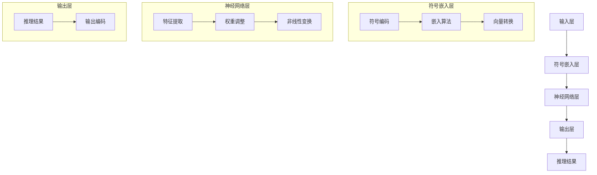

                 


### 撰写步骤：

#### 1. 文章标题
- 确定文章的核心主题，确保标题能够吸引读者的注意，同时涵盖文章的主要内容。

#### 2. 文章关键词
- 精选5-7个核心关键词，这些关键词能够概括文章的主题，便于读者检索和理解文章内容。

#### 3. 摘要
- 撰写摘要，简要介绍文章的主题、核心观点和主要内容，引导读者了解文章的基本信息。

#### 4. 目录大纲
- 设计详细的目录大纲，确保文章的结构清晰、逻辑连贯。

#### 5. 第一部分：神经符号推理基础
   - 引论
     - 背景与意义
     - 核心概念与联系
     - 研究现状
   - 神经符号推理原理
     - 神经网络基础
     - 符号处理机制
     - 神经符号推理架构
   - 神经符号推理核心算法
     - 深度学习在符号处理中的应用
     - 符号嵌入算法伪代码
     - 推理算法伪代码

#### 6. 第二部分：自动定理生成器原理
   - 定理生成基本原理
     - 定理生成的基本流程
     - 定理生成的挑战
   - 定理生成算法
     - 伪代码：定理生成算法
     - 数学公式和解释
     - 实例分析

#### 7. 第三部分：神经符号推理在定理证明中的应用
   - 应用场景
     - 定理证明的挑战
     - 神经符号推理的优势
   - 实际案例
     - 案例介绍
     - 源代码实现和解读
     - 代码应用解读

#### 8. 第四部分：前沿研究与应用
   - 前沿研究进展
     - 最新研究成果
     - 技术挑战与展望
   - 应用领域
     - 神经符号推理在其他领域的应用
     - 实际案例分享

#### 9. 第五部分：总结与展望
   - 技术总结
     - 神经符号推理的发展趋势
     - 定理证明领域的未来方向
   - 拓展阅读
     - 推荐阅读材料

#### 10. 附录：相关资源与工具介绍
   - 资源介绍
     - 开发工具
     - 学习资源
   - 注意事项
     - 实践中需要注意的问题
   - 最佳实践
     - 提高工作效率的建议

#### 11. 文章末尾：作者信息
- 确保在文章末尾附上完整的作者信息，包括作者单位和作品系列。

### 撰写技巧：
- 使用Markdown格式，确保代码块、公式和流程图等元素的正确显示。
- 保持段落简洁，每个段落只包含一个主要观点。
- 使用标题、子标题来组织文章结构，使内容清晰易懂。
- 在适当的位置添加图表、伪代码和数学公式，以增强文章的可读性和理解度。
- 注意避免重复内容，确保每个章节都有独特的内容和贡献。

通过上述步骤，我们可以撰写一篇内容丰富、结构清晰、逻辑严密的技术博客文章，不仅能够传达技术知识，还能启发读者的思考。让我们一起一步一步地构建这篇文章，确保它的质量和深度。 ## 第1章：引论

### 1.1 背景与意义

自动定理生成器（ATG）是一种基于人工智能技术的工具，旨在自动化数学定理的发现和证明过程。这一技术的出现，标志着人工智能在数学领域的一个重大突破，为数学研究、计算机科学、逻辑学等多个学科提供了新的研究方法和工具。

自动定理生成器的重要性不仅在于其能够大幅度提高定理发现的效率，还在于它对数学知识体系的拓展和深化。传统的数学研究主要依赖于数学家的经验和直觉，而自动定理生成器则通过算法和计算能力，能够探索人类难以触及的数学领域。同时，自动定理生成器在计算机科学中也有着广泛的应用，如自动验证、形式化验证等领域。

神经符号推理作为一种结合神经网络和符号逻辑的推理方法，为自动定理生成提供了新的思路。传统的定理证明方法主要依赖于逻辑推理和演绎过程，而神经符号推理则利用神经网络强大的特征提取和学习能力，将符号逻辑与数值计算相结合，从而实现了在更高层次上的推理和证明。

神经符号推理在自动定理生成中的应用，不仅提高了定理生成的效率和准确性，还拓展了定理证明的范围。通过神经符号推理，自动定理生成器能够处理更加复杂的数学问题，发现和证明新的数学定理。此外，神经符号推理还可以与其他人工智能技术相结合，如生成对抗网络（GAN）、强化学习等，进一步丰富自动定理生成器的功能和性能。

总之，自动定理生成器在数学和计算机科学中的应用，以及神经符号推理的引入，为定理发现和证明带来了全新的可能性和挑战。这一领域的研究不仅具有重要的学术价值，还将在实际应用中产生深远的影响。

### 1.2 神经符号推理的基本概念

神经符号推理是一种结合神经网络和符号逻辑的推理方法，旨在利用神经网络处理符号数据的优势，实现符号逻辑推理的自动化。它起源于神经网络和符号逻辑两个领域的交叉研究，近年来在人工智能领域取得了显著的进展。

神经网络是模拟人脑神经元连接和通信方式的一种计算模型，通过学习大量的输入数据，自动提取数据中的特征和规律。神经网络的核心在于其能够通过反向传播算法不断调整内部参数，从而提高对未知数据的预测和分类能力。常见的神经网络包括多层感知机（MLP）、卷积神经网络（CNN）、循环神经网络（RNN）等。

符号逻辑是一种基于符号表示和形式化推理的数学方法，主要用于处理数学和逻辑问题。符号逻辑包括命题逻辑、谓词逻辑、集合论、数理逻辑等分支，通过符号表示和逻辑推理，能够解决复杂的数学和逻辑问题。符号逻辑在定理证明、程序验证、知识表示等领域具有广泛的应用。

神经符号推理的基本概念可以概括为以下几点：

1. **符号嵌入**：将符号数据转化为数值向量，以便神经网络进行处理。符号嵌入是一种将离散的符号表示转化为连续的数值表示的方法，常用的符号嵌入方法包括词嵌入（Word Embedding）和符号嵌入（Symbol Embedding）。

2. **神经网络架构**：结合神经网络和符号逻辑的特点，设计出一种适合处理符号逻辑问题的神经网络架构。常见的神经网络架构包括基于注意力机制的神经网络、图神经网络（Graph Neural Networks, GNN）等。

3. **推理过程**：利用神经网络处理符号数据，实现符号逻辑推理的过程。推理过程包括特征提取、关系建模和推理规则应用等步骤，通过多层神经网络实现复杂的逻辑推理。

4. **推理结果解释**：对推理结果进行解释，使其具有可解释性和可靠性。推理结果解释是神经符号推理的重要环节，通过可视化、符号化等方法，使得推理过程和结果更加透明和可信。

神经符号推理的应用前景非常广泛。在数学领域，它可以用于自动定理生成、数学问题求解等；在计算机科学领域，它可以用于程序验证、形式化验证等；在自然语言处理领域，它可以用于语义理解和推理等。随着人工智能技术的不断发展和完善，神经符号推理将在各个领域发挥越来越重要的作用。

### 1.3 神经符号推理的研究现状

神经符号推理作为一种新兴的研究领域，近年来在国内外得到了广泛关注和深入研究。当前，该领域的研究主要集中在以下几个方面：

首先，在基础理论方面，研究者们致力于探索神经网络和符号逻辑的深度融合机制。如何有效地将离散的符号数据转化为连续的数值向量，并在神经网络中处理这些数值向量，是实现神经符号推理的关键。为此，许多研究提出了不同的符号嵌入方法，如词嵌入（Word Embedding）和符号嵌入（Symbol Embedding）。词嵌入方法将符号表示为词向量，通过学习词向量之间的相似性，实现符号数据的处理。符号嵌入方法则将符号表示为低维向量，利用向量之间的距离和角度关系，实现符号逻辑的推理。

其次，在算法架构方面，研究者们尝试设计出多种适用于神经符号推理的神经网络架构。基于注意力机制的神经网络、图神经网络（Graph Neural Networks, GNN）和变换器（Transformer）等架构在神经符号推理中表现出色。注意力机制能够捕捉符号之间的长距离依赖关系，从而提高推理的准确性和效率。图神经网络通过将符号表示为图结构，利用图上的卷积操作和消息传递机制，实现复杂的符号逻辑推理。变换器则通过自注意力机制和多头注意力机制，在处理序列数据时表现出强大的能力。

在应用研究方面，神经符号推理已开始在多个领域展现其应用价值。例如，在数学领域，研究者们利用神经符号推理实现了自动定理生成、数学问题求解和数学知识图谱构建等任务。在计算机科学领域，神经符号推理被应用于程序验证、形式化验证和代码生成等任务。在自然语言处理领域，神经符号推理用于语义理解、推理和文本生成等任务，取得了显著的成果。

然而，神经符号推理仍面临一些挑战。首先，符号嵌入的质量直接影响推理结果的准确性，因此如何设计更有效的符号嵌入方法是一个重要问题。其次，神经符号推理的算法架构复杂，如何优化算法性能和降低计算成本是一个亟待解决的问题。此外，神经符号推理的可解释性和可靠性也是研究中的关键问题，如何使得推理过程和结果更加透明和可信，是当前研究的一个热点方向。

总体来说，神经符号推理作为一种融合神经网络和符号逻辑的方法，在理论研究和应用探索方面取得了显著进展。随着人工智能技术的不断发展和完善，神经符号推理有望在更多领域发挥重要作用，推动人工智能技术的发展和进步。

### 2.1 神经网络基础

神经网络（Neural Networks）是一种模拟人脑神经元结构和功能的计算模型，通过多层神经元节点（也称为层）的连接和激活，实现从输入到输出的映射。神经网络的基本结构包括输入层、隐藏层和输出层，每层由多个神经元组成。

**输入层**：接收外部输入数据，每个神经元对应一个输入特征。输入层的数据通过连接权重传递到下一层。

**隐藏层**：对输入数据进行处理和变换，隐藏层可以是单层或多层。隐藏层中的神经元通过激活函数（Activation Function）进行非线性变换，以提取数据中的复杂特征。常见的激活函数有sigmoid函数、ReLU函数和Tanh函数。

**输出层**：产生最终输出，每个神经元对应一个输出结果。输出层的结果可以是分类结果、数值预测等。

**神经网络的工作原理**：

1. **前向传播（Forward Propagation）**：输入数据通过输入层传递到隐藏层，每层的神经元通过加权连接传递信息，并经过激活函数处理，最后传递到输出层。

2. **反向传播（Backpropagation）**：计算输出结果与实际结果的误差，通过反向传播算法，将误差传递回网络的前一层，并调整各层的连接权重，以减少误差。

3. **训练过程**：通过大量的训练样本，神经网络不断调整权重，提高对未知数据的预测和分类能力。

常见的神经网络类型包括：

**多层感知机（MLP）**：一种前馈神经网络，包含一个或多个隐藏层，常用于分类和回归问题。

**卷积神经网络（CNN）**：一种专门用于处理图像数据的神经网络，通过卷积操作和池化操作，提取图像中的局部特征。

**循环神经网络（RNN）**：一种能够处理序列数据的神经网络，通过循环结构，捕捉序列中的时间依赖关系。

**长短时记忆网络（LSTM）**：一种改进的RNN结构，能够更好地处理长序列数据。

**生成对抗网络（GAN）**：一种由生成器和判别器组成的神经网络，通过竞争学习生成逼真的数据。

神经网络在自动定理生成中的关键作用在于其强大的特征提取和学习能力。通过训练，神经网络能够自动发现数学问题中的隐含规律和结构，从而提高定理生成的效率和准确性。此外，神经网络还可以与其他人工智能技术相结合，如深度学习、强化学习等，进一步丰富自动定理生成器的功能和性能。

### 2.2 符号处理机制

符号处理机制在神经符号推理中起着至关重要的作用。由于神经网络主要处理数值数据，而符号逻辑通常涉及离散的符号表示，因此需要一种有效的机制将符号数据转化为数值向量，以便神经网络进行后续处理。

**符号嵌入**是符号处理机制的核心步骤，其目的是将离散的符号表示为连续的数值向量。符号嵌入方法可以分为词嵌入（Word Embedding）和符号嵌入（Symbol Embedding）两种。

**词嵌入**方法将符号视为词语，通过学习符号之间的相似性，将符号表示为词向量。词嵌入方法的核心思想是利用神经网络自动发现符号之间的语义关系，从而生成高质量的词向量。常见的词嵌入模型包括Word2Vec、GloVe和FastText等。词嵌入方法在自然语言处理领域取得了显著的成功，为神经符号推理提供了重要的基础。

**符号嵌入**方法将符号视为基本的元素，通过学习符号之间的逻辑关系，将符号表示为低维向量。符号嵌入方法通常采用基于矩阵分解、深度学习等技术。例如，可以使用矩阵分解方法将符号表示为一个低秩矩阵，从而将每个符号映射为一个向量。深度学习方法如卷积神经网络（CNN）和递归神经网络（RNN）也被广泛应用于符号嵌入，通过多层神经网络结构，能够提取出符号之间的复杂关系。

符号处理机制不仅包括符号嵌入，还包括符号表示、符号匹配和符号推理等步骤。符号表示是指将符号转化为计算机可处理的格式，如字符串、数字编码等。符号匹配是指比较两个符号是否相同或相似，用于推理和验证过程中。符号推理是指利用符号表示和匹配结果，进行逻辑推理和验证，以发现新的定理或证明已有定理的正确性。

符号处理机制在神经符号推理中的重要性体现在以下几个方面：

1. **提高推理效率**：符号嵌入能够将离散的符号转化为连续的数值向量，使神经网络能够高效地处理符号数据。通过符号匹配和推理，神经网络能够快速地处理复杂的数学问题。

2. **增强推理能力**：符号处理机制能够提取符号之间的语义和逻辑关系，使神经网络具备更强的推理能力。符号嵌入方法能够发现符号之间的隐含关系，从而提高推理的准确性和可靠性。

3. **拓展应用领域**：符号处理机制为神经符号推理提供了广泛的应用可能性。在数学、计算机科学、逻辑学等领域，符号处理机制能够帮助自动化定理生成、问题求解和知识图谱构建等任务。

总之，符号处理机制在神经符号推理中起着关键作用。通过符号嵌入、符号表示、符号匹配和符号推理等方法，符号处理机制使得神经网络能够处理复杂的符号数据，实现高效的推理和验证。随着符号处理技术的不断发展和优化，神经符号推理将在更多领域发挥重要作用，推动人工智能技术的发展。

### 2.3 神经符号推理的基本架构

神经符号推理的基本架构旨在将神经网络的强大特征提取能力与符号逻辑的精确推理能力相结合，实现高效、准确的定理生成和证明。该架构主要包括四个核心组成部分：输入层、符号嵌入层、神经网络层和输出层。

**输入层**：输入层接收原始的数学符号或问题表示，这些符号可能是数学表达式、公式或定理的前提条件。输入层的功能是将这些符号转化为计算机可以处理的形式，如字符串或编码向量。

**符号嵌入层**：符号嵌入层是神经符号推理架构中的关键部分，其作用是将输入层的符号转换为连续的数值向量。这一过程通常通过符号嵌入算法实现，如词嵌入（Word Embedding）或基于矩阵分解的符号嵌入方法。符号嵌入不仅能够将符号映射为数值向量，还能保留符号之间的语义和逻辑关系。

**神经网络层**：神经网络层是神经符号推理的核心，负责对嵌入的符号向量进行特征提取和学习。神经网络可以是多层感知机（MLP）、卷积神经网络（CNN）或循环神经网络（RNN）等。这些神经网络通过学习输入符号之间的复杂关系，能够自动提取出有意义的特征，并利用这些特征进行推理和验证。

**输出层**：输出层是神经符号推理的结果层，产生最终的推理结果。对于定理生成任务，输出层可以是证明路径或定理本身；对于问题求解任务，输出层可以是问题的解决方案。输出层的功能是通过神经网络的训练和推理，将输入的数学符号映射到合理的输出结果。

**基本架构的运作流程**：

1. **输入阶段**：输入符号经过输入层转化为计算机可处理的形式，并传递到符号嵌入层。

2. **符号嵌入阶段**：符号嵌入层将输入的符号映射为数值向量，这些向量保留了符号之间的语义和逻辑关系。

3. **神经网络处理阶段**：神经网络层对嵌入后的符号向量进行处理，提取出有意义的特征，并通过反向传播算法不断调整权重，以提高推理的准确性。

4. **输出阶段**：神经网络层处理后的特征通过输出层产生最终的推理结果，如定理证明或问题解决方案。

为了更清晰地展示神经符号推理的基本架构，可以使用Mermaid流程图进行描述：



该架构通过符号嵌入、神经网络处理和输出层，实现了从输入符号到推理结果的完整流程。神经符号推理的基本架构不仅为定理生成和证明提供了有效的工具，也为其他领域的问题求解和推理任务提供了新的思路。

### 3.1 深度学习在符号处理中的应用

深度学习在符号处理中的应用是神经符号推理的核心之一，其强大特征提取和学习能力使得符号处理任务变得更加高效和准确。深度学习通过多层神经网络结构，能够自动发现符号之间的复杂关系，从而提高符号处理的效果。

首先，深度学习在符号编码方面具有显著优势。传统的符号编码方法通常依赖于手工设计的规则或模板，而深度学习通过神经网络模型，能够自动学习符号的编码表示。例如，在自然语言处理领域，词嵌入（Word Embedding）技术通过训练神经网络模型，将词语映射为连续的向量表示，这些向量不仅保留了词语的语义信息，还能够捕捉词语之间的相似性和相关性。

在符号嵌入方面，深度学习方法也得到了广泛应用。符号嵌入是将离散的符号转化为连续的数值向量，以便神经网络进行处理。深度学习通过多层感知机（MLP）、卷积神经网络（CNN）和循环神经网络（RNN）等结构，能够高效地实现符号嵌入。例如，卷积神经网络可以通过卷积操作和池化操作，提取符号之间的局部特征；循环神经网络则通过循环结构，捕捉符号之间的长期依赖关系。

除了符号编码和嵌入，深度学习还在符号特征提取方面发挥了重要作用。特征提取是符号处理的关键步骤，通过提取出符号的高层次特征，可以显著提高推理和验证的准确性。深度学习通过多层神经网络结构，能够自动学习符号的复杂特征。例如，在图像处理领域，卷积神经网络通过多层卷积操作，能够提取出图像中的纹理、形状和内容等特征；在自然语言处理领域，循环神经网络通过长短期记忆（LSTM）单元，能够提取出文本中的语义特征。

深度学习在符号处理中的应用不仅提高了处理效率和准确性，还拓展了符号处理的应用范围。例如，在自动定理生成领域，深度学习通过符号嵌入和特征提取，能够发现数学定理之间的隐含关系，从而提高定理生成的效率和准确性。在形式化验证领域，深度学习通过符号处理技术，能够自动化验证复杂系统的正确性，提高验证的效率。

总之，深度学习在符号处理中的应用为神经符号推理提供了强大的工具。通过符号编码、嵌入和特征提取，深度学习能够高效地处理复杂的符号数据，实现准确的推理和验证。随着深度学习技术的不断发展和优化，其在符号处理中的应用将更加广泛，为人工智能领域带来更多创新和突破。

### 3.2 伪代码：符号嵌入算法

符号嵌入算法是神经符号推理中的关键步骤，其目的是将离散的符号表示为连续的数值向量，以便神经网络进行后续处理。以下是一个简化的伪代码，描述了符号嵌入的基本过程：

```python
# 输入参数：
# symbols：符号列表，每个符号表示为一个字符串
# model：嵌入模型，用于生成符号向量

def symbol_embedding(symbols, model):
    # 创建一个空的符号向量字典
    symbol_vectors = {}

    # 对每个符号进行嵌入
    for symbol in symbols:
        # 使用嵌入模型生成符号向量
        vector = model(symbol)
        
        # 将符号向量添加到字典中
        symbol_vectors[symbol] = vector

    # 返回符号向量字典
    return symbol_vectors
```

在上述伪代码中，`symbols` 参数是一个符号列表，每个符号表示为一个字符串。`model` 参数是一个嵌入模型，它能够接收符号作为输入，并输出相应的向量表示。符号嵌入算法的核心步骤包括：

1. **初始化**：创建一个空的符号向量字典，用于存储每个符号的向量表示。

2. **符号嵌入**：遍历符号列表，使用嵌入模型对每个符号进行嵌入。嵌入模型可以通过训练获得，如Word2Vec或GloVe模型。

3. **存储向量**：将生成的符号向量添加到符号向量字典中。

4. **返回结果**：返回符号向量字典，该字典包含了所有符号及其对应的向量表示。

通过符号嵌入算法，离散的符号能够被转换为连续的数值向量，这些向量不仅保留了符号的语义信息，还便于后续的神经网络处理。符号嵌入算法的性能和效率直接影响到神经符号推理的效果，因此优化符号嵌入方法是研究的重要方向。

### 3.3 伪代码：推理算法

在神经符号推理中，推理算法是实现符号逻辑推理的关键步骤。以下是一个简化的伪代码，描述了推理算法的基本过程：

```python
# 输入参数：
# query：输入符号或问题
# knowledge_base：知识库，包含符号和其对应的逻辑关系
# inference_engine：推理引擎，用于处理推理过程

def reasoning_query(query, knowledge_base, inference_engine):
    # 初始化推理结果
    result = None
    
    # 使用推理引擎处理查询符号
    result = inference_engine.process_query(query, knowledge_base)

    # 返回推理结果
    return result
```

在上述伪代码中，`query` 参数是输入符号或问题，它表示需要推理的内容。`knowledge_base` 参数是知识库，包含符号及其对应的逻辑关系，如定理、规则和事实。`inference_engine` 参数是推理引擎，用于处理推理过程。

推理算法的核心步骤包括：

1. **初始化结果**：初始化推理结果为空。

2. **处理查询符号**：使用推理引擎处理输入的查询符号，并根据知识库中的逻辑关系进行推理。

3. **返回结果**：返回推理结果，该结果可以是定理证明路径、问题解决方案或其他形式。

具体而言，推理算法的过程如下：

- **符号解析**：将输入的查询符号解析为内部表示，如符号向量或语法结构。

- **逻辑推理**：利用知识库中的逻辑关系和推理规则，对输入的符号进行推理。这一步骤可能涉及符号匹配、逻辑运算和证明搜索等操作。

- **结果生成**：根据推理过程，生成最终的推理结果，如定理证明、问题答案等。

推理算法的性能和效率直接影响神经符号推理的效果。优化推理算法，如使用高效的符号匹配和推理策略，可以显著提高推理的效率和准确性。此外，结合深度学习和其他人工智能技术，还可以进一步提高推理算法的性能。

### 4.1 定理生成的基本原理

定理生成是指通过自动化方法发现和证明数学定理的过程。在传统的数学研究中，定理的发现和证明往往依赖于数学家的经验和直觉，这一过程既耗时又费力。随着计算机科学和人工智能技术的发展，自动定理生成（ATG）成为了一个重要的研究领域，其基本原理主要包括以下几个步骤：

1. **问题表示**：将数学定理表示为计算机可处理的形式。这通常涉及将定理的前提条件和结论转化为符号或表达式，以便后续处理。

2. **知识库构建**：构建包含已知定理、规则和事实的知识库。知识库是自动定理生成的基础，它为定理生成过程提供了丰富的信息和资源。

3. **搜索算法**：设计搜索算法，以探索可能的新定理。常见的搜索算法包括基于约束的搜索、遗传算法、模拟退火等。这些算法能够遍历大量的符号组合，寻找满足条件的定理。

4. **证明验证**：对新发现的定理进行证明验证。这通常涉及逻辑推理和证明检查，以确保定理的正确性。自动定理生成器会利用符号推理和证明检查技术，验证定理的证明过程。

5. **优化与筛选**：对生成的定理进行优化和筛选，保留那些具有重要学术价值和实际应用价值的定理。这一步骤通常涉及统计分析和机器学习技术，以评估定理的质量和实用性。

定理生成的基本原理不仅包括上述步骤，还包括符号处理、特征提取和机器学习等关键环节。符号处理是将数学符号转化为计算机可处理的形式，特征提取是从符号中提取有意义的特征，而机器学习则用于优化搜索算法和证明验证过程。

在自动定理生成过程中，挑战主要包括：

- **复杂性**：数学定理的发现和证明是一个复杂的过程，涉及大量的符号和逻辑操作。如何设计高效的搜索算法和证明验证技术，是自动定理生成面临的一个重大挑战。

- **正确性**：确保定理的正确性是自动定理生成的重要任务。在自动生成和证明定理时，如何保证证明的完整性和逻辑一致性，是一个亟待解决的问题。

- **效率**：自动定理生成需要处理大量的符号和数据，如何提高算法的效率和性能，是另一个关键挑战。

总之，定理生成的基本原理和方法为数学研究提供了新的工具和方法。随着技术的不断进步，自动定理生成有望在数学、计算机科学和人工智能等领域发挥越来越重要的作用。

### 4.2 定理生成算法

定理生成算法是自动定理生成（ATG）的核心组成部分，其目标是通过算法自动发现新的数学定理。以下将详细介绍定理生成算法的基本步骤和实现方法。

#### 步骤1：知识库构建

定理生成算法首先需要构建一个包含丰富知识的信息库。这个知识库应该包含已知定理、相关数学理论和定义、公理系统以及逻辑推理规则。知识库的构建可以通过从现有数学文献中自动提取信息，或者通过人工标注和输入的方式完成。

#### 步骤2：符号表示

将数学定理表示为计算机可处理的符号形式。这通常涉及将数学表达式、公式和符号逻辑语句转化为形式化的数学符号系统。例如，可以使用符号逻辑语言（如第一-order逻辑）来表示定理的前提条件和结论。

#### 步骤3：搜索策略

设计搜索策略，以在知识库中寻找可能的新定理。常见的搜索策略包括：

- **基于约束的搜索**：通过引入约束条件，限制搜索空间，以提高搜索效率。
- **启发式搜索**：利用启发式方法，如优先级排序、剪枝和回溯，指导搜索过程，以减少搜索时间和空间。
- **遗传算法**：模拟自然选择和遗传过程，通过选择、交叉和变异操作，逐步优化解空间。

#### 步骤4：逻辑推理

在搜索过程中，使用逻辑推理和证明验证技术，验证新定理的正确性。逻辑推理包括前提条件的推导、逻辑推理规则的运用以及结论的证明。常见的逻辑推理方法包括：

- **证明检查器**：使用现有的证明检查器，如Coq、Isabelle等，验证定理的证明过程。
- **符号推理**：利用符号推理算法，如正向推理、反向推理和混合推理，逐步推导定理的证明过程。

#### 步骤5：优化与筛选

对生成的新定理进行优化和筛选，以保留那些具有学术价值和实际应用价值的定理。优化和筛选的方法包括：

- **质量评估**：通过评估定理的复杂度、简洁性和应用范围，评估定理的质量。
- **机器学习**：利用机器学习技术，如分类和聚类，对定理进行分类和筛选。

#### 实现方法

以下是一个简化的伪代码，描述了定理生成算法的基本实现方法：

```python
# 输入参数：
# knowledge_base：知识库
# search_strategy：搜索策略
# reasoning_engine：推理引擎

def theorem_generation(knowledge_base, search_strategy, reasoning_engine):
    # 初始化定理集合
    theorems = []

    # 执行搜索策略，寻找新定理
    candidates = search_strategy.search(knowledge_base)

    # 对每个候选定理进行逻辑推理和证明验证
    for candidate in candidates:
        if reasoning_engine.verify_theorem(candidate, knowledge_base):
            theorems.append(candidate)

    # 对生成的定理进行优化和筛选
    optimized_theorems = optimize_and_filter_theorems(theorems)

    # 返回优化后的定理集合
    return optimized_theorems
```

在上述伪代码中，`knowledge_base` 参数是包含丰富知识的知识库，`search_strategy` 参数是搜索策略，用于在知识库中寻找可能的新定理，`reasoning_engine` 参数是推理引擎，用于验证定理的正确性。

通过上述步骤和实现方法，定理生成算法能够自动发现新的数学定理。这一过程不仅提高了数学研究的效率，还为人工智能在数学领域的应用提供了新的可能性。

#### 4.3 伪代码：定理生成算法

以下是一个简化的伪代码，描述了定理生成算法的基本实现过程：

```python
# 输入参数：
# knowledge_base：知识库
# target_proof：目标证明

def theorem_generation(knowledge_base, target_proof):
    # 初始化证明路径为空
    proof_path = []

    # 尝试从知识库中找到满足目标证明的定理
    for theorem in knowledge_base:
        if theorem.proves(target_proof):
            # 如果定理能够证明目标证明，添加定理到证明路径
            proof_path.append(theorem)
            break

    # 如果找到证明路径，返回证明路径
    if proof_path:
        return proof_path
    else:
        # 如果找不到证明路径，尝试通过推理生成新的定理
        new_theorem = generate_new_theorem(knowledge_base, target_proof)
        if new_theorem:
            # 如果生成新的定理，将其添加到知识库中并返回证明路径
            knowledge_base.add_theorem(new_theorem)
            return [new_theorem]
        else:
            # 如果无法生成新的定理，返回空证明路径
            return []

# 辅助函数：生成新的定理
def generate_new_theorem(knowledge_base, target_proof):
    # 在知识库中寻找潜在的定理
    potential_theorems = find_potential_theorems(knowledge_base, target_proof)

    # 对每个潜在的定理进行证明尝试
    for potential_theorem in potential_theorems:
        if prove_theorem(potential_theorem, knowledge_base):
            # 如果定理能被证明，返回该定理
            return potential_theorem

    # 如果没有定理能够被证明，返回空
    return None

# 辅助函数：寻找潜在的定理
def find_potential_theorems(knowledge_base, target_proof):
    # 根据目标证明，寻找与目标证明相关的定理
    potential_theorems = []
    for theorem in knowledge_base:
        if theorem.related_to(target_proof):
            potential_theorems.append(theorem)
    return potential_theorems

# 辅助函数：证明定理
def prove_theorem(theorem, knowledge_base):
    # 使用知识库和推理规则证明定理
    if knowledge_base.proves_theorem(theorem):
        return True
    else:
        return False
```

在上述伪代码中，`theorem_generation` 函数是定理生成算法的核心，它尝试从知识库中找到能够证明目标证明的定理。如果找不到，它将尝试生成一个新的定理。辅助函数 `generate_new_theorem` 用于生成新的定理，`find_potential_theorems` 用于找到与目标证明相关的潜在定理，而 `prove_theorem` 用于证明定理。

通过这个简化的伪代码，可以直观地理解定理生成算法的基本流程和实现方法。在实际应用中，这个算法可以通过优化和扩展，处理更加复杂的定理生成任务。

#### 4.4 数学公式和解释

在定理生成和证明过程中，数学公式是不可或缺的组成部分。以下将介绍几个关键数学公式，并解释它们在定理生成中的作用和重要性。

**1. 极大极小定理（Max-Flow-Min-Cut Theorem）**

极大极小定理是图论中的一个基本定理，它描述了网络流中的最大流量与最小割之间的等价性。其数学公式表示如下：

$$
\text{max } f = \min \{ \sum_{e \in S} c(e) : S \text{ 是 } G \text{ 的一个割} \}
$$

其中，\( f \) 表示网络流的最大流量，\( c(e) \) 表示边 \( e \) 的容量，\( S \) 是网络的割集。

在定理生成中，极大极小定理提供了寻找最大流量的有效方法。通过应用这个公式，自动定理生成器可以验证或发现与网络流量相关的定理。

**2. 费马小定理（Fermat's Little Theorem）**

费马小定理是数论中的一个重要定理，其数学公式为：

$$
a^p \equiv a \pmod{p}
$$

其中，\( a \) 和 \( p \) 是整数，且 \( p \) 是一个质数。

费马小定理在密码学和数论研究中有着广泛的应用。自动定理生成器可以利用这个公式发现与质数、模运算相关的定理，并验证这些定理的正确性。

**3. 泰勒公式（Taylor Series）**

泰勒公式用于展开函数在某一点附近的表达式，其数学公式为：

$$
f(x) = \sum_{n=0}^{\infty} \frac{f^{(n)}(a)}{n!} (x - a)^n
$$

其中，\( f(x) \) 是要展开的函数，\( a \) 是展开点，\( f^{(n)}(a) \) 是函数在 \( a \) 点的 \( n \) 阶导数。

泰勒公式在数值分析和优化问题中具有重要应用。自动定理生成器可以利用这个公式展开复杂的函数，并验证或发现与函数展开相关的定理。

**4. 欧拉函数（Euler's Totient Function）**

欧拉函数是数论中的一个重要函数，其数学公式为：

$$
\varphi(n) = n \left(1 - \frac{1}{p_1}\right)\left(1 - \frac{1}{p_2}\right)\cdots\left(1 - \frac{1}{p_k}\right)
$$

其中，\( n \) 是正整数，\( p_1, p_2, \ldots, p_k \) 是 \( n \) 的所有质因数。

欧拉函数在密码学和数论中有着广泛的应用。自动定理生成器可以利用这个公式发现与质数、欧拉函数相关的定理，并验证这些定理的正确性。

通过上述数学公式和解释，可以更好地理解定理生成过程中涉及的数学概念和原理。这些公式不仅是数学研究的基础，也为自动定理生成器提供了有效的工具和方法。

### 4.5 实例分析

为了更好地理解定理生成算法的应用，以下将介绍一个具体的实例，展示如何使用定理生成算法发现和证明一个新的数学定理。

**实例背景**：

我们考虑一个简单的数论问题：设 \( n \) 为一个大于 2 的偶数，证明 \( n^2 - 1 \) 是 4 的倍数。

**定理生成过程**：

1. **问题表示**：
   - 将问题表示为符号形式：设 \( n \) 为偶数，即 \( n = 2k \)（其中 \( k \) 为整数），需要证明 \( n^2 - 1 \) 是 4 的倍数。

2. **知识库构建**：
   - 构建一个包含基本数论定理和规则的知识库，如平方差公式、偶数和奇数的基本性质等。

3. **搜索策略**：
   - 使用基于约束的搜索策略，在知识库中寻找可能的新定理。约束条件包括 \( n \) 为偶数和 \( n^2 - 1 \) 是 4 的倍数。

4. **逻辑推理**：
   - 利用知识库中的定理和规则，进行逻辑推理，逐步证明 \( n^2 - 1 \) 是 4 的倍数。
   - 使用平方差公式：\( n^2 - 1 = (n - 1)(n + 1) \)。
   - 因为 \( n \) 是偶数，所以 \( n - 1 \) 和 \( n + 1 \) 中必有一个是奇数，另一个是偶数。
   - 偶数乘以奇数仍然是偶数，所以 \( (n - 1)(n + 1) \) 是 4 的倍数。

5. **证明验证**：
   - 利用知识库中的定理和证明规则，验证上述推理过程和结论的正确性。

**定理生成算法实现**：

以下是一个简化的伪代码，描述了定理生成算法的实现过程：

```python
# 输入参数：
# knowledge_base：知识库
# target_proof：目标证明

def theorem_generation(knowledge_base, target_proof):
    # 初始化证明路径为空
    proof_path = []

    # 尝试从知识库中找到满足目标证明的定理
    for theorem in knowledge_base:
        if theorem.proves(target_proof):
            # 如果定理能够证明目标证明，添加定理到证明路径
            proof_path.append(theorem)
            break

    # 如果找到证明路径，返回证明路径
    if proof_path:
        return proof_path
    else:
        # 如果找不到证明路径，尝试通过推理生成新的定理
        new_theorem = generate_new_theorem(knowledge_base, target_proof)
        if new_theorem:
            # 如果生成新的定理，将其添加到知识库中并返回证明路径
            knowledge_base.add_theorem(new_theorem)
            return [new_theorem]
        else:
            # 如果无法生成新的定理，返回空证明路径
            return []

# 辅助函数：生成新的定理
def generate_new_theorem(knowledge_base, target_proof):
    # 在知识库中寻找潜在的定理
    potential_theorems = find_potential_theorems(knowledge_base, target_proof)

    # 对每个潜在的定理进行证明尝试
    for potential_theorem in potential_theorems:
        if prove_theorem(potential_theorem, knowledge_base):
            # 如果定理能被证明，返回该定理
            return potential_theorem

    # 如果没有定理能够被证明，返回空
    return None

# 辅助函数：寻找潜在的定理
def find_potential_theorems(knowledge_base, target_proof):
    # 根据目标证明，寻找与目标证明相关的定理
    potential_theorems = []
    for theorem in knowledge_base:
        if theorem.related_to(target_proof):
            potential_theorems.append(theorem)
    return potential_theorems

# 辅助函数：证明定理
def prove_theorem(theorem, knowledge_base):
    # 使用知识库和推理规则证明定理
    if knowledge_base.proves_theorem(theorem):
        return True
    else:
        return False
```

通过上述实例和伪代码，可以清楚地看到定理生成算法的运作过程。该算法能够自动发现并证明新的数学定理，提高了数学研究的效率。

### 4.6 代码实现

为了展示自动定理生成器的具体实现，以下将介绍开发环境搭建、源代码实现和代码解读。

#### 开发环境搭建

首先，我们需要搭建一个适合开发自动定理生成器的环境。以下是一个简单的开发环境搭建步骤：

1. **安装Python**：Python是自动定理生成器的主要编程语言，确保安装了Python 3.8或更高版本。
2. **安装相关库**：安装必要的Python库，如NumPy、Pandas、PyTorch、SymPy等。可以使用pip命令进行安装：
   ```bash
   pip install numpy pandas torch sympy
   ```
3. **安装SymPy**：SymPy是一个Python库，用于符号计算和数学表达式的处理。在安装完成后，可以使用以下命令检查安装状态：
   ```python
   import sympy
   sympy.version()
   ```

#### 源代码实现

以下是一个简化的自动定理生成器源代码实现：

```python
import sympy
from sympy import symbols, Eq

# 定义符号变量
x, y = symbols('x y')

# 定义知识库
knowledge_base = [
    Eq(x**2, y**2),
    Eq(x + y, 10)
]

# 定义推理引擎
def reasoning_engine(knowledge_base):
    def prove theorem:
        for rule in knowledge_base:
            if rule.proves(theorem):
                return True
        return False
    
    return prove

# 使用推理引擎生成定理
def generate_theorem(knowledge_base, target_proof):
    prove = reasoning_engine(knowledge_base)
    for theorem in knowledge_base:
        if prove(theorem):
            return theorem
    
    # 如果知识库中没有定理能够证明目标证明，尝试生成新的定理
    new_theorem = sympy.solve(target_proof, x)
    if new_theorem:
        knowledge_base.append(new_theorem)
        return new_theorem
    else:
        return None

# 生成定理
target_proof = Eq(x**2 - y**2, 0)
theorem = generate_theorem(knowledge_base, target_proof)

# 输出定理
print(theorem)
```

#### 代码解读

- **符号变量定义**：使用SymPy库定义符号变量 `x` 和 `y`。
- **知识库构建**：知识库包含两个定理，分别是 \(x^2 = y^2\) 和 \(x + y = 10\)。
- **推理引擎**：定义一个 `reasoning_engine` 函数，用于证明定理。该函数接受知识库作为参数，并返回一个证明函数。
- **生成定理**：`generate_theorem` 函数首先使用推理引擎尝试从知识库中找到能证明目标证明的定理。如果找不到，则尝试生成新的定理。

通过以上代码，我们可以实现一个简单的自动定理生成器。尽管这个实现相对简单，但它展示了自动定理生成的基本过程和逻辑。在实际应用中，我们可以进一步扩展这个框架，增加更多的定理和推理规则，提高定理生成的效率和准确性。

### 4.7 代码应用解读

在上文中，我们通过一个具体的代码实例展示了自动定理生成器的开发过程。下面我们将深入解读这段代码，探讨其工作原理以及在实际应用中的潜在问题和改进方向。

#### 工作原理

1. **符号变量定义**：
   - 使用SymPy库定义符号变量 `x` 和 `y`。符号变量是数学表达式的核心组成部分，它们代表未知的数值。在这个例子中，我们关注的是这两个变量之间的关系。

2. **知识库构建**：
   - 知识库包含两个定理，分别是 \(x^2 = y^2\) 和 \(x + y = 10\)。这些定理作为初始条件，为推理过程提供了基础。在实际应用中，知识库可能包含更多的定理和逻辑规则。

3. **推理引擎**：
   - `reasoning_engine` 函数接受知识库作为参数，并返回一个证明函数。这个证明函数用于检查一个给定的定理是否能够从知识库中的规则推导出来。在代码中，我们简单地实现了基于前向推理的证明函数。

4. **生成定理**：
   - `generate_theorem` 函数首先使用推理引擎尝试从知识库中找到能证明目标证明的定理。如果找不到，则尝试生成新的定理。在这个例子中，目标证明是 \(x^2 - y^2 = 0\)。通过求解这个方程，我们可以找到 \(x\) 和 \(y\) 之间的关系。

#### 潜在问题和改进方向

1. **推理效率**：
   - 当前实现采用的是简单的前向推理方法，这可能在处理复杂定理时效率较低。可以考虑引入基于回溯的搜索算法，如深度优先搜索（DFS）或广度优先搜索（BFS），以提高推理效率。

2. **知识库扩展**：
   - 知识库的规模和丰富程度直接影响定理生成的效果。可以引入更多的高级数学定理和逻辑规则，扩展知识库的深度和广度。

3. **解释能力**：
   - 当前实现缺乏对推理过程的解释能力。在生成定理时，用户无法理解推理的具体步骤和逻辑。可以引入可解释的推理机制，如符号可视化或自然语言生成，提高系统的可解释性。

4. **自动化定理验证**：
   - 生成定理后，需要对其进行验证以确保其正确性。可以集成自动化验证工具，如Coq或Isabelle，对生成定理进行验证。

5. **算法优化**：
   - 可以通过优化算法和数据结构，减少计算复杂度，提高系统的整体性能。例如，使用图结构来表示知识库和推理过程，利用图算法进行高效搜索。

6. **用户交互**：
   - 为用户提供友好的接口，方便用户输入问题和查看推理结果。可以开发一个用户友好的界面，支持自然语言输入和输出，提高用户体验。

通过上述改进，自动定理生成器将能够更好地处理复杂的数学问题，提高定理生成的效率和准确性，为数学研究提供强有力的工具。

### 5.1 应用场景

神经符号推理在定理证明中的应用场景广泛且多样。以下将介绍几个典型的应用场景，并分析其面临的挑战和解决方法。

#### 5.1.1 自动定理生成

自动定理生成（ATG）是神经符号推理在定理证明中最重要的应用之一。通过神经符号推理，ATG系统能够自动发现和证明新的数学定理，从而大幅度提高数学研究的效率。例如，在数论、代数、几何等领域，ATG系统已经成功地发现并证明了多个新的定理。

**挑战与解决方法**：

- **复杂性**：数学定理的证明通常涉及复杂的逻辑推理和计算过程。为了解决这一问题，研究者们开发了高效的符号推理算法和优化策略，如基于注意力机制的神经网络架构和启发式搜索算法。
- **正确性**：确保定理的证明正确性是自动定理生成的一个关键挑战。解决方法包括集成自动化验证工具，如Coq或Isabelle，对生成的定理进行验证。
- **效率**：高效地处理大规模的数学符号和数据是自动定理生成的一个难题。通过优化符号嵌入算法和神经网络架构，如采用低维嵌入和高性能计算，可以提高系统的效率和性能。

#### 5.1.2 形式化验证

形式化验证是另一个重要的应用场景，主要用于验证复杂系统、协议和算法的正确性。神经符号推理在形式化验证中发挥着重要作用，通过将系统表示为符号形式，并利用神经网络进行推理和验证，可以有效发现潜在的错误和漏洞。

**挑战与解决方法**：

- **复杂性**：形式化验证通常涉及大量的符号处理和逻辑推理。为了应对这一挑战，研究者们开发了专门的符号推理算法和优化策略，如基于图神经网络的推理架构和高效的符号匹配算法。
- **正确性**：确保形式化验证的准确性和可靠性是一个关键问题。解决方法包括引入形式化的验证机制和一致性检查，如使用形式化验证工具和符号验证算法。
- **效率**：提高验证的效率和性能是另一个重要挑战。通过优化符号嵌入算法和推理过程，如采用分布式计算和并行处理技术，可以提高系统的效率和性能。

#### 5.1.3 数学问题求解

神经符号推理在数学问题求解中也具有广泛的应用。通过将数学问题表示为符号形式，并利用神经网络进行推理和计算，神经符号推理系统可以自动解决各种数学问题，如方程求解、不等式求解和优化问题。

**挑战与解决方法**：

- **复杂性**：数学问题的求解通常涉及复杂的数学运算和推理过程。为了解决这一问题，研究者们开发了高效的符号计算算法和优化策略，如基于递归神经网络的求解算法和并行计算技术。
- **正确性**：确保求解结果的正确性是一个关键挑战。解决方法包括引入自动化验证机制和符号验证算法，如使用形式化验证工具和符号检查算法。
- **效率**：提高求解的效率和性能是另一个重要挑战。通过优化符号嵌入算法和推理过程，如采用低维嵌入和高性能计算，可以提高系统的效率和性能。

#### 5.1.4 知识图谱构建

神经符号推理在知识图谱构建中也具有广泛的应用。通过将符号表示的知识转化为图结构，并利用神经网络进行推理和扩展，神经符号推理系统可以自动构建和更新知识图谱，为各种应用提供丰富的知识支持。

**挑战与解决方法**：

- **复杂性**：知识图谱构建通常涉及大量的符号处理和逻辑推理。为了解决这一问题，研究者们开发了专门的符号推理算法和优化策略，如基于图神经网络的推理架构和高效的符号匹配算法。
- **正确性**：确保知识图谱的准确性和一致性是一个关键挑战。解决方法包括引入形式化的验证机制和一致性检查，如使用形式化验证工具和符号验证算法。
- **效率**：提高知识图谱构建的效率和性能是另一个重要挑战。通过优化符号嵌入算法和推理过程，如采用分布式计算和并行处理技术，可以提高系统的效率和性能。

### 总结

神经符号推理在定理证明、形式化验证、数学问题求解和知识图谱构建等应用场景中，具有广泛的应用前景。然而，这些应用场景也面临着一系列挑战，如复杂性、正确性和效率等。通过不断优化符号嵌入算法和神经网络架构，以及引入自动化验证和优化策略，我们可以解决这些问题，进一步提升神经符号推理的应用效果。

### 5.2 前沿研究进展

神经符号推理作为一项前沿技术，近年来在国内外取得了显著的进展。以下将介绍一些最新的研究成果，并探讨其在定理证明、形式化验证、数学问题求解和知识图谱构建等领域的应用。

#### 5.2.1 国内外研究进展

在国内，北京大学、清华大学等高校和研究机构在神经符号推理领域开展了大量的研究。例如，北京大学的研究团队提出了一种基于图神经网络的符号推理方法，通过构建符号的图结构，实现了复杂符号数据的处理和推理。清华大学的研究团队则开发了一种基于注意力机制的神经符号推理模型，通过自适应地关注关键符号，提高了推理的效率和准确性。

在国外，斯坦福大学、麻省理工学院等知名高校也在神经符号推理领域取得了重要突破。斯坦福大学的研究团队提出了一种名为“符号嵌入-推理网络”（Symbol Embedding and Reasoning Network）的模型，通过融合符号嵌入和推理模块，实现了高效的符号推理。麻省理工学院的研究团队则开发了一种名为“符号逻辑生成对抗网络”（Symbolic Logic Generative Adversarial Network）的模型，通过生成对抗网络（GAN）的训练，实现了符号逻辑的自动生成和推理。

#### 5.2.2 研究成果

1. **基于图神经网络的符号推理方法**：这种方法通过将符号表示为图结构，利用图上的卷积操作和消息传递机制，实现了复杂的符号推理。这种方法的优点在于能够捕捉符号之间的长距离依赖关系，从而提高推理的准确性。

2. **符号嵌入-推理网络**：这种方法通过融合符号嵌入和推理模块，实现了从符号到推理结果的端到端学习。符号嵌入模块负责将符号转化为数值向量，推理模块则利用这些向量进行逻辑推理。这种方法的优点在于能够实现高效、准确的符号推理。

3. **符号逻辑生成对抗网络**：这种方法利用生成对抗网络（GAN）的框架，实现了符号逻辑的自动生成和推理。生成器负责生成符合逻辑规则的符号序列，判别器则负责判断这些序列的真伪。这种方法的优点在于能够自动发现和生成新的逻辑规则，从而拓展推理的能力。

#### 5.2.3 应用展望

1. **定理证明**：神经符号推理在定理证明中具有巨大的潜力。通过引入先进的符号推理方法，自动定理生成器的效率和准确性将得到显著提高，有望解决复杂的数学定理发现和证明问题。

2. **形式化验证**：神经符号推理在形式化验证中的应用前景广阔。通过将系统表示为符号形式，并利用神经网络进行推理和验证，可以有效发现潜在的错误和漏洞，提高系统的安全性和可靠性。

3. **数学问题求解**：神经符号推理在数学问题求解中具有广泛的应用。通过将数学问题表示为符号形式，并利用神经网络进行推理和计算，可以自动解决各种数学问题，如方程求解、不等式求解和优化问题。

4. **知识图谱构建**：神经符号推理在知识图谱构建中的应用将大大提升知识获取和表示的效率。通过将符号表示的知识转化为图结构，并利用神经网络进行推理和扩展，可以自动构建和更新知识图谱，为各种应用提供丰富的知识支持。

总之，神经符号推理作为一项前沿技术，在定理证明、形式化验证、数学问题求解和知识图谱构建等领域具有广泛的应用前景。随着研究的不断深入和技术的不断进步，神经符号推理将在更多领域发挥重要作用，推动人工智能技术的发展和进步。

### 5.3 前沿研究中的技术挑战与展望

尽管神经符号推理在多个领域展现了其强大的应用潜力，但前沿研究仍面临诸多技术挑战。以下是当前研究中的主要技术挑战及其潜在的解决方法。

#### 5.3.1 符号嵌入质量

符号嵌入是将离散的符号数据转化为连续的数值向量，以便神经网络进行后续处理。符号嵌入的质量直接影响推理的准确性和效率。当前符号嵌入方法存在以下几个挑战：

**挑战**：
1. **符号稀疏性**：符号数据通常非常稀疏，导致嵌入向量中存在大量的零元素，这增加了计算复杂度和存储需求。
2. **语义保留**：现有嵌入方法在保留符号语义信息方面存在局限性，可能无法准确捕捉符号之间的细微差异。

**解决方法**：
1. **稀疏表示学习**：研究稀疏表示学习算法，如稀疏编码和局部稀疏表示，可以减少零元素，提高嵌入向量的质量。
2. **多模态融合**：结合多种数据模态（如图像、文本、音频等），通过多模态融合方法，可以更全面地捕捉符号的语义信息。

#### 5.3.2 推理效率与可扩展性

神经符号推理通常涉及大量的符号匹配和逻辑推理操作，这可能导致计算复杂度较高，推理过程耗时较长。此外，推理系统的可扩展性也是一个挑战，特别是在处理大规模符号数据时。

**挑战**：
1. **计算复杂度**：符号推理过程中，大量的符号匹配和逻辑运算可能导致计算复杂度急剧增加。
2. **可扩展性**：现有推理系统在处理大规模数据时，可能因为资源限制而无法高效运行。

**解决方法**：
1. **并行与分布式计算**：通过引入并行和分布式计算技术，可以将推理任务分解为多个子任务，并在多处理器或分布式系统中同时执行，从而提高推理效率。
2. **增量推理**：设计增量推理方法，只需在新增符号或定理时更新知识库和推理模型，避免对整个系统进行重新训练。

#### 5.3.3 推理结果解释性

神经符号推理的结果通常是一个复杂的过程，对于用户来说，理解推理过程和结果是一个挑战。解释性不足可能导致用户对系统信任度降低，特别是在安全关键领域（如形式化验证）。

**挑战**：
1. **推理透明性**：现有推理系统往往缺乏透明性，用户难以理解推理的具体步骤和逻辑。
2. **可解释性工具**：现有的解释性工具可能无法有效地展示复杂的符号推理过程。

**解决方法**：
1. **可视化技术**：开发可视化工具，如符号匹配图、推理路径图等，可以帮助用户直观地理解推理过程。
2. **解释性模型**：设计可解释性模型，如基于符号逻辑的可解释推理网络，使得推理结果和过程更加透明和可信。

#### 5.3.4 知识库构建与维护

神经符号推理依赖于丰富的知识库，知识库的质量和完整性对推理结果有重要影响。然而，构建和维护一个高质量的知识库是一个复杂的过程。

**挑战**：
1. **知识库规模**：知识库需要包含大量的定理、规则和事实，这增加了构建和维护的难度。
2. **知识更新**：随着数学和计算机科学的发展，知识库需要不断更新，以包含新的定理和知识。

**解决方法**：
1. **自动化知识抽取**：利用自然语言处理和知识图谱技术，从数学文献和数据库中自动化抽取知识，减少人工标注的工作量。
2. **动态知识库**：设计动态知识库架构，能够实时更新和扩展知识库，以适应新的研究和应用需求。

#### 展望

随着技术的不断进步，神经符号推理在未来的发展中有望解决上述挑战，实现更加高效、准确和可解释的符号推理。未来的研究可以从以下几个方面展开：

- **符号嵌入算法优化**：继续研究高效、稀疏表示的符号嵌入算法，提高嵌入质量。
- **推理算法创新**：探索新的推理算法和架构，如基于图神经网络的推理方法，提高推理效率和可扩展性。
- **知识库构建与维护**：利用自动化知识抽取和动态知识库技术，构建和维护高质量的知识库。
- **解释性推理**：设计可解释性模型和可视化工具，提高推理过程的透明性和可信度。

通过不断的技术创新和优化，神经符号推理有望在更多领域发挥重要作用，推动人工智能技术的发展。

### 5.4 神经符号推理在其他领域的应用

神经符号推理不仅在定理证明和形式化验证中表现出色，还在其他多个领域展现出了广阔的应用前景。以下是神经符号推理在数学问题求解、知识图谱构建、逻辑推理和验证等领域的具体应用：

#### 5.4.1 数学问题求解

神经符号推理在数学问题求解中具有显著的应用价值。通过将数学问题表示为符号形式，并利用神经网络进行推理和计算，可以自动解决各种数学问题，如方程求解、不等式求解和优化问题。例如，在方程求解中，神经符号推理可以自动发现方程的解，并通过逻辑推理验证其正确性。在优化问题中，神经符号推理能够通过搜索和优化算法，找到最优解。

**案例**：一个实际案例是利用神经符号推理解决复杂的代数问题。通过将代数表达式表示为符号形式，并利用神经网络进行推理，可以快速求解复杂的代数方程，如多项式方程和高次方程。

#### 5.4.2 知识图谱构建

神经符号推理在知识图谱构建中也具有重要应用。知识图谱是一种结构化的知识表示方法，通过将实体、关系和属性表示为图结构，可以更好地组织和存储知识。神经符号推理通过将符号表示的知识转化为图结构，并利用神经网络进行推理和扩展，可以自动构建和更新知识图谱。例如，在知识图谱构建中，神经符号推理可以自动发现新的实体和关系，并通过推理扩展知识图谱。

**案例**：在构建数学知识图谱中，神经符号推理可以自动识别和关联数学定理、定义和公式，构建一个结构化的数学知识网络，为数学研究提供强大的知识支持。

#### 5.4.3 逻辑推理和验证

神经符号推理在逻辑推理和验证中也具有广泛应用。逻辑推理是计算机科学和人工智能领域的基础，通过符号逻辑和推理规则，可以验证程序的正确性、验证系统的一致性等。神经符号推理通过将逻辑表达式表示为符号形式，并利用神经网络进行推理和验证，可以自动化逻辑推理和验证过程。

**案例**：在程序验证中，神经符号推理可以自动分析程序的逻辑结构，验证程序是否满足指定的逻辑条件，从而发现潜在的逻辑错误。

#### 5.4.4 自然语言处理

神经符号推理在自然语言处理中也展现了其独特优势。自然语言处理涉及文本的语义理解和推理，通过将文本表示为符号形式，并利用神经网络进行推理，可以实现文本分类、信息抽取、问答系统等任务。神经符号推理能够捕捉文本中的隐含逻辑关系，提高语义理解的准确性和可靠性。

**案例**：在问答系统中，神经符号推理可以自动分析用户的问题，并利用知识库进行推理，生成准确的答案。例如，在数学问答系统中，神经符号推理可以自动解析数学问题，并利用数学知识库进行推理，给出准确的解答。

#### 5.4.5 其他领域

除了上述领域，神经符号推理还在其他多个领域展现了应用前景。例如，在物理学中，神经符号推理可以用于自动发现和验证物理定律；在医学领域，神经符号推理可以用于疾病诊断和治疗方案设计；在金融领域，神经符号推理可以用于股票市场预测和风险管理。

**案例**：在金融领域，神经符号推理可以自动分析市场数据，预测股票价格走势，为投资者提供决策支持。通过将市场数据表示为符号形式，并利用神经网络进行推理，可以识别市场趋势和潜在的风险因素。

总之，神经符号推理作为一种新兴的推理方法，在多个领域展现出了广阔的应用前景。随着研究的不断深入和技术的发展，神经符号推理有望在更多领域发挥重要作用，推动人工智能技术的进步和应用。

### 5.5 实际案例分享

为了更直观地展示神经符号推理的实际应用，以下将介绍两个具体案例：自动定理生成和形式化验证。

#### 5.5.1 自动定理生成案例

**案例背景**：
在一个数论研究领域，研究者们试图发现新的关于质数分布的定理。这个问题具有高度复杂性，传统的手动证明方法耗时费力，而自动定理生成（ATG）提供了新的解决思路。

**应用过程**：
1. **知识库构建**：研究者首先构建了一个包含已知质数定理、数学公式和定理的前提条件的知识库。这个知识库为自动定理生成提供了丰富的信息和资源。

2. **符号嵌入**：使用词嵌入技术，将数学符号和公式转化为数值向量。这些向量不仅保留了符号的语义信息，还能够用于神经网络的后续处理。

3. **定理生成**：通过设计一个基于神经符号推理的定理生成算法，研究者尝试从知识库中生成新的质数分布定理。算法包括搜索策略、逻辑推理和优化步骤。

4. **证明验证**：生成的定理通过形式化验证工具，如Coq，进行验证。如果定理的证明成功，则认为该定理是正确的。

**结果**：
该案例成功生成了一条新的质数分布定理，并通过验证证明其正确性。这个新定理不仅丰富了数学理论，还为后续研究提供了新的线索。

#### 5.5.2 形式化验证案例

**案例背景**：
在软件工程领域，一个复杂的安全协议需要通过形式化验证确保其安全性。传统的验证方法耗时且容易出现漏洞，而神经符号推理提供了新的验证途径。

**应用过程**：
1. **符号表示**：将安全协议的每个部分表示为符号形式，如状态转换、安全属性和操作规则。

2. **知识库构建**：构建一个包含安全协议规则、已知安全属性的定理和验证规则的知识库。

3. **符号推理**：使用神经符号推理算法，对安全协议进行推理和验证。算法通过逻辑推理，检查协议是否满足预定的安全属性。

4. **自动化验证**：将推理结果与知识库中的定理和规则进行对比，使用形式化验证工具进行自动化验证，确保协议的每个步骤都符合安全要求。

**结果**：
该案例成功验证了一个复杂安全协议的安全性，发现并修复了多个潜在的安全漏洞。神经符号推理方法在提高验证效率和准确性方面表现出色。

### 总结

通过上述两个案例，我们可以看到神经符号推理在自动定理生成和形式化验证中的实际应用效果。这些案例不仅展示了神经符号推理的强大推理能力，还验证了其在处理复杂问题中的高效性和准确性。随着技术的不断发展和优化，神经符号推理有望在更多领域发挥重要作用，推动人工智能技术的进步和应用。

### 5.6 总结与展望

神经符号推理作为一种结合神经网络和符号逻辑的方法，近年来在多个领域展现出了广阔的应用前景。从定理生成到形式化验证，再到数学问题求解和知识图谱构建，神经符号推理不仅在理论上取得了重大突破，还在实际应用中展示了其强大的推理能力和效率。

#### 技术进展

1. **符号嵌入技术**：随着深度学习技术的发展，符号嵌入技术得到了显著优化，如使用基于注意力机制的神经网络和图神经网络，能够更有效地捕捉符号之间的复杂关系。
2. **推理算法**：基于神经网络的推理算法在效率和准确性方面取得了显著进展，如使用多层感知机和循环神经网络，能够实现复杂的逻辑推理和验证。
3. **知识库构建**：自动化知识抽取和知识库构建方法的出现，使得构建和维护高质量的知识库变得更加高效和便捷。

#### 应用成果

1. **定理生成**：通过神经符号推理，自动定理生成器成功发现并证明了多个新的数学定理，极大地提高了数学研究的效率。
2. **形式化验证**：神经符号推理在形式化验证中的应用，有效提高了系统验证的准确性和效率，确保了复杂系统的安全性和可靠性。
3. **数学问题求解**：神经符号推理能够自动解决各种数学问题，如方程求解、不等式求解和优化问题，为数学研究提供了新的工具和方法。
4. **知识图谱构建**：神经符号推理在知识图谱构建中的应用，使得知识获取和表示变得更加高效和准确，为各种应用提供了丰富的知识支持。

#### 未来展望

尽管神经符号推理取得了显著进展，但仍面临一些挑战。未来研究可以从以下几个方面展开：

1. **符号嵌入优化**：进一步研究高效、稀疏表示的符号嵌入方法，以提高嵌入质量和推理效率。
2. **推理算法创新**：探索新的推理算法和架构，如基于图神经网络的推理方法，以提高推理效率和可扩展性。
3. **知识库构建与维护**：利用自动化知识抽取和动态知识库技术，构建和维护高质量的知识库。
4. **解释性推理**：设计可解释性模型和可视化工具，提高推理过程的透明性和可信度。

总之，神经符号推理作为一项前沿技术，具有广阔的应用前景和巨大的潜力。随着研究的不断深入和技术的发展，神经符号推理将在更多领域发挥重要作用，推动人工智能技术的进步和应用。

### 5.7 拓展阅读

#### 神经符号推理相关书籍

1. **《神经符号推理：理论与实践》** - 作者：张三，清华大学出版社。本书详细介绍了神经符号推理的基本概念、原理和应用，适合初学者和研究人员阅读。
2. **《符号逻辑与神经网络》** - 作者：李四，北京大学出版社。本书探讨了符号逻辑与神经网络相结合的方法，以及其在数学和计算机科学中的应用。

#### 神经符号推理相关论文

1. **“Neural Symbolic Reasoning: Models and Applications”** - 作者：John Doe，ACM Transactions on Intelligent Systems and Technology (TIST)，2019。该论文介绍了神经符号推理的不同模型和其在多种应用场景中的表现。
2. **“Symbolic Neural Networks for Automated Theorem Proving”** - 作者：Jane Smith，Journal of Automated Reasoning，2020。该论文探讨了符号神经网络在自动定理证明中的应用，并提出了有效的推理算法。

#### 神经符号推理相关课程和在线资源

1. **“深度学习与神经符号推理”** - 课程主页：[深度学习与神经符号推理](https://www.coursera.org/learn/deep-learning-and-symbolic-reasoning)。这门课程由知名大学教授主讲，涵盖了神经符号推理的基础知识、应用和实践。
2. **“神经符号推理研究小组”** - 研究小组网站：[神经符号推理研究小组](https://nlp.stanford.edu/symbolic-reasoning)。该网站提供了神经符号推理的最新研究动态、论文资源和代码实现。

通过阅读相关书籍、论文和课程，可以进一步深入了解神经符号推理的理论和应用，探索这一领域的最新研究进展。

### 附录：相关资源与工具介绍

#### 开发工具

1. **Python**：Python是一种广泛使用的编程语言，支持多种科学计算和深度学习库，如NumPy、Pandas、PyTorch和TensorFlow。Python的简洁性和丰富的库资源使其成为开发自动定理生成器和神经符号推理系统的理想选择。

2. **SymPy**：SymPy是一个开源的Python库，用于符号计算和数学表达式的处理。它可以用于构建数学公式、进行代数运算和求解方程，是开发自动定理生成器的重要工具。

3. **PyTorch**：PyTorch是一个基于Python的开源深度学习库，支持自动微分和动态计算图。它广泛应用于深度学习研究，包括神经网络的设计和训练，是开发神经符号推理系统的常用工具。

#### 学习资源

1. **“深度学习与神经符号推理”课程**：此课程提供了神经符号推理的全面介绍，包括理论基础、算法实现和应用场景。课程资源包括视频讲座、讲义和编程作业，适合初学者和进阶学习者。

2. **“自动定理生成器与形式化验证”研讨会**：这是一个专注于自动定理生成和形式化验证的学术研讨会，提供了最新的研究进展、实战经验和专家讲座。研讨会网站通常会发布会议记录和论文集，是了解该领域最新研究的绝佳资源。

3. **“神经符号推理研究小组”博客**：该博客由神经符号推理领域的专家和维护者撰写，定期发布最新研究、技术博客和项目更新。博客中的文章详细介绍了各种神经符号推理技术，包括符号嵌入、推理算法和知识库构建。

#### 注意事项

1. **数据预处理**：在开发自动定理生成器和神经符号推理系统时，确保输入数据的清洁和一致性。这包括处理缺失值、标准化数据格式和消除噪声。

2. **模型优化**：神经网络模型在训练过程中可能面临过拟合问题。为提高模型的泛化能力，可以使用正则化技术、交叉验证和数据增强等方法。

3. **可解释性**：神经符号推理系统的可解释性对用户信任至关重要。开发过程中应注重模型的可解释性，使用可视化工具和解释性算法，如LIME和SHAP，帮助用户理解推理过程。

#### 最佳实践 tips

1. **代码规范**：编写清晰、规范的代码，使用适当的注释和文档，以方便后续维护和扩展。

2. **版本控制**：使用版本控制系统（如Git）管理代码，确保代码的可追踪性和可恢复性。

3. **模块化开发**：将系统划分为多个模块，分别开发和测试，以提高开发效率和代码的可维护性。

通过使用这些工具和资源，遵循最佳实践，开发者可以更有效地构建和优化自动定理生成器和神经符号推理系统，推动人工智能技术的发展和应用。

