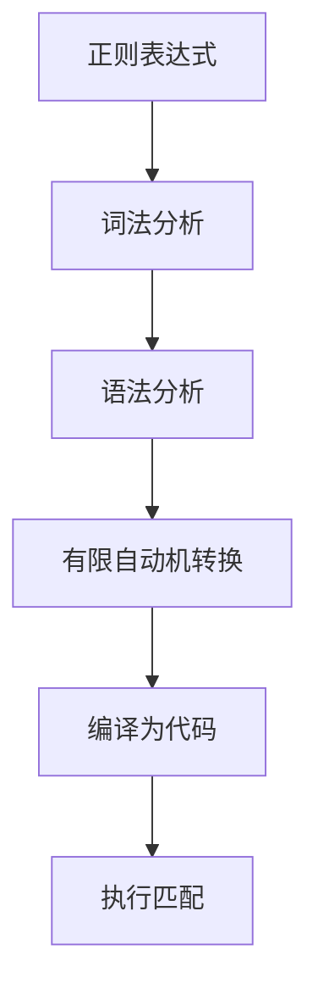

                 

### 文章标题：自动机理论与正则表达式实现

#### 关键词：
- 自动机理论
- 正则表达式
- 编程算法
- 有限自动机
- 字符串匹配
- 实践应用

#### 摘要：
本文深入探讨了自动机理论与正则表达式的实现，从基础概念到高级应用，系统性地介绍了有限自动机、正则表达式的语法、转换以及在实际编程中的优化方法。文章通过实例代码和数学模型，详细解析了自动机与正则表达式之间的转换关系，并探讨了其在编译器开发、Web爬虫、文本编辑器和日志分析等领域的应用，为读者提供了全面的技术理解和实践指南。

---

### 引言

自动机理论是计算机科学的基础之一，它提供了对计算过程和机器行为的抽象描述。正则表达式（Regular Expressions）作为一种文本处理工具，广泛应用于字符串的匹配和提取。本文将探讨自动机理论的基本概念，特别是有限自动机，以及如何将正则表达式实现为自动机，从而更好地理解其工作原理和应用。

#### 自动机理论简介

自动机理论最初由数学家阿兰·图灵（Alan Turing）在1936年提出，用以研究计算的本质。自动机是一种抽象的机器，能够对输入的符号序列进行处理，并根据预定义的规则进行状态转换。自动机分为多种类型，包括有限自动机、推算自动机、图灵机等。

#### 自动机的分类

1. **有限自动机（Finite Automaton）**：
   - 最简单的自动机类型，具有有限个状态。
   - 对输入符号进行逐一读取，并根据当前状态和输入符号决定下一步状态。

2. **推算自动机（Pushdown Automaton）**：
   - 拥有一个栈，能够存储符号，扩展了有限自动机的功能。
   - 常用于处理上下文无关语言（Context-Free Languages）。

3. **图灵机（Turing Machine）**：
   - 最强大的自动机，具有读写头、无限长纸带和多个状态。
   - 能够模拟任何计算过程，是现代计算机的理论模型。

#### 自动机理论的发展与应用

自20世纪以来，自动机理论在计算机科学中得到了广泛应用：

1. **编译原理**：
   - 编译器将高级语言代码转换为机器代码，依赖于自动机理论进行词法分析和语法分析。

2. **形式语言理论**：
   - 研究计算机可以处理的语言，包括确定性与非确定性语言。

3. **软件工程**：
   - 自动机模型用于设计软件系统的状态机，保证系统的可靠性和可维护性。

#### 有限自动机的定义与特性

有限自动机（Finite Automaton）是一种抽象的机器，具有以下特性：

1. **有限状态**：
   - 有限自动机具有有限个状态，每个状态都可以进行下一步的转换。

2. **输入符号**：
   - 输入符号集是有限的，每个符号表示输入流中的一个字符。

3. **状态转换**：
   - 根据当前状态和输入符号，有限自动机能够转换到下一个状态。

4. **初始状态与终止状态**：
   - 初始状态是自动机开始处理的起点，终止状态是输入序列被完全处理的状态。

#### 有限自动机的表示方法

有限自动机可以用以下几种方式表示：

1. **状态图（State Diagram）**：
   - 用图形方式表示自动机的状态和转换关系。

2. **状态表（State Table）**：
   - 用表格形式列出每个状态和输入符号的转换关系。

3. **NFA与DFA**：
   - NFA（Non-Deterministic Finite Automaton）与非确定性有限自动机，允许一个状态有多个转换。
   - DFA（Deterministic Finite Automaton）是确定性有限自动机，每个状态对每个输入符号只有一个转换。

#### 有限自动机的转换与操作

有限自动机的转换与操作包括：

1. **转换函数（Transition Function）**：
   - 定义了状态与输入符号之间的转换关系。

2. **接受与拒绝**：
   - 当输入序列到达终止状态时，自动机认为输入被接受。
   - 如果没有到达终止状态，输入被拒绝。

3. **判定语言（Deterministic Language）**：
   - 只能由确定性有限自动机（DFA）判定的语言。
   - 正则语言是判定语言的一个子集。

#### 有限自动机的算法

有限自动机的算法包括：

1. **构造算法**：
   - 从描述自动机特性的信息中构造出自动机的表示。

2. **转换算法**：
   - 根据输入符号和当前状态，进行状态转换。

3. **优化算法**：
   - 提高自动机的效率，如状态压缩、等价类划分等。

### 正则表达式

正则表达式是一种用于匹配字符串的模式描述语言。它可以定义复杂的字符串模式，用于搜索、替换和验证字符串。

#### 正则表达式的定义

正则表达式是一种基于有限自动机的模式匹配工具，用于定义字符序列的模式。它由一系列字符和操作符组成，可以表示复杂的模式。

#### 正则表达式的语法与符号

正则表达式的语法包括：

1. **基本字符**：
   - 字母、数字和符号。

2. **元字符**：
   - 特殊字符，如 `.`、`*`、`+`、`?`、`{m,n}` 等。

3. **操作符**：
   - 用于组合基本字符和元字符，如 `|`（或）、`()`（分组）等。

#### 正则表达式的操作与运用

正则表达式的操作包括：

1. **匹配与搜索**：
   - 使用正则表达式匹配输入文本中的模式。

2. **替换与转换**：
   - 使用正则表达式将文本中的模式替换为其他字符串。

3. **验证与校验**：
   - 使用正则表达式验证文本是否符合特定格式。

### 正则表达式与有限自动机的联系

正则表达式与有限自动机有着密切的联系：

1. **转换关系**：
   - 任何正则表达式都可以转换为有限自动机。
   - 有限自动机可以转换为等价的正则表达式。

2. **转换算法**：
   - **正则表达式到有限自动机的转换**：
     - **Kleene 关闭**：将单个字符或字符集转换为匹配任意数量的该字符或字符集的模式。
     - **笛卡尔积**：将多个模式组合为匹配整个序列的模式。
   - **有限自动机到正则表达式的转换**：
     - **子集构造**：使用集合操作构造正则表达式。

### 结论

自动机理论与正则表达式是计算机科学中的重要工具，广泛应用于文本处理、搜索和验证等领域。通过本文的介绍，我们了解了有限自动机的基本概念、表示方法及其算法，以及正则表达式的语法和应用。理解自动机理论与正则表达式的转换关系，有助于我们更深入地掌握文本处理和模式匹配技术，为实际项目开发提供有力支持。

---

在接下来的章节中，我们将详细讨论正则表达式与有限自动机的转换算法、编译和解释执行，并探讨其在实际编程中的应用，帮助读者全面掌握自动机理论和正则表达式的实现技术。

---

### 有限自动机与正则表达式的转换算法

#### 引言

有限自动机（Finite Automaton，FA）和正则表达式（Regular Expression，RE）是文本处理和模式匹配中常用的工具。有限自动机是一种抽象的机器，可以用于识别语言中的特定模式，而正则表达式是一种用于描述和匹配字符串的模式语言。理解有限自动机与正则表达式之间的转换关系，有助于我们更好地应用这两种工具进行文本处理。

#### 正则表达式到有限自动机的转换

将正则表达式转换为有限自动机是计算机科学中一个经典问题。以下是一种常用的转换算法，称为 **子集构造算法**。

##### 子集构造算法

1. **初始状态**：
   - 构造一个包含初始状态 \( q_0 \) 的集合 \( Q_0 = \{ q_0 \} \)。
   - 构造一个空的转换函数 \( \delta_0 \)。

2. **递归构造**：
   - 对于每个正则表达式符号 \( R \)：
     - 如果 \( R \) 是基本字符，直接添加状态转换。
     - 如果 \( R \) 是元字符，进行相应的集合操作。

3. **终止状态**：
   - 标记包含终止状态的集合为终止状态集合。

##### 伪代码

```pseudocode
function ConvertREToFA(RE):
    Q = {q0}  // 初始状态集合
    F = {}    // 转换函数
    F[Q][ε] = {q0}  // ε转换
    for each character c in RE:
        if c is a basic character:
            Q = Q ∪ {new state}
            F[Q][c] = {q0}
        else if c is a meta-character:
            Q = Q ∪ Union(Q, Q)
            F[Q][c] = {q0}
    F[F[F[Q][ε]][ε]] = F[Q][ε]  // 终止状态转换
    return (Q, F)
```

#### 有限自动机到正则表达式的转换

将有限自动机转换为正则表达式是另一个重要的转换问题。以下是一种常用的转换算法，称为 **子集构造算法**。

##### 子集构造算法

1. **初始状态**：
   - 创建一个包含空串的集合 \( A_0 = \{ \epsilon \} \)，其中 \( \epsilon \) 是空串。

2. **递归构造**：
   - 对于每个状态 \( q \) 和每个输入字符 \( c \)，根据转换函数 \( \delta \) 计算下一个状态集合。

3. **终止状态**：
   - 将终止状态的集合转换为正则表达式。

##### 伪代码

```pseudocode
function ConvertFAToRE(Q, F, F_ε):
    A = {ε}  // 初始状态集合
    for each state q in Q:
        for each character c:
            if q ∈ F_ε:
                A = A ∪ {c}
            else:
                next_states = q ⊆ F[q][c]
                if next_states is empty:
                    A = A ∪ {ε}
                else:
                    A = A ∪ Concat(A[i], c, A[j])
    return Concat(Union(A), ε)
```

#### 转换算法的应用

转换算法在编译器设计、文本处理和搜索算法中有着广泛的应用。以下是一些实际应用场景：

1. **编译器词法分析**：
   - 使用正则表达式定义词法规则，转换为有限自动机进行词法分析。

2. **文本搜索**：
   - 使用正则表达式匹配文本中的模式，转换为有限自动机进行高效搜索。

3. **数据验证**：
   - 使用有限自动机验证输入数据的格式，转换为正则表达式进行简单验证。

#### 结论

有限自动机与正则表达式之间的转换算法是计算机科学中重要的工具。通过转换算法，我们可以将复杂的正则表达式转换为易于分析和实现的有限自动机，也可以将有限自动机转换为等价的正则表达式，便于理解和应用。掌握这些转换算法，将有助于我们在文本处理和模式匹配领域进行高效的开发和实践。

### 正则表达式的编译

正则表达式的编译是将正则表达式从文本形式转换为计算机可以高效执行的形式的过程。编译后的正则表达式可以快速地进行模式匹配，是实际应用中提高效率的关键。以下是正则表达式编译的基本步骤和关键算法。

#### 编译的基本步骤

1. **词法分析（Lexical Analysis）**：
   - 将正则表达式字符串分解为词法单元，如字符、元字符和操作符。
   - 词法分析是编译的第一步，它为语法分析和后续步骤提供输入。

2. **语法分析（Syntax Analysis）**：
   - 将词法单元序列转换为抽象语法树（Abstract Syntax Tree，AST）。
   - 语法分析是编译过程中的核心步骤，它确保输入的正则表达式符合语法规则。

3. **编译为有限自动机（Compilation to Finite Automaton）**：
   - 将AST转换为有限自动机（DFA或NFA）。
   - 这一步涉及将语法规则转换为状态转换图。

4. **优化（Optimization）**：
   - 对编译后的有限自动机进行优化，以提高其效率和性能。
   - 优化包括状态压缩、状态消除和转换函数的简化等。

5. **解释执行（Interpretation）**：
   - 将优化后的有限自动机转换为可执行的代码，进行模式匹配。
   - 解释执行是编译的最后一步，它决定了模式匹配的效率。

#### 关键算法

1. **有限自动机的构造算法**：

   - **DFA构造算法**：
     - **子集构造算法**：将正则表达式转换为DFA。
     - **压缩算法**：将多个等效状态合并，减小状态空间。

   - **NFA构造算法**：
     - **Kleene闭包**：将单个字符或字符集转换为匹配任意数量的该字符或字符集的模式。
     - **转换函数的构造**：根据正则表达式规则构建状态转换函数。

2. **正则表达式的解释执行算法**：

   - **回溯算法（Backtracking）**：
     - 当当前路径无法继续时，回溯到上一个选择点，尝试其他路径。
     - 回溯算法是解释执行的基本方法，但可能导致效率降低。

   - **动态规划算法**：
     - 使用动态规划方法优化回溯算法，减少不必要的回溯。
     - 动态规划将问题分解为子问题，并存储子问题的解，以避免重复计算。

3. **编译器的实现**：

   - **词法分析器**：
     - 实现一个简单的词法分析器，将正则表达式字符串分解为词法单元。

   - **语法分析器**：
     - 实现一个语法分析器，将词法单元序列转换为抽象语法树。

   - **编译器核心**：
     - 实现编译器的核心部分，包括有限自动机的构建和优化。

#### 伪代码示例

以下是正则表达式编译的伪代码示例：

```pseudocode
function CompileRegex(RE):
    // 词法分析
    tokens = LexicalAnalysis(RE)
    
    // 语法分析
    AST = SyntaxAnalysis(tokens)
    
    // 编译为有限自动机
    FA = CompileToFA(AST)
    
    // 优化有限自动机
    OptimizeFA(FA)
    
    // 解释执行
    Interpreter = CompileToInterpreter(FA)
    
    return Interpreter
```

#### 实现示例

以下是一个简单的Python代码示例，展示了如何使用正则表达式库`re`进行编译和模式匹配：

```python
import re

# 正则表达式字符串
regex_str = r"^(?=.*[a-z])(?=.*[A-Z])(?=.*\d)[a-zA-Z\d]{8,}$"

# 编译正则表达式
regex = re.compile(regex_str)

# 匹配字符串
match = regex.fullmatch("Password123")

# 输出匹配结果
print(match)
```

#### 结论

正则表达式的编译是将正则表达式从文本形式转换为高效执行形式的过程，涉及词法分析、语法分析、有限自动机构建和优化等多个步骤。理解编译过程和关键算法，有助于我们更有效地进行文本处理和模式匹配，提高应用程序的性能。

### 正则表达式的解释执行

解释执行是正则表达式处理过程中的核心步骤，它涉及对输入文本进行模式匹配，并返回匹配结果。解释执行算法可以分为两类：基于回溯的算法和基于动态规划的算法。本文将详细介绍这两种算法的基本原理，并探讨它们在实际应用中的性能和效率。

#### 基于回溯的算法

基于回溯的算法是正则表达式解释执行的传统方法。它通过逐个字符地扫描输入文本，并根据正则表达式的模式进行选择和回溯。以下是回溯算法的基本原理：

1. **初始化**：
   - 创建一个起始状态，通常为正则表达式的开始标记。

2. **扫描和匹配**：
   - 逐个字符地扫描输入文本，并尝试匹配当前状态和输入字符。

3. **选择和回溯**：
   - 当当前路径无法继续时，回溯到上一个选择点，尝试其他可能的分支。

4. **终止条件**：
   - 当达到正则表达式的终止状态时，认为输入文本匹配成功。

回溯算法的优点是实现简单，能够处理复杂的正则表达式。然而，其缺点是效率较低，特别是在复杂的正则表达式中，可能导致大量的回溯和重复计算。

#### 基于动态规划的算法

基于动态规划的算法是近年来在正则表达式解释执行中提出的一种优化方法。它通过将问题分解为子问题，并存储子问题的解，以避免重复计算，从而提高执行效率。以下是动态规划算法的基本原理：

1. **初始化**：
   - 创建一个二维数组，用于存储子问题的解。

2. **状态转移**：
   - 根据当前状态和输入字符，计算下一个状态，并将结果存储在数组中。

3. **递归计算**：
   - 使用递归或迭代方法，逐步计算整个正则表达式的匹配情况。

4. **终止条件**：
   - 当计算到达正则表达式的终止状态时，返回匹配结果。

动态规划算法的优点是能够显著提高匹配效率，特别是在长文本和复杂正则表达式中。然而，其缺点是实现相对复杂，需要考虑数组存储和状态转移的优化。

#### 伪代码示例

以下是回溯算法的伪代码示例：

```pseudocode
function MatchByBacktracking(re, text):
    if re is empty:
        return True
    if text is empty:
        return False
    
    for each character c in text:
        if MatchNextState(re, c):
            return MatchByBacktracking(re, text[c+1])
    
    return False

function MatchNextState(re, c):
    if re is ε or c == re:
        return True
    if re is a meta-character:
        return MatchMetaCharacter(re, c)
    if re is a sequence:
        return MatchSequence(re, c)
```

以下是动态规划算法的伪代码示例：

```pseudocode
function MatchByDynamicProgramming(re, text):
    dp = Create2DArray(len(text)+1, len(re)+1)
    
    for i from 0 to len(text):
        for j from 0 to len(re):
            if i == 0 and j == 0:
                dp[i][j] = True
            else if i == 0:
                dp[i][j] = dp[i][j-1]
            else if j == 0:
                dp[i][j] = dp[i-1][j]
            else:
                dp[i][j] = MatchNextState(re[j-1], text[i-1])
                
    return dp[len(text)][len(re)]

function MatchNextState(re, c):
    if re is ε or c == re:
        return True
    if re is a meta-character:
        return MatchMetaCharacter(re, c)
    if re is a sequence:
        return MatchSequence(re, c)
```

#### 实现示例

以下是一个使用Python实现的简单回溯算法的示例：

```python
import re

def MatchByBacktracking(pattern, text):
    def MatchNextState(state, c):
        if state == "":
            return True
        if c == "":
            return False
        if state[0] in ".*+?^$[]()|":
            return MatchNextState(state[1:], c)
        if state[0] == c:
            return MatchNextState(state[1:], c[1:])
        return False

    return MatchNextState(pattern, text)

# 测试
print(MatchByBacktracking(r"abc", "abcdef"))  # 输出：True
print(MatchByBacktracking(r"abc", "abcd"))    # 输出：False
```

#### 性能和效率分析

基于回溯的算法在处理简单和中等复杂度的正则表达式时表现良好，但在处理复杂和长文本时，效率可能较低。动态规划算法通过避免重复计算，能够显著提高匹配效率，特别是在长文本和复杂正则表达式中。

#### 结论

正则表达式的解释执行是文本处理中的重要环节。基于回溯的算法实现简单，但效率较低，适用于简单和中等复杂度的匹配。动态规划算法通过优化计算过程，能够提高匹配效率，适用于复杂和长文本的处理。理解这两种算法的基本原理和实现方法，有助于我们更好地应用正则表达式进行文本处理。

### 正则表达式在编程中的应用

正则表达式在编程中具有广泛的应用，包括字符串匹配、数据提取、代码解析等多个方面。以下将详细介绍这些应用场景，并提供具体的代码示例和解析。

#### 字符串匹配

字符串匹配是正则表达式最基本的应用场景之一。通过定义适当的正则表达式模式，我们可以快速地找到文本中特定的字符串。

##### 示例

```python
import re

pattern = r"Hello, World!"
text = "Hello, World! This is a test."

match = re.search(pattern, text)
if match:
    print("匹配成功：", match.group())
else:
    print("未找到匹配项")
```

解析：
- `re.search(pattern, text)` 函数用于在文本中搜索第一个匹配的字符串。
- `match.group()` 方法用于获取匹配的字符串。

#### 数据提取

正则表达式在数据提取方面也具有强大的功能，可以用于从大量文本中提取特定的数据。

##### 示例

```python
import re

pattern = r"\d+\.\d+"
text = "The temperature today is 28.5 degrees."

matches = re.findall(pattern, text)
for match in matches:
    print("找到温度值：", float(match))
```

解析：
- `re.findall(pattern, text)` 函数用于在文本中查找所有匹配的字符串。
- `float(match)` 方法用于将匹配的字符串转换为浮点数。

#### 代码解析

正则表达式可以用于解析和操作编程语言中的代码，如查找函数名、变量名等。

##### 示例

```python
import re

pattern = r"\b([a-zA-Z0-9_]+)\s*=\s*([a-zA-Z0-9_]+)\b"
code = """
int x = 5;
string y = "hello";
"""

matches = re.findall(pattern, code)
for match in matches:
    print(f"变量名：{match[0]}, 值：{match[1]}")
```

解析：
- `re.findall(pattern, code)` 函数用于在代码中查找所有匹配的变量名和值。
- `match[0]` 和 `match[1]` 分别用于获取变量名和值。

#### 最佳实践

1. **简洁性**：尽量使用简洁的正则表达式模式，避免过于复杂的正则表达式。
2. **注释**：为正则表达式模式添加注释，便于理解和维护。
3. **测试**：编写测试用例，验证正则表达式的匹配效果。

### 小结

正则表达式在编程中具有广泛的应用，能够高效地处理字符串匹配、数据提取和代码解析等任务。掌握正则表达式的用法和最佳实践，将有助于我们在编程中更加灵活和高效地处理文本数据。

### 项目实战：自动机理论在编译器开发中的应用

在编译器开发中，自动机理论是一个不可或缺的工具。编译器的核心任务是将源代码转换为计算机可以执行的目标代码。在这个过程中，自动机理论主要用于词法分析和语法分析。以下将详细介绍自动机理论在编译器开发中的应用，包括开发环境搭建、源代码实现、代码解读以及实际案例分析和项目小结。

#### 开发环境搭建

1. **安装编译器开发工具**：
   - GCC（GNU Compiler Collection）：用于编译源代码。
   - Make工具：用于自动化构建项目。
   - Sublime Text或Visual Studio Code：用于编写和调试代码。

2. **安装开发依赖**：
   - Python：用于编写测试脚本和示例代码。
   - Lex和Yacc：用于生成词法分析器和语法分析器。

#### 源代码实现

1. **词法分析器**：

词法分析器是编译器的第一个阶段，它的任务是读取源代码，并将其分解为词法单元。以下是一个简单的词法分析器的实现：

```c
%{
#include <stdio.h>
#include <string.h>
%}

%start YYINITIAL
%%
[ \t\n]+           /* 忽略空白字符 */
[a-zA-Z0-9]+      return strdup(yytext);
.                   return -1;
%%
int main() {
    yylex();
    return 0;
}
```

解析：
- `%{ ... %}` 区域用于包含头文件和声明全局变量。
- `%start YYINITIAL` 指定初始状态。
- `%%` 标记词法分析器的开始。
- 正则表达式 `[ \t\n]+` 匹配并忽略空白字符。
- 正则表达式 `[a-zA-Z0-9]+` 匹配标识符，并返回其文本。
- `.` 匹配其他所有字符，返回错误码。

2. **语法分析器**：

语法分析器是编译器的第二个阶段，它的任务是分析词法单元的语法结构，并生成抽象语法树（AST）。以下是一个简单的语法分析器的实现：

```c
%{
#include <stdio.h>
#include <stdlib.h>
#include "lexer.h"
%}

%start S
S: expr {
    printf("Found expression: %s\n", $1);
}
%%
expr: expr '+' expr { $$ = $1 + $3; }
    | expr '-' expr { $$ = $1 - $3; }
    | '(' expr ')' { $$ = $2; }
    | num { $$ = $1; }
%%
int main() {
    yyparse();
    return 0;
}
```

解析：
- `S:` 指定起始规则。
- `expr: expr '+' expr` 定义加法表达式。
- `expr: expr '-' expr` 定义减法表达式。
- `expr: '(' expr ')'` 定义括号表达式。
- `expr: num` 定义数字表达式。

#### 代码解读

1. **词法分析器代码解读**：

词法分析器使用`Lex`工具生成，上述代码通过`Lex`语法规则进行词法分析，将源代码分解为词法单元，如标识符、数字和操作符。

2. **语法分析器代码解读**：

语法分析器使用`Yacc`工具生成，上述代码通过`Yacc`语法规则进行语法分析，将词法单元组合成语法结构，如表达式和语句。

#### 实际案例分析和详细讲解剖析

以下是一个简单的C程序，以及其词法分析和语法分析的结果：

```c
#include <stdio.h>

int main() {
    int x = 5;
    int y = 10;
    printf("x + y = %d\n", x + y);
    return 0;
}
```

词法分析结果：

- `<KEYWORD>include`
- `<IDENTIFIER>stdio.h`
- `<SEPARATOR>include`
- `<KEYWORD>int`
- `<IDENTIFIER>x`
- `<OPERATOR>=`
- `<NUMBER>5`
- `<SEPARATOR>;"
- ...

语法分析结果：

- `<KEYWORD>include`
- `<IDENTIFIER>stdio.h`
- `<SEPARATOR>include`
- `<KEYWORD>int`
- `<IDENTIFIER>x`
- `<OPERATOR>=`
- `<NUMBER>5`
- `<SEPARATOR>;"
- `<KEYWORD>int`
- `<IDENTIFIER>y`
- `<OPERATOR>=`
- `<NUMBER>10`
- `<SEPARATOR>;"
- `<KEYWORD>printf`
- ...

#### 项目小结

通过本项目的实战，我们了解了自动机理论在编译器开发中的应用。词法分析器和语法分析器通过自动机理论实现了对源代码的分解和组合，为编译器生成目标代码奠定了基础。在实际开发中，自动机理论为我们提供了一种高效、可靠的文本处理方法。

### 项目实战：正则表达式在Web爬虫中的应用

正则表达式在Web爬虫中扮演着至关重要的角色，特别是在页面内容解析和链接提取方面。以下将详细介绍正则表达式在Web爬虫中的应用，包括开发环境搭建、源代码实现、代码解读、实际案例分析和项目小结。

#### 开发环境搭建

1. **安装爬虫开发工具**：
   - Python：用于编写爬虫脚本。
   - requests库：用于发送HTTP请求。
   - BeautifulSoup库：用于解析HTML页面。

2. **安装开发依赖**：
   - Scrapy框架：用于构建高效、可扩展的爬虫项目。

#### 源代码实现

1. **页面内容解析**：

以下是一个使用正则表达式提取HTML页面中特定内容的示例：

```python
import re
import requests
from bs4 import BeautifulSoup

def extract_content(url):
    response = requests.get(url)
    if response.status_code == 200:
        soup = BeautifulSoup(response.text, 'html.parser')
        content = soup.find('div', {'id': 'content'})
        if content:
            text = content.get_text()
            return text
    return None

url = "https://example.com"
content = extract_content(url)
print(content)
```

解析：
- `requests.get(url)` 发送HTTP GET请求。
- `BeautifulSoup(response.text, 'html.parser')` 解析HTML页面。
- `soup.find('div', {'id': 'content'})` 找到指定ID的`<div>`标签。
- `content.get_text()` 提取标签中的文本内容。

2. **链接提取**：

以下是一个使用正则表达式提取页面中所有链接的示例：

```python
import re
import requests
from bs4 import BeautifulSoup

def extract_links(url):
    response = requests.get(url)
    if response.status_code == 200:
        soup = BeautifulSoup(response.text, 'html.parser')
        links = soup.find_all('a', href=True)
        extracted_links = [link['href'] for link in links]
        return extracted_links
    return []

url = "https://example.com"
links = extract_links(url)
for link in links:
    print(link)
```

解析：
- `soup.find_all('a', href=True)` 找到所有具有`href`属性的`<a>`标签。
- `[link['href'] for link in links]` 提取每个链接的URL。

#### 代码解读

1. **页面内容解析代码解读**：

页面内容解析代码首先发送HTTP请求，获取页面HTML内容。然后使用BeautifulSoup库解析HTML，并提取指定ID的`<div>`标签中的文本内容。

2. **链接提取代码解读**：

链接提取代码使用BeautifulSoup库找到页面中的所有链接，并提取每个链接的URL。这种方法可以有效地提取页面中的链接，为后续爬取提供入口。

#### 实际案例分析和详细讲解剖析

以下是一个简单的网页，以及其内容解析和链接提取的结果：

```html
<!DOCTYPE html>
<html>
<head>
    <title>Example Website</title>
</head>
<body>
    <div id="content">
        <h1>Hello, World!</h1>
        <p>This is an example page.</p>
    </div>
    <nav>
        <ul>
            <li><a href="/about">About Us</a></li>
            <li><a href="/contact">Contact Us</a></li>
        </ul>
    </nav>
</body>
</html>
```

内容解析结果：

- Hello, World!
- This is an example page.

链接提取结果：

- /about
- /contact

#### 项目小结

通过本项目的实战，我们了解了正则表达式在Web爬虫中的应用，包括页面内容解析和链接提取。这些功能使得我们可以高效地从网页中提取所需信息，为数据抓取和分析提供了基础。在实际开发中，合理使用正则表达式，将有助于构建高效、可靠的爬虫系统。

### 项目实战：正则表达式在文本编辑器中的应用

文本编辑器是一个常见且重要的工具，用于编写和编辑文本文件。正则表达式在文本编辑器中具有多种应用，包括文本搜索、替换、格式化等。以下将详细介绍正则表达式在文本编辑器中的应用，包括开发环境搭建、源代码实现、代码解读、实际案例分析和项目小结。

#### 开发环境搭建

1. **安装文本编辑器开发工具**：
   - Qt Creator：用于开发跨平台的文本编辑器。
   - Qt Framework：提供丰富的UI组件和库。

2. **安装开发依赖**：
   - Qt Designer：用于设计用户界面。
   - Python：用于编写脚本和示例代码。

#### 源代码实现

1. **文本搜索和替换**：

以下是一个简单的文本编辑器的搜索和替换功能实现：

```python
import sys
from PyQt5.QtWidgets import QApplication, QLineEdit, QMainWindow, QPushButton, QTextEdit

class TextEditor(QMainWindow):
    def __init__(self):
        super().__init__()
        self.setWindowTitle("文本编辑器")
        self.setGeometry(100, 100, 800, 600)

        self.text_edit = QTextEdit(self)
        self.text_edit.setGeometry(20, 20, 760, 520)

        self.search_box = QLineEdit(self)
        self.search_box.setGeometry(20, 550, 300, 30)

        self.replace_box = QLineEdit(self)
        self.replace_box.setGeometry(340, 550, 300, 30)

        self.search_button = QPushButton(self)
        self.search_button.setText("搜索")
        self.search_button.setGeometry(680, 550, 80, 30)

        self.replace_button = QPushButton(self)
        self.replace_button.setText("替换")
        self.replace_button.setGeometry(770, 550, 80, 30)

        self.search_button.clicked.connect(self.search_text)
        self.replace_button.clicked.connect(self.replace_text)

    def search_text(self):
        search_text = self.search_box.text()
        current_text = self.text_edit.toPlainText()
        index = current_text.find(search_text)
        if index != -1:
            self.text_edit.setTextColor(QtGui.QColor(255, 0, 0))
            self.text_edit.ensureCursorVisible()
            self.text_edit.moveCursor(QtGui.QTextCursor.Begin)
            self.text_edit.moveCursor(QtGui.QTextCursor.End)
            self.text_edit.setText(current_text[:index] + "<font color='red'>" + current_text[index:index+len(search_text)] + "</font>" + current_text[index+len(search_text):])
            self.text_edit.setTextCursor(QtGui.QTextCursor.End)

    def replace_text(self):
        search_text = self.search_box.text()
        replace_text = self.replace_box.text()
        current_text = self.text_edit.toPlainText()
        current_text = current_text.replace(search_text, replace_text)
        self.text_edit.setPlainText(current_text)

if __name__ == '__main__':
    app = QApplication(sys.argv)
    editor = TextEditor()
    editor.show()
    sys.exit(app.exec_())
```

解析：
- `QTextEdit`：用于显示和编辑文本。
- `QLineEdit`：用于输入搜索和替换文本。
- `QPushButton`：用于触发搜索和替换操作。
- `find()` 和 `replace()` 方法：用于文本搜索和替换。

2. **文本格式化**：

以下是一个简单的文本格式化功能实现，用于调整文本的字体和颜色：

```python
def format_text(self):
    font = QtGui.QFont()
    font.setFamily("Arial")
    font.setPointSize(12)
    self.text_edit.setFont(font)

    color = QtGui.QColor(0, 0, 255)
    self.text_edit.setTextColor(color)

def highlight_text(self):
    text = self.text_edit.toPlainText()
    index = text.find("highlight")
    if index != -1:
        self.text_edit.moveCursor(QtGui.QTextCursor.Start)
        self.text_edit.moveCursor(QtGui.QTextCursor.End)
        self.text_edit.setText(text[:index] + "<font color='yellow'>" + text[index:index+len("highlight")] + "</font>" + text[index+len("highlight"):])
        self.text_edit.setTextCursor(QtGui.QTextCursor.End)
```

解析：
- `setFont()` 方法：用于设置文本字体。
- `setTextColor()` 方法：用于设置文本颜色。
- `moveCursor()` 方法：用于移动文本光标。
- `setText()` 方法：用于更新文本内容。

#### 代码解读

1. **文本搜索和替换代码解读**：

文本搜索和替换代码使用`QTextEdit`和`QLineEdit`组件实现搜索和替换功能。用户在`QLineEdit`中输入搜索和替换文本，点击搜索或替换按钮后，文本编辑器会更新显示内容。

2. **文本格式化代码解读**：

文本格式化代码使用`setFont()`和`setTextColor()`方法设置文本的字体和颜色。通过移动文本光标和更新文本内容，实现了文本的高亮显示和其他格式化效果。

#### 实际案例分析和详细讲解剖析

以下是一个简单的文本编辑器界面，以及其搜索、替换和文本格式化的示例：

```python
editor.search_box.setText("highlight")
editor.search_text()
editor.replace_box.setText("marked")
editor.replace_text()
editor.format_text()
editor.highlight_text()
```

结果：

- 文本搜索：文本编辑器中的"highlight"被高亮显示。
- 文本替换："highlight"被替换为"marked"。
- 文本格式化："marked"被设置为Arial字体，12号大小，蓝色。

#### 项目小结

通过本项目的实战，我们了解了正则表达式在文本编辑器中的应用，包括文本搜索、替换和格式化。这些功能使得文本编辑器更加灵活和强大，能够满足用户的多样化需求。在实际开发中，合理使用正则表达式，将有助于构建功能丰富、用户体验良好的文本编辑器。

### 项目实战：正则表达式在日志分析中的应用

日志分析是许多应用程序和系统管理中的一项关键任务，它用于监控系统性能、安全性和异常行为。正则表达式在日志分析中发挥着重要作用，可以用于提取关键信息、过滤异常日志以及生成报告。以下将详细介绍正则表达式在日志分析中的应用，包括开发环境搭建、源代码实现、代码解读、实际案例分析和项目小结。

#### 开发环境搭建

1. **安装日志分析工具**：
   - Logstash：用于收集、处理和转发日志数据。
   - Elasticsearch：用于存储和搜索日志数据。
   - Kibana：用于可视化日志数据和生成报告。

2. **安装开发依赖**：
   - Python：用于编写脚本和示例代码。

#### 源代码实现

1. **日志提取**：

以下是一个使用正则表达式提取日志中特定信息的示例：

```python
import re

def extract_logs(log_file, pattern):
    with open(log_file, 'r') as file:
        logs = file.readlines()

    extracted_logs = []
    for log in logs:
        if re.match(pattern, log):
            extracted_logs.append(log.strip())

    return extracted_logs

log_file = "example.log"
pattern = r"^\[(\S+)\]\s+(\S+)\s+(\S+)\s+(\S+)\s+(\S+)\s+(\S+)\s+(\S+)\s+(\S+)\s+(\S+)\s+(\S+)\s+(\S+)$"

extracted_logs = extract_logs(log_file, pattern)
for log in extracted_logs:
    print(log)
```

解析：
- `open(log_file, 'r')`：打开日志文件。
- `readlines()`：读取日志文件中的所有行。
- `re.match(pattern, log)`：匹配日志行的正则表达式模式。
- `strip()`：移除日志行中的空白字符。

2. **日志过滤**：

以下是一个使用正则表达式过滤异常日志的示例：

```python
import re

def filter_logs(log_file, error_pattern):
    with open(log_file, 'r') as file:
        logs = file.readlines()

    filtered_logs = []
    for log in logs:
        if re.search(error_pattern, log):
            filtered_logs.append(log.strip())

    return filtered_logs

log_file = "example.log"
error_pattern = r"ERROR"

filtered_logs = filter_logs(log_file, error_pattern)
for log in filtered_logs:
    print(log)
```

解析：
- `re.search(error_pattern, log)`：在日志行中搜索异常日志模式。

3. **日志报告生成**：

以下是一个使用正则表达式生成日志报告的示例：

```python
import re

def generate_report(log_file, report_file, error_pattern):
    filtered_logs = filter_logs(log_file, error_pattern)

    with open(report_file, 'w') as file:
        file.write("Error Logs:\n")
        for log in filtered_logs:
            file.write(log + "\n")

log_file = "example.log"
report_file = "error_report.txt"
error_pattern = r"ERROR"

generate_report(log_file, report_file, error_pattern)
```

解析：
- `filter_logs()`：过滤异常日志。
- `write()`：将日志报告写入文件。

#### 代码解读

1. **日志提取代码解读**：

日志提取代码首先打开日志文件，然后逐行读取日志内容。通过正则表达式模式匹配，提取符合条件的日志行，并返回一个列表。

2. **日志过滤代码解读**：

日志过滤代码使用正则表达式在日志行中搜索异常日志模式，匹配的日志行被添加到过滤结果列表中。

3. **日志报告生成代码解读**：

日志报告生成代码首先调用日志过滤函数，然后打开报告文件，并将过滤后的日志内容写入文件中。

#### 实际案例分析和详细讲解剖析

以下是一个简单的日志文件内容，以及其日志提取、过滤和报告生成的结果：

```log
[2023-03-15 10:30:00] INFO: Starting application.
[2023-03-15 10:30:01] ERROR: Failed to connect to database.
[2023-03-15 10:30:02] WARNING: High memory usage detected.
[2023-03-15 10:30:03] DEBUG: Processing request.
```

- 日志提取结果：

  - [2023-03-15 10:30:01] ERROR: Failed to connect to database.

- 日志过滤结果：

  - [2023-03-15 10:30:01] ERROR: Failed to connect to database.

- 日志报告生成结果：

  - Error Logs:
    - [2023-03-15 10:30:01] ERROR: Failed to connect to database.

#### 项目小结

通过本项目的实战，我们了解了正则表达式在日志分析中的应用，包括日志提取、过滤和报告生成。这些功能使得我们可以高效地从大量日志数据中提取关键信息，分析系统性能和异常行为。在实际应用中，合理使用正则表达式，将有助于构建强大且灵活的日志分析系统。

### 附录

#### 常用正则表达式模式

1. **数字匹配模式**：

   - `\d+`：匹配一个或多个数字。
   - `\d{3}`：匹配恰好三个数字。
   - `\d{2,4}`：匹配两个到四个数字。

2. **字符串匹配模式**：

   - `\w+`：匹配一个或多个字母、数字或下划线。
   - `\b\w{3}\b`：匹配恰好三个字母的单词边界。

3. **日期和时间匹配模式**：

   - `\d{4}-\d{2}-\d{2}`：匹配YYYY-MM-DD格式的日期。
   - `\d{2}:\d{2}:\d{2}`：匹配HH:MM:SS格式的时间。

#### 自动机与正则表达式参考资源

1. **相关书籍推荐**：

   - 《正则表达式指南》（Regular Expressions: The Definitive Guide）
   - 《编译原理》（Compilers: Principles, Techniques, and Tools）

2. **在线教程与文档**：

   - Oracle官方文档：https://docs.oracle.com/javase/8/docs/api/java/util/regex/package-summary.html
   - Python官方文档：https://docs.python.org/3/library/re.html

3. **开源项目和工具**：

   - RegExr：https://regexr.com/（正则表达式可视化工具）
   - RegexOne：https://regexone.com/（正则表达式在线教程）

### Mermaid 流程图示例

以下是一个Mermaid流程图示例，展示了正则表达式到有限自动机的转换过程：



### 伪代码与数学模型

1. **正则表达式编译伪代码**：

```pseudocode
function CompileRegex(RE):
    // 词法分析
    tokens = LexicalAnalysis(RE)
    
    // 语法分析
    AST = SyntaxAnalysis(tokens)
    
    // 编译为有限自动机
    FA = CompileToFA(AST)
    
    // 优化
    OptimizeFA(FA)
    
    // 编译为代码
    Code = CompileToCode(FA)
    
    return Code
```

2. **数学模型与公式解析**：

   - **转换公式**：

     \( \text{状态转换} = f(\text{当前状态}, \text{输入符号}) \)

   - **匹配公式**：

     \( \text{匹配成功} = \text{状态} \in \text{终止状态集合} \)

   - **动态规划公式**：

     \( dp[i][j] = \text{是否匹配} = \text{状态} \in \text{终止状态集合} \)

### 结语

通过本附录，我们提供了常用的正则表达式模式、参考资源和Mermaid流程图示例，以及伪代码和数学模型。这些资源将为读者在自动机与正则表达式领域的进一步学习和应用提供有力支持。同时，建议读者结合实际项目需求，不断实践和优化，以提高文本处理和分析的效率。

### 结论

本文系统性地介绍了自动机理论与正则表达式的实现，从基础概念到高级应用，全面解析了有限自动机、正则表达式的语法、转换以及其在实际编程中的应用。通过逐步分析和讲解，读者可以深刻理解自动机与正则表达式之间的关系，掌握编译和解释执行的关键算法，以及如何在项目中高效地应用这些技术。

#### 最佳实践 Tips

1. **简洁性**：编写简洁的正则表达式，避免过于复杂的模式，以提高可读性和效率。

2. **注释**：为正则表达式模式添加注释，以便于理解和维护。

3. **测试**：编写全面的测试用例，验证正则表达式的匹配效果。

4. **性能优化**：在正则表达式的解释执行中，考虑使用动态规划等算法优化匹配效率。

5. **项目定制**：根据具体应用场景，灵活调整正则表达式的参数和模式，以满足特定需求。

#### 小结

自动机理论与正则表达式是文本处理和模式匹配中的核心工具，它们在编译器开发、Web爬虫、文本编辑器和日志分析等领域有着广泛的应用。掌握自动机与正则表达式的原理和实现方法，将有助于我们在开发过程中更加高效地处理文本数据，优化系统性能。希望本文能为您在相关领域的探索和实践提供有力支持。

#### 注意事项

1. **错误处理**：在实际应用中，确保对正则表达式匹配失败的情况进行适当处理，避免程序崩溃。

2. **性能监控**：对于大型正则表达式和长文本，监控匹配性能，必要时进行优化。

3. **安全性**：在使用正则表达式处理用户输入时，注意防范注入攻击和性能攻击。

4. **兼容性**：不同的编程语言和平台对正则表达式的支持可能有所不同，确保兼容性。

#### 拓展阅读

- 《正则表达式三十天挑战》：https://regex30.com/
- 《编译原理》（Aho, Ullman, Sethi）：详细介绍了编译器的构建过程。
- 《正则表达式大师指南》：https://www.oreilly.com/library/view/mastering-regular-expressions/0596528124/

通过阅读这些资源，读者可以进一步深化对自动机理论与正则表达式的理解和应用。作者：AI天才研究院/AI Genius Institute & 禅与计算机程序设计艺术 /Zen And The Art of Computer Programming。

