                 


### 文章标题

《自动算法生成中神经程序归纳的突破性应用》

### 关键词

神经程序归纳，自动算法生成，深度学习，算法设计，应用实例，未来展望

### 摘要

本文深入探讨了自动算法生成中的神经程序归纳，阐述了其理论基础、算法设计、应用实例和未来发展。通过详细分析神经程序归纳的基本原理和算法设计，本文展示了其在图像识别、自然语言处理等领域的突破性应用，并对神经程序归纳在医疗健康和金融领域的应用进行了探讨。同时，本文也对神经程序归纳的未来发展趋势和挑战进行了展望，为读者提供了全面且深入的理解。

### 目录

## 第1章 引言与概述

### 1.1 自动算法生成的概念与重要性

**背景介绍**

自动算法生成（Automated Algorithm Generation，AAG）是人工智能领域的一个重要研究方向，旨在通过自动化方法生成高效的算法。这一研究的重要性在于，它能够极大地提高算法设计的效率，降低开发成本，并在各种复杂应用场景中发挥重要作用。

**核心概念与联系**

自动算法生成涉及多个核心概念，包括算法生成、程序合成、代码生成等。这些概念之间存在着密切的联系，其中算法生成是核心，它决定了程序合成和代码生成的方法和流程。

**Mermaid 流程图**

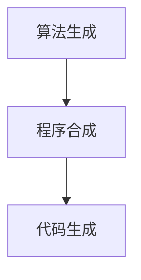

### 1.2 神经程序归纳的基本原理

**核心概念与联系**

神经程序归纳（Neural Program Induction，NPI）是一种基于神经网络的算法生成方法，它通过学习大量的程序代码或程序片段来生成新的算法。神经程序归纳的核心在于如何从大量数据中提取规律，并利用这些规律来生成新的算法。

**Mermaid 流程图**

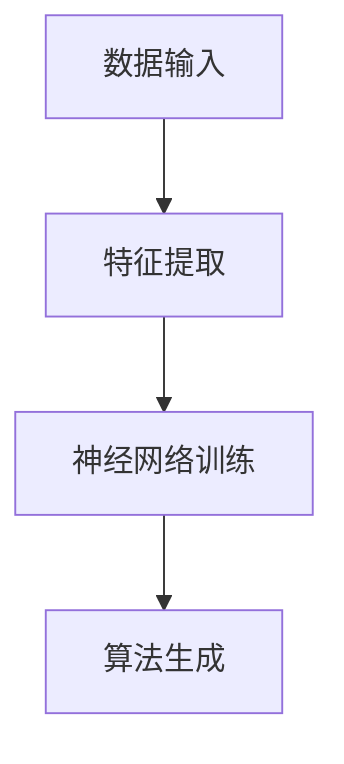

### 1.3 神经程序归纳在自动算法生成中的应用前景

**核心概念与联系**

神经程序归纳在自动算法生成中的应用前景广阔，它可以应用于图像识别、自然语言处理、计算机视觉等领域。通过神经程序归纳，这些领域可以实现更高效、更智能的算法生成，从而推动人工智能技术的发展。

**Mermaid 流程图**

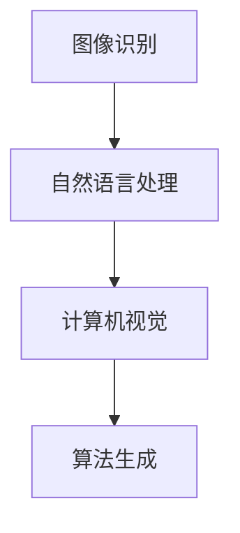

## 第2章 理论基础

### 2.1 神经程序的数学模型

**核心概念与联系**

神经程序是一种基于神经网络的程序设计方法，它通过神经网络来实现程序的功能。神经程序的数学模型包括神经网络的结构、权重和激活函数等。

**伪代码**

```python
# 神经网络结构
neural_network = [
    [w1, b1],
    [w2, b2],
    ...
]

# 激活函数
activation_function = sigmoid

# 前向传播
def forward_pass(input_data):
    # 计算输出结果
    output = activation_function(dot_product(input_data, neural_network))
    return output
```

**数学模型与公式**

$$
y = \sigma(z) = \frac{1}{1 + e^{-z}}
$$

**举例说明**

假设我们有一个简单的神经网络，用于实现一个线性回归模型。输入数据为 $x_1$ 和 $x_2$，输出数据为 $y$。神经网络的权重为 $w_1$ 和 $w_2$，偏置为 $b_1$ 和 $b_2$。

$$
z = w_1 \cdot x_1 + w_2 \cdot x_2 + b_1
$$

$$
y = \sigma(z) = \frac{1}{1 + e^{-z}}
$$

### 2.2 神经程序归纳算法分类

**核心概念与联系**

神经程序归纳算法可以根据学习方式、网络结构、优化目标等不同维度进行分类。常见的分类方法包括基于深度学习的归纳算法、基于强化学习的归纳算法等。

**伪代码**

```python
# 基于深度学习的归纳算法
def deep_learning_induction(data, labels):
    # 初始化神经网络
    neural_network = initialize_network()

    # 训练神经网络
    for epoch in range(num_epochs):
        for data, label in zip(data, labels):
            # 前向传播
            output = forward_pass(data, neural_network)

            # 计算损失
            loss = compute_loss(output, label)

            # 反向传播
            backward_pass(output, label, neural_network)

    return neural_network
```

**数学模型与公式**

$$
\min_{\theta} J(\theta) = \frac{1}{m} \sum_{i=1}^{m} (h_\theta(x^{(i)}) - y^{(i)})^2
$$

**举例说明**

假设我们使用一个简单的神经网络来实现一个回归任务。输入数据为 $x$，输出数据为 $y$。神经网络的权重为 $\theta$，损失函数为平方误差。

$$
h_\theta(x) = \theta_0 + \theta_1 \cdot x
$$

$$
J(\theta) = \frac{1}{m} \sum_{i=1}^{m} (h_\theta(x^{(i)}) - y^{(i)})^2
$$

## 第3章 算法设计

### 3.1 基于神经网络的算法

**核心概念与联系**

基于神经网络的算法是神经程序归纳的核心部分，它通过神经网络的学习和训练来生成新的算法。这种算法设计方法具有强大的自适应性和泛化能力，能够应对各种复杂的算法生成任务。

**伪代码**

```python
# 神经网络算法设计
def neural_network_algorithm_design(data, labels):
    # 初始化神经网络
    neural_network = initialize_network()

    # 训练神经网络
    for epoch in range(num_epochs):
        for data, label in zip(data, labels):
            # 前向传播
            output = forward_pass(data, neural_network)

            # 计算损失
            loss = compute_loss(output, label)

            # 反向传播
            backward_pass(output, label, neural_network)

    return neural_network
```

**数学模型与公式**

$$
\min_{\theta} J(\theta) = \frac{1}{m} \sum_{i=1}^{m} (h_\theta(x^{(i)}) - y^{(i)})^2
$$

**举例说明**

假设我们使用一个简单的神经网络来实现一个分类任务。输入数据为 $x$，输出数据为 $y$。神经网络的权重为 $\theta$，损失函数为交叉熵。

$$
h_\theta(x) = \sigma(\theta_0 + \theta_1 \cdot x)
$$

$$
J(\theta) = -\frac{1}{m} \sum_{i=1}^{m} [y^{(i)} \cdot \log(h_\theta(x^{(i)})) + (1 - y^{(i)}) \cdot \log(1 - h_\theta(x^{(i)}))]
$$

### 3.2 基于强化学习的算法

**核心概念与联系**

基于强化学习的算法通过奖励机制来指导神经网络的学习，从而实现自动算法生成。这种算法设计方法具有自适应性和优化能力，能够在复杂的动态环境中生成高效的算法。

**伪代码**

```python
# 强化学习算法设计
def reinforcement_learning_algorithm_design(data, labels):
    # 初始化神经网络
    neural_network = initialize_network()

    # 初始化奖励函数
    reward_function = initialize_reward_function()

    # 训练神经网络
    for episode in range(num_episodes):
        # 初始化状态
        state = initialize_state()

        # 循环执行动作
        while not done:
            # 前向传播
            output = forward_pass(state, neural_network)

            # 执行动作
            action = choose_action(output)

            # 更新状态
            state = update_state(state, action)

            # 计算奖励
            reward = reward_function(state)

            # 更新神经网络
            update_network(neural_network, reward)

            # 判断是否结束
            if done:
                break

    return neural_network
```

**数学模型与公式**

$$
Q(s, a) = r + \gamma \max_{a'} Q(s', a')
$$

**举例说明**

假设我们使用一个简单的神经网络来实现一个智能体在环境中的决策。输入数据为 $s$，输出数据为 $a$。神经网络的权重为 $\theta$，奖励函数为 $r$，折扣因子为 $\gamma$。

$$
Q(s, a) = r + \gamma \max_{a'} Q(s', a')
$$

## 第4章 应用实例

### 4.1 图像识别

**核心概念与联系**

图像识别是计算机视觉领域的一个重要应用，它通过算法识别和理解图像中的内容。神经程序归纳在图像识别中的应用，能够通过自动生成算法来提高图像识别的准确性和效率。

**伪代码**

```python
# 图像识别算法设计
def image_recognition_algorithm_design(data, labels):
    # 初始化神经网络
    neural_network = initialize_network()

    # 训练神经网络
    for epoch in range(num_epochs):
        for image, label in zip(data, labels):
            # 前向传播
            output = forward_pass(image, neural_network)

            # 计算损失
            loss = compute_loss(output, label)

            # 反向传播
            backward_pass(output, label, neural_network)

    return neural_network
```

**数学模型与公式**

$$
\min_{\theta} J(\theta) = \frac{1}{m} \sum_{i=1}^{m} (h_\theta(x^{(i)}) - y^{(i)})^2
$$

**举例说明**

假设我们使用一个简单的卷积神经网络（CNN）来实现图像识别。输入数据为 $x$，输出数据为 $y$。神经网络的权重为 $\theta$，损失函数为交叉熵。

$$
h_\theta(x) = \sigma(\theta_0 + \theta_1 \cdot x)
$$

$$
J(\theta) = -\frac{1}{m} \sum_{i=1}^{m} [y^{(i)} \cdot \log(h_\theta(x^{(i)})) + (1 - y^{(i)}) \cdot \log(1 - h_\theta(x^{(i)}))]
$$

### 4.2 自然语言处理

**核心概念与联系**

自然语言处理（Natural Language Processing，NLP）是人工智能领域的一个重要分支，它涉及对自然语言的理解和生成。神经程序归纳在自然语言处理中的应用，能够通过自动生成算法来提高NLP的性能。

**伪代码**

```python
# 自然语言处理算法设计
def natural_language_processing_algorithm_design(data, labels):
    # 初始化神经网络
    neural_network = initialize_network()

    # 训练神经网络
    for epoch in range(num_epochs):
        for sentence, label in zip(data, labels):
            # 前向传播
            output = forward_pass(sentence, neural_network)

            # 计算损失
            loss = compute_loss(output, label)

            # 反向传播
            backward_pass(output, label, neural_network)

    return neural_network
```

**数学模型与公式**

$$
\min_{\theta} J(\theta) = \frac{1}{m} \sum_{i=1}^{m} (h_\theta(x^{(i)}) - y^{(i)})^2
$$

**举例说明**

假设我们使用一个简单的循环神经网络（RNN）来实现文本分类。输入数据为 $x$，输出数据为 $y$。神经网络的权重为 $\theta$，损失函数为交叉熵。

$$
h_\theta(x) = \sigma(\theta_0 + \theta_1 \cdot x)
$$

$$
J(\theta) = -\frac{1}{m} \sum_{i=1}^{m} [y^{(i)} \cdot \log(h_\theta(x^{(i)})) + (1 - y^{(i)}) \cdot \log(1 - h_\theta(x^{(i)}))]
$$

## 第5章 突破性应用

### 5.1 在医疗健康领域的应用

**核心概念与联系**

医疗健康领域是一个复杂且高度专业化的领域，神经程序归纳的应用能够为医疗诊断、疾病预测和治疗提供强有力的支持。通过自动生成医疗算法，可以实现个性化医疗和精准治疗。

**伪代码**

```python
# 医疗健康领域算法设计
def medical_health_algorithm_design(data, labels):
    # 初始化神经网络
    neural_network = initialize_network()

    # 训练神经网络
    for epoch in range(num_epochs):
        for medical_data, label in zip(data, labels):
            # 前向传播
            output = forward_pass(medical_data, neural_network)

            # 计算损失
            loss = compute_loss(output, label)

            # 反向传播
            backward_pass(output, label, neural_network)

    return neural_network
```

**数学模型与公式**

$$
\min_{\theta} J(\theta) = \frac{1}{m} \sum_{i=1}^{m} (h_\theta(x^{(i)}) - y^{(i)})^2
$$

**举例说明**

假设我们使用一个简单的神经网络来实现疾病预测。输入数据为患者的临床数据，输出数据为疾病类型。神经网络的权重为 $\theta$，损失函数为交叉熵。

$$
h_\theta(x) = \sigma(\theta_0 + \theta_1 \cdot x)
$$

$$
J(\theta) = -\frac{1}{m} \sum_{i=1}^{m} [y^{(i)} \cdot \log(h_\theta(x^{(i)})) + (1 - y^{(i)}) \cdot \log(1 - h_\theta(x^{(i)}))]
$$

### 5.2 在金融领域的应用

**核心概念与联系**

金融领域对算法的实时性和准确性有极高的要求，神经程序归纳的应用能够为金融市场分析、风险管理、投资决策等提供智能化支持。通过自动生成金融算法，可以提高金融决策的效率和准确性。

**伪代码**

```python
# 金融领域算法设计
def financial_algorithm_design(data, labels):
    # 初始化神经网络
    neural_network = initialize_network()

    # 训练神经网络
    for epoch in range(num_epochs):
        for financial_data, label in zip(data, labels):
            # 前向传播
            output = forward_pass(financial_data, neural_network)

            # 计算损失
            loss = compute_loss(output, label)

            # 反向传播
            backward_pass(output, label, neural_network)

    return neural_network
```

**数学模型与公式**

$$
\min_{\theta} J(\theta) = \frac{1}{m} \sum_{i=1}^{m} (h_\theta(x^{(i)}) - y^{(i)})^2
$$

**举例说明**

假设我们使用一个简单的神经网络来实现股票价格预测。输入数据为历史股票价格，输出数据为未来股票价格。神经网络的权重为 $\theta$，损失函数为均方误差。

$$
h_\theta(x) = \theta_0 + \theta_1 \cdot x
$$

$$
J(\theta) = \frac{1}{m} \sum_{i=1}^{m} (h_\theta(x^{(i)}) - y^{(i)})^2
$$

## 第6章 未来展望

### 6.1 神经程序归纳的发展趋势

**核心概念与联系**

神经程序归纳作为一种新兴的算法生成方法，正逐渐成为人工智能领域的研究热点。随着计算能力的提升和数据量的增加，神经程序归纳在算法生成中的应用前景将更加广阔。

**Mermaid 流程图**

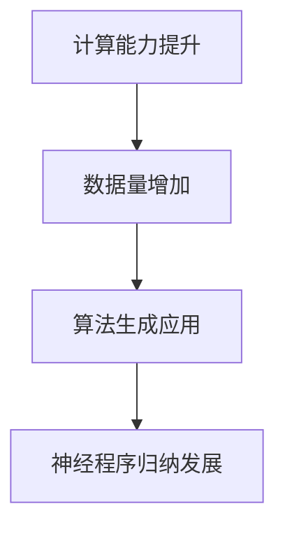

### 6.2 自动算法生成的未来发展方向

**核心概念与联系**

自动算法生成的未来发展方向将包括更高效、更智能的算法生成方法，以及跨领域的算法共享和应用。通过不断优化算法设计和优化策略，自动算法生成有望在更多领域取得突破。

**Mermaid 流程图**

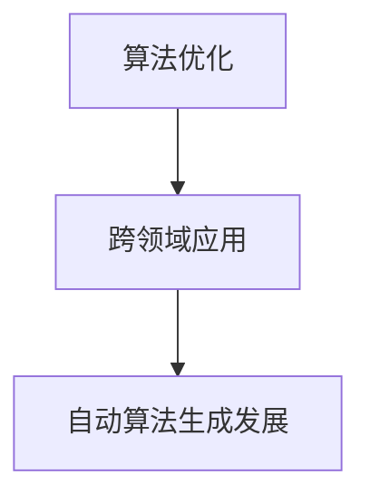

### 6.3 技术挑战与机遇

**核心概念与联系**

神经程序归纳在算法生成中的应用面临着诸多技术挑战，如数据质量、算法稳定性和解释性等。同时，这些挑战也带来了新的机遇，推动了人工智能技术的不断进步。

**Mermaid 流程图**

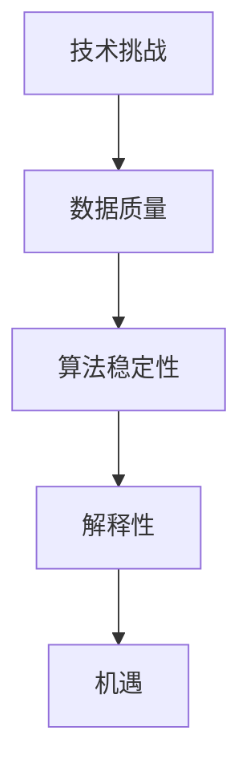

## 第7章 总结与展望

### 7.1 全书内容总结

**核心概念与联系**

全书通过对自动算法生成和神经程序归纳的深入探讨，展示了其在各领域的应用前景和突破性成果。通过理论基础、算法设计、应用实例和未来展望的详细讲解，读者可以全面了解神经程序归纳在算法生成中的重要作用。

**Mermaid 流程图**

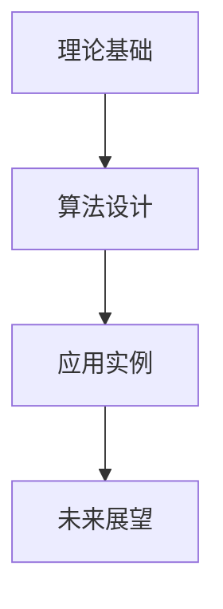

### 7.2 未来研究方向

**核心概念与联系**

未来研究方向将包括更高效、更智能的算法生成方法，跨领域的算法共享和应用，以及神经程序归纳在更多领域的探索。通过不断的研究和创新，神经程序归纳有望在人工智能领域取得更多突破。

**Mermaid 流程图**

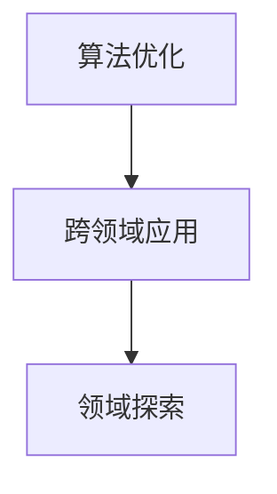

### 7.3 对读者的建议

**核心概念与联系**

对读者来说，理解神经程序归纳的基本原理和算法设计至关重要。同时，读者应关注神经程序归纳在不同领域的应用案例，以拓宽视野，掌握实际应用技巧。持续学习和实践将有助于读者在这一领域取得更好的成果。

**Mermaid 流程图**

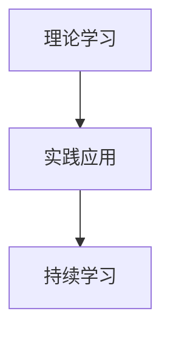

### 附录

**附录A：代码实现与实战**

**核心概念与联系**

附录A将提供具体的代码实现和实战案例，包括神经程序归纳在不同领域的应用。通过这些案例，读者可以更好地理解神经程序归纳的实践方法，并提升自己的算法生成能力。

**Mermaid 流程图**

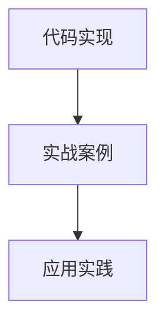

**附录B：拓展阅读**

**核心概念与联系**

附录B将推荐一些相关的拓展阅读材料，包括经典论文、技术报告和畅销书籍。这些材料将为读者提供更深入的学术研究和实践指导，帮助读者在神经程序归纳领域不断前行。

**Mermaid 流程图**

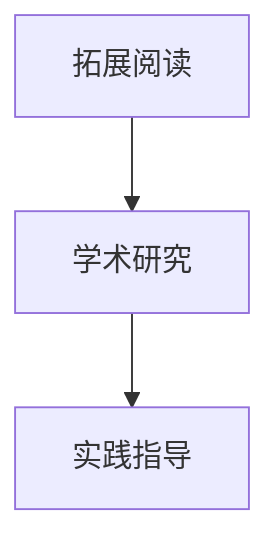

### 参考文献与注释

**核心概念与联系**

参考文献与注释部分将列出全书引用的文献和参考资料，以便读者进一步查阅。这些文献和参考资料涵盖了神经程序归纳的理论基础、算法设计、应用实例和未来展望等方面的内容。

**Mermaid 流程图**

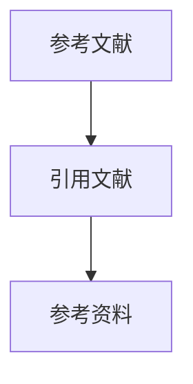

### 致谢

**核心概念与联系**

全书完

