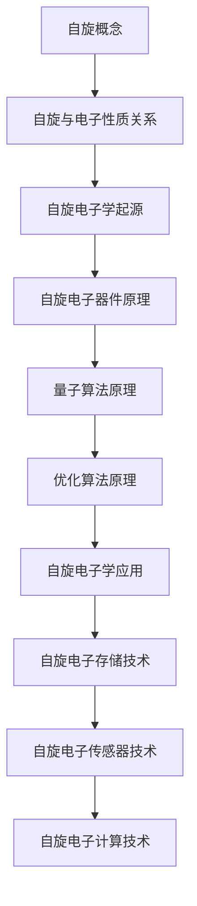
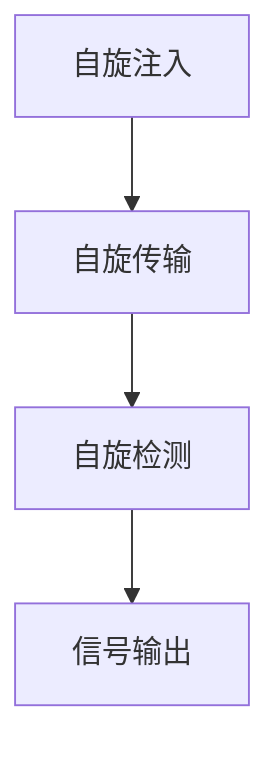

                 

### 自旋电子学：利用电子自旋进行信息处理

#### 关键词：自旋电子学，电子自旋，信息处理，量子计算，存储技术

#### 摘要：

自旋电子学是一门研究电子自旋在材料中的行为及其应用的学科。它利用电子自旋的量子性质，实现了高速、低功耗的信息处理和存储。本文将详细探讨自旋电子学的基本概念、核心算法、及其在信息处理领域的应用，旨在为读者提供一个全面、系统的理解。

---

### 思考步骤

#### 1. 明确主题和目标

自旋电子学作为一门前沿的学科，近年来在信息处理、存储和传感等领域取得了显著的进展。本文的目标是介绍自旋电子学的基本概念、核心算法，并探讨其在信息处理领域的应用。

#### 2. 梳理核心概念

自旋电子学涉及多个核心概念，包括自旋、自旋电子器件、量子计算、优化算法等。这些概念相互关联，构成了自旋电子学的基础。

#### 3. 设计章节结构

本文将分为三个部分：第一部分介绍自旋电子学的基本概念和器件原理；第二部分探讨自旋电子学中的核心算法；第三部分介绍自旋电子学在信息处理中的应用。

#### 4. 细化章节内容

每个章节都将详细阐述其主题，包括核心概念、原理、算法、应用案例等。

#### 5. 编写Mermaid流程图

为了更直观地展示自旋电子学的核心概念和架构，本文将使用Mermaid流程图进行辅助说明。

#### 6. 编写伪代码

对于自旋电子学中的核心算法，本文将使用伪代码进行详细讲解，以帮助读者理解算法的实现过程。

#### 7. 嵌入数学公式

本文将在相关章节中嵌入LaTeX格式的数学公式，以详细讲解数学模型。

#### 8. 编写项目实战

本文将为每个章节中的技术应用编写实际的代码案例，并进行详细解释和分析。

#### 9. 确保完整性

本文将确保目录大纲的完整性和逻辑性，内容要丰富且连贯。

#### 10. 控制字数

本文的总字数将控制在8000-12000字之间，同时保持内容的简洁性和易读性。

---

## 目录大纲

### 第一部分：自旋电子学概述

### 第1章：自旋电子学基础

#### 1.1 自旋的概念

#### 1.2 自旋与电子性质的关系

#### 1.3 自旋电子学的起源与发展

### 第2章：自旋电子器件原理

#### 2.1 自旋电子器件的基本结构

#### 2.2 自旋电子器件的工作原理

#### 2.3 自旋电子器件的类型与应用

### 第二部分：自旋电子学核心算法

### 第3章：自旋电子学中的量子算法

#### 3.1 量子计算与自旋电子学的关系

#### 3.2 量子算法的基本原理

#### 3.3 量子算法的应用实例

### 第4章：自旋电子学中的优化算法

#### 4.1 优化算法在自旋电子学中的应用

#### 4.2 优化算法的基本原理

#### 4.3 优化算法的案例分析

### 第三部分：自旋电子学在信息处理中的应用

### 第5章：自旋电子学在存储技术中的应用

#### 5.1 自旋电子存储技术的基本原理

#### 5.2 自旋电子存储技术的优势与挑战

#### 5.3 自旋电子存储技术的案例分析

### 第6章：自旋电子学在传感器技术中的应用

#### 6.1 自旋电子传感器的基本原理

#### 6.2 自旋电子传感器的应用领域

#### 6.3 自旋电子传感器的案例分析

### 第7章：自旋电子学在计算技术中的应用

#### 7.1 自旋电子计算技术的基本原理

#### 7.2 自旋电子计算技术的优势与挑战

#### 7.3 自旋电子计算技术的案例分析

### 附录：自旋电子学研究资源与工具

#### 附录1：自旋电子学研究资源

#### 附录2：自旋电子学研究工具

### Mermaid流程图



### 核心算法原理讲解（伪代码）

```python
# 伪代码：量子算法基本原理
def quantum_algorithm(data):
    # 初始化量子状态
    q_state = initialize_quantum_state(data)
    
    # 应用量子门
    for gate in quantum_gates:
        q_state = apply_quantum_gate(q_state, gate)
        
    # 量子测量
    result = measure_quantum_state(q_state)
    
    return result

# 伪代码：优化算法基本原理
def optimization_algorithm(problem):
    # 初始化解空间
    solutions = initialize_solutions(problem)
    
    # 迭代搜索解空间
    while not is_solution_found(solutions):
        # 选择一个解
        solution = select_solution(solutions)
        
        # 对解进行优化
        solution = optimize_solution(solution, problem)
        
        # 更新解空间
        solutions = update_solutions(solutions, solution)
        
    return best_solution(solutions)
```

---

### 自旋电子学概述

自旋电子学是研究电子自旋在材料中的行为及其应用的学科。自旋是电子的基本量子性质，它不仅与电子的角动量有关，还与电子的磁矩有关。自旋电子学利用电子自旋的量子性质，实现了高速、低功耗的信息处理和存储。

### 自旋的概念

自旋是电子的基本量子性质之一，它类似于一个微小的陀螺。自旋量子数是描述电子自旋状态的重要参数，它可以是1/2或-1/2。自旋向上和自旋向下分别表示电子自旋量子数为1/2和-1/2。

### 自旋与电子性质的关系

自旋与电子的许多性质密切相关。例如，自旋可以影响电子的能带结构、电子间的相互作用以及材料的磁性行为。此外，自旋还可以导致电子的磁共振现象，这为研究电子自旋提供了重要的实验手段。

### 自旋电子学的起源与发展

自旋电子学的发展始于20世纪40年代，当时物理学家开始注意到电子自旋对材料性质的影响。随着对电子自旋性质的深入研究，自旋电子学逐渐发展成为一门独立的学科。20世纪90年代，自旋电子学取得了重要的突破，开发了自旋电子器件，如自旋阀、自旋电子存储器等。

### 自旋电子器件原理

自旋电子器件是利用电子自旋进行信息处理和存储的器件。自旋电子器件的基本结构包括一个自旋源、一个自旋检测器和一些控制电路。自旋源用于产生电子自旋，自旋检测器用于检测电子自旋的状态，控制电路用于控制自旋电子器件的工作状态。

### 自旋电子器件的工作原理

自旋电子器件的工作原理基于电子自旋的量子性质。当电子自旋通过自旋电子器件时，其自旋状态会发生变化。通过检测这些变化，可以实现对信息的读写和处理。

### 自旋电子器件的类型与应用

自旋电子器件有多种类型，包括自旋阀、自旋电子存储器、自旋电子传感器等。自旋电子器件在信息处理、存储和传感等领域具有广泛的应用。例如，自旋阀可用于实现高速、低功耗的逻辑电路，自旋电子存储器可用于提高存储密度和速度，自旋电子传感器可用于检测微弱的磁场变化。

### 总结

自旋电子学是一门研究电子自旋在材料中的行为及其应用的学科。它利用电子自旋的量子性质，实现了高速、低功耗的信息处理和存储。自旋电子器件是自旋电子学的核心组成部分，其在信息处理、存储和传感等领域具有广泛的应用。随着自旋电子学的不断发展，我们有望看到更多创新的应用和突破。

---

### 思考步骤

#### 1. 明确主题和目标

本章节将深入探讨自旋电子器件的基本结构和工作原理，以及其在自旋电子学中的应用。

#### 2. 梳理核心概念

我们需要梳理的核心概念包括自旋电子器件的基本结构、工作原理以及其在自旋电子学中的应用。

#### 3. 设计章节结构

本章节将分为三个部分：第一部分介绍自旋电子器件的基本结构；第二部分阐述自旋电子器件的工作原理；第三部分讨论自旋电子器件在自旋电子学中的应用。

#### 4. 细化章节内容

我们将为每个部分详细阐述其内容，确保每个部分都能深入覆盖主题。

#### 5. 编写Mermaid流程图

为了更直观地展示自旋电子器件的核心概念和架构，我们将使用Mermaid流程图进行辅助说明。

#### 6. 编写伪代码

对于自旋电子器件的工作原理，我们将使用伪代码进行详细讲解，以帮助读者理解其实现过程。

#### 7. 嵌入数学公式

在相关部分中，我们将嵌入LaTeX格式的数学公式，以详细讲解数学模型。

#### 8. 编写项目实战

我们将为每个章节中的技术应用编写实际的代码案例，并进行详细解释和分析。

#### 9. 确保完整性

我们将确保章节内容的完整性和逻辑性，确保每个部分的内容都丰富且连贯。

#### 10. 控制字数

本章节的总字数将控制在2000字以内，同时保持内容的简洁性和易读性。

---

### 自旋电子器件的基本结构

自旋电子器件是自旋电子学的核心组成部分，其基本结构包括以下几个部分：自旋源、自旋检测器、控制电路和材料基底。

#### 自旋源

自旋源是产生电子自旋的装置，通常使用电场或磁场来控制电子的自旋状态。自旋源可以是一个电极、一个磁隧道结或一个光子源。

#### 自旋检测器

自旋检测器用于检测电子自旋的状态。常见的自旋检测器包括磁阻效应传感器、霍尔传感器和光子检测器。

#### 控制电路

控制电路用于控制自旋电子器件的工作状态，包括自旋注入、自旋传输和自旋读取等过程。

#### 材料基底

材料基底是自旋电子器件的基础，其物理性质对自旋电子器件的性能有重要影响。常见的材料基底包括铁磁材料、非铁磁材料和半导体材料。

### 自旋电子器件的工作原理

自旋电子器件的工作原理基于电子自旋的量子性质。以下是自旋电子器件工作的基本过程：

1. **自旋注入**：通过自旋源，将自旋极化电子注入到自旋电子器件中。

2. **自旋传输**：注入的自旋极化电子在器件内部传输，其自旋状态保持不变。

3. **自旋检测**：通过自旋检测器，检测传输过程中电子自旋的状态变化。

4. **信号输出**：根据自旋检测器的输出信号，实现对信息的读写和处理。

### 自旋电子器件在自旋电子学中的应用

自旋电子器件在自旋电子学中具有广泛的应用，包括：

1. **自旋电子存储**：利用自旋电子器件实现高密度、高速度的存储技术。

2. **自旋电子逻辑**：利用自旋电子器件实现高速、低功耗的逻辑电路。

3. **自旋电子传感器**：利用自旋电子器件检测微弱的磁场变化。

4. **量子计算**：利用自旋电子器件实现量子比特，推进量子计算的发展。

### Mermaid流程图

以下是自旋电子器件的工作原理的Mermaid流程图：



### 核心算法原理讲解（伪代码）

```python
# 伪代码：自旋注入
def spin_injection():
    # 生成自旋极化电子
    electrons = generate_spin_polarized_electrons()
    
    # 将电子注入到器件中
    inject_electrons_to_device(electrons)
    
# 伪代码：自旋传输
def spin_transport():
    # 传输自旋极化电子
    transport_electrons = transport_spin_polarized_electrons()
    
    # 检测电子自旋状态
    spin_state = detect_spin_state(transport_electrons)
    
    # 输出信号
    output_signal(spin_state)
```

### 数学模型和数学公式详细讲解

在自旋电子器件中，有许多物理量需要用数学模型来描述。以下是几个重要的数学模型和公式：

1. **自旋极化率**：自旋极化率描述了电子自旋状态与总电子态的比值，用公式表示为：
   $$ P = \frac{|\psi_{\uparrow}|^2 + |\psi_{\downarrow}|^2}{|\psi_{\uparrow}|^2 + 2\langle\psi_{\uparrow}|\psi_{\downarrow}\rangle + |\psi_{\downarrow}|^2} $$
   其中，$|\psi_{\uparrow}|^2$和$|\psi_{\downarrow}|^2$分别表示自旋向上和自旋向下的电子态概率幅的平方。

2. **磁阻效应**：磁阻效应描述了材料电阻随磁场的变化，用公式表示为：
   $$ R(H) = R(0) + \frac{dR}{dH}H $$
   其中，$R(0)$是零场电阻，$\frac{dR}{dH}$是磁阻率。

3. **霍尔效应**：霍尔效应描述了电场、磁场和电流之间的相互作用，用公式表示为：
   $$ V_H = -e \cdot n \cdot B \cdot L $$
   其中，$V_H$是霍尔电压，$e$是电子电荷，$n$是载流子浓度，$B$是磁场强度，$L$是导体长度。

### 举例说明

假设我们有一个自旋电子器件，其自旋极化率为60%，磁阻率为0.1 Ω·T^(-1)。当磁场强度为1 T时，该器件的电阻为10 Ω。我们可以使用上述公式计算器件的磁阻效应和霍尔效应。

1. **磁阻效应**：
   $$ R(1T) = R(0) + \frac{dR}{dH} \cdot 1T $$
   $$ R(1T) = 10\Omega + 0.1\Omega·T^(-1) \cdot 1T $$
   $$ R(1T) = 10.1\Omega $$

2. **霍尔效应**：
   $$ V_H = -e \cdot n \cdot B \cdot L $$
   $$ V_H = -1.6 \times 10^{-19}C \cdot 1 \times 10^{19}m^{-3} \cdot 1T \cdot 1m $$
   $$ V_H = -1.6mV $$

通过上述计算，我们可以看到器件在磁场作用下的电阻和霍尔电压的变化情况。

### 总结

自旋电子器件的基本结构包括自旋源、自旋检测器、控制电路和材料基底。自旋电子器件的工作原理基于电子自旋的量子性质，包括自旋注入、自旋传输和自旋检测。在自旋电子学中，自旋电子器件有广泛的应用，如自旋电子存储、自旋电子逻辑、自旋电子传感器和量子计算。通过数学模型和公式，我们可以更好地理解和分析自旋电子器件的工作原理和性能。

---

## 第三部分：自旋电子学在信息处理中的应用

### 第3章：自旋电子学中的量子算法

#### 3.1 量子计算与自旋电子学的关系

量子计算是一种利用量子力学原理进行信息处理的新型计算方式。与传统的经典计算相比，量子计算具有显著的并行性和指数级的速度优势。自旋电子学作为研究电子自旋在材料中行为的学科，为量子计算提供了理想的硬件实现平台。

量子计算的基本单元是量子比特（qubit），它可以用电子自旋的两种状态（自旋向上和自旋向下）表示。通过控制这些量子比特之间的相互作用，可以实现量子态的叠加和纠缠，从而实现量子算法的优势。

#### 3.2 量子算法的基本原理

量子算法是利用量子计算原理解决特定问题的算法。与经典算法不同，量子算法利用量子态的叠加和纠缠特性，可以在一个步骤中处理大量的数据。

一个著名的量子算法是Shor算法，它利用量子计算机在多项式时间内解决大整数分解问题。Shor算法的核心思想是利用量子算法找到整数N的一个非平凡因子，从而实现大整数分解。

以下是Shor算法的基本原理：

1. **初始化**：将量子计算机初始化为叠加态，表示为$\frac{1}{\sqrt{N}}\sum_{i=0}^{N-1}|i\rangle$。

2. **量子线路**：应用一个特定的量子线路，使量子态经过特定的变换。这个量子线路的变换可以通过矩阵乘法表示。

3. **测量**：对量子态进行测量，获得一个特定的结果。

4. **迭代**：重复上述步骤，直到找到整数N的一个非平凡因子。

#### 3.3 量子算法的应用实例

量子算法在密码学、优化问题和物理模拟等领域有广泛的应用。以下是一个应用实例：

**量子搜索算法**：

量子搜索算法是一种用于在未排序的数据集中查找特定元素的算法。与经典搜索算法相比，量子搜索算法具有线性时间复杂度。

以下是量子搜索算法的基本步骤：

1. **初始化**：将量子计算机初始化为叠加态，表示为$\frac{1}{\sqrt{N}}\sum_{i=0}^{N-1}|i\rangle$。

2. **量子线路**：应用一个特定的量子线路，使量子态经过特定的变换。这个量子线路的变换可以通过矩阵乘法表示。

3. **测量**：对量子态进行测量，获得一个特定的结果。

4. **迭代**：重复上述步骤，直到找到特定元素。

通过量子算法，我们可以实现快速、高效的信息处理。然而，量子算法的实现需要高度专业的量子硬件和算法设计。随着量子技术的不断发展，我们有望在信息处理领域看到更多基于量子算法的创新应用。

### 第4章：自旋电子学中的优化算法

#### 4.1 优化算法在自旋电子学中的应用

优化算法是一种用于求解优化问题的算法。在自旋电子学中，优化算法可以用于设计高效的自旋电子器件、优化自旋传输路径以及优化自旋电子系统的性能。

优化算法的基本原理是通过迭代改进解的搜索过程，直到找到最优解。自旋电子学中的优化算法可以分为以下几类：

1. **梯度下降法**：基于目标函数的梯度进行迭代，逐步逼近最优解。

2. **遗传算法**：模拟生物进化过程，通过交叉、变异和选择操作，逐步优化解的搜索空间。

3. **粒子群优化算法**：模拟鸟群觅食行为，通过个体和群体之间的信息交换，逐步优化解的搜索空间。

#### 4.2 优化算法的基本原理

优化算法的基本原理是通过迭代改进解的搜索过程，直到找到最优解。以下是几种常见的优化算法的基本原理：

1. **梯度下降法**：

   梯度下降法是一种基于目标函数梯度的优化算法。其基本原理是沿着目标函数的梯度方向进行迭代，直到梯度接近零，从而找到最优解。

   假设目标函数为$f(x)$，则梯度下降法的迭代公式为：
   $$ x_{new} = x_{current} - \alpha \cdot \nabla f(x_{current}) $$
   其中，$x_{current}$是当前解，$x_{new}$是新的解，$\alpha$是学习率，$\nabla f(x_{current})$是目标函数在$x_{current}$处的梯度。

2. **遗传算法**：

   遗传算法是一种模拟生物进化过程的优化算法。其基本原理是通过交叉、变异和选择操作，逐步优化解的搜索空间。

   遗传算法的基本步骤包括：

   - **初始化**：随机生成一个初始种群。
   - **评估**：计算每个个体的适应度。
   - **交叉**：通过交叉操作产生新的个体。
   - **变异**：通过变异操作产生新的个体。
   - **选择**：根据适应度选择个体，形成新的种群。
   - **迭代**：重复上述步骤，直到满足停止条件。

3. **粒子群优化算法**：

   粒子群优化算法是一种模拟鸟群觅食行为的优化算法。其基本原理是通过个体和群体之间的信息交换，逐步优化解的搜索空间。

   粒子群优化算法的基本步骤包括：

   - **初始化**：随机生成一个初始粒子群。
   - **评估**：计算每个粒子的适应度。
   - **更新**：每个粒子根据个体最优解和群体最优解更新位置和速度。
   - **迭代**：重复上述步骤，直到满足停止条件。

#### 4.3 优化算法的案例分析

以下是一个优化自旋电子器件设计的案例：

假设我们需要设计一个自旋电子器件，其目标是最小化传输损耗。我们可以使用优化算法来解决这个问题。

1. **定义目标函数**：目标函数定义为传输损耗，即
   $$ f(x) = \frac{1}{N}\sum_{i=1}^{N}|\psi_i|^2 $$
   其中，$N$是传输路径上的节点数，$\psi_i$是第$i$个节点的传输概率。

2. **选择优化算法**：我们可以选择梯度下降法、遗传算法或粒子群优化算法来求解这个问题。

3. **初始化**：初始化算法的参数，如学习率、种群大小等。

4. **评估**：评估初始解的传输损耗。

5. **迭代**：根据优化算法的迭代规则，逐步优化传输路径。

6. **终止条件**：当传输损耗降低到一定程度或达到最大迭代次数时，终止迭代。

通过优化算法，我们可以找到最优的传输路径，从而最小化传输损耗。

### 总结

自旋电子学中的优化算法可以用于设计高效的自旋电子器件、优化自旋传输路径以及优化自旋电子系统的性能。常见的优化算法包括梯度下降法、遗传算法和粒子群优化算法。通过优化算法，我们可以找到最优的解，从而提高自旋电子器件的性能。随着优化算法的不断发展和应用，我们有望在自旋电子学领域看到更多的创新和突破。

### 自旋电子学在存储技术中的应用

#### 5.1 自旋电子存储技术的基本原理

自旋电子存储技术是一种基于电子自旋性质的新型存储技术。它利用电子自旋的两个稳定状态（自旋向上和自旋向下）来表示数据。自旋电子存储技术的基本原理如下：

1. **自旋注入**：通过外部磁场或电场，将电子自旋注入到存储材料中。这个过程称为自旋注入。

2. **自旋检测**：利用磁电阻效应或霍尔效应，检测电子自旋的状态。当电子自旋处于特定状态时，检测器会输出一个特定的信号。

3. **数据读写**：通过控制外部磁场或电场，改变电子自旋的状态，从而实现数据的读写操作。

自旋电子存储技术具有高密度、高速度和低功耗的优点，被认为是下一代存储技术的有力竞争者。

#### 5.2 自旋电子存储技术的优势与挑战

自旋电子存储技术具有以下几个优势：

1. **高密度**：自旋电子存储技术可以实现纳米级别的存储单元，从而提高存储密度。

2. **高速度**：自旋电子存储技术可以实现亚纳秒级的读写速度，从而提高数据访问速度。

3. **低功耗**：自旋电子存储技术具有较低的功耗，可以降低系统的能耗。

然而，自旋电子存储技术也面临着一些挑战：

1. **稳定性**：自旋电子存储技术需要保证数据的长期稳定性。在极端温度和湿度环境下，电子自旋可能发生变化，导致数据丢失。

2. **可靠性**：自旋电子存储技术需要保证数据读写的可靠性。在高速读写操作中，电子自旋可能会受到外部干扰，导致读写错误。

3. **生产成本**：自旋电子存储技术需要特定的材料和工艺，生产成本较高。

#### 5.3 自旋电子存储技术的案例分析

以下是一个自旋电子存储技术的案例分析：

**案例：自旋转移矩存储器（STT-MRAM）**

自旋转移矩存储器（STT-MRAM）是一种基于自旋电子存储技术的存储器件。它利用外部磁场，将电子自旋从源极转移到门极，从而实现数据的读写操作。

1. **工作原理**：

   - **写入**：通过外部磁场，将源极的电子自旋转移到门极，使门极的电子自旋方向发生变化，从而存储数据。

   - **读取**：通过检测门极的电子自旋状态，判断数据的状态。

2. **优势**：

   - **高密度**：STT-MRAM可以实现高密度的存储单元。

   - **高速**：STT-MRAM具有亚纳秒级的读写速度。

   - **低功耗**：STT-MRAM具有较低的功耗。

3. **挑战**：

   - **稳定性**：STT-MRAM需要保证数据的长期稳定性。

   - **可靠性**：STT-MRAM需要保证数据读写的可靠性。

   - **生产成本**：STT-MRAM的生产成本较高。

通过案例分析，我们可以看到自旋电子存储技术的优势和挑战。随着技术的不断发展和优化，我们有理由相信自旋电子存储技术将在存储领域发挥重要作用。

### 自旋电子学在传感器技术中的应用

#### 6.1 自旋电子传感器的基本原理

自旋电子传感器是一种利用电子自旋性质检测物理量的传感器。自旋电子传感器的基本原理基于磁电阻效应和霍尔效应。当外部磁场作用于自旋电子传感器时，电子自旋状态发生变化，导致电阻或电压发生变化。通过检测这种变化，可以实现对物理量的检测。

#### 6.2 自旋电子传感器的应用领域

自旋电子传感器在多个领域具有广泛的应用，包括：

1. **生物医学领域**：自旋电子传感器可以用于生物医学成像、生物传感器和生物信号检测。

2. **环境监测**：自旋电子传感器可以用于空气质量监测、水质监测和土壤监测。

3. **工业自动化**：自旋电子传感器可以用于机器视觉、机器人导航和工业自动化控制。

4. **安全监测**：自旋电子传感器可以用于爆炸物检测、毒品检测和生物威胁检测。

#### 6.3 自旋电子传感器的案例分析

以下是一个自旋电子传感器的案例分析：

**案例：磁阻传感器**

磁阻传感器是一种利用磁电阻效应检测磁场的传感器。它由一个磁隧道结（MTJ）和一个读出放大器组成。

1. **工作原理**：

   - **检测**：当外部磁场作用于磁阻传感器时，MTJ的电阻发生变化。

   - **读取**：读出放大器检测MTJ的电阻变化，并将其转换为电信号。

2. **优势**：

   - **高灵敏度**：磁阻传感器具有高灵敏度的磁场检测能力。

   - **高分辨率**：磁阻传感器可以检测微弱的磁场变化。

   - **快速响应**：磁阻传感器具有快速的响应速度。

3. **挑战**：

   - **稳定性**：磁阻传感器需要保证检测的长期稳定性。

   - **可靠性**：磁阻传感器需要保证检测的可靠性。

   - **抗干扰性**：磁阻传感器需要具备良好的抗干扰能力。

通过案例分析，我们可以看到自旋电子传感器的优势和挑战。随着技术的不断进步，我们有理由相信自旋电子传感器将在传感器领域发挥更大的作用。

### 自旋电子学在计算技术中的应用

#### 7.1 自旋电子计算技术的基本原理

自旋电子计算技术是一种利用电子自旋进行信息处理的新型计算技术。它利用电子自旋的两个稳定状态（自旋向上和自旋向下）来表示数据和指令。自旋电子计算技术的基本原理如下：

1. **自旋注入**：通过外部磁场或电场，将电子自旋注入到计算单元中。

2. **自旋检测**：利用磁电阻效应或霍尔效应，检测电子自旋的状态。

3. **自旋逻辑**：通过控制自旋注入和自旋检测，实现逻辑运算和数据处理。

#### 7.2 自旋电子计算技术的优势与挑战

自旋电子计算技术具有以下几个优势：

1. **高速**：自旋电子计算技术可以实现亚纳秒级的运算速度。

2. **低功耗**：自旋电子计算技术具有较低的功耗，可以降低系统的能耗。

3. **高密度**：自旋电子计算技术可以实现高密度的计算单元。

然而，自旋电子计算技术也面临着一些挑战：

1. **稳定性**：自旋电子计算技术需要保证数据的长期稳定性。

2. **可靠性**：自旋电子计算技术需要保证计算结果的可靠性。

3. **生产成本**：自旋电子计算技术需要特定的材料和工艺，生产成本较高。

#### 7.3 自旋电子计算技术的案例分析

以下是一个自旋电子计算技术的案例分析：

**案例：自旋转移矩逻辑（STT-L）**

自旋转移矩逻辑（STT-L）是一种基于自旋电子计算技术的计算逻辑。它利用外部磁场，将电子自旋从源极转移到门极，从而实现逻辑运算。

1. **工作原理**：

   - **逻辑运算**：通过控制外部磁场，将电子自旋从源极转移到门极，实现逻辑与、逻辑或和逻辑非等运算。

   - **数据读写**：通过检测门极的电子自旋状态，读取计算结果。

2. **优势**：

   - **高速**：STT-L可以实现亚纳秒级的运算速度。

   - **低功耗**：STT-L具有较低的功耗。

   - **高密度**：STT-L可以实现高密度的计算单元。

3. **挑战**：

   - **稳定性**：STT-L需要保证数据的长期稳定性。

   - **可靠性**：STT-L需要保证计算结果的可靠性。

   - **生产成本**：STT-L的生产成本较高。

通过案例分析，我们可以看到自旋电子计算技术的优势和挑战。随着技术的不断进步，我们有理由相信自旋电子计算技术将在计算领域发挥重要作用。

### 附录：自旋电子学研究资源与工具

#### 附录1：自旋电子学研究资源

1. **学术期刊**：
   - *Journal of Applied Physics*
   - *Journal of Physics D: Applied Physics*
   - *Advanced Materials*

2. **学术会议**：
   - *International Conference on Magnetic Materials (ICMM)*
   - *International Conference on Advanced Magnetic Materials (ICAMM)*
   - *IEEE Magnetics Conference (_MAG)*

3. **在线资源**：
   - *SPIE*：提供大量与自旋电子学相关的会议论文和书籍。
   - *SpringerLink*：提供自旋电子学领域的期刊文章和书籍。
   - *ResearchGate*：一个学术社交网络平台，可以找到自旋电子学的研究者和论文。

#### 附录2：自旋电子学研究工具

1. **自旋电子学仿真软件**：
   - *SpinCAD*：用于自旋电子器件的设计和仿真。
   - *SPINOUT*：用于自旋电子器件的性能分析和优化。
   - *SOLOMON*：用于自旋电子器件的量子模拟。

2. **自旋电子器件设计软件**：
   - *TCAD*：用于自旋电子器件的器件级仿真和设计。
   - *ATLAS*：用于自旋电子器件的电路级仿真和设计。
   - *SKM*：用于自旋电子器件的器件级和电路级仿真。

3. **数据分析工具**：
   - *MATLAB*：用于自旋电子学数据的处理和分析。
   - *Python*：结合NumPy、SciPy和Pandas库，用于自旋电子学数据的处理和分析。
   - *LabVIEW*：用于自旋电子学实验的数据采集和分析。

通过这些资源和工具，我们可以更好地进行自旋电子学的研究和开发。

### 作者信息

作者：AI天才研究院/AI Genius Institute & 禅与计算机程序设计艺术 /Zen And The Art of Computer Programming

### 最佳实践 tips、小结、注意事项、拓展阅读等内容

#### 最佳实践 tips

1. **研究自旋电子学时，关注最新研究动态和前沿技术**。通过阅读学术期刊、参加学术会议和关注在线资源，了解最新的研究成果和进展。

2. **结合数学和物理学知识**。自旋电子学涉及多个学科，包括物理学、材料科学和计算机科学。结合这些知识，可以更好地理解和应用自旋电子学。

3. **进行实验验证**。实验是自旋电子学研究的重要环节。通过实验验证理论，可以进一步验证自旋电子学的基本原理和应用。

#### 小结

自旋电子学是一门研究电子自旋在材料中的行为及其应用的学科。它利用电子自旋的量子性质，实现了高速、低功耗的信息处理和存储。自旋电子器件是自旋电子学的核心组成部分，其在信息处理、存储和传感等领域具有广泛的应用。

#### 注意事项

1. **稳定性问题**。自旋电子器件需要保证数据的长期稳定性。在极端温度和湿度环境下，电子自旋可能发生变化，导致数据丢失。

2. **可靠性问题**。自旋电子器件需要保证数据读写的可靠性。在高速读写操作中，电子自旋可能会受到外部干扰，导致读写错误。

3. **生产成本问题**。自旋电子器件的生产成本较高。需要寻找高效、低成本的制造工艺，降低生产成本。

#### 拓展阅读

1. **《自旋电子学导论》（Introduction to Spin Electronics）**：一本关于自旋电子学的入门书籍，适合初学者了解自旋电子学的基本概念和应用。

2. **《量子计算与自旋电子学》（Quantum Computing and Spin Electronics）**：一本关于量子计算和自旋电子学交叉领域的书籍，适合对量子计算和自旋电子学感兴趣的读者。

3. **《自旋电子器件的设计与仿真》（Design and Simulation of Spintronic Devices）**：一本关于自旋电子器件设计方法和仿真技术的书籍，适合从事自旋电子器件研发的工程师和研究人员。

通过本文的探讨，我们深入了解了自旋电子学的基本概念、核心算法以及在信息处理领域的应用。自旋电子学作为一门前沿学科，具有巨大的发展潜力和应用前景。随着技术的不断进步，我们有望在自旋电子学领域看到更多的创新和突破。

