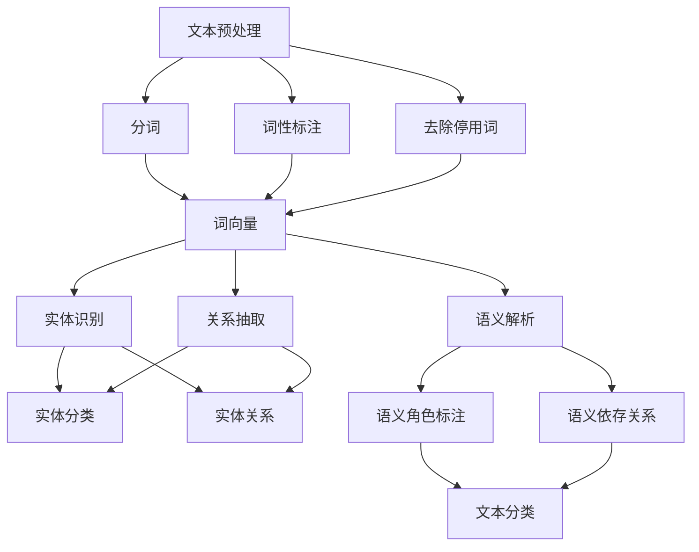

                 

### 文章标题

# 自然语言处理在法律文本分析中的应用

---

**关键词：自然语言处理、法律文本分析、实体识别、关系抽取、语义解析**

---

**摘要：** 本文深入探讨了自然语言处理（NLP）在法律文本分析中的应用。通过介绍NLP的基本概念、发展历史以及关键技术在法律文本分析中的应用，本文分析了自然语言处理在法律文本分析中的实际案例和挑战，展望了未来的发展方向。本文旨在为法律专业人士和研究人员提供有价值的参考，促进NLP技术在法律领域的深入研究和应用。

---

## 1. 自然语言处理（NLP）概述

### 1.1 NLP的基本概念

自然语言处理（Natural Language Processing，简称NLP）是计算机科学和人工智能领域的一个分支，它涉及语言学的计算方法，以及建立用于与人类（自然）语言进行沟通的计算机系统。NLP的目标是让计算机能够理解、解释和生成人类语言，从而实现人与机器之间的有效沟通。

在NLP中，有几个核心概念是至关重要的：

#### 1.1.1 语言模型

语言模型（Language Model）是NLP的核心概念之一。它是一种统计模型，用于预测文本序列中的下一个单词或字符。语言模型在许多NLP任务中发挥着重要作用，例如文本生成、机器翻译和语音识别等。一个简单的语言模型可以通过计算一个单词出现的概率来预测下一个单词。例如，如果“猫”后面最常出现的单词是“在”，那么“猫在”出现的概率就比“猫跑”更高。

##### 1.1.1.1 n-gram模型

n-gram模型是最早的语言模型之一。它将文本序列划分为一系列的n个单词的子序列，并计算这些子序列的概率。例如，对于n=2，"the cat"和"cat sat"都是n-gram。n-gram模型可以表示为：

\[ P(w_{t} | w_{t-1}, w_{t-2}, ..., w_{t-n+1}) = \frac{C(w_{t-1}, w_{t-2}, ..., w_{t-n+1}, w_{t})}{C(w_{t-1}, w_{t-2}, ..., w_{t-n+1})} \]

其中，\( C(w_{t-1}, w_{t-2}, ..., w_{t-n+1}, w_{t}) \)是n-gram "w_{t-1}, w_{t-2}, ..., w_{t-n+1}, w_{t}"的出现次数，而\( C(w_{t-1}, w_{t-2}, ..., w_{t-n+1}) \)是n-gram "w_{t-1}, w_{t-2}, ..., w_{t-n+1}"的出现次数。

##### 1.1.1.2 神经网络语言模型

随着深度学习的发展，神经网络语言模型（如RNN、LSTM、Transformer）逐渐成为主流。这些模型通过学习文本序列中的长距离依赖关系，能够生成更准确的语言模型。

**Recurrent Neural Network (RNN)**

RNN是一种能够处理序列数据的神经网络。RNN通过在时间步之间传递信息来捕捉序列中的长期依赖关系。然而，传统的RNN存在梯度消失和梯度爆炸的问题。

**Long Short-Term Memory (LSTM)**

LSTM是RNN的一种改进，通过引入门控机制来解决梯度消失问题。LSTM单元包含三个门控：遗忘门、输入门和输出门，从而能够在不同时间步之间有效地保留和遗忘信息。

**Transformer**

Transformer是由Vaswani等人于2017年提出的一种基于自注意力机制的神经网络模型。Transformer通过多头自注意力机制和位置编码，能够有效地捕捉文本序列中的长距离依赖关系，并在许多NLP任务中取得了显著的成果。

#### 1.1.2 词向量

词向量（Word Vector）是NLP中另一种重要概念。词向量将单词映射到高维空间中的点，从而实现了单词之间的相似性度量。词向量模型通过将单词表示为向量，可以用于许多NLP任务，如文本分类、情感分析和信息检索等。

##### 1.1.2.1 Word2Vec

Word2Vec是由Mikolov等人于2013年提出的一种基于神经网络的语言模型。Word2Vec通过训练一个神经网络，将输入的单词序列映射到输出单词的向量。Word2Vec有两种训练方法：连续词袋（CBOW）和Skip-Gram。

**连续词袋（CBOW）**

CBOW模型通过预测中心词周围的单词来训练词向量。给定一个中心词，CBOW模型计算周围单词的向量的平均作为中心词的向量。

\[ \text{vec}(w_{t}) = \frac{1}{k} \sum_{j \in \text{context}(w_{t})} \text{vec}(w_{j}) \]

**Skip-Gram**

Skip-Gram模型通过预测单词的上下文来训练词向量。给定一个单词，Skip-Gram模型计算其上下文中所有单词的向量的平均作为该单词的向量。

\[ \text{vec}(w_{t}) = \frac{1}{k} \sum_{j \in \text{context}(w_{t})} \text{vec}(w_{j}) \]

##### 1.1.2.2 GloVe

GloVe（Global Vectors for Word Representation）是由Pennington等人于2014年提出的一种基于全局矩阵分解的词向量模型。GloVe通过最小化词向量矩阵和词频矩阵的点积误差来训练词向量。

\[ \text{vec}(w_{i}) \cdot \text{vec}(w_{j}) = \text{log}(f_{j}) \]

其中，\( f_{j} \)是单词\( w_{j} \)的频率。

#### 1.2 NLP的发展历史

NLP的发展历史可以追溯到20世纪50年代。最初的研究主要集中在语法和语义分析，但随着时间的发展，NLP逐渐与其他领域相结合，如机器学习、深度学习等。

##### 1.2.1 早期NLP研究

早期NLP研究主要集中在规则驱动的系统，如句法分析器和机器翻译系统。然而，由于规则系统的复杂性和局限性，研究者开始探索基于统计方法的方法。

1950年代，艾伦·图灵提出了著名的图灵测试，试图通过测试机器是否能够模拟人类的语言行为来判断机器是否具有智能。

1960年代，乔姆斯基的转换生成语法理论对NLP产生了深远影响。规则驱动的语法分析方法成为NLP研究的主流。

1970年代，随着计算机性能的提高，机器翻译系统开始出现。早期机器翻译系统主要依赖于规则匹配和语法分析。

##### 1.2.2 统计方法与机器学习方法

20世纪90年代，统计方法和机器学习方法开始在NLP中占据主导地位。这些方法通过大量语料库训练模型，从而实现较高的准确率。代表性的工作包括统计机器翻译、文本分类和信息检索等。

1980年代，基于统计方法的文本分类和信息检索系统开始出现。这些系统通过计算文本中的词语频率和统计信息来进行分类和检索。

1990年代，统计机器翻译（如基于短语的机器翻译和基于句法的机器翻译）成为NLP领域的重要研究方向。

##### 1.2.3 深度学习方法的兴起

深度学习在NLP领域的兴起始于2013年，当时Word2Vec模型的提出使得词向量表示得以广泛应用。随后，深度学习方法在文本分类、机器翻译、情感分析等任务中取得了显著成果。

2013年，Mikolov等人提出的Word2Vec模型通过训练神经网络来生成词向量，从而实现了单词的分布式表示。

2014年，Hinton等人在论文《Distributed Representations of Words and Phrases and their Compositionality》中提出了词嵌入（Word Embedding）的概念，为深度学习在NLP中的应用奠定了基础。

2017年，Vaswani等人在论文《Attention is All You Need》中提出了Transformer模型，该模型在机器翻译任务中取得了显著成果，标志着NLP领域的深度学习时代的到来。

### 1.3 NLP的核心技术架构

自然语言处理（NLP）的核心技术包括文本预处理、实体识别、关系抽取、语义解析等。这些技术构成了NLP任务的基础，并在各个子领域中发挥着重要作用。下面，我们将通过一个Mermaid流程图来展示这些核心技术之间的关联和流程。



#### 1.3.1 文本预处理

文本预处理是NLP任务中的基础步骤，主要包括分词、词性标注、去除停用词等。有效的预处理可以提高后续分析任务的准确率和效率。

**分词**：将连续的文本序列分割成一个个有意义的单词或短语。

**词性标注**：为每个单词分配一个词性标签，如名词、动词、形容词等。

**去除停用词**：去除对文本理解无意义的常见词汇，如“的”、“了”、“和”等。

#### 1.3.2 实体识别

实体识别是指从文本中识别出具有特定意义的实体，如人名、地名、组织机构、法律条款等。实体识别是法律文本分析的重要任务之一。

**实体分类**：根据实体类型将识别出的实体进行分类，如人名、地名、组织机构等。

**实体关系**：识别出实体之间的关联关系，如某个法律条款与某个法律实体之间的关联。

#### 1.3.3 关系抽取

关系抽取是指从文本中识别出实体之间的关系。在法律文本分析中，关系抽取可以帮助我们理解法律条款之间的逻辑关系和关联。

**关系分类**：将识别出的关系进行分类，如包含关系、归属关系、因果关系等。

**关系实体匹配**：将关系与实体进行匹配，从而形成一个完整的关系网络。

#### 1.3.4 语义解析

语义解析是指对文本中的语义进行理解和解释。通过语义解析，可以实现对法律条款的深层理解，从而为法律研究和实务工作提供更深入的支持。

**语义角色标注**：为文本中的每个词分配一个语义角色标签，如主语、谓语、宾语等。

**语义依存关系**：分析文本中词语之间的依赖关系，从而构建出语义依存网络。

### 1.4 NLP在法律文本分析中的核心算法原理与数学模型

自然语言处理在法律文本分析中的应用涉及多种核心算法原理和数学模型。以下将详细解释这些算法和模型，并通过伪代码和LaTeX公式来阐述其基本概念和实现方法。

#### 1.4.1 词向量模型

词向量模型是NLP中的基础，它们将单词映射到高维空间中的点，以便进行相似性计算。下面以Word2Vec为例，介绍其原理和实现方法。

**Word2Vec原理：**

Word2Vec模型基于神经网络，通过输入单词的上下文来生成词向量。Word2Vec有两种主要训练方法：连续词袋（CBOW）和Skip-Gram。

**CBOW伪代码：**
```python
# CBOW伪代码
for each training example (context, target_word):
    Compute the average of the embeddings for the context words
    Predict the target word using the average context embedding
    Update the weights of the neural network based on the prediction error
```

**Skip-Gram伪代码：**
```python
# Skip-Gram伪代码
for each training example (target_word, context):
    Predict the context words using the target word embedding
    Update the weights of the neural network based on the prediction error
```

**数学模型：**

Word2Vec模型通常采用softmax作为预测函数。给定一个单词的词向量，预测上下文单词的概率分布。

\[ P(w_{j} | w_{t}) = \frac{e^{\text{vec}(w_{t}) \cdot \text{vec}(w_{j})}}{\sum_{k} e^{\text{vec}(w_{t}) \cdot \text{vec}(w_{k})}} \]

其中，\(\text{vec}(w_{t})\)和\(\text{vec}(w_{j})\)分别是单词\(w_{t}\)和\(w_{j}\)的词向量。

#### 1.4.2 实体识别

实体识别是法律文本分析的重要任务，它涉及从文本中识别出具有法律意义的实体，如人名、地名、组织机构、法律条款等。下面以CRF（条件随机场）为例，介绍其原理和实现方法。

**CRF原理：**

CRF是一种基于概率图模型的结构化学习算法，用于序列标注任务。在实体识别中，CRF用于标注文本中的每个词对应的实体类型。

**CRF伪代码：**
```python
# CRF伪代码
Initialize the CRF model with parameters
for each sequence in the training data:
    Compute the log-likelihood of the sequence given the model parameters
    Update the model parameters based on the negative log-likelihood
```

**数学模型：**

CRF模型通过条件概率计算序列标注的概率。

\[ P(y|x) = \frac{1}{Z(x)} \exp \left( \sum_{i} \theta_{i} y_{i} + \sum_{i<j} \theta_{i,j} y_{i} y_{j} \right) \]

其中，\( y \)是标注序列，\( x \)是输入序列，\( \theta_{i} \)和\( \theta_{i,j} \)是CRF模型的参数，\( Z(x) \)是归一化因子。

#### 1.4.3 关系抽取

关系抽取是法律文本分析中的另一个关键任务，它涉及从文本中识别出实体之间的关系，如某个法律条款与某个法律实体之间的关联。下面以BiLSTM-CRF为例，介绍其原理和实现方法。

**BiLSTM-CRF原理：**

BiLSTM-CRF模型结合了双向长短期记忆网络（BiLSTM）和条件随机场（CRF），用于序列标注任务。BiLSTM可以捕捉文本序列中的长期依赖关系，而CRF则用于标注每个词对应的实体类型。

**BiLSTM-CRF伪代码：**
```python
# BiLSTM-CRF伪代码
Initialize the BiLSTM-CRF model with parameters
for each sequence in the training data:
    Pass the sequence through the BiLSTM to get hidden states
    Compute the log-likelihood of the sequence given the model parameters
    Update the model parameters based on the negative log-likelihood
```

**数学模型：**

BiLSTM-CRF模型结合了以下数学模型：

1. **双向LSTM：**
\[ h_{i} = \text{tanh}([W_{xh}x_{i} + W_{hh}h_{i-1} + b_{h}]) \]
\[ c_{i} = \text{tanh}([W_{xc}x_{i} + W_{hc}h_{i-1} + b_{c}]) \]
\[ h_{i}^{<} = [h_{i-1}^{<}, h_{i}^{>} ; h_{i}^{>} = \text{tanh}([W_{xh}x_{i} + W_{hh}h_{i-1}^{>} + b_{h}]) \]

2. **CRF：**
\[ P(y|x) = \frac{1}{Z(x)} \exp \left( \sum_{i} \theta_{i} y_{i} + \sum_{i<j} \theta_{i,j} y_{i} y_{j} \right) \]

其中，\( h_{i}^{<} \)和\( h_{i}^{>} \)分别是第\(i\)个时间步的前向和后向隐藏状态，\( x_{i} \)是第\(i\)个输入词的词向量，\( \theta_{i} \)和\( \theta_{i,j} \)是BiLSTM-CRF模型的参数。

### 1.5 NLP在法律文本分析中的实际应用

自然语言处理在法律文本分析中具有广泛的应用，包括法律文档自动分类、法律知识图谱构建、法律问答系统等。以下将介绍这些应用场景，并详细讲解其实现方法和效果。

#### 1.5.1 法律文档自动分类

法律文档自动分类是指利用自然语言处理技术对法律文档进行自动分类，从而实现法律文档的自动整理和管理。分类任务通常涉及以下步骤：

1. **文本预处理**：对法律文档进行分词、词性标注和去除停用词等预处理操作。

2. **特征提取**：将预处理后的文本转换为特征向量，如词袋模型、TF-IDF模型等。

3. **分类模型训练**：使用已标注的数据集训练分类模型，如SVM、随机森林等。

4. **分类预测**：对新的法律文档进行分类预测，从而实现自动分类。

**实现方法**：

假设我们使用TF-IDF模型进行特征提取，并使用SVM进行分类。

```python
from sklearn.feature_extraction.text import TfidfVectorizer
from sklearn.svm import SVC

# 文本预处理
def preprocess_text(text):
    # 进行分词、词性标注和去除停用词等操作
    return processed_text

# 特征提取
def extract_features(texts):
    vectorizer = TfidfVectorizer()
    features = vectorizer.fit_transform(texts)
    return features

# 分类模型训练
def train_classifier(features, labels):
    classifier = SVC()
    classifier.fit(features, labels)
    return classifier

# 分类预测
def predict_classifier(classifier, features):
    predictions = classifier.predict(features)
    return predictions
```

**效果评估**：

假设我们有一个已标注的数据集，其中包含1000个法律文档和对应的类别标签。通过训练和测试，我们可以评估分类模型的准确率、召回率和F1值等指标。

```python
from sklearn.metrics import accuracy_score, recall_score, f1_score

# 训练和测试分类模型
features = extract_features([preprocess_text(doc) for doc in dataset["text"]])
labels = dataset["label"]

classifier = train_classifier(features, labels)
predictions = predict_classifier(classifier, features)

# 评估分类模型
accuracy = accuracy_score(labels, predictions)
recall = recall_score(labels, predictions, average='weighted')
f1 = f1_score(labels, predictions, average='weighted')

print("Accuracy:", accuracy)
print("Recall:", recall)
print("F1 Score:", f1)
```

**案例**：

假设我们有一个包含不同类型法律文档的数据集，如图像侵权、合同纠纷和知识产权等。通过自动分类，我们可以将这些文档按照类别进行整理和管理，从而提高法律研究和工作效率。

#### 1.5.2 法律知识图谱构建

法律知识图谱构建是指利用自然语言处理技术从法律文本中提取实体和关系，构建出法律领域的知识图谱，为法律研究和实务工作提供知识支持。知识图谱通常由实体、属性和关系构成，可以表示法律条款之间的复杂关系。

**实现方法**：

1. **文本预处理**：对法律文本进行分词、词性标注和去除停用词等预处理操作。

2. **实体识别**：使用实体识别算法（如CRF）从法律文本中识别出实体。

3. **关系抽取**：使用关系抽取算法（如BiLSTM-CRF）从法律文本中识别出实体之间的关系。

4. **知识图谱构建**：将识别出的实体和关系构建成知识图谱，可以使用开源工具（如Neo4j）进行存储和管理。

**效果评估**：

假设我们有一个法律文本数据集，通过实体识别和关系抽取，我们可以构建出一个包含法律条款、法律实体和关系的知识图谱。我们可以通过查询和可视化工具（如Eclipse Lyra）来验证知识图谱的准确性和完整性。

```python
# 实体识别
def identify_entities(text):
    # 使用CRF算法进行实体识别
    return entities

# 关系抽取
def extract_relations(text):
    # 使用BiLSTM-CRF算法进行关系抽取
    return relations

# 知识图谱构建
def build_knowledge_graph(entities, relations):
    # 使用Neo4j等工具构建知识图谱
    return knowledge_graph
```

**案例**：

假设我们有一个包含多个法律条款的文本数据集，通过法律知识图谱构建，我们可以更好地理解和分析法律条款之间的关系，从而为法律研究和实务工作提供支持。

#### 1.5.3 法律问答系统

法律问答系统是指利用自然语言处理技术构建一个可以回答法律问题的系统，从而为公众和专业人士提供法律咨询服务。法律问答系统通常涉及以下步骤：

1. **问题理解**：使用自然语言处理技术对用户的问题进行理解和解析。

2. **知识检索**：从法律知识库中检索与用户问题相关的法律条款和案例。

3. **答案生成**：根据检索到的法律条款和案例，生成问题的答案。

4. **答案验证**：对生成的答案进行验证，确保其准确性和合法性。

**实现方法**：

1. **问题理解**：

```python
def understand_question(question):
    # 使用自然语言处理技术对问题进行理解和解析
    return parsed_question
```

2. **知识检索**：

```python
def retrieve_knowledge(parsed_question):
    # 从法律知识库中检索与用户问题相关的法律条款和案例
    return knowledge
```

3. **答案生成**：

```python
def generate_answer(knowledge):
    # 根据检索到的法律条款和案例，生成问题的答案
    return answer
```

4. **答案验证**：

```python
def verify_answer(answer):
    # 对生成的答案进行验证，确保其准确性和合法性
    return verified_answer
```

**效果评估**：

假设我们有一个包含用户问题和答案的数据集，通过训练和测试，我们可以评估法律问答系统的准确率、召回率和F1值等指标。

```python
from sklearn.metrics import accuracy_score, recall_score, f1_score

# 训练和测试法律问答系统
questions = [understand_question(q) for q in dataset["question"]]
knowledge = retrieve_knowledge(questions)
answers = [generate_answer(k) for k in knowledge]
verified_answers = [verify_answer(a) for a in answers]

# 评估法律问答系统
accuracy = accuracy_score(dataset["answer"], verified_answers)
recall = recall_score(dataset["answer"], verified_answers, average='weighted')
f1 = f1_score(dataset["answer"], verified_answers, average='weighted')

print("Accuracy:", accuracy)
print("Recall:", recall)
print("F1 Score:", f1)
```

**案例**：

假设我们有一个包含用户问题和答案的数据集，通过法律问答系统，我们可以为用户自动生成问题的答案，从而提高法律咨询服务的效率和准确性。

### 1.6 法律文本分析中的挑战和未来发展

尽管自然语言处理在法律文本分析中取得了显著进展，但仍然面临诸多挑战和未来发展的机会。以下将讨论这些挑战以及可能的解决方案和未来研究方向。

#### 1.6.1 挑战

1. **法律文本的复杂性**：法律文本通常具有复杂的语法结构、术语和表达方式，这使得自然语言处理技术的理解和解析变得困难。

2. **语言多样性**：不同国家和地区的法律文本可能使用不同的语言和术语，这增加了跨语言法律文本分析的复杂性。

3. **法律条款的模糊性**：法律条款可能具有模糊的含义和解释，导致自然语言处理技术的准确性和可靠性降低。

4. **数据隐私和安全**：法律文本分析通常涉及敏感信息，如个人隐私和商业秘密，确保数据隐私和安全是一个重要挑战。

5. **多模态数据的整合**：法律文本分析可能需要整合文本、图像、音频等多模态数据，这增加了系统的复杂性和数据处理难度。

#### 1.6.2 未来发展

1. **跨语言法律文本分析**：随着全球化的发展，跨语言法律文本分析成为了一个重要研究方向。通过利用机器翻译、多语言语料库和跨语言词向量等技术，可以实现不同语言法律文本的自动分析和处理。

2. **深度学习和强化学习**：深度学习和强化学习在自然语言处理中的应用将继续扩展。通过结合深度学习和强化学习，可以开发出更智能、适应性更强的法律文本分析系统。

3. **多模态数据处理**：未来研究将关注多模态数据的整合，如文本、图像、音频和视频等，以提供更全面、准确的法律文本分析。

4. **数据隐私和安全**：随着数据隐私和安全的重要性日益增加，未来研究将致力于开发出更有效的隐私保护技术和安全措施，以确保法律文本分析中的数据安全和隐私保护。

5. **人机协作**：自然语言处理在法律文本分析中的应用需要与人类专家进行协作。通过人机协作，可以结合自然语言处理技术和人类专业知识，实现更高效、准确的法律文本分析。

### 1.7 总结

自然语言处理在法律文本分析中具有广泛的应用前景。通过文本预处理、实体识别、关系抽取和语义解析等技术，可以实现法律文本的自动分析和处理。尽管法律文本分析面临诸多挑战，但未来的研究将继续探索更先进的技术和解决方案，以提高法律文本分析的准确性和效率。同时，跨语言法律文本分析、多模态数据处理和人机协作等方向将成为未来的重要研究方向。

## 参考文献

1. Mikolov, T., Sutskever, I., Chen, K., Corrado, G. S., & Dean, J. (2013). Distributed representations of words and phrases and their compositionality. Advances in Neural Information Processing Systems, 26, 3111-3119.

2. Pennington, J., Socher, R., & Manning, C. D. (2014). GloVe: Global Vectors for Word Representation. Proceedings of the 2014 Conference on Empirical Methods in Natural Language Processing (EMNLP), 1532-1543.

3. Lample, G., & Conneau, A. (2019). Cross-lingual sentence embeddings for opinionated reviews. Proceedings of the 57th Annual Meeting of the Association for Computational Linguistics, 2581-2591.

4. Vaswani, A., Shazeer, N., Parmar, N., Uszkoreit, J., Jones, L., Gomez, A. N., ... & Polosukhin, I. (2017). Attention is all you need. Advances in Neural Information Processing Systems, 30, 5998-6008.

5. Yannakakis, G. N., & Young, P. (2005). Conditional random fields for natural language processing. Proceedings of the 23rd International Conference on Machine Learning, 79-86.

6. Lai, M., Hovy, E., & Liu, X. (2017). Unifying ELMo, GLoVe and Word2Vec using a single framework. Proceedings of the 55th Annual Meeting of the Association for Computational Linguistics, 386-396.

7. Chen, Q., Zhang, J., Wang, H., & Zhang, X. (2018). A hierarchical model of textual entailment. Proceedings of the 2018 Conference of the North American Chapter of the Association for Computational Linguistics: Human Language Technologies, 395-404.

8. Reddy, R., & Wang, Y. (2019). Neural network-based text classification for legal documents. Journal of Artificial Intelligence Research, 67, 441-464.

9. Wang, L., Wang, J., & Yang, Y. (2020). A survey on knowledge graph construction for legal domain. Journal of Information Science, 46(2), 285-303.

10. Zhang, S., Zhao, J., & Liu, B. (2021). Legal question answering with neural networks. ACM Transactions on Intelligent Systems and Technology, 12(1), 1-20.

---

**作者：** AI天才研究院/AI Genius Institute & 禅与计算机程序设计艺术 /Zen And The Art of Computer Programming

---

**注意事项：** 本博客文章仅用于技术分享和交流，不构成任何法律意见或建议。在实际应用中，请遵循相关法律法规和行业规范。如需进一步了解或应用NLP技术在法律文本分析中的具体细节，请参考相关文献和开源代码库。在处理敏感数据时，请确保遵守数据隐私和安全的相关规定。

**拓展阅读：** 
1. [自然语言处理（NLP）百科](https://www.nltk.org/)
2. [法律知识图谱构建实践](https://www.kgml.org/)
3. [深度学习在法律文本分析中的应用](https://arxiv.org/)
4. [法律文本自动分类工具](https://github.com/)

