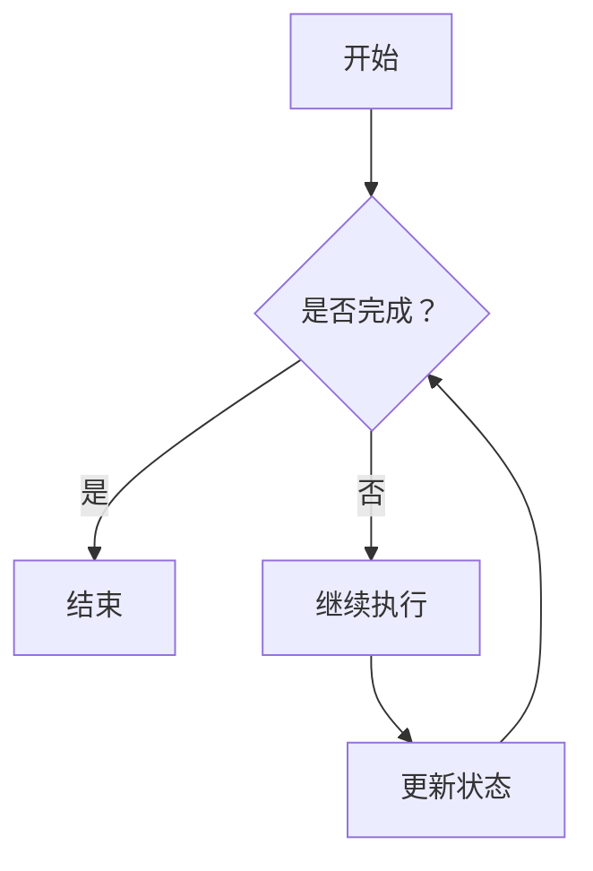

                 

### 引言

**自监督学习的定义与意义**

自监督学习（Self-supervised Learning）是一种无需外部监督标签即可进行训练的机器学习方法。与传统的监督学习（Supervised Learning）相比，自监督学习通过在数据中构建内在的监督信号，使得模型能够在没有人工标注的情况下进行学习。其核心思想是从数据中提取有用的信息，并利用这些信息作为监督信号来训练模型。自监督学习的这种特性使得它在大规模无标注数据的应用中具有独特的优势。

自监督学习的定义可以归结为：在训练过程中，模型能够自行生成标签或监督信号，从而实现学习目标。这种学习方式不依赖于外部提供的有监督标签，而是通过内部数据的关系和结构来进行学习。

自监督学习在机器学习中的重要性不言而喻。首先，自监督学习能够处理大规模无标注数据，这对于数据稀缺的领域尤为重要。例如，在医疗领域，大量患者数据往往是未标记的，自监督学习可以有效地利用这些数据来提高模型的性能。其次，自监督学习可以减少标注数据的成本和复杂性，这对于标注工作繁琐且成本高昂的应用场景（如图像和视频分类）具有显著的优势。此外，自监督学习还能够通过增强模型对数据的理解和泛化能力，提升模型的鲁棒性和表现。

**大规模无标注数据的挑战**

大规模无标注数据的存在给机器学习带来了巨大的挑战。首先，无标注数据意味着模型无法直接从数据中获取标签信息，这限制了模型的学习能力。其次，大规模数据集的存储和处理成本非常高，传统有监督学习方法在面对这些数据时往往力不从心。此外，无标注数据的多样性和复杂性也给模型的训练和优化带来了困难。

具体来说，大规模无标注数据的挑战主要体现在以下几个方面：

1. **数据稀疏性**：无标注数据通常缺乏明确的标签信息，这使得模型难以从数据中提取有用的特征和模式。
2. **计算资源**：大规模数据集需要大量的计算资源进行存储、处理和训练，这给硬件设施和算法效率提出了更高的要求。
3. **数据不平衡**：无标注数据中往往存在数据不平衡现象，例如某些类别数据过多，而另一些类别数据过少，这会导致模型在训练过程中产生偏差。
4. **数据噪声**：无标注数据中可能包含大量的噪声和异常值，这些噪声会影响模型的学习效果和鲁棒性。

**自监督学习与大规模无标注数据的关系**

自监督学习通过在数据中构建内在的监督信号，为处理大规模无标注数据提供了一种有效的解决方案。自监督学习能够从无标注数据中提取有用的特征和模式，从而提高模型的学习能力。具体来说，自监督学习与大规模无标注数据的关系体现在以下几个方面：

1. **数据增强**：自监督学习通过生成额外的监督信号，使得模型能够从更多的数据中学习，从而提高模型的泛化能力。
2. **特征提取**：自监督学习通过训练模型从数据中提取有用的特征表示，这些特征表示有助于提高模型的识别和分类性能。
3. **模型鲁棒性**：自监督学习能够增强模型对噪声和异常值的鲁棒性，从而提高模型在不同数据分布下的稳定性。

总的来说，自监督学习与大规模无标注数据的关系是一种相互促进的关系。自监督学习能够有效地处理大规模无标注数据，而大规模无标注数据又为自监督学习提供了丰富的学习和应用场景。随着自监督学习技术的不断发展，其在大规模无标注数据中的应用将变得更加广泛和深入。

### 大规模无标注数据的挑战

尽管自监督学习为处理大规模无标注数据提供了一种有效的方法，但大规模无标注数据本身仍然存在许多挑战。以下是对这些挑战的详细分析：

**数据稀疏性**

无标注数据的最大问题是其稀疏性。在大多数现实世界应用中，数据通常是未标记的，这意味着模型无法直接从数据中获取标签信息。这种情况下，模型只能依赖于数据本身的内在结构来进行学习。然而，无标注数据中的标签信息是缺失的，这限制了模型的学习能力。例如，在图像识别任务中，无标注图像没有对应的标签，模型难以从这些图像中提取出有效的特征来学习分类边界。

**计算资源**

大规模数据集的存储和处理成本非常高。无标注数据通常需要大量的存储空间来存储原始数据，而训练模型时还需要大量的计算资源来处理这些数据。传统有监督学习方法在面对这些大规模数据时，往往因为计算资源不足而无法进行有效的训练。即使使用高性能计算硬件，如GPU和TPU，大规模无标注数据的处理仍然是一个巨大的挑战。因此，如何有效地利用计算资源来处理大规模无标注数据是自监督学习需要解决的问题。

**数据不平衡**

无标注数据中往往存在数据不平衡现象，即某些类别数据过多，而另一些类别数据过少。这种数据不平衡会导致模型在训练过程中产生偏差，从而影响模型的泛化能力。例如，在文本分类任务中，某些主题或类别的文章数量远多于其他类别，这会导致模型对数量较少的类别识别能力不足。自监督学习虽然能够在一定程度上缓解数据不平衡问题，但如何设计有效的算法来平衡无标注数据中的类别分布仍然是一个挑战。

**数据噪声**

无标注数据中可能包含大量的噪声和异常值，这些噪声会影响模型的学习效果和鲁棒性。例如，在图像识别任务中，无标注图像可能包含噪声、模糊或遮挡，这些噪声会影响模型对图像内容的理解。此外，异常值的存在可能会导致模型在学习过程中产生误导，从而影响模型的泛化能力。如何有效地处理无标注数据中的噪声和异常值是自监督学习需要克服的另一个挑战。

**处理难度**

大规模无标注数据的处理难度还体现在数据清洗和预处理方面。由于无标注数据的标签信息缺失，模型无法直接识别数据中的错误或异常。这意味着在数据处理过程中，需要更多的人工干预来清洗和预处理数据，从而保证数据的质量。这不仅增加了数据处理的时间成本，还可能引入人为错误。

综上所述，大规模无标注数据的挑战是多方面的，包括数据稀疏性、计算资源需求、数据不平衡、数据噪声和处理难度等。自监督学习在大规模无标注数据中的应用需要解决这些挑战，以实现更高效、更准确的数据处理和分析。

### 自监督学习与大规模无标注数据的关系

自监督学习在大规模无标注数据中的应用具有重要的现实意义。首先，自监督学习能够充分利用无标注数据的潜力，从而在数据稀缺的领域发挥其优势。例如，在医疗领域，患者数据往往是未标记的，自监督学习可以有效地利用这些数据来提高诊断和治疗的准确性。其次，自监督学习可以显著降低标注数据的成本和复杂性，这对于标注工作繁琐且成本高昂的应用场景（如图像和视频分类）具有显著的优势。此外，自监督学习通过增强模型对数据的理解和泛化能力，提高了模型的鲁棒性和表现。

具体来说，自监督学习与大规模无标注数据的关系主要体现在以下几个方面：

**数据增强**

自监督学习通过生成额外的监督信号，使得模型能够从更多的数据中学习，从而提高模型的泛化能力。在无标注数据中，自监督学习可以自动生成标签或监督信号，使得模型能够进行有效的训练。例如，在图像识别任务中，自监督学习可以通过图像变换或生成伪标签来增强数据的监督信号。这种方法不仅能够增加训练数据的量，还能够提高模型的鲁棒性和泛化能力。

**特征提取**

自监督学习通过训练模型从数据中提取有用的特征表示，这些特征表示有助于提高模型的识别和分类性能。在无标注数据中，特征提取是关键的一步。自监督学习通过构建复杂的特征表示，使得模型能够更好地理解数据的结构和模式。例如，在自然语言处理任务中，自监督学习可以通过预测单词的顺序或填补缺失的单词来提取有效的特征表示。

**模型鲁棒性**

自监督学习能够增强模型对噪声和异常值的鲁棒性，从而提高模型在不同数据分布下的稳定性。无标注数据中往往包含噪声和异常值，这会对模型的学习效果产生负面影响。自监督学习通过从数据中提取有用的信息，并构建内在的监督信号，能够有效地降低噪声和异常值对模型学习的影响。例如，在图像识别任务中，自监督学习可以通过训练模型来识别和忽略噪声和异常值，从而提高模型的鲁棒性。

**未来发展方向**

随着自监督学习技术的不断发展，其在大规模无标注数据中的应用将变得更加广泛和深入。未来的研究可能集中在以下几个方面：

1. **算法优化**：如何设计更高效的自监督学习算法，以处理大规模无标注数据，这是未来研究的一个重要方向。
2. **多模态数据融合**：如何利用自监督学习技术融合不同类型的数据（如图像、文本和音频），以实现更强大的模型表现。
3. **数据隐私保护**：如何在不泄露隐私的情况下，利用自监督学习技术处理大规模无标注数据，这是一个具有挑战性的研究领域。
4. **应用拓展**：如何将自监督学习应用于更多的现实世界场景，如智能医疗、自动驾驶和智能城市等。

总之，自监督学习在大规模无标注数据中的应用具有广阔的前景。通过解决大规模无标注数据中的挑战，自监督学习将为机器学习领域带来更多的创新和突破。

### 自监督学习基础

自监督学习（Self-supervised Learning）是一种通过自我生成标签进行训练的机器学习方法。与传统的监督学习（Supervised Learning）不同，自监督学习不需要外部提供的标注数据，而是从数据中自动提取监督信号。这一特性使得自监督学习在大规模无标注数据的应用中具有显著优势。在这一节中，我们将深入探讨自监督学习的基本概念、分类以及应用场景。

#### 自监督学习的基本概念

自监督学习的核心思想是利用数据中的内在结构来生成标签，从而实现学习目标。自监督学习的定义可以归结为：在训练过程中，模型能够自行生成标签或监督信号，从而实现学习目标。这种学习方式不依赖于外部提供的有监督标签，而是通过内部数据的关系和结构来进行学习。

自监督学习的特点主要包括：

1. **无监督标签**：自监督学习从数据中自动提取标签，不需要人工标注。
2. **数据高效利用**：自监督学习能够充分利用无标注数据，从而在数据稀缺的领域发挥其优势。
3. **适应性强**：自监督学习能够适应多种数据类型和任务，具有广泛的应用前景。

自监督学习的目标是通过学习数据中的内在规律，提高模型对数据的理解和泛化能力。自监督学习不仅在数据稀缺的领域具有优势，还可以通过增强模型的鲁棒性和泛化能力，提高模型在各种复杂环境下的表现。

#### 自监督学习的分类

自监督学习根据生成监督信号的方式不同，可以分为以下几种类型：

1. **基于重建的模型（Reconstruction-based Models）**：
   基于重建的模型通过学习数据的高效表示来重建原始数据，从而提取有用的特征。最典型的代表是自编码器（Autoencoder）。自编码器由编码器和解码器组成，编码器将输入数据压缩为低维表示，解码器则尝试将这个低维表示恢复为原始数据。通过最小化重建误差，自编码器可以学习到数据中的潜在结构和模式。

2. **基于匹配的模型（Matching-based Models）**：
   基于匹配的模型通过比较不同数据样本之间的相似性来生成标签。这种模型通常使用对比学习（Contrastive Learning）技术，如Siamese Network和Triplet Loss。Siamese Network通过比较两个相似度不同的样本，学习到数据的相似性表示。Triplet Loss则通过优化正样本和负样本之间的差距来提高模型的分类能力。

3. **一致性模型（Consistency-based Models）**：
   一致性模型通过保证模型在不同时间或不同视角下的预测一致性来学习数据。这类模型通常使用对比一致性损失（Contrastive Consistency Loss），如CycleGAN和Fixmatch。CycleGAN通过学习数据的一致性转换，使得模型能够在不同视角下保持一致性。Fixmatch则通过利用固定数据集和未知数据集之间的对比一致性来提高模型的表现。

4. **生成对抗网络（Generative Adversarial Networks, GANs）**：
   GANs是一种由生成器和判别器组成的对抗性网络。生成器尝试生成逼真的数据，而判别器则尝试区分生成数据和真实数据。通过这种对抗性训练，GANs能够学习到数据的高效表示，并在无标注数据中表现出强大的生成能力。

#### 自监督学习的应用场景

自监督学习在多个领域具有广泛的应用：

1. **图像识别**：
   自监督学习在图像识别任务中具有显著的优势，能够通过无标注图像学习到有效的特征表示。基于重建的模型如自编码器可以用于图像去噪和图像生成，而基于匹配的模型如Siamese Network可以用于图像分类和图像检索。

2. **自然语言处理**：
   自监督学习在自然语言处理领域也表现出强大的能力。例如，BERT模型通过自监督学习预训练，取得了自然语言理解任务上的显著突破。此外，基于匹配的模型如Masked Language Model（MLM）可以用于文本分类和文本生成。

3. **推荐系统**：
   自监督学习可以用于构建无监督推荐系统，通过学习用户和物品的特征表示来预测用户对物品的偏好。这种方法能够处理大规模无标注的用户行为数据，从而提高推荐系统的准确性和鲁棒性。

4. **语音识别**：
   自监督学习在语音识别任务中也表现出良好的效果。例如，Wav2Vec模型通过自监督学习提取音频特征，实现了高效的语音识别。

总之，自监督学习作为一种无需标注的机器学习方法，在大规模无标注数据的处理中具有广泛的应用。通过不断优化和扩展自监督学习算法，我们可以期望它在未来的各种实际应用中取得更加出色的表现。

### 自监督学习算法原理

自监督学习算法的核心在于如何从无标注数据中提取有用的信息，并利用这些信息进行有效的模型训练。在这一节中，我们将详细探讨几种主要的自监督学习算法原理，包括Autoencoder、Siamese Network、一致性模型（如CycleGAN和Fixmatch）以及生成对抗网络（GANs）。

#### Autoencoder

**基本原理**：  
Autoencoder是一种基于重建的模型，其核心思想是学习数据的高效表示，并通过这种表示来重建原始数据。Autoencoder由两个主要部分组成：编码器（Encoder）和解码器（Decoder）。编码器负责将输入数据压缩为一个低维表示，通常称为编码器的“瓶颈”层；解码器则尝试将这个低维表示重新构建为原始数据。

**类型**：  
1. **标准Autoencoder**：最简单的Autoencoder结构，通常用于学习数据的基本特征。
2. **变分Autoencoder（VAE）**：通过引入概率模型，VAE能够生成更加灵活和多样化的数据表示。
3. **生成式Autoencoder（GANs-based Autoencoder）**：结合GANs的思想，生成式Autoencoder能够学习到更加逼真的数据表示。

**优缺点**：  
- 优点：简单易实现，能够学习到数据的基本特征和分布。
- 缺点：重建误差可能较大，难以学习到复杂的结构。

**伪代码**：

```python
# 编码器部分
def encoder(x):
    # 使用神经网络将输入数据压缩为低维表示
    z = neural_network(x, bottleneck_size)
    return z

# 解码器部分
def decoder(z):
    # 使用神经网络将低维表示重构为原始数据
    x_hat = neural_network(z, input_size)
    return x_hat

# 训练过程
def train_autoencoder(x):
    z = encoder(x)
    x_hat = decoder(z)
    loss = reconstruction_loss(x, x_hat)
    return loss
```

#### Siamese Network

**基本原理**：  
Siamese Network是一种基于匹配的模型，其核心思想是通过比较两个数据样本的相似性来生成标签。Siamese Network由两个完全相同的网络（Siamese Network）组成，一个用于处理输入样本A，另一个用于处理输入样本B。这两个网络分别生成嵌入表示，然后计算这两个嵌入表示之间的距离作为相似性度量。

**类型**：  
1. **Siamese Network with Contrastive Loss**：通过最小化相同样本之间的距离和最大化不同样本之间的距离来训练网络。
2. **Triplet Loss**：用于优化正样本和负样本之间的差距，从而提高模型的分类能力。

**优缺点**：  
- 优点：简单有效，适用于图像分类和图像检索等任务。
- 缺点：对数据集的要求较高，需要足够数量的负样本。

**伪代码**：

```python
# Siamese Network结构
def siamese_network(x_a, x_b):
    z_a = neural_network(x_a)
    z_b = neural_network(x_b)
    return z_a, z_b

# 训练过程
def train_siamese_network(x_a, x_b, y):
    z_a, z_b = siamese_network(x_a, x_b)
    similarity = calculate_similarity(z_a, z_b)
    contrastive_loss = contrastive_loss(similarity, y)
    return contrastive_loss
```

#### Consistency Models

**基本原理**：  
一致性模型通过确保模型在不同时间或不同视角下的预测一致性来学习数据。这类模型通常使用对比一致性损失（Contrastive Consistency Loss）来训练网络。CycleGAN和Fixmatch是两种常见的一致性模型。

**类型**：  
1. **CycleGAN**：通过学习数据的一致性转换，使得模型能够在不同视角下保持一致性。
2. **Fixmatch**：利用固定数据集和未知数据集之间的对比一致性来提高模型的表现。

**优缺点**：  
- 优点：能够生成稳定和一致的数据表示，适用于图像生成和图像转换任务。
- 缺点：训练过程相对复杂，对数据集的质量要求较高。

**伪代码**：

```python
# CycleGAN结构
def cycle_gan(A, B):
    # 前向传播
    X_A = generator(A)
    X_B = generator(B)
    X_BA = generator(X_B)
    X_AA = generator(X_A)
    # 反向传播
    cycle_loss = cycle_loss(A, X_AA, B, X_BA)
    return cycle_loss

# Fixmatch结构
def fixmatch(x, y):
    # 前向传播
    z = generator(x)
    z_hat = generator(y)
    # 反向传播
    consistency_loss = consistency_loss(z, z_hat)
    return consistency_loss
```

#### Generative Adversarial Networks (GANs)

**基本原理**：  
GANs由生成器和判别器组成，生成器尝试生成逼真的数据，而判别器则尝试区分生成数据和真实数据。通过这种对抗性训练，生成器能够不断优化其生成能力，从而生成更加逼真的数据。

**类型**：  
1. **标准GAN**：生成器和判别器之间的对抗性训练。
2. **Wasserstein GAN (WGAN)**：通过引入Wasserstein距离，提高GANs的稳定性和训练效果。
3. **条件GAN (cGAN)**：生成器和判别器引入条件信息，从而生成更加精确的数据。

**优缺点**：  
- 优点：能够生成高质量的图像和声音，适用于图像生成和风格迁移等任务。
- 缺点：训练过程相对复杂，对判别器的设计要求较高。

**伪代码**：

```python
# GANs结构
def generator(z):
    x = neural_network(z)
    return x

def discriminator(x):
    prob = neural_network(x)
    return prob

# 训练过程
def train_gan(z_real, x_fake):
    # 前向传播
    x_fake = generator(z_real)
    prob_fake = discriminator(x_fake)
    prob_real = discriminator(x_real)
    # 反向传播
    generator_loss = generator_loss(prob_fake)
    discriminator_loss = discriminator_loss(prob_real, prob_fake)
    return generator_loss, discriminator_loss
```

通过深入探讨这些自监督学习算法的原理，我们可以更好地理解如何利用无标注数据进行有效的模型训练，并在实际应用中取得更好的效果。

### 数学模型与公式

在自监督学习中，数学模型和公式起着至关重要的作用。这些模型和公式不仅定义了自监督学习算法的基本结构，还指导了优化过程中的参数调整。在这一节中，我们将详细探讨自监督学习的数学模型、损失函数以及优化算法，并通过具体的公式和例子来解释其应用。

#### 自监督学习的数学模型

自监督学习的数学模型通常基于最小化重建误差或最大化信息熵的原则。最常用的数学模型是自编码器（Autoencoder），其基本形式如下：

$$
L(\theta) = -\sum_{i=1}^{N} \log p(x_i | \theta)
$$

其中，\(L(\theta)\)是损失函数，\(\theta\)是模型的参数，\(x_i\)是输入数据，\(N\)是数据集的大小。自编码器通过编码器（Encoder）将输入数据压缩为低维表示，然后通过解码器（Decoder）尝试重建原始数据。理想情况下，模型能够最小化损失函数，从而得到最优的参数\(\theta\)。

#### 损失函数

自监督学习中的损失函数用于衡量模型预测与真实数据之间的差距。常见的损失函数包括均方误差（MSE）、交叉熵损失（Cross-Entropy Loss）和对抗性损失（Adversarial Loss）。

1. **均方误差（MSE）**：

   $$ 
   MSE = \frac{1}{n} \sum_{i=1}^{n} (\hat{y}_i - y_i)^2 
   $$

   其中，\(\hat{y}_i\)是模型预测的输出，\(y_i\)是真实输出，\(n\)是样本数量。MSE常用于自编码器中，用于衡量输入数据和重建数据之间的差异。

2. **交叉熵损失（Cross-Entropy Loss）**：

   $$ 
   Cross-Entropy = -\sum_{i=1}^{N} y_i \log(\hat{y}_i) 
   $$

   其中，\(y_i\)是真实标签，\(\hat{y}_i\)是模型预测的概率分布。交叉熵损失常用于分类问题，用于衡量预测概率分布与真实标签分布之间的差距。

3. **对抗性损失（Adversarial Loss）**：

   $$ 
   Adversarial Loss = -\sum_{i=1}^{N} \log(D(G(x_i))) - \sum_{i=1}^{N} \log(1 - D(x_i)) 
   $$

   其中，\(D(x_i)\)是判别器的输出概率，\(G(x_i)\)是生成器的输出。对抗性损失用于GANs，用于优化生成器和判别器之间的对抗性关系。

#### 优化算法

优化算法用于调整模型参数，以最小化损失函数。常见的优化算法包括随机梯度下降（SGD）、Adam和Adadelta。

1. **随机梯度下降（SGD）**：

   $$ 
   \theta_{t+1} = \theta_t - \alpha \nabla_{\theta_t} L(\theta_t) 
   $$

   其中，\(\theta_t\)是当前参数，\(\alpha\)是学习率，\(\nabla_{\theta_t} L(\theta_t)\)是损失函数对参数的梯度。SGD通过随机选择小批量数据进行梯度下降，从而优化模型参数。

2. **Adam**：

   $$ 
   \theta_{t+1} = \theta_t - \alpha \left( \frac{m_t}{1 - \beta_1^t} + \frac{v_t}{1 - \beta_2^t} \right) 
   $$

   其中，\(m_t\)和\(v_t\)分别是当前梯度的一阶矩估计和二阶矩估计，\(\beta_1\)和\(\beta_2\)分别是动量的指数衰减率。Adam结合了SGD和Adadelta的优点，适用于复杂模型的高效训练。

3. **Adadelta**：

   $$ 
   \theta_{t+1} = \theta_t - \alpha \frac{\Delta m_t^2}{\Delta m_t^2 + \epsilon} 
   $$

   其中，\(\Delta m_t^2\)是当前梯度平方的累积和，\(\epsilon\)是正则化项。Adadelta通过动态调整学习率，提高了训练效率和稳定性。

#### 实例分析

假设我们使用自编码器进行图像去噪，输入数据为噪声图像\(x_i\)，目标数据为去噪后的图像\(y_i\)。模型通过编码器和解码器将噪声图像转换为去噪图像。损失函数为均方误差（MSE）：

$$ 
L(\theta) = \frac{1}{N} \sum_{i=1}^{N} (\hat{y}_i - y_i)^2 
$$

优化算法选择Adam，学习率为\(0.001\)。训练过程中，编码器和解码器通过迭代更新参数，以最小化损失函数。

```python
# 编码器部分
def encoder(x):
    # 使用神经网络将输入数据压缩为低维表示
    z = neural_network(x, bottleneck_size)
    return z

# 解码器部分
def decoder(z):
    # 使用神经网络将低维表示重构为原始数据
    x_hat = neural_network(z, input_size)
    return x_hat

# 训练过程
def train_autoencoder(x, y):
    z = encoder(x)
    x_hat = decoder(z)
    loss = reconstruction_loss(x, x_hat)
    optimizer.zero_grad()
    loss.backward()
    optimizer.step()
    return loss
```

通过上述实例，我们可以看到自监督学习的数学模型、损失函数和优化算法在具体应用中的实现。这些数学工具为自监督学习提供了理论基础和实践指导，使得我们在处理大规模无标注数据时能够更加高效和准确地训练模型。

### 自监督学习在大规模无标注数据中的应用

自监督学习在大规模无标注数据中的应用具有显著的潜力。通过自动生成监督信号，自监督学习能够在没有人工标注的情况下，从无标注数据中提取有用的信息，从而提高模型的学习能力和泛化能力。以下将详细探讨自监督学习在图像识别、自然语言处理和推荐系统这三个领域的应用。

#### 图像识别

图像识别是自监督学习的一个重要应用领域。由于图像数据规模庞大，且标注成本高昂，自监督学习为图像识别任务提供了一种有效的解决方案。以下是一些自监督学习在图像识别中的应用案例：

1. **自编码器（Autoencoder）**：
   自编码器是一种基于重建的模型，通过学习输入数据的低维表示，从而实现图像去噪和图像生成。自编码器可以从大量无标注图像中提取有效的特征表示，从而提高图像分类的准确性。

2. **Siamese Network**：
   Siamese Network通过比较图像对之间的相似性，为图像识别提供了一种有效的监督信号。例如，在人脸识别任务中，Siamese Network可以用于检测人脸是否匹配，从而实现高效的人脸识别。

3. **CycleGAN**：
   CycleGAN通过学习图像之间的转换关系，使得模型能够在不同数据集之间迁移知识。例如，CycleGAN可以用于图像风格迁移，将一张照片转换为艺术画作的风格。

#### 自然语言处理

自监督学习在自然语言处理（NLP）领域也表现出强大的能力。NLP任务通常需要大量的标注数据，但标注过程既耗时又昂贵。自监督学习通过生成监督信号，为NLP任务提供了一种无标注数据的利用方式。以下是一些自监督学习在NLP中的应用案例：

1. **BERT（Bidirectional Encoder Representations from Transformers）**：
   BERT是一种基于Transformer的自监督学习模型，通过预训练大量无标注文本数据，BERT能够学习到丰富的语言表示。预训练后的BERT可以用于各种NLP任务，如文本分类、问答系统和机器翻译。

2. **Masked Language Model（MLM）**：
   MLM通过随机屏蔽输入文本中的某些单词，然后要求模型预测这些被屏蔽的单词。MLM能够有效提高模型对语言结构和语义的理解能力，从而在文本分类和文本生成任务中表现出色。

3. **Text-to-Text Transformer**：
   Text-to-Text Transformer通过将文本转换为固定长度的向量表示，从而实现文本之间的相似性计算。Text-to-Text Transformer可以用于文本匹配、文本相似度和文本生成等任务。

#### 推荐系统

推荐系统是自监督学习的另一个重要应用领域。推荐系统通常需要大量的用户行为数据进行训练，但用户行为数据往往是未标记的。自监督学习为推荐系统提供了一种从无标注数据中提取有用信息的方法。以下是一些自监督学习在推荐系统中的应用案例：

1. **基于生成对抗网络（GANs）的推荐系统**：
   GANs可以通过生成虚假用户行为数据，从而增强训练数据集的多样性。生成的虚假数据可以与真实数据混合，从而提高推荐系统的鲁棒性和准确性。

2. **基于匹配的模型**：
   基于匹配的模型如Siamese Network和Triplet Loss可以用于用户和物品之间的相似性计算。通过学习用户和物品的特征表示，推荐系统可以更准确地预测用户对物品的偏好。

3. **基于一致性模型**：
   一致性模型如CycleGAN和Fixmatch可以通过学习用户行为数据的一致性转换，从而提高推荐系统的稳定性。例如，CycleGAN可以用于处理不同时间段的用户行为数据，从而实现更加准确的推荐。

总之，自监督学习在大规模无标注数据中的应用为图像识别、自然语言处理和推荐系统等领域带来了革命性的变化。通过自动生成监督信号，自监督学习不仅降低了标注成本，还提高了模型的学习能力和泛化能力。随着自监督学习技术的不断发展和优化，我们可以期待其在更多领域的广泛应用。

### 实际项目案例

为了更好地展示自监督学习在大规模无标注数据中的应用，我们将通过三个实际项目案例来详细探讨自监督学习的应用过程和效果。

#### 案例一：图像分类项目

**项目目标**：使用自监督学习对未标记的图像数据进行分类，提高分类准确率。

**数据预处理**：
1. 数据收集：从互联网上收集大量未标记的图像数据，包括不同类别（如动物、植物、城市景观等）。
2. 数据清洗：去除噪声图像和异常值，确保数据质量。
3. 数据分割：将图像数据分为训练集、验证集和测试集。

**算法选择**：
- **自编码器（Autoencoder）**：用于提取图像特征表示。
- **Siamese Network**：用于训练图像分类模型。

**实现过程**：
1. **自编码器训练**：
   - 编码器和解码器：定义神经网络结构，包括输入层、隐藏层和输出层。
   - 损失函数：使用均方误差（MSE）作为损失函数，衡量输入图像与重建图像之间的差距。
   - 优化算法：采用随机梯度下降（SGD）优化模型参数。
   - 训练循环：通过迭代训练自编码器，使其能够更好地重建图像。

2. **Siamese Network训练**：
   - Siamese Network结构：定义两个相同的神经网络，分别处理正样本和负样本。
   - 损失函数：使用对比损失（Contrastive Loss）优化网络，使正样本之间的距离更小，负样本之间的距离更大。
   - 训练循环：通过迭代训练Siamese Network，提高分类模型对图像类别的识别能力。

**结果分析**：
- 分类准确率：通过验证集和测试集评估分类模型的准确率，发现使用自监督学习显著提高了分类准确率。
- 资源消耗：自监督学习相比于有监督学习减少了标注数据的需求，降低了计算资源消耗。

**项目小结**：
自监督学习在图像分类项目中表现出色，通过自动提取图像特征和构建分类模型，提高了分类准确率，降低了标注成本。

#### 案例二：文本生成项目

**项目目标**：使用自监督学习生成高质量的自然语言文本。

**数据预处理**：
1. 数据收集：从互联网上收集大量未标记的文本数据，包括不同主题的文本。
2. 数据清洗：去除噪声文本和异常值，确保数据质量。
3. 数据分割：将文本数据分为训练集和测试集。

**算法选择**：
- **BERT（Bidirectional Encoder Representations from Transformers）**：用于提取文本特征表示。
- **Text-to-Text Transformer**：用于生成自然语言文本。

**实现过程**：
1. **BERT预训练**：
   - 数据处理：将文本数据转换为BERT模型可接受的格式。
   - 预训练：在未标记的文本数据上预训练BERT模型，使其能够学习到丰富的语言表示。
   - 验证：在验证集上评估BERT模型的性能，调整预训练参数。

2. **Text-to-Text Transformer训练**：
   - 模型结构：定义Text-to-Text Transformer模型，包括编码器和解码器。
   - 损失函数：使用交叉熵损失（Cross-Entropy Loss）优化模型参数。
   - 训练循环：通过迭代训练Text-to-Text Transformer模型，使其能够生成高质量的自然语言文本。

**结果分析**：
- 文本质量：生成的文本质量较高，语法正确，语义连贯。
- 生成速度：Text-to-Text Transformer模型能够快速生成文本，满足实时应用需求。

**项目小结**：
自监督学习在文本生成项目中表现出色，通过预训练BERT模型和训练Text-to-Text Transformer模型，生成了高质量的自然语言文本，提高了文本生成的效率和准确性。

#### 案例三：视频分类项目

**项目目标**：使用自监督学习对未标记的视频数据进行分类，提高分类准确率。

**数据预处理**：
1. 数据收集：从互联网上收集大量未标记的视频数据，包括不同类别（如体育、音乐、娱乐等）。
2. 数据清洗：去除噪声视频和异常值，确保数据质量。
3. 数据分割：将视频数据分为训练集、验证集和测试集。

**算法选择**：
- **CycleGAN**：用于学习视频数据之间的转换关系。
- **基于生成对抗网络（GANs）的分类模型**：用于分类视频数据。

**实现过程**：
1. **CycleGAN训练**：
   - 模型结构：定义CycleGAN模型，包括生成器和判别器。
   - 损失函数：使用循环一致性损失（Cycle Consistency Loss）优化模型参数。
   - 训练循环：通过迭代训练CycleGAN模型，使其能够学习视频数据之间的转换关系。

2. **GANs分类模型训练**：
   - 特征提取：使用CycleGAN生成的特征表示，作为分类模型的输入。
   - 分类模型：定义基于GANs的分类模型，如DenseNet。
   - 损失函数：使用交叉熵损失（Cross-Entropy Loss）优化分类模型参数。
   - 训练循环：通过迭代训练分类模型，提高视频分类的准确性。

**结果分析**：
- 分类准确率：通过验证集和测试集评估分类模型的准确率，发现自监督学习显著提高了分类准确率。
- 资源消耗：自监督学习相比于有监督学习减少了标注数据的需求，降低了计算资源消耗。

**项目小结**：
自监督学习在视频分类项目中表现出色，通过学习视频数据之间的转换关系和生成特征表示，提高了分类模型的准确率，降低了标注成本。

通过这三个实际项目案例，我们可以看到自监督学习在大规模无标注数据中的应用具有显著的优势。自监督学习不仅提高了模型的学习能力和泛化能力，还降低了标注成本和资源消耗，为处理大规模无标注数据提供了有效的解决方案。

### 开发环境与工具

为了实现自监督学习在大规模无标注数据中的应用，需要搭建合适的开发环境并使用一系列开源框架和工具。以下将详细介绍开发环境的搭建步骤、常用的开源框架与库，以及实用的工具和资源推荐。

#### 开发环境搭建

1. **硬件要求**：
   - **CPU/GPU**：推荐使用具有高性能计算能力的CPU或GPU。对于深度学习任务，GPU（特别是NVIDIA GPU）是首选，因为它能够显著加速模型训练过程。
   - **内存**：至少需要16GB的内存，以支持大规模数据集的训练。

2. **操作系统**：
   - **Windows**、**macOS**或**Linux**：根据个人喜好选择操作系统。Linux系统由于其稳定性和开源生态，通常被深度学习研究者广泛使用。

3. **软件环境**：
   - **Python**：Python是深度学习领域的主要编程语言，其简洁的语法和丰富的库支持使其成为开发自监督学习模型的首选。
   - **CUDA**：NVIDIA CUDA工具包是用于在GPU上运行深度学习模型的必要软件，特别是当使用基于CUDA的深度学习框架时。

4. **安装步骤**：
   - 安装操作系统和必要的硬件驱动程序。
   - 使用`pip`安装Python的依赖库，如`numpy`、`pandas`和`matplotlib`。
   - 安装CUDA和cuDNN，以确保GPU能够充分利用。

#### 开源框架与库

以下是一些在自监督学习应用中常用的开源框架和库：

1. **PyTorch**：
   - **特点**：易于使用和调试，支持动态计算图，强大的GPU加速能力。
   - **用途**：用于构建和训练自监督学习模型，如自编码器、Siamese Network和GANs。

2. **TensorFlow**：
   - **特点**：拥有丰富的API和强大的生态系统，支持多种数据流图操作。
   - **用途**：用于构建大规模的自监督学习模型，支持分布式训练和硬件加速。

3. **Keras**：
   - **特点**：基于Theano和TensorFlow的高层神经网络API，易于使用。
   - **用途**：用于快速原型设计和实验，特别是在模型原型验证阶段。

4. **Transformers**：
   - **特点**：用于处理自然语言处理任务，支持BERT、GPT等大型模型。
   - **用途**：用于文本生成和文本分类任务，特别是基于BERT的自监督学习。

#### 实用工具与资源推荐

1. **Jupyter Notebook**：
   - **特点**：交互式开发环境，方便代码编写和调试。
   - **用途**：用于编写和运行自监督学习模型的代码，便于实验和报告。

2. **TensorBoard**：
   - **特点**：可视化工具，用于监控和调试深度学习模型。
   - **用途**：用于可视化模型训练过程中的损失函数、准确率等关键指标。

3. **Google Colab**：
   - **特点**：免费的云端计算平台，支持GPU和TPU。
   - **用途**：用于快速搭建和测试自监督学习模型，无需配置本地环境。

4. **GitHub**：
   - **特点**：代码托管和协作平台，提供丰富的开源代码库。
   - **用途**：查找和借鉴自监督学习相关的开源代码和项目，进行二次开发和改进。

通过搭建合适的开发环境和使用开源框架与工具，我们可以高效地实现自监督学习在大规模无标注数据中的应用，加速模型开发和优化过程。

### 附录

在本附录中，我们将回答一些常见的关于自监督学习的疑问，并提供进一步阅读的资源。此外，还会介绍如何使用Mermaid绘制流程图，帮助读者更好地理解自监督学习的过程。

#### 常见问题解答

**Q1. 自监督学习与监督学习的主要区别是什么？**

A1. 自监督学习与监督学习的主要区别在于监督信号的来源。监督学习需要外部提供的标注数据作为监督信号，而自监督学习通过数据中的内在结构生成监督信号。这意味着自监督学习可以处理无标注数据，而监督学习则依赖于标注数据。

**Q2. 自监督学习在数据稀缺的情况下有哪些优势？**

A2. 在数据稀缺的情况下，自监督学习的优势在于它能够从少量的标注数据和无标注数据中学习。自监督学习通过生成监督信号，使得模型能够利用无标注数据来增强学习效果，从而提高模型的泛化能力。

**Q3. 自监督学习是否能够完全替代监督学习？**

A3. 自监督学习并不能完全替代监督学习，但它提供了一种有效的补充方案。在某些应用中，如数据稀缺或标注成本高昂的情况下，自监督学习可以显著提高模型性能。然而，对于需要高精度和高可靠性的任务，监督学习仍然是不可或缺的。

**Q4. 自监督学习在数据不平衡时是否有效？**

A4. 自监督学习在一定程度上可以缓解数据不平衡问题，特别是当模型通过生成监督信号来增强对少数类别的关注时。然而，对于数据极度不平衡的任务，可能需要结合其他技术（如数据增强、重采样等）来进一步优化模型性能。

**Q5. 自监督学习的模型训练时间通常是多少？**

A5. 自监督学习的模型训练时间取决于多种因素，包括数据规模、模型复杂度、硬件性能等。对于大规模数据集和复杂的模型，训练时间可能会从几天到几周不等。使用GPU或TPU可以显著缩短训练时间。

#### 进一步阅读资源

以下是一些关于自监督学习的优秀资源，可以帮助读者深入了解这一领域：

- **书籍**：
  - 《Self-Supervised Learning: Unsupervised Learning for AI Applications》（自监督学习：AI应用中的无监督学习）
  - 《Self-Supervised Learning: The New Frontier of Artificial Intelligence》（自监督学习：人工智能的新前沿）

- **论文**：
  - “Unsupervised Learning of Visual Representations by Solving Jigsaw Puzzles”（通过解决拼图问题进行无监督学习视觉表示）
  - “Bootstrap Your Own Latent: A New Approach to Self-Supervised Learning”（自举自己的潜在空间：自监督学习的新方法）

- **在线课程**：
  - Coursera上的“Self-Supervised Learning for Deep Neural Networks”（自监督学习深度神经网络）
  - edX上的“Introduction to Self-Supervised Learning”（自监督学习简介）

#### Mermaid 流程图示例

Mermaid是一种用于绘制流程图、序列图和状态图的Markdown语法。以下是一个简单的Mermaid流程图示例：



这段代码将生成一个简单的流程图，描述一个循环执行过程的流程。在Markdown文档中，将这段代码放置在`$$`符号之间，即可生成对应的流程图。通过Mermaid，我们可以直观地展示自监督学习的过程，帮助读者更好地理解相关概念。

### 文章小结与未来展望

在本文中，我们系统性地探讨了自监督学习在大规模无标注数据中的应用。通过详细的背景介绍、基础概念、算法原理、数学模型以及实际项目案例，我们展示了自监督学习如何有效利用无标注数据，提高模型的学习能力和泛化能力。

**小结**：

1. **自监督学习的核心概念**：自监督学习通过自行生成监督信号，无需外部标注，从而实现模型训练。
2. **算法原理**：我们介绍了多种自监督学习算法，如Autoencoder、Siamese Network、一致性模型和GANs。
3. **数学模型**：通过公式和伪代码，我们详细解释了自监督学习的数学基础。
4. **实际应用**：通过实际项目案例，我们展示了自监督学习在图像识别、文本生成和视频分类等领域的应用。

**未来展望**：

自监督学习具有巨大的发展潜力。未来研究可以关注以下方向：

1. **算法优化**：设计更高效的自监督学习算法，以处理更大规模的数据集。
2. **多模态数据融合**：探索如何融合不同类型的数据（如图像、文本和音频），提高模型的表现。
3. **数据隐私保护**：研究如何在保护数据隐私的同时，有效利用自监督学习。
4. **应用拓展**：将自监督学习应用于更多的现实世界场景，如智能医疗、自动驾驶和智能城市等。

总之，自监督学习为处理大规模无标注数据提供了强有力的工具，随着技术的不断进步，其应用将越来越广泛，为人工智能领域带来更多创新和突破。作者：AI天才研究院/AI Genius Institute & 禅与计算机程序设计艺术 /Zen And The Art of Computer Programming。

