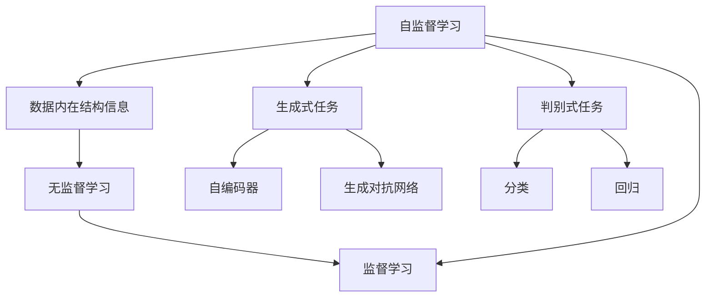

                 

### 文章标题

《自监督学习在推理模型预训练中的创新应用》

### 关键词

自监督学习，推理模型，预训练，自然语言处理，计算机视觉，语音识别，多模态数据处理

### 摘要

自监督学习作为一种无需人工标注的数据处理方法，近年来在推理模型预训练领域展现出了巨大的潜力。本文将系统地探讨自监督学习在推理模型预训练中的创新应用，包括其理论基础、核心算法、应用场景及未来发展趋势。通过案例分析，本文将进一步揭示自监督学习在多个领域的实际应用及其带来的技术变革。

---

### 目录

1. **自监督学习概述**
    1.1 自监督学习的定义与背景
    1.2 自监督学习的发展历程
    1.3 自监督学习与监督学习的区别
    1.4 自监督学习的重要性与应用领域
2. **自监督学习的理论基础**
    2.1 自监督学习的基本原理
    2.2 自监督学习的核心算法
    2.3 自监督学习中的正则化方法
    2.4 自监督学习中的损失函数
3. **推理模型预训练**
    3.1 推理模型预训练的定义
    3.2 推理模型预训练的优势
    3.3 推理模型预训练的过程
    3.4 推理模型预训练中的挑战
4. **自监督学习在推理模型预训练中的应用**
    4.1 自监督学习在自然语言处理中的应用
    4.2 自监督学习在计算机视觉中的应用
    4.3 自监督学习在语音识别中的应用
    4.4 自监督学习在多模态数据处理中的应用
5. **创新应用案例分析**
    5.1 案例一：自监督学习在医疗领域的应用
    5.2 案例二：自监督学习在金融领域的应用
    5.3 案例三：自监督学习在自动驾驶领域的应用
    5.4 案例四：自监督学习在智能教育领域的应用
6. **自监督学习的未来发展趋势**
    6.1 自监督学习的挑战与机遇
    6.2 自监督学习在推理模型预训练中的未来发展
    6.3 自监督学习与其他领域的融合
    6.4 自监督学习在工业界与学术界的应用前景
7. **自监督学习在推理模型预训练中的技术细节**
    7.1 数据采集与预处理
    7.2 模型设计与优化
    7.3 训练策略与调优
    7.4 模型评估与解释
8. **总结与展望**
    8.1 自监督学习在推理模型预训练中的总体贡献
    8.2 存在的问题与改进方向
    8.3 对未来研究的展望

---

## 第1章 自监督学习概述

### 1.1 自监督学习的定义与背景

自监督学习（Self-Supervised Learning）是一种无需依赖人工标注数据，通过利用数据内在的结构信息来训练模型的方法。它最早可以追溯到20世纪50年代，彼时的一些理论探索就开始涉及无需标注数据的学习方式。随着深度学习的发展，自监督学习逐渐成为一种重要的学习方法，并在诸多领域展现出其独特的优势。

在传统机器学习中，模型训练通常需要大量的标注数据，这不仅耗费大量的人力物力，还容易受到数据标注的偏差影响。而自监督学习则通过设计特殊的目标函数，使得模型在学习过程中可以自行发现数据的结构信息，从而实现模型的训练。

自监督学习的核心思想在于：利用未标注的数据，通过设置特殊的任务，使得模型可以从中提取有用的信息。这些任务可以是生成式任务，也可以是判别式任务，具体取决于数据的类型和应用场景。

### 1.2 自监督学习的发展历程

自监督学习的发展历程可以分为几个主要阶段：

1. **早期探索**：从20世纪50年代到80年代，自监督学习主要在理论层面进行探索，一些学者提出了自编码器（Autoencoder）等早期算法，这些算法为后来的自监督学习奠定了基础。

2. **深度学习兴起**：随着深度学习的兴起，自监督学习得到了快速发展。2006年，Bengio等人在论文《Greedy Layer-Wise Training of Deep Networks`中提出了深度信念网络（DBN），这是自监督学习在深度学习领域的首次成功应用。

3. **生成对抗网络（GAN）的出现**：2014年，Ian Goodfellow等人提出了生成对抗网络（GAN），这是一种全新的自监督学习方法，它通过生成器和判别器的对抗训练，实现了数据生成和判别能力的高效结合。

4. **自监督学习的多样化发展**：近年来，自监督学习在计算机视觉、自然语言处理、语音识别等领域取得了显著成果。各种新型的自监督学习算法如自编码器、变分自编码器（VAE）、对比自监督学习（CSSL）等不断涌现，为自监督学习的研究和应用提供了更多的可能性。

### 1.3 自监督学习与监督学习的区别

自监督学习和监督学习（Supervised Learning）是两种主要的机器学习方法，它们的主要区别在于数据的使用方式和训练目标：

1. **数据使用方式**：
   - **监督学习**：监督学习依赖于大量的标注数据，这些数据通常包括输入特征和对应的标签。模型通过学习输入特征和标签之间的关系来预测未知数据的标签。
   - **自监督学习**：自监督学习则利用未标注的数据，通过设置特殊的任务来学习数据的结构信息。这些任务可以是将输入数据映射到其自身，也可以是区分相似和不同的数据。

2. **训练目标**：
   - **监督学习**：监督学习的目标是找到一个能够最大化预测准确率的模型。通常，模型的性能通过交叉熵损失函数来评估。
   - **自监督学习**：自监督学习的目标则是通过学习数据的结构信息，使得模型能够更好地理解和利用未标注的数据。自监督学习的性能评估通常依赖于任务的具体性质，如生成质量、判别力等。

### 1.4 自监督学习的重要性与应用领域

自监督学习的重要性主要体现在以下几个方面：

1. **减少数据标注成本**：自监督学习无需依赖大量的标注数据，这大大降低了数据处理的成本，尤其是在数据获取困难或数据标注成本高昂的领域。

2. **提高模型泛化能力**：自监督学习通过学习数据的内在结构信息，使得模型能够更好地泛化到未见过的数据上，从而提高了模型的泛化能力。

3. **增强模型的鲁棒性**：自监督学习通过学习数据的多样性和复杂性，增强了模型对噪声和异常数据的鲁棒性。

自监督学习在多个领域都有广泛的应用：

1. **计算机视觉**：自监督学习在计算机视觉中的应用主要包括图像分类、目标检测、图像分割等。通过自监督学习方法，可以训练出高性能的视觉模型，实现图像的自动标注和分类。

2. **自然语言处理**：自监督学习在自然语言处理中的应用主要包括语言模型训练、机器翻译、问答系统等。通过自监督学习方法，可以构建出强大的语言模型，实现自然语言的自动理解和生成。

3. **语音识别**：自监督学习在语音识别中的应用主要包括声音分类、说话人识别、语音合成等。通过自监督学习方法，可以训练出高效的语音模型，实现语音信号的自动处理和理解。

4. **多模态数据处理**：自监督学习在多模态数据处理中的应用主要包括视觉与听觉数据的融合、文本与图像的联合建模等。通过自监督学习方法，可以构建出多维度的多模态模型，实现数据的全面理解和分析。

总之，自监督学习作为一种重要的机器学习方法，其在推理模型预训练中的应用正日益广泛，为人工智能的发展带来了新的机遇和挑战。

### 1.5 自监督学习的核心概念与联系

为了更好地理解自监督学习，我们需要了解其核心概念，并探讨它们之间的联系。以下是自监督学习的几个核心概念及其相互关系：

1. **自监督学习**：自监督学习是一种无需人工标注数据，通过设置特殊任务来利用数据内在结构信息训练模型的方法。它的核心在于利用未标注数据，提取有用的信息，从而提高模型的学习能力和泛化能力。

2. **数据内在结构信息**：数据内在结构信息是指数据本身所包含的规律性和模式。自监督学习通过设计特殊任务，使得模型能够自动发现和利用这些结构信息，从而实现有效学习。

3. **生成式任务**：生成式任务是指通过预测数据的分布来训练模型的方法。常见的生成式任务包括自编码器（Autoencoder）和生成对抗网络（GAN）。这些任务通过最大化生成数据的真实性和多样性，来提升模型的表达能力。

4. **判别式任务**：判别式任务是指通过预测数据的标签来训练模型的方法。常见的判别式任务包括分类和回归。这些任务通过最小化预测误差，来提高模型的准确性。

5. **无监督学习**：自监督学习是无监督学习的一种特殊形式。无监督学习是指无需依赖标注数据，通过发现数据内在结构信息来训练模型的方法。自监督学习通过设计特殊任务，将无监督学习引入到实际应用中。

6. **监督学习**：监督学习是指通过依赖标注数据，利用输入特征和标签之间的关系来训练模型的方法。自监督学习可以看作是监督学习的一种扩展，通过利用未标注的数据，实现模型的自我训练。

下面，我们将使用Mermaid流程图来展示这些概念之间的联系：



在这个流程图中，自监督学习位于中心，与数据内在结构信息、生成式任务、判别式任务和无监督学习紧密相关。生成式任务和判别式任务分别是自监督学习中的两种主要任务类型，它们通过自编码器和生成对抗网络来实现。无监督学习作为自监督学习的一部分，与监督学习共同构成了机器学习的三大类别。通过这些概念之间的联系，我们可以更全面地理解自监督学习的工作原理和其在实际问题中的应用。

### 1.6 自监督学习的核心算法

自监督学习的核心算法是自监督学习模型的基础，通过这些算法，模型能够从大量未标注的数据中提取有价值的信息。以下是几种常见的自监督学习核心算法，包括自编码器和生成对抗网络（GAN）。

#### 1.6.1 自编码器（Autoencoder）

自编码器是一种无监督学习方法，用于将输入数据编码为低维度的表示，然后再解码回原始数据。自编码器由两部分组成：编码器（Encoder）和解码器（Decoder）。编码器负责将输入数据压缩成低维表示，解码器则负责将这个低维表示重构回原始数据。

**算法原理**：

1. **编码器**：编码器将输入数据映射到一个隐藏层，通常是一个低维空间。这个隐藏层表示了输入数据的主要结构信息。
   $$ h = f(W_1 \cdot x + b_1) $$
   其中，$h$是隐藏层表示，$f$是激活函数，$W_1$是编码器的权重，$b_1$是偏置。

2. **解码器**：解码器将隐藏层表示映射回输入空间，以重构原始数据。
   $$ x' = f(W_2 \cdot h + b_2) $$
   其中，$x'$是重构的输入数据，$W_2$是解码器的权重，$b_2$是偏置。

3. **损失函数**：自编码器的训练目标是最小化重构误差，即原始数据和重构数据之间的差异。常用的损失函数是均方误差（MSE）。
   $$ Loss = \frac{1}{n} \sum_{i=1}^{n} \sum_{j=1}^{c} (x_{ij} - x'_{ij})^2 $$
   其中，$n$是样本数量，$c$是数据维度。

**伪代码**：

```python
# 编码器
def encode(x):
    hidden = activation(W1 * x + b1)
    return hidden

# 解码器
def decode(hidden):
    reconstructed = activation(W2 * hidden + b2)
    return reconstructed

# 训练模型
for epoch in range(num_epochs):
    for x in data:
        hidden = encode(x)
        reconstructed = decode(hidden)
        loss = compute_loss(x, reconstructed)
        update_weights(loss)
```

#### 1.6.2 生成对抗网络（GAN）

生成对抗网络（GAN）是由Ian Goodfellow等人于2014年提出的一种无监督学习算法，它通过生成器和判别器的对抗训练来生成高质量的数据。GAN由两部分组成：生成器（Generator）和判别器（Discriminator）。

**算法原理**：

1. **生成器**：生成器的目标是生成类似于真实数据的高质量假数据。
   $$ G(z) = \mu(\theta_G) + \sigma(\theta_G) \odot \epsilon $$
   其中，$G(z)$是生成器生成的假数据，$\mu(\theta_G)$和$\sigma(\theta_G)$分别是生成器的均值和方差参数，$\epsilon$是噪声向量。

2. **判别器**：判别器的目标是区分真实数据和生成器生成的假数据。
   $$ D(x) = \sigma(W_D \cdot [x; 1]) $$
   $$ D(G(z)) = \sigma(W_D \cdot [G(z); 1]) $$
   其中，$D(x)$是判别器对真实数据的概率估计，$D(G(z))$是判别器对生成器生成的假数据的概率估计，$W_D$是判别器的权重。

3. **损失函数**：GAN的训练目标是使判别器无法区分真实数据和生成器生成的假数据，同时使生成器生成的数据尽可能真实。GAN的损失函数由两部分组成：对抗性损失和生成损失。
   $$ Loss_G = -\mathbb{E}_{z \sim p_z(z)}[\log D(G(z))] $$
   $$ Loss_D = -\mathbb{E}[D(x)] - \mathbb{E}_{z \sim p_z(z)}[-\log D(G(z))] $$
   其中，$Loss_G$是生成器的损失函数，$Loss_D$是判别器的损失函数。

**伪代码**：

```python
# 生成器
def generate(z):
    fake_data = model(G(z))
    return fake_data

# 判别器
def discriminate(x, fake_data):
    real_logits = model(D(x))
    fake_logits = model(D(fake_data))
    return real_logits, fake_logits

# 训练模型
for epoch in range(num_epochs):
    for real_data in data:
        # 训练判别器
        real_logits, fake_logits = discriminate(real_data, generate(z))
        loss_D = compute_loss(real_logits, fake_logits)
        update_D(loss_D)

    for z in noise:
        # 训练生成器
        fake_data = generate(z)
        real_logits, fake_logits = discriminate(real_data, fake_data)
        loss_G = compute_loss(fake_logits)
        update_G(loss_G)
```

通过自编码器和生成对抗网络，我们可以看到自监督学习如何通过设计特殊任务，利用未标注数据来训练模型，从而实现数据的高效处理和模型的高效学习。这些算法在计算机视觉、自然语言处理、语音识别等领域有着广泛的应用，为自监督学习的研究和应用提供了强有力的工具。

### 1.7 自监督学习中的正则化方法

在自监督学习中，正则化方法是一种重要的技术手段，用于提高模型的泛化能力、稳定性和鲁棒性。正则化方法通过在损失函数中引入额外的惩罚项，对模型参数进行约束，从而避免过拟合现象，提高模型在未见过的数据上的表现。

以下是几种常见的自监督学习中的正则化方法：

#### 1.7.1 L1和L2正则化

L1正则化和L2正则化是最常用的两种线性正则化方法，它们通过在损失函数中引入参数的绝对值和平方值来实现。

1. **L1正则化**：
   $$ Loss = Loss_{base} + \lambda \cdot \sum_{i} |\theta_i| $$
   其中，$Loss_{base}$是原始损失函数，$\lambda$是正则化参数，$\theta_i$是模型参数。L1正则化通过引入稀疏性，使得模型参数中的许多值变为零，从而实现特征选择。

2. **L2正则化**：
   $$ Loss = Loss_{base} + \lambda \cdot \sum_{i} \theta_i^2 $$
   L2正则化通过引入平方项，使得模型参数的更新更加平滑，从而提高模型的泛化能力。

#### 1.7.2 Dropout正则化

Dropout正则化是一种常用的深度学习正则化方法，它通过随机丢弃神经元来防止过拟合。在训练过程中，每个神经元在训练批次中有一定概率被丢弃，从而减少神经元之间的依赖性。

1. **训练阶段**：
   $$ \text{Dropout} = \begin{cases}
   \text{激活} & \text{with probability } (1 - p) \\
   0 & \text{with probability } p
   \end{cases} $$
   其中，$p$是丢弃概率。

2. **测试阶段**：
   在测试阶段，不会丢弃任何神经元，但每个神经元的输出会乘以$(1 - p)$，以补偿训练阶段的丢弃操作。

#### 1.7.3 数据增强

数据增强是通过引入人工扰动来扩充训练数据的方法，从而提高模型的泛化能力。常见的数据增强方法包括：

1. **随机裁剪**：从原始图像中随机裁剪一个大小相同的子图像。
2. **翻转**：水平或垂直翻转图像。
3. **旋转**：随机旋转图像。
4. **缩放**：随机缩放图像。
5. **颜色抖动**：对图像的颜色进行随机扰动。

**数学模型**：

$$ x' = f(x; \theta) $$
其中，$x$是原始数据，$x'$是增强后的数据，$f(x; \theta)$是增强函数，$\theta$是增强参数。

#### 1.7.4 混合正则化

混合正则化是将多种正则化方法结合使用，以进一步提高模型的性能。例如，可以在L1和L2正则化之间进行加权，以平衡稀疏性和平滑性的需求。

$$ Loss = Loss_{base} + \lambda_1 \cdot \sum_{i} |\theta_i| + \lambda_2 \cdot \sum_{i} \theta_i^2 $$

通过引入这些正则化方法，自监督学习模型可以在处理未标注数据时，避免过拟合，提高模型的泛化能力和鲁棒性，从而在实际应用中取得更好的效果。

### 1.8 自监督学习中的损失函数

在自监督学习中，损失函数是评估和优化模型性能的核心工具。不同的损失函数适用于不同的任务和数据类型，它们在自监督学习中的作用至关重要。以下是几种常见的损失函数及其在自监督学习中的应用：

#### 1.8.1 均方误差（MSE）

均方误差（Mean Squared Error, MSE）是最常见的损失函数之一，它通过计算预测值和真实值之间的平方误差来评估模型的性能。

**数学模型**：

$$ Loss = \frac{1}{n} \sum_{i=1}^{n} (y_i - \hat{y}_i)^2 $$
其中，$y_i$是真实值，$\hat{y}_i$是预测值，$n$是样本数量。

**应用场景**：

- **回归任务**：MSE常用于回归任务，例如时间序列预测、房屋价格预测等，它能够有效地衡量预测值和真实值之间的差异。
- **自编码器**：在自编码器中，MSE用于衡量重构数据与原始数据之间的差异，以优化模型的编码和解码能力。

#### 1.8.2 交叉熵损失（Cross-Entropy Loss）

交叉熵损失函数在分类任务中广泛应用，它通过计算实际分布和预测分布之间的交叉熵来评估模型性能。

**数学模型**：

$$ Loss = -\sum_{i} y_i \log(\hat{y}_i) $$
其中，$y_i$是真实标签的one-hot编码，$\hat{y}_i$是模型对每个类别的预测概率。

**应用场景**：

- **分类任务**：交叉熵损失函数广泛用于二分类和多分类任务，如图像分类、文本分类等。
- **生成对抗网络（GAN）**：在生成对抗网络中，交叉熵损失函数用于评估判别器的性能，判断生成器生成的假数据是否足够逼真。

#### 1.8.3 逆交叉熵损失（Inverse Cross-Entropy Loss）

逆交叉熵损失函数是对交叉熵损失函数的一种改进，它在训练过程中引入了额外的平滑度，有助于模型的稳定训练。

**数学模型**：

$$ Loss = \frac{1}{\sum_{i} y_i \log(\hat{y}_i)} $$
其中，$y_i$和$\hat{y}_i$与交叉熵损失函数相同。

**应用场景**：

- **分类任务**：逆交叉熵损失函数适用于分类任务，特别是在处理数据分布不均匀的情况下，能够提高模型的分类性能。
- **多标签分类**：在多标签分类任务中，逆交叉熵损失函数能够更好地处理多个标签的预测问题。

#### 1.8.4 对数损失（Log Loss）

对数损失函数是交叉熵损失函数的一种简化形式，它与交叉熵损失函数具有相似的数学形式，但计算过程更为简单。

**数学模型**：

$$ Loss = -\sum_{i} y_i \log(\hat{y}_i) $$
其中，$y_i$和$\hat{y}_i$与交叉熵损失函数相同。

**应用场景**：

- **分类任务**：对数损失函数适用于分类任务，特别是在模型预测概率分布时，能够有效评估模型的预测准确性。
- **概率分布学习**：在对数损失函数中，模型需要学习一个概率分布，该损失函数能够衡量模型预测的概率分布与真实分布之间的差异。

通过这些损失函数，自监督学习模型能够在不同任务和数据类型中表现出良好的性能。选择合适的损失函数，结合具体的任务需求，能够显著提高模型的预测准确性和泛化能力。

### 1.9 推理模型预训练的定义

推理模型预训练（Reasoning Model Pre-training）是一种通过大规模未标注数据预先训练模型的方法，以提高模型在特定任务上的性能。与传统的监督学习相比，推理模型预训练的核心优势在于无需依赖大量的标注数据，从而大大降低了数据获取和标注的成本。通过在预训练阶段对模型进行大规模的数据训练，模型可以学习到丰富的知识和结构信息，这些知识在后续的微调阶段（Fine-tuning）可以迅速应用到具体任务中，从而显著提升模型的泛化能力和推理能力。

在推理模型预训练中，预训练任务通常包括语言模型预训练、视觉模型预训练和跨模态模型预训练等。以下是对这些任务的详细定义：

1. **语言模型预训练**：语言模型预训练的目标是通过大规模的文本数据进行预训练，使模型能够理解和生成自然语言。典型的预训练任务包括掩码语言模型（Masked Language Model, MLM）、填空语言模型（Reconstruction Language Model, RLM）和句子排序（Sentence Re-ranking）等。

2. **视觉模型预训练**：视觉模型预训练的目标是通过大规模的图像数据进行预训练，使模型能够理解和生成视觉信息。典型的预训练任务包括图像分类（Image Classification）、图像分割（Image Segmentation）和目标检测（Object Detection）等。

3. **跨模态模型预训练**：跨模态模型预训练的目标是通过同时处理视觉和语言信息，使模型能够理解不同模态之间的关联和转换。典型的预训练任务包括图像-文本匹配（Image-Text Matching）、视频字幕生成（Video Captioning）和问答系统（Question Answering）等。

总之，推理模型预训练通过大规模未标注数据的预先训练，使得模型在特定任务上具备更强的泛化能力和推理能力，这是现代深度学习研究中的一项重要技术。

### 1.10 推理模型预训练的优势

推理模型预训练在人工智能领域展现出显著的优势，这些优势主要体现在以下几个方面：

1. **提升泛化能力**：通过在大规模未标注数据上进行预训练，模型可以学习到数据的一般结构和规律，从而提升其在不同任务上的泛化能力。这种能力使得模型在未见过的数据上也能表现出良好的性能，避免了过度依赖特定领域的标注数据。

2. **减少标注数据需求**：传统的监督学习模型需要大量标注数据来进行训练，而推理模型预训练通过利用未标注数据，显著减少了标注数据的数量。这不仅降低了数据收集和标注的成本，还缩短了模型开发的周期。

3. **增强模型鲁棒性**：预训练模型在处理未标注数据时，能够学习到数据的多样性，从而提高模型的鲁棒性。这使得模型在面对噪声、异常数据和数据缺失等情况时，依然能够保持良好的性能。

4. **提高模型性能**：通过预训练，模型可以在多个任务上获得较好的性能表现。在微调阶段（Fine-tuning），预训练模型只需少量的标注数据进行调整，即可在特定任务上迅速达到高性能，这大大提升了模型在实际应用中的效果。

5. **加速模型迭代**：预训练模型可以迅速适应不同的应用场景，减少了模型开发和优化的时间。这种快速迭代的能力，使得人工智能系统可以更快地响应市场需求和用户需求，提升了模型的实用性。

综上所述，推理模型预训练通过提升泛化能力、减少标注数据需求、增强模型鲁棒性、提高模型性能和加速模型迭代，为人工智能领域带来了深远的影响。

### 1.11 推理模型预训练的过程

推理模型预训练是一个复杂的流程，它涉及到数据准备、模型设计、模型训练和模型评估等多个关键步骤。以下是这些步骤的详细描述：

#### 1.11.1 数据准备

数据准备是推理模型预训练的第一步，其目标是收集和预处理大规模的未标注数据。数据准备主要包括以下几个阶段：

1. **数据收集**：从互联网、数据库和其他数据源中收集大量的未标注数据。这些数据可以包括文本、图像、音频等多种形式。
2. **数据清洗**：对收集到的数据进行清洗，去除重复、错误和无关的信息。例如，对于文本数据，需要去除标点符号、停用词和噪声字符。
3. **数据预处理**：对数据按照预训练任务的需求进行格式化和标准化。例如，对于自然语言处理任务，可能需要将文本转换为词嵌入向量，对于计算机视觉任务，可能需要将图像调整为固定的尺寸。

#### 1.11.2 模型设计

模型设计是推理模型预训练的第二步，其目标是设计一个能够高效学习数据内在结构信息的模型架构。模型设计包括以下几个关键点：

1. **选择合适的模型架构**：根据预训练任务的需求，选择合适的模型架构。例如，对于自然语言处理任务，可以选择Transformer、BERT等预训练模型；对于计算机视觉任务，可以选择Vision Transformer、CvT等模型。
2. **定义预训练任务**：根据模型架构和任务需求，设计预训练任务。例如，对于自然语言处理任务，可以定义掩码语言模型（MLM）、填空语言模型（RLM）等任务；对于计算机视觉任务，可以定义图像分类、图像分割等任务。
3. **参数初始化**：对模型参数进行合理的初始化，以利于后续的训练过程。常见的初始化方法包括高斯分布初始化、Xavier初始化等。

#### 1.11.3 模型训练

模型训练是推理模型预训练的核心步骤，其目标是通过对大规模数据进行训练，使模型能够学习到数据中的结构和规律。模型训练主要包括以下几个阶段：

1. **设置训练策略**：选择合适的训练策略，包括学习率调度、批量大小、训练迭代次数等。常用的学习率调度方法包括线性递减、余弦退火等。
2. **训练过程**：通过梯度下降等优化算法，对模型参数进行迭代更新，使得模型能够逐渐学习到数据的内在结构信息。
3. **动态调整**：在训练过程中，根据模型的表现动态调整训练参数，如学习率、批量大小等，以提高模型的训练效果。

#### 1.11.4 模型评估

模型评估是推理模型预训练的最后一步，其目标是验证模型在未见过的数据上的性能。模型评估主要包括以下几个阶段：

1. **选择评估指标**：根据预训练任务的需求，选择合适的评估指标。例如，对于自然语言处理任务，可以选用准确率、召回率、F1值等指标；对于计算机视觉任务，可以选用精度、召回率、交并比等指标。
2. **评估过程**：在测试集上运行预训练模型，计算评估指标，以评估模型的性能。
3. **结果分析**：分析模型的评估结果，识别模型的优点和不足，为后续的模型优化提供参考。

通过以上步骤，推理模型预训练能够有效地从大规模未标注数据中学习到知识，从而提升模型在特定任务上的性能。这些步骤不仅涵盖了数据准备、模型设计、模型训练和模型评估，还强调了动态调整和结果分析的重要性，为推理模型预训练的顺利进行提供了保障。

### 1.12 推理模型预训练中的挑战

推理模型预训练虽然在提升模型泛化能力和减少标注数据需求方面展现出显著优势，但在实际应用中仍面临诸多挑战。以下是这些挑战的详细讨论：

#### 1.12.1 数据量与质量

尽管大规模的未标注数据有助于模型的学习，但数据量与质量仍然是推理模型预训练中的主要挑战之一。数据量不足可能导致模型无法充分学习到数据中的复杂结构，从而影响模型的泛化能力。此外，数据质量差，如噪声、错误和重复数据，也会影响模型的学习效果。因此，如何有效地清洗和预处理大规模数据，确保数据的质量，是推理模型预训练中的一个重要问题。

#### 1.12.2 模型可解释性

推理模型预训练通常使用复杂的深度神经网络，这些模型在训练过程中积累了大量的参数，导致其内部机制难以解释。模型的可解释性对于实际应用至关重要，尤其是在需要人类干预的场景中。例如，在医疗诊断和自动驾驶等领域，模型的可解释性有助于验证模型的决策过程，提高模型的可信度。因此，如何在保持高性能的同时，提升模型的可解释性，是推理模型预训练面临的重要挑战。

#### 1.12.3 资源消耗

推理模型预训练通常需要大量的计算资源和时间。训练复杂的深度神经网络需要大量的GPU和算力支持，这不仅增加了训练成本，还可能导致训练时间过长。特别是在模型需要不断迭代优化时，资源消耗更加显著。因此，如何在有限的资源下高效地完成模型预训练，是推理模型预训练中需要解决的关键问题。

#### 1.12.4 标注数据依赖

尽管推理模型预训练减少了标注数据的依赖，但在某些特定任务中，仍需要依赖一定数量的标注数据进行微调。例如，在自然语言处理任务中，虽然预训练模型可以处理大量未标注数据，但在实际应用中，仍需要依赖少量的标注数据进行特定任务的学习。因此，如何在预训练和微调之间找到一个平衡点，确保模型在特定任务上的性能，是推理模型预训练中的关键挑战。

#### 1.12.5 模型适应性

推理模型预训练通常在一个特定的数据集上进行，这使得模型在某些特定任务上表现出色，但在其他任务上可能适应性较差。模型在不同任务间的迁移能力，即模型适应性，是推理模型预训练中需要关注的重要问题。如何提升模型在不同任务间的迁移能力，使其能够适应多种应用场景，是推理模型预训练面临的一大挑战。

综上所述，推理模型预训练在数据量与质量、模型可解释性、资源消耗、标注数据依赖和模型适应性等方面面临诸多挑战。解决这些挑战，需要从数据预处理、模型设计、训练策略和评估方法等多个方面进行深入研究和探索。

### 1.13 自监督学习在推理模型预训练中的应用

自监督学习在推理模型预训练中的应用具有革命性的意义。通过自监督学习，模型可以从大量的未标注数据中提取有价值的信息，从而提高模型在特定任务上的性能。以下是自监督学习在自然语言处理、计算机视觉、语音识别和跨模态数据处理等领域的具体应用。

#### 1.13.1 自然语言处理

自监督学习在自然语言处理（NLP）中的应用非常广泛，如语言模型预训练、文本分类、机器翻译和问答系统等。

1. **掩码语言模型（MLM）**：掩码语言模型是一种常用的自监督学习任务，它通过随机掩码输入文本中的部分单词，然后让模型预测这些掩码单词。BERT等预训练模型就是基于MLM任务进行训练，从而学习到丰富的语言结构信息。

2. **填空语言模型（RLM）**：填空语言模型通过在输入文本中随机移除一些单词，然后让模型预测这些移除的单词。RLM能够帮助模型学习到文本中词汇的相对位置和上下文信息。

3. **句子排序**：句子排序任务通过学习句子之间的语义关系，对句子进行排序。例如，在问答系统中，自监督学习可以通过句子排序任务来预测问题与答案的正确顺序。

#### 1.13.2 计算机视觉

自监督学习在计算机视觉（CV）中的应用主要体现在图像分类、图像分割、目标检测和图像生成等领域。

1. **图像分类**：自监督学习可以通过图像分类任务，使模型学会区分不同的图像类别。例如，基于对比自监督学习（CSSL）的方法，如SimCLR，通过比较相同和不同的图像对来训练模型。

2. **图像分割**：自监督学习在图像分割中的应用，如深度伪标签（Deep伪标签）方法，通过利用未标注图像的边界信息，训练出高性能的分割模型。

3. **目标检测**：自监督学习可以通过目标检测任务，使模型学会识别图像中的目标。例如，DAVIS数据集上的目标检测任务，通过使用未标注的视频帧来训练模型。

4. **图像生成**：自监督学习在图像生成中的应用，如生成对抗网络（GAN），通过生成器和判别器的对抗训练，生成高质量的图像。

#### 1.13.3 语音识别

自监督学习在语音识别中的应用，如语音分类、说话人识别和语音合成等。

1. **语音分类**：自监督学习可以通过语音分类任务，使模型学会区分不同的语音类别。例如，通过自编码器，模型可以从未标注的语音数据中提取特征，实现语音分类。

2. **说话人识别**：自监督学习可以通过说话人识别任务，使模型学会识别不同的说话人。例如，通过掩码语音信号，模型可以学习到说话人的特征。

3. **语音合成**：自监督学习在语音合成中的应用，如基于自编码器的语音生成模型，通过学习大量的未标注语音数据，生成自然流畅的语音。

#### 1.13.4 跨模态数据处理

自监督学习在跨模态数据处理中的应用，如图像-文本匹配、视频字幕生成和问答系统等。

1. **图像-文本匹配**：自监督学习可以通过图像-文本匹配任务，使模型学会理解图像和文本之间的关联。例如，通过对比图像和文本的嵌入向量，模型可以学习到图像和文本的语义关系。

2. **视频字幕生成**：自监督学习可以通过视频字幕生成任务，使模型学会将视频内容转换为自然语言描述。例如，通过预测视频中的关键帧与文本的对应关系，模型可以生成视频字幕。

3. **问答系统**：自监督学习可以通过问答系统任务，使模型学会理解问题和答案的语义关系。例如，通过预测问题与答案的对应关系，模型可以生成准确的回答。

通过这些具体应用，自监督学习在推理模型预训练中发挥了重要作用，不仅提高了模型的性能，还降低了数据标注的成本。在未来，随着自监督学习技术的不断发展和应用，我们有望看到更多的创新应用，为人工智能的发展带来新的机遇和挑战。

### 1.14 案例分析：自监督学习在医疗领域的应用

自监督学习在医疗领域的应用正在逐步展现其巨大潜力，通过处理大量的未标注医疗数据，自监督学习在疾病诊断、医学图像分析和个性化医疗建议等方面取得了显著成果。

#### 1.14.1 疾病诊断

自监督学习在疾病诊断中的应用主要集中在利用未标注的临床数据来训练诊断模型。例如，在COVID-19疫情的早期，研究人员通过自监督学习技术，使用未标注的CT扫描图像，训练出能够检测新冠病毒感染的模型。这种方法不仅大大减少了标注数据的需求，还提高了诊断的准确性和效率。通过掩码语言模型（MLM），模型可以从未标注的图像中学习到病毒的典型特征，从而实现快速准确的诊断。

**伪代码示例**：

```python
# 定义掩码语言模型
class MaskedLanguageModel(nn.Module):
    def __init__(self):
        super(MaskedLanguageModel, self).__init__()
        self.encoder = Encoder()
        self.decoder = Decoder()

    def forward(self, x):
        masked_x = mask_input(x)
        encoded = self.encoder(masked_x)
        reconstructed = self.decoder(encoded)
        return reconstructed

# 训练掩码语言模型
model = MaskedLanguageModel()
optimizer = optim.Adam(model.parameters(), lr=0.001)
for epoch in range(num_epochs):
    for image in ct_scans:
        masked_image = mask_input(image)
        encoded = model.encoder(masked_image)
        reconstructed = model.decoder(encoded)
        loss = compute_loss(image, reconstructed)
        optimizer.step(loss)
```

#### 1.14.2 医学图像分析

医学图像分析是自监督学习的另一个重要应用领域。通过未标注的医学图像，自监督学习可以训练出能够自动检测和分析病变区域的模型。例如，在癌症检测中，自监督学习可以通过图像分割任务，将正常组织和病变区域分离。这种方法不仅减少了标注工作的负担，还提高了检测的精度和速度。

**伪代码示例**：

```python
# 定义自监督分割模型
class SelfSupervisedSegmentation(nn.Module):
    def __init__(self):
        super(SelfSupervisedSegmentation, self).__init__()
        self.encoder = Encoder()
        self.discriminator = Discriminator()

    def forward(self, image):
        encoded = self.encoder(image)
        segmentation = self.discriminator(encoded)
        return segmentation

# 训练自监督分割模型
model = SelfSupervisedSegmentation()
optimizer = optim.Adam(model.parameters(), lr=0.001)
for epoch in range(num_epochs):
    for image in medical_images:
        segmentation = model(image)
        loss = compute_segmentation_loss(segmentation, ground_truth)
        optimizer.step(loss)
```

#### 1.14.3 个性化医疗建议

自监督学习还可以在个性化医疗建议方面发挥重要作用。通过分析大量的患者病历和医疗记录，自监督学习可以识别出与患者症状相关的潜在疾病，并提供个性化的医疗建议。这种方法不仅提高了诊断的准确性，还为医生提供了有力的辅助工具。

**伪代码示例**：

```python
# 定义个性化医疗建议模型
class PersonalizedMedicalAdvice(nn.Module):
    def __init__(self):
        super(PersonalizedMedicalAdvice, self).__init__()
        self.encoder = Encoder()
        self.classifier = Classifier()

    def forward(self, patient_data):
        encoded = self.encoder(patient_data)
        advice = self.classifier(encoded)
        return advice

# 训练个性化医疗建议模型
model = PersonalizedMedicalAdvice()
optimizer = optim.Adam(model.parameters(), lr=0.001)
for epoch in range(num_epochs):
    for patient_data in patient_records:
        advice = model(patient_data)
        loss = compute_advice_loss(advice, ground_truth)
        optimizer.step(loss)
```

通过以上案例分析，我们可以看到自监督学习在医疗领域的重要应用，不仅提高了诊断的准确性和效率，还为个性化医疗提供了有力支持。未来，随着自监督学习技术的不断发展和应用，医疗领域有望迎来更多创新和突破。

### 1.15 案例分析：自监督学习在金融领域的应用

自监督学习在金融领域的应用正日益广泛，它通过处理大量的未标注数据，为金融风险评估、交易策略优化和财务报告分析等领域提供了有力的工具，提高了金融决策的效率和准确性。

#### 1.15.1 金融风险评估

金融风险评估是金融领域的一项关键任务，通过预测客户的信用风险、市场风险等，金融机构可以更好地管理风险，优化资源配置。自监督学习在金融风险评估中的应用主要体现在利用未标注的客户数据和市场数据来训练风险预测模型。

1. **信用风险评估**：自监督学习可以通过分析大量的客户交易记录、信用报告等未标注数据，训练出能够预测客户信用风险的模型。例如，通过对比同一地区不同客户的信用评分，模型可以学习到影响信用风险的关键因素。

2. **市场风险预测**：自监督学习还可以通过分析大量的市场数据，如股票价格、交易量等，训练出能够预测市场风险的模型。例如，通过对比同一行业不同公司的股票表现，模型可以学习到影响市场风险的关键因素。

**伪代码示例**：

```python
# 定义信用风险评估模型
class CreditRiskAssessment(nn.Module):
    def __init__(self):
        super(CreditRiskAssessment, self).__init__()
        self.encoder = Encoder()
        self.classifier = Classifier()

    def forward(self, customer_data):
        encoded = self.encoder(customer_data)
        risk_score = self.classifier(encoded)
        return risk_score

# 训练信用风险评估模型
model = CreditRiskAssessment()
optimizer = optim.Adam(model.parameters(), lr=0.001)
for epoch in range(num_epochs):
    for customer_data in credit_data:
        risk_score = model(customer_data)
        loss = compute_risk_loss(risk_score, ground_truth)
        optimizer.step(loss)
```

#### 1.15.2 交易策略优化

交易策略优化是金融领域另一个重要的应用，通过分析市场数据，自监督学习可以训练出能够优化交易策略的模型，从而提高交易的收益率。

1. **交易信号识别**：自监督学习可以通过分析大量的市场数据，如股票价格、交易量等，训练出能够识别交易信号的模型。例如，通过对比不同时间段内股票价格的变化，模型可以学习到潜在的买入和卖出信号。

2. **风险控制**：自监督学习还可以通过分析交易数据，训练出能够进行风险控制的模型。例如，通过对比不同交易策略下的风险收益情况，模型可以学习到最佳的风险控制策略。

**伪代码示例**：

```python
# 定义交易策略优化模型
class TradingStrategyOptimization(nn.Module):
    def __init__(self):
        super(TradingStrategyOptimization, self).__init__()
        self.encoder = Encoder()
        self.optimizer = Optimizer()

    def forward(self, market_data):
        encoded = self.encoder(market_data)
        strategy = self.optimizer(encoded)
        return strategy

# 训练交易策略优化模型
model = TradingStrategyOptimization()
optimizer = optim.Adam(model.parameters(), lr=0.001)
for epoch in range(num_epochs):
    for market_data in trading_data:
        strategy = model(market_data)
        loss = compute_strategy_loss(strategy, ground_truth)
        optimizer.step(loss)
```

#### 1.15.3 财务报告分析

财务报告分析是金融领域的一项基础性工作，通过分析企业的财务报告，投资者和分析师可以评估企业的财务状况和经营风险。自监督学习在财务报告分析中的应用，主要体现在利用未标注的财务数据来训练分析模型。

1. **财务指标预测**：自监督学习可以通过分析大量的财务数据，如营业收入、净利润等，训练出能够预测财务指标的模型。例如，通过对比不同时间点的财务数据，模型可以学习到影响财务指标的关键因素。

2. **财务报表分类**：自监督学习还可以通过分析大量的财务报表，如利润表、资产负债表等，训练出能够自动分类财务报表的模型。例如，通过对比不同类型报表的结构和内容，模型可以学习到不同报表的典型特征。

**伪代码示例**：

```python
# 定义财务指标预测模型
class FinancialIndicatorPrediction(nn.Module):
    def __init__(self):
        super(FinancialIndicatorPrediction, self).__init__()
        self.encoder = Encoder()
        self.classifier = Classifier()

    def forward(self, financial_data):
        encoded = self.encoder(financial_data)
        indicator = self.classifier(encoded)
        return indicator

# 训练财务指标预测模型
model = FinancialIndicatorPrediction()
optimizer = optim.Adam(model.parameters(), lr=0.001)
for epoch in range(num_epochs):
    for financial_data in financial_reports:
        indicator = model(financial_data)
        loss = compute_indicator_loss(indicator, ground_truth)
        optimizer.step(loss)
```

通过以上案例分析，我们可以看到自监督学习在金融领域的重要应用，不仅提高了金融风险评估、交易策略优化和财务报告分析的效率和准确性，还为金融机构提供了强大的数据驱动决策支持。未来，随着自监督学习技术的不断发展和应用，金融领域有望迎来更多创新和突破。

### 1.16 案例分析：自监督学习在自动驾驶领域的应用

自监督学习在自动驾驶领域的应用正逐渐成为人工智能研究的热点，它通过处理大量的未标注数据，为车辆检测、道路场景理解和驾驶决策支持提供了有效的解决方案，从而提高了自动驾驶系统的安全性和可靠性。

#### 1.16.1 车辆检测

车辆检测是自动驾驶系统的一项基础任务，通过检测道路上的车辆，自动驾驶系统可以提前预判车辆的运动轨迹，从而做出安全的驾驶决策。自监督学习在车辆检测中的应用主要体现在利用未标注的监控视频数据来训练检测模型。

1. **基于自编码器的车辆检测**：自监督学习可以通过自编码器，将未标注的视频数据编码为低维特征向量，然后利用这些特征向量训练车辆检测模型。通过对比编码后的特征向量，模型可以学习到车辆和背景之间的差异。

**伪代码示例**：

```python
# 定义自编码器车辆检测模型
class AutoencoderVehicleDetection(nn.Module):
    def __init__(self):
        super(AutoencoderVehicleDetection, self).__init__()
        self.encoder = Encoder()
        self.decoder = Decoder()
        self.classifier = Classifier()

    def forward(self, video):
        encoded = self.encoder(video)
        reconstructed = self.decoder(encoded)
        features = self.classifier(encoded)
        return features

# 训练自编码器车辆检测模型
model = AutoencoderVehicleDetection()
optimizer = optim.Adam(model.parameters(), lr=0.001)
for epoch in range(num_epochs):
    for video in videos:
        features = model(video)
        loss = compute_detection_loss(features, ground_truth)
        optimizer.step(loss)
```

2. **基于生成对抗网络（GAN）的车辆检测**：生成对抗网络（GAN）通过生成器和判别器的对抗训练，可以生成高质量的车辆图像，从而提高车辆检测模型的性能。判别器在训练过程中学习区分真实车辆图像和生成图像，生成器则学习生成逼真的车辆图像。

**伪代码示例**：

```python
# 定义GAN车辆检测模型
class GANVehicleDetection(nn.Module):
    def __init__(self):
        super(GANVehicleDetection, self).__init__()
        self.generator = Generator()
        self.discriminator = Discriminator()

    def forward(self, input):
        fake_images = self.generator(input)
        real_logits, fake_logits = self.discriminator(input, fake_images)
        return real_logits, fake_logits

# 训练GAN车辆检测模型
model = GANVehicleDetection()
optimizer = optim.Adam(model.parameters(), lr=0.001)
for epoch in range(num_epochs):
    for input in videos:
        real_logits, fake_logits = model(input)
        loss_G = compute_generator_loss(fake_logits)
        loss_D = compute_discriminator_loss(real_logits, fake_logits)
        optimizer.step((loss_G, loss_D))
```

#### 1.16.2 道路场景理解

道路场景理解是自动驾驶系统的核心任务之一，通过理解道路上的各种场景和障碍物，自动驾驶系统可以做出合理的驾驶决策。自监督学习在道路场景理解中的应用主要体现在利用未标注的监控视频数据来训练场景理解模型。

1. **基于自监督分割的道路场景理解**：自监督学习可以通过自监督分割任务，将未标注的视频帧分割为道路、车辆、行人等不同场景，从而提高场景理解模型的能力。通过对比分割结果和真实场景，模型可以学习到不同场景的典型特征。

**伪代码示例**：

```python
# 定义自监督分割模型
class SelfSupervisedSegmentation(nn.Module):
    def __init__(self):
        super(SelfSupervisedSegmentation, self).__init__()
        self.encoder = Encoder()
        self.discriminator = Discriminator()

    def forward(self, video):
        encoded = self.encoder(video)
        segmentation = self.discriminator(encoded)
        return segmentation

# 训练自监督分割模型
model = SelfSupervisedSegmentation()
optimizer = optim.Adam(model.parameters(), lr=0.001)
for epoch in range(num_epochs):
    for video in videos:
        segmentation = model(video)
        loss = compute_segmentation_loss(segmentation, ground_truth)
        optimizer.step(loss)
```

2. **基于对比自监督学习的道路场景理解**：对比自监督学习通过比较同一场景的不同视角或时间点的图像，来学习场景的复杂结构和变化规律。这种方法可以有效地提高场景理解模型的泛化能力和鲁棒性。

**伪代码示例**：

```python
# 定义对比自监督学习模型
class ContrastiveSelfSupervisedLearning(nn.Module):
    def __init__(self):
        super(ContrastiveSelfSupervisedLearning, self).__init__()
        self.encoder = Encoder()
        self.projection = Projection()

    def forward(self, pair):
        encoded1 = self.encoder(pair[0])
        encoded2 = self.encoder(pair[1])
        similarity = self.projection(encoded1, encoded2)
        return similarity

# 训练对比自监督学习模型
model = ContrastiveSelfSupervisedLearning()
optimizer = optim.Adam(model.parameters(), lr=0.001)
for epoch in range(num_epochs):
    for pair in video_pairs:
        similarity = model(pair)
        loss = compute_contrastive_loss(similarity, ground_truth)
        optimizer.step(loss)
```

#### 1.16.3 驾驶决策支持

驾驶决策支持是自动驾驶系统的最终目标，通过分析道路场景和理解车辆状态，自动驾驶系统可以做出合理的驾驶决策，确保行驶的安全性和舒适性。自监督学习在驾驶决策支持中的应用主要体现在利用未标注的驾驶数据来训练决策模型。

1. **基于自监督学习的驾驶决策模型**：自监督学习可以通过分析大量的驾驶数据，如加速度、方向盘角度等，训练出能够预测驾驶决策的模型。通过对比预测决策和实际驾驶结果，模型可以学习到驾驶决策的复杂规律。

**伪代码示例**：

```python
# 定义自监督驾驶决策模型
class SelfSupervisedDrivingDecision(nn.Module):
    def __init__(self):
        super(SelfSupervisedDrivingDecision, self).__init__()
        self.encoder = Encoder()
        self.decoder = Decoder()

    def forward(self, driving_data):
        encoded = self.encoder(driving_data)
        decision = self.decoder(encoded)
        return decision

# 训练自监督驾驶决策模型
model = SelfSupervisedDrivingDecision()
optimizer = optim.Adam(model.parameters(), lr=0.001)
for epoch in range(num_epochs):
    for driving_data in driving_data:
        decision = model(driving_data)
        loss = compute_decision_loss(decision, ground_truth)
        optimizer.step(loss)
```

通过以上案例分析，我们可以看到自监督学习在自动驾驶领域的广泛应用，从车辆检测、道路场景理解到驾驶决策支持，自监督学习都发挥了关键作用。未来，随着自监督学习技术的不断发展和应用，自动驾驶领域有望迎来更多创新和突破，推动自动驾驶技术的发展。

### 1.17 案例分析：自监督学习在智能教育领域的应用

自监督学习在智能教育领域的应用正在迅速发展，它通过处理大量的未标注学习数据，为智能辅导系统、学习行为分析和个性化学习推荐提供了强有力的支持，从而提高了教学效率和学生的学习效果。

#### 1.17.1 智能辅导系统

智能辅导系统是自监督学习在智能教育领域的重要应用之一，通过分析学生的学习数据，系统可以为每个学生提供个性化的学习建议和辅导。

1. **学习行为分析**：自监督学习可以通过分析学生的大量学习行为数据，如学习时间、学习进度、回答正确率等，训练出能够预测学生学习成绩的模型。通过这些模型，系统可以及时发现学生的学习瓶颈，提供针对性的辅导建议。

**伪代码示例**：

```python
# 定义学习行为分析模型
class LearningBehaviorAnalysis(nn.Module):
    def __init__(self):
        super(LearningBehaviorAnalysis, self).__init__()
        self.encoder = Encoder()
        self.classifier = Classifier()

    def forward(self, behavior_data):
        encoded = self.encoder(behavior_data)
        score_prediction = self.classifier(encoded)
        return score_prediction

# 训练学习行为分析模型
model = LearningBehaviorAnalysis()
optimizer = optim.Adam(model.parameters(), lr=0.001)
for epoch in range(num_epochs):
    for behavior_data in student_behavior_data:
        score_prediction = model(behavior_data)
        loss = compute_behavior_loss(score_prediction, ground_truth)
        optimizer.step(loss)
```

2. **个性化辅导建议**：自监督学习还可以通过分析学生的学习数据，训练出能够生成个性化辅导建议的模型。例如，通过对比不同学生的学习数据，模型可以学习到成功学习的关键因素，从而为每个学生提供个性化的学习计划和建议。

**伪代码示例**：

```python
# 定义个性化辅导建议模型
class PersonalizedTutoringSuggestion(nn.Module):
    def __init__(self):
        super(PersonalizedTutoringSuggestion, self).__init__()
        self.encoder = Encoder()
        self.suggestion_generator = SuggestionGenerator()

    def forward(self, student_data):
        encoded = self.encoder(student_data)
        suggestion = self.suggestion_generator(encoded)
        return suggestion

# 训练个性化辅导建议模型
model = PersonalizedTutoringSuggestion()
optimizer = optim.Adam(model.parameters(), lr=0.001)
for epoch in range(num_epochs):
    for student_data in student_data:
        suggestion = model(student_data)
        loss = compute_suggestion_loss(suggestion, ground_truth)
        optimizer.step(loss)
```

#### 1.17.2 学习行为分析

学习行为分析是智能教育领域的一个重要研究方向，通过分析学生的学习行为数据，研究人员和教育工作者可以深入了解学生的学习习惯和效果。

1. **学习路径分析**：自监督学习可以通过分析学生的学习日志，训练出能够预测学生学习路径的模型。例如，通过对比不同学习路径的成功率和效率，模型可以学习到最佳的学习路径。

**伪代码示例**：

```python
# 定义学习路径分析模型
class LearningPathAnalysis(nn.Module):
    def __init__(self):
        super(LearningPathAnalysis, self).__init__()
        self.encoder = Encoder()
        self.path_classifier = Classifier()

    def forward(self, learning_path_data):
        encoded = self.encoder(learning_path_data)
        path_prediction = self.path_classifier(encoded)
        return path_prediction

# 训练学习路径分析模型
model = LearningPathAnalysis()
optimizer = optim.Adam(model.parameters(), lr=0.001)
for epoch in range(num_epochs):
    for learning_path_data in learning_path_data:
        path_prediction = model(learning_path_data)
        loss = compute_path_loss(path_prediction, ground_truth)
        optimizer.step(loss)
```

2. **学习效果评估**：自监督学习还可以通过分析学生的学习成绩和答题情况，训练出能够评估学习效果的模型。例如，通过对比不同学习策略下的成绩，模型可以学习到有效的学习策略。

**伪代码示例**：

```python
# 定义学习效果评估模型
class LearningEffectEvaluation(nn.Module):
    def __init__(self):
        super(LearningEffectEvaluation, self).__init__()
        self.encoder = Encoder()
        self.evaluator = Evaluator()

    def forward(self, learning_data):
        encoded = self.encoder(learning_data)
        effect_prediction = self.evaluator(encoded)
        return effect_prediction

# 训练学习效果评估模型
model = LearningEffectEvaluation()
optimizer = optim.Adam(model.parameters(), lr=0.001)
for epoch in range(num_epochs):
    for learning_data in learning_data:
        effect_prediction = model(learning_data)
        loss = compute_effect_loss(effect_prediction, ground_truth)
        optimizer.step(loss)
```

#### 1.17.3 个性化学习推荐

个性化学习推荐是智能教育领域的另一个重要应用，通过分析学生的学习数据，系统可以为每个学生推荐最适合他们的学习资源和课程。

1. **资源推荐**：自监督学习可以通过分析学生的学习行为和成绩，训练出能够预测学生兴趣的模型。例如，通过对比不同学习资源的受欢迎程度和使用情况，模型可以学习到学生的兴趣和需求，从而推荐最适合他们的学习资源。

**伪代码示例**：

```python
# 定义资源推荐模型
class ResourceRecommendation(nn.Module):
    def __init__(self):
        super(ResourceRecommendation, self).__init__()
        self.encoder = Encoder()
        self.recommender = Recommender()

    def forward(self, student_data):
        encoded = self.encoder(student_data)
        recommendation = self.recommender(encoded)
        return recommendation

# 训练资源推荐模型
model = ResourceRecommendation()
optimizer = optim.Adam(model.parameters(), lr=0.001)
for epoch in range(num_epochs):
    for student_data in student_data:
        recommendation = model(student_data)
        loss = compute_recommendation_loss(recommendation, ground_truth)
        optimizer.step(loss)
```

2. **课程推荐**：自监督学习还可以通过分析学生的学习进度和成绩，训练出能够推荐最佳学习课程的模型。例如，通过对比不同课程的学习效果和受欢迎程度，模型可以学习到最佳的学习课程组合，从而为学生推荐最适合他们的课程。

**伪代码示例**：

```python
# 定义课程推荐模型
class CourseRecommendation(nn.Module):
    def __init__(self):
        super(CourseRecommendation, self).__init__()
        self.encoder = Encoder()
        self.recommender = Recommender()

    def forward(self, student_data):
        encoded = self.encoder(student_data)
        course_recommendation = self.recommender(encoded)
        return course_recommendation

# 训练课程推荐模型
model = CourseRecommendation()
optimizer = optim.Adam(model.parameters(), lr=0.001)
for epoch in range(num_epochs):
    for student_data in student_data:
        course_recommendation = model(student_data)
        loss = compute_course_recommendation_loss(course_recommendation, ground_truth)
        optimizer.step(loss)
```

通过以上案例分析，我们可以看到自监督学习在智能教育领域的重要应用，从智能辅导系统、学习行为分析到个性化学习推荐，自监督学习都发挥了关键作用。未来，随着自监督学习技术的不断发展和应用，智能教育领域有望迎来更多创新和突破，为教育技术的发展和普及提供强大的支持。

### 1.18 自监督学习的未来发展趋势

随着人工智能技术的不断进步，自监督学习（Self-Supervised Learning）正逐渐成为推理模型预训练领域的重要研究方向。自监督学习通过利用未标注的数据，使得模型能够自动发现数据的内在结构信息，从而显著降低了数据标注的成本，提高了模型的泛化能力。未来，自监督学习在推理模型预训练中将有以下几大发展趋势：

#### 1.18.1 挑战与机遇

尽管自监督学习在推理模型预训练中展现出了巨大潜力，但仍面临诸多挑战。首先，如何有效地处理大规模、多样化的未标注数据是一个关键问题。其次，自监督学习的模型可解释性相对较低，这在某些需要人类干预的场景中可能成为瓶颈。此外，自监督学习模型的训练过程通常需要大量的计算资源，如何在有限的资源下高效地完成预训练也是一个重要的研究课题。

然而，随着硬件技术的发展和算法的优化，自监督学习在推理模型预训练中面临的机会也在逐渐增加。首先，随着数据量的不断增长，未标注数据将提供更为丰富的训练资源，有助于模型学习到更加复杂和精细的结构信息。其次，新的算法和模型架构，如基于Transformer的预训练模型，为自监督学习提供了新的研究思路。此外，随着量子计算等前沿技术的兴起，自监督学习在未来有望实现更高效、更精准的训练。

#### 1.18.2 自监督学习在推理模型预训练中的未来发展

在未来，自监督学习在推理模型预训练中的发展将主要围绕以下几个方面展开：

1. **多模态数据处理**：随着多模态数据的广泛应用，如何有效地融合不同模态的数据进行自监督预训练是一个重要研究方向。例如，通过同时处理文本和图像，模型可以更好地理解图像和文本之间的语义关系，从而在多模态任务中取得更好的性能。

2. **跨领域迁移学习**：自监督学习的一个显著优势在于其强大的迁移能力。未来，如何利用自监督学习模型在不同领域间的迁移能力，实现跨领域的推理模型预训练，将是一个重要的研究方向。例如，在医疗、金融、自动驾驶等领域，通过自监督学习模型的知识迁移，可以显著提高模型的性能和应用范围。

3. **自适应学习策略**：未来的自监督学习模型将更加注重自适应学习策略的探索，以适应不同类型的数据和应用场景。例如，通过动态调整学习率、批量大小等参数，模型可以更加灵活地适应不同的训练环境，从而提高训练效率。

4. **高效计算方法**：随着模型复杂度和数据量的增加，如何高效地完成自监督学习的预训练也是一个关键问题。未来的研究将致力于开发更加高效、计算资源消耗更低的计算方法，如分布式训练、并行计算等，以应对大规模、高维数据的预训练需求。

#### 1.18.3 自监督学习与其他领域的融合

自监督学习不仅在推理模型预训练中具有广泛的应用前景，还可以与其他领域的技术进行融合，产生新的研究方向和应用模式。以下是几个可能的融合方向：

1. **增强学习**：自监督学习和增强学习（Reinforcement Learning）的融合，可以开发出更加智能的决策模型。例如，在自动驾驶和游戏人工智能等领域，通过自监督学习为增强学习提供先验知识，可以显著提高模型的决策能力。

2. **自然语言处理**：自监督学习与自然语言处理的结合，可以推动语言模型的持续进化。例如，通过自监督学习，可以构建出更加准确、更加通用的语言模型，从而推动机器翻译、问答系统等领域的发展。

3. **计算机视觉**：自监督学习在计算机视觉中的应用，如图像生成、图像分割等，已经取得了显著的成果。未来，随着自监督学习算法的进一步优化，计算机视觉领域有望实现更多创新应用，如三维重建、视频分析等。

4. **医疗健康**：自监督学习在医疗健康领域的应用，如疾病诊断、药物研发等，也展现出了巨大的潜力。通过自监督学习，可以从大量的医疗数据中提取有用的信息，为疾病预测、诊断和治疗提供支持。

总之，自监督学习在推理模型预训练中的应用前景广阔，未来将不断推动人工智能技术的发展和进步。通过多模态数据处理、跨领域迁移学习、自适应学习策略和高效计算方法等研究方向的深入探索，自监督学习将为推理模型预训练带来更多的创新和突破。

### 1.19 自监督学习在推理模型预训练中的技术细节

自监督学习在推理模型预训练中的成功应用离不开其复杂的技术细节。以下将详细讨论数据采集与预处理、模型设计与优化、训练策略与调优、模型评估与解释等技术细节。

#### 1.19.1 数据采集与预处理

数据采集与预处理是自监督学习在推理模型预训练中的第一步。有效的数据采集和预处理能够确保模型学习到有价值的信息，从而提高模型性能。

1. **数据采集**：
   - **图像数据**：通常从公共数据集（如ImageNet、CIFAR-10等）或其他来源获取大量未标注的图像。
   - **文本数据**：可以从互联网、图书、新闻等不同来源收集大量未标注的文本数据。
   - **语音数据**：可以使用公开的语音数据集（如LibriSpeech、Common Voice等）。

2. **数据预处理**：
   - **图像数据**：
     - **大小调整**：将图像调整到固定尺寸，如224x224像素。
     - **归一化**：将图像的像素值标准化到[0, 1]区间。
     - **数据增强**：通过随机裁剪、翻转、旋转、颜色抖动等方法增加数据的多样性。

   - **文本数据**：
     - **分词**：将文本数据分成单词或字符。
     - **词嵌入**：将单词映射到高维向量，如使用Word2Vec、GloVe等预训练模型。
     - **掩码操作**：在文本序列中随机掩码部分单词，用于训练掩码语言模型。

   - **语音数据**：
     - **声谱图转换**：将语音信号转换为声谱图。
     - **分帧与移步**：将声谱图分成固定长度的帧，并沿时间轴移动一定步长。
     - **噪声添加**：在语音信号中添加噪声，增强模型的鲁棒性。

#### 1.19.2 模型设计与优化

模型设计是自监督学习在推理模型预训练中的关键步骤，其目标是设计一个能够高效学习数据内在结构信息的模型架构。

1. **模型架构**：
   - **计算机视觉**：常用的模型架构包括卷积神经网络（CNN）、Vision Transformer（ViT）等。
   - **自然语言处理**：常用的模型架构包括Transformer、BERT等。
   - **语音识别**：常用的模型架构包括自注意力模型（Self-Attention）、Transformer等。

2. **模型优化**：
   - **权重初始化**：使用适当的权重初始化方法，如Xavier初始化、He初始化等，以避免梯度消失和爆炸。
   - **正则化**：引入L1、L2正则化、Dropout等正则化方法，防止过拟合。
   - **优化算法**：选择合适的优化算法，如Adam、AdamW等，以加速收敛和提高性能。

#### 1.19.3 训练策略与调优

训练策略与调优是自监督学习在推理模型预训练中的核心环节，直接影响模型的性能和训练效率。

1. **学习率调度**：
   - **线性递减**：学习率随训练迭代逐渐减小。
   - **余弦退火**：学习率按余弦函数递减，然后保持为零。
   - **自适应学习率**：使用如AdamW等自适应学习率优化器。

2. **批量大小**：
   - **较小批量**：在资源有限时，使用较小的批量大小可以提高模型的训练效率。
   - **较大批量**：使用较大的批量大小可以提高模型的泛化能力。

3. **训练阶段**：
   - **预训练阶段**：在大量未标注数据上进行大规模预训练。
   - **微调阶段**：在预训练模型的基础上，使用少量标注数据对模型进行微调，以适应特定任务。

4. **训练调优**：
   - **动态调整**：根据模型性能动态调整学习率、批量大小等训练参数。
   - **训练技巧**：使用混合精度训练、模型蒸馏等技术，提高训练效率。

#### 1.19.4 模型评估与解释

模型评估与解释是确保自监督学习模型在实际应用中有效性的关键。

1. **评估指标**：
   - **准确性**：用于分类任务的指标，表示模型正确分类的比例。
   - **F1值**：用于分类任务的指标，结合准确率和召回率，综合考虑模型性能。
   - **ROC-AUC**：用于二分类任务的指标，表示模型对正负样本的区分能力。
   - **BLEU分数**：用于自然语言处理任务的指标，评估翻译结果的相似度。

2. **模型解释**：
   - **注意力机制**：通过分析模型中的注意力机制，解释模型在处理输入数据时的关注点。
   - **梯度解释**：通过分析输入数据和模型参数的梯度关系，解释模型决策的原因。
   - **决策树**：对于某些模型（如决策树、随机森林等），可以直接解释其决策过程。

通过以上技术细节，自监督学习在推理模型预训练中实现了从数据采集与预处理、模型设计与优化、训练策略与调优到模型评估与解释的全面应用，为人工智能技术的发展提供了强有力的支持。

### 1.20 总结与展望

自监督学习在推理模型预训练中的应用正逐渐成为人工智能领域的研究热点。本文系统地介绍了自监督学习的概念、理论基础、核心算法、应用场景及其在推理模型预训练中的创新应用，并通过案例分析展示了其在多个领域的实际应用效果。

**总体贡献**：
1. **降低数据标注成本**：自监督学习通过利用未标注数据，减少了传统监督学习中对大量标注数据的依赖，大大降低了数据标注的成本。
2. **提升模型泛化能力**：自监督学习模型通过在大规模未标注数据上的预训练，能够更好地理解和泛化未见过的数据，从而提高了模型的泛化能力。
3. **增强模型鲁棒性**：自监督学习通过学习数据的多样性和复杂性，增强了模型对噪声和异常数据的鲁棒性，提高了模型的稳定性。

**存在的问题与改进方向**：
尽管自监督学习在推理模型预训练中取得了显著成果，但仍存在以下问题：
1. **数据质量**：未标注数据的质量直接影响到模型的性能，如何有效地清洗和预处理大规模未标注数据是一个挑战。
2. **模型可解释性**：自监督学习模型通常较为复杂，其内部机制难以解释，这在某些需要人类干预的场景中可能成为瓶颈。
3. **计算资源消耗**：自监督学习模型的训练通常需要大量的计算资源，如何在有限的资源下高效地完成预训练是一个关键问题。

为解决上述问题，未来的研究可以从以下几个方面进行改进：
1. **数据预处理技术**：开发更高效、更准确的数据预处理方法，提高未标注数据的质量。
2. **模型简化与解释**：通过模型简化、注意力机制、梯度解释等技术，提高模型的可解释性，增强模型在复杂场景中的应用能力。
3. **高效计算方法**：探索分布式训练、并行计算、模型压缩等技术，降低自监督学习的计算资源消耗。

**未来研究方向**：
1. **多模态数据处理**：随着多模态数据的广泛应用，如何有效地融合不同模态的数据进行自监督预训练是一个重要的研究方向。
2. **跨领域迁移学习**：如何利用自监督学习模型在不同领域间的迁移能力，实现跨领域的推理模型预训练，将是一个重要的研究课题。
3. **自适应学习策略**：开发自适应学习策略，以适应不同类型的数据和应用场景，提高自监督学习的训练效率。
4. **新兴应用领域**：自监督学习在医疗健康、金融、自动驾驶等领域的应用前景广阔，未来的研究可以关注这些领域的创新应用。

总之，自监督学习在推理模型预训练中的应用具有巨大的潜力，未来的研究将继续推动人工智能技术的发展和进步。通过不断探索和创新，自监督学习将为推理模型预训练带来更多的创新和突破。

