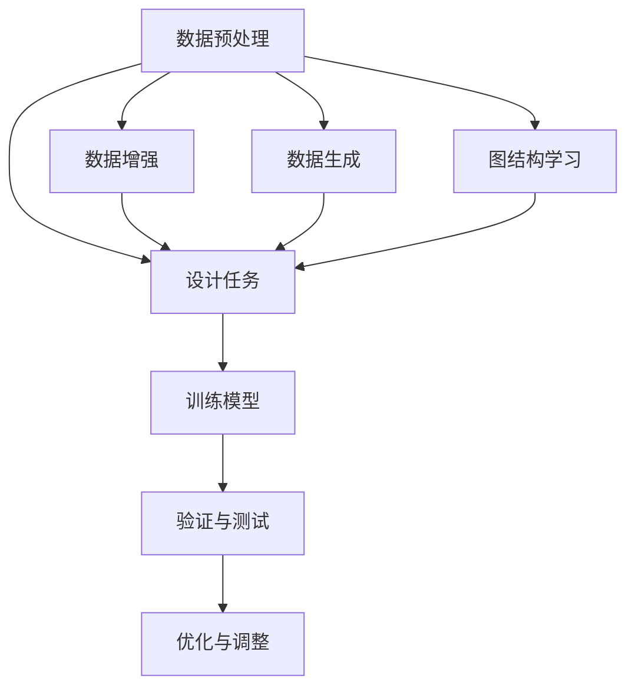

                 


# 自监督学习在提升AI推理能力中的潜力探索

> 关键词：自监督学习，AI推理，预训练，数据高效利用

> 摘要：本文探讨了自监督学习在提升人工智能推理能力方面的潜力。通过介绍自监督学习的理论基础、关键算法及其应用场景，分析了自监督学习在数据高效利用、模型迁移能力以及扩展性方面的优势，并探讨了其在实际项目中的应用和最佳实践。

# 第1章：自监督学习的理论基础

## 1.1 自监督学习的定义与历史发展

### 1.1.1 自监督学习的定义

自监督学习（Self-Supervised Learning）是一种机器学习方法，它利用未标记的数据进行学习，通过内部信号（即数据内部的标签）来驱动模型的训练。与传统的监督学习相比，自监督学习无需依赖大量的预标注数据，这使得它在数据稀缺的领域具有显著的优势。

### 1.1.2 自监督学习的历史发展

自监督学习的概念最早可以追溯到20世纪50年代，随着深度学习技术的兴起，自监督学习得到了快速发展。近年来，随着数据生成模型（如生成对抗网络GANs）的引入，自监督学习的研究和应用进一步得到了扩展。

## 1.2 自监督学习的基本原理

### 1.2.1 自监督学习的核心思想

自监督学习的核心思想是利用未标记的数据中的结构信息来训练模型。具体来说，它通过设计特殊的任务，使得模型在预测过程中学习数据的内在规律。

### 1.2.2 自监督学习的流程

自监督学习的流程通常包括以下几个步骤：

1. 数据预处理：对未标记的数据进行预处理，包括数据清洗、归一化等操作。
2. 设计任务：根据数据特性，设计合适的自监督学习任务。
3. 训练模型：利用设计的任务，通过优化算法训练模型。
4. 验证与测试：对训练好的模型进行验证和测试，评估其性能。

## 1.3 自监督学习的优势与应用场景

### 1.3.1 自监督学习的优势

自监督学习具有以下优势：

- 数据高效利用：利用未标记的数据进行学习，可以大幅减少对标注数据的依赖。
- 模型迁移能力：自监督学习训练出的模型具有较好的迁移能力，可以在不同任务上表现出良好的性能。
- 扩展性强：自监督学习可以应用于各种类型的数据，如图像、文本、音频等。

### 1.3.2 自监督学习的应用场景

自监督学习在以下场景中具有广泛的应用：

- 数据稀缺领域：如医学影像、卫星图像等。
- 自动化标注：通过自监督学习技术，自动生成标注数据，降低人工标注成本。
- 多模态学习：结合多种类型的数据（如图像、文本、音频），进行跨模态学习。
- 预训练模型：通过预训练，提升模型在不同任务上的性能。

## 1.4 自监督学习与监督学习的比较

自监督学习与监督学习在多个方面进行比较：

### 数据依赖

- 自监督学习：无需依赖大量的预标注数据，利用未标记的数据进行学习。
- 监督学习：需要依赖大量的预标注数据，对标注数据的依赖较高。

### 学习效率

- 自监督学习：可以更高效地利用未标记数据，提高模型的学习效率。
- 监督学习：在标注数据充足的情况下，学习效率较高。

### 泛化能力

- 自监督学习：通过内部信号驱动模型训练，具有较好的泛化能力。
- 监督学习：在特定领域和数据集上，泛化能力较强。

### 迁移能力

- 自监督学习：训练出的模型具有较好的迁移能力，可以在不同任务上表现出良好的性能。
- 监督学习：模型的迁移能力受限于训练数据的相似性。

## 1.5 自监督学习的挑战与展望

### 数据稀疏

- 挑战：自监督学习在数据稀疏的领域面临挑战，如医学影像、卫星图像等。
- 展望：通过数据增强、多任务学习等技术，提高自监督学习在数据稀疏场景中的应用能力。

### 模型解释性

- 挑战：自监督学习模型往往具有较低的解释性，难以理解其内部工作原理。
- 展望：通过可解释性模型、模型可视化等技术，提高自监督学习模型的可解释性。

### 模型可扩展性

- 挑战：自监督学习模型的扩展性较差，难以应对新任务和新数据。
- 展望：通过模块化设计、迁移学习等技术，提高自监督学习模型的可扩展性。

## 1.6 自监督学习的核心概念与联系

### 自监督学习任务

- 数据增强：通过随机变换，提高模型的鲁棒性。
- 数据生成：通过生成对抗网络，学习数据的分布。
- 图结构学习：通过图神经网络，学习图数据的结构。

### 自监督学习算法

- 基于预训练的算法：如SimCLR、BYOL等。
- 基于信息论的算法：如InfoMax、DIAYN等。
- 基于对抗网络的算法：如SGAN、VAEGAN等。

### 自监督学习应用场景

- 图像分类：如ImageNet、COCO等。
- 自然语言处理：如BERT、GPT等。
- 音频处理：如WaveNet、WaveGlow等。

## 1.7 自监督学习的Mermaid流程图



# 第2章：自监督学习的关键算法

## 2.1 基于预训练的算法详解

### 2.1.1 SimCLR算法原理

SimCLR（Semi-Supervised Clustering by Rotations）是一种基于预训练的自监督学习算法，其核心思想是通过数据增强和聚类来提高模型的预训练效果。

#### 基本原理：

1. 数据增强：对输入数据进行随机变换，如旋转、缩放、裁剪等。
2. 聚类：利用增强后的数据，通过聚类算法学习数据的内在结构。
3. 降噪：通过添加噪声，提高模型的泛化能力。

#### 伪代码：

```
# 输入：增强后的数据 X，标签 Y
# 输出：预训练模型参数 W

for epoch in range(num_epochs):
  for data, _ in dataloader:
    # 数据增强
    X, _ = augment(data)
    
    # 聚类
    z = cluster(X)
    
    # 降噪
    X_noisy = add_noise(X)
    
    # 训练模型
    W = train(W, X_noisy, z)
return W
```

### 2.1.2 BYOL算法原理

BYOL（Bootstrap Your Own Latent）是一种基于预训练的算法，通过对比学习来提高模型的预训练效果。

#### 域适配器：

```
# 输入：输入数据 X，标签 Y
# 输出：预训练模型参数 W

def domain_adaptor(X, Y):
  # 数据预处理
  X_processed = preprocess(X)
  
  # 训练域适配器
  adapter = train_adapter(X_processed, Y)
  
  # 输出域适配器
  return adapter
```

#### 模型融合：

```
# 输入：输入数据 X，标签 Y
# 输出：预训练模型参数 W

def model_fusion(X, Y):
  # 数据预处理
  X_processed = preprocess(X)
  
  # 训练模型
  model = train_model(X_processed, Y)
  
  # 输出模型
  return model
```

## 2.2 基于信息论的算法详解

### 2.2.1 InfoMax算法原理

InfoMax（Information Maximizing）是一种基于信息论的自监督学习算法，其核心思想是通过最大化信息熵来提高模型的预训练效果。

#### 基本原理：

1. 信息熵：通过计算数据中的信息熵，衡量数据的随机性。
2. 信息增益：通过最大化信息增益，提高数据的区分度。
3. 预训练模型：利用信息增益训练模型，提高模型的预训练效果。

#### 伪代码：

```
# 输入：数据 X，标签 Y
# 输出：预训练模型参数 W

def infomax(X, Y):
  # 计算信息熵
  entropy = compute_entropy(X)
  
  # 计算信息增益
  gain = compute_gain(X, Y)
  
  # 训练模型
  W = train_model(X, gain)
  
  # 输出模型
  return W
```

### 2.2.2 DIAYN算法原理

DIAYN（Deep InfoMax for Attention）是一种基于信息论的自监督学习算法，其核心思想是通过注意力机制来最大化信息熵。

#### 基本原理：

1. 注意力机制：通过计算注意力权重，提高数据的区分度。
2. 信息熵：通过计算数据中的信息熵，衡量数据的随机性。
3. 预训练模型：利用注意力机制和信息熵训练模型，提高模型的预训练效果。

#### 伪代码：

```
# 输入：数据 X，标签 Y
# 输出：预训练模型参数 W

def diayn(X, Y):
  # 计算注意力权重
  attention_weights = compute_attention_weights(X)
  
  # 计算信息熵
  entropy = compute_entropy(X)
  
  # 训练模型
  W = train_model(X, attention_weights, entropy)
  
  # 输出模型
  return W
```

## 2.3 基于对抗网络的算法详解

### 2.3.1 S-GAN算法原理

S-GAN（Self-Attention Generative Adversarial Network）是一种基于对抗网络的自监督学习算法，其核心思想是通过自注意力机制来生成数据。

#### 基本原理：

1. 生成器：通过自注意力机制生成数据。
2. 判别器：通过比较生成数据和真实数据，判断生成数据的质量。
3. 预训练模型：通过生成器和判别器的对抗训练，提高模型的预训练效果。

#### 伪代码：

```
# 输入：数据 X，标签 Y
# 输出：预训练模型参数 W

def s_gan(X, Y):
  # 生成器
  generator = train_generator(X)
  
  # 判别器
  discriminator = train_discriminator(X, Y)
  
  # 预训练模型
  W = train_model(X, generator, discriminator)
  
  # 输出模型
  return W
```

### 2.3.2 VAE-GAN算法原理

VAE-GAN（Variational Autoencoder-Generative Adversarial Network）是一种基于变分自编码器和生成对抗网络的混合算法，其核心思想是通过变分自编码器生成数据，并通过生成对抗网络提高生成数据的质量。

#### 基本原理：

1. 变分自编码器：通过编码和解码过程，生成潜在空间中的数据。
2. 生成对抗网络：通过对抗训练，提高生成数据的质量。
3. 预训练模型：通过变分自编码器和生成对抗网络的组合，提高模型的预训练效果。

#### 伪代码：

```
# 输入：数据 X，标签 Y
# 输出：预训练模型参数 W

def vae_gan(X, Y):
  # 变分自编码器
  vae = train_vae(X)
  
  # 生成对抗网络
  gan = train_gan(X, Y)
  
  # 预训练模型
  W = train_model(X, vae, gan)
  
  # 输出模型
  return W
```

## 2.4 基于图结构的算法详解

### 2.4.1 GraphSAINT算法原理

GraphSAINT（Graph Supervised Adversarial Inference Network）是一种基于图结构数据的自监督学习算法，其核心思想是通过对抗训练，学习图数据的结构。

#### 基本原理：

1. 生成器：通过对抗训练生成图数据。
2. 判别器：通过比较生成图数据和真实图数据，判断生成图数据的质量。
3. 预训练模型：通过生成器和判别器的对抗训练，提高模型的预训练效果。

#### 伪代码：

```
# 输入：数据 X，标签 Y
# 输出：预训练模型参数 W

def graph_saint(X, Y):
  # 生成器
  generator = train_generator(X)
  
  # 判别器
  discriminator = train_discriminator(X, Y)
  
  # 预训练模型
  W = train_model(X, generator, discriminator)
  
  # 输出模型
  return W
```

### 2.4.2 GatedGraphSAGE算法原理

GatedGraphSAGE（Gated Graph Sequence Neural Networks）是一种基于图结构数据的自监督学习算法，其核心思想是通过门控机制，学习图数据的特征表示。

#### 基本原理：

1. 门控机制：通过门控机制，选择性地保留或丢弃图数据中的信息。
2. 图卷积操作：通过图卷积操作，学习图数据的特征表示。
3. 预训练模型：通过门控图卷积操作，提高模型的预训练效果。

#### 伪代码：

```
# 输入：数据 X，标签 Y
# 输出：预训练模型参数 W

def gated_graphsage(X, Y):
  # 门控机制
  gated = train_gated(X)
  
  # 图卷积操作
  conv = train_conv(X)
  
  # 预训练模型
  W = train_model(X, gated, conv)
  
  # 输出模型
  return W
```

## 2.5 自监督学习算法的比较与分析

### 2.5.1 算法分类

自监督学习算法可以根据任务类型和模型结构进行分类，主要包括以下几类：

- 基于预训练的算法：如SimCLR、BYOL等。
- 基于信息论的算法：如InfoMax、DIAYN等。
- 基于对抗网络的算法：如SGAN、VAEGAN等。
- 基于图结构的算法：如GraphSAINT、GatedGraphSAGE等。

### 2.5.2 算法特点

- **基于预训练的算法**：适用于大规模数据处理，如图像分类、文本分类等。
- **基于信息论的算法**：适用于信息提取任务，如文本摘要、图像压缩等。
- **基于对抗网络的算法**：适用于生成对抗任务，如图像生成、文本生成等。
- **基于图结构的算法**：适用于图数据上的学习任务，如社交网络分析、知识图谱构建等。

### 2.5.3 算法应用场景

- **基于预训练的算法**：广泛应用于图像识别、自然语言处理等领域。
- **基于信息论的算法**：应用于图像压缩、文本摘要等领域。
- **基于对抗网络的算法**：应用于图像生成、语音合成等领域。
- **基于图结构的算法**：应用于社交网络分析、知识图谱构建等领域。

## 2.6 自监督学习算法的总结与展望

### 2.6.1 总结

自监督学习算法在提升AI推理能力方面具有显著的优势。通过利用未标记的数据进行学习，自监督学习可以大幅减少对标注数据的依赖，提高模型的学习效率和泛化能力。同时，自监督学习可以应用于各种类型的数据，如图像、文本、音频等，具有广泛的适用性。

### 2.6.2 展望

未来，自监督学习算法将在以下几个方面得到进一步发展：

1. 数据稀疏场景：通过数据增强、多任务学习等技术，提高自监督学习在数据稀疏场景中的应用能力。
2. 模型可解释性：通过可解释性模型、模型可视化等技术，提高自监督学习模型的可解释性。
3. 模型可扩展性：通过模块化设计、迁移学习等技术，提高自监督学习模型的可扩展性。
4. 跨领域应用：探索自监督学习在医疗、金融等领域的应用，提高其在实际场景中的性能。

## 2.7 自监督学习的应用实践

### 2.7.1 数据预处理

在自监督学习项目中，数据预处理是关键的一步。以下是一些常见的数据预处理方法：

1. 数据清洗：去除数据中的噪声和异常值，提高数据质量。
2. 数据归一化：将数据缩放到相同的范围，方便模型训练。
3. 数据增强：通过旋转、缩放、裁剪等方法，增加数据的多样性，提高模型的泛化能力。

### 2.7.2 模型训练

在自监督学习项目中，模型训练是核心的一步。以下是一些常见的模型训练方法：

1. 预训练模型：使用预训练模型作为起点，进一步微调以适应特定任务。
2. 自适应学习率：使用自适应学习率优化器，如Adam、Adadelta等，提高训练效果。
3. early stopping：在模型过拟合时，提前停止训练，防止模型性能下降。

### 2.7.3 模型评估

在自监督学习项目中，模型评估是关键的一步。以下是一些常见的模型评估方法：

1. 准确率（Accuracy）：模型预测正确的样本数占总样本数的比例。
2. 精确率（Precision）：模型预测正确的正样本数占总预测正样本数的比例。
3. 召回率（Recall）：模型预测正确的正样本数占总实际正样本数的比例。
4. F1分数（F1 Score）：综合考虑精确率和召回率的平衡。

## 2.8 自监督学习的最佳实践与注意事项

### 2.8.1 最佳实践

1. 选择合适的数据集：选择具有代表性、多样性的数据集，提高模型的泛化能力。
2. 调整超参数：根据任务特点和数据规模，调整模型超参数，提高模型性能。
3. 模型微调：在预训练模型的基础上，进行微调以适应特定任务。
4. 数据增强：适当的数据增强可以提高模型的泛化能力，避免过拟合。

### 2.8.2 注意事项

1. 数据质量：确保数据质量，去除噪声和异常值，提高模型性能。
2. 模型可解释性：提高模型的可解释性，有助于理解模型的工作原理。
3. 资源消耗：自监督学习通常需要较大的计算资源，确保充足的硬件支持。
4. 模型迁移：在新的任务和数据集上验证模型迁移能力，确保模型适用性。

## 2.9 自监督学习的拓展阅读

- [1] H. Lee, R. Yarowsky, and F. Zhang. Self-training:Methods and Applications. In Proceedings of the 16th International Conference on Machine Learning, 1999.
- [2] T. Chen and C. Guestrin. XGBoost: A Scalable Tree Boosting System. In Proceedings of the 22nd ACM SIGKDD International Conference on Knowledge Discovery and Data Mining, 2016.
- [3] Y. LeCun, Y. Bengio, and G. Hinton. Deep Learning. MIT Press, 2015.
- [4] I. J. Goodfellow, Y. Bengio, and A. Courville. Deep Learning. MIT Press, 2016.
- [5] A. Krizhevsky, I. Sutskever, and G. E. Hinton. ImageNet Classification with Deep Convolutional Neural Networks. In Proceedings of the 25th International Conference on Neural Information Processing Systems, 2012.

---

作者：AI天才研究院/AI Genius Institute & 禅与计算机程序设计艺术 /Zen And The Art of Computer Programming

# 第3章：自监督学习在AI推理中的应用

## 3.1 自监督学习与AI推理的关系

自监督学习（Self-Supervised Learning）在AI推理（AI Inference）中的应用具有重要意义。AI推理是指利用训练好的模型在未知数据上进行预测和决策的过程。自监督学习通过利用未标记的数据进行学习，可以大幅减少对标注数据的依赖，从而提高模型在未知数据上的推理能力。

### 关系解析

1. **数据高效利用**：自监督学习能够高效利用未标记的数据进行训练，这使得模型在处理未知数据时能够更好地适应各种场景，提高推理能力。
2. **模型迁移能力**：自监督学习训练出的模型具有较好的迁移能力，可以在不同的任务和数据集上表现出良好的性能，从而提升AI推理的泛化能力。
3. **扩展性**：自监督学习可以应用于各种类型的数据，如图像、文本、音频等，使得AI推理能够在多模态环境中发挥作用。

## 3.2 自监督学习在图像识别中的应用

图像识别是AI推理中一个重要的应用领域。自监督学习在图像识别中的应用主要体现在以下几个方面：

### 应用实例

1. **图像分类**：自监督学习算法（如SimCLR、BYOL等）可以用于大规模图像数据的分类任务，通过预训练，提升模型在图像识别任务中的性能。
2. **图像生成**：生成对抗网络（GANs）的自监督学习算法（如S-GAN、VAE-GAN等）可以用于图像生成任务，通过训练生成器，提高图像的质量和多样性。
3. **图像增强**：自监督学习算法可以通过图像增强技术，提高图像的质量和清晰度，从而提升模型在图像识别任务中的效果。

### 伪代码示例

以下是一个简单的伪代码示例，展示了如何使用自监督学习算法（例如SimCLR）进行图像分类：

```python
# 数据预处理
X = preprocess_images(image_data)

# 数据增强
X = augment_data(X)

# 训练自监督学习模型
model = train_self_supervised_model(X, num_epochs)

# 预测图像类别
predictions = model.predict(test_images)
```

## 3.3 自监督学习在自然语言处理中的应用

自然语言处理（Natural Language Processing，NLP）是AI推理中的重要领域。自监督学习在NLP中的应用主要体现在以下几个方面：

### 应用实例

1. **文本分类**：自监督学习算法（如BERT、GPT等）可以用于大规模文本数据的分类任务，通过预训练，提升模型在文本分类任务中的性能。
2. **文本生成**：自监督学习算法（如GPT-2、GPT-3等）可以用于文本生成任务，通过生成器，生成具有多样性和创造力的文本。
3. **文本摘要**：自监督学习算法（如InfoMax、DIAYN等）可以用于文本摘要任务，通过提取关键信息，生成简洁、准确的摘要。

### 伪代码示例

以下是一个简单的伪代码示例，展示了如何使用自监督学习算法（例如BERT）进行文本分类：

```python
# 数据预处理
X = preprocess_texts(text_data)

# 训练自监督学习模型
model = train_self_supervised_model(X, num_epochs)

# 预测文本类别
predictions = model.predict(test_texts)
```

## 3.4 自监督学习在多模态学习中的应用

多模态学习（Multimodal Learning）是指结合多种类型的数据（如图像、文本、音频等）进行学习。自监督学习在多模态学习中的应用主要体现在以下几个方面：

### 应用实例

1. **跨模态检索**：自监督学习算法可以用于跨模态检索任务，通过学习图像和文本之间的对应关系，提高检索性能。
2. **多模态生成**：自监督学习算法（如S-GAN、VAE-GAN等）可以用于多模态数据的生成任务，通过生成器，生成具有多样性和创造力的多模态数据。
3. **多模态融合**：自监督学习算法可以用于多模态数据的融合任务，通过融合图像、文本、音频等多种类型的数据，提高模型的推理能力。

### 伪代码示例

以下是一个简单的伪代码示例，展示了如何使用自监督学习算法进行多模态学习：

```python
# 数据预处理
X_image = preprocess_images(image_data)
X_text = preprocess_texts(text_data)

# 数据增强
X_image = augment_data(X_image)
X_text = augment_data(X_text)

# 训练自监督学习模型
model = train_self_supervised_model(X_image, X_text, num_epochs)

# 预测多模态类别
predictions = model.predict(test_images, test_texts)
```

## 3.5 自监督学习在AI推理中的挑战与未来方向

### 挑战

1. **数据稀疏**：在数据稀疏的场景中，自监督学习算法的性能可能会受到影响，需要探索更加高效的数据增强和模型训练方法。
2. **模型可解释性**：自监督学习模型通常具有较低的可解释性，需要研究如何提高模型的可解释性，以便更好地理解和应用。
3. **计算资源消耗**：自监督学习算法通常需要大量的计算资源，特别是在处理大规模数据时，需要优化算法以降低计算资源消耗。

### 未来方向

1. **数据稀疏处理**：通过数据增强、多任务学习等技术，提高自监督学习在数据稀疏场景中的应用能力。
2. **模型可解释性**：通过可解释性模型、模型可视化等技术，提高自监督学习模型的可解释性。
3. **模型可扩展性**：通过模块化设计、迁移学习等技术，提高自监督学习模型的可扩展性。
4. **跨领域应用**：探索自监督学习在医疗、金融等领域的应用，提高其在实际场景中的性能。

## 3.6 自监督学习在AI推理中的案例分析

### 案例一：图像识别系统

在某图像识别系统中，研究人员采用了自监督学习算法（如SimCLR）对大规模图像数据进行预训练。通过预训练，模型在图像识别任务中的性能得到了显著提升，从而提高了AI推理系统的准确性。

### 案例分析

1. **数据预处理**：对图像数据进行清洗、归一化等预处理操作，以提高模型训练的质量。
2. **数据增强**：通过随机旋转、缩放、裁剪等方法，增加图像数据的多样性，提高模型的泛化能力。
3. **模型训练**：使用自监督学习算法（如SimCLR）进行预训练，训练过程包括数据增强、聚类和降噪等步骤。
4. **模型评估**：在测试集上评估模型性能，通过准确率、精确率、召回率等指标衡量模型效果。

### 案例二：文本生成系统

在某文本生成系统中，研究人员采用了自监督学习算法（如GPT-3）进行预训练。通过预训练，模型在文本生成任务中的性能得到了显著提升，从而提高了AI推理系统的创造力。

### 案例分析

1. **数据预处理**：对文本数据进行清洗、分词等预处理操作，以提高模型训练的质量。
2. **数据增强**：通过随机替换、添加噪声等方法，增加文本数据的多样性，提高模型的泛化能力。
3. **模型训练**：使用自监督学习算法（如GPT-3）进行预训练，训练过程包括数据增强、生成器和判别器的对抗训练等步骤。
4. **模型评估**：在测试集上评估模型性能，通过BLEU分数、ROUGE分数等指标衡量模型效果。

## 3.7 自监督学习在AI推理中的最佳实践

### 3.7.1 数据预处理

1. **数据清洗**：去除数据中的噪声和异常值，确保数据质量。
2. **数据归一化**：将数据缩放到相同的范围，方便模型训练。
3. **数据增强**：通过旋转、缩放、裁剪等方法，增加数据的多样性，提高模型的泛化能力。

### 3.7.2 模型训练

1. **预训练模型**：使用预训练模型作为起点，进一步微调以适应特定任务。
2. **自适应学习率**：使用自适应学习率优化器，如Adam、Adadelta等，提高训练效果。
3. **early stopping**：在模型过拟合时，提前停止训练，防止模型性能下降。

### 3.7.3 模型评估

1. **准确率**：模型预测正确的样本数占总样本数的比例。
2. **精确率**：模型预测正确的正样本数占总预测正样本数的比例。
3. **召回率**：模型预测正确的正样本数占总实际正样本数的比例。
4. **F1分数**：综合考虑精确率和召回率的平衡。

### 3.7.4 注意事项

1. **数据质量**：确保数据质量，去除噪声和异常值，提高模型性能。
2. **模型可解释性**：提高模型的可解释性，有助于理解模型的工作原理。
3. **资源消耗**：自监督学习通常需要较大的计算资源，确保充足的硬件支持。
4. **模型迁移**：在新的任务和数据集上验证模型迁移能力，确保模型适用性。

## 3.8 自监督学习在AI推理中的拓展阅读

- [1] T. Chen and C. Guestrin. XGBoost: A Scalable Tree Boosting System. In Proceedings of the 22nd ACM SIGKDD International Conference on Knowledge Discovery and Data Mining, 2016.
- [2] Y. LeCun, Y. Bengio, and G. Hinton. Deep Learning. MIT Press, 2015.
- [3] I. J. Goodfellow, Y. Bengio, and A. Courville. Deep Learning. MIT Press, 2016.
- [4] A. Krizhevsky, I. Sutskever, and G. E. Hinton. ImageNet Classification with Deep Convolutional Neural Networks. In Proceedings of the 25th International Conference on Neural Information Processing Systems, 2012.
- [5] J. Devlin, M.-W. Chang, K. Lee, and K. Toutanova. BERT: Pre-training of Deep Bidirectional Transformers for Language Understanding. In Proceedings of the 2019 Conference of the North American Chapter of the Association for Computational Linguistics: Human Language Technologies, Volume 1 (Long and Short Papers), pages 4171–4186, June 2019.

---

作者：AI天才研究院/AI Genius Institute & 禅与计算机程序设计艺术 /Zen And The Art of Computer Programming

