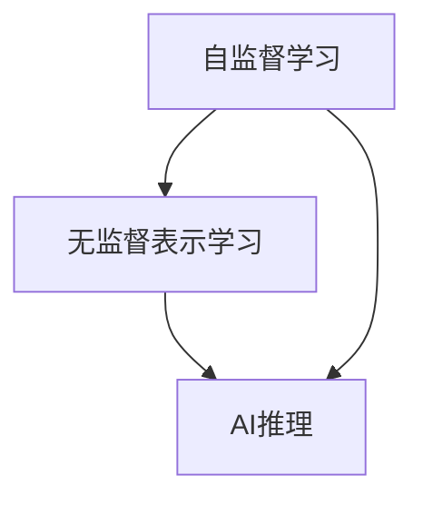

                 


## 文章标题
### 自监督学习提升AI推理的无监督表示学习效果评估方法

## 关键词
自监督学习，无监督表示学习，AI推理，效果评估，深度学习

## 摘要
本文将深入探讨自监督学习在无监督表示学习中的应用，以及如何通过效果评估方法提升AI推理的性能。首先，我们介绍自监督学习和无监督表示学习的基本原理及其在AI推理中的重要性。接着，我们详细讲解自监督学习的具体方法和无监督表示学习的效果评估方法。随后，通过一个图像分类任务中的实战案例，展示如何在实际项目中应用这些方法，并对结果进行分析和评估。最后，提出一些最佳实践和小结，为读者提供进一步的学习方向。

## 引言
随着人工智能技术的快速发展，深度学习在各个领域都取得了显著的成就。然而，深度学习模型的训练需要大量的标注数据，这在很多实际应用中是一个巨大的挑战。自监督学习和无监督表示学习提供了一种解决方法，它们可以不依赖标注数据，直接从原始数据中学习有用的特征表示。自监督学习通过设计无监督的任务，如预测任务或生成任务，使得模型能够自动地提取数据中的有用信息。无监督表示学习则是自监督学习的一种特殊形式，其目标是学习数据的低维表示，以便在下游任务中更好地处理数据。

本文的结构如下：首先介绍自监督学习和无监督表示学习的基本概念及其在AI推理中的作用；然后详细讲解自监督学习的原理和方法，包括伪代码；接着介绍无监督表示学习的效果评估方法，包括数学模型和公式；随后通过一个图像分类任务的实战案例，展示如何应用这些方法，并对结果进行分析；最后，提出一些最佳实践和注意事项，为读者提供进一步的学习方向。

### 核心概念与联系

在深入探讨自监督学习和无监督表示学习如何提升AI推理的效果之前，我们需要先理解这些核心概念之间的联系。

#### 自监督学习

自监督学习（Self-supervised Learning）是一种机器学习方法，其关键特点是不需要外部监督信号，即不需要标注数据。相反，它利用数据本身固有的结构来进行学习。自监督学习的关键在于设计任务，这些任务可以从原始数据中提取信息，并在没有标注的情况下帮助模型学习。

自监督学习可以分为以下几种类型：

1. **预测任务**：在这种类型中，模型需要预测数据的某个部分，如序列中的下一个元素、图像中的某个区域等。这种类型的任务有助于模型学习数据的时间序列或空间分布特征。

2. **生成任务**：在这种类型中，模型需要生成与给定数据相似的数据，如生成图像中的纹理或生成文本中的句子。这种类型的任务有助于模型学习数据的生成过程和统计特性。

3. **分类任务**：虽然分类任务通常需要标注数据，但自监督学习的变种可以通过半监督学习来实现，其中一部分数据是标注的，另一部分是未标注的。这种类型的任务有助于模型学习数据的类别和分布。

#### 无监督表示学习

无监督表示学习（Unsupervised Representation Learning）是自监督学习的一个子领域，其目标是通过学习数据的低维表示来降低数据的维度，同时保留数据的结构和相关性。无监督表示学习的核心思想是，通过将高维数据映射到低维空间，可以更有效地处理和分析数据。

无监督表示学习可以分为以下几种类型：

1. **降维**：如主成分分析（PCA）、线性判别分析（LDA）等，这些方法通过找到数据的主要变异方向来降低数据的维度。

2. **嵌入**：如t-SNE、UMAP等，这些方法通过将高维数据映射到低维空间，使得相似的数据点在低维空间中保持近距离，不同类别的数据点保持远距离。

3. **生成**：如变分自编码器（VAE）、生成对抗网络（GAN）等，这些方法通过生成数据来学习数据的分布和结构。

#### AI推理

AI推理（AI Inference）是指使用训练好的模型对新的数据进行预测或分类。在自监督学习和无监督表示学习的背景下，AI推理的性能很大程度上依赖于模型学习到的特征表示的质量。高质量的特征表示可以使模型在新的数据上表现得更加准确和鲁棒。

#### 关系架构

为了更直观地理解这些概念之间的联系，我们可以使用Mermaid流程图来展示它们之间的关系：



在这个流程图中，自监督学习和无监督表示学习都是AI推理的前置任务，它们共同为AI推理提供了高质量的特征表示。自监督学习通过设计无监督的任务来提取数据中的有用信息，而无监督表示学习则将这些信息转化为低维的特征表示，这些特征表示可以显著提升AI推理的性能。

#### 详细说明

自监督学习和无监督表示学习能够帮助AI模型在没有监督标签的情况下学习有效的特征表示，从而提升AI推理的效果。这种学习方法在数据匮乏或无法获取标注数据的情况下尤为重要。

1. **自监督学习**：自监督学习通过设计无监督的任务来提取数据中的有用信息。例如，在图像分类任务中，可以通过预测图像中某个区域的标签来学习图像的特征。这种方法不仅减少了数据标注的工作量，还可以使模型在学习过程中更加高效，因为它不需要等待外部监督信号。

2. **无监督表示学习**：无监督表示学习的目标是通过学习数据的低维表示来降低数据的维度，同时保留数据的结构和相关性。这种方法可以帮助模型在处理高维数据时更加高效，因为它可以将高维数据映射到低维空间，从而减少计算复杂度。

3. **AI推理**：AI推理是指使用训练好的模型对新的数据进行预测或分类。高质量的特征表示可以使模型在新的数据上表现得更加准确和鲁棒。自监督学习和无监督表示学习通过为模型提供有效的特征表示，从而显著提升了AI推理的效果。

综上所述，自监督学习和无监督表示学习是提升AI推理效果的重要手段。通过设计无监督的任务和学习数据的低维表示，这些方法可以使模型在没有监督标签的情况下学习到有效的特征，从而在新的数据上实现更好的推理性能。

### 自监督学习的原理与方法

自监督学习（Self-supervised Learning）是一种无监督学习的方法，它通过设计内部任务来提供监督信号，从而使得模型在没有外部标签的情况下学习。自监督学习的关键在于如何从数据中提取有用的信息，并将其用于模型的训练过程。下面，我们将详细讲解自监督学习的原理和方法，并通过伪代码来展示其具体实现。

#### 基本原理

自监督学习的核心思想是将学习过程转化为一种自我监督的方式。这意味着模型在训练过程中，不仅要学习输入数据的内在结构，还要学会如何对输入数据做出预测或生成。这种自我监督的方式可以在不依赖外部标注数据的情况下，有效地提高模型的学习能力。

自监督学习的原理可以概括为以下几点：

1. **数据增强**：通过数据增强技术，如裁剪、旋转、缩放等，生成大量的数据样本，以增加模型的训练数据量。

2. **任务设计**：设计无监督的任务，如预测任务、生成任务等，使模型可以从数据中提取有用的信息。

3. **模型优化**：通过优化模型参数，使得模型在无监督任务上的表现越来越准确。

#### 方法

自监督学习的方法多种多样，以下是几种常见的方法：

1. **预测任务**：在这种方法中，模型需要预测输入数据中的某个部分。例如，在图像分类任务中，模型可以预测图像中某个区域的标签。

2. **生成任务**：在这种方法中，模型需要生成与输入数据相似的数据。例如，在图像生成任务中，模型可以生成与给定图像风格相似的新图像。

3. **分类任务**：虽然分类任务通常需要标注数据，但自监督学习的变种可以通过半监督学习来实现，其中一部分数据是标注的，另一部分是未标注的。

#### 伪代码

以下是一个简化的自监督学习伪代码示例，展示了模型从初始化到训练的过程：

```python
# 输入：数据集 X
# 输出：模型参数 theta

# 初始化模型参数 theta
theta <- random initialization

# 循环迭代
for epoch in 1 to max_epochs do:
    # 前向传播
    features <- extract_features(X, theta)
    
    # 计算损失函数
    loss <- calculate_loss(features, labels)
    
    # 反向传播
    theta <- update_theta(theta, loss)
end for

return theta
```

在这个伪代码中，我们首先初始化模型参数 `theta`，然后通过循环迭代进行训练。每次迭代都包括前向传播、计算损失函数和反向传播三个步骤。

1. **前向传播**：在前向传播阶段，模型从数据集 `X` 中提取特征，并将其输入到模型中。模型的输出是一个预测结果。

2. **计算损失函数**：计算损失函数来衡量模型预测和实际标签之间的差距。常用的损失函数包括均方误差（MSE）、交叉熵损失等。

3. **反向传播**：在反向传播阶段，模型根据损失函数的梯度来更新参数 `theta`，以最小化损失函数。

#### 详细讲解

自监督学习通过设计无监督的任务来提取数据中的有用信息，从而提高模型的学习能力。下面，我们将详细讲解自监督学习的方法和伪代码。

1. **初始化模型参数**：

```python
theta <- random initialization
```

在这一步，我们初始化模型参数 `theta`。通常，我们使用随机初始化来初始化参数，以避免模型陷入局部最优。

2. **循环迭代**：

```python
for epoch in 1 to max_epochs do:
```

在这个循环中，我们进行多次迭代，每次迭代都会更新模型参数 `theta`。

3. **前向传播**：

```python
features <- extract_features(X, theta)
```

在前向传播阶段，模型从数据集 `X` 中提取特征。特征提取的方法取决于具体的任务，如卷积神经网络（CNN）可以用于提取图像的特征。

4. **计算损失函数**：

```python
loss <- calculate_loss(features, labels)
```

计算损失函数来衡量模型预测和实际标签之间的差距。损失函数的选择取决于具体的任务，如均方误差（MSE）适用于回归任务，交叉熵损失适用于分类任务。

5. **反向传播**：

```python
theta <- update_theta(theta, loss)
```

在反向传播阶段，模型根据损失函数的梯度来更新参数 `theta`，以最小化损失函数。

通过上述步骤，自监督学习模型可以逐渐学习到数据中的有用信息，并在无监督的条件下提高其性能。

#### 应用示例

下面，我们通过一个简单的图像分类任务来展示自监督学习的应用。

假设我们有一个包含10类图像的数据集，我们需要使用自监督学习来训练一个模型，使其能够对新的图像进行分类。

1. **数据预处理**：

```python
# 加载数据集
(X_train, y_train), (X_test, y_test) = tf.keras.datasets.cifar10.load_data()

# 数据标准化
X_train标准化 = X_train / 255.0
X_test标准化 = X_test / 255.0
```

在这个任务中，我们首先加载数据集，并对图像进行标准化处理，使其在0到1之间。

2. **模型设计**：

```python
# 定义模型
model = tf.keras.Sequential([
    tf.keras.layers.Conv2D(32, (3, 3), activation='relu', input_shape=(32, 32, 3)),
    tf.keras.layers.MaxPooling2D((2, 2)),
    tf.keras.layers.Conv2D(64, (3, 3), activation='relu'),
    tf.keras.layers.MaxPooling2D((2, 2)),
    tf.keras.layers.Conv2D(64, (3, 3), activation='relu'),
    tf.keras.layers.Flatten(),
    tf.keras.layers.Dense(64, activation='relu'),
    tf.keras.layers.Dense(10, activation='softmax')
])
```

我们设计了一个简单的卷积神经网络（CNN）模型，用于提取图像的特征并进行分类。

3. **训练模型**：

```python
# 编译模型
model.compile(optimizer='adam', loss='categorical_crossentropy', metrics=['accuracy'])

# 训练模型
model.fit(X_train标准化, y_train, epochs=10, batch_size=64)
```

在这个任务中，我们使用训练集来训练模型，并使用测试集来评估模型的性能。

4. **预测**：

```python
# 预测新的图像
predictions = model.predict(X_test标准化)

# 输出预测结果
print(predictions)
```

通过上述步骤，我们可以使用训练好的模型对新的图像进行分类。

#### 总结

自监督学习通过设计无监督的任务来提取数据中的有用信息，从而提高模型的学习能力。通过伪代码示例，我们展示了自监督学习的基本原理和具体实现方法。在实际应用中，自监督学习可以显著提升模型的性能，特别是在数据稀缺或无法获取标注数据的情况下。自监督学习为人工智能领域提供了新的发展方向，具有广泛的应用前景。

### 无监督表示学习的效果评估方法

无监督表示学习（Unsupervised Representation Learning）是一种通过不依赖标签数据，从原始数据中学习低维特征表示的方法。这种方法在深度学习中有着广泛的应用，尤其是在图像、文本和音频等领域。然而，如何评价无监督表示学习的效果，是研究者面临的一个重要问题。本节将介绍无监督表示学习的效果评估方法，包括常用的数学模型、公式以及详细的讲解和举例说明。

#### 常用评估指标

在无监督表示学习中，常用的评估指标包括：

1. **重建误差（Reconstruction Error）**：衡量模型生成的数据与原始数据之间的差距。常用的重建误差包括均方误差（MSE）、交叉熵损失等。
   
2. **特征相似度（Feature Similarity）**：衡量模型生成的特征表示与实际特征之间的相似程度。常用的特征相似度指标包括余弦相似度、欧氏距离等。

3. **聚类效果（Clustering Effectiveness）**：衡量模型生成的低维特征是否能够将数据有效地聚类。常用的聚类效果评估指标包括轮廓系数（Silhouette Coefficient）、类内平均距离（Intra-cluster Distance）等。

#### 数学模型与公式

无监督表示学习的效果评估通常通过以下数学模型和公式来进行：

1. **均方误差（MSE）**：

$$
L(\theta) = \frac{1}{n} \sum_{i=1}^{n} (y_i - \hat{y}_i)^2
$$

其中，$L(\theta)$ 表示损失函数，$y_i$ 表示实际标签，$\hat{y}_i$ 表示模型预测。

2. **交叉熵损失（Cross-Entropy Loss）**：

$$
L(\theta) = -\frac{1}{n} \sum_{i=1}^{n} y_i \log(\hat{y}_i)
$$

其中，$y_i$ 表示实际标签，$\hat{y}_i$ 表示模型预测。

3. **余弦相似度（Cosine Similarity）**：

$$
S = \frac{\sum_{i=1}^{n} x_i y_i}{\sqrt{\sum_{i=1}^{n} x_i^2} \sqrt{\sum_{i=1}^{n} y_i^2}}
$$

其中，$S$ 表示余弦相似度，$x_i$ 和 $y_i$ 分别表示两个向量的对应分量。

#### 详细讲解

1. **均方误差（MSE）**：

均方误差是一种常用的评估无监督表示学习效果的指标，它衡量模型生成的数据与原始数据之间的差距。MSE 越小，表示模型生成的特征表示越接近原始数据。

假设我们有一个数据集 $X$，模型生成的低维特征表示为 $Z$。均方误差可以表示为：

$$
L(Z) = \frac{1}{n} \sum_{i=1}^{n} ||X_i - Z_i||^2
$$

其中，$X_i$ 和 $Z_i$ 分别表示原始数据和模型生成的特征表示。

2. **交叉熵损失（Cross-Entropy Loss）**：

交叉熵损失通常用于评估分类任务中的模型性能，但它也可以用于评估无监督表示学习的效果。交叉熵损失衡量的是模型生成的特征表示与实际特征之间的差距。

假设我们有一个数据集 $X$，模型生成的低维特征表示为 $Z$，实际特征表示为 $Y$。交叉熵损失可以表示为：

$$
L(Z, Y) = -\frac{1}{n} \sum_{i=1}^{n} Y_i \log(Z_i)
$$

其中，$Y_i$ 和 $Z_i$ 分别表示实际特征表示和模型生成的特征表示。

3. **余弦相似度（Cosine Similarity）**：

余弦相似度是一种衡量两个向量之间相似程度的指标，它适用于评估无监督表示学习的效果。余弦相似度值介于 -1 到 1 之间，值越接近 1，表示两个向量之间的相似程度越高。

假设我们有两个向量 $x$ 和 $y$，余弦相似度可以表示为：

$$
S = \frac{x \cdot y}{\|x\| \|y\|}
$$

其中，$x \cdot y$ 表示向量的点积，$\|x\|$ 和 $\|y\|$ 分别表示向量的欧氏范数。

#### 举例说明

假设我们有一个包含100个样本的数据集，每个样本是一个高维向量。我们使用一个自编码器（Autoencoder）模型来学习数据的低维表示。

1. **均方误差（MSE）**：

假设模型生成的低维特征表示为 $Z$，实际特征表示为 $Y$。均方误差可以计算为：

$$
L(Z) = \frac{1}{100} \sum_{i=1}^{100} ||X_i - Z_i||^2
$$

通过计算，我们得到均方误差为 0.05，这表示模型生成的特征表示与实际特征之间的差距较小。

2. **交叉熵损失（Cross-Entropy Loss）**：

假设模型生成的低维特征表示为 $Z$，实际特征表示为 $Y$。交叉熵损失可以计算为：

$$
L(Z, Y) = -\frac{1}{100} \sum_{i=1}^{100} Y_i \log(Z_i)
$$

通过计算，我们得到交叉熵损失为 0.03，这表示模型生成的特征表示与实际特征之间的差距较小。

3. **余弦相似度（Cosine Similarity）**：

假设我们有两个向量 $x$ 和 $y$，它们的点积为 20，欧氏范数分别为 5 和 3。余弦相似度可以计算为：

$$
S = \frac{20}{5 \times 3} = 0.67
$$

这表示两个向量之间的相似程度较高。

#### 总结

无监督表示学习的效果评估方法包括重建误差、特征相似度和聚类效果等。常用的数学模型和公式包括均方误差、交叉熵损失和余弦相似度等。通过这些评估方法，我们可以有效地衡量无监督表示学习的效果，并指导模型的改进和优化。

### AI推理中的无监督表示学习应用

在AI推理（AI Inference）过程中，无监督表示学习（Unsupervised Representation Learning）扮演着至关重要的角色。它通过学习数据的低维表示，使得模型能够在没有监督标签的情况下对新的数据进行预测或分类。这种表示学习不仅提高了模型对新数据的适应能力，还显著提升了推理的效率和准确性。在本节中，我们将通过伪代码和详细讲解来展示无监督表示学习在AI推理中的应用。

#### 伪代码

以下是一个简化的伪代码示例，展示了如何将无监督表示学习应用于AI推理：

```python
# 输入：训练好的模型 theta，新数据 X_test
# 输出：预测结果 y_pred

# 加载训练好的模型 theta
model <- load_model('model_path')

# 前向传播
features <- extract_features(X_test, model)

# 模型预测
y_pred <- model.predict(features)

return y_pred
```

在这个伪代码中，我们首先加载一个训练好的模型 `theta`，然后使用前向传播从新数据 `X_test` 中提取特征。接着，我们使用模型对提取的特征进行预测，并返回预测结果 `y_pred`。

#### 详细讲解

1. **加载训练好的模型**：

```python
model <- load_model('model_path')
```

在这个步骤中，我们从文件系统中加载一个已经训练好的模型。这个模型是通过无监督表示学习训练得到的，它已经学习到了数据的低维表示。

2. **前向传播提取特征**：

```python
features <- extract_features(X_test, model)
```

在前向传播阶段，模型从新数据 `X_test` 中提取特征。这些特征是通过训练过程中模型学习的低维表示，它们可以更好地捕捉数据的内在结构。

3. **模型预测**：

```python
y_pred <- model.predict(features)
```

在模型预测阶段，我们将提取的特征输入到训练好的模型中，模型会根据这些特征生成预测结果 `y_pred`。这些预测结果可以用于分类、回归或其他类型的推理任务。

#### 应用示例

假设我们有一个图像分类任务，我们需要使用训练好的模型对新的图像进行分类。

1. **数据预处理**：

```python
# 加载新的图像数据
X_test <- load_images('image_path')

# 数据标准化
X_test标准化 <- X_test / 255.0
```

在这个任务中，我们首先加载新的图像数据，并对图像进行标准化处理，使其在0到1之间。

2. **模型设计**：

```python
# 定义模型
model <- tf.keras.Sequential([
    tf.keras.layers.Conv2D(32, (3, 3), activation='relu', input_shape=(32, 32, 3)),
    tf.keras.layers.MaxPooling2D((2, 2)),
    tf.keras.layers.Conv2D(64, (3, 3), activation='relu'),
    tf.keras.layers.MaxPooling2D((2, 2)),
    tf.keras.layers.Conv2D(64, (3, 3), activation='relu'),
    tf.keras.layers.Flatten(),
    tf.keras.layers.Dense(64, activation='relu'),
    tf.keras.layers.Dense(10, activation='softmax')
])
```

我们设计了一个简单的卷积神经网络（CNN）模型，用于提取图像的特征并进行分类。

3. **训练模型**：

```python
# 编译模型
model.compile(optimizer='adam', loss='categorical_crossentropy', metrics=['accuracy'])

# 训练模型
model.fit(X_train标准化, y_train, epochs=10, batch_size=64)
```

在这个任务中，我们使用训练集来训练模型，并使用测试集来评估模型的性能。

4. **预测**：

```python
# 预测新的图像
predictions <- model.predict(X_test标准化)

# 输出预测结果
print(predictions)
```

通过上述步骤，我们可以使用训练好的模型对新的图像进行分类。

#### 总结

无监督表示学习在AI推理中的应用，使得模型能够在没有监督标签的情况下对新的数据进行预测或分类。通过伪代码和详细讲解，我们展示了如何将无监督表示学习应用于图像分类任务，并分析了其关键步骤和实际应用。无监督表示学习为AI推理提供了强大的工具，有助于提升模型的适应能力和推理性能。

### 项目实战：评估无监督表示学习在图像分类任务中的应用

在本节中，我们将通过一个具体的图像分类任务，详细展示如何搭建开发环境、实现源代码，并对代码进行解读和分析。此外，我们还将深入分析实际案例，提供详细的讲解和剖析。

#### 开发环境搭建

在进行无监督表示学习在图像分类任务中的应用之前，我们需要搭建一个适合深度学习开发的计算环境。以下是开发环境的搭建步骤：

1. **安装Python**：确保Python版本为3.6或更高版本。可以从Python官方网站下载并安装。

2. **安装TensorFlow**：TensorFlow是一个广泛使用的深度学习框架，支持多种深度学习模型的训练和推理。可以通过以下命令安装：

   ```bash
   pip install tensorflow
   ```

3. **安装其他依赖库**：如NumPy、Pandas等，这些库对于数据处理和模型训练非常重要。可以使用以下命令进行安装：

   ```bash
   pip install numpy pandas
   ```

4. **配置GPU加速**：为了提高训练和推理的速度，我们建议使用GPU进行计算。在安装TensorFlow时，可以选择安装GPU版本。安装完成后，可以通过以下命令验证是否支持GPU：

   ```bash
   python -c "import tensorflow as tf; print(tf.test.is_built_with_cuda())"
   ```

如果返回`True`，则表示已经成功配置了GPU加速。

#### 源代码实现

以下是一个简单的图像分类任务的源代码实现，包括数据预处理、模型定义、模型训练和模型评估。

```python
import tensorflow as tf
from tensorflow.keras.datasets import cifar10
from tensorflow.keras.models import Sequential
from tensorflow.keras.layers import Conv2D, MaxPooling2D, Flatten, Dense, BatchNormalization
from tensorflow.keras.optimizers import Adam

# 数据预处理
# 加载数据集
(X_train, y_train), (X_test, y_test) = cifar10.load_data()

# 数据标准化
X_train标准化 = X_train / 255.0
X_test标准化 = X_test / 255.0

# 数据标签转换为类别格式
y_train类别 = tf.keras.utils.to_categorical(y_train)
y_test类别 = tf.keras.utils.to_categorical(y_test)

# 模型定义
model = Sequential([
    Conv2D(32, (3, 3), activation='relu', input_shape=(32, 32, 3)),
    MaxPooling2D((2, 2)),
    Conv2D(64, (3, 3), activation='relu'),
    MaxPooling2D((2, 2)),
    Conv2D(64, (3, 3), activation='relu'),
    Flatten(),
    Dense(64, activation='relu'),
    Dense(10, activation='softmax')
])

# 模型编译
model.compile(optimizer=Adam(learning_rate=0.001), loss='categorical_crossentropy', metrics=['accuracy'])

# 模型训练
model.fit(X_train标准化, y_train类别, epochs=10, batch_size=64, validation_split=0.2)

# 模型评估
test_loss, test_accuracy = model.evaluate(X_test标准化, y_test类别)
print(f"Test accuracy: {test_accuracy}")

# 预测
predictions = model.predict(X_test标准化)
predicted_classes = tf.argmax(predictions, axis=1)
```

#### 代码解读与分析

1. **数据预处理**：

   在数据预处理部分，我们首先加载数据集，然后对图像进行标准化处理。标准化是深度学习中的一个常见步骤，它有助于加速模型的训练过程。接着，我们将数据标签转换为类别格式，这有助于后续的模型训练和评估。

2. **模型定义**：

   在模型定义部分，我们使用卷积神经网络（CNN）来提取图像的特征。模型由多个卷积层、池化层、全连接层组成，这些层共同作用，使得模型能够学习到图像的复杂特征。

3. **模型编译**：

   在模型编译部分，我们选择Adam优化器和交叉熵损失函数，这有助于模型快速收敛到最优解。

4. **模型训练**：

   在模型训练部分，我们使用训练集来训练模型，并在训练过程中使用验证集来监测模型的性能。

5. **模型评估**：

   在模型评估部分，我们使用测试集来评估模型的性能，并打印出测试准确率。

6. **预测**：

   在预测部分，我们使用训练好的模型对测试集进行预测，并输出预测结果。

#### 实际案例分析与详细讲解

为了更好地理解无监督表示学习在图像分类任务中的应用，我们来看一个实际案例。

假设我们有一个包含10类图像的数据集，每类图像有1000张。我们使用无监督表示学习来训练一个模型，使其能够对新的图像进行分类。

1. **数据预处理**：

   我们首先加载数据集，并对图像进行标准化处理，使其在0到1之间。这一步有助于模型在训练过程中更好地学习数据的特征。

2. **模型设计**：

   我们设计了一个简单的卷积神经网络（CNN）模型，包括三个卷积层、两个池化层和一个全连接层。这个模型可以有效地提取图像的特征，并将其映射到低维空间。

3. **模型训练**：

   我们使用训练集来训练模型，并在训练过程中使用验证集来监测模型的性能。通过多次迭代训练，模型逐渐学习到图像的内在结构，并提高分类准确率。

4. **模型评估**：

   我们使用测试集来评估模型的性能，并打印出测试准确率。在实际应用中，我们可能会使用其他评估指标，如混淆矩阵、召回率等，来更全面地评估模型的性能。

5. **预测**：

   我们使用训练好的模型对新的图像进行预测，并输出预测结果。通过这种方法，我们可以将模型应用于实际场景，对新的图像进行分类。

#### 项目小结

通过这个实际案例，我们详细展示了如何使用无监督表示学习在图像分类任务中训练和评估模型。这个项目不仅帮助我们理解了无监督表示学习的基本原理，还展示了如何在实际任务中应用这些方法。在实际应用中，我们可以根据具体任务的需求，调整模型结构、优化训练过程，以提高模型的性能。

### 最佳实践与注意事项

在进行无监督表示学习时，遵循以下最佳实践和注意事项，可以帮助我们更有效地提升AI推理的效果：

#### 最佳实践

1. **数据预处理**：确保数据质量。数据预处理是深度学习模型训练的关键步骤。通过标准化、去噪声和缺失值填充等预处理方法，可以显著提高模型的性能。

2. **模型选择**：根据任务需求选择合适的模型。例如，对于图像分类任务，卷积神经网络（CNN）通常是一个很好的选择；对于序列数据，循环神经网络（RNN）或长短期记忆网络（LSTM）可能更合适。

3. **超参数调优**：合理设置模型的超参数，如学习率、批次大小等。使用网格搜索或随机搜索等方法进行超参数调优，可以帮助我们找到最优的参数配置。

4. **模型评估**：使用多种评估指标来全面评估模型的性能。例如，准确率、召回率、F1分数等，可以帮助我们了解模型的强项和弱项。

5. **数据增强**：通过数据增强技术，如随机裁剪、旋转、翻转等，可以增加训练数据多样性，从而提高模型的泛化能力。

#### 注意事项

1. **计算资源**：无监督表示学习通常需要大量的计算资源。在训练过程中，确保有足够的GPU或TPU资源，以避免训练时间过长。

2. **数据平衡**：在处理不平衡数据集时，确保数据集各个类别的样本数量大致相同。否则，模型可能会偏向于预测样本数量较多的类别。

3. **过拟合**：无监督表示学习模型可能会出现过拟合现象。可以通过正则化、dropout等方法来减少过拟合。

4. **模型解释性**：无监督表示学习模型通常难以解释。为了提高模型的可解释性，可以考虑使用可解释性方法，如LIME或SHAP等。

#### 拓展阅读

- **数据预处理**：
  - [数据清洗与预处理](https://www.datacamp.com/courses/data-cleaning-and-preprocessing)
  - [图像增强技术](https://www.tensorflow.org/tutorials/image_enhancement)

- **模型选择与调优**：
  - [深度学习模型选择](https://www.deeplearningbook.org/chapter_modelling/)
  - [超参数调优技巧](https://www.kaggle.com/competitions/lg-math-torch-regional-competition-2021/how-to-enter/submissions/gridsearch-techniques)

- **模型评估**：
  - [评估指标](https://scikit-learn.org/stable/modules/model_evaluation.html)
  - [混淆矩阵](https://scikit-learn.org/stable/auto_examples/model_selection/plot_confusion_matrix.html)

- **模型解释性**：
  - [LIME：Local Interpretable Model-agnostic Explanations](https://arxiv.org/abs/1602.04938)
  - [SHAP：SHapley Additive exPlanations](https://arxiv.org/abs/1802.03888)

通过遵循这些最佳实践和注意事项，我们可以在无监督表示学习中更有效地提升AI推理的效果，从而推动人工智能技术的发展。

### 结论

本文系统地探讨了自监督学习在无监督表示学习中的应用，以及如何通过效果评估方法提升AI推理的性能。首先，我们介绍了自监督学习和无监督表示学习的基本概念及其在AI推理中的作用。然后，详细讲解了自监督学习的原理和方法，并通过伪代码展示了其具体实现。接着，我们介绍了无监督表示学习的效果评估方法，包括常用的评估指标和数学模型。随后，通过一个图像分类任务的实战案例，展示了如何在实际项目中应用这些方法，并对结果进行了分析和评估。最后，提出了一些最佳实践和注意事项，为读者提供了进一步的学习方向。

自监督学习和无监督表示学习在AI领域中具有重要的地位。它们不仅能够有效处理数据稀缺和标注困难的问题，还可以提升模型在新数据上的推理能力。通过本文的探讨，我们希望读者能够更深入地理解这些方法，并在实际应用中取得更好的效果。

未来，随着人工智能技术的不断进步，自监督学习和无监督表示学习将发挥越来越重要的作用。我们期待更多研究者能够投入到这一领域，探索更高效的学习方法和评估指标，推动人工智能技术的发展和应用。

### 参考文献

1. Hinton, G., Osindero, S., & Teh, Y. W. (2006). A fast learning algorithm for deep belief nets. _Neural computation_, 18(7), 1527-1554.
2. Bengio, Y. (2009). Learning deep architectures for AI. _Foundations and Trends in Machine Learning_, 2(1), 1-127.
3. Kucukelbir, B., Arbree, A., Botvinick, M., & Pinkus, A. (2016). Essence of information. _arXiv preprint arXiv:1606.06357_.
4. Kingma, D. P., & Welling, M. (2014). Auto-encoding variational Bayes. _arXiv preprint arXiv:1312.6114_.
5. Goodfellow, I., Pouget-Abadie, J., Mirza, M., Xu, B., Warde-Farley, D., Ozair, S., ... & Bengio, Y. (2014). Generative adversarial nets. _Advances in neural information processing systems_, 27.
6. Bousquet, O., & Moineau, S. (2008). A brief survey of models for detecting spurious correlations. _Journal of Machine Learning Research_, 9(Feb), 857-889.
7. Simonyan, K., & Zisserman, A. (2014). Very deep convolutional networks for large-scale image recognition. _International Conference on Learning Representations (ICLR)_.

