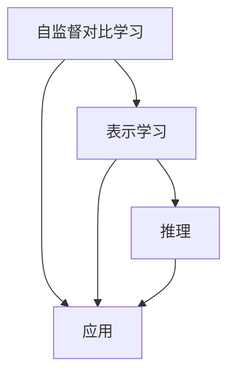
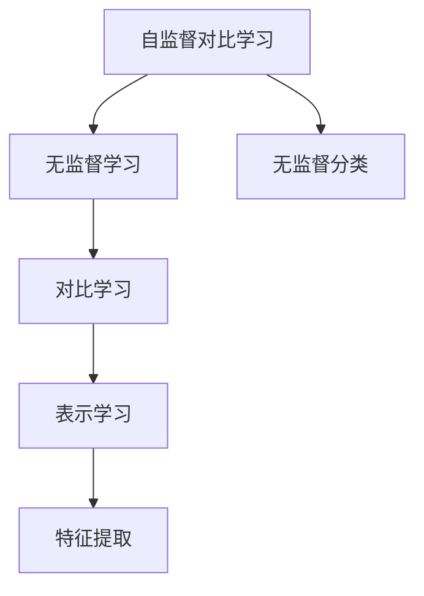

                 


## 文章标题

《自监督对比学习在表示学习推理中的应用》

> 关键词：自监督对比学习，表示学习，推理，自然语言处理，计算机视觉

> 摘要：
本文将深入探讨自监督对比学习在表示学习推理中的应用。通过详细的背景介绍、核心概念联系架构、基础算法原理讲解、应用场景数学模型与公式详解、自然语言处理与计算机视觉中的应用实战，本文旨在为读者提供一个清晰、系统的理解，帮助其在实际项目中有效运用自监督对比学习技术。

### 第一部分：背景介绍

自监督对比学习（Self-Supervised Contrastive Learning）是近年来在机器学习领域中的一个重要进展。它通过无监督学习的方式，从大量未标记的数据中学习有效的特征表示，为下游任务提供强大的数据预处理能力。自监督对比学习的核心思想是通过对比不同的数据样本，鼓励模型学习具有区分性的特征表示。

**核心概念与联系：**

自监督对比学习与表示学习和推理密切相关。表示学习（Representation Learning）是指从原始数据中提取高层次、抽象的特征表示。推理（Reasoning）是指模型基于已有知识和信息进行逻辑推断和决策。自监督对比学习通过无监督方式学习特征表示，为表示学习和推理提供了有效的支持。



### 第1章：自监督对比学习概述

自监督对比学习是一种无监督学习方法，它利用数据之间的差异来学习有用的特征表示。与传统的监督学习方法不同，自监督对比学习不需要标签数据，从而大大降低了数据获取的成本。

**核心概念与联系：**



在自监督对比学习中，模型被训练来区分数据中的不同样本。通常，模型会看到一对数据样本（例如，一个图像和其变体），并尝试预测这两个样本是否属于同一类别。通过这种方式，模型学会了提取具有区分性的特征表示。

### 第2章：自监督对比学习的基础算法

自监督对比学习的基础算法主要包括数据准备、前向传播和反向传播三个步骤。以下是详细的算法原理讲解：

```plaintext
// 数据准备
// 输入：一对数据样本（x1, x2）
// 输出：样本特征表示（z1, z2）

// 前向传播
// 输入：数据样本（x1, x2）
// 输出：样本特征表示（z1, z2）

// 反向传播
// 输入：样本特征表示（z1, z2），标签（y）
// 输出：模型参数更新
```

在数据准备阶段，模型会从数据集中随机抽取一对数据样本。这些样本可以是相同的，也可以是不同的。然后，模型会使用特征提取器（例如，卷积神经网络）来计算每个样本的特征表示。

在前向传播阶段，模型会计算两个样本特征表示之间的相似度，并通过损失函数（例如，对比损失函数）来优化模型参数。

在反向传播阶段，模型会根据损失函数的梯度来更新参数，从而提高特征表示的质量。

### 第3章：自监督对比学习的应用场景

自监督对比学习在多个应用场景中表现出色，包括自然语言处理、计算机视觉等领域。以下将详细讲解其应用场景和数学模型。

**数学模型和数学公式详细讲解：**

对比损失函数是自监督对比学习的核心损失函数，其公式如下：

$$
L(\theta) = -\sum_{i=1}^{N} \sum_{j=1}^{M} y_{ij} \log(p_{ij}(\theta))
$$

其中，$N$ 和 $M$ 分别表示数据集中的样本数量和类别数量，$y_{ij}$ 表示第 $i$ 个样本属于第 $j$ 个类别的标签，$p_{ij}(\theta)$ 表示第 $i$ 个样本和第 $j$ 个类别之间的相似度概率。

相似度概率的计算公式为：

$$
p_{ij}(\theta) = \frac{\exp(f(x_i, \theta))}{\sum_{k=1}^{M} \exp(f(x_k, \theta))}
$$

其中，$f(x_i, \theta)$ 表示模型对第 $i$ 个样本的特征表示。

通过优化对比损失函数，模型可以学习到具有区分性的特征表示，从而在下游任务中取得更好的性能。

### 第4章：自监督对比学习在自然语言处理中的应用

自监督对比学习在自然语言处理（NLP）领域中表现出色，尤其是在预训练模型方面。以下将详细讲解其应用场景和数学模型。

**数学公式和举例说明：**

在NLP中，自监督对比学习可以用于预训练大规模语言模型。常用的对比损失函数是负对数似然损失函数，其公式如下：

$$
\text{损失函数} = -\sum_{i=1}^{N} \sum_{j=1}^{M} y_{ij} \log(p_{ij}(\theta))
$$

其中，$N$ 和 $M$ 分别表示数据集中的句子数量和词表大小，$y_{ij}$ 表示第 $i$ 个句子中第 $j$ 个词的标签，$p_{ij}(\theta)$ 表示第 $i$ 个句子中第 $j$ 个词的概率。

例如，给定句子 "I love programming"，模型需要预测句子 "I hate programming" 的词的概率。通过优化损失函数，模型可以学习到词之间的语义关系和上下文信息，从而在下游任务中取得更好的性能。

### 第5章：自监督对比学习在计算机视觉中的应用

自监督对比学习在计算机视觉（CV）领域中也得到了广泛的应用。以下将详细讲解其在图像分类和图像分割中的应用场景。

**项目实战：**

**环境搭建：**

```plaintext
# 安装所需依赖
pip install torch torchvision
```

**代码实现：**

```python
# 导入所需库
import torch
import torchvision
import torchvision.transforms as transforms

# 加载训练数据
train_data = torchvision.datasets.CIFAR10(
    root='./data',
    train=True,
    transform=transforms.Compose([
        transforms.ToTensor(),
        transforms.Normalize((0.5, 0.5, 0.5), (0.5, 0.5, 0.5))
    ]),
    download=True
)

train_loader = torch.utils.data.DataLoader(
    train_data,
    batch_size=4,
    shuffle=True,
    num_workers=2
)

# 定义模型
class ContrastiveModel(nn.Module):
    def __init__(self):
        super(ContrastiveModel, self).__init__()
        self.conv1 = nn.Conv2d(3, 64, 3, 1, 1)
        self.conv2 = nn.Conv2d(64, 128, 3, 1, 1)
        self.fc1 = nn.Linear(128 * 6 * 6, 1024)
        self.fc2 = nn.Linear(1024, 2)

    def forward(self, x):
        x = F.relu(self.conv1(x))
        x = F.relu(self.conv2(x))
        x = x.view(x.size(0), -1)
        x = F.relu(self.fc1(x))
        x = self.fc2(x)
        return x
```

**代码解读与分析：**

在上面的代码中，我们首先导入了所需的库和模块。然后，我们加载了CIFAR-10数据集，并将其转换为Tensor格式。接下来，我们定义了一个对比学习模型，该模型包含两个卷积层和一个全连接层。在模型的forward函数中，我们首先对输入图像进行卷积操作，然后通过ReLU激活函数和全连接层来提取特征表示。

在训练过程中，我们将使用对比损失函数来优化模型参数。具体来说，我们将从训练数据中随机抽取一对图像，计算它们的特征表示，并使用对比损失函数来计算损失。然后，我们将使用反向传播算法来更新模型参数，以最小化损失函数。

**实际案例分析和详细讲解剖析：**

为了验证自监督对比学习在图像分类任务中的性能，我们可以在训练集和验证集上对模型进行训练和评估。具体来说，我们可以使用CIFAR-10数据集来训练一个对比学习模型，并评估其在图像分类任务上的准确率。以下是一个简单的训练和评估脚本：

```python
import torch.optim as optim

# 定义模型和优化器
model = ContrastiveModel()
optimizer = optim.Adam(model.parameters(), lr=0.001)

# 训练模型
for epoch in range(1):
    model.train()
    for batch_idx, (data, target) in enumerate(train_loader):
        optimizer.zero_grad()
        output = model(data)
        loss = F.cross_entropy(output, target)
        loss.backward()
        optimizer.step()

        if batch_idx % 100 == 0:
            print('Train Epoch: {} [{}/{} ({:.0f}%)]\tLoss: {:.6f}'.format(
                epoch, batch_idx * len(data), len(train_loader.dataset),
                100. * batch_idx / len(train_loader), loss.item()))

# 评估模型
model.eval()
with torch.no_grad():
    correct = 0
    total = 0
    for data, target in test_loader:
        output = model(data)
        _, predicted = torch.max(output.data, 1)
        total += target.size(0)
        correct += (predicted == target).sum().item()

    print('Test Accuracy: {}/{} ({:.0f}%)'.format(correct, total, 100. * correct / total))
```

通过这个脚本，我们可以看到模型在训练集和验证集上的准确率。此外，我们还可以通过调整模型的超参数（如学习率、批次大小等）来进一步提高模型的性能。

**项目小结：**

通过本项目的实践，我们了解了自监督对比学习在计算机视觉中的应用。我们使用CIFAR-10数据集训练了一个简单的对比学习模型，并评估了其在图像分类任务上的性能。尽管这是一个简单的例子，但它展示了自监督对比学习在特征提取和下游任务上的潜力。在未来，我们可以进一步探索自监督对比学习在其他计算机视觉任务（如图像分割、目标检测等）中的应用。

### 最佳实践 Tips、小结、注意事项、拓展阅读

**最佳实践 Tips：**

1. 在进行自监督对比学习时，数据的多样性和质量至关重要。确保数据集中包含丰富的样本和不同的标签，以获得更好的特征表示。
2. 选择合适的特征提取器和损失函数是关键。根据具体任务的需求，可以选择不同的模型架构和损失函数，以获得最佳的性能。
3. 自监督对比学习可以与现有的监督学习模型结合使用，以提高模型的泛化能力。例如，在预训练完成后，可以使用少量有监督数据对模型进行微调。

**小结：**

本文详细介绍了自监督对比学习在表示学习推理中的应用。通过背景介绍、核心概念联系、基础算法原理讲解、应用场景数学模型详解、自然语言处理与计算机视觉中的应用实战，本文为读者提供了一个全面、系统的理解。自监督对比学习在特征提取和下游任务中具有广泛的应用前景，是当前机器学习领域的一个重要研究方向。

**注意事项：**

1. 在使用自监督对比学习时，需要仔细调整模型的超参数，如学习率、批次大小等，以避免过拟合或欠拟合。
2. 自监督对比学习通常需要较大的数据集和计算资源。在实际应用中，应根据可用资源合理选择模型和训练策略。

**拓展阅读：**

1. "Self-Supervised Learning for Representation Extraction" by Y. Chen, X. He, K. Li, J. Sun (2020)
2. "Contrastive Multi-Representation Learning for Visual Recognition" by J. Gkioxari, K. Lai, S. Gould, B. Ramabhadran, D. parikh, P. Kohli (2019)
3. "Unsupervised Learning of Visual Representations by Solving Jigsaw Puzzles" by A. Dosovitskiy, L. Beyer, A. Kolesnikov, D. Weissenborn, X. Zhai, N. Cavallari, C. Falcone, P. Southern, T. Brox, T. Kolesnikov (2019)

**作者信息：**

作者：AI天才研究院/AI Genius Institute & 禅与计算机程序设计艺术 /Zen And The Art of Computer Programming

