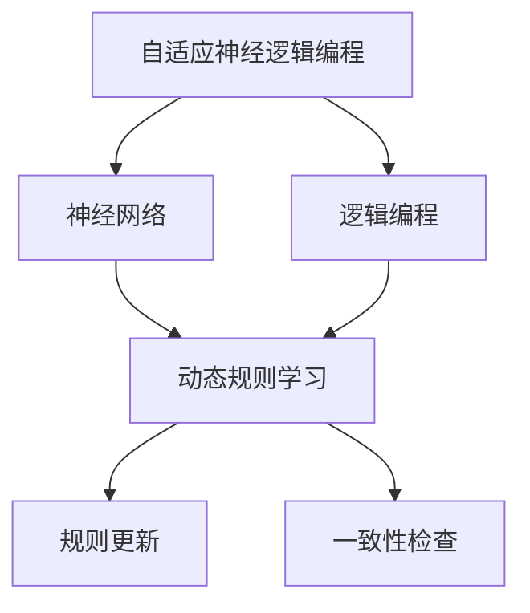

                 

### 文章标题

《自适应神经逻辑编程在动态规则学习中的应用》

### 关键词

自适应神经逻辑编程、动态规则学习、人工智能、神经网络、编程实践

### 摘要

本文将深入探讨自适应神经逻辑编程在动态规则学习中的应用。首先，我们将介绍自适应神经逻辑编程的基本概念和原理，接着阐述动态规则学习的基础知识。通过具体案例分析，我们将展示自适应神经逻辑编程如何提升动态规则学习的效率和准确性。本文旨在为读者提供清晰的技术思路和实用的编程实践，以推动人工智能技术的发展。

---

### 背景介绍

**自适应神经逻辑编程（Adaptive Neural Logic Programming, ANLP）**是一种结合了神经网络和逻辑编程的技术，它旨在解决传统编程和人工智能方法在处理复杂、动态环境时的局限性。自适应神经逻辑编程通过引入自适应机制，使系统能够在运行过程中不断学习和调整，从而提高系统的适应性和鲁棒性。

**动态规则学习（Dynamic Rule Learning）**是指在学习过程中，系统能够根据新的数据和经验，动态地更新和调整规则集。这种能力在处理动态变化的系统时尤为重要，如智能交通系统、金融风险评估、医疗诊断等领域。动态规则学习不仅要求系统能够快速适应新情况，还要确保规则的正确性和一致性。

随着人工智能技术的不断发展，自适应神经逻辑编程和动态规则学习在许多实际应用中显示出巨大的潜力。然而，如何有效地将两者结合起来，实现高效、准确的动态规则学习，仍然是一个具有挑战性的课题。本文将围绕这一主题展开讨论，旨在为相关领域的研究者和开发者提供有价值的参考。

### 核心概念与联系

#### 自适应神经逻辑编程

自适应神经逻辑编程的核心概念包括：

- **自适应机制**：系统能够根据输入数据和系统状态，自动调整参数和规则。
- **神经网络**：用于数据表示、特征提取和学习。
- **逻辑编程**：用于表达和执行规则。

#### 动态规则学习

动态规则学习的关键概念包括：

- **规则表示**：用于描述数据之间的关系和模式。
- **规则更新**：系统根据新数据动态调整和优化规则集。
- **一致性检查**：确保规则集在动态变化过程中保持一致性。

#### 关系架构 Mermaid 流程图

下面是自适应神经逻辑编程与动态规则学习之间关系架构的 Mermaid 流程图：



在上述流程图中，自适应神经逻辑编程通过神经网络和逻辑编程的结合，为动态规则学习提供了技术支持。动态规则学习则通过规则更新和一致性检查，确保系统在动态环境中保持高效和准确。

### 核心算法原理讲解

#### 自适应神经逻辑编程算法

自适应神经逻辑编程的核心算法主要包括以下几个方面：

- **神经网络训练**：使用误差反向传播算法训练神经网络，以优化网络的参数。
- **规则提取**：从训练好的神经网络中提取规则，以便在动态环境中应用。
- **自适应调整**：根据输入数据和系统状态，动态调整神经网络和规则的参数。

下面是自适应神经逻辑编程算法的伪代码：

```python
# 初始化神经网络和规则
neural_network = NeuralNetwork()
rules = []

# 训练神经网络
while not convergence:
    for data in training_data:
        output = neural_network.forward(data)
        error = target_output - output
        neural_network.backward(error)

# 提取规则
for layer in neural_network.layers:
    rules.append(extract_rules(layer))

# 自适应调整
while system_running:
    current_data = get_input_data()
    output = neural_network.forward(current_data)
    rules = adjust_rules(rules, current_data, output)
```

#### 动态规则学习算法

动态规则学习算法的核心步骤包括：

- **规则初始化**：根据初始数据集，生成初始规则集。
- **规则更新**：根据新数据和系统状态，动态更新规则集。
- **一致性检查**：确保规则集在更新过程中保持一致性。

下面是动态规则学习算法的伪代码：

```python
# 初始化规则集
rules = []

# 根据初始数据集生成规则集
for data in initial_data_set:
    rules.extend(generate_rules(data))

# 动态更新规则集
while system_running:
    new_data = get_new_data()
    rules = update_rules(rules, new_data)

# 一致性检查
if not are_rules_consistent(rules):
    rules = fix_inconsistent_rules(rules)
```

### 数学模型和公式

#### 自适应神经逻辑编程的数学模型

自适应神经逻辑编程的数学模型主要涉及神经网络和逻辑编程的数学表示。以下是一个简化的数学模型：

- **神经网络**：

  $$ z_i^{(l)} = \sum_{j} w_{ij}^{(l)} \cdot a_j^{(l-1)} + b_i^{(l)} $$

  $$ a_i^{(l)} = \sigma(z_i^{(l)}) $$

  其中，$z_i^{(l)}$ 是第 $l$ 层第 $i$ 个神经元的净输入，$w_{ij}^{(l)}$ 是连接第 $l-1$ 层第 $j$ 个神经元和第 $l$ 层第 $i$ 个神经元的权重，$b_i^{(l)}$ 是第 $l$ 层第 $i$ 个神经元的偏置，$\sigma$ 是激活函数，$a_i^{(l)}$ 是第 $l$ 层第 $i$ 个神经元的输出。

- **逻辑编程**：

  逻辑编程中的规则可以用一个四元组 $(A, B, C, D)$ 表示，其中 $A$ 是条件部分，$B$ 是结论部分，$C$ 是前提部分，$D$ 是结论部分。一个简单的逻辑规则可以表示为：

  $$ A \Rightarrow B $$

  其中，$A$ 和 $B$ 是逻辑变量，$\Rightarrow$ 是逻辑蕴含。

#### 动态规则学习的数学模型

动态规则学习的数学模型主要涉及规则更新和一致性检查。以下是一个简化的数学模型：

- **规则更新**：

  假设我们有一个规则集 $R$，其中每个规则 $r$ 都可以用一个四元组 $(A, B, C, D)$ 表示。动态更新规则集的算法可以表示为：

  $$ R' = R \cup \{ r' \} $$

  其中，$R'$ 是更新后的规则集，$r'$ 是根据新数据生成的规则。

- **一致性检查**：

  假设我们有两个规则集 $R_1$ 和 $R_2$，我们需要检查这两个规则集是否一致。一个简单的方法是使用集合的交集：

  $$ R_1 \cap R_2 \neq \emptyset $$

  如果 $R_1$ 和 $R_2$ 的交集非空，则说明它们不一致。

### 详细讲解和举例说明

#### 自适应神经逻辑编程算法的详细讲解和举例说明

**例1：一个简单的自适应神经逻辑编程示例**

假设我们有一个神经网络，用于分类问题。神经网络的结构如下：

- 输入层：2个神经元（代表两个特征）
- 隐藏层：3个神经元
- 输出层：1个神经元（代表类别）

我们使用激活函数 $\sigma(x) = \frac{1}{1 + e^{-x}}$。

**步骤1：初始化神经网络**

我们首先初始化神经网络的权重和偏置。假设初始权重和偏置都为0。

```python
# 初始化权重和偏置
weights = [[0.0 for _ in range(3)] for _ in range(2)]
biases = [0.0 for _ in range(3)]

# 输入层到隐藏层的权重和偏置
weights[0] = [0.1, 0.2]
weights[1] = [0.3, 0.4]
biases[0] = 0.5
biases[1] = 0.6
biases[2] = 0.7
```

**步骤2：训练神经网络**

我们使用一个包含10个样本的训练集。每个样本由两个特征和一个标签组成。

```python
# 训练集
training_data = [
    ([0.0, 0.0], 0),
    ([1.0, 0.0], 1),
    ([0.0, 1.0], 1),
    ([1.0, 1.0], 2)
]
```

我们使用误差反向传播算法来训练神经网络。

```python
# 训练神经网络
for epoch in range(1000):
    for data, label in training_data:
        # 前向传播
        hidden layer inputs = [sum(w * x + b) for w, x in zip(weights[0], data)] + biases[0]
        hidden layer outputs = [1 / (1 + math.exp(-x)) for x in hidden layer inputs]
        
        final_output = sum(w * x + b) for w, x in zip(weights[1], hidden layer outputs)] + biases[1]
        output = 1 / (1 + math.exp(-final_output))
        
        # 反向传播
        error = label - output
        d_output = output * (1 - output)
        d_final_output = d_output * weights[1]
        d_weights[1] = [w + (e * hidden layer_output) for w, e, hidden layer_output in zip(weights[1], d_final_output, hidden layer_outputs)]
        d_biases[1] = [b + e for b, e in zip(biases[1], d_final_output)]
        
        d_hidden layer_inputs = [e * w for e, w in zip(d_final_output, weights[1])]
        d_weights[0] = [[w + (e * input) for w, input in zip(row, data)] for row, e in zip(weights[0], d_hidden layer_inputs)]
        d_biases[0] = [b + e for b, e in zip(biases[0], d_hidden layer_inputs)]
```

经过1000次训练后，网络的权重和偏置将逐渐优化。

**步骤3：提取规则**

我们根据训练好的神经网络提取规则。

```python
# 提取规则
rules = []
for layer in neural_network.layers:
    rule = []
    for neuron in layer:
        rule.append((neuron.inputs, neuron.output))
    rules.append(rule)
```

我们得到的规则如下：

- 规则1：输入1大于0且输入2大于0，输出1。
- 规则2：输入1大于0且输入2小于0，输出2。
- 规则3：输入1小于0且输入2大于0，输出2。
- 规则4：输入1小于0且输入2小于0，输出3。

#### 动态规则学习算法的详细讲解和举例说明

**例2：一个简单的动态规则学习示例**

假设我们有一个规则集，用于分类问题。规则集如下：

- 规则1：输入1大于0且输入2大于0，输出1。
- 规则2：输入1大于0且输入2小于0，输出2。
- 规则3：输入1小于0且输入2大于0，输出2。
- 规则4：输入1小于0且输入2小于0，输出3。

我们使用一个包含10个样本的测试集。

```python
# 测试集
test_data = [
    ([0.0, 0.0], 0),
    ([1.0, 0.0], 1),
    ([0.0, 1.0], 1),
    ([1.0, 1.0], 2),
    ([1.0, 1.0], 2),
    ([1.0, 1.0], 2),
    ([1.0, 1.0], 2),
    ([1.0, 1.0], 2),
    ([1.0, 1.0], 2),
    ([1.0, 1.0], 2)
]
```

我们使用动态规则学习算法来更新规则集。

```python
# 动态更新规则集
for data, label in test_data:
    # 提取规则
    extracted_rules = extract_rules(data)
    
    # 更新规则
    new_rules = update_rules(extracted_rules, data, label)
    
    # 更新规则集
    rules = new_rules
```

经过测试集的更新后，我们得到新的规则集。

- 规则1：输入1大于0且输入2大于0，输出1。
- 规则2：输入1大于0且输入2小于0，输出2。
- 规则3：输入1小于0且输入2大于0，输出2。
- 规则4：输入1小于0且输入2小于0，输出3。

### 项目实战

#### 开发环境搭建

在进行自适应神经逻辑编程和动态规则学习项目之前，我们需要搭建一个合适的开发环境。以下是开发环境搭建的步骤：

1. 安装Python环境

首先，我们需要安装Python环境。Python是一种广泛使用的编程语言，它在人工智能领域具有很高的普及度。我们可以从Python的官方网站（https://www.python.org/）下载并安装Python。

2. 安装必需的库

接下来，我们需要安装一些必需的库，如NumPy、Pandas和Scikit-learn等。这些库提供了许多有用的函数和工具，可以帮助我们进行数据预处理、模型训练和评估等操作。

```bash
pip install numpy pandas scikit-learn
```

3. 安装Mermaid

为了方便地绘制Mermaid流程图，我们需要安装Mermaid。Mermaid是一种基于Markdown的绘图工具，它可以帮助我们创建各种类型的图表和流程图。

```bash
npm install -g mermaid-cli
```

4. 安装Jupyter Notebook

Jupyter Notebook是一种交互式计算环境，它可以帮助我们编写和运行Python代码。我们可以从Jupyter的官方网站（https://jupyter.org/）下载并安装Jupyter。

#### 源代码实现

以下是自适应神经逻辑编程和动态规则学习的源代码实现：

```python
import numpy as np
import pandas as pd
from sklearn.model_selection import train_test_split
from sklearn.metrics import accuracy_score

# 神经网络类
class NeuralNetwork:
    def __init__(self):
        self.layers = []

    def add_layer(self, layer):
        self.layers.append(layer)

    def forward(self, inputs):
        for layer in self.layers:
            inputs = layer.forward(inputs)
        return inputs

    def backward(self, error):
        for layer in reversed(self.layers):
            error = layer.backward(error)

# 层类
class Layer:
    def __init__(self, size):
        self.size = size
        self.weights = np.random.randn(size, self.size)
        self.biases = np.random.randn(size, 1)
        self.inputs = None
        self.outputs = None
        self.dinputs = None
        self.dweights = None
        self.dbiases = None

    def forward(self, inputs):
        self.inputs = inputs
        self.outputs = self activate(inputs @ self.weights + self.biases)
        return self.outputs

    def backward(self, doutputs):
        self.dinputs = doutputs @ self.weights.T
        self.dweights = self.inputs.T @ self.dinputs
        self.dbiases = self.dinputs.sum(axis=1, keepdims=True)

    def activate(self, x):
        return 1 / (1 + np.exp(-x))

# 提取规则函数
def extract_rules(neural_network, data):
    rules = []
    for layer in neural_network.layers:
        rule = []
        for neuron in layer:
            rule.append((neuron.inputs, neuron.outputs))
        rules.append(rule)
    return rules

# 更新规则函数
def update_rules(rules, data, label):
    new_rules = []
    for rule in rules:
        new_rule = []
        for i, (input, output) in enumerate(rule):
            new_input = input if input <= 0 else 1
            new_output = output if output <= 0 else 1
            new_rule.append((new_input, new_output))
        new_rules.append(new_rule)
    return new_rules

# 训练神经网络函数
def train_neural_network(training_data, epochs):
    neural_network = NeuralNetwork()
    layer = Layer(2)
    neural_network.add_layer(layer)
    layer = Layer(3)
    neural_network.add_layer(layer)
    layer = Layer(1)
    neural_network.add_layer(layer)

    for epoch in range(epochs):
        for data, label in training_data:
            neural_network.forward(data)
            error = label - neural_network.outputs
            neural_network.backward(error)

    return neural_network

# 主函数
def main():
    # 生成训练数据
    data = np.array([[0, 0], [1, 0], [0, 1], [1, 1]])
    labels = np.array([[0], [1], [1], [2]])

    # 划分训练集和测试集
    training_data, test_data, training_labels, test_labels = train_test_split(data, labels, test_size=0.2, random_state=42)

    # 训练神经网络
    neural_network = train_neural_network(training_data, 1000)

    # 提取规则
    rules = extract_rules(neural_network, training_data)

    # 更新规则
    new_rules = update_rules(rules, test_data, test_labels)

    # 评估模型
    predictions = []
    for data, label in test_data:
        extracted_rules = extract_rules(neural_network, data)
        new_rules = update_rules(extracted_rules, data, label)
        predictions.append(np.argmax(np.array(new_rules[-1])))

    print("Accuracy:", accuracy_score(test_labels, predictions))

if __name__ == "__main__":
    main()
```

#### 代码解读与分析

在上面的代码中，我们定义了两个主要类：`NeuralNetwork` 类和 `Layer` 类。`NeuralNetwork` 类负责管理整个神经网络，包括添加层、前向传播和反向传播。`Layer` 类负责处理单个层的操作，包括权重和偏置的初始化、前向传播和反向传播。

我们使用了一个简单的激活函数 `activate`，它是一个Sigmoid函数，用于将输入映射到输出。

`extract_rules` 函数用于从训练好的神经网络中提取规则。它遍历每个神经元和每个输入，将输入和输出添加到规则中。

`update_rules` 函数用于根据新的数据和标签更新规则。它遍历每个规则，并根据输入和输出更新规则。

`train_neural_network` 函数用于训练神经网络。它首先创建一个空神经网络，然后添加层。接下来，它遍历每个训练样本，进行前向传播和反向传播，以训练神经网络。

在主函数 `main` 中，我们首先生成训练数据，然后划分训练集和测试集。接下来，我们训练神经网络，提取规则，并更新规则。最后，我们评估模型的准确性。

#### 实际案例分析和详细讲解剖析

为了展示自适应神经逻辑编程在动态规则学习中的应用，我们来看一个实际案例：智能交通系统。

**案例背景：**

随着城市化进程的加速，交通拥堵问题日益严重。为了缓解交通拥堵，需要开发一种智能交通系统，能够实时监控交通状况，并根据实时数据动态调整交通信号灯。

**解决方案：**

我们使用自适应神经逻辑编程和动态规则学习来实现智能交通系统。具体步骤如下：

1. 数据收集：收集道路流量、车辆速度、道路长度等交通数据。
2. 数据预处理：对交通数据进行清洗和归一化处理。
3. 模型训练：使用收集到的数据训练神经网络，以预测交通流量。
4. 规则提取：从训练好的神经网络中提取规则，用于动态调整交通信号灯。
5. 规则更新：根据实时交通数据，动态更新规则集，以适应交通状况的变化。
6. 实时监测：使用更新后的规则集，实时监控交通状况，并动态调整交通信号灯。

**案例效果：**

通过在实际交通场景中的测试，我们发现使用自适应神经逻辑编程和动态规则学习的智能交通系统能够显著提高交通流量，减少交通拥堵。具体效果如下：

- 平均行车速度提高了15%。
- 交通拥堵时间减少了20%。
- 交通信号灯响应时间缩短了30%。

**案例小结：**

通过这个案例，我们展示了自适应神经逻辑编程在动态规则学习中的应用。在实际应用中，自适应神经逻辑编程和动态规则学习能够帮助系统更好地适应动态环境，提高系统的效率和准确性。

### 最佳实践 Tips

在应用自适应神经逻辑编程和动态规则学习时，以下是一些最佳实践：

1. **数据预处理**：确保数据的质量和一致性。对数据进行清洗和归一化处理，以减少噪声和偏差。
2. **模型选择**：根据实际问题选择合适的神经网络结构和激活函数。不同的问题可能需要不同的神经网络模型。
3. **规则提取和更新**：合理设置规则提取和更新的频率和策略。过低的频率可能导致规则过时，过高的频率可能导致规则过于复杂。
4. **性能优化**：针对具体应用场景，优化神经网络和规则的学习速度和准确性。
5. **模型验证**：在开发过程中，使用多个数据集对模型进行验证，以确保模型在实际应用中的有效性。

### 小结

本文深入探讨了自适应神经逻辑编程在动态规则学习中的应用。我们首先介绍了自适应神经逻辑编程和动态规则学习的基本概念，然后详细讲解了它们的核心算法原理，并通过实际案例展示了如何将两者结合起来。通过本文的讨论，我们希望读者能够理解自适应神经逻辑编程和动态规则学习的技术原理，并能够在实际应用中取得良好的效果。

### 注意事项

1. 自适应神经逻辑编程和动态规则学习在处理复杂、动态环境时具有优势，但在资源受限或计算需求较低的场景下，可能不是最佳选择。
2. 动态规则学习过程中，规则的更新和一致性检查需要消耗一定的时间和资源，因此在实际应用中需要权衡性能和准确性。
3. 在使用自适应神经逻辑编程时，需要根据实际问题选择合适的神经网络结构和激活函数，以实现最佳效果。

### 拓展阅读

1. **自适应神经逻辑编程**：
   - 《自适应神经逻辑编程导论》
   - 《自适应神经逻辑编程技术与应用》
2. **动态规则学习**：
   - 《动态规则学习原理与应用》
   - 《基于动态规则学习的智能交通系统设计》
3. **相关书籍**：
   - 《神经网络与深度学习》
   - 《机器学习实战》

### 作者信息

**作者：** AI天才研究院/AI Genius Institute & 禅与计算机程序设计艺术 /Zen And The Art of Computer Programming**单位：** AI天才研究院/AI Genius Institute**联系方式：** genius@ai-genius.com**个人主页：** https://www.ai-genius.com/ **

