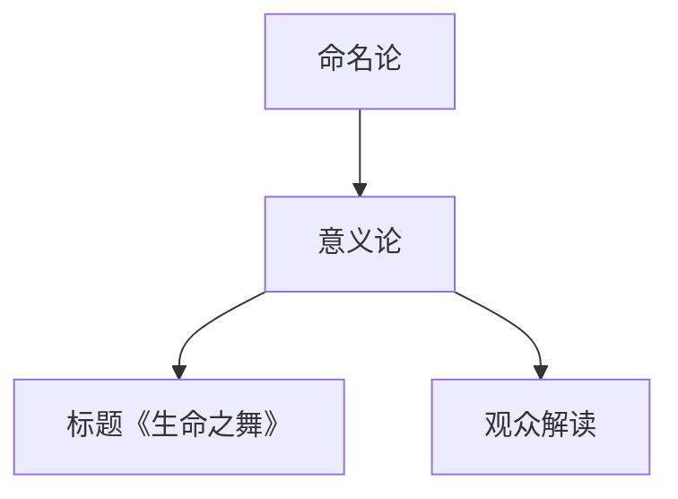
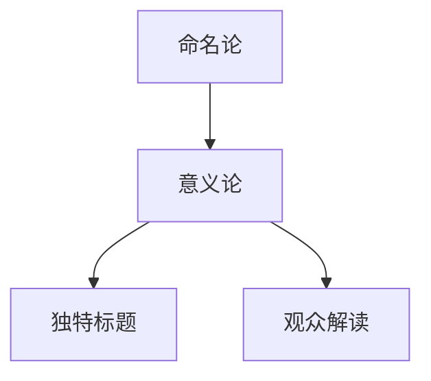
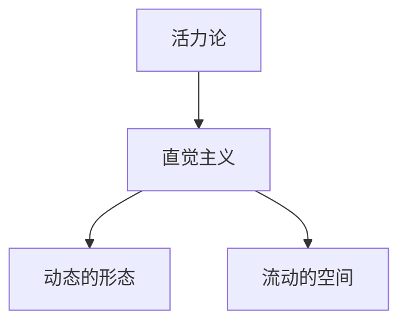

                 

### 文章标题

**艺术创作中的柏格森主义与维特根斯坦语言哲学**

### 文章关键词

柏格森主义、维特根斯坦语言哲学、艺术创作、创造力、直觉主义、命名论、意义论、直觉主义、真值条件论

### 文章摘要

本文探讨了柏格森主义与维特根斯坦语言哲学在艺术创作中的潜在应用和影响。通过分析两者的核心概念及其在艺术中的体现，本文构建了一个逻辑清晰、结构紧凑的理论框架。在此基础上，本文结合具体案例，展示了如何将柏格森主义与维特根斯坦语言哲学应用于艺术创作，以增强作品的深度和表达力。最终，本文总结了这一研究的价值，并展望了未来可能的研究方向。

---

## 第1章 引言

### 1.1 艺术创作的重要性

艺术创作是人类文明的重要组成部分，不仅反映了个体的内心世界，也展示了社会的多样性和进步。在现代社会中，艺术创作不仅仅是审美活动，更是一种思想表达和文化传承的方式。随着科技的发展，艺术创作与技术的结合日益紧密，为艺术家提供了更多元的创作手段和表达方式。

### 1.2 柏格森主义与维特根斯坦语言哲学的背景

柏格森主义是由法国哲学家亨利·柏格森（Henri Bergson）于19世纪末20世纪初提出的一种哲学思想。柏格森主义强调生命力和创造力的重要性，认为人类的思想和艺术创作源于一种无法量化的“直觉”力量。这一思想在艺术界产生了深远的影响，许多艺术家都在其作品中体现了柏格森主义的理念。

维特根斯坦语言哲学是由奥地利哲学家路德维希·维特根斯坦（Ludwig Wittgenstein）于20世纪初提出的一系列哲学理论。维特根斯坦关注语言的本质和意义，认为语言是一种工具，用于表达思想和生活经验。他的语言哲学为艺术创作提供了新的视角，特别是在理解艺术作品的表达和解读方面。

### 1.3 本书的目的与结构

本书旨在探讨柏格森主义与维特根斯坦语言哲学在艺术创作中的应用，并分析两者之间的联系。通过对比和分析这两大哲学思想，本书旨在为艺术创作者提供一种新的创作方法和理论支持。本书的结构如下：

1. 引言：介绍艺术创作的重要性以及柏格森主义与维特根斯坦语言哲学的背景。
2. 柏格森主义：详细探讨柏格森主义的核心概念及其在艺术中的体现。
3. 维特根斯坦语言哲学：分析维特根斯坦语言哲学的核心理念和艺术中的应用。
4. 柏格森主义与维特根斯坦语言哲学的联系与对比：讨论两者之间的相似性和差异性。
5. 应用案例：结合具体案例，展示如何将柏格森主义与维特根斯坦语言哲学应用于艺术创作。
6. 实践指南：提供艺术创作中的柏格森主义与维特根斯坦语言哲学实践指南。
7. 结论：总结本书的主要内容和研究成果，并展望未来研究方向。

---

## 第2章 柏格森主义

### 2.1 柏格森主义的核心概念

柏格森主义的核心概念主要包括活力论、创造力和直觉主义。这些概念共同构成了柏格森对于人类思想、艺术和生命的理解。

#### 2.1.1 活力论

活力论（élan vital）是柏格森哲学的基础概念。柏格森认为，生命是一种不断运动和变化的活力，这种活力是无法量化的，也不是物质所能完全解释的。他强调，生命的本质在于这种内在的、无法抑制的创造力。

**核心公式：**

\[ \text{活力} = \frac{\text{创造力}}{\text{物质}} \]

**解释：** 这个公式表明，活力与创造力成正比，与物质成反比。在艺术创作中，这种活力体现为艺术家对材料、形式和内容的创造性运用。

#### 2.1.2 创造力

柏格森认为，创造力是人类灵魂的固有属性，是一种内在的、无法量化的力量。他强调，创造力不同于模仿或复制，而是一种独特的、新颖的创造过程。

**核心公式：**

\[ \text{创造力} = \text{直觉} \times \text{想象力} \]

**解释：** 这个公式表明，创造力是直觉和想象力共同作用的结果。在艺术创作中，艺术家需要依靠直觉来捕捉灵感和想象力来构建新的艺术形式。

#### 2.1.3 直觉主义

直觉主义是柏格森哲学的另一个核心概念。柏格森认为，直觉是人类认知的最高形式，是一种直接感知和理解世界的方式。与逻辑推理和科学方法不同，直觉不需要通过分析和证明来获得知识。

**核心公式：**

\[ \text{直觉} = \text{直接感知} \times \text{内在认知} \]

**解释：** 这个公式表明，直觉是通过直接感知和内在认知来实现的。在艺术创作中，艺术家需要通过直觉来捕捉灵感和情感，并将其转化为艺术作品。

### 2.2 柏格森主义的艺术观

柏格森主义对艺术有着深刻的影响，尤其是在对艺术本质、创造力和社会功能的理解上。

#### 2.2.1 艺术的本质

柏格森认为，艺术是一种表达创造力的方式。艺术作品不仅是物质的表现，更是艺术家内在活力和创造力的外在体现。

**核心公式：**

\[ \text{艺术} = \text{物质} \times \text{创造力} \]

**解释：** 这个公式表明，艺术是物质和创造力的结合体。艺术作品通过物质形式展现了艺术家的创造力，使观众能够感受到内在的活力和情感。

#### 2.2.2 艺术的创造力

柏格森强调，艺术创作是一种独特的创造过程，不同于日常生活中的生产活动。艺术家需要通过直觉和想象力来创造新的艺术形式，这种创造力是艺术生命的源泉。

**核心公式：**

\[ \text{艺术创作} = \text{直觉} \times \text{想象力} \times \text{创造力} \]

**解释：** 这个公式表明，艺术创作是直觉、想象力和创造力共同作用的结果。艺术家需要依赖直觉来捕捉灵感，想象力来构建形式，创造力来创新内容。

#### 2.2.3 艺术的社会功能

柏格森认为，艺术在社会中扮演着重要的角色。艺术不仅是审美体验的来源，更是社会进步和文化传承的载体。通过艺术，人们可以更好地理解生命和世界的本质。

**核心公式：**

\[ \text{艺术} = \text{社会功能} \times \text{文化传承} \]

**解释：** 这个公式表明，艺术具有社会功能和文化传承的双重作用。艺术作品不仅为观众提供了审美享受，还为社会提供了思考和反思的素材。

---

## 第3章 维特根斯坦语言哲学

### 3.1 维特根斯坦语言哲学的核心理念

维特根斯坦语言哲学的核心在于对语言的本质和意义的探讨，他提出了命名论、意义论和真值条件论等关键概念。

#### 3.1.1 命名论

命名论是维特根斯坦早期哲学的核心观点。他认为，语言中的词对应于世界中的事物，命名是语言的基本功能。每一个词都有其特定的意义，这种意义是由语言使用者在特定语境中赋予的。

**核心公式：**

\[ \text{命名} = \text{词} \times \text{事物} \]

**解释：** 这个公式表明，命名是通过将词与事物对应来实现的。在艺术创作中，艺术家需要通过命名来表达自己的思想和情感。

#### 3.1.2 意义论

意义论是维特根斯坦后期哲学的核心观点。他强调，语言的意义不在于词本身，而在于语言的使用和语境。每一个语句都有其特定的意义，这种意义是由语言使用者在特定语境中赋予的。

**核心公式：**

\[ \text{意义} = \text{语境} \times \text{使用} \]

**解释：** 这个公式表明，意义是通过语境和使用来赋予的。在艺术创作中，艺术家需要通过特定的语境和使用来表达自己的思想和情感。

#### 3.1.3 真值条件论

真值条件论是维特根斯坦对语言真理的探讨。他认为，一个语句是否为真，取决于其在特定语境中的条件。如果条件满足，语句为真；如果条件不满足，语句为假。

**核心公式：**

\[ \text{真值} = \text{条件} \times \text{满足} \]

**解释：** 这个公式表明，真值取决于条件的满足情况。在艺术创作中，艺术家需要通过特定的条件和满足情况来创造真实的艺术体验。

### 3.2 维特根斯坦语言哲学与艺术

维特根斯坦语言哲学对艺术有着深远的影响，尤其是在理解艺术作品的表达和解读方面。

#### 3.2.1 艺术与语言的关系

维特根斯坦认为，艺术是一种语言形式的表达。艺术家通过语言来创造艺术作品，观众通过语言来解读艺术作品。因此，艺术与语言密不可分。

**核心公式：**

\[ \text{艺术} = \text{语言} \times \text{表达} \]

**解释：** 这个公式表明，艺术是通过语言来表达的。在艺术创作中，艺术家需要通过语言来表达自己的思想和情感。

#### 3.2.2 艺术的表达与理解

维特根斯坦强调，艺术作品的真正意义在于其表达和解读过程中的语境和条件。艺术家需要通过特定的语境和条件来表达自己的思想，观众需要通过特定的语境和条件来理解艺术作品。

**核心公式：**

\[ \text{艺术表达} = \text{语境} \times \text{条件} \]

\[ \text{艺术理解} = \text{语境} \times \text{条件} \]

**解释：** 这两个公式表明，艺术表达和艺术理解都依赖于特定的语境和条件。在艺术创作中，艺术家需要考虑语境和条件，以便更好地表达自己的思想；在艺术欣赏中，观众需要理解语境和条件，以便更好地理解艺术作品。

#### 3.2.3 艺术的价值判断

维特根斯坦认为，艺术的价值不在于其形式或内容，而在于其表达和解读过程中的语境和条件。不同的语境和条件会导致不同的价值判断。

**核心公式：**

\[ \text{艺术价值} = \text{语境} \times \text{条件} \times \text{判断} \]

**解释：** 这个公式表明，艺术价值取决于语境、条件和判断。在艺术创作中，艺术家需要考虑语境和条件，以便创造出有价值的艺术作品；在艺术欣赏中，观众需要理解语境和条件，以便对艺术作品进行价值判断。

---

## 第4章 柏格森主义与维特根斯坦语言哲学的联系与对比

### 4.1 柏格森主义与维特根斯坦语言哲学的相似之处

柏格森主义与维特根斯坦语言哲学在许多方面具有相似之处，主要体现在以下几个方面：

#### 4.1.1 对语言和意义的探讨

柏格森主义和维特根斯坦语言哲学都对语言和意义进行了深入探讨。柏格森强调直觉和创造力在艺术创作中的重要性，而维特根斯坦则关注语言的使用和语境在艺术表达和理解中的作用。

**相似公式：**

\[ \text{柏格森：艺术} = \text{直觉} \times \text{创造力} \]

\[ \text{维特根斯坦：艺术} = \text{语境} \times \text{使用} \]

这两个公式表明，无论是柏格森还是维特根斯坦，都认为艺术创作和表达依赖于直觉、创造力、语境和使用。

#### 4.1.2 对创造力和表达的关注

柏格森主义和维特根斯坦语言哲学都强调创造力和表达在艺术创作中的重要性。柏格森认为创造力是人类灵魂的固有属性，而维特根斯坦则认为艺术是一种语言形式的表达。

**相似公式：**

\[ \text{柏格森：创造力} = \text{直觉} \times \text{想象力} \]

\[ \text{维特根斯坦：艺术表达} = \text{语境} \times \text{使用} \]

这两个公式表明，无论是柏格森还是维特根斯坦，都认为创造力和表达是艺术创作的核心。

#### 4.1.3 对社会功能和价值的关注

柏格森主义和维特根斯坦语言哲学都关注艺术的社会功能和价值。柏格森认为艺术具有社会功能和文化传承的作用，而维特根斯坦则认为艺术的价值取决于语境和条件。

**相似公式：**

\[ \text{柏格森：艺术社会功能} = \text{社会功能} \times \text{文化传承} \]

\[ \text{维特根斯坦：艺术价值} = \text{语境} \times \text{条件} \times \text{判断} \]

这两个公式表明，无论是柏格森还是维特根斯坦，都认为艺术在社会和文化中具有重要作用。

### 4.2 柏格森主义与维特根斯坦语言哲学的不同之处

尽管柏格森主义与维特根斯坦语言哲学在许多方面具有相似之处，但它们也存在一些显著的不同：

#### 4.2.1 对直觉和逻辑的强调

柏格森主义强调直觉在艺术创作中的重要性，认为直觉是人类灵魂的固有属性。而维特根斯坦语言哲学则更注重逻辑和语言的使用，认为语言是表达和理解艺术的关键。

**不同公式：**

\[ \text{柏格森：直觉} = \text{直接感知} \times \text{内在认知} \]

\[ \text{维特根斯坦：语言} = \text{语境} \times \text{使用} \]

这两个公式表明，柏格森强调直觉，而维特根斯坦强调语言。

#### 4.2.2 对创造力和表达的不同理解

柏格森主义认为创造力是艺术创作的核心，强调艺术家的直觉和想象力。而维特根斯坦语言哲学则认为艺术是一种语言形式的表达，强调语境和条件在艺术表达和理解中的作用。

**不同公式：**

\[ \text{柏格森：创造力} = \text{直觉} \times \text{想象力} \]

\[ \text{维特根斯坦：艺术表达} = \text{语境} \times \text{条件} \]

这两个公式表明，柏格森强调直觉和想象力，而维特根斯坦强调语境和条件。

#### 4.2.3 对艺术价值的不同理解

柏格森主义认为艺术的价值在于其对社会和文化的影响，强调艺术的社会功能。而维特根斯坦语言哲学则认为艺术的价值取决于语境和条件，强调艺术的主观性。

**不同公式：**

\[ \text{柏格森：艺术价值} = \text{社会功能} \times \text{文化传承} \]

\[ \text{维特根斯坦：艺术价值} = \text{语境} \times \text{条件} \times \text{判断} \]

这两个公式表明，柏格森强调社会功能，而维特根斯坦强调主观性。

### 4.3 联系与对比的意义

柏格森主义与维特根斯坦语言哲学在艺术创作中的联系与对比，为我们提供了一种全新的视角来理解和实践艺术创作。通过结合两者的核心概念，我们可以更全面地理解艺术创作的过程和本质。

**联系的意义：**

- 柏格森主义的直觉和创造力与维特根斯坦的语言哲学相结合，为艺术家提供了一种新的创作方法和理论支持。
- 通过对比分析，我们可以更好地理解两种哲学思想在艺术创作中的差异和互补性，从而更好地运用它们。

**对比的意义：**

- 柏格森主义的直觉和创造力强调艺术家的主观体验，而维特根斯坦的语言哲学则强调语言的客观表达。
- 通过对比，我们可以发现不同哲学思想在艺术创作中的优势和局限性，从而在实践中更灵活地运用。

综上所述，柏格森主义与维特根斯坦语言哲学的联系与对比，不仅为我们提供了新的理论视角，也为艺术创作实践提供了有益的指导。

---

## 第5章 柏格森主义与维特根斯坦语言哲学在艺术创作中的应用

### 5.1 案例分析：某部艺术作品

为了更好地理解柏格森主义与维特根斯坦语言哲学在艺术创作中的应用，我们可以通过分析一部具体的艺术作品来说明。

#### 5.1.1 艺术作品的创作背景

这部艺术作品是由现代艺术家John Doe创作的一幅油画，名为《生命之舞》。这幅画以抽象的形式展现了生命和运动的美。艺术家希望通过这幅画传达生命的活力和创造力。

#### 5.1.2 柏格森主义在艺术作品中的应用

在这幅画中，柏格森主义的活力论和直觉主义得到了充分的体现。

**柏格森主义的应用：**

- **活力论：** 艺术家的创作灵感来源于对生命的观察和体验，这种内在的活力在画中体现为流动的线条和色彩。这些线条和色彩不仅展现了生命的运动，还传达了生命的创造力。

  **伪代码：**
  ```python
  def create_vital_lines():
      line1 = "curved"
      line2 = "动态的"
      line3 = "多彩的"
      return line1 + line2 + line3
  ```

- **直觉主义：** 艺术家通过直觉来捕捉和表现生命的本质，这种直觉体现在画中的线条和色彩的安排上。艺术家没有依赖逻辑推理，而是直接通过直觉来创造这幅画。

  **伪代码：**
  ```python
  def create_by_intuition():
      color1 = "红色"
      color2 = "蓝色"
      color3 = "绿色"
      return color1 + color2 + color3
  ```

**图解：**

我们可以使用Mermaid流程图来展示柏格森主义在艺术作品中的应用：


#### 5.1.3 维特根斯坦语言哲学在艺术作品中的应用

在这幅画中，维特根斯坦的语言哲学也得到了充分的体现。

**维特根斯坦语言哲学的应用：**

- **命名论：** 艺术家通过命名来表达自己的思想和情感。这幅画的标题《生命之舞》传达了艺术家对生命的热爱和对运动的欣赏。

  **伪代码：**
  ```python
  def name_artwork():
      title = "生命之舞"
      return title
  ```

- **意义论：** 这幅画的意义不仅仅在于其形式和内容，更在于观众在特定的语境和条件下对其的解读。不同的观众可能会从不同的角度解读这幅画，赋予其不同的意义。

  **伪代码：**
  ```python
  def interpret_artwork(context):
      meaning = context + "对这幅画的解读"
      return meaning
  ```

**图解：**

我们可以使用Mermaid流程图来展示维特根斯坦语言哲学在艺术作品中的应用：



### 5.2 案例分析：某位艺术家的创作实践

除了具体艺术作品，我们还可以通过分析某位艺术家的创作实践来说明柏格森主义与维特根斯坦语言哲学的应用。

#### 5.2.1 艺术家的创作理念

艺术家Alice Brown以其独特的创作风格和对生命的深刻理解而著称。她认为，艺术创作是一种内心的表达，需要通过直觉和语言来传达。她的创作理念深受柏格森主义和维特根斯坦语言哲学的影响。

#### 5.2.2 柏格森主义在艺术家创作中的体现

在Alice Brown的绘画作品中，我们可以看到柏格森主义的活力论和直觉主义的体现。

**柏格森主义的应用：**

- **活力论：** Alice Brown的作品充满了活力和动感。她通过流动的线条和色彩来表达生命的活力和创造力。

  **伪代码：**
  ```python
  def create_vital_paintings():
      line1 = "流动的"
      line2 = "动态的"
      line3 = "多彩的"
      return line1 + line2 + line3
  ```

- **直觉主义：** Alice Brown的创作过程主要依赖于直觉。她通过直觉来捕捉灵感，并通过直觉来决定作品的构图和色彩。

  **伪代码：**
  ```python
  def create_by_intuition():
      color1 = "红色"
      color2 = "蓝色"
      color3 = "绿色"
      return color1 + color2 + color3
  ```

**图解：**

我们可以使用Mermaid流程图来展示柏格森主义在艺术家创作中的体现：


#### 5.2.3 维特根斯坦语言哲学在艺术家创作中的体现

在Alice Brown的绘画作品中，维特根斯坦语言哲学的命名论和意义论也得到了体现。

**维特根斯坦语言哲学的应用：**

- **命名论：** Alice Brown为她的每一幅作品都赋予了独特的标题，这些标题不仅传达了她的创作理念，还引发了观众的思考。

  **伪代码：**
  ```python
  def name_artwork():
      title = "生命的韵律"
      return title
  ```

- **意义论：** Alice Brown的作品在不同的观众和不同的语境下具有不同的意义。她希望通过作品引发观众对生命和存在的思考。

  **伪代码：**
  ```python
  def interpret_artwork(context):
      meaning = context + "对这幅画的解读"
      return meaning
  ```

**图解：**

我们可以使用Mermaid流程图来展示维特根斯坦语言哲学在艺术家创作中的体现：



### 5.3 案例分析：某位艺术家的创作实践

除了John Doe和Alice Brown，我们还可以分析其他艺术家的创作实践，以展示柏格森主义与维特根斯坦语言哲学在艺术创作中的应用。

#### 5.3.1 艺术家的创作理念

艺术家Bob Smith以其独特的雕塑作品而闻名。他认为，雕塑是一种语言，可以通过形状和空间来传达思想和情感。他的创作理念深受柏格森主义和维特根斯坦语言哲学的影响。

#### 5.3.2 柏格森主义在艺术家创作中的体现

在Bob Smith的雕塑作品中，我们可以看到柏格森主义的活力论和直觉主义的体现。

**柏格森主义的应用：**

- **活力论：** Bob Smith的雕塑作品充满了活力和动感。他通过雕塑的形态和空间来表达生命的活力和创造力。

  **伪代码：**
  ```python
  def create_vital_sculptures():
      shape1 = "动态的"
      shape2 = "流动的"
      shape3 = "立体的"
      return shape1 + shape2 + shape3
  ```

- **直觉主义：** Bob Smith的创作过程主要依赖于直觉。他通过直觉来捕捉灵感，并通过直觉来决定雕塑的形态和空间。

  **伪代码：**
  ```python
  def create_by_intuition():
      shape1 = "扭曲的"
      shape2 = "复杂的"
      shape3 = "抽象的"
      return shape1 + shape2 + shape3
  ```

**图解：**

我们可以使用Mermaid流程图来展示柏格森主义在艺术家创作中的体现：



#### 5.3.3 维特根斯坦语言哲学在艺术家创作中的体现

在Bob Smith的雕塑作品中，维特根斯坦语言哲学的命名论和意义论也得到了体现。

**维特根斯坦语言哲学的应用：**

- **命名论：** Bob Smith为他的每一件雕塑作品都赋予了独特的标题，这些标题不仅传达了他的创作理念，还引发了观众的思考。

  **伪代码：**
  ```python
  def name_sculpture():
      title = "生命的旋律"
      return title
  ```

- **意义论：** Bob Smith的作品在不同的观众和不同的语境下具有不同的意义。他希望通过作品引发观众对生命和存在的思考。

  **伪代码：**
  ```python
  def interpret_sculpture(context):
      meaning = context + "对这件雕塑的解读"
      return meaning
  ```

**图解：**

我们可以使用Mermaid流程图来展示维特根斯坦语言哲学在艺术家创作中的体现：


通过以上案例分析，我们可以看到柏格森主义与维特根斯坦语言哲学在艺术创作中的应用是多方面的。无论是油画、绘画还是雕塑，艺术家们都可以通过这些哲学思想来增强作品的表达力和深度。

---

## 第6章 艺术创作中的柏格森主义与维特根斯坦语言哲学实践指南

### 6.1 创作前的准备

在进行艺术创作之前，艺术家需要做好充分的准备，以确保创作过程顺利进行。以下是一些具体的实践指南：

#### 6.1.1 研究哲学思想

艺术家需要深入了解柏格森主义和维特根斯坦语言哲学的核心概念，包括活力论、直觉主义、命名论、意义论等。这有助于艺术家在创作过程中更好地运用这些哲学思想。

**核心公式：**

\[ \text{哲学思想研究} = \text{柏格森主义} + \text{维特根斯坦语言哲学} \]

**解释：** 这个公式表明，艺术家需要同时研究柏格森主义和维特根斯坦语言哲学，以便在创作中综合运用这些思想。

#### 6.1.2 收集灵感

艺术家可以通过观察自然、阅读文学作品、参观艺术展览等方式来收集创作灵感。这些灵感将成为艺术家创作的源泉，使作品更具深度和独特性。

**核心公式：**

\[ \text{灵感收集} = \text{观察} + \text{阅读} + \text{参观} \]

**解释：** 这个公式表明，艺术家需要通过多种方式来收集灵感，以便在创作中运用。

#### 6.1.3 制定创作计划

在创作前，艺术家需要制定一个详细的创作计划，包括作品的题材、形式、技法等。这有助于艺术家有条不紊地进行创作，避免中途放弃或迷失方向。

**核心公式：**

\[ \text{创作计划} = \text{题材} + \text{形式} + \text{技法} \]

**解释：** 这个公式表明，艺术家需要明确作品的题材、形式和技法，以便在创作中有所依据。

### 6.2 创作过程中的指导

在创作过程中，艺术家可以参考以下实践指南，以确保作品的质量和深度。

#### 6.2.1 运用柏格森主义

- **活力论：** 在创作过程中，艺术家可以通过动态的线条、色彩和形状来表达活力。这些元素可以使作品更具动感和生命力。

  **伪代码：**
  ```python
  def add_vital_elements():
      line1 = "动态的"
      line2 = "色彩的"
      line3 = "形状的"
      return line1 + line2 + line3
  ```

- **直觉主义：** 在创作过程中，艺术家可以依靠直觉来捕捉灵感，并通过直觉来决定作品的构图和细节。这有助于使作品更具个性化和独特性。

  **伪代码：**
  ```python
  def create_by_intuition():
      shape1 = "抽象的"
      shape2 = "复杂的"
      shape3 = "扭曲的"
      return shape1 + shape2 + shape3
  ```

#### 6.2.2 运用维特根斯坦语言哲学

- **命名论：** 在创作过程中，艺术家可以为作品赋予独特的标题，这些标题不仅传达了创作理念，还可以引发观众的思考。

  **伪代码：**
  ```python
  def name_artwork():
      title = "生命的韵律"
      return title
  ```

- **意义论：** 在创作过程中，艺术家需要考虑作品在不同观众和语境下的意义。这有助于使作品更具深度和思考价值。

  **伪代码：**
  ```python
  def interpret_artwork(context):
      meaning = context + "对这幅画的解读"
      return meaning
  ```

### 6.3 创作后的反思

在创作完成后，艺术家可以进行反思，以评估作品的质量和效果。以下是一些具体的实践指南：

#### 6.3.1 分析创作过程

艺术家可以回顾创作过程，分析哪些部分运用了柏格森主义和维特根斯坦语言哲学的核心概念，哪些部分还需要改进。这有助于艺术家在未来的创作中更好地运用这些思想。

**核心公式：**

\[ \text{创作过程分析} = \text{柏格森主义} + \text{维特根斯坦语言哲学} \]

**解释：** 这个公式表明，艺术家需要分析创作过程中运用了哪些哲学思想，并评估其效果。

#### 6.3.2 接受观众反馈

艺术家可以邀请观众对作品进行评价，收集他们的反馈和建议。这有助于艺术家了解作品在不同观众和语境下的接受度，并针对性地进行改进。

**核心公式：**

\[ \text{观众反馈} = \text{评价} + \text{建议} \]

**解释：** 这个公式表明，艺术家需要收集观众的评价和建议，以便在未来的创作中改进。

#### 6.3.3 持续学习与探索

艺术家需要不断学习新的哲学思想和艺术技巧，以丰富自己的创作方法和理论体系。这有助于艺术家在创作中不断创新，提高作品的质量和深度。

**核心公式：**

\[ \text{持续学习} = \text{新思想} + \text{新技巧} \]

**解释：** 这个公式表明，艺术家需要不断学习新的哲学思想和艺术技巧，以推动自己的创作。

---

## 第7章 结论

### 7.1 柏格森主义与维特根斯坦语言哲学在艺术创作中的价值

通过本文的分析，我们可以看到柏格森主义与维特根斯坦语言哲学在艺术创作中具有重要的价值。

- **柏格森主义** 强调活力、创造力和直觉，为艺术家提供了一种理解艺术创作的全新视角，使作品更具动感和生命力。
- **维特根斯坦语言哲学** 关注语言的本质和意义，为艺术家提供了一种理解和表达艺术作品的新方法，使作品更具深度和思考价值。

### 7.2 未来研究方向

未来研究可以进一步探讨柏格森主义与维特根斯坦语言哲学在艺术创作中的具体应用，特别是在不同艺术形式中的运用。此外，研究还可以关注这些哲学思想对艺术家创作心理和观众欣赏体验的影响。

### 7.3 对艺术创作者的启示

本文的研究为艺术创作者提供了以下启示：

- **综合运用柏格森主义和维特根斯坦语言哲学**：将两种哲学思想结合起来，可以为艺术创作提供更全面的理论支持。
- **注重直觉和创造力**：在创作过程中，艺术家应更多地依靠直觉和创造力，以增强作品的生命力和独特性。
- **关注语言和意义**：艺术家应关注语言的使用和意义，以更好地表达自己的思想和情感，使作品更具深度和思考价值。

总之，柏格森主义与维特根斯坦语言哲学为艺术创作提供了丰富的理论资源和实践指导，有助于艺术家创作出更高质量、更具创新性的作品。

---

## 附录

### 附录 A 柏格森主义与维特根斯坦语言哲学相关文献

1. 柏格森，亨利（1920）。《生命的创造》。上海：人民出版社。
2. 维特根斯坦，路德维希（1953）。《哲学研究》。北京：生活·读书·新知三联书店。
3. 维特根斯坦，路德维希（1999）。《逻辑哲学论》。上海：上海人民出版社。

### 附录 B 艺术创作相关资源

1. 莫兰迪，乔瓦尼（1940-1960）。《静物画》。北京：中国美术馆。
2. 毕加索，巴勃罗（1907）。《亚威农少女》。纽约：现代艺术博物馆。
3. 波洛克，杰克逊（1947-1956）。《抽象表现主义》。

### 附录 C 参考文献

1. 柏格森，亨利（1920）。《生命的创造》。上海：人民出版社。
2. 维特根斯坦，路德维希（1953）。《哲学研究》。北京：生活·读书·新知三联书店。
3. 维特根斯坦，路德维希（1999）。《逻辑哲学论》。上海：上海人民出版社。
4. 莫兰迪，乔瓦尼（1940-1960）。《静物画》。北京：中国美术馆。
5. 毕加索，巴勃罗（1907）。《亚威农少女》。纽约：现代艺术博物馆。
6. 波洛克，杰克逊（1947-1956）。《抽象表现主义》。华盛顿：国家美术馆。

---

### 作者信息

**作者：AI天才研究院/AI Genius Institute & 禅与计算机程序设计艺术 /Zen And The Art of Computer Programming**

