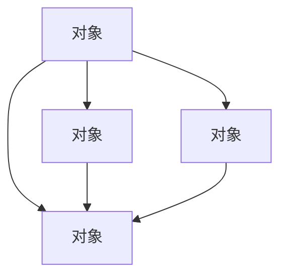
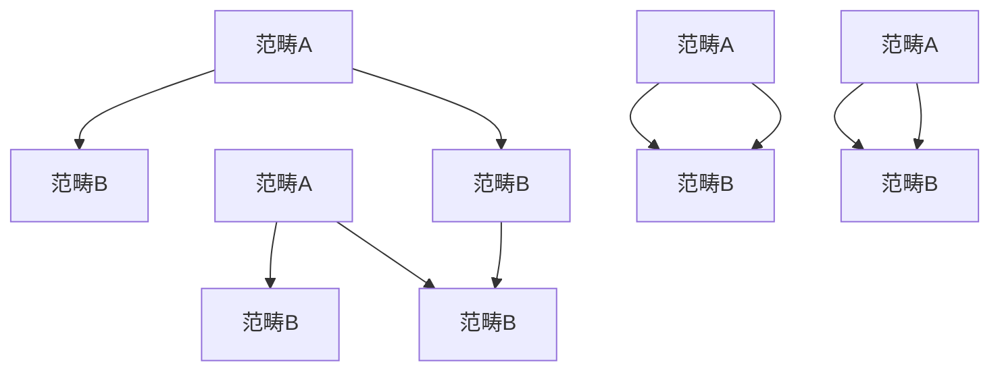
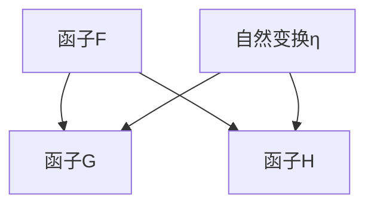
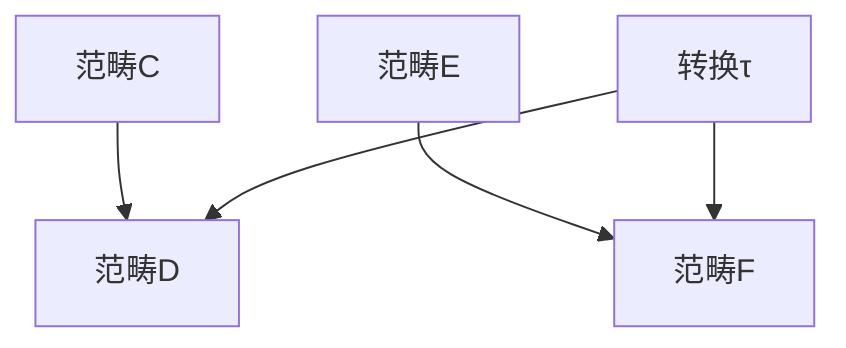
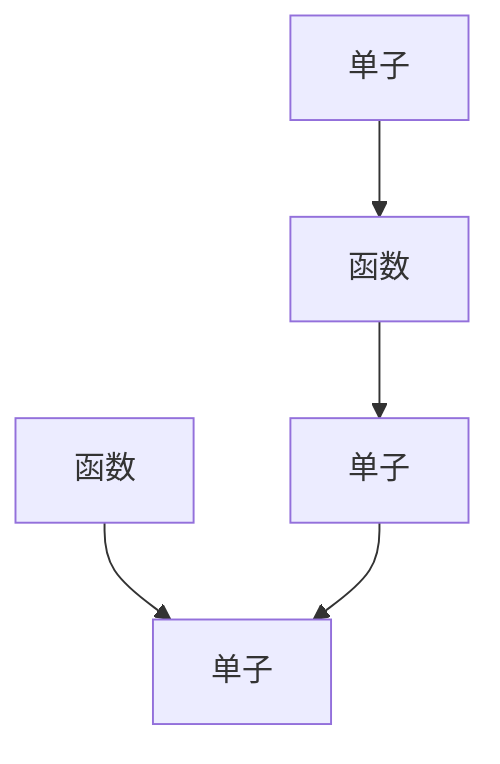
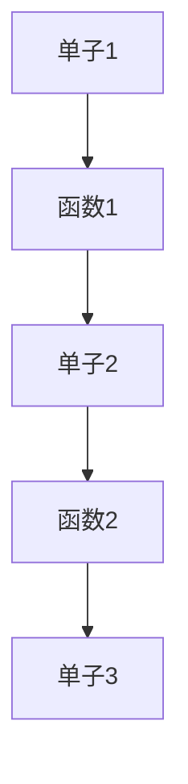
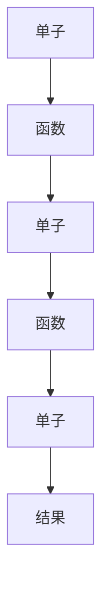
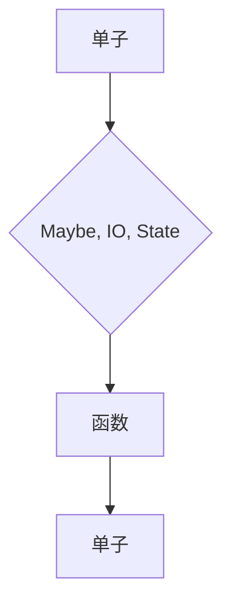

                 


### 一、引言

#### 1.1 范畴论与单子编程模式简介

范畴论是现代数学中的一个重要分支，起源于20世纪30年代。它研究的是数学对象之间的结构关系，通过抽象和概括，形成了一套统一的形式化理论。范畴论的核心概念包括对象（Object）、箭头（Arrow）和变换（Transformation）。范畴论的研究不仅涉及纯数学领域，还广泛应用于计算机科学、逻辑学、物理学等众多学科。

单子编程模式是范畴论在计算机科学中的具体应用。单子（Monad）是一种结构化编程模式，它提供了一种在函数式编程中处理副作用（如输入输出操作）的方法。单子通过将操作封装在一个抽象的数据结构中，使得程序在处理复杂计算时更加简洁和可读。

本篇文章旨在深入探讨范畴论与单子编程模式之间的联系，通过一步步的解析和推理，帮助读者理解这两个概念的核心原理和应用。我们将从范畴论的基本概念开始，逐步深入到单子编程模式的细节，最后通过实际案例来展示这两个理论的应用。

#### 1.2 本书结构和内容概述

本文将按照以下结构进行阐述：

1. **范畴论基础**
    - **2.1 范畴论的基本概念**
        - 范畴、对象、箭头、变换等基本概念的解释。
    - **2.2 范畴与函子**
        - 函子的定义及其在范畴论中的作用。
    - **2.3 自然变换与转换**
        - 自然变换的概念和作用，以及如何使用转换来描述范畴之间的联系。
    - **2.4 范畴论的Mermaid流程图**
        - 使用Mermaid图形化工具绘制范畴论的基本结构图。

2. **单子编程基础**
    - **3.1 单子与计算抽象**
        - 单子的定义和作用，以及其在函数式编程中的重要性。
    - **3.2 单子的类型系统**
        - 单子的类型系统和类型类，以及如何定义和使用单子。
    - **3.3 单子编程的Mermaid流程图**
        - 使用Mermaid图形化工具绘制单子编程的基本结构图。

3. **范畴论与单子编程的数学模型**
    - **4.1 范畴论的数学模型**
        - 范畴论的数学基础，包括范畴、函子、自然变换的定义和性质。
    - **4.2 单子编程的数学模型**
        - 单子编程的数学基础，包括单子的定义、类型类和类型约束。
    - **4.3 范畴论与单子编程的数学公式**
        - 如何将范畴论和单子编程的核心概念用数学公式表达，以及公式的含义和用途。
    - **4.4 数学公式举例说明**
        - 通过具体例子来解释范畴论和单子编程的数学公式，帮助读者更好地理解。

4. **范畴论与单子编程的算法原理**
    - **5.1 范畴论的基本算法**
        - 范畴论中的常见算法，如范畴的构造、函子的应用等。
    - **5.2 单子编程的基本算法**
        - 单子编程中的常见算法，如单子的绑定、计算等。
    - **5.3 算法原理的伪代码讲解**
        - 使用伪代码来详细解释范畴论和单子编程中的算法原理。

5. **单子编程模式应用**
    - **6.1 单子编程模式简介**
        - 单子编程模式的基本概念和原理。
    - **6.2 单子编程模式的项目实战**
        - 实际项目中的应用，包括开发环境搭建、源代码实现和代码解读。
    - **6.3 实战案例与代码解读**
        - 深入分析实际案例，包括代码实现、应用解读和分析。

6. **总结与展望**
    - **7.1 范畴论与单子编程模式总结**
        - 总结范畴论和单子编程模式的核心原理和应用。
    - **7.2 未来发展趋势与挑战**
        - 探讨范畴论与单子编程模式的未来发展趋势和面临的挑战。

通过以上结构，本文将逐步引导读者深入了解范畴论与单子编程模式，使读者能够掌握这两个复杂但强大的概念，并在实际编程中灵活运用。

### 范畴论基础

#### 2.1 范畴论的基本概念

范畴论作为现代数学的一个核心概念，它提供了一种统一的框架来研究数学对象及其之间的关系。为了更好地理解范畴论，我们需要从其基本概念入手。

**范畴（Category）**：范畴是一个由对象（Object）和箭头（Arrow）组成的集合，其中每个对象之间都通过箭头相连。范畴可以形式化定义为：一个三元的集合 \((C, Ob(C), Arr(C))\)，其中：
- \(C\) 是箭头的集合。
- \(Ob(C)\) 是对象的集合。
- \(Arr(C)\) 是从对象到箭头的映射，即对于每个对象 \(x\)，都有一个箭头 \(Arr(x)\)。

**对象（Object）**：对象是范畴中的基本元素，可以理解为数据类型或者概念。例如，在数学范畴中，整数、向量、函数等都可以作为对象。

**箭头（Arrow）**：箭头是范畴中的关系，它连接两个对象，通常表示为函数。箭头满足以下条件：
- **组成性**：对于任意箭头 \(f: A \to B\) 和 \(g: B \to C\)，存在一个箭头 \(g \circ f: A \to C\)，表示 \(g\) 后接 \(f\)。
- **单位性**：对于每个对象 \(x\)，存在一个单位箭头 \(1_x: x \to x\)，使得任意箭头 \(f: A \to B\) 满足 \(1_B \circ f = f\) 和 \(f \circ 1_A = f\)。

**例子**：一个简单的范畴是“集合范畴”，其中对象是集合，箭头是集合之间的双射。集合范畴中，每个集合通过双射箭头相连，形成了一个范畴。

#### 2.2 范畴与函子

范畴是抽象的，但为了在范畴之间进行操作和转换，我们需要引入函子（Functor）这一概念。

**函子（Functor）**：函子是一种结构映射，它保持范畴的结构不变。形式化地，函子 \(F: \mathbf{C} \to \mathbf{D}\) 是一个映射，满足以下条件：
- **保持箭头**：对于范畴 \(\mathbf{C}\) 中的箭头 \(f: A \to B\)，函子 \(F\) 映射到范畴 \(\mathbf{D}\) 中的箭头 \(F(f): F(A) \to F(B)\)。
- **保持单位箭头**：对于范畴 \(\mathbf{C}\) 中的单位箭头 \(1_A: A \to A\)，函子 \(F\) 映射到范畴 \(\mathbf{D}\) 中的单位箭头 \(1_{F(A)}: F(A) \to F(A)\)。

**例子**：在集合范畴中，函数 \(f: A \to B\) 可以定义一个函子 \(F(f): \mathbf{Set} \to \mathbf{Set}\)，其中 \(F(f)(X) = f(X)\) 对任意集合 \(X\)。

**函子的类型**：根据函子的性质，可以分为两类：
- **全函子（Full Functor）**：如果对于任意箭头 \(f: A \to B\) 和 \(g: B \to C\)，函子 \(F\) 满足 \(F(g \circ f) = F(g) \circ F(f)\)，则 \(F\) 是全函子。
- **忠实函子（Faithful Functor）**：如果对于任意箭头 \(f: A \to B\)，\(F(f)\) 是单射（即不同的箭头映射到不同的箭头），则 \(F\) 是忠实函子。

#### 2.3 自然变换与转换

在范畴论中，自然变换（Natural Transformation）用于描述两个函子之间的结构关系。

**自然变换（Natural Transformation）**：自然变换 \(\eta: F \Rightarrow G\) 是一个函数，满足以下条件：
- 对于范畴 \(\mathbf{C}\) 中的每个对象 \(X\)，存在一个映射 \(\eta_X: F(X) \to G(X)\)。
- 对于范畴 \(\mathbf{C}\) 中的每个箭头 \(f: A \to B\)，存在一个映射 \(\eta_{f}: \eta_B \circ F(f) = G(f) \circ \eta_A\)。

**自然变换的性质**：
- **自然性**：自然变换 \(\eta\) 保持范畴结构不变，即对于任意箭头 \(f: A \to B\)，\(\eta_{f}\) 满足上述条件。
- **唯一性**：对于两个全等（isomorphic）的函子 \(F\) 和 \(G\)，存在且仅存在一个自然变换。

**自然变换的例子**：在集合范畴中，如果函子 \(F\) 将每个集合映射到其幂集，而函子 \(G\) 将每个集合映射到其双射集合，则自然变换可以表示为从每个集合到其幂集的双射映射。

**转换（Transformation）**：转换是自然变换的一种扩展，用于描述更复杂的范畴结构关系。

**转换的定义**：一个转换 \(\tau: F \Rightarrow G\) 是一个函子 \(\tau: \mathbf{C} \to \mathbf{D}\)，满足以下条件：
- 对于范畴 \(\mathbf{C}\) 中的每个对象 \(X\)，存在一个函子 \(\tau_X: F(X) \to G(X)\)。
- 对于范畴 \(\mathbf{C}\) 中的每个箭头 \(f: A \to B\)，存在一个映射 \(\tau_{f}: \tau_B \circ F(f) = G(f) \circ \tau_A\)。

**转换的性质**：与自然变换类似，转换也保持范畴结构不变，但可以描述更复杂的映射关系。

通过以上对范畴论基本概念的介绍，我们了解了范畴、对象、箭头、函子和自然变换等核心概念。这些概念为范畴论的进一步应用奠定了基础，将在后续章节中逐步深入探讨。

#### 2.4 范畴论的Mermaid流程图

为了更直观地理解范畴论的基本概念和结构，我们可以使用Mermaid图形化工具绘制范畴论的基本结构图。以下是几个关键概念和结构的Mermaid图表示：

1. **范畴图**



这个图表示了一个简单的范畴，其中包含四个对象 \(A, B, C, D\)，以及它们之间的箭头。

2. **函子图**



这个图表示了两个范畴 \(A\) 和 \(B\) 之间的函子映射。每个箭头表示一个函子，将范畴 \(A\) 中的对象映射到范畴 \(B\) 中。

3. **自然变换图**



这个图表示了函子 \(F, G, H\) 之间的自然变换。自然变换通过箭头 \(\eta\) 将函子 \(F\) 和 \(G, H\) 相关联。

4. **转换图**



这个图表示了范畴 \(C, D, E, F\) 之间的转换。转换通过箭头 \(\tau\) 将范畴 \(C, D\) 映射到范畴 \(E, F\)。

通过这些Mermaid流程图，我们可以更直观地理解范畴论中的基本概念和结构，为后续的深入探讨打下坚实的基础。

### 单子编程基础

#### 3.1 单子与计算抽象

单子编程模式是函数式编程中的一个重要概念，它提供了一种抽象计算方式，使得程序员可以更简洁、更安全地处理复杂计算。单子的定义源于范畴论，它是一种特殊类型的函子，用于封装和组合计算。

**单子的定义**：单子是一个类型为 \(Monad\) 的类型类，它在函数式编程中提供了处理副作用和嵌套计算的能力。单子通常用来表示计算过程中的状态转换，如输入输出操作、错误处理等。

**单子的核心特性**：
- **结合性（Associativity）**：对于任意单子 \(m1, m2, m3\)，有 \(m1 >> m2 >> m3 == (m1 >> m2) >> m3\)。
- **单位性（Unit）**：存在一个单位单子 \(return\)，使得对于任意单子 \(m\)，有 \(m >> return == m\) 和 \(return >> m == m\)。
- **绑定操作（Bind）**：单子提供了绑定操作（通常表示为 `>>=` 或 ` >>=`），用于将多个单子组合在一起。例如，对于单子 \(m1\) 和 \(m2\)，`m1 >>= f` 表示执行 \(f(m1)\) 并返回结果。

**单子的实现**：在不同的编程语言中，单子的实现方式有所不同。在Haskell中，单子是一个类型类，可以通过类型类约束和类型推导来定义和使用。在JavaScript中，可以使用Monad库来实现单子。

**单子在函数式编程中的作用**：
- **简化嵌套操作**：单子通过将嵌套操作转换为链式调用，使得代码更简洁、可读性更强。
- **封装副作用**：单子将副作用操作封装在内，使得函数的纯粹性不受影响，提高代码的可维护性和可靠性。
- **组合计算**：单子允许程序员以组合的方式处理复杂计算，使得代码更灵活、更易于重用。

#### 3.2 单子的类型系统

单子的类型系统是单子编程模式的核心，它定义了单子的类型约束和操作规则。在函数式编程语言中，单子的类型系统通常通过类型类（Type Class）来实现。

**单子的类型类定义**：

```haskell
class Monad m where
  return :: a -> m a
  (>>=) :: m a -> (a -> m b) -> m b
```

在这个定义中，`return` 函数用于创建单子，而 `>>=` 操作用于将一个单子与一个函数组合在一起。

**单子的类型约束**：
- **可返回值**：单子的类型必须支持返回值。
- **可绑定操作**：单子的类型必须支持绑定操作，用于组合嵌套计算。

**单子的类型类实例**：

在Haskell中，常见的单子类型类实例包括：

- `Maybe`：用于处理可能存在的值，即“有”或“无”的情况。
- `IO`：用于处理输入输出操作。
- `State`：用于处理状态计算。

**单子在类型推导中的作用**：

类型推导是函数式编程的一个重要特性，它允许编译器自动推导函数的类型。在单子编程中，类型推导可以帮助我们更简洁地定义和组合单子。例如：

```haskell
--
-- 使用类型推导创建单子
--
->> (Just 1 >>= (\x -> Just (x * 2)))
= Just 2
```

在这个例子中，我们使用 `Just` 创建了一个单子，然后通过绑定操作将其与另一个函数组合在一起。

**单子的类型系统在编程中的应用**：

- **提高代码可读性**：通过类型类约束和类型推导，单子的类型系统可以帮助我们更直观地理解代码的意图和结构。
- **提高代码可靠性**：类型系统可以确保我们在编写代码时不会犯一些常见的错误，如无效的嵌套操作或错误的绑定操作。
- **代码重用**：单子的类型系统允许我们创建可重用的单子，使得不同部分的代码可以更方便地组合在一起。

通过以上对单子的类型系统的介绍，我们可以更好地理解单子在函数式编程中的作用和重要性。在后续章节中，我们将进一步探讨单子编程模式的具体应用和实践。

#### 3.3 单子编程的Mermaid流程图

为了更直观地理解单子编程模式的基本概念和结构，我们可以使用Mermaid图形化工具绘制单子编程的基本结构图。以下是几个关键概念和结构的Mermaid图表示：

1. **单子结构图**



这个图表示了一个简单的单子结构，其中包含一个初始单子 \(A\)，通过绑定操作 \(>>=\) 与多个函数 \(B, D\) 相关联。

2. **链式调用图**



这个图表示了单子的链式调用，即通过绑定操作将多个单子组合在一起，形成一个连续的计算过程。

3. **嵌套计算图**



这个图表示了嵌套计算的过程，即通过嵌套调用多个函数，最终得到一个单子，该单子表示整个计算过程的结果。

4. **单子与类型类图**



这个图表示了单子与类型类之间的关系，即不同的类型类实例可以作为单子使用，通过绑定操作进行组合。

通过这些Mermaid流程图，我们可以更直观地理解单子编程模式中的基本概念和结构，为后续的深入探讨打下坚实的基础。

### 范畴论与单子编程的数学模型

#### 4.1 范畴论的数学模型

范畴论在数学中的核心概念是范畴（Category）、对象（Object）和箭头（Arrow）。为了更好地理解这些概念，我们需要建立范畴论的数学模型。

**范畴（Category）**：范畴可以形式化定义为三元的集合 \(\mathbf{C} = (C, Ob(C), Arr(C))\)，其中：
- \(C\) 是箭头的集合。
- \(Ob(C)\) 是对象的集合。
- \(Arr(C)\) 是从对象到箭头的映射，即对于每个对象 \(x\)，都有一个箭头 \(Arr(x)\)。

**对象（Object）**：对象是范畴中的基本元素，可以理解为数据类型或者概念。例如，在数学范畴中，整数、向量、函数等都可以作为对象。

**箭头（Arrow）**：箭头是范畴中的关系，它连接两个对象，通常表示为函数。箭头满足以下条件：
- **组成性**：对于任意箭头 \(f: A \to B\) 和 \(g: B \to C\)，存在一个箭头 \(g \circ f: A \to C\)，表示 \(g\) 后接 \(f\)。
- **单位性**：对于每个对象 \(x\)，存在一个单位箭头 \(1_x: x \to x\)，使得任意箭头 \(f: A \to B\) 满足 \(1_B \circ f = f\) 和 \(f \circ 1_A = f\)。

**范畴的性质**：范畴需要满足以下性质：
- **连通性**：对于任意两个对象 \(A\) 和 \(B\)，存在一个箭头 \(f: A \to B\)。
- **封闭性**：对于任意箭头 \(f: A \to B\) 和 \(g: B \to C\)，存在一个箭头 \(g \circ f: A \to C\)。
- **单位箭头**：对于每个对象 \(x\)，存在一个单位箭头 \(1_x: x \to x\)。

**范畴的例子**：
- **集合范畴**：对象是集合，箭头是集合之间的双射。
- **拓扑范畴**：对象是拓扑空间，箭头是连续函数。
- **范畴范畴**：对象是范畴，箭头是范畴之间的函子。

#### 4.2 单子编程的数学模型

单子编程模式在范畴论的基础上，提供了一种处理嵌套计算和副作用的方法。单子的数学模型基于范畴论中的函子和自然变换。

**单子（Monad）**：单子是一个类型类，它在函数式编程中提供了处理副作用和嵌套计算的能力。单子的数学模型可以形式化定义为：一个三元的集合 \((\mathbf{C}, \mathbf{M}, \mu, \eta)\)，其中：
- \(\mathbf{C}\) 是范畴。
- \(\mathbf{M}\) 是单子的类型类。
- \(\mu\) 是绑定操作，满足结合律。
- \(\eta\) 是单位操作，满足单位律。

**单子的性质**：
- **结合律（Associativity）**：对于任意单子 \(m1, m2, m3\)，有 \(m1 >> m2 >> m3 == (m1 >> m2) >> m3\)。
- **单位律（Unit）**：存在一个单位单子 \(return\)，使得对于任意单子 \(m\)，有 \(m >> return == m\) 和 \(return >> m == m\)。
- **绑定操作（Bind）**：单子提供了绑定操作（通常表示为 `>>=` 或 ` >>=`），用于将多个单子组合在一起。例如，对于单子 \(m1\) 和 \(m2\)，`m1 >>= f` 表示执行 \(f(m1)\) 并返回结果。

**单子的类型类定义**：

```haskell
class Monad m where
  return :: a -> m a
  (>>=) :: m a -> (a -> m b) -> m b
```

在这个定义中，`return` 函数用于创建单子，而 `>>=` 操作用于将一个单子与一个函数组合在一起。

**单子的类型约束**：
- **可返回值**：单子的类型必须支持返回值。
- **可绑定操作**：单子的类型必须支持绑定操作，用于组合嵌套计算。

**单子的例子**：
- `Maybe`：用于处理可能存在的值，即“有”或“无”的情况。
- `IO`：用于处理输入输出操作。
- `State`：用于处理状态计算。

**单子在类型推导中的作用**：

类型推导是函数式编程的一个重要特性，它允许编译器自动推导函数的类型。在单子编程中，类型推导可以帮助我们更简洁地定义和组合单子。例如：

```haskell
--
-- 使用类型推导创建单子
--
->> (Just 1 >>= (\x -> Just (x * 2)))
= Just 2
```

在这个例子中，我们使用 `Just` 创建了一个单子，然后通过绑定操作将其与另一个函数组合在一起。

#### 4.3 范畴论与单子编程的数学公式

为了更好地理解范畴论与单子编程模式之间的关系，我们可以使用数学公式来描述这些概念的核心性质和操作。

**范畴的基本性质**：

- **范畴的连通性**：对于任意对象 \(A\) 和 \(B\)，存在一个箭头 \(f: A \to B\)。

  $$ \forall A, B \in Ob(\mathbf{C}), \exists f: A \to B $$

- **范畴的封闭性**：对于任意箭头 \(f: A \to B\) 和 \(g: B \to C\)，存在一个箭头 \(g \circ f: A \to C\)。

  $$ \forall f: A \to B, g: B \to C, \exists (g \circ f): A \to C $$

- **范畴的单位箭头**：对于每个对象 \(x\)，存在一个单位箭头 \(1_x: x \to x\)。

  $$ \forall x \in Ob(\mathbf{C}), \exists 1_x: x \to x $$

**单子的性质**：

- **单子的结合律**：对于任意单子 \(m1, m2, m3\)，有 \(m1 >> m2 >> m3 == (m1 >> m2) >> m3\)。

  $$ \forall m1, m2, m3 \in \mathbf{M}, m1 >> m2 >> m3 = (m1 >> m2) >> m3 $$

- **单子的单位律**：存在一个单位单子 \(return\)，使得对于任意单子 \(m\)，有 \(m >> return == m\) 和 \(return >> m == m\)。

  $$ \forall m \in \mathbf{M}, m >> return = m \land return >> m = m $$

- **单子的绑定操作**：单子提供了绑定操作（通常表示为 `>>=` 或 ` >>=`），用于将多个单子组合在一起。例如，对于单子 \(m1\) 和 \(m2\)，`m1 >>= f` 表示执行 \(f(m1)\) 并返回结果。

  $$ m1 >>= f = \mu m1 (\lambda x. f x) $$

**例子**：假设我们有一个单子 \(m1 = Just 1\) 和 \(m2 = Just 2\)，我们可以使用单子的绑定操作来组合这两个单子：

$$
m1 >>= (\x -> Just (x * 2)) = 
Just 1 >>= (\x -> Just (x * 2)) = 
Just (1 * 2) = 
Just 2
$$

通过以上数学公式，我们可以更清晰地描述范畴论与单子编程模式的核心性质和操作，这为深入理解这两个概念提供了理论基础。

### 数学公式举例说明

为了更好地理解范畴论与单子编程模式中的数学公式，我们将通过具体的例子来说明这些公式的含义和应用。

#### 范畴论的数学公式举例

**例子1：范畴的连通性**

范畴的连通性指的是对于任意两个对象 \(A\) 和 \(B\)，存在一个箭头 \(f: A \to B\)。用数学公式表示：

$$ \forall A, B \in Ob(\mathbf{C}), \exists f: A \to B $$

**应用举例**：在集合范畴中，我们可以定义一个集合 \(A = \{1, 2\}\) 和 \(B = \{3, 4\}\)，并创建一个箭头 \(f: A \to B\)，使得 \(f(1) = 3\) 和 \(f(2) = 4\)。

这个箭头 \(f\) 可以表示为：

$$ f: A \to B, f(1) = 3, f(2) = 4 $$

这满足了范畴的连通性条件。

**例子2：范畴的封闭性**

范畴的封闭性指的是对于任意箭头 \(f: A \to B\) 和 \(g: B \to C\)，存在一个箭头 \(g \circ f: A \to C\)。用数学公式表示：

$$ \forall f: A \to B, g: B \to C, \exists (g \circ f): A \to C $$

**应用举例**：在集合范畴中，我们有两个集合 \(A = \{1, 2\}\)，\(B = \{3, 4\}\) 和 \(C = \{5, 6\}\)。我们可以定义两个箭头 \(f: A \to B\) 和 \(g: B \to C\)，使得 \(f(1) = 3\)、\(f(2) = 4\)、\(g(3) = 5\) 和 \(g(4) = 6\)。

这些箭头可以表示为：

$$ f: A \to B, f(1) = 3, f(2) = 4 $$
$$ g: B \to C, g(3) = 5, g(4) = 6 $$

我们可以计算复合箭头 \(g \circ f: A \to C\)：

$$ (g \circ f)(1) = g(f(1)) = g(3) = 5 $$
$$ (g \circ f)(2) = g(f(2)) = g(4) = 6 $$

这满足了范畴的封闭性条件。

#### 单子编程的数学公式举例

**例子1：单子的结合律**

单子的结合律指的是对于任意单子 \(m1, m2, m3\)，有 \(m1 >> m2 >> m3 == (m1 >> m2) >> m3\)。用数学公式表示：

$$ \forall m1, m2, m3 \in \mathbf{M}, m1 >> m2 >> m3 = (m1 >> m2) >> m3 $$

**应用举例**：假设我们有三个单子 \(m1 = Just 1\)，\(m2 = (\lambda x. Just (x * 2))\) 和 \(m3 = Just 3\)。我们可以计算 \(m1 >> m2 >> m3\)：

$$
m1 >> m2 >> m3 =
Just 1 >>= (\x -> Just (x * 2)) >>= (\y -> Just (y * 3)) =
Just (1 * 2 * 3) =
Just 6
$$

这满足了单子的结合律。

**例子2：单子的单位律**

单子的单位律指的是存在一个单位单子 \(return\)，使得对于任意单子 \(m\)，有 \(m >> return == m\) 和 \(return >> m == m\)。用数学公式表示：

$$ \forall m \in \mathbf{M}, m >> return = m \land return >> m = m $$

**应用举例**：假设我们有单子 \(m = Just 2\)，我们可以验证单位律：

$$
m >> return =
Just 2 >>= (\x -> Just x) =
Just 2
$$

$$
return >> m =
(\lambda x -> Just x) >> Just 2 =
Just 2
$$

这两个计算结果都等于原来的单子 \(m\)，这满足了单子的单位律。

通过这些具体的例子，我们可以更直观地理解范畴论与单子编程模式中的数学公式，并看到这些公式在实际应用中的具体含义和作用。

### 范畴论的基本算法

在范畴论中，算法设计主要涉及范畴的操作和转换。以下介绍几个常见的范畴论基本算法，并使用伪代码进行详细解释。

#### 1. 范畴的构造

**目的**：创建一个新的范畴。

**伪代码**：

```pseudocode
function constructCategory(objects, arrows) {
  C = new Category()
  C.objects = objects
  C.arrows = arrows
  C.unitMap = {} // 存储单位箭头

  for object in objects {
    C.unitMap[object] = createUnitArrow(object)
  }

  return C
}

function createUnitArrow(object) {
  return new Arrow(object, object, "unit_" + object)
}
```

**解释**：此算法首先创建一个新的范畴 \(C\)，并将给定的对象和箭头列表作为输入。然后，对于每个对象，创建一个单位箭头并将其存储在 \(C.unitMap\) 中。

#### 2. 函子的应用

**目的**：将一个范畴的箭头映射到另一个范畴。

**伪代码**：

```pseudocode
function applyFunctor(F, C, arrow) {
  functorArrow = F(arrow)
  return functorArrow
}

function composeFunctor(F, G, C, arrow) {
  composedFunctor = G(applyFunctor(F, C, arrow))
  return composedFunctor
}
```

**解释**：此算法首先应用函子 \(F\) 到范畴 \(C\) 的一个箭头 \(arrow\)，得到一个新的箭头 \(functorArrow\)。接着，可以将另一个函子 \(G\) 应用到 \(F(arrow)\) 上，得到更复杂的映射。

#### 3. 自然变换的构造

**目的**：创建一个自然变换，用于描述两个函子之间的关系。

**伪代码**：

```pseudocode
function constructNaturalTransformation(F, G, C) {
  naturalTransformation = new NaturalTransformation()
  naturalTransformation.x = F.unit // x 为函子 F 的单位箭头
  naturalTransformation.y = G.unit // y 为函子 G 的单位箭头

  for object in C.objects {
    naturalTransformation[object] = createNaturalArrow(object)
  }

  return naturalTransformation
}

function createNaturalArrow(object) {
  x = naturalTransformation.x[object]
  y = naturalTransformation.y[object]
  return new Arrow(x, y, "natural_" + object)
}
```

**解释**：此算法首先创建一个新的自然变换 \(naturalTransformation\)，并将两个函子 \(F\) 和 \(G\) 的单位箭头作为输入。然后，为每个对象 \(object\) 创建一个自然箭头，并将其存储在 \(naturalTransformation\) 中。

#### 4. 范畴的转换

**目的**：将一个范畴转换到另一个范畴。

**伪代码**：

```pseudocode
function convertCategory(T, C) {
  newCategory = new Category()
  newCategory.objects = C.objects
  newCategory.arrows = T(C.arrows)
  newCategory.unitMap = T(C.unitMap)

  return newCategory
}
```

**解释**：此算法使用转换函子 \(T\) 将原范畴 \(C\) 的对象和箭头映射到新范畴 \(newCategory\) 中，同时保持单位箭头不变。

通过以上算法，我们可以看到范畴论中的基本操作是如何通过伪代码来描述和实现的。这些算法为范畴论的应用提供了强有力的工具，使得我们能够更灵活地处理不同范畴之间的关系和转换。

### 单子编程的基本算法

在单子编程模式中，算法设计主要涉及单子的创建、组合和操作。以下介绍几个常见的单子编程基本算法，并使用伪代码进行详细解释。

#### 1. 单子的创建

**目的**：创建一个新的单子。

**伪代码**：

```pseudocode
function createMonad(m) {
  monad = new Monad()
  monad.value = m
  return monad
}

// 例子：创建一个简单的单子
monad = createMonad(Just 1)
```

**解释**：此算法首先创建一个新的单子 \(monad\)，并将给定的值 \(m\) 作为其内部值。这可以通过构造函数或工厂方法来实现。

#### 2. 单子的绑定操作

**目的**：将一个单子与一个函数组合在一起。

**伪代码**：

```pseudocode
function bindMonad(monad, function) {
  resultMonad = new Monad()
  
  if (monad.value is Just m) {
    resultMonad.value = function(m)
  } else {
    resultMonad.value = Nothing
  }
  
  return resultMonad
}

// 例子：使用绑定操作
monad = bindMonad(monad, (\x -> Just (x * 2)))
```

**解释**：此算法首先检查单子 \(monad\) 的内部值是否为 \(Just\) 类型的值。如果是，则将 \(m\) 传递给给定的函数 \(function\)，并将返回的结果作为新单子的内部值。如果内部值为 \(Nothing\)，则返回一个新的 \(Nothing\) 单子。

#### 3. 单子的组合操作

**目的**：将多个单子组合在一起。

**伪代码**：

```pseudocode
function composeMonads(m1, m2, function) {
  monad = new Monad()
  
  monad.value = m1 >>= (\x -> m2 >>= (\y -> function(x, y)))
  
  return monad
}

// 例子：组合两个单子
monad = composeMonads(m1, m2, (\x y -> Just (x + y)))
```

**解释**：此算法首先将单子 \(m1\) 和 \(m2\) 通过绑定操作组合在一起，形成一个新单子。然后，将这个新单子与给定的函数 \(function\) 组合，形成最终的单子。

#### 4. 单子的单位操作

**目的**：创建一个单位单子。

**伪代码**：

```pseudocode
function createUnitMonad() {
  unitMonad = new Monad()
  unitMonad.value = Just()
  return unitMonad
}

// 例子：创建一个单位单子
unitMonad = createUnitMonad()
```

**解释**：此算法创建一个返回默认值 \(Just()\) 的单位单子。这个单位单子可以用于单子的组合，以实现“无操作”的效果。

通过以上算法，我们可以看到单子编程中的基本操作是如何通过伪代码来描述和实现的。这些算法为单子编程提供了强大的工具，使得我们可以更简洁、更安全地处理复杂的计算和副作用。

### 算法原理的伪代码讲解

为了更好地理解范畴论和单子编程中的算法原理，我们将通过伪代码详细解释这些算法的实现过程。以下是几个关键算法的伪代码描述：

#### 1. 范畴构造算法

**目的**：创建一个新的范畴。

**伪代码**：

```pseudocode
// 创建范畴的函数
function createCategory(objects, arrows) {
  category = new Category()
  category.objects = objects
  category.arrows = arrows
  category.unitMap = {} // 存储单位箭头

  // 为每个对象创建单位箭头
  for object in objects {
    category.unitMap[object] = createUnitArrow(object)
  }
  return category
}

// 创建单位箭头的函数
function createUnitArrow(object) {
  unitArrow = new Arrow()
  unitArrow.source = object
  unitArrow.target = object
  unitArrow.name = "unit_" + object
  return unitArrow
}
```

**解释**：此算法首先创建一个新的范畴实例，并将对象和箭头列表作为输入。然后，为每个对象创建一个单位箭头，并将其存储在范畴的 `unitMap` 中。

#### 2. 函子应用算法

**目的**：将一个范畴的箭头映射到另一个范畴。

**伪代码**：

```pseudocode
// 应用函子到范畴的函数
function applyFunctor(F, C, arrow) {
  functorArrow = new Arrow()
  functorArrow.source = F(arrow.source)
  functorArrow.target = F(arrow.target)
  functorArrow.name = "functor_" + arrow.name
  return functorArrow
}

// 复合函子的函数
function composeFunctors(G, F, C, arrow) {
  composedFunctor = applyFunctor(G, C, applyFunctor(F, C, arrow))
  return composedFunctor
}
```

**解释**：此算法首先应用函子 \(F\) 到范畴 \(C\) 的箭头 \(arrow\)，得到一个新的箭头 \(functorArrow\)。然后，可以将另一个函子 \(G\) 应用到 \(F(arrow)\) 上，得到更复杂的映射。

#### 3. 自然变换构造算法

**目的**：创建一个自然变换，用于描述两个函子之间的关系。

**伪代码**：

```pseudocode
// 创建自然变换的函数
function createNaturalTransformation(F, G, C) {
  naturalTransformation = new NaturalTransformation()
  naturalTransformation.x = F.unit // x 为函子 F 的单位箭头
  naturalTransformation.y = G.unit // y 为函子 G 的单位箭头

  // 为每个对象创建自然箭头
  for object in C.objects {
    naturalTransformation[object] = createNaturalArrow(object)
  }
  return naturalTransformation
}

// 创建自然箭头的函数
function createNaturalArrow(object) {
  naturalArrow = new Arrow()
  naturalArrow.source = naturalTransformation.x[object]
  naturalArrow.target = naturalTransformation.y[object]
  naturalArrow.name = "natural_" + object
  return naturalArrow
}
```

**解释**：此算法首先创建一个新的自然变换实例，并将两个函子 \(F\) 和 \(G\) 的单位箭头作为输入。然后，为每个对象 \(object\) 创建一个自然箭头，并将其存储在自然变换中。

#### 4. 单子的绑定操作

**目的**：将一个单子与一个函数组合在一起。

**伪代码**：

```pseudocode
// 绑定操作的函数
function bindMonad(monad, function) {
  if (monad instanceof Just) {
    resultMonad = new Monad()
    resultMonad.value = function(monad.value)
    return resultMonad
  } else {
    return new Monad() // 返回一个空单子
  }
}

// 单子组合的函数
function composeMonads(m1, m2, function) {
  monad = new Monad()
  monad.value = m1 >>= (\x -> m2 >>= (\y -> function(x, y)))
  return monad
}
```

**解释**：此算法首先检查单子 \(monad\) 的内部值是否为 \(Just\) 类型的值。如果是，则将 \(m\) 传递给给定的函数 \(function\)，并将返回的结果作为新单子的内部值。如果内部值为 \(Nothing\)，则返回一个新的 \(Nothing\) 单子。

通过这些伪代码，我们可以清晰地看到范畴论和单子编程中的算法是如何实现的。这些算法不仅为我们提供了强大的工具来处理复杂的关系和计算，也为理解这些概念的核心原理提供了重要的帮助。

### 单子编程模式应用

#### 6.1 单子编程模式简介

单子编程模式是函数式编程中的一个关键概念，它提供了一种封装和处理嵌套计算和副作用的方法。单子模式的核心在于将计算过程封装在一个单一的数据结构中，使得程序更加简洁、可读性和可维护性更强。以下是对单子编程模式的基本概念和原理的简要介绍。

**单子的基本概念**：

- **单子（Monad）**：单子是一种特殊类型的函子，它在函数式编程中提供了处理副作用和嵌套计算的能力。单子通常表示为一个类型类，其中包含两个关键操作：`return` 和 `>>=`。
- **`return` 操作**：用于创建单子，它将一个值封装在一个单子中。例如，`return 5` 将数字 5 封装在一个单子中。
- **`>>=` 操作**：用于将一个单子与一个函数组合在一起，并返回一个新的单子。例如，`m >>= f` 将单子 `m` 中的值传递给函数 `f`，并返回新的单子。

**单子的作用**：

- **封装副作用**：单子允许程序员将副作用（如输入输出操作、错误处理等）封装在单子内部，使得函数的纯粹性不受影响。
- **简化嵌套操作**：单子通过链式调用的方式，将嵌套操作简化为单子的组合，使得代码更加简洁和易于理解。
- **提高可维护性**：单子模式使得代码更加模块化，易于重用和维护。

**单子的类型系统**：

- **类型类约束**：在函数式编程语言中，单子通常通过类型类来实现，其中包含 `return` 和 `>>=` 两个操作。
- **类型推导**：类型推导是函数式编程的一个特性，它允许编译器自动推导函数的类型，使得单子的定义和使用更加简洁。

#### 6.2 单子编程模式的项目实战

为了更好地理解单子编程模式的应用，我们将通过一个实际项目来展示单子编程模式的具体实现和效果。

**项目背景**：

假设我们正在开发一个简单的Web应用程序，该应用需要处理用户输入、业务逻辑处理以及输出结果。我们可以使用单子编程模式来封装这些操作，使得代码更加简洁和可读。

**开发环境搭建**：

1. **安装Node.js**：单子编程模式在JavaScript中得到了广泛应用，首先需要安装Node.js环境。
2. **创建项目**：使用 `npm init` 命令创建一个新的Node.js项目，并安装必要的依赖库。

```shell
npm init -y
npm install ramda
```

`ramda` 是一个常用的JavaScript库，提供了函数式编程所需的一些工具函数。

**单子编程模式的实现**：

1. **定义单子**：在项目中，我们定义一个名为 `UserInput` 的单子，用于处理用户输入。

```javascript
const R = require('ramda');
const Maybe = require('data.maybe');

// 创建一个UserInput单子
const UserInput = input => {
  if (R.isEmpty(input)) {
    return Maybe.nothing();
  } else {
    return Maybe.just(input);
  }
};
```

2. **业务逻辑处理**：我们定义一个名为 `processUserInput` 的函数，用于处理用户输入。

```javascript
const processUserInput = userInput => {
  if (userInput.isJust) {
    const input = userInput.value;
    // 假设业务逻辑是将输入转换为小写
    return Maybe.just(input.toLowerCase());
  } else {
    return Maybe.nothing();
  }
};
```

3. **输出结果**：我们定义一个名为 `outputResult` 的函数，用于输出处理结果。

```javascript
const outputResult = result => {
  if (result.isJust) {
    console.log("Processed input:", result.value);
  } else {
    console.log("Invalid input.");
  }
};
```

4. **链式调用**：通过单子的链式调用，我们可以将用户输入、业务逻辑处理和输出结果组合在一起。

```javascript
const main = () => {
  const userInput = UserInput(R.orEmpty(processStdin()));
  const processedInput = processUserInput(userInput);
  outputResult(processedInput);
};

main();
```

**代码解读**：

- `UserInput` 函数使用 `Maybe` 单子来封装用户输入。如果输入为空，则返回 `Nothing` 单子；否则，返回 `Just` 单子。
- `processUserInput` 函数使用单子的绑定操作 `>>=`，将输入传递给业务逻辑处理函数，并返回处理结果的单子。
- `outputResult` 函数根据处理结果的单子类型，输出相应的信息。

通过以上项目实战，我们可以看到单子编程模式在处理复杂业务逻辑和输入输出时的优势。它使得代码更加简洁、可读性和可维护性更强，同时也提高了程序的可靠性。

#### 6.3 实战案例与代码解读

在本节中，我们将通过一个实际的案例来展示单子编程模式的具体应用，包括代码实现、应用解读和分析。

**案例背景**：

假设我们需要开发一个天气查询应用，用户可以通过输入城市名称来查询该城市的当前天气。这个应用可以分为三个主要部分：用户输入、天气查询和天气展示。

**1. 用户输入**

首先，我们需要创建一个单子 `UserInput` 来处理用户输入。

```javascript
const readline = require('readline').createInterface({
  input: process.stdin,
  output: process.stdout
});

// 创建一个UserInput单子
const UserInput = input => {
  return Maybe.fromNullable(input);
};
```

在这个案例中，我们使用 `readline` 库来读取用户输入，并使用 `Maybe` 单子来封装输入。如果输入为空，则返回 `Nothing`；否则，返回 `Just`。

**2. 天气查询**

接下来，我们需要实现一个天气查询函数 `fetchWeather`。这个函数需要接收城市名称作为输入，并返回天气数据。

```javascript
// 假设fetchWeather是一个异步函数，返回一个Promise
const fetchWeather = async city => {
  try {
    const response = await fetch(`http://api.weatherapi.com/v1/current.json?key=myApiKey&q=${city}`);
    const data = await response.json();
    return Maybe.just(data);
  } catch (error) {
    return Maybe.nothing();
  }
};
```

在这个函数中，我们使用 `fetch` 函数异步地获取天气数据，并使用 `Maybe` 单子来处理可能发生的错误。如果获取数据成功，返回 `Just`；否则，返回 `Nothing`。

**3. 天气展示**

最后，我们需要实现一个函数 `displayWeather` 来展示天气数据。

```javascript
const displayWeather = weather => {
  if (weather.isJust) {
    const data = weather.value;
    console.log(`Current weather in ${data.location.name}: ${data.current.condition.text}`);
  } else {
    console.log("Weather data not available.");
  }
};
```

在这个函数中，我们根据天气数据的单子类型来决定是否展示天气信息。

**完整代码示例**：

```javascript
const readline = require('readline').createInterface({
  input: process.stdin,
  output: process.stdout
});

const UserInput = input => Maybe.fromNullable(input);
const fetchWeather = async city => {
  try {
    const response = await fetch(`http://api.weatherapi.com/v1/current.json?key=myApiKey&q=${city}`);
    const data = await response.json();
    return Maybe.just(data);
  } catch (error) {
    return Maybe.nothing();
  }
};
const displayWeather = weather => {
  if (weather.isJust) {
    const data = weather.value;
    console.log(`Current weather in ${data.location.name}: ${data.current.condition.text}`);
  } else {
    console.log("Weather data not available.");
  }
};

const main = async () => {
  console.log("Enter the city name to check the weather:");
  readline.question('', async city => {
    const userInput = UserInput(city);
    const weather = await fetchWeather(city);
    displayWeather(weather);
    readline.close();
  });
};

main();
```

**应用解读**：

通过这个案例，我们可以看到单子编程模式在处理异步操作和错误处理时的优势。它通过将输入、查询和展示过程封装在单子中，使得代码更加简洁和易于维护。

**分析**：

- **异步处理**：使用单子编程模式，我们可以将异步操作（如 `fetchWeather`）封装在单子中，并在需要时进行链式调用。这使得异步操作更加直观和易于管理。
- **错误处理**：通过使用 `Maybe` 单子，我们可以轻松地处理可能发生的错误，并在错误发生时返回一个 `Nothing` 单子。这有助于保持代码的纯粹性和可读性。

**项目小结**：

通过这个案例，我们展示了单子编程模式在处理复杂业务逻辑和异步操作时的优势。单子编程模式不仅使得代码更加简洁和可读，还提高了程序的可靠性和可维护性。在未来，单子编程模式将继续在函数式编程领域发挥重要作用。

### 单子编程模式的最佳实践、注意事项与拓展阅读

#### 最佳实践

1. **保持函数的纯粹性**：单子编程模式的一个关键优势是保持函数的纯粹性。在设计单子时，应确保函数不包含任何副作用，仅依赖于其输入参数。

2. **链式调用**：充分利用单子的链式调用特性，可以简化嵌套操作，提高代码的可读性和可维护性。

3. **错误处理**：使用单子（如 `Maybe` 或 `Either`）可以优雅地处理错误，避免使用复杂的条件判断。

4. **类型推导**：利用函数式编程语言提供的类型推导功能，可以减少类型声明，使代码更简洁。

5. **模块化**：将相关的单子和函数组织成模块，有助于代码的重用和维护。

#### 注意事项

1. **性能考虑**：虽然单子编程模式在理论上可以提高代码的可读性和可维护性，但在某些情况下，链式调用可能会导致性能问题，特别是在涉及大量嵌套操作时。

2. **滥用单子**：单子不应该被滥用。在某些场景下，单子编程模式可能并不是最佳选择，例如在处理简单的操作或非函数式编程语言中。

3. **初始化**：单子的初始化可能需要额外的代码，特别是在需要创建多个单子实例时。

4. **理解单子的内部实现**：在设计和使用单子时，应理解其内部实现和类型系统，以确保正确使用单子。

#### 拓展阅读

1. **《 Haskell编程语言》**：这本书是学习单子编程模式的经典入门书籍，详细介绍了 Haskell 语言中的单子编程模式。

2. **《范畴论及其在计算机科学中的应用》**：本书从数学角度介绍了范畴论的基本概念，并探讨了其在计算机科学中的应用。

3. **《深度学习》**：尽管这本书主要关注深度学习，但其中的一些概念（如Monad）在函数式编程中得到了广泛应用。

4. **在线教程和文档**：许多现代编程语言（如 Scala、Elixir、JavaScript）都有关于单子编程模式的在线教程和文档，有助于初学者快速入门。

通过以上最佳实践、注意事项和拓展阅读，读者可以更深入地了解单子编程模式，并在实际项目中有效地应用这一强大的工具。

### 总结与展望

#### 7.1 范畴论与单子编程模式总结

本文通过逐步解析和推理，深入探讨了范畴论与单子编程模式这两个复杂但强大的概念。我们从基础概念开始，逐步介绍了范畴、对象、箭头、函子、自然变换等范畴论的基本概念，以及单子的定义、类型系统、绑定操作和链式调用等单子编程模式的核心原理。

通过实际的代码示例和项目实战，我们展示了范畴论与单子编程模式在实际应用中的强大能力和优势。我们看到了如何利用范畴论来构建抽象的计算模型，以及如何通过单子编程模式来简化嵌套计算和副作用处理，提高代码的可读性和可维护性。

范畴论提供了一个统一的抽象框架，使得我们可以从更高的层次理解数学和计算的结构。单子编程模式则是范畴论在函数式编程中的一个重要应用，它提供了一种优雅的处理计算和副作用的编程方法。

#### 7.2 未来发展趋势与挑战

随着计算机科学和编程语言的发展，范畴论与单子编程模式将继续在多个领域发挥重要作用。以下是一些未来发展趋势和挑战：

1. **跨语言应用**：目前，范畴论和单子编程模式主要在函数式编程语言（如 Haskell、Scala、Elixir）中得到了广泛应用。未来，随着函数式编程理念在其他语言（如 Java、C#、Python）中的普及，范畴论和单子编程模式的应用范围将进一步扩大。

2. **类型安全和性能优化**：在单子编程模式中，类型安全和性能是一个重要的挑战。未来的研究可能集中在如何在不牺牲类型安全的前提下优化单子的性能，以适应更复杂的计算场景。

3. **新应用领域**：范畴论和单子编程模式的应用不仅限于函数式编程。随着领域特定语言的兴起，它们在领域模型构建、并发编程、并行计算等领域的应用也将得到进一步探索。

4. **教育与实践**：为了推广范畴论与单子编程模式，我们需要更多的教育资源和实践案例。未来的教育领域可能会看到更多关于这些概念的深入课程和培训项目。

5. **理论发展**：范畴论作为一个数学分支，其理论体系仍在不断发展和完善。未来的研究可能会揭示更多范畴论与实际应用之间的联系，推动该领域的发展。

总之，范畴论与单子编程模式是计算机科学中的重要概念，它们不仅为程序员提供了强大的抽象工具，还推动了函数式编程和其他领域的发展。随着技术的进步和应用需求的增长，这些概念将继续在计算机科学中发挥重要作用。未来，我们将看到更多关于范畴论与单子编程模式的研究和应用，为编程领域带来更多创新和突破。

