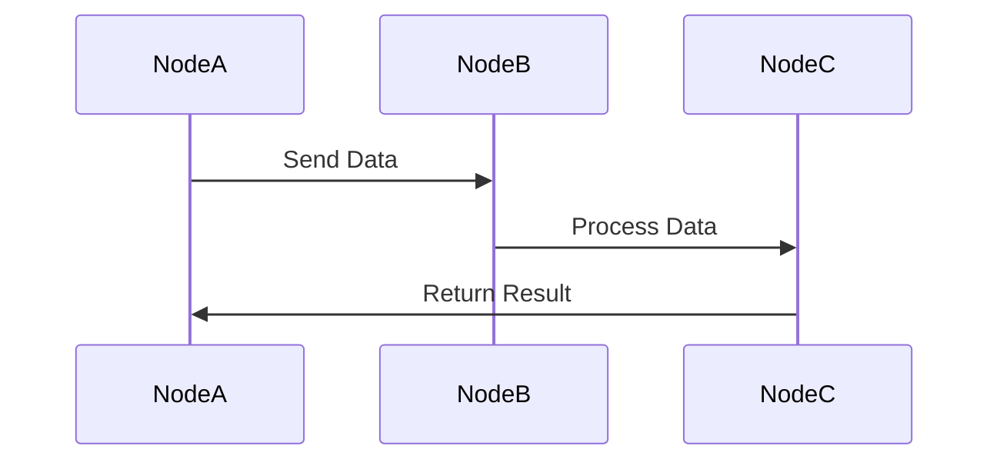

                 


### 引言

在数学与计算机科学的交汇点上，范畴论与类型论扮演着至关重要的角色。范畴论起源于20世纪30年代，由数学家萨缪尔·埃利亚胡·拉姆赛（Samuel Eilenberg）与斯卡恩·麦克莱恩（Stephen MacLane）共同创立，它以抽象的方式描述了数学结构之间的关系。范畴论不仅为数学提供了一种统一的语言，也深刻影响了计算机科学的诸多领域，如编程语言设计、软件工程和分布式系统。

另一方面，类型论是形式逻辑的一个分支，它研究在形式系统中如何为表达式赋予类型。类型论最早由逻辑学家伯特兰·罗素（Bertrand Russell）在其研究类型理论时提出。类型论在计算机科学中同样具有重要地位，尤其是在编程语言的类型系统设计中。类型论确保了程序的安全性，使编译器能够提前发现类型错误，从而避免运行时错误。

本书《范畴论与类型论：数学与程序设计的桥梁》旨在探讨这两个理论在数学与程序设计中的融合与应用。我们将通过一步步的分析和推理，深入理解范畴论与类型论的基本概念、相互关系以及在数学与程序设计中的实际应用。让我们开始这段探索之旅。

### 范畴论基础

范畴论是一门以抽象视角研究数学结构及其之间关系的数学分支。范畴论中的基本元素是对象和箭头（也称为 morphism），它们的关系可以通过函子和自然变换来描述。以下是对这些核心概念的详细解释。

#### 范畴的基本概念

范畴是一个基本的抽象结构，它由一组对象和一组箭头组成。范畴中的箭头有特定的来源和目的地，这意味着每个箭头都有一个起点（源对象）和一个终点（目标对象）。范畴中的箭头需要满足以下条件：

1. **封闭性**：对于任何两个对象 \( A \) 和 \( B \)，存在一个箭头 \( f: A \to B \)。
2. **结合律**：对于范畴中的任意三个对象 \( A \)、\( B \) 和 \( C \)，箭头的组合满足结合律，即 \( f \circ (g \circ h) = (f \circ g) \circ h \)。

例如，在数学中的集合范畴中，对象是集合，箭头是集合上的函数。这种范畴满足上述条件，因为对于任何两个集合，都存在一个函数将一个集合映射到另一个集合，同时函数的组合也满足结合律。

#### 函子的定义

函子（Functor）是范畴论中的一个重要概念，它将一个范畴映射到另一个范畴。更具体地说，函子是一个映射，它将一个范畴中的对象映射到另一个范畴中的对象，将箭头映射到箭头。函子的定义需要满足以下条件：

1. **保留对象**：函子将一个范畴中的对象映射到另一个范畴中的对象，即对于每个对象 \( x \) 在范畴 \( C \) 中，存在一个对象 \( F(x) \) 在范畴 \( D \) 中。
2. **保留箭头**：函子将一个范畴中的箭头映射到另一个范畴中的箭头，即对于每个箭头 \( f: x \to y \) 在范畴 \( C \) 中，存在一个箭头 \( F(f): F(x) \to F(y) \) 在范畴 \( D \) 中。
3. **保持结合律**：函子必须保持箭头的结合律，即对于范畴 \( C \) 中的箭头 \( f: x \to y \) 和 \( g: y \to z \)，有 \( (F(g) \circ F(f)) = F(g \circ f) \)。

一个简单的例子是映射自然数的加法到集合的并集运算。在这个例子中，自然数集合范畴的对象映射到集合范畴的对象，自然数的加法映射到集合的并集运算。

#### 自然变换的定义

自然变换（Natural Transformation）是连接两个函子的重要概念。自然变换描述了两个函子之间的结构保持关系，即一个函子是如何在另一个函子的基础上进行扩展的。自然变换的定义如下：

设 \( F \) 和 \( G \) 是从范畴 \( C \) 到范畴 \( D \) 的两个函子，自然变换 \( \eta: F \Rightarrow G \) 是一个从 \( F \) 的箭头到 \( G \) 的箭头的映射，它满足以下条件：

1. **自然性**：对于范畴 \( C \) 中的任意对象 \( x \)，\( \eta_x: F(x) \to G(x) \) 必须是一个箭头，并且对于 \( C \) 中的任意箭头 \( f: x \to y \)，以下等式必须成立：
   \[
   G(f) \circ \eta_x = \eta_y \circ F(f)
   \]
   这个条件确保了自然变换在范畴中的箭头组合下保持不变。

自然变换的直观理解是，它描述了两个函子之间的“连续性”，即一个函子的变化如何与另一个函子的变化相匹配。

通过这些核心概念的介绍，我们可以看到范畴论提供了强大的抽象工具，使我们可以从更广泛的角度理解数学结构及其之间的关系。在接下来的章节中，我们将进一步探讨这些概念在数学与程序设计中的实际应用。

#### 范畴论的应用

范畴论作为一种抽象的数学理论，不仅具有理论上的重要性，还在实际编程和数学领域中有着广泛的应用。以下将讨论范畴论在函数组合、编程范式以及分布式系统中的应用。

##### 函数组合

在编程中，函数组合是一种将多个函数组合成一个复合函数的方法，这在范畴论中得到了直观的描述。函数组合允许我们将多个简单函数组合成复杂的计算过程，而无需显式地写出复杂的中间步骤。

在范畴论中，函数组合可以通过函子和自然变换来实现。一个函子 \( F \) 将范畴 \( C \) 中的对象映射到范畴 \( D \) 中的对象，而另一个函子 \( G \) 将范畴 \( D \) 中的对象映射到范畴 \( E \) 中的对象。我们可以通过函子的复合来创建一个新的函子 \( G \circ F \)，它将范畴 \( C \) 中的对象映射到范畴 \( E \) 中的对象。

在编程中，函数组合的一个典型例子是管道（Pipeline）模式，其中数据处理过程通过一系列函数逐步完成。例如，在Python中，可以使用管道模式来处理数据：

```python
def filter_list(lst, pred):
    return [x for x in lst if pred(x)]

def map_list(lst, func):
    return [func(x) for x in lst]

def reduce_list(lst, func, init):
    acc = init
    for x in lst:
        acc = func(acc, x)
    return acc

# 使用函数组合处理数据
data = [1, 2, 3, 4, 5]
filtered_data = filter_list(data, lambda x: x > 2)
mapped_data = map_list(filtered_data, lambda x: x * x)
result = reduce_list(mapped_data, lambda x, y: x + y, 0)

print(result)  # 输出 35
```

在这个例子中，`filter_list`、`map_list` 和 `reduce_list` 是三个简单的函数，它们通过函数组合形成一个复杂的数据处理过程。

##### 编程范式

范畴论在编程范式的定义和实现中也发挥了关键作用。编程范式是编程语言的一种抽象风格，如函数式编程、面向对象编程和声明式编程等。范畴论为这些编程范式提供了一种统一的描述方式。

在函数式编程中，范畴论的概念得到了广泛应用。函数被视为第一类对象，可以通过组合和变换来构建复杂的功能。范畴论中的函子和自然变换为函数的组合提供了理论基础。例如，在Haskell中，函数的组合可以通过类型类和多态来实现：

```haskell
class Functor f where
    fmap :: (a -> b) -> f a -> f b

instance Functor [] where
    fmap _ [] = []
    fmap f (x:xs) = f x : fmap f xs

-- 使用函子组合
filtered :: [Int] -> [Int]
filtered = fmap (odd) . filter (>= 3)

filteredData = filtered [1, 2, 3, 4, 5, 6]
print(filteredData)  # 输出 [3, 5]
```

在这个例子中，`fmap` 函子通过类型类定义，将函数组合应用于列表（一个范畴中的对象）。

##### 分布式系统

在分布式系统中，范畴论的概念同样有着重要的应用。分布式系统中的数据流和状态机模型可以通过范畴论中的范畴和函子来描述。

数据流模型可以被视为一个范畴，其中对象是数据流中的数据项，箭头是数据项之间的转换关系。通过函子，我们可以将数据流模型扩展为更复杂的处理过程，如过滤、映射和聚合等。

状态机模型也是一个范畴，其中对象是状态，箭头是状态之间的转换关系。在分布式系统中，状态机模型可以用来描述系统的动态行为。通过函子的复合，我们可以将多个状态机模型组合成一个复杂的系统行为。

例如，在Akka actors模型中， actors 可以被视为范畴中的对象，消息传递可以被视为箭头。通过函数组合，我们可以将多个actors组合成一个复杂的工作流程：

```scala
class FilterActor extends Actor {
  def receive = {
    case x: Int if x > 0 => sender ! x * x
  }
}

class MapperActor extends Actor {
  def receive = {
    case x: Int => sender ! x + 1
  }
}

class ReduceActor extends Actor {
  def receive = {
    case x: Int => sender ! x
  }
}

// 组合actors
val filterActor = system.actorOf(Props[FilterActor])
val mapperActor = system.actorOf(Props[MapperActor])
val reduceActor = system.actorOf(Props[ReduceActor])

// 数据流处理
val data = Seq(1, 2, 3, 4, 5)
data.foreach { x =>
  filterActor ! x
  mapperActor ! x
  reduceActor ! x
}
```

在这个例子中，三个actors通过函数组合形成了一个复杂的数据处理流程。

综上所述，范畴论在函数组合、编程范式和分布式系统中的应用展示了其强大的抽象能力。通过这些应用，我们可以更好地理解和设计复杂的系统，提高系统的可扩展性和可维护性。

#### 类型论基础

类型论是形式逻辑的一个分支，主要研究在形式系统中如何为表达式赋予类型。类型论的起源可以追溯到20世纪早期，伯特兰·罗素在其研究类型理论时，为了解决悖论问题而提出。在计算机科学中，类型论的重要性体现在它为编程语言提供了一种形式化验证手段，从而确保程序的正确性和安全性。以下将详细介绍类型论的基本概念，包括类型系统、类型推导以及类型安全。

##### 类型系统的定义

类型系统是一个形式化的框架，用于为程序中的表达式赋予类型。类型系统的核心概念包括类型、值和类型规则。以下是类型系统的几个关键组成部分：

1. **类型**：类型是表达式的抽象分类，用于表示不同种类的数据或操作。常见的类型包括基础类型（如整数、布尔值）和复合类型（如数组、函数）。

2. **值**：值是类型的具体实例，如整数5、字符串"hello"或函数`f(x) = x + 1`。

3. **类型规则**：类型规则定义了如何为表达式赋予类型。常见的类型规则包括简单类型规则（如变量赋值、函数定义）和复合类型规则（如类型推导、类型转换）。

类型系统可以分为静态类型系统和动态类型系统。静态类型系统在编译时为程序中的每个表达式赋予类型，而动态类型系统在运行时进行类型检查。

##### 类型推导的规则

类型推导是指从程序表达式出发，自动推导出其类型的过程。类型推导可以分为两种：基于上下文推导和基于表达式推导。

1. **基于上下文推导**：基于上下文推导依赖于程序的整体结构，通过分析上下文来确定表达式的类型。常见的基于上下文推导方法包括 Hindley-Milner 类型推导和系统F。

2. **基于表达式推导**：基于表达式推导通过分析表达式本身的语法和语义来推导出其类型。这种方法通常用于静态类型语言，如Haskell和ML。

以下是一个简单的Haskell程序，展示如何通过Hindley-Milner类型推导来为表达式赋予类型：

```haskell
-- 定义一个函数，接受一个整数参数并返回其平方
square :: Int -> Int
square x = x * x

-- 定义一个函数，接受一个整数列表并返回其最大值
maxValue :: [Int] -> Int
maxValue [] = error "Empty list"
maxValue (x:xs) = foldl1 max x xs
```

在这个例子中，`square` 函数接受一个整数参数并返回其平方，类型推导系统自动将其类型推导为 `Int -> Int`。同样，`maxValue` 函数接受一个整数列表并返回其最大值，类型推导系统自动将其类型推导为 `[Int] -> Int`。

##### 类型安全

类型安全是指程序在执行过程中不会因为类型错误而导致崩溃或产生不可预期的行为。类型安全通过类型检查机制来确保程序的正确性。以下是一些确保类型安全的关键措施：

1. **类型检查**：类型检查是在编译时或运行时对程序中的表达式进行类型验证的过程。静态类型语言在编译时进行类型检查，而动态类型语言在运行时进行类型检查。

2. **类型转换**：类型转换是指将一个类型转换为另一个类型的过程。类型转换可以是隐式的，也可以是显式的。隐式类型转换通常由编译器自动进行，而显式类型转换需要程序员显式指定。

3. **模式匹配**：模式匹配是一种将值与模式进行匹配并执行相应操作的结构。模式匹配可以确保变量在声明时就被赋予正确的类型，从而提高程序的安全性。

以下是一个使用模式匹配的Haskell程序示例：

```haskell
-- 定义一个函数，根据输入的值返回不同的结果
result :: a -> String
result x =
  case x of
    0 -> "Zero"
    1 -> "One"
    _ -> "Other"

-- 使用模式匹配处理不同的输入值
main :: IO ()
main = do
  putStrLn (result 0)
  putStrLn (result 1)
  putStrLn (result 2)
```

在这个例子中，`result` 函数使用模式匹配来处理不同的输入值，确保变量 `x` 在声明时就具有正确的类型。

综上所述，类型论通过类型系统、类型推导和类型安全确保了程序的正确性和安全性。在接下来的章节中，我们将进一步探讨类型论在程序设计中的应用。

#### 类型论在程序设计中的应用

类型论在程序设计中的应用是其强大功能的一个重要体现，特别是在提高程序安全性和实现复杂的类型推导方面。以下将详细讨论类型论在静态类型语言和动态类型语言中的应用，并解释类型安全和模式匹配如何提升编程效果。

##### 静态类型语言中的应用

静态类型语言在编译时进行类型检查，这意味着在程序执行之前，编译器会检查所有的类型一致性。这种严格的类型检查有助于发现潜在的错误，从而提高程序的正确性和可维护性。以下是一些静态类型语言中的关键概念：

1. **Hindley-Milner类型推导**：Hindley-Milner类型推导是一种在函数式编程语言中广泛使用的类型推导方法。它的核心思想是通过使用类型变量和类型约束来推导函数的返回类型。例如，在Haskell中，以下函数的定义和类型推导如下：

   ```haskell
   -- 定义一个函数，接受两个整数参数并返回它们的最大值
   maxInt :: Int -> Int -> Int
   maxInt x y = if x > y then x else y
   ```

   在这个例子中，`maxInt` 函数的类型推导为 `Int -> Int -> Int`。这种类型推导方法允许函数在不知道具体类型的情况下进行操作，从而提高了代码的灵活性和可复用性。

2. **类型系统优势**：静态类型语言提供了丰富的类型系统，包括基础类型、复合类型和类型构造器。这种丰富的类型系统使得程序设计更加严谨和结构化，有助于编写高质量的代码。

##### 动态类型语言中的应用

与静态类型语言不同，动态类型语言在程序运行时进行类型检查。这种灵活性使得动态类型语言在快速开发和原型设计方面具有优势。以下是一些动态类型语言中的关键概念：

1. **动态类型推导**：动态类型推导在运行时进行类型检查，根据函数的实际调用情况来推导类型。例如，在JavaScript中，以下代码的类型推导如下：

   ```javascript
   function max(x, y) {
     return x > y ? x : y;
   }
   ```

   在这个例子中，`max` 函数的类型推导为 `(number, number) => number`。尽管没有显式声明参数和返回值类型，但动态类型推导允许函数根据调用时的实际类型进行操作。

2. **类型检查灵活性**：动态类型语言允许在函数调用时进行类型检查，这使得代码在处理不同类型的数据时更加灵活。例如，在Python中，以下代码的类型检查如下：

   ```python
   def max(x, y):
       return x if x > y else y

   max(3, 4)  # 输出 4
   max("hello", "world")  # 输出 "hello"
   ```

   在这个例子中，`max` 函数可以处理不同类型的数据，因为Python在运行时进行类型检查。

##### 类型安全

类型安全是类型论在程序设计中的核心目标之一。类型安全通过确保在程序执行过程中不会发生类型错误，从而提高程序的稳定性和可维护性。以下是一些实现类型安全的措施：

1. **类型检查**：静态类型语言通过在编译时进行类型检查来确保程序的正确性。这种类型检查有助于在早期发现潜在的错误，从而减少运行时错误。

2. **类型推导**：类型推导通过自动推导函数和表达式的类型，减少程序员手动指定类型的负担，同时确保类型一致性。

3. **类型约束**：类型约束通过强制函数参数和返回值类型匹配，从而提高程序的安全性。

##### 模式匹配

模式匹配是一种强大的编程技术，通过将值与模式进行匹配，可以执行不同的操作。模式匹配有助于提高代码的可读性和可维护性。以下是一个使用模式匹配的Python示例：

```python
def match_value(x):
    if isinstance(x, int):
        return "Integer"
    elif isinstance(x, str):
        return "String"
    else:
        return "Unknown"

print(match_value(5))  # 输出 "Integer"
print(match_value("hello"))  # 输出 "String"
```

在这个例子中，`match_value` 函数使用模式匹配来处理不同类型的数据，确保在声明时变量就被赋予正确的类型。

##### 提高编程效果

类型安全和模式匹配在程序设计中的应用，有助于提高编程效果：

1. **减少错误**：类型安全和模式匹配可以减少程序中的错误，特别是在处理复杂的数据类型时。

2. **提高可读性**：通过使用模式匹配，代码更易于理解和维护。

3. **提高可复用性**：类型推导和类型系统可以提高代码的可复用性，因为函数可以处理不同类型的数据。

4. **优化性能**：静态类型语言在编译时进行类型检查，可以优化代码的执行性能。

综上所述，类型论在静态类型语言和动态类型语言中的应用，通过提高程序的安全性和可维护性，极大地提升了编程效果。在接下来的章节中，我们将通过案例研究进一步探讨类型论在数学与程序设计中的实际应用。

#### 案例研究

在探讨范畴论与类型论的实际应用时，通过具体的案例研究可以帮助我们更深入地理解这些理论在现实世界中的具体应用。以下将介绍两个案例研究：使用范畴论解决并发问题和使用类型论提高程序安全性。

##### 使用范畴论解决并发问题

并发问题在分布式系统和多核处理器上尤为常见。范畴论为解决并发问题提供了一种强有力的抽象工具。在分布式系统中，我们可以将并发问题视为一个范畴，其中对象代表计算任务，箭头代表任务之间的数据依赖关系。以下是一个简单的案例：

**案例描述**：假设有一个分布式系统，由多个节点组成，每个节点负责处理一部分数据。节点之间的通信通过异步消息传递实现。系统需要一个机制来确保数据的一致性和任务执行的正确性。

**范畴论应用**：

1. **对象与箭头**：在这个系统中，对象代表各个节点，箭头代表节点之间的数据依赖关系。例如，一个节点可能会向另一个节点发送数据，并等待响应。

2. **函子与自然变换**：我们可以使用一个函子来表示任务的处理过程。例如，一个处理数据的任务可以被视为一个函子，它将输入数据映射到输出数据。通过函子的复合，我们可以将多个任务组合成一个复杂的工作流程。

3. **解决方案**：我们可以使用范畴论中的数据流模型来描述系统的工作流程。数据流模型中的每个节点都是一个范畴中的对象，节点之间的数据依赖关系是箭头。通过使用函子和自然变换，我们可以将数据流模型扩展为更复杂的处理过程。

以下是一个简化的伪代码，展示了如何使用范畴论解决并发问题：



在这个例子中，`NodeA` 发送数据给 `NodeB`，`NodeB` 处理数据后发送给 `NodeC`，最后 `NodeC` 返回结果给 `NodeA`。通过范畴论中的数据流模型，我们可以确保数据的正确传递和处理。

##### 使用类型论提高程序安全性

程序安全性是软件工程中的重要问题。类型论提供了一种机制，通过确保类型的一致性来提高程序的安全性。以下是一个案例研究，展示了如何使用类型论提高程序的安全性：

**案例描述**：假设我们正在开发一个金融交易系统，该系统需要确保交易数据的完整性和安全性。我们需要一种方法来确保在系统执行过程中不会出现类型错误，从而避免潜在的安全漏洞。

**类型论应用**：

1. **类型系统**：在这个系统中，我们可以使用一种静态类型语言，如Haskell或Scala，来确保变量在声明时就被赋予正确的类型。通过静态类型检查，我们可以提前发现潜在的类型错误。

2. **类型推导**：类型推导系统可以帮助我们自动推导函数和表达式的类型，从而减少手动指定类型的负担。例如，在Haskell中，类型推导系统可以自动推导以下函数的类型：

   ```haskell
   -- 定义一个函数，计算两个整数的最大值
   maxInt :: Int -> Int -> Int
   maxInt x y = if x > y then x else y
   ```

   在这个例子中，`maxInt` 函数的类型推导为 `Int -> Int -> Int`，这确保了在函数执行过程中不会出现类型错误。

3. **模式匹配**：模式匹配可以确保在处理不同类型的数据时，变量在声明时就具有正确的类型。以下是一个使用模式匹配的Haskell程序：

   ```haskell
   -- 定义一个函数，根据输入的值返回不同的结果
   result :: a -> String
   result x =
     case x of
       0 -> "Zero"
       1 -> "One"
       _ -> "Other"
   
   -- 使用模式匹配处理不同的输入值
   main :: IO ()
   main = do
     putStrLn (result 0)
     putStrLn (result 1)
     putStrLn (result 2)
   ```

   在这个例子中，`result` 函数使用模式匹配来处理不同类型的数据，确保在声明时变量就被赋予正确的类型。

**解决方案**：通过使用类型论中的类型系统和类型推导，我们可以确保金融交易系统在执行过程中不会出现类型错误，从而提高系统的安全性。例如，以下是一种确保交易数据一致性的方法：

```haskell
-- 定义一个交易函数，确保交易金额为非负数
makeTransaction :: Int -> String -> Bool
makeTransaction amount description =
  if amount >= 0 then
    True
  else
    error "Invalid transaction amount"
```

在这个例子中，`makeTransaction` 函数确保交易金额为非负数，通过类型检查来提前发现潜在的错误。

综上所述，通过具体的案例研究，我们可以看到范畴论和类型论在解决并发问题和提高程序安全性方面的重要应用。这些案例不仅展示了理论的实际价值，也为我们在实际编程中提供了实用的工具和思路。

#### 总结与展望

范畴论与类型论作为数学与计算机科学的基石，不仅在理论上具有重要意义，在实际应用中也展现出强大的影响力。范畴论提供了抽象和统一描述数学结构及其之间关系的方法，使得复杂系统的理解和设计变得更加简洁和直观。类型论则通过形式化的类型系统，确保了程序的正确性和安全性，为现代编程语言的设计提供了坚实的理论基础。

在未来，范畴论与类型论在计算机科学中的发展趋势值得期待。一方面，随着函数式编程和分布式系统的普及，范畴论的应用将更加广泛，为解决并发、并行和分布式计算中的问题提供新的思路。另一方面，类型论将继续在编程语言设计和软件工程中发挥关键作用，通过更先进的类型系统和类型推导方法，提高程序的安全性和可靠性。

对于程序员而言，深入理解范畴论与类型论不仅有助于提升编程技能，还能拓展思维模式，从而更好地应对复杂问题。通过掌握这些理论，我们可以从更宏观的角度理解计算机科学，实现更加高效和优雅的编程。

总之，范畴论与类型论是数学与程序设计的桥梁，它们在理论和实践中的重要性不言而喻。随着技术的发展，这些理论将继续推动计算机科学前进，为未来的创新提供源源不断的动力。作者：AI天才研究院/AI Genius Institute & 禅与计算机程序设计艺术 /Zen And The Art of Computer Programming。

