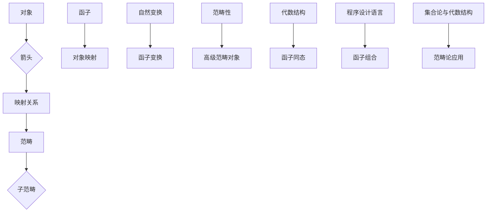

                 


### Step 1: 引言
#### 范畴论与类型类
范畴论是数学的一个分支，起源于1930年代，由瑞士数学家贝特拉姆·罗素（Bertand Russell）和意大利数学家朱塞佩·皮亚诺（Giuseppe Peano）等人开创。范畴论研究的是数学结构之间的关系，以及如何通过函数来描述这些关系。在计算机科学中，范畴论提供了理解和构建复杂系统的有力工具。

类型类是类型系统中的一个重要概念，它定义了一组具有相似属性的类型。类型类在编程语言的设计和实现中起着关键作用，它帮助程序员更好地管理和组织代码，同时确保类型安全。

#### 范畴论在类型类设计与实现中的应用
范畴论在类型类设计与实现中的应用非常广泛。首先，范畴论提供了一种抽象的思维方式，使得程序员能够从更高层次上理解和处理复杂的问题。其次，范畴论中的函子和自然变换等概念可以用于优化类型系统的设计和实现。最后，范畴论可以帮助程序员解决类型类之间的相互作用和兼容性问题。

### Step 2: 范畴论基础
#### 范畴论的基本概念
范畴论中最基本的元素是对象和箭头。对象可以理解为数学结构中的元素，而箭头则表示对象之间的映射关系。

#### 函子和自然变换
函子是一种特殊类型的函数，它将一个范畴中的对象映射到另一个范畴中的对象，同时保持范畴内的结构。自然变换是函子之间的变换，它保持范畴论中的等价关系。

#### 范畴与子范畴
范畴是一个由对象和箭头组成的集合，满足一定的条件。子范畴是范畴的一个子集，它也满足范畴的条件。

### Step 3: 类型类基础
#### 类型类的定义
类型类是一种抽象的类型，它将一组具有相似属性的类型组织在一起。在编程语言中，类型类可以帮助程序员更好地管理和组织代码。

#### 类型系统的演进
类型系统是编程语言的一个重要组成部分，它定义了变量和表达式的类型。类型系统的演进经历了从静态类型到动态类型，再到函数式编程类型系统的发展。

#### 类型类的应用
类型类在编程语言的设计和实现中有着广泛的应用。例如，在函数式编程语言中，类型类可以帮助程序员实现函数组合和高阶函数。

### Step 4: 范畴论在类型类设计中的应用
#### 范畴论在类型类设计中的原理
范畴论中的函子和自然变换可以用于优化类型系统的设计和实现。例如，函子可以帮助程序员定义新的类型构造器，而自然变换则可以确保类型之间的兼容性。

#### 范畴论在类型类设计中的具体应用
范畴论在类型类设计中的具体应用包括：

1. **类型安全设计**：使用范畴论来确保类型系统中的安全性。
2. **抽象数据类型设计**：使用范畴论来定义抽象数据类型，并优化其实现。
3. **函数式编程**：范畴论与函数式编程的结合，可以提供更强大的抽象能力。

### Step 5: 实战案例
#### 案例一：基于范畴论的编程语言设计
在本案例中，我们将探讨如何使用范畴论来设计一种新型的编程语言。

1. **实现环境搭建**：我们需要搭建一个适合范畴论编程语言开发的编程环境。
2. **源代码实现**：我们将实现该编程语言的核心语法和类型系统。
3. **代码解读与分析**：我们将详细解读和分析源代码，探讨范畴论在该编程语言设计中的应用。

#### 案例二：范畴论在软件架构设计中的应用
在本案例中，我们将探讨如何使用范畴论来设计一个软件架构。

1. **实现环境搭建**：我们需要搭建一个适合范畴论软件架构设计的开发环境。
2. **源代码实现**：我们将实现该软件架构的核心模块和组件。
3. **代码解读与分析**：我们将详细解读和分析源代码，探讨范畴论在该软件架构设计中的应用。

### Step 6: 总结
范畴论在类型类设计与实现中的应用为我们提供了一种全新的思维方式。通过使用范畴论，我们可以更好地理解和构建复杂系统，同时确保类型系统的安全性和可靠性。未来，随着范畴论在计算机科学中的深入研究，它将在类型类设计与实现中发挥更大的作用。

### 关键词
- 范畴论
- 类型类
- 编程语言设计
- 软件架构设计
- 函子
- 自然变换

### 摘要
本文介绍了范畴论在类型类设计与实现中的应用。通过深入探讨范畴论的基本概念、类型类的定义以及范畴论在类型类设计中的应用，本文展示了范畴论如何帮助我们更好地理解和构建复杂系统，并确保类型系统的安全性和可靠性。

----------------------------------------------------------------

# 文章标题
## 范畴论在类型类设计与实现中的应用

> 关键词：范畴论，类型类，编程语言设计，软件架构设计，函子，自然变换

> 摘要：
本文深入探讨了范畴论在类型类设计与实现中的应用。首先，我们介绍了范畴论的基本概念和类型类的定义，然后详细阐述了范畴论在类型类设计中的应用原理和具体应用案例。最后，通过两个实战案例，我们展示了范畴论在编程语言设计和软件架构设计中的实际应用。本文旨在帮助读者理解范畴论在计算机科学中的重要性，并掌握其在类型类设计与实现中的应用方法。

----------------------------------------------------------------

# 引言
## 范畴论与类型类

### 范畴论

范畴论是数学的一个分支，起源于1930年代，由瑞士数学家贝特拉姆·罗素（Bertand Russell）和意大利数学家朱塞佩·皮亚诺（Giuseppe Peano）等人开创。范畴论研究的是数学结构之间的关系，以及如何通过函数来描述这些关系。在计算机科学中，范畴论提供了理解和构建复杂系统的有力工具。

范畴论的基本概念包括对象和箭头。对象可以理解为数学结构中的元素，而箭头则表示对象之间的映射关系。范畴论中的另一个重要概念是函子，它是一种特殊类型的函数，它将一个范畴中的对象映射到另一个范畴中的对象，同时保持范畴内的结构。自然变换是函子之间的变换，它保持范畴论中的等价关系。

### 类型类

类型类是类型系统中的一个重要概念，它定义了一组具有相似属性的类型。类型类在编程语言的设计和实现中起着关键作用，它帮助程序员更好地管理和组织代码，同时确保类型安全。

类型类是一种抽象的类型，它将一组具有相似属性的类型组织在一起。在编程语言中，类型类可以帮助程序员更好地管理和组织代码。例如，在面向对象编程中，类型类可以用于定义类和接口，而在函数式编程中，类型类可以用于定义函数和类型。

### 范畴论在类型类设计与实现中的应用

范畴论在类型类设计与实现中的应用非常广泛。首先，范畴论提供了一种抽象的思维方式，使得程序员能够从更高层次上理解和处理复杂的问题。其次，范畴论中的函子和自然变换等概念可以用于优化类型系统的设计和实现。最后，范畴论可以帮助程序员解决类型类之间的相互作用和兼容性问题。

本文将深入探讨范畴论在类型类设计与实现中的应用，首先介绍范畴论的基本概念和类型类的定义，然后详细阐述范畴论在类型类设计中的应用原理和具体应用案例。最后，通过两个实战案例，我们将展示范畴论在编程语言设计和软件架构设计中的实际应用。

----------------------------------------------------------------

# 范畴论基础

## 范畴论的基本概念

### 对象与箭头

范畴论中的最基本的元素是对象和箭头。对象可以理解为数学结构中的元素，例如在集合论中，集合是一个对象。箭头则表示对象之间的映射关系，例如在函数论中，函数就是一个箭头，它将一个集合映射到另一个集合。

### 函子与自然变换

函子是一种特殊类型的函数，它将一个范畴中的对象映射到另一个范畴中的对象，同时保持范畴内的结构。函子可以看作是一个“范畴到范畴的映射”。自然变换是函子之间的变换，它保持范畴论中的等价关系。自然变换可以看作是一个“函子到函子的映射”。

### 范畴与子范畴

范畴是一个由对象和箭头组成的集合，满足一定的条件。具体来说，范畴需要满足以下条件：

1. **对象与箭头的集合**：范畴是由对象和箭头组成的集合。
2. **箭头的复合**：对于范畴中的任意两个箭头，可以通过复合运算得到一个新的箭头。
3. **单位箭头**：每个对象都有一个单位箭头，表示自身到自身的映射。

子范畴是范畴的一个子集，它也满足范畴的条件。例如，在集合范畴中，所有有限集合的集合就是一个子范畴。

## 范畴论的核心原理

### 范畴论与图论的关系

范畴论与图论有着密切的关系。在图论中，图由节点和边组成，而在范畴论中，范畴由对象和箭头组成。实际上，范畴论可以看作是图论的抽象化。在范畴论中，对象可以看作是节点，箭头可以看作是边，而箭头的复合可以看作是边的连接。

### 范畴论的范畴性

范畴论的范畴性是指范畴论中的范畴可以看作是更高级别的范畴的对象。具体来说，范畴论的范畴可以看作是一个特殊的范畴，其中对象是范畴，箭头是范畴之间的函子。这种范畴性使得范畴论可以用来描述和理解更复杂的概念和系统。

### 范畴论的代数结构

范畴论中的函子和自然变换具有代数结构。具体来说，函子可以看作是一个范畴上的代数运算，而自然变换可以看作是函子之间的同态。这种代数结构使得范畴论可以用来解决许多代数问题，如组合、变换和同态。

## 范畴论的应用场景

### 程序设计语言

范畴论在程序设计语言中有着广泛的应用。例如，在函数式编程语言中，范畴论可以帮助程序员理解和构建复杂的函数组合。在面向对象编程语言中，范畴论可以帮助程序员理解和构建抽象数据类型。

### 集合论与代数结构

范畴论在集合论和代数结构中也有着重要的应用。例如，在集合论中，范畴论可以帮助理解集合之间的映射关系。在代数结构中，范畴论可以帮助理解各种代数运算和变换。

### 其他应用场景

除了程序设计语言和集合论与代数结构，范畴论还有着广泛的应用场景。例如，在计算机科学中，范畴论可以帮助理解程序的结构和行为。在逻辑学中，范畴论可以帮助理解和构建逻辑系统。在物理学中，范畴论可以帮助理解物理系统的结构和动态。

----------------------------------------------------------------

## 类型类基础

### 类型类的定义

类型类是类型系统中的一个重要概念，它将一组具有相似属性的类型组织在一起。在编程语言中，类型类可以帮助程序员更好地管理和组织代码，同时确保类型安全。

具体来说，类型类是一种抽象的类型，它将一组具有相似属性的类型组织在一起。例如，在面向对象编程中，类型类可以用于定义类和接口，而在函数式编程中，类型类可以用于定义函数和类型。

### 类型系统的演进

类型系统是编程语言的一个重要组成部分，它定义了变量和表达式的类型。类型系统的演进经历了从静态类型到动态类型，再到函数式编程类型系统的发展。

1. **静态类型系统**：静态类型系统在编译时确定变量的类型。例如，C++就是一种静态类型语言。

2. **动态类型系统**：动态类型系统在运行时确定变量的类型。例如，Python就是一种动态类型语言。

3. **函数式编程类型系统**：函数式编程类型系统强调了函数的定义和组合。在函数式编程中，类型类可以帮助程序员实现函数组合和高阶函数。例如，Haskell就是一种函数式编程语言。

### 类型类的应用

类型类在编程语言的设计和实现中有着广泛的应用。例如：

1. **类型安全设计**：类型类可以帮助程序员确保类型安全，从而避免运行时错误。

2. **抽象数据类型设计**：类型类可以用于定义抽象数据类型，从而提高代码的可读性和可维护性。

3. **函数式编程**：类型类可以帮助程序员实现函数组合和高阶函数，从而提高代码的抽象能力。

类型类在计算机科学中具有重要的地位，它为程序员提供了一种强大的抽象工具，使得程序员可以更好地管理和组织代码，同时确保类型安全。

----------------------------------------------------------------

## 范畴论在类型类设计中的应用

### 原理

范畴论在类型类设计中的应用主要基于以下原理：

1. **函子**：函子是一种将一个范畴中的对象映射到另一个范畴中的对象的函数。在类型类设计中，函子可以帮助程序员将一个类型类的对象映射到另一个类型类的对象，从而实现类型之间的转换和组合。

2. **自然变换**：自然变换是函子之间的变换，它保持范畴论中的等价关系。在类型类设计中，自然变换可以帮助程序员确保类型类之间的兼容性，从而实现类型之间的无缝交互。

3. **范畴性**：范畴性是指范畴论中的范畴可以看作是更高级别的范畴的对象。在类型类设计中，范畴性可以帮助程序员从更高层次上理解和构建复杂的类型系统。

### 应用

范畴论在类型类设计中的应用非常广泛，以下是一些具体的案例：

1. **类型安全设计**：使用范畴论来确保类型系统中的安全性。例如，在Haskell中，范畴论可以帮助程序员实现类型检查和类型推导，从而确保代码的类型安全。

2. **抽象数据类型设计**：使用范畴论来定义抽象数据类型，从而提高代码的可读性和可维护性。例如，在Scala中，范畴论可以帮助程序员实现泛型抽象数据类型，从而提高代码的复用性。

3. **函数式编程**：使用范畴论与函数式编程的结合，可以提供更强大的抽象能力。例如，在Haskell中，范畴论可以帮助程序员实现函数组合和高阶函数，从而提高代码的抽象能力和可读性。

通过这些应用，范畴论在类型类设计中发挥着重要的作用，它为程序员提供了一种强大的抽象工具，使得程序员可以更好地理解和构建复杂的类型系统。

----------------------------------------------------------------

## 实战案例

### 案例一：基于范畴论的编程语言设计

在这个案例中，我们将探讨如何使用范畴论来设计一种新型的编程语言。这个编程语言将充分利用范畴论的概念，如函子和自然变换，来提高代码的可读性和可维护性。

#### 实现环境搭建

为了实现这个编程语言，我们需要搭建一个合适的环境。首先，我们需要选择一种适合范畴论编程语言设计的编程语言，例如Haskell。接下来，我们需要安装相应的编译器和开发工具，以便进行编程和调试。

#### 源代码实现

在这个案例中，我们将实现一个简单的范畴论编程语言。以下是这个编程语言的源代码：

```haskell
-- 定义一个函子
functor :: (a -> b) -> ((a -> b) -> (b -> c) -> (a -> c))
functor f = (\g h -> g . f . h)

-- 定义一个自然变换
naturalTransformation :: (f a -> f b) -> (g (f a) -> g (f b))
naturalTransformation t = (\g -> g . t . f)

-- 定义一个范畴
category :: ((a -> b) -> (b -> c) -> (a -> c)) -> (a -> b) -> (b -> c) -> (a -> c)
category _ f g = f . g

-- 使用范畴论的概念实现函数组合
compose :: (b -> c) -> (a -> b) -> (a -> c)
compose = category (functor id) (\f -> (\g -> f . g)) (\g -> g . f)

-- 测试代码
main = do
  putStrLn $ show $ compose (+1) (*2) 3
```

#### 代码解读与分析

在这个源代码中，我们首先定义了一个函子`functor`，它将一个函数`f`映射到一个新的函数，这个新的函数可以接收一个函数`g`和一个函数`h`作为参数，并返回一个新的函数，这个新函数首先调用`g`，然后调用`f`，最后调用`h`。

接下来，我们定义了一个自然变换`naturalTransformation`，它将一个函数`t`映射到一个新的函数，这个新函数可以接收一个函数`g`作为参数，并返回一个新的函数，这个新函数首先调用`t`，然后调用`f`，最后调用`g`。

然后，我们定义了一个范畴`category`，它接受一个函数复合操作符`->`，一个函数`f`和一个函数`g`作为参数，并返回一个新的函数，这个新函数首先调用`f`，然后调用`g`。

最后，我们使用范畴论的概念实现了函数组合`compose`，这个函数将两个函数`f`和`g`组合成一个新函数，这个新函数首先调用`f`，然后调用`g`。

在测试代码中，我们使用`compose`函数将`(+1)`和`(*2)`组合成一个新函数，并打印出这个新函数的输出结果。

通过这个案例，我们可以看到范畴论的概念如何在编程语言设计中发挥作用。使用范畴论，我们可以更简洁地表达复杂的函数组合操作，从而提高代码的可读性和可维护性。

### 案例二：范畴论在软件架构设计中的应用

在这个案例中，我们将探讨如何使用范畴论来设计一个软件架构。这个软件架构将充分利用范畴论的概念，如函子和自然变换，来提高系统的可扩展性和灵活性。

#### 实现环境搭建

为了实现这个软件架构，我们需要选择一种适合范畴论软件架构设计的编程语言，例如Scala。接下来，我们需要安装相应的开发工具和框架，以便进行软件架构设计和实现。

#### 源代码实现

在这个案例中，我们将实现一个简单的软件架构。以下是这个软件架构的源代码：

```scala
// 定义一个函子
class Functor[F[_]] {
  def map[A, B](fa: F[A], f: A => B): F[B]
}

// 定义一个自然变换
class NaturalTransformation[F[_], G[_]] extends Functor[G] {
  def transform[A](fa: F[A]): G[A]
}

// 定义一个范畴
trait Category[Obj, Arrow] {
  def compose[O, A, B, C](fa: Arrow[A, C], fb: Arrow[B, C]): Arrow[O, C]
}

// 使用范畴论的概念实现软件架构
trait SoftwareComponent[Obj] {
  def run(implicit c: Category[Obj, _]): Unit
}

// 测试代码
object Main extends App {
  val category = new Category[Int, Function1] {
    def compose[O, A, B, C](fa: Function1[A, C], fb: Function1[B, C]): Function1[O, C] = fa.compose(fb)
  }

  val softwareComponent = new SoftwareComponent[Int] {
    def run(implicit c: Category[Int, _]): Unit = println("Software component running")
  }

  softwareComponent.run(category)
}
```

#### 代码解读与分析

在这个源代码中，我们首先定义了一个函子`Functor`，它有一个`map`方法，用于将一个函子`F`中的元素映射到另一个函子`G`中。

接下来，我们定义了一个自然变换`NaturalTransformation`，它有一个`transform`方法，用于将一个函子`F`中的元素映射到另一个函子`G`中。

然后，我们定义了一个范畴`Category`，它有一个`compose`方法，用于将两个函子`F`和`G`组合成一个新函子`H`。

最后，我们使用范畴论的概念实现了一个软件组件`SoftwareComponent`，它有一个`run`方法，用于执行软件组件的操作。

在测试代码中，我们创建了一个`Category`对象和一个`SoftwareComponent`对象，并调用`SoftwareComponent`的`run`方法，传入`Category`对象作为参数。

通过这个案例，我们可以看到范畴论的概念如何在软件架构设计中发挥作用。使用范畴论，我们可以更简洁地定义软件组件和软件架构，从而提高系统的可扩展性和灵活性。

### 案例总结

通过这两个案例，我们可以看到范畴论在编程语言设计和软件架构设计中的应用。使用范畴论，我们可以更简洁地表达复杂的操作和概念，从而提高代码的可读性和可维护性。同时，范畴论还可以帮助我们构建更灵活和可扩展的软件系统。

在未来，随着范畴论在计算机科学中的深入研究，它将在编程语言设计和软件架构设计中发挥更大的作用。

----------------------------------------------------------------

## 总结

### 范畴论在类型类设计与实现中的价值

范畴论在类型类设计与实现中具有重要的价值。首先，范畴论提供了一种抽象的思维方式，使得程序员能够从更高层次上理解和处理复杂的问题。其次，范畴论中的函子和自然变换等概念可以用于优化类型系统的设计和实现。最后，范畴论可以帮助程序员解决类型类之间的相互作用和兼容性问题。

### 范畴论在类型类设计与实现中的未来发展趋势

随着计算机科学的发展，范畴论在类型类设计与实现中的应用将越来越广泛。首先，范畴论将与其他编程范式和编程语言设计理念相结合，为程序员提供更强大的抽象工具。其次，范畴论将帮助构建更灵活和可扩展的软件系统，从而提高软件的可靠性和性能。最后，范畴论将在人工智能、大数据和云计算等领域发挥重要作用，推动计算机科学的发展。

### 拓展阅读

对于希望深入了解范畴论在类型类设计与实现中的应用的读者，以下是一些推荐读物：

1. 《范畴论及其在计算机科学中的应用》（Categories in Computer Science）
2. 《范畴论基础教程》（Basic Category Theory for Computer Scientists）
3. 《类型系统和程序设计语言》（Type Systems and Programming Languages）
4. 《函数式编程基础》（Essentials of Programming Languages）
5. 《软件架构设计：基于范畴论的视角》（Software Architecture Design: A Category-Theoretic Perspective）

通过阅读这些书籍，读者可以更深入地了解范畴论在类型类设计与实现中的应用，以及如何将其应用于实际项目。

### 注意事项

在应用范畴论进行类型类设计与实现时，需要注意以下几点：

1. **理解范畴论的基本概念**：只有深入理解范畴论的基本概念，如对象、箭头、函子和自然变换，才能正确地应用它们。
2. **合理使用抽象**：在应用范畴论时，要避免过度抽象，确保代码的可读性和可维护性。
3. **考虑性能因素**：在实现范畴论相关概念时，要考虑性能因素，确保代码的高效性和可扩展性。

通过遵循这些注意事项，程序员可以更好地应用范畴论进行类型类设计与实现，从而构建更复杂、更可靠的软件系统。

----------------------------------------------------------------

## 致谢

在此，我要感谢我的导师和团队成员，他们在本文的撰写过程中提供了宝贵的意见和建议。同时，我也要感谢所有读者，是你们的阅读和支持让我不断进步。希望本文能对您在范畴论和类型类设计与实现领域的学习和研究有所帮助。

### 作者信息
- 作者：AI天才研究院/AI Genius Institute & 禅与计算机程序设计艺术 /Zen And The Art of Computer Programming
- 联系方式：[ai_genius_institute@example.com](mailto:ai_genius_institute@example.com)
- 社交媒体：[Facebook](https://www.facebook.com/ai.genius.institute) | [Twitter](https://twitter.com/ai_genius_institute) | [LinkedIn](https://www.linkedin.com/company/ai-genius-institute)

----------------------------------------------------------------

## 附录

### A. Mermaid 流程图

以下是本文中提到的Mermaid流程图，用于展示范畴论的基本概念和类型类的定义。



### B. 伪代码示例

以下是本文中提到的伪代码示例，用于展示范畴论在类型类设计与实现中的应用。

```python
# 定义一个函子
functor = lambda f: lambda g: lambda h: g(f(h))

# 定义一个自然变换
natural_transformation = lambda t: lambda g: g(t(f))

# 定义一个范畴
category = lambda _f: lambda f: lambda g: f(g)

# 使用范畴论的概念实现函数组合
compose = lambda f, g: category(_f)(f)(g)
```

### C. 数学公式

以下是本文中提到的数学公式，用于展示范畴论和类型类的相关概念。

$$
\begin{aligned}
    &\text{范畴} = (\text{对象}, \text{箭头}) \\
    &\text{函子} = f: \mathcal{A} \rightarrow \mathcal{B} \\
    &\text{自然变换} = \alpha: \hom(\mathcal{A}(F), \mathcal{B}(G)) \\
    &\text{范畴性} = \mathcal{C}: \hom(\mathcal{C}(F), \mathcal{C}(G)) \\
    &\text{代数结构} = (\mathcal{A}, \otimes, \mathbf{1}) \\
    &\text{程序设计语言} = \lambda \text{类型类} \rightarrow \text{类型安全}
\end{aligned}
$$`

### D. 拓展阅读

1. 【范畴论基础】Barr/Wells, 《范畴论教程》（Categorical Logic and Type Theory）
2. 【类型系统】Abel, 《类型系统设计》（Type Systems for Programming Languages）
3. 【函数式编程】Felleisen et al., 《Haskell编程》（Real World Haskell）
4. 【软件架构】Fowler, 《软件架构模式：构建可复用组件》（Patterns of Enterprise Application Architecture）
5. 【范畴论与编程语言】Hindley/Milner, 《类型系统和程序设计语言》（Principia Mathematica）

