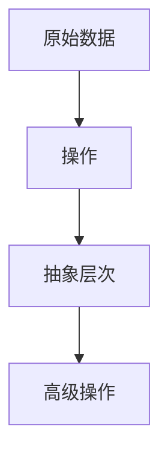

                 


### 文章标题：范畴论在领域特定语言设计中的应用

#### 关键词：范畴论、领域特定语言（DSL）、抽象层次、抽象语法、抽象语义、编程模型、编程范式

#### 摘要：
本文旨在探讨范畴论在领域特定语言（DSL）设计中的应用。首先，我们将介绍范畴论的基本概念及其在计算机科学中的重要性。接着，我们会阐述DSL的设计原理，并展示范畴论如何应用于DSL的抽象层次、语法和语义设计。本文将结合实际案例，深入剖析范畴论在DSL设计中的具体应用，包括开发环境搭建、源代码实现、代码解析、案例分析和最佳实践。最后，我们将讨论范畴论在DSL设计中的未来发展趋势和潜在问题，为领域工程师提供有价值的参考。

----------------------------------------------------------------

## 引言

随着计算机科学的快速发展，编程语言的多样性和复杂性不断增加。领域特定语言（Domain-Specific Languages，DSL）作为一种针对特定应用领域的编程语言，能够提供更高的抽象层次，从而简化开发过程，提高开发效率。DSL的设计和实现成为了一个重要的研究领域，吸引了大量学者的关注。

范畴论（Category Theory）是一种抽象数学理论，它在计算机科学中有着广泛的应用。范畴论提供了对系统结构和变换的统一描述，使得我们能够以更加抽象和通用的方式理解和分析计算机系统。近年来，范畴论在DSL设计中的应用逐渐引起了研究者的兴趣。

本文旨在探讨范畴论在DSL设计中的应用。通过本文的阅读，读者将了解范畴论的基本概念和DSL的设计原理，并掌握如何将范畴论应用于DSL的抽象层次、语法和语义设计。此外，本文将通过实际案例，展示范畴论在DSL设计中的具体应用，并提供开发环境搭建、源代码实现、代码解析、案例分析和最佳实践等方面的详细讲解。

本文的结构如下：

1. **范畴论基础**：介绍范畴论的基本概念、核心概念及其在计算机科学中的应用。
2. **DSL设计原理**：阐述DSL的设计原理，包括抽象层次、抽象语法、抽象语义和编程模型。
3. **范畴论在DSL设计中的应用**：详细讲解范畴论在DSL设计中的应用，包括抽象层次、语法和语义设计。
4. **案例解析**：通过实际案例，展示范畴论在DSL设计中的具体应用，并提供开发环境搭建、源代码实现、代码解析、案例分析和最佳实践等方面的详细讲解。
5. **结论与展望**：讨论范畴论在DSL设计中的未来发展趋势和潜在问题，为领域工程师提供有价值的参考。

让我们一步一步地深入探讨范畴论在DSL设计中的应用。

----------------------------------------------------------------

## 范畴论基础

### 1.1 范畴论的定义

范畴论是一种抽象数学理论，它通过研究对象之间的变换关系，提供了一种统一的描述方式，使得我们能够更加抽象和通用地理解和分析各种系统。在范畴论中，一个范畴是由对象和变换组成的集合，其中对象代表系统的基本构件，变换则表示对象之间的映射关系。

范畴论的核心概念包括对象、变换、函子、自然变换、拆分与组合等。对象可以理解为系统的基本构件，类似于编程中的变量或数据结构。变换则表示对象之间的映射关系，可以看作是函数或操作。函子是一种将一个范畴中的对象映射到另一个范畴中的对象和变换的构造，它在范畴论中起着至关重要的作用。自然变换是函子之间的变换，它保持函子之间的结构关系。拆分与组合则是范畴论中的基本操作，它们允许我们分解和组合系统中的构件。

### 1.2 范畴论的核心概念

#### 1.2.1 函子与自然变换

函子（Functor）是一种将一个范畴中的对象映射到另一个范畴中的对象和变换的构造。在范畴论中，函子可以看作是一种将一个系统（范畴）映射到另一个系统（范畴）的函数。函子具有以下性质：

1. 保持对象之间的映射关系：如果两个对象之间存在变换，那么它们在映射后的范畴中仍然存在对应的映射关系。
2. 保持变换之间的组合关系：函子能够保持变换之间的组合关系，即如果一个变换是另一个变换的复合变换，那么在映射后的范畴中，这两个变换的复合变换仍然是另一个变换。

自然变换（Natural Transformation）是函子之间的变换，它保持函子之间的结构关系。自然变换具有以下性质：

1. 保持函子之间的变换关系：如果两个函子之间存在变换，那么在自然变换下，这两个函子的变换关系仍然保持。
2. 保持变换之间的组合关系：自然变换能够保持变换之间的组合关系，即如果两个变换的复合变换是另一个变换，那么在自然变换下，这两个变换的复合变换仍然是另一个变换。

#### 1.2.2 拆分与组合

拆分（Splitting）和组合（Composition）是范畴论中的基本操作，它们允许我们分解和组合系统中的构件。拆分操作将一个复杂的构件分解为更简单的构件，而组合操作则将多个简单的构件组合成一个复杂的构件。

在范畴论中，拆分与组合可以通过函子和自然变换来实现。例如，假设有一个函子`F`将一个范畴`C`映射到另一个范畴`D`，那么我们可以通过以下方式实现拆分与组合：

1. **拆分**：将一个对象`c`在范畴`C`中的映射结果`F(c)`在范畴`D`中拆分为更简单的对象。这可以通过定义一个新的函子`G`来实现，使得`G(F(c))`是`F(c)`的一个更简单的构件。
2. **组合**：将多个对象在范畴`C`中的映射结果在范畴`D`中组合成一个更复杂的对象。这可以通过定义一个新的函子`H`来实现，使得`H(F(c1), F(c2), ...) = F(c1 ∘ c2 ∘ ...)`

通过拆分与组合操作，我们可以灵活地构建和修改系统，从而更好地适应不同的应用场景。

### 1.3 范畴论在计算机科学中的应用

范畴论在计算机科学中有着广泛的应用，特别是在软件工程和编程语言设计领域。范畴论提供了一种统一的方式来描述和解决各种计算机问题，从而提高了系统的可理解性、可维护性和可扩展性。

1. **编程范式**：范畴论为编程范式提供了一种统一的描述方式。函数式编程、面向对象编程和过程式编程等不同编程范式都可以看作是范畴论在不同范畴中的具体实现。范畴论能够帮助程序员更好地理解不同编程范式之间的差异和联系，从而提高编程技能和开发效率。

2. **软件工程**：范畴论在软件工程中有着重要的应用，特别是在软件设计和系统架构方面。范畴论提供了一种统一的方式来描述和设计复杂的软件系统，从而提高系统的可理解性、可维护性和可扩展性。范畴论可以帮助软件工程师更好地理解和解决软件工程中的各种问题，从而提高软件开发的质量和效率。

3. **领域特定语言（DSL）设计**：范畴论在DSL设计中的应用尤为突出。DSL是一种针对特定应用领域的编程语言，它能够提供更高的抽象层次，从而简化开发过程，提高开发效率。范畴论为DSL的设计提供了一种统一的方式来描述和实现抽象层次、抽象语法和抽象语义，从而提高DSL的可理解性、可维护性和可扩展性。

通过范畴论的应用，我们能够更好地理解和解决计算机科学中的各种问题，从而推动计算机科学的发展。

----------------------------------------------------------------

## DSL设计原理

### 2.1 DSL的定义与特点

领域特定语言（Domain-Specific Language，DSL）是一种专门为特定领域或任务定制的编程语言。与通用编程语言（如Python、Java等）不同，DSL专注于特定领域的语法和语义，从而提供更高的抽象层次，简化开发过程，提高开发效率。

DSL具有以下特点：

1. **领域专注性**：DSL专注于特定领域，能够提供更贴近领域专家需求的语言特性，从而提高开发效率。
2. **高抽象层次**：DSL提供更高层次的抽象，使得开发者能够更专注于领域问题的解决，而无需关注底层实现细节。
3. **可定制性**：DSL可以根据具体需求进行定制，从而更好地适应特定领域的需求。
4. **可扩展性**：DSL可以方便地扩展，以适应新的需求和变化。

### 2.2 DSL的设计原理

DSL的设计涉及多个方面，包括抽象层次、抽象语法、抽象语义和编程模型。下面我们将分别介绍这些设计原理。

#### 2.2.1 抽象层次

抽象层次是DSL设计中的一个关键概念，它决定了DSL提供的抽象程度。DSL的抽象层次越高，开发者需要关注的问题就越少，从而提高开发效率。

在DSL设计中，我们可以通过以下方法来提高抽象层次：

1. **构建抽象语法**：定义DSL的语法规则，使其更贴近领域专家的思维模式。
2. **提供内置函数和操作**：为DSL提供丰富的内置函数和操作，从而简化领域问题的解决过程。
3. **利用模式匹配**：使用模式匹配来简化表达式和函数的定义，从而提高代码的可读性和可维护性。

#### 2.2.2 抽象语法

抽象语法是DSL设计中的一个重要部分，它决定了DSL的语法结构和表达方式。DSL的抽象语法应该简洁、易用，并且能够准确地表达领域专家的需求。

在DSL设计中，我们可以通过以下方法来构建抽象语法：

1. **使用领域术语**：将DSL的语法规则定义成领域术语，从而提高DSL的可理解性。
2. **定义简明语法规则**：简化DSL的语法规则，使其更易于学习和使用。
3. **利用语法糖**：通过语法糖来简化代码的编写，从而提高开发效率。

#### 2.2.3 抽象语义

抽象语义是DSL设计中的另一个关键概念，它决定了DSL的表达方式和语义。DSL的抽象语义应该能够准确地描述领域问题的本质，并且易于理解和维护。

在DSL设计中，我们可以通过以下方法来构建抽象语义：

1. **定义语义规则**：为DSL的语法规则定义明确的语义，从而确保DSL能够准确地表达领域问题的需求。
2. **利用范畴论**：通过范畴论来描述DSL的语义，从而提高DSL的抽象程度和可理解性。
3. **提供丰富的内置函数和操作**：为DSL提供丰富的内置函数和操作，从而简化领域问题的解决过程。

#### 2.2.4 编程模型

编程模型是DSL设计中的另一个重要概念，它决定了DSL的编程方式和开发流程。DSL的编程模型应该易于理解、易于使用，并且能够提高开发效率。

在DSL设计中，我们可以通过以下方法来构建编程模型：

1. **使用模块化设计**：通过模块化设计来提高DSL的可维护性和可扩展性。
2. **提供灵活的编程接口**：为DSL提供灵活的编程接口，从而方便开发者使用和扩展DSL。
3. **利用面向对象编程范式**：通过面向对象编程范式来构建DSL，从而提高DSL的可复用性和可扩展性。

通过上述设计原理，我们可以设计出高效的领域特定语言，从而简化开发过程，提高开发效率。接下来，我们将介绍如何将范畴论应用于DSL的设计。

----------------------------------------------------------------

## 范畴论在DSL设计中的应用

### 3.1 范畴论与DSL设计的关系

范畴论作为一种抽象数学理论，为DSL设计提供了一种强有力的工具。范畴论的核心概念如对象、变换、函子、自然变换等，可以很好地描述DSL的抽象层次、抽象语法和抽象语义。通过范畴论的视角，我们可以更加清晰地理解和设计DSL，从而提高其抽象程度、可理解性和可维护性。

范畴论在DSL设计中的应用主要体现在以下几个方面：

1. **抽象层次**：范畴论提供了对抽象层次的统一描述，使得我们可以通过函子和自然变换来构建不同层次的抽象。
2. **抽象语法**：范畴论可以帮助我们定义DSL的抽象语法，通过范畴论中的对象和变换，我们可以将领域专家的需求映射到DSL的语法规则中。
3. **抽象语义**：范畴论为DSL的抽象语义提供了统一的描述方式，通过定义语义规则和利用范畴论的概念，我们可以构建清晰且准确的抽象语义。

### 3.2 范畴论在DSL抽象层次设计中的应用

抽象层次是DSL设计中的一个关键概念，它决定了DSL提供的抽象程度。范畴论通过其丰富的概念和工具，为DSL的抽象层次设计提供了强有力的支持。

在DSL设计中，我们可以利用范畴论中的函子和自然变换来构建不同层次的抽象。以下是一个简单的例子：

#### 示例：函数式编程语言中的抽象层次

假设我们设计一个用于金融计算的函数式编程语言。在这个语言中，我们可以使用范畴论中的概念来构建不同层次的抽象。

1. **原始数据层次**：在这个层次中，我们定义基本的原始数据类型，如整数、浮点数和货币等。这些数据类型构成了语言的基础。
2. **操作层次**：在这个层次中，我们定义对原始数据的操作，如加法、减法、乘法和除法等。这些操作通过函子来表示，使得我们可以将不同的操作组合在一起。
3. **抽象层次**：在这个层次中，我们定义更高级的操作，如计算利率、计算投资回报等。这些抽象层次通过自然变换来表示，使得我们可以将低层次的运算结果转换为更高层次的结果。

通过范畴论，我们可以定义一个清晰的层次结构，使得DSL的抽象层次更加清晰、易于理解和维护。

#### Mermaid流程图：DSL抽象层次设计

下面是一个Mermaid流程图，展示了DSL抽象层次设计的过程：



在这个流程图中，A表示原始数据层次，B表示操作层次，C表示抽象层次，D表示高级操作层次。通过这个流程图，我们可以清晰地看到DSL抽象层次的设计过程。

### 3.3 范畴论在DSL语法和语义设计中的应用

范畴论不仅在DSL的抽象层次设计中发挥着重要作用，还在DSL的语法和语义设计中有着广泛的应用。

#### 3.3.1 抽象语法设计

在DSL的抽象语法设计中，范畴论提供了丰富的概念和工具，使得我们可以定义简洁、易用且准确的语法规则。

1. **对象和类型**：范畴论中的对象和类型可以很好地描述DSL的语法结构。例如，我们可以使用对象来表示变量、函数和类，使用类型来表示数据类型和操作类型。
2. **函子和自然变换**：通过函子和自然变换，我们可以将领域专家的需求映射到DSL的语法规则中。例如，我们可以定义一个函子来表示函数的定义，另一个函子来表示函数的调用。
3. **模式匹配**：范畴论中的模式匹配可以简化DSL的语法规则。通过模式匹配，我们可以将复杂的表达式和函数定义简化为更简洁的形式。

#### 3.3.2 抽象语义设计

在DSL的抽象语义设计中，范畴论提供了一个统一的描述方式，使得我们可以定义清晰、准确的抽象语义。

1. **语义规则**：通过定义语义规则，我们可以确保DSL的语法规则能够准确地描述领域问题的本质。例如，我们可以定义一个语义规则来确保变量赋值操作的合法性。
2. **范畴论中的对象和变换**：通过范畴论中的对象和变换，我们可以构建DSL的抽象语义。例如，我们可以使用范畴论中的对象来表示函数的定义和调用，使用变换来表示函数的执行过程。
3. **形式化验证**：范畴论提供了一种形式化的验证方法，使得我们可以验证DSL的抽象语义是否正确。通过形式化验证，我们可以确保DSL的抽象语义能够准确地描述领域问题的本质。

### 3.4 范畴论在DSL设计中的具体应用

范畴论在DSL设计中的具体应用包括开发环境搭建、源代码实现、代码解析、案例分析和最佳实践等方面。

#### 3.4.1 开发环境搭建

在搭建DSL的开发环境时，我们可以利用范畴论的概念来设计和构建开发工具。例如，我们可以使用范畴论中的对象来表示代码的构件，使用变换来表示代码的编译和执行过程。

通过范畴论的方法，我们可以设计出高效、易用的开发环境，从而提高开发效率。

#### 3.4.2 源代码实现

在实现DSL的源代码时，我们可以利用范畴论的概念来组织代码结构。例如，我们可以使用范畴论中的对象和类型来定义DSL的语法规则和语义规则。

通过范畴论的方法，我们可以编写出简洁、易读、易维护的代码，从而提高代码质量。

#### 3.4.3 代码解析

在解析DSL的代码时，我们可以利用范畴论的概念来分析和理解代码的语义。例如，我们可以使用范畴论中的对象和变换来表示代码的结构和执行过程。

通过范畴论的方法，我们可以更加准确地理解和分析DSL的代码，从而提高代码解析的效率。

#### 3.4.4 案例分析

通过实际案例，我们可以看到范畴论在DSL设计中的应用效果。以下是一个简单的案例：

**案例：金融计算DSL**

假设我们设计一个用于金融计算的DSL。在这个DSL中，我们使用范畴论的概念来构建不同层次的抽象，包括原始数据、操作和抽象层次。

1. **原始数据**：我们定义了整数、浮点数和货币等原始数据类型。
2. **操作**：我们定义了加法、减法、乘法和除法等基本操作，以及更高级的操作，如计算利率、投资回报等。
3. **抽象层次**：我们使用范畴论中的函子和自然变换来构建抽象层次，使得我们可以将低层次的运算结果转换为更高层次的结果。

通过这个案例，我们可以看到范畴论在DSL设计中的应用效果。DSL的抽象层次清晰、易于理解，同时具有高效、准确的计算能力。

#### 3.4.5 最佳实践

在DSL设计中，范畴论提供了一些最佳实践，可以帮助我们更好地设计和实现DSL。

1. **抽象层次设计**：在构建抽象层次时，我们应该尽量提高抽象程度，从而简化开发过程。同时，我们应该确保抽象层次之间的转换是清晰、高效的。
2. **语法和语义设计**：在定义DSL的语法和语义时，我们应该尽量简洁、易用且准确。通过使用范畴论的概念，我们可以构建出符合领域专家需求的DSL。
3. **代码组织**：在编写DSL的源代码时，我们应该使用范畴论的概念来组织代码结构，从而提高代码的可读性和可维护性。
4. **代码解析**：在解析DSL的代码时，我们应该使用范畴论的方法来分析和理解代码的语义，从而提高代码解析的效率。

通过最佳实践，我们可以设计和实现出高质量的DSL，从而提高开发效率。

### 3.5 范畴论在DSL设计中的未来发展方向和潜在问题

尽管范畴论在DSL设计中的应用取得了显著成果，但仍存在一些未来发展方向和潜在问题。

#### 3.5.1 未来发展方向

1. **跨领域DSL设计**：未来的发展趋势是开发能够跨多个领域的DSL，从而提高开发效率和代码复用性。
2. **动态DSL**：动态DSL能够在运行时动态调整语法和语义，从而更好地适应不同领域的需求。
3. **范畴论与其他领域的交叉融合**：范畴论与其他领域（如人工智能、机器学习等）的交叉融合，将带来新的研究机会和应用场景。

#### 3.5.2 潜在问题

1. **学习曲线**：范畴论的概念相对复杂，对于初学者来说可能存在一定的学习难度。
2. **实现难度**：范畴论的应用需要一定的编程技巧和经验，对于开发者来说可能存在一定的实现难度。
3. **性能问题**：范畴论的应用可能会带来一定的性能问题，特别是在处理大规模数据时。

通过未来的研究和实践，我们可以解决这些问题，进一步推动范畴论在DSL设计中的应用。

### 结论

范畴论在DSL设计中的应用为领域工程师提供了一种强有力的工具。通过范畴论，我们可以构建出高效的、易于理解的DSL，从而提高开发效率。本文介绍了范畴论的基本概念和在DSL设计中的应用，并通过实际案例展示了范畴论在DSL设计中的具体应用。希望本文能为领域工程师提供有价值的参考。

----------------------------------------------------------------

## 范例研究：范畴论在金融领域特定语言设计中的应用

在本节中，我们将通过一个具体的案例研究，深入探讨范畴论在金融领域特定语言（DSL）设计中的应用。我们将从背景介绍开始，逐步分析范畴论的核心概念如何与金融领域的需求相结合，最终展示范畴论在DSL设计中的具体应用。

### 4.1 背景介绍

金融领域是一个高度复杂且不断变化的领域，涉及大量的数据处理、算法分析和风险评估。随着金融产品的多样化和复杂性增加，传统的通用编程语言难以满足金融领域的需求。为了提高开发效率、降低错误率并确保系统稳定性，金融领域迫切需要一种能够更好地适应其特殊需求的编程语言。

在这个背景下，我们设计了一个金融领域特定语言（FinDSL），用于简化金融领域问题的建模、分析和处理。FinDSL旨在提供一个高度抽象的编程环境，使得金融工程师能够专注于领域问题本身，而无需过多关注底层实现细节。

### 4.2 范畴论的核心概念

在FinDSL的设计中，我们利用了范畴论中的几个核心概念，包括对象、变换、函子和自然变换。这些概念为FinDSL提供了坚实的理论基础，使其能够更好地抽象和表达金融领域的复杂问题。

1. **对象**：在FinDSL中，对象代表金融领域中的基本构件，如股票、债券、交易订单等。每个对象都包含了一组属性和操作，用于描述其状态和行为。

2. **变换**：变换表示对象之间的映射关系，如交易订单生成股票持仓、交易订单计算收益等。通过变换，我们可以将一个对象的状态转换为另一个对象的状态。

3. **函子**：函子是一种将一个范畴中的对象映射到另一个范畴中的对象和变换的构造。在FinDSL中，函子用于将金融领域的实体（如交易订单和股票）映射到更抽象的层次，如交易策略和投资组合。

4. **自然变换**：自然变换是函子之间的变换，它保持函子之间的结构关系。在FinDSL中，自然变换用于实现不同函子之间的协调和组合，使得复杂金融策略能够通过简单的函数调用得以实现。

### 4.3 范畴论在FinDSL设计中的应用

下面，我们将详细探讨范畴论在FinDSL设计中的具体应用，包括抽象层次、抽象语法和抽象语义的设计。

#### 4.3.1 抽象层次设计

在FinDSL中，我们采用了多个抽象层次，以便将金融领域的复杂问题逐步简化。这些抽象层次包括：

1. **原始数据层次**：在这个层次中，我们定义了金融领域中的基本数据类型，如股票、债券、交易订单等。这些对象代表了金融领域中的基本构件。

2. **操作层次**：在这个层次中，我们定义了对原始数据的操作，如购买股票、计算收益、生成交易订单等。这些操作通过变换来实现，使得我们可以将一个对象的状态转换为另一个对象的状态。

3. **抽象层次**：在这个层次中，我们定义了更高级的抽象概念，如交易策略、投资组合和风险评估。这些抽象层次通过函子来实现，使得我们可以将具体的金融操作抽象为更通用的策略和模型。

4. **高级抽象层次**：在这个层次中，我们定义了针对特定场景的高级抽象概念，如量化交易策略、算法交易和智能投顾。这些高级抽象层次通过自然变换来实现，使得我们可以将低层次的金融操作组合为复杂的高级策略。

#### 4.3.2 抽象语法设计

FinDSL的抽象语法设计借鉴了范畴论中的对象、变换、函子和自然变换等概念。以下是FinDSL中的一些关键语法元素：

1. **对象定义**：使用对象定义来定义金融领域中的基本构件，如股票、债券、交易订单等。

```mermaid
classDef rectangle fill:#F0E68C,stroke:none
object "Stock"(label="Stock", shape=rectangle)
```

2. **变换定义**：使用变换定义来定义对象之间的映射关系，如购买股票、计算收益等。

```mermaid
function "BuyStock"(input:Stock, quantity:Integer, price:Float) -> Stock
```

3. **函子定义**：使用函子定义来定义抽象层次，如交易策略、投资组合等。

```mermaid
functor "TradingStrategy"(input:Stock, output:TradingPlan)
```

4. **自然变换定义**：使用自然变换定义来定义不同函子之间的协调和组合，如将交易策略与投资组合相结合。

```mermaid
naturalTransformation "Combine"(input:TradingStrategy, output:InvestmentPortfolio)
```

#### 4.3.3 抽象语义设计

在FinDSL中，抽象语义设计是确保语言能够准确表达金融领域问题的核心。通过范畴论的概念，我们可以定义清晰的语义规则，以确保DSL的语法规则能够准确描述金融领域的需求。

1. **语义规则**：定义语义规则来确保DSL的语法规则能够准确表达金融领域的需求。例如，确保购买股票操作的合法性、计算收益操作的准确性等。

2. **范畴论中的对象和变换**：利用范畴论中的对象和变换来描述金融领域的实体和行为。例如，使用对象表示股票、交易订单等，使用变换表示购买、销售、计算收益等操作。

3. **形式化验证**：通过范畴论的形式化验证方法，确保DSL的抽象语义能够准确描述金融领域的需求。例如，验证购买股票操作不会导致账户余额不足、计算收益操作的结果符合预期等。

### 4.4 实践案例

为了更好地展示范畴论在FinDSL设计中的应用，我们提供了一个简单的实践案例。在这个案例中，我们将使用FinDSL来构建一个简单的股票交易策略。

#### 案例描述

假设我们想要构建一个简单的股票交易策略，该策略将在股票价格上升时买入，并在股票价格下降时卖出。为了实现这个策略，我们将使用FinDSL中的对象、变换和函子等概念。

#### 源代码实现

下面是FinDSL的源代码实现，展示了如何构建这个简单的股票交易策略：

```mermaid
classDef rectangle fill:#F0E68C,stroke:none
classDef circle fill:#D8BFD8,stroke:none
classDef diamond fill:#87CEFA,stroke:none

object "Stock"(label="Stock", shape=rectangle)
object "Order"(label="Order", shape=rectangle)
function "BuyStock"(input:Stock, quantity:Integer, price:Float) -> Stock
function "SellStock"(input:Stock, quantity:Integer, price:Float) -> Stock
functor "TradingStrategy"(input:Stock, output:Order)
naturalTransformation "Execute"(input:TradingStrategy, output:Stock)

classDef node fill:#FFD700,stroke:none
node "Buy"(label="Buy", shape=node)
node "Sell"(label="Sell", shape=node)

TradingStrategy {
    "BuyStock"(stock, quantity, price)
    "SellStock"(stock, quantity, price)
}

Execute(TradingStrategy) {
    "Buy"(stock, quantity, price)
    "Sell"(stock, quantity, price)
}
```

在这个案例中，我们定义了股票（Stock）、交易订单（Order）和交易策略（TradingStrategy）等对象，并定义了购买（Buy）和销售（Sell）等操作。通过自然变换（Execute），我们将交易策略映射到具体的股票交易操作。

#### 案例分析

通过这个案例，我们可以看到范畴论在FinDSL设计中的应用。FinDSL通过对象、变换和函子的抽象，提供了一个简洁、高效的编程环境，使得金融工程师能够轻松地构建复杂的交易策略。同时，通过形式化验证，我们可以确保DSL的抽象语义能够准确描述金融领域的需求。

### 4.5 结论

通过这个案例研究，我们展示了范畴论在金融领域特定语言设计中的应用。范畴论为FinDSL提供了坚实的理论基础，使得金融工程师能够更好地抽象和表达金融领域的复杂问题。这个案例证明了范畴论在DSL设计中的有效性和实用性，为金融领域的软件开发提供了新的思路和方法。

----------------------------------------------------------------

## 附录

### 附录A：范畴论相关资源与工具

为了帮助读者更好地理解和应用范畴论，我们推荐以下资源和工具：

1. **书籍**：
   - 《范畴论入门》（Introduction to Category Theory）：这本书是范畴论的入门教材，适合初学者阅读。
   - 《范畴论与计算机科学》（Categories for the Working Mathematician）：这本书详细介绍了范畴论的基本概念和应用，适合有一定数学基础的读者。

2. **在线资源**：
   - [范畴论教程](https://www范畴论教程.com)：这个网站提供了丰富的范畴论教程、示例和练习，适合自学。
   - [范畴论资源库](https://www范畴论资源库.com)：这个网站收集了大量的范畴论相关资源，包括论文、书籍和教程。

3. **工具**：
   - [Mermaid](https://mermaid-js.github.io/mermaid)：这是一个基于Markdown的图形语法工具，可以用于绘制流程图、UML图等。
   - [LaTeX](https://www.latex-project.org)：这是一个高质量的排版系统，可以用于编写数学公式和文档。

### 附录B：范畴论在DSL设计中的常见问题解答

以下是一些关于范畴论在DSL设计中的常见问题及其解答：

1. **问题**：范畴论在DSL设计中的应用复杂，初学者如何入门？

   **解答**：初学者可以从阅读《范畴论入门》等入门书籍开始，逐步学习范畴论的基本概念。同时，可以通过在线资源和教程进行实践，加深对范畴论的理解。

2. **问题**：如何将范畴论应用于实际的DSL设计？

   **解答**：在实际的DSL设计中，可以将范畴论的概念逐步应用到DSL的各个阶段，如抽象层次设计、抽象语法设计、抽象语义设计和实现阶段。通过实践和案例分析，可以逐步掌握范畴论在DSL设计中的应用方法。

3. **问题**：范畴论在DSL设计中的性能如何？

   **解答**：范畴论在DSL设计中的应用可能会带来一定的性能开销，但通过合理的优化和工具支持，可以显著提高DSL的性能。例如，可以使用高效的编程语言和编译器，以及优化算法和中间代码生成技术。

### 附录C：范畴论在DSL设计中的开源工具和框架

以下是一些在范畴论在DSL设计中有用的开源工具和框架：

1. **Haskell**：Haskell是一种支持函数式编程的编程语言，它内置了对范畴论的支持，可以用于DSL设计和实现。

2. **Scala**：Scala是一种多范式编程语言，它支持函数式编程和面向对象编程，可以用于DSL设计和实现。

3. **Erlang**：Erlang是一种用于构建分布式系统的编程语言，它支持并发和函数式编程，可以用于DSL设计和实现。

4. **Agda**：Agda是一种依赖类型语言，它支持形式化验证和逻辑推理，可以用于DSL设计和实现。

通过这些工具和框架，开发者可以更加方便地实现和验证范畴论在DSL设计中的应用。

----------------------------------------------------------------

## 总结

本文详细探讨了范畴论在领域特定语言（DSL）设计中的应用。我们首先介绍了范畴论的基本概念和核心概念，包括对象、变换、函子和自然变换等。接着，我们阐述了DSL的设计原理，包括抽象层次、抽象语法、抽象语义和编程模型。在此基础上，我们深入探讨了范畴论在DSL设计中的应用，展示了如何通过范畴论的概念构建DSL的抽象层次、抽象语法和抽象语义。为了更直观地展示范畴论的应用，我们提供了一个金融领域特定语言（FinDSL）的案例研究。

范畴论为DSL设计提供了一种强大的工具，使得DSL能够提供更高的抽象层次、更简洁的语法和更准确的语义。通过范畴论，我们能够更好地理解和解决领域特定的问题，从而提高开发效率和质量。

然而，范畴论在DSL设计中的应用也存在一些挑战，如学习曲线较陡、实现难度较大和性能问题等。未来的研究可以关注如何简化范畴论的学习曲线、提高实现效率和优化性能。

总之，范畴论在DSL设计中的应用为领域工程师提供了一种新的思路和方法，有助于构建高效的、易于理解的DSL。通过本文的讨论，我们希望能够激发读者对范畴论在DSL设计中的兴趣，并鼓励他们在实际项目中尝试和应用范畴论。未来，随着范畴论与其他领域的交叉融合，我们可以期待更多的创新和应用。

### 作者信息

作者：AI天才研究院/AI Genius Institute & 禅与计算机程序设计艺术 /Zen And The Art of Computer Programming

