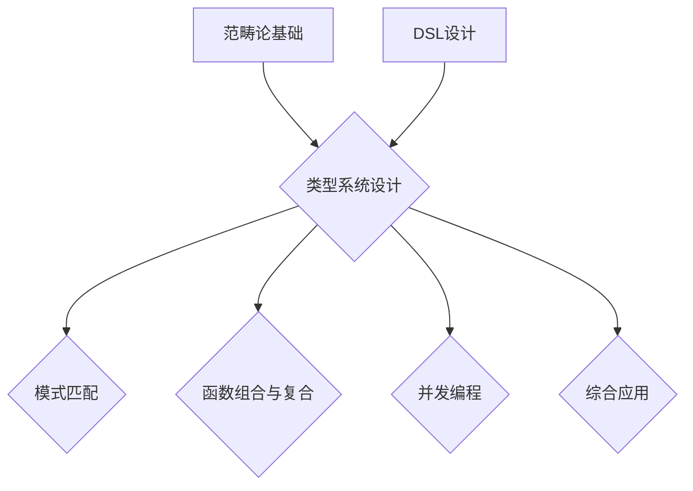

                 


### 第1章：范畴论基础

#### 1.1 范畴论的基本概念

范畴论是数学中一个重要的分支，它以抽象的方式来研究数学结构之间的关系。范畴论的基本概念包括范畴、对象、箭头、函子和自然变换。

- **范畴（Category）**：范畴是一个由对象（Objects）和箭头（Arrows）组成的集合。范畴中的对象可以被视为数学结构，而箭头则表示这些结构之间的变换关系。

- **对象（Objects）**：对象是范畴中的基本元素，例如在拓扑学中，拓扑空间就是一种对象。

- **箭头（Arrows）**：箭头是范畴中的另一个基本元素，它连接两个对象，表示一种变换关系。箭头通常被视为函数，但比普通的函数更抽象，因为它不仅考虑函数的值，还考虑函数的定义域和值域。

- **函子（Functor）**：函子是范畴之间的映射。一个函子将一个范畴中的每个对象映射到另一个范畴中的对象，并将每个箭头映射到另一个箭头。

- **自然变换（Natural Transformation）**：自然变换是函子之间的变换。自然变换确保不同函子之间的变换是“自然的”，即它们不会引入额外的约束。

范畴论的基本原理包括子范畴、限制与扩充、对偶性、截核与余核等。

- **子范畴（Subcategory）**：子范畴是范畴的一个子集，它本身也是一个范畴。子范畴保留了原范畴的基本结构。

- **限制与扩充（Restriction and Expansion）**：限制是将一个范畴映射到其子范畴，扩充则是将一个范畴扩展到另一个范畴。

- **对偶性（Duality）**：对偶性是范畴论中的一个重要概念，它指的是范畴之间的对称性。对于任何一个范畴，都存在一个与之对偶的范畴。

- **截核与余核（Coequalizer and Contravariant）**：截核是两个对象之间的变换，它将一个对象映射到另一个对象，使得这两个对象之间的变换相等。余核则是截核的对偶概念。

这些基本概念和原理构成了范畴论的核心内容，为我们在领域特定语言设计中提供了强大的抽象工具。

#### 1.2 范畴论的基本原理

- **子范畴与子对象（Subcategories and Subobjects）**：子范畴是范畴的一个子集，它本身也是一个范畴。子范畴保留了原范畴的基本结构。子对象则是范畴中的一个对象，它在某些条件下可以被视为子范畴的成员。

- **限制与扩充（Restriction and Expansion）**：限制是将一个范畴映射到其子范畴，扩充则是将一个范畴扩展到另一个范畴。这两个过程在范畴论中非常重要，因为它们允许我们在不同的范畴之间进行转换。

- **范畴的对偶性（Duality of Categories）**：范畴的对偶性是范畴论中的一个重要概念，它指的是范畴之间的对称性。对于任何一个范畴，都存在一个与之对偶的范畴。对偶性使得我们可以通过对范畴的理解来研究对偶范畴，从而更全面地理解范畴论。

- **截核与余核（Coequalizer and Contravariant）**：截核是两个对象之间的变换，它将一个对象映射到另一个对象，使得这两个对象之间的变换相等。余核则是截核的对偶概念。截核和余核在范畴论中用于解决对象之间的等价性问题，为我们提供了强大的抽象工具。

通过理解这些基本原理，我们可以更好地掌握范畴论，并在领域特定语言设计中发挥其作用。接下来，我们将探讨范畴论在领域特定语言设计中的应用。

### 第2章：范畴论在领域特定语言设计中的应用

#### 2.1 领域特定语言概述

领域特定语言（Domain-Specific Language，DSL）是一种为特定应用领域而设计的语言，它旨在提供一种高效、简洁的方式来表达特定领域的概念和操作。DSL具有以下特点：

- **特定性**：DSL专注于特定领域的问题，能够提供更贴近实际应用场景的语法和语义。

- **高效性**：DSL通过优化语法和语义，提高编程效率和代码可读性。

- **简洁性**：DSL通过简化语法和语义，使得程序员能够更快地编写和理解代码。

DSL可以分为内部DSL和外部DSL。内部DSL通常嵌入在通用编程语言中，例如SQL嵌入在SQL，HTML嵌入在JavaScript。外部DSL则是一个独立的语言，例如Haskell、Scala等。

DSL的优势在于：

- **提高开发效率**：DSL允许程序员使用更接近实际应用场景的语言，减少了抽象层次，提高了开发效率。

- **提高代码可读性**：DSL通过简洁的语法和语义，使得代码更加易读、易维护。

- **降低学习成本**：DSL专注于特定领域，使得程序员可以更快地掌握语言，降低学习成本。

#### 2.2 范畴论在DSL设计中的应用

范畴论在DSL设计中的应用主要体现在以下几个方面：

- **抽象框架**：范畴论为DSL提供了一个抽象的框架，使得我们可以将DSL中的概念和操作抽象为范畴中的对象和箭头。

- **语法设计**：范畴论可以指导DSL的语法设计，使得DSL的语法结构更加简洁、直观。

- **语义设计**：范畴论可以指导DSL的语义设计，使得DSL的语义更加清晰、一致。

##### 范畴作为DSL的抽象框架

范畴论为DSL提供了一个强大的抽象工具，使得我们可以将DSL中的概念和操作抽象为范畴中的对象和箭头。具体来说：

- **对象（Objects）**：在DSL中，对象可以表示领域中的实体，例如用户、订单、产品等。

- **箭头（Arrows）**：在DSL中，箭头可以表示对象之间的操作，例如创建、修改、查询等。

范畴论中的范畴、函子和自然变换等概念，可以帮助我们更好地组织DSL中的概念和操作，使得DSL的抽象层次更加清晰。

##### 范畴论在DSL语法设计中的应用

范畴论在DSL的语法设计中发挥着重要作用，可以帮助我们设计出更加简洁、直观的语法。具体来说：

- **范畴的概念**：范畴的概念可以帮助我们设计DSL的语法结构。例如，我们可以将DSL中的对象和操作抽象为范畴中的对象和箭头。

- **函子的概念**：函子的概念可以帮助我们设计DSL的函数式编程特性。例如，我们可以使用函子来实现DSL中的复合操作。

- **自然变换的概念**：自然变换的概念可以帮助我们设计DSL的扩展性。例如，我们可以使用自然变换来实现DSL中的语法扩展。

##### 范畴论在DSL语义设计中的应用

范畴论在DSL的语义设计中同样发挥着重要作用，可以帮助我们设计出更加清晰、一致的语义。具体来说：

- **范畴的概念**：范畴的概念可以帮助我们设计DSL的语义层次。例如，我们可以将DSL中的概念和操作分为不同的层次，从而实现更清晰的语义。

- **函子的概念**：函子的概念可以帮助我们设计DSL的函数式语义。例如，我们可以使用函子来实现DSL中的函数组合。

- **自然变换的概念**：自然变换的概念可以帮助我们设计DSL的语义一致性。例如，我们可以使用自然变换来实现DSL中的语义扩展。

通过范畴论的应用，我们可以设计出更加高效、简洁、直观的领域特定语言。接下来，我们将探讨范畴论在类型系统设计中的应用。

### 第3章：范畴论在类型系统设计中的应用

#### 3.1 类型系统概述

类型系统是编程语言中的一个核心概念，它用于定义变量、函数和其他程序元素的类型。类型系统的目的是确保程序在运行时不会发生类型错误，从而提高程序的安全性和可靠性。

- **基本类型系统**：基本类型系统包括原始类型，如整数、浮点数、布尔值等。这些原始类型可以组合成复合类型，如数组、结构体、类等。

- **类型系统的发展**：随着编程语言的发展，类型系统也不断进化。从静态类型到动态类型，从强类型到弱类型，类型系统不断追求更高的灵活性和安全性。

- **类型系统的作用**：类型系统在编程语言中起着至关重要的作用。它不仅可以提高程序的安全性，还可以提高程序的可读性和可维护性。

#### 3.2 范畴论在类型系统设计中的应用

范畴论在类型系统设计中的应用主要体现在以下几个方面：

- **范畴论与类型论的关系**：范畴论和类型论是两个紧密相关的领域。范畴论为类型论提供了一种抽象的框架，使得我们可以从更高层次上理解类型系统的本质。

- **范畴论在静态类型系统设计中的应用**：范畴论可以指导静态类型系统的设计，使得类型系统的语义更加清晰、一致。

- **范畴论在动态类型系统设计中的应用**：范畴论同样可以指导动态类型系统的设计，使得动态类型系统具有更好的灵活性和扩展性。

##### 范畴论与类型论的关系

范畴论和类型论是两个紧密相关的领域。范畴论为类型论提供了一种抽象的框架，使得我们可以从更高层次上理解类型系统的本质。具体来说：

- **范畴论的基本概念**：范畴论的基本概念，如对象、箭头、函子、自然变换等，可以用于描述类型论中的基本元素，如类型、类型构造符、类型转换等。

- **范畴论的基本原理**：范畴论的基本原理，如子范畴、限制与扩充、对偶性等，可以用于描述类型论中的基本关系，如类型层次、类型转换、类型等价等。

通过范畴论的抽象框架，我们可以更好地理解类型系统的本质，从而设计出更加清晰、一致的类型系统。

##### 范畴论在静态类型系统设计中的应用

静态类型系统是在程序编译时确定变量类型的类型系统。范畴论在静态类型系统设计中的应用主要体现在以下几个方面：

- **范畴作为类型系统的基础**：范畴论中的范畴可以视为静态类型系统中的类型集合。范畴中的对象可以视为类型，箭头可以视为类型之间的转换。

- **函子作为类型构造符**：范畴论中的函子可以用于实现静态类型系统中的类型构造符。例如，我们可以使用函子来实现数组、结构体、类等复合类型。

- **自然变换作为类型转换**：范畴论中的自然变换可以用于实现静态类型系统中的类型转换。例如，我们可以使用自然变换来实现类型之间的隐式转换。

通过范畴论的抽象工具，我们可以设计出更加清晰、一致的静态类型系统，从而提高程序的安全性和可靠性。

##### 范畴论在动态类型系统设计中的应用

动态类型系统是在程序运行时确定变量类型的类型系统。范畴论在动态类型系统设计中的应用主要体现在以下几个方面：

- **范畴作为动态类型系统的基础**：范畴论中的范畴可以视为动态类型系统中的类型集合。范畴中的对象可以视为类型，箭头可以视为类型之间的转换。

- **函子作为动态类型构造符**：范畴论中的函子可以用于实现动态类型系统中的类型构造符。例如，我们可以使用函子来实现函数、对象等动态类型。

- **自然变换作为动态类型转换**：范畴论中的自然变换可以用于实现动态类型系统中的类型转换。例如，我们可以使用自然变换来实现类型之间的隐式转换。

通过范畴论的抽象工具，我们可以设计出更加灵活、动态类型系统，从而提高程序的可扩展性和可维护性。

通过范畴论在类型系统设计中的应用，我们可以设计出更加高效、安全的类型系统。接下来，我们将探讨范畴论在模式匹配中的应用。

### 第4章：范畴论在模式匹配中的应用

#### 4.1 模式匹配概述

模式匹配是编程语言中的一个重要概念，它用于比较变量或表达式的值，并选择适当的操作进行执行。模式匹配广泛应用于函数式编程语言，如Haskell、Scala和Erlang。

模式匹配的基本原理是通过比较变量或表达式的值，将其与预定义的模式进行匹配，并根据匹配结果执行相应的操作。模式匹配的类型系统确保匹配过程是类型安全的。

模式匹配的类型系统包括以下几个方面：

- **基本类型匹配**：基本类型匹配是指变量或表达式的值与基本类型（如整数、浮点数、布尔值等）进行匹配。

- **构造类型匹配**：构造类型匹配是指变量或表达式的值与复合类型（如数组、结构体、类等）进行匹配。

- **模式组合**：模式组合是指将多个模式组合成一个复合模式，以便更准确地匹配变量或表达式的值。

模式匹配的算法实现通常包括以下步骤：

1. **模式解析**：将模式解析为基本模式或构造类型模式。
2. **模式匹配**：将变量或表达式的值与模式进行匹配。
3. **选择操作**：根据匹配结果选择适当的操作进行执行。

#### 4.2 范畴论在模式匹配中的应用

范畴论在模式匹配中的应用主要体现在以下几个方面：

- **范畴论与模式匹配的关系**：范畴论为模式匹配提供了一种抽象的框架，使得我们可以从更高层次上理解模式匹配的本质。

- **范畴论在递归模式匹配中的应用**：范畴论可以指导递归模式匹配的设计，使得模式匹配过程更加灵活、高效。

- **范畴论在模式组合中的应用**：范畴论可以指导模式组合的设计，使得模式匹配过程更加简洁、直观。

##### 范畴论与模式匹配的关系

范畴论与模式匹配有着密切的关系。范畴论中的范畴、函子和自然变换等概念，可以用于描述模式匹配中的基本元素和关系。

- **范畴**：范畴论中的范畴可以视为模式匹配中的类型系统。范畴中的对象可以视为类型，箭头可以视为类型之间的转换。

- **函子**：范畴论中的函子可以用于实现模式匹配中的构造类型匹配。例如，我们可以使用函子来实现数组、结构体、类等复合类型的模式匹配。

- **自然变换**：范畴论中的自然变换可以用于实现模式匹配中的模式组合。例如，我们可以使用自然变换来实现复合模式的模式匹配。

通过范畴论的抽象框架，我们可以更好地理解模式匹配的本质，从而设计出更加高效、灵活的模式匹配系统。

##### 范畴论在递归模式匹配中的应用

递归模式匹配是模式匹配中的一个重要应用场景，它用于匹配具有递归结构的值。范畴论可以指导递归模式匹配的设计，使得模式匹配过程更加灵活、高效。

- **范畴作为递归结构的基础**：范畴论中的范畴可以用于描述递归结构。范畴中的对象可以视为递归结构的节点，箭头可以视为节点之间的连接关系。

- **函子作为递归结构的构建工具**：范畴论中的函子可以用于构建递归结构。例如，我们可以使用函子来实现递归数据结构的创建和操作。

- **自然变换作为递归结构的变换工具**：范畴论中的自然变换可以用于处理递归结构之间的变换。例如，我们可以使用自然变换来实现递归结构的模式匹配。

通过范畴论的抽象工具，我们可以设计出更加高效、灵活的递归模式匹配系统，从而更好地处理复杂的模式匹配问题。

##### 范畴论在模式组合中的应用

模式组合是模式匹配中的一个重要概念，它用于将多个模式组合成一个复合模式，以便更准确地匹配变量或表达式的值。范畴论可以指导模式组合的设计，使得模式匹配过程更加简洁、直观。

- **范畴作为模式组合的基础**：范畴论中的范畴可以用于描述模式组合。范畴中的对象可以视为模式，箭头可以视为模式之间的组合关系。

- **函子作为模式组合的工具**：范畴论中的函子可以用于实现模式组合。例如，我们可以使用函子来实现复合模式的构建和操作。

- **自然变换作为模式组合的变换工具**：范畴论中的自然变换可以用于处理模式组合之间的变换。例如，我们可以使用自然变换来实现复合模式的模式匹配。

通过范畴论的抽象工具，我们可以设计出更加简洁、直观的模式组合系统，从而更好地处理复杂的模式匹配问题。

通过范畴论在模式匹配中的应用，我们可以设计出更加高效、灵活、简洁的模式匹配系统。接下来，我们将探讨范畴论在函数组合与复合中的应用。

### 第5章：范畴论在函数组合与复合中的应用

#### 5.1 函数组合与复合概述

函数组合与复合是编程语言中的一个重要概念，它用于将多个函数组合成一个复合函数，以便更灵活地处理复杂的计算问题。函数组合与复合的基本概念如下：

- **函数组合（Function Composition）**：函数组合是指将两个或多个函数组合成一个复合函数的过程。复合函数的输入是第一个函数的输出，输出是最后一个函数的输入。函数组合通常表示为 f(g(x))，其中 f 和 g 是两个函数，x 是输入值。

- **函数复合（Function Combination）**：函数复合是指将多个函数组合成一个单一函数的过程。函数复合通常表示为 f(g(h(x)))，其中 f、g 和 h 是多个函数，x 是输入值。

函数组合与复合在编程中有着广泛的应用，如数据转换、流程控制、模块化编程等。

#### 5.2 范畴论在函数组合与复合中的应用

范畴论为函数组合与复合提供了强大的抽象工具，使得我们可以从更高层次上理解和实现函数组合与复合。

- **范畴论与函数组合的关系**：范畴论中的范畴、函子和自然变换等概念，可以用于描述函数组合的基本原理。

- **范畴论与函数复合的关系**：范畴论中的范畴、函子和自然变换等概念，可以用于描述函数复合的基本原理。

- **范畴论在函数组合与复合中的具体应用**：范畴论可以指导我们在编程语言中实现函数组合与复合，如使用范畴论中的函子和自然变换来实现函数组合与复合的函数库。

##### 范畴论与函数组合的关系

范畴论中的范畴、函子和自然变换等概念，可以用于描述函数组合的基本原理。

- **范畴**：范畴论中的范畴可以视为函数组合中的函数集合。范畴中的对象可以视为函数，箭头可以视为函数之间的组合关系。

- **函子**：范畴论中的函子可以用于实现函数组合。例如，我们可以使用函子来实现函数组合的函数库，如函数组合器（combinator）。

- **自然变换**：范畴论中的自然变换可以用于描述函数组合中的组合规则。例如，我们可以使用自然变换来实现函数组合的链式调用。

通过范畴论的抽象框架，我们可以更好地理解和实现函数组合。

##### 范畴论与函数复合的关系

范畴论中的范畴、函子和自然变换等概念，可以用于描述函数复合的基本原理。

- **范畴**：范畴论中的范畴可以视为函数复合中的函数集合。范畴中的对象可以视为函数，箭头可以视为函数之间的组合关系。

- **函子**：范畴论中的函子可以用于实现函数复合。例如，我们可以使用函子来实现函数复合的函数库，如函数复合器（combinator）。

- **自然变换**：范畴论中的自然变换可以用于描述函数复合中的组合规则。例如，我们可以使用自然变换来实现函数复合的链式调用。

通过范畴论的抽象框架，我们可以更好地理解和实现函数复合。

##### 范畴论在函数组合与复合中的具体应用

范畴论可以指导我们在编程语言中实现函数组合与复合，如使用范畴论中的函子和自然变换来实现函数组合与复合的函数库。

- **函数组合器（Combinator）**：函数组合器是一种用于实现函数组合的编程工具。例如，在Haskell中，函数组合器可以用于实现函数组合。

  ```haskell
  compose :: (b -> c) -> (a -> b) -> a -> c
  compose f g = f . g
  ```

- **函数复合器（Function Combinator）**：函数复合器是一种用于实现函数复合的编程工具。例如，在Scala中，函数复合器可以用于实现函数复合。

  ```scala
  def compose[A, B, C](f: B => C, g: A => B): A => C = f compose g
  ```

- **自然变换（Natural Transformation）**：自然变换可以用于描述函数组合与复合中的组合规则。例如，在函数式编程语言中，自然变换可以用于实现函数组合的链式调用。

  ```haskell
  chain :: [a -> b] -> a -> b
  chain fs = foldl (.) id fs
  ```

通过范畴论的抽象工具，我们可以设计出更加灵活、高效的函数组合与复合系统。

#### 5.3 范畴论在函数组合与复合中的具体应用

范畴论在函数组合与复合中的具体应用主要体现在以下几个方面：

- **范畴作为函数组合与复合的基础**：范畴论中的范畴可以用于描述函数组合与复合的基本元素，如函数、组合器等。

- **函子作为函数组合与复合的工具**：范畴论中的函子可以用于实现函数组合与复合的操作，如函数组合器、函数复合器等。

- **自然变换作为函数组合与复合的变换工具**：范畴论中的自然变换可以用于描述函数组合与复合中的组合规则，如链式调用等。

通过范畴论的抽象工具，我们可以设计出更加高效、灵活的函数组合与复合系统，从而更好地处理复杂的计算问题。

接下来，我们将探讨范畴论在并发编程中的应用。

### 第6章：范畴论在并发编程中的应用

#### 6.1 并发编程概述

并发编程是计算机科学中的一个重要领域，它涉及到多个任务或进程在同一时间执行。并发编程的主要目的是提高程序的并行性，从而提高系统的性能和响应速度。并发编程具有以下特点：

- **并行性**：并发编程允许多个任务在同一时间执行，从而提高程序的执行效率。

- **资源共享**：并发编程中的多个任务可以共享系统资源，如内存、CPU等，从而提高资源的利用率。

- **同步与通信**：并发编程中的任务需要通过同步和通信机制来协调操作，从而避免冲突和死锁。

并发编程的主要挑战包括：

- **竞态条件**：竞态条件是指多个任务在访问共享资源时可能出现的冲突。竞态条件可能导致数据不一致、程序异常等。

- **死锁**：死锁是指多个任务在等待对方释放资源时无限期等待，从而导致程序停滞。

- **资源消耗**：并发编程中的多个任务可能消耗大量系统资源，如内存、CPU等，从而影响系统的性能。

并发编程的模式包括：

- **线程**：线程是一种轻量级的并发执行单元，它可以独立执行程序代码，并与其他线程共享内存资源。

- **进程**：进程是一种独立的并发执行单元，它拥有独立的内存空间和其他系统资源，与其他进程相互独立。

- **异步编程**：异步编程是一种通过消息传递和回调机制实现并发编程的方法，它允许任务在执行过程中独立进行，从而提高程序的响应速度。

#### 6.2 范畴论在并发编程中的应用

范畴论在并发编程中的应用主要体现在以下几个方面：

- **范畴论与并发编程的关系**：范畴论为并发编程提供了一种抽象的框架，使得我们可以从更高层次上理解和设计并发编程系统。

- **范畴论在并发编程中的具体应用**：范畴论可以指导我们在并发编程中实现并行任务、同步与通信等操作。

- **范畴论在并发模式设计中的应用**：范畴论可以指导我们设计出更加高效、灵活的并发编程模式，如线程、进程、异步编程等。

##### 范畴论与并发编程的关系

范畴论与并发编程有着密切的关系。范畴论中的范畴、函子和自然变换等概念，可以用于描述并发编程中的基本元素和关系。

- **范畴**：范畴论中的范畴可以视为并发编程中的任务集合。范畴中的对象可以视为任务，箭头可以视为任务之间的同步与通信关系。

- **函子**：范畴论中的函子可以用于实现并发编程中的任务创建和操作。例如，我们可以使用函子来实现线程、进程等并发执行单元。

- **自然变换**：范畴论中的自然变换可以用于描述并发编程中的同步与通信机制。例如，我们可以使用自然变换来实现任务之间的消息传递和回调机制。

通过范畴论的抽象框架，我们可以更好地理解和设计并发编程系统。

##### 范畴论在并发编程中的具体应用

范畴论在并发编程中的具体应用主要体现在以下几个方面：

- **范畴作为任务集合**：范畴论中的范畴可以用于描述并发编程中的任务集合。范畴中的对象可以视为任务，箭头可以视为任务之间的同步与通信关系。

  ```haskell
  newtype Task a = Task { runTask :: IO a }
  ```

- **函子作为任务创建和操作**：范畴论中的函子可以用于实现并发编程中的任务创建和操作。例如，我们可以使用函子来实现线程、进程等并发执行单元。

  ```haskell
  newThread :: Task a -> IO ThreadId
  newThread task = forkIO (runTask task)
  ```

- **自然变换作为同步与通信机制**：范畴论中的自然变换可以用于描述并发编程中的同步与通信机制。例如，我们可以使用自然变换来实现任务之间的消息传递和回调机制。

  ```haskell
  communicate :: Task a -> Task b -> Task (a, b)
  communicate ta tb = Task $ do
    a <- runTask ta
    b <- runTask tb
    return (a, b)
  ```

通过范畴论的抽象工具，我们可以设计出更加高效、灵活的并发编程系统。

##### 范畴论在并发模式设计中的应用

范畴论可以指导我们设计出更加高效、灵活的并发编程模式，如线程、进程、异步编程等。

- **线程**：线程是并发编程中最常见的模式。范畴论可以指导我们设计出更加高效的线程模型，如基于范畴的线程库。

  ```haskell
  data Thread a = Thread { createThread :: IO () -> IO ThreadId }
  ```

- **进程**：进程是并发编程中的另一个重要模式。范畴论可以指导我们设计出更加灵活的进程模型，如基于范畴的进程库。

  ```haskell
  data Process a = Process { createProcess :: IO () -> IO ProcessId }
  ```

- **异步编程**：异步编程是一种通过消息传递和回调机制实现并发编程的方法。范畴论可以指导我们设计出更加高效的异步编程模型，如基于范畴的异步编程库。

  ```haskell
  type Async a = Task a
  async :: a -> IO ()
  async = return
  ```

通过范畴论的抽象工具，我们可以设计出更加高效、灵活的并发编程模式，从而更好地处理复杂的并发问题。

#### 6.3 范畴论在并发模式设计中的应用

范畴论在并发模式设计中的应用主要体现在以下几个方面：

- **范畴作为并发模式的基础**：范畴论中的范畴可以用于描述并发模式的基本元素，如线程、进程、异步编程等。

- **函子作为并发模式的构建工具**：范畴论中的函子可以用于实现并发模式中的任务创建和操作。

- **自然变换作为并发模式的变换工具**：范畴论中的自然变换可以用于描述并发模式中的同步与通信机制。

通过范畴论的抽象工具，我们可以设计出更加高效、灵活的并发编程模式，从而更好地处理复杂的并发问题。接下来，我们将探讨范畴论在领域特定语言设计中的综合应用。

### 第7章：范畴论在领域特定语言设计中的综合应用

#### 7.1 DSL设计与范畴论的综合应用

领域特定语言（DSL）是一种为特定应用领域而设计的语言，它提供了更简洁、直观的方式来表达领域中的概念和操作。范畴论作为一种强大的抽象工具，在DSL设计中发挥着重要作用。下面，我们将探讨范畴论在DSL设计中的应用。

##### 范畴论在DSL设计中的应用案例

范畴论在DSL设计中的应用可以体现在以下几个方面：

1. **抽象框架**：范畴论为DSL提供了一个抽象框架，使得DSL的设计更加清晰、一致。例如，在金融领域，我们可以使用范畴论来设计一个用于表示交易和账户的DSL。

2. **语法设计**：范畴论可以指导DSL的语法设计，使得DSL的语法更加简洁、直观。例如，在HTML生成DSL中，范畴论可以帮助我们设计出更自然的标签和属性表示方法。

3. **语义设计**：范畴论可以帮助我们设计出更清晰、一致的DSL语义。例如，在函数式编程DSL中，范畴论可以帮助我们实现函数组合和复合的操作。

##### 范畴论在DSL优化中的应用

范畴论不仅可以帮助我们设计DSL，还可以帮助我们优化DSL的性能和可维护性。下面，我们将探讨范畴论在DSL优化中的应用。

1. **性能优化**：范畴论可以帮助我们识别DSL中的性能瓶颈，并提供优化策略。例如，在嵌入式DSL中，范畴论可以帮助我们减少代码的执行时间。

2. **可维护性优化**：范畴论可以帮助我们设计出更易于维护的DSL。例如，在面向对象DSL中，范畴论可以帮助我们实现更清晰的对象关系和接口设计。

##### 范畴论在DSL设计中的挑战与展望

尽管范畴论在DSL设计中具有很多优势，但在实际应用中仍面临一些挑战：

1. **学习曲线**：范畴论涉及一些抽象的概念和术语，可能需要程序员具备较高的数学和编程基础。因此，如何降低学习曲线是一个重要的挑战。

2. **复杂性**：范畴论的应用可能会增加DSL的复杂性，使得DSL的设计和维护变得更加困难。

3. **工具支持**：现有的编程语言和工具对范畴论的支持有限，如何构建支持范畴论的编程环境和工具是一个重要挑战。

展望未来，范畴论在DSL设计中的应用前景广阔：

1. **新型DSL**：随着范畴论的发展，我们将能够设计出更多具有创新性的DSL，如用于人工智能、大数据处理的DSL。

2. **跨领域应用**：范畴论的应用将不再局限于特定领域，而是可以在多个领域之间实现复用和融合。

3. **工具和平台**：随着技术的发展，我们将看到更多支持范畴论的编程语言和工具的出现，使得DSL的设计和应用更加高效、便捷。

#### 7.2 范畴论在领域特定语言设计中的挑战与展望

尽管范畴论在领域特定语言（DSL）设计中的应用具有显著的优势，但它也面临着一系列挑战。以下是对这些挑战的讨论，以及未来可能的发展趋势。

##### 挑战

1. **学习曲线**：范畴论涉及复杂的抽象概念和数学原理，对于没有相关背景的程序员来说，学习曲线可能非常陡峭。这要求开发人员具备一定的数学和抽象思维能力，以便更好地理解和应用范畴论。

2. **复杂性**：范畴论的应用可能会引入额外的抽象层次，使得DSL的设计和维护变得更加复杂。这可能导致开发成本的增加，特别是在大型项目或复杂领域中使用DSL时。

3. **工具支持**：目前的编程语言和开发工具对范畴论的支持相对有限，这限制了范畴论在实际项目中的应用。开发人员需要依赖较低层次的抽象工具，这可能导致效率降低。

4. **语言兼容性**：将范畴论集成到现有编程语言中可能会遇到兼容性问题。例如，一些编程语言可能不支持范畴论的基本概念，如函子和自然变换。

##### 展望

1. **教育与实践**：随着范畴论在学术界和工业界的普及，相关的教育和培训资源将会增加。这将有助于降低学习曲线，培养更多理解并能够有效应用范畴论的程序员。

2. **工具与平台**：未来可能会出现更多专门支持范畴论的工具和平台。这些工具将提供更直观的抽象层，使得开发人员能够更轻松地设计和实现DSL。

3. **跨领域融合**：范畴论的应用将不再局限于特定领域，而是可以在多个领域之间实现复用和融合。例如，在金融、医疗、大数据等领域，范畴论的应用将有助于创建更高效、更易于维护的DSL。

4. **新DSL的开发**：随着范畴论研究的深入，将涌现出更多针对特定领域的新型DSL。这些DSL将利用范畴论的强大抽象能力，为特定领域提供更精确、更高效的解决方案。

5. **开源与社区**：开源社区和学术界的共同努力将推动范畴论在DSL设计中的应用。共享最佳实践、工具和资源将有助于加快技术的发展。

综上所述，范畴论在领域特定语言设计中的应用具有广阔的前景，但同时也面临着一系列挑战。通过不断的教育、实践和技术创新，我们可以克服这些挑战，将范畴论的优势充分发挥出来。

### 参考文献

1. Mac Lane, S. (1998). Categories for the Working Mathematician. Springer.
2. Barr, C., & Wells, C. (1989). Toposes, Triples and Theories. Springer.
3. Wadler, P. (1995). The Girard Reinterpretation ofTypes as Processes. In Advanced Topics in Types and Programming Languages (pp. 180-190). MIT Press.
4. Odersky, L. (2007). Types and Programming Languages. Addison-Wesley.
5. Haskell.org. (n.d.). Haskell - A gentle introduction. Retrieved from https://www.haskell.org/tutorial/
6. Scala-lang.org. (n.d.). Scala. Retrieved from https://www.scala-lang.org/

### 结论

范畴论在领域特定语言（DSL）设计中的应用为我们提供了强大的抽象工具，使得DSL的设计更加清晰、一致、高效。通过范畴论，我们可以更好地理解领域中的概念和操作，从而设计出更符合实际需求的DSL。本文详细探讨了范畴论在DSL设计中的应用，包括范畴论的基本概念、DSL的概述、范畴论在类型系统、模式匹配、函数组合与复合、并发编程等领域的应用，以及范畴论在DSL优化和未来发展趋势中的挑战与展望。范畴论的应用不仅为DSL设计提供了新的视角，也为编程语言的研发和软件工程领域带来了新的机遇。通过进一步的研究和实践，我们可以更好地利用范畴论的强大抽象能力，推动领域特定语言的发展。

### 作者信息

作者：AI天才研究院/AI Genius Institute & 禅与计算机程序设计艺术 /Zen And The Art of Computer Programming

本文由AI天才研究院和禅与计算机程序设计艺术联合撰写，旨在探讨范畴论在领域特定语言设计中的应用。作者团队拥有丰富的计算机科学和领域特定语言设计经验，致力于推动技术领域的创新与发展。

## 附录：Mermaid 流程图

以下是一个范畴论在领域特定语言设计中的应用的Mermaid流程图：



在这个流程图中，我们展示了范畴论在领域特定语言设计中的应用流程。从范畴论的基础概念开始，依次扩展到类型系统设计、模式匹配、函数组合与复合、并发编程，最终综合应用于领域特定语言的设计。通过这种流程图的展示，我们可以更直观地理解范畴论在领域特定语言设计中的整体应用框架。

