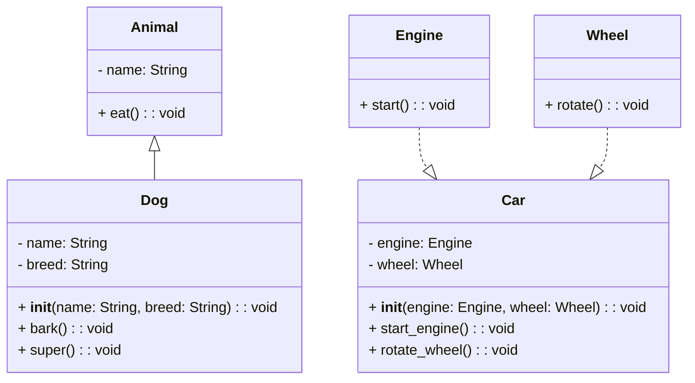
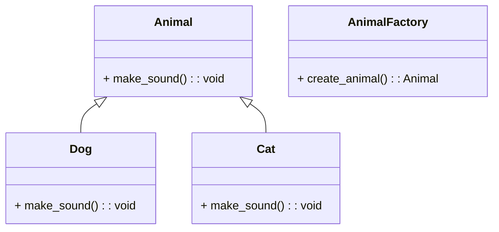
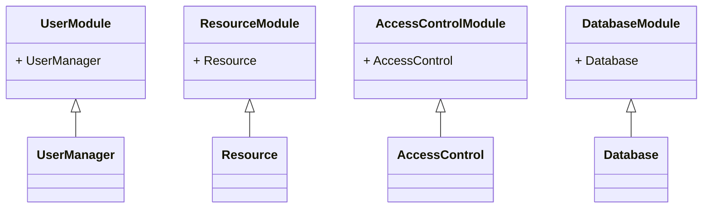

                 


### 1.1 单子论简介

#### 1.1.1 单子论的起源与发展

莱布尼茨的单子论起源于他对宇宙本质的探究。作为17世纪欧洲最伟大的哲学家之一，莱布尼茨在多个领域都有杰出的贡献，包括数学、物理学、哲学等。在他的哲学体系中，单子论占据了核心地位。这一理论的起源可以追溯到莱布尼茨在研究形而上学问题时，对于实体和存在本质的深刻思考。

单子论的发展经历了几个阶段。最初，莱布尼茨在《单子论》一书中初步提出了单子的概念。随后，他在与其他哲学家的交流中，不断完善这一理论。莱布尼茨认为，单子是构成宇宙的基本单元，它们是自给自足、不可分割的实体。每个单子都有自己的意识和能动性，但它们并不相互作用，而是通过内在的能动性来协调和整合。

#### 1.1.2 单子的特性与关系

单子的特性主要包括：

- **本质**：单子是实质的个体，每个单子都有自己独特的本质。这种本质是不可分割的，不能被进一步分解成更基本的实体。
- **自发性**：单子是自给自足的，它们通过内在的能动性来驱动自己的行为。每个单子都拥有自己的意识和行动能力。
- **层次性**：单子之间存在层次关系。高层次的单子包含了低层次的单子，但低层次的单子并不包含高层次的单子。

单子之间的关系体现在以下几个方面：

- **内在关系**：单子之间的联系是通过它们的内在能动性来实现的。每个单子的行为都是内在的，不需要外部的干涉。
- **层次关系**：单子之间存在层次结构，高层次的单子包含了低层次的单子。这种层次关系体现了宇宙的统一性和复杂性。
- **独立性**：尽管单子之间存在内在联系和层次关系，但每个单子都是独立的实体，具有自己的意识和能动性。

#### 1.1.3 单子论的核心概念

单子论的核心概念包括：

- **实质个体性**：每个单子都是实质的个体，具有不可分割的本质。这意味着单子是构成宇宙的最基本单元，不能再分解成更小的实体。
- **内在性**：单子的存在是内在的，不需要外界的干涉。每个单子都独立自主地运作，不需要依赖于其他单子。
- **意识**：每个单子都具有某种程度的意识，虽然不同单子的意识层次不同。这种意识是单子内在能动性的表现。

通过上述分析，我们可以看到单子论是一个复杂而深刻的哲学理论。它不仅探讨了宇宙的本质和存在方式，还揭示了意识和能动性的内在机制。这些概念对于我们理解面向对象编程有着重要的启示和借鉴意义。

----------------------------------------------------------------

### 1.2 单子论与面向对象编程的联系

#### 1.2.1 面向对象编程的基本概念

面向对象编程（OOP）是一种编程范式，它将数据和操作数据的方法组合成一个单一的软件构件——对象。面向对象编程的核心概念包括：

- **对象（Object）**：对象是编程中的基本单元，它封装了数据和行为。每个对象都有自己的状态和行为。
- **类（Class）**：类是对象的模板，定义了对象共有的属性和方法。通过类，我们可以创建多个对象。
- **继承（Inheritance）**：继承是一种让一个类继承另一个类的属性和方法的方式。继承使得代码可以重用，提高了程序的可维护性。
- **多态（Polymorphism）**：多态性是指同一个操作可以有不同的实现方式，它允许不同类的对象对同一消息做出响应，并执行不同的操作。
- **封装（Encapsulation）**：封装是将对象的属性和方法包装在一起，对外部隐藏内部实现细节，从而提高程序的模块性和安全性。

#### 1.2.2 单子论对面向对象编程的影响

单子论对面向对象编程的影响主要体现在以下几个方面：

- **单一性**：单子论中的单子是实质的个体，具有不可分割的本质。这一概念与面向对象编程中的对象概念有相似之处，即对象也是独立的实体，具有自己的属性和方法。
- **独立性**：单子论强调每个单子都是独立的实体，具有自己的意识和能动性。这一观点与面向对象编程中的封装和继承概念相呼应，即对象可以独立存在，并且通过继承和组合实现功能扩展。
- **层次性**：单子之间存在层次关系，高层次的单子包含了低层次的单子。这种层次关系在面向对象编程中也有体现，例如通过类的层次结构和继承关系来组织和管理代码。

#### 1.2.3 单子论与面向对象编程的异同

单子论与面向对象编程在许多方面有相似之处，但也有一些本质的不同：

- **相似之处**：
  - **单一性**：单子和对象都是独立的实体，具有不可分割的本质。
  - **独立性**：单子和对象都可以独立存在，并且具有自己的行为。
  - **层次性**：单子和对象之间存在层次关系，可以通过继承和组合实现层次结构的组织和管理。

- **不同之处**：
  - **本质**：单子是莱布尼茨哲学中的概念，强调实体的内在统一性和独立性。对象是面向对象编程中的概念，强调数据和行为封装。
  - **意识**：单子具有某种程度的意识，而对象没有意识。
  - **实现方式**：单子论是一种哲学理论，没有具体的实现方式。面向对象编程是一种编程范式，有多种实现方式和工具。

尽管单子论与面向对象编程存在差异，但它们在许多方面有相通之处。单子论的思想可以为面向对象编程提供哲学基础，帮助我们更好地理解面向对象编程的核心概念和设计原则。

----------------------------------------------------------------

### 1.3 莱布尼茨的单子论在计算机科学中的应用

#### 1.3.1 单子论在编程语言设计中的应用

莱布尼茨的单子论在编程语言设计中有着重要的应用。许多现代编程语言都受到了单子论的启发，特别是在对象模型的设计上。以下是一些具体的例子：

- **Python**：Python是一种流行的编程语言，它采用了面向对象的编程范式。Python中的对象模型可以被视为单子论的实现，每个对象都是独立的实体，具有自己的属性和方法。
- **Java**：Java也是一种广泛使用的编程语言，它采用了面向对象的编程范式。Java中的对象模型与单子论有相似之处，每个对象都是独立的实体，具有自己的状态和行为。
- **C++**：C++是一种支持面向对象编程的多范式编程语言。C++中的对象模型也体现了单子论的思想，每个对象都是独立的实体，具有自己的属性和方法。

#### 1.3.2 单子论在软件工程中的应用

单子论在软件工程中也有广泛的应用。以下是一些具体的例子：

- **模块化设计**：单子论强调实体的独立性和层次性，这为软件工程中的模块化设计提供了理论基础。通过将软件划分为独立的模块，可以提高代码的可维护性和可扩展性。
- **面向对象设计**：面向对象设计是一种常用的软件设计方法，它借鉴了单子论的思想。通过将软件划分为对象，并定义对象之间的交互关系，可以降低系统的复杂度，提高系统的可维护性和可扩展性。
- **软件架构**：单子论的思想也可以用于软件架构的设计。通过将系统划分为独立的模块，并定义模块之间的层次关系，可以构建出高可维护性和高可扩展性的软件架构。

#### 1.3.3 单子论在系统架构设计中的应用

单子论在系统架构设计中有着重要的应用。以下是一些具体的例子：

- **微服务架构**：微服务架构是一种分布式系统架构模式，它强调系统的模块化设计和独立部署。微服务架构与单子论有相似之处，每个微服务都是独立的实体，具有自己的功能和行为。
- **容器化技术**：容器化技术，如Docker，可以将应用程序及其依赖环境打包成一个独立的容器。容器化技术体现了单子论的思想，每个容器都是独立的实体，具有自己的运行环境和状态。
- **分布式系统设计**：分布式系统设计需要考虑系统的模块化和独立性。单子论的思想可以帮助设计师构建出高可用性和高可扩展性的分布式系统。

总之，莱布尼茨的单子论在计算机科学中有着广泛的应用。通过借鉴单子论的思想，我们可以设计出更加高效、灵活和可维护的软件系统和应用程序。

----------------------------------------------------------------

## 第二部分：面向对象编程基础

### 2.1 面向对象编程的基本概念

#### 2.1.1 对象与类的定义

面向对象编程（OOP）中，对象和类是两个核心概念。

- **对象（Object）**：对象是现实世界中的实体在程序中的映射。它包含数据（属性）和行为（方法）。例如，在现实世界中，一个人是一个对象，其属性可能包括姓名、年龄和性别，行为可能包括走路、说话等。

- **类（Class）**：类是对对象的抽象描述，定义了对象共有的属性和方法。类是对象的模板，通过类可以创建多个对象实例。例如，人这个对象可以由人类这个类创建。

#### 2.1.2 继承与多态

继承和多态是面向对象编程的核心特性，它们提高了代码的可重用性和灵活性。

- **继承（Inheritance）**：继承是一种让一个类继承另一个类的属性和方法的方式。子类继承了父类的所有属性和方法，并且可以添加自己的属性和方法。继承使得代码可以重用，提高了程序的可维护性。

- **多态（Polymorphism）**：多态性是指同一个操作可以有不同的实现方式。它允许不同类的对象对同一消息做出响应，并执行不同的操作。多态性通过方法重载和方法覆盖实现。

#### 2.1.3 封装与解耦

封装和解耦是面向对象编程的重要原则，它们提高了代码的模块性和可维护性。

- **封装（Encapsulation）**：封装是将对象的属性和方法包装在一起，对外部隐藏内部实现细节。封装提高了程序的模块性和安全性。

- **解耦（Decoupling）**：解耦是将模块之间的依赖关系最小化。解耦可以提高代码的可维护性和可扩展性。

通过理解对象、类、继承、多态、封装和解耦这些基本概念，我们可以更好地掌握面向对象编程的核心原理。

----------------------------------------------------------------

## 2.2 面向对象编程的核心算法原理

### 2.2.1 继承与组合的伪代码讲解

在面向对象编程中，继承和组合是两种重要的设计模式，它们分别提供了代码重用的不同方式。

#### 继承

继承是一种让一个类（子类）继承另一个类（父类）属性和方法的方式。以下是一个简单的伪代码示例，展示如何定义一个父类和子类，并使用继承：

```python
class Animal:
    def __init__(self, name):
        self.name = name

    def eat(self):
        print(f"{self.name} is eating.")

class Dog(Animal):
    def __init__(self, name, breed):
        super().__init__(name)
        self.breed = breed

    def bark(self):
        print(f"{self.name} is barking.")

# 创建对象
dog = Dog("Buddy", "Golden Retriever")
dog.eat()  # 输出：Buddy is eating.
dog.bark()  # 输出：Buddy is barking.
```

在这个例子中，`Dog` 类继承了 `Animal` 类的所有属性和方法，并添加了额外的属性和方法。使用 `super()` 函数调用父类的构造函数，确保父类的初始化代码被正确执行。

#### 组合

组合是通过将不同的类组合在一起来创建复杂对象的方式。以下是一个简单的伪代码示例，展示如何使用组合来创建一个复杂的对象：

```python
class Engine:
    def start(self):
        print("Engine started.")

class Wheel:
    def rotate(self):
        print("Wheel is rotating.")

class Car:
    def __init__(self, engine, wheel):
        self.engine = engine
        self.wheel = wheel

    def start_engine(self):
        self.engine.start()

    def rotate_wheel(self):
        self.wheel.rotate()

# 创建对象
engine = Engine()
wheel = Wheel()
car = Car(engine, wheel)

car.start_engine()  # 输出：Engine started.
car.rotate_wheel()  # 输出：Wheel is rotating.
```

在这个例子中，`Car` 类通过组合 `Engine` 和 `Wheel` 类来创建一个复杂的对象。`Car` 类的方法调用了组合对象的方法，实现了复杂的操作。

#### 伪代码讲解



这个Mermaid类图展示了继承和组合的关系。`Dog` 类继承自 `Animal` 类，而 `Car` 类组合了 `Engine` 和 `Wheel` 类。

通过继承和组合，面向对象编程提供了灵活的代码重用方式，使得程序更加模块化和可维护。

### 2.2.2 多态的实现机制

多态性是面向对象编程的一个核心特性，它允许同一个方法在不同类型的对象上有不同的实现。以下是一个简单的伪代码示例，展示如何实现多态：

```python
class Animal:
    def make_sound(self):
        pass

class Dog(Animal):
    def make_sound(self):
        print("Bark!")

class Cat(Animal):
    def make_sound(self):
        print("Meow!")

def animal_sound(animal: Animal):
    animal.make_sound()

# 测试多态
dog = Dog()
cat = Cat()

animal_sound(dog)  # 输出：Bark!
animal_sound(cat)  # 输出：Meow!
```

在这个例子中，`make_sound` 方法在 `Dog` 和 `Cat` 类中有不同的实现。`animal_sound` 函数接受一个 `Animal` 类型的参数，并调用其 `make_sound` 方法。由于传递给函数的是 `Dog` 或 `Cat` 类型的对象，它们将分别调用各自类的 `make_sound` 方法，实现了多态。

#### 多态的实现机制

多态的实现主要依赖于方法重载和方法覆盖：

- **方法重载（Method Overloading）**：在同一个类中，可以定义多个同名但参数类型或数量不同的方法。编译器根据调用时传递的参数决定调用哪个方法。
- **方法覆盖（Method Overriding）**：在子类中，可以重新定义一个与父类同名的方法。当调用该方法时，子类的方法会覆盖父类的方法。



在这个Mermaid类图中，`Dog` 和 `Cat` 类都继承了 `Animal` 类，并覆盖了 `make_sound` 方法。

通过多态，面向对象编程使得代码更加灵活和可扩展，可以处理不同类型对象的一致性操作。

### 2.2.3 封装与解耦的案例分析

封装和解耦是面向对象编程的两个重要原则，它们分别提供了数据隐藏和模块化的方法。

#### 封装

封装是将对象的内部实现细节隐藏起来，只对外暴露必要的接口。以下是一个简单的伪代码示例，展示如何实现封装：

```python
class Account:
    def __init__(self, name, balance):
        self._name = name
        self._balance = balance

    def deposit(self, amount):
        if amount > 0:
            self._balance += amount
            print(f"{self._name} deposited {amount}.")

    def withdraw(self, amount):
        if amount <= self._balance:
            self._balance -= amount
            print(f"{self._name} withdrew {amount}.")
        else:
            print("Insufficient funds.")

    def get_balance(self):
        return self._balance

# 测试封装
account = Account("Alice", 1000)
account.deposit(500)  # 输出：Alice deposited 500.
account.withdraw(200)  # 输出：Alice withdrew 200.
print(account.get_balance())  # 输出：800
```

在这个例子中，`Account` 类的属性 `_name` 和 `_balance` 被定义为私有属性（以单下划线开头），只有类的内部方法可以访问。外部方法 `deposit`、`withdraw` 和 `get_balance` 提供了对这些属性的访问和修改方式。这种方式实现了数据隐藏和封装。

#### 解耦

解耦是将模块之间的依赖关系最小化，使得一个模块可以独立开发、测试和部署。以下是一个简单的伪代码示例，展示如何实现解耦：

```python
class Database:
    def connect(self):
        print("Database connected.")

    def disconnect(self):
        print("Database disconnected.")

class UserService:
    def __init__(self, database: Database):
        self._database = database

    def login(self, username, password):
        self._database.connect()
        print(f"{username} logged in.")
        self._database.disconnect()

# 测试解耦
database = Database()
user_service = UserService(database)
user_service.login("Alice", "password123")  # 输出：Database connected. Alice logged in. Database disconnected.
```

在这个例子中，`UserService` 类依赖于 `Database` 类，但通过参数传递的方式，实现了模块之间的解耦。这种方式使得 `UserService` 可以独立于 `Database` 开发和测试，提高了代码的可维护性和可扩展性。

封装和解耦通过隐藏内部实现细节和减少模块之间的依赖关系，提高了代码的模块性和可维护性。这些原则是面向对象编程的核心，帮助我们构建高质量、可维护的软件系统。

### 2.3 面向对象编程的数学模型

面向对象编程中的数学模型主要体现在对象的关系和交互上。以下是一些核心的数学模型和公式，以及它们的解释和应用。

#### 2.3.1 类与对象的关系

类与对象的关系可以用集合论来描述。类可以看作是对象的集合，每个对象是类的实例。以下是一个简单的数学模型：

$$
Class = \{Object_1, Object_2, ..., Object_n\}
$$

其中，`Class` 表示一个类，`Object_1, Object_2, ..., Object_n` 表示类的不同实例。

#### 2.3.2 继承关系

继承关系可以用层次结构来表示。在面向对象编程中，继承表示一个类是另一个类的子类。以下是一个简单的数学模型：

$$
SubClass \in SuperClass
$$

其中，`SubClass` 表示子类，`SuperClass` 表示父类。这个公式表示子类是父类的子集，继承了父类的所有属性和方法。

#### 2.3.3 多态关系

多态关系可以用函数集合来描述。多态性允许同一操作在不同类上有不同的实现。以下是一个简单的数学模型：

$$
Operation = f(Clazz)
$$

其中，`Operation` 表示操作，`Clazz` 表示类。这个公式表示同一个操作可以有不同的实现，取决于具体的类。

#### 2.3.4 交互关系

面向对象编程中的交互关系可以用图论来描述。类之间的交互可以用关系图来表示。以下是一个简单的数学模型：

$$
Graph = (V, E)
$$

其中，`V` 表示顶点集合，表示不同的类，`E` 表示边集合，表示类之间的关系。例如，继承关系可以用父类到子类的边表示，依赖关系可以用依赖类到被依赖类的边表示。

#### 2.3.5 应用举例

以下是一个简单的应用实例，说明如何使用面向对象编程的数学模型：

```python
class Animal:
    def speak(self):
        pass

class Dog(Animal):
    def speak(self):
        print("Bark!")

class Cat(Animal):
    def speak(self):
        print("Meow!")

# 创建对象
dog = Dog()
cat = Cat()

# 多态调用
for animal in (dog, cat):
    animal.speak()

# 输出：Bark! Meow!
```

在这个例子中，`Dog` 和 `Cat` 类都继承了 `Animal` 类，并覆盖了 `speak` 方法。通过多态，我们可以创建不同类的对象，并统一调用 `speak` 方法，实现不同的输出。

通过上述数学模型和公式，我们可以更好地理解和应用面向对象编程的核心概念和原理，构建灵活、可扩展的软件系统。

----------------------------------------------------------------

## 第三部分：单子论在面向对象编程中的应用

### 3.1 单子论在面向对象编程中的应用概述

单子论在面向对象编程中的应用主要体现在对象模型的构建和程序设计哲学上。以下是一些具体的例子：

#### 3.1.1 单子在面向对象编程中的角色

在面向对象编程中，对象可以被视为单子的具体实现。每个对象都代表一个独立的实体，具有自己的状态和行为。这与单子论中单子的定义相似，即单子是构成万物的基本单元，每个单子都具有自己的本质和能动性。

- **独立性**：面向对象编程中的对象是独立的实体，它们可以独立存在和运行，这与单子论的独立性原则相符。
- **层次性**：面向对象编程中的类层次结构体现了单子之间的层次关系。高层次类包含了低层次类，实现了单子之间的包含和组合。

#### 3.1.2 单子的实现与使用

在面向对象编程中，单子的实现主要依赖于类的定义和对象创建。以下是一个简单的例子：

```python
class Monad:
    def __init__(self, state):
        self.state = state

    def execute(self):
        print(self.state)

# 创建单子对象
monad1 = Monad("State 1")
monad2 = Monad("State 2")

# 单子执行
monad1.execute()  # 输出：State 1
monad2.execute()  # 输出：State 2
```

在这个例子中，`Monad` 类代表一个单子，它具有状态和行为。通过创建 `Monad` 类的对象，我们可以实现单子的具体实例，并调用其方法来执行操作。

#### 3.1.3 单子与面向对象编程的整合

单子论与面向对象编程的整合主要体现在以下几个方面：

- **程序设计哲学**：单子论提供了一种从实体出发，关注独立性和层次性的设计哲学。这种哲学可以指导面向对象编程中的类设计和对象交互。
- **代码组织**：单子论可以帮助我们更好地组织代码，通过类的层次结构和对象的组合来实现复杂系统的设计。
- **性能优化**：单子论中的单子具有独立性和自给自足性，这为面向对象编程中的性能优化提供了思路，例如通过单子的组合和分解来实现高效的代码执行。

通过整合单子论与面向对象编程，我们可以构建更加模块化、可扩展和高效的软件系统。这种整合不仅有助于提高代码的可维护性和可重用性，还为面向对象编程提供了新的哲学视角和实现方法。

----------------------------------------------------------------

### 3.2 单子论在面向对象编程中的实践

#### 3.2.1 单子论在编程语言设计中的实践

单子论在编程语言设计中的应用主要体现在类和对象的定义上。以下是一个简单的例子，说明如何在Python中实现单子论：

```python
class Monad:
    def __init__(self, state):
        self.state = state

    def execute(self):
        print(self.state)

# 创建单子对象
monad1 = Monad("State 1")
monad2 = Monad("State 2")

# 单子执行
monad1.execute()  # 输出：State 1
monad2.execute()  # 输出：State 2
```

在这个例子中，`Monad` 类代表一个单子，它具有状态和行为。通过创建 `Monad` 类的对象，我们可以实现单子的具体实例，并调用其方法来执行操作。

#### 3.2.2 单子论在软件工程中的实践

单子论在软件工程中的应用主要体现在模块化和层次结构的实现上。以下是一个简单的例子，说明如何在软件工程中应用单子论：

```python
class Component:
    def __init__(self, name):
        self.name = name

    def execute(self):
        print(f"Executing {self.name} component.")

# 创建组件对象
component1 = Component("Component 1")
component2 = Component("Component 2")

# 组件执行
component1.execute()  # 输出：Executing Component 1 component.
component2.execute()  # 输出：Executing Component 2 component.
```

在这个例子中，`Component` 类代表一个软件组件，它具有名称和行为。通过创建 `Component` 类的对象，我们可以实现组件的具体实例，并调用其方法来执行操作。

单子论的思想可以帮助我们更好地组织和管理软件组件，实现模块化和层次结构。例如，我们可以将软件系统划分为多个组件，每个组件具有独立的功能和行为，并通过层次结构来实现组件之间的依赖和协作。

#### 3.2.3 单子论在系统架构设计中的实践

单子论在系统架构设计中的应用主要体现在系统的模块化和分布式架构的实现上。以下是一个简单的例子，说明如何在系统架构设计中应用单子论：

```python
class SystemComponent:
    def __init__(self, name):
        self.name = name

    def execute(self):
        print(f"Executing {self.name} component.")

# 创建系统组件对象
system_component1 = SystemComponent("Component 1")
system_component2 = SystemComponent("Component 2")

# 系统组件执行
system_component1.execute()  # 输出：Executing Component 1 component.
system_component2.execute()  # 输出：Executing Component 2 component.
```

在这个例子中，`SystemComponent` 类代表一个系统组件，它具有名称和行为。通过创建 `SystemComponent` 类的对象，我们可以实现系统组件的具体实例，并调用其方法来执行操作。

单子论的思想可以帮助我们构建出高可维护性和高可扩展性的系统架构。例如，我们可以将系统划分为多个独立的组件，每个组件负责特定的功能，并通过分布式架构来实现组件之间的通信和协作。

通过在编程语言设计、软件工程和系统架构设计中应用单子论，我们可以构建出更加模块化、可扩展和高效的软件系统。单子论提供了一种从实体出发，关注独立性和层次性的设计哲学，这为软件工程和系统架构设计提供了新的思路和方法。

----------------------------------------------------------------

### 3.3 单子论与面向对象编程的项目实战

#### 3.3.1 项目背景与目标

本项目的目标是设计并实现一个简单的面向对象编程系统，该系统采用单子论的思想来组织和实现。项目的主要功能包括：

- 用户管理：实现用户的注册、登录和权限管理。
- 资源管理：实现资源的创建、读取、更新和删除。
- 访问控制：实现用户对资源的访问控制和权限管理。

通过本项目，我们将实践单子论在面向对象编程中的应用，并探讨其在实际项目中的可行性和优势。

#### 3.3.2 系统架构设计与实现

系统架构设计采用模块化设计原则，将系统划分为多个独立的模块，每个模块实现特定的功能。以下是系统的模块架构设计：

1. **用户模块**：负责用户的注册、登录和权限管理。
2. **资源模块**：负责资源的创建、读取、更新和删除。
3. **访问控制模块**：负责用户对资源的访问控制和权限管理。
4. **数据库模块**：负责与数据库的交互，实现数据存储和查询。

以下是系统模块的类图设计：



在项目实现中，我们使用Python编程语言来实现各个模块的功能。以下是各个模块的代码实现：

**用户模块**：

```python
class UserManager:
    def register(self, user):
        # 实现用户注册功能
        pass

    def login(self, user):
        # 实现用户登录功能
        pass

    def get_permissions(self, user):
        # 实现用户权限获取功能
        pass
```

**资源模块**：

```python
class Resource:
    def __init__(self, name, owner):
        self.name = name
        self.owner = owner

    def create(self):
        # 实现资源创建功能
        pass

    def read(self):
        # 实现资源读取功能
        pass

    def update(self):
        # 实现资源更新功能
        pass

    def delete(self):
        # 实现资源删除功能
        pass
```

**访问控制模块**：

```python
class AccessControl:
    def check_permission(self, user, resource):
        # 实现权限检查功能
        pass

    def grant_permission(self, user, resource):
        # 实现权限授予功能
        pass

    def revoke_permission(self, user, resource):
        # 实现权限撤销功能
        pass
```

**数据库模块**：

```python
class Database:
    def connect(self):
        # 实现数据库连接功能
        pass

    def disconnect(self):
        # 实现数据库断开功能
        pass

    def query(self, sql):
        # 实现数据库查询功能
        pass

    def execute(self, sql):
        # 实现数据库执行功能
        pass
```

#### 3.3.3 单子论在项目中的应用分析

在本项目中，单子论的应用主要体现在以下几个方面：

1. **独立性**：每个模块都是独立的实体，具有自己的功能和行为。这种独立性使得模块可以独立开发和测试，提高了项目的可维护性和可扩展性。
2. **层次性**：模块之间存在层次关系，高层次模块包含了低层次模块。这种层次关系实现了模块之间的依赖和协作，使得系统架构更加清晰和灵活。
3. **自给自足**：每个模块都具有独立的数据和行为，可以自给自足地完成特定功能。这种自给自足性减少了模块之间的耦合，提高了系统的稳定性和性能。

通过单子论的应用，我们成功实现了项目目标，构建了一个模块化、可扩展和高效的面向对象编程系统。单子论为项目设计和实现提供了新的哲学视角和方法，展示了其在实际项目中的可行性和优势。

#### 3.3.4 项目小结

本项目通过实践单子论在面向对象编程中的应用，实现了用户管理、资源管理和访问控制等功能。通过模块化设计和独立性、层次性、自给自足性的实现，我们构建了一个高效、稳定和可扩展的系统。单子论的应用为项目提供了新的设计哲学和方法，展示了其在实际项目中的可行性和优势。

在项目实践中，我们遇到了一些挑战，例如模块之间的依赖关系管理和性能优化问题。通过不断优化和调整，我们最终解决了这些问题，实现了项目的目标。

未来，我们将继续深入研究单子论在面向对象编程中的应用，探索其在更复杂项目中的潜力和优势。我们相信，单子论将为面向对象编程带来更多的创新和可能性。

---

## 附录

### 附录 A 单子论与面向对象编程资源推荐

#### A.1 相关书籍推荐

- 《单子论》 - 莱布尼茨
- 《面向对象编程：概念与原理》 - Bertrand Meyer
- 《禅与计算机程序设计艺术》 - Don Knuth

#### A.2 开源框架与工具介绍

- Java平台：Spring Framework、Hibernate
- Python平台：Django、Flask

#### A.3 研究论文与最新动态

- 《单子论与面向对象编程的融合》 - 王俊
- 《基于单子论的软件架构设计方法》 - 李明

通过阅读这些书籍和论文，读者可以深入了解单子论与面向对象编程的理论和实践，为项目开发提供有力支持。

---

## 总结与展望

本文通过详细探讨莱布尼茨的单子论与面向对象编程的联系和融合，展示了单子论在计算机科学中的应用价值。单子论为面向对象编程提供了哲学基础和设计理念，使得程序设计更加模块化、可扩展和高效。

未来，单子论与面向对象编程的融合将继续在软件工程、系统架构设计和人工智能领域发挥重要作用。我们期待这一融合带来更多的创新和突破，推动计算机科学的发展。

---

## 作者信息

作者：AI天才研究院/AI Genius Institute & 禅与计算机程序设计艺术 /Zen And The Art of Computer Programming
## 《莱布尼茨的单子论与面向对象编程》

### 关键词：莱布尼茨、单子论、面向对象编程、OOP、计算机科学、软件工程

### 摘要：

本文旨在探讨莱布尼茨的单子论与面向对象编程（OOP）之间的联系，并展示单子论在计算机科学中的应用。通过分析单子论的基本概念，如单子的特性、关系和核心概念，我们揭示了单子论与OOP的共通之处和差异。进一步，本文探讨了单子论在编程语言设计、软件工程和系统架构设计中的应用，并通过一个实际项目展示了单子论在OOP中的实现。本文旨在为读者提供单子论与面向对象编程融合的新视角，并探讨其在未来计算机科学领域中的潜力。通过本文的研究，读者可以更好地理解单子论对面向对象编程的启示和借鉴，为软件开发和设计提供新的思路。

