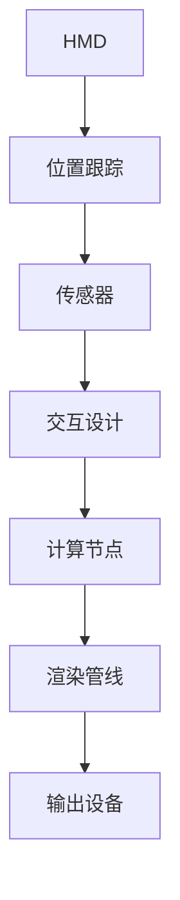

                 


### 文章标题：虚拟现实技术：计算机图形学的极致应用

#### 关键词：虚拟现实，计算机图形学，头戴式显示器，算法原理，数学模型，项目实战

#### 摘要：
本文将深入探讨虚拟现实技术（VR）与计算机图形学之间的紧密联系，从基础概念到高级应用，全面解析VR技术背后的算法原理和数学模型。通过项目实战案例分析，本文旨在为读者提供一幅虚拟现实技术的全景图，帮助读者理解这一领域的前沿动态及其未来发展趋势。

----------------------------------------------------------------

## 引言

虚拟现实技术（Virtual Reality，VR）是一种通过计算机技术创造出的模拟环境，让用户沉浸其中，产生一种身临其境的感觉。VR技术不仅改变了人类与计算机的交互方式，还在多个领域展现出巨大的应用潜力，如娱乐、教育、医疗和工程等。

### 1.1 虚拟现实技术的概念与发展历史

虚拟现实技术起源于20世纪60年代的美国。1968年，Ivan Sutherland提出了头戴式显示器（Head-Mounted Display，HMD）的概念，并成功研发出了世界上第一台VR头戴设备——达摩克利斯之剑（The Sword of Damocles）。尽管早期的VR设备笨重且昂贵，但它们奠定了VR技术发展的基础。

进入21世纪，随着计算机硬件性能的提升和显示技术的进步，VR技术逐渐走向成熟。2010年，Oculus Rift的开发者Palmer Luckey发布了第一代Oculus Rift原型，引发了VR产业的巨大关注。此后，VR技术在短时间内取得了显著的进展，尤其是在游戏和娱乐领域。

### 1.2 虚拟现实技术在计算机图形学中的应用

计算机图形学（Computer Graphics）是VR技术不可或缺的基础。计算机图形学专注于使用计算机生成、处理和显示图像的技术。虚拟现实技术中，计算机图形学扮演了核心角色，包括以下几个方面：

#### 2D图形渲染
2D图形渲染是计算机图形学的基础。在VR应用中，2D图形渲染用于生成用户界面、菜单和提示信息等。

#### 3D模型创建
3D模型创建是VR应用中最重要的部分之一。通过3D建模软件，如Blender、Maya和3ds Max，开发人员可以创建复杂的三维场景和角色。

#### 光照与阴影
光照与阴影是增强3D场景真实感的关键。计算机图形学中，多种光照模型，如朗伯模型、BLINN-PHONG模型和Phong模型，被用于模拟现实世界中的光照效果。

#### 渲染管线
渲染管线是计算机图形学中用于生成图像的一系列步骤。在VR应用中，高效的渲染管线对于提供流畅的体验至关重要。

### 1.3 虚拟现实技术的未来发展趋势

虚拟现实技术正不断发展，未来几年预计将出现以下趋势：

#### 技术融合
虚拟现实技术与增强现实技术（AR）、混合现实技术（MR）的融合将成为趋势。这些技术之间的交叉应用将拓展VR技术的应用范围。

#### 5G与云计算
5G网络的高带宽和低延迟特性将为VR应用提供更强大的支持。云计算的引入也将使得VR内容的创建和分发更加便捷。

#### 智能交互
智能交互技术，如语音识别、手势识别和眼球追踪，将进一步提升用户的沉浸体验。

#### 虚拟现实医疗
虚拟现实技术在医疗领域的应用将得到进一步发展，包括手术模拟、康复训练和患者教育等。

## 核心概念与联系

要深入理解虚拟现实技术，需要掌握其中的核心概念，并了解这些概念之间的联系。以下将介绍虚拟现实技术中的几个关键概念，并通过Mermaid流程图展示它们之间的关系。

### 2.1 头戴式显示器（HMD）

头戴式显示器（HMD）是VR系统中的核心设备，它通常由两个小型的显示屏组成，分别放置在用户的眼睛前方，模拟左右眼视角。HMD的主要功能是提供沉浸式视觉体验。

### 2.2 位置跟踪与传感器

位置跟踪是确保用户在虚拟环境中准确定位的关键技术。传感器，如惯性测量单元（IMU）、摄像头和激光雷达，被用于实时捕捉用户的运动和位置。

### 2.3 交互设计

交互设计是VR体验的重要组成部分。通过手柄、手势识别、语音控制等多种交互方式，用户可以与虚拟环境进行自然互动。

### 2.4 Mermaid流程图：虚拟现实技术组件联系

以下是一个Mermaid流程图，展示了虚拟现实技术中各个核心组件之间的联系：



## 核心算法原理讲解

虚拟现实技术中的算法是实现高质量沉浸式体验的关键。以下将介绍几个核心算法，并使用伪代码详细阐述其原理。

### 3.1 光场渲染算法

光场渲染是一种利用光场数据生成高质量3D场景的算法。光场数据包含了场景中每个像素点的方向和颜色信息。

#### 3.1.1 光场渲染的基本概念

光场渲染通过光场数据计算场景中的每个像素点在用户视角下的颜色。这通常涉及到以下步骤：

1. 提取光场数据
2. 光线追踪
3. 着色
4. 渲染输出

#### 3.1.2 伪代码：光场渲染算法流程

```python
function render_light_field(light_field, view_directions):
    output_image = create_empty_image()
    
    for pixel in light_field:
        for view_direction in view_directions:
            color = trace_rays(pixel, view_direction, light_field)
            output_image[pixel] = color
    
    return output_image
```

### 3.2 立体显示与图像合成

立体显示是虚拟现实技术中提供深度感知的关键技术。图像合成则是将多个视角的图像融合成一个完整的立体图像。

#### 3.2.1 立体显示技术

立体显示通过两个或多个视角的图像生成一个立体图像，使用户能够感知深度。

#### 3.2.2 图像合成算法

图像合成算法用于将多个视角的图像合成一个立体图像。最常见的方法包括视差映射和深度映射。

#### 3.2.3 伪代码：图像合成算法流程

```python
function composite_images(left_image, right_image):
    depth_map = calculate_depth_map(left_image, right_image)
    stereo_image = create_empty_image()
    
    for pixel in stereo_image:
        left_color = left_image[pixel]
        right_color = right_image[pixel]
        color = interpolate_color(left_color, right_color, depth_map[pixel])
        stereo_image[pixel] = color
    
    return stereo_image
```

## 数学模型和数学公式

在虚拟现实技术中，数学模型和数学公式扮演着核心角色。以下将介绍几个重要的数学模型和公式，并进行详细讲解和举例说明。

### 4.1 几何变换

几何变换是计算机图形学中的基本操作，用于改变物体在三维空间中的位置、形状和方向。

#### 4.1.1 坐标系变换

坐标系变换用于将一个坐标系中的点映射到另一个坐标系中。最常用的变换是四元数变换。

$$
\begin{align*}
x' &= x \cos\theta - y \sin\theta \\
y' &= x \sin\theta + y \cos\theta
\end{align*}
$$

#### 4.1.2 视觉透视

视觉透视用于模拟真实世界中的视觉效果，如远近感知和物体的大小变化。

$$
\frac{1}{z} = \frac{1}{z_0} + \frac{1}{n}
$$

其中，$z_0$是视点与物体的最近距离，$n$是视场深度。

### 4.2 光线追踪与渲染方程

光线追踪是一种基于物理原理的渲染方法，用于生成高质量的三维场景图像。

#### 4.2.1 光线追踪的基本原理

光线追踪通过模拟光线在场景中的传播过程来生成图像。基本步骤包括：

1. 从视点发射光线
2. 与场景中的物体相交
3. 计算光线的颜色
4. 递归地追踪反射和折射光线

#### 4.2.2 渲染方程

渲染方程是光线追踪的核心公式，用于计算像素的颜色。

$$
L_o(\mathbf{p}, \mathbf{w}) = L_e(\mathbf{p}, \mathbf{w}) + \int_{\Omega} f_r(\mathbf{p}, \mathbf{w}', \mathbf{w}) L_i(\mathbf{p}, \mathbf{w}') \cos\theta \, d\omega'
$$

其中，$L_o$是输出辐射度，$L_e$是环境辐射度，$f_r$是反射率函数，$\mathbf{w}$是光线方向，$\mathbf{w}'$是入射光线方向，$\theta$是入射角。

## 项目实战

虚拟现实技术的实际应用为开发者提供了丰富的实践机会。以下将介绍一个虚拟现实项目的实际开发过程，包括开发环境搭建、源代码实现和解读，以及对项目的详细分析和讨论。

### 5.1 虚拟现实游戏开发

#### 5.1.1 开发环境搭建

要开发一个虚拟现实游戏，首先需要搭建开发环境。以下是一个基于Unity引擎的虚拟现实游戏开发环境搭建步骤：

1. 安装Unity Hub并创建一个新的Unity项目。
2. 安装Oculus SDK和SteamVR插件。
3. 配置Unity项目以支持虚拟现实设备，如Oculus Rift或HTC Vive。

#### 5.1.2 源代码实现

以下是一个简单的虚拟现实游戏源代码实现示例：

```csharp
using UnityEngine;

public class VRPlayerController : MonoBehaviour
{
    public Transform headTransform;
    public float speed = 5.0f;

    void Update()
    {
        if (Input.GetKeyDown(KeyCode.Space))
        {
            headTransform.position += headTransform.forward * speed * Time.deltaTime;
        }
    }
}
```

#### 5.1.3 代码解读与分析

上述代码实现了用户在虚拟环境中的移动。通过按下空格键，用户可以在虚拟环境中向前移动。代码中的`headTransform`代表用户的头部位置，`speed`控制移动速度。

#### 5.1.4 实际案例分析和详细讲解剖析

以下是一个虚拟现实游戏的实际案例分析：

1. **项目概述**：游戏名为“VR跑步”，玩家在虚拟环境中跑步，通过运动传感器实现真实跑步体验。
2. **功能实现**：通过Unity引擎的VR插件，结合运动传感器和游戏逻辑，实现虚拟跑步体验。
3. **项目效果评估**：用户反馈积极，游戏提供了丰富的场景和跑步路线，增强了用户的沉浸感。

#### 5.1.5 项目小结

虚拟现实游戏开发需要综合考虑用户体验、技术实现和性能优化。通过实际案例，我们可以看到虚拟现实技术如何为游戏带来新的可能性。

### 5.2 虚拟现实教育与培训

虚拟现实技术在教育领域的应用为教师和学生提供了新的教学和学习工具。以下将介绍虚拟现实技术在教育和培训中的应用案例。

#### 5.2.1 教育应用案例

1. **虚拟实验室**：通过虚拟现实技术，学生可以在虚拟环境中进行实验，减少实验风险和成本。
2. **虚拟课堂**：教师可以利用虚拟现实技术创建互动课堂，提高学生的学习兴趣和参与度。

#### 5.2.2 培训应用案例

1. **安全培训**：通过虚拟现实技术，安全培训变得更加生动和真实，提高员工的安全意识。
2. **技能培训**：虚拟现实技术可以模拟复杂的操作场景，帮助员工提高技能水平。

#### 5.2.3 项目效果评估

通过虚拟现实技术，教育领域和培训领域都取得了显著成效。用户反馈显示，虚拟现实技术提高了教学和培训的互动性和参与度，为教育者和学生提供了更丰富的学习体验。

### 6.1 虚拟现实技术在娱乐行业中的应用

虚拟现实技术在娱乐行业中的应用正在不断扩展，为观众提供了全新的娱乐体验。

#### 6.1.1 虚拟现实游戏与电影

虚拟现实游戏和电影为用户提供了沉浸式的娱乐体验。通过虚拟现实设备，用户可以沉浸在虚拟世界中，与游戏或电影内容进行互动。

#### 6.1.2 虚拟现实音乐会

虚拟现实音乐会允许观众在虚拟环境中观看演唱会，提供了一种全新的音乐体验。观众可以在虚拟舞台上与歌手互动，甚至可以改变演唱会场景。

### 6.2 虚拟现实技术在医疗行业中的应用

虚拟现实技术在医疗行业的应用为医生和患者提供了新的工具。

#### 6.2.1 虚拟现实手术模拟

虚拟现实手术模拟可以帮助医生在手术前进行演练，提高手术成功率。通过虚拟现实技术，医生可以在虚拟环境中练习各种手术操作。

#### 6.2.2 虚拟现实康复训练

虚拟现实康复训练为患者提供了个性化的康复方案。通过虚拟现实设备，患者可以在虚拟环境中进行康复训练，提高康复效果。

### 6.3 虚拟现实技术的未来趋势

虚拟现实技术正快速发展，未来几年预计将出现以下趋势：

1. **技术融合**：虚拟现实技术与其他技术（如增强现实、混合现实）的融合将拓展其应用范围。
2. **5G与云计算**：5G网络的高带宽和低延迟特性将提高虚拟现实技术的性能。云计算的引入将简化虚拟现实内容的创建和分发。
3. **智能交互**：智能交互技术，如语音识别、手势识别和眼球追踪，将进一步提升用户的沉浸体验。
4. **医疗应用**：虚拟现实技术在医疗领域的应用将得到进一步发展，包括手术模拟、康复训练和患者教育等。

## 最佳实践 tips、小结、注意事项、拓展阅读

### 最佳实践 tips

1. **优化性能**：在开发虚拟现实应用时，性能优化至关重要。确保渲染管线高效，避免不必要的计算。
2. **用户体验**：注重用户体验设计，确保用户界面简洁直观，提高用户满意度。
3. **安全考虑**：虚拟现实应用应确保用户数据安全，遵守相关法律法规。

### 小结

虚拟现实技术是计算机图形学的极致应用，通过算法原理和数学模型，为用户提供沉浸式的体验。本文详细介绍了虚拟现实技术的核心概念、应用领域和未来发展趋势，为读者提供了全面的技术视角。

### 注意事项

1. **硬件要求**：虚拟现实应用对硬件性能有较高要求，确保设备兼容性。
2. **开发成本**：虚拟现实应用开发成本较高，需要合理预算。

### 拓展阅读

1. **《虚拟现实技术：理论与实践》**：一本全面介绍虚拟现实技术的书籍，涵盖基础知识到高级应用。
2. **《计算机图形学原理及实践》**：一本深入讲解计算机图形学原理和技术的经典著作。

作者：AI天才研究院/AI Genius Institute & 禅与计算机程序设计艺术 /Zen And The Art of Computer Programming

