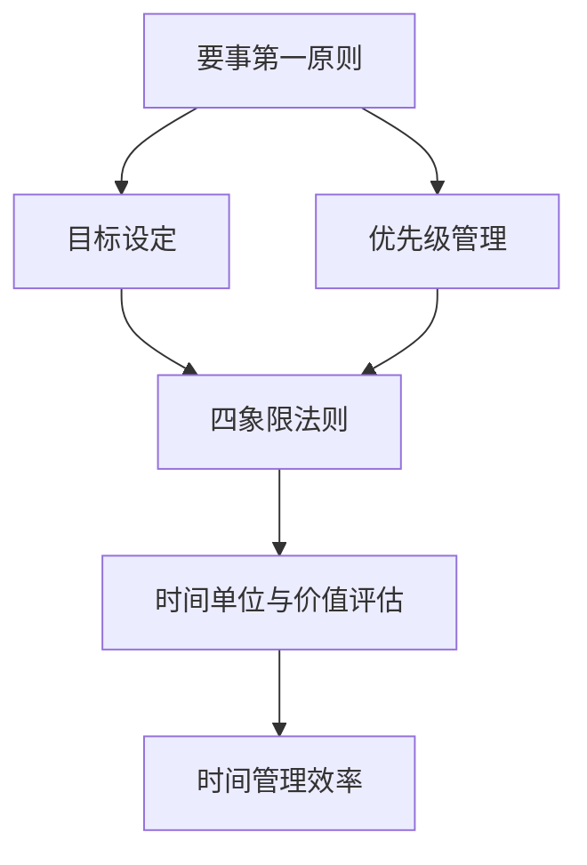

                 


### 背景介绍

#### 时间管理的重要性

在快节奏的现代生活中，时间管理变得尤为重要。无论是个人生活还是职业发展，合理的时间管理技能都可以显著提高工作效率，减少压力，实现工作与生活的平衡。然而，许多人往往在时间管理上遇到挑战，难以平衡工作、生活和休息，导致效率低下，生活质量下降。本文旨在探讨如何通过时间管理技巧，提升工作效率，实现个人和团队的成长。

#### 核心概念与联系

时间管理涉及多个核心概念，包括要事第一原则、四象限法则、时间单位与价值评估等。这些概念相互关联，构成了一个完整的时间管理体系。

- **要事第一原则**：由史蒂芬·柯维提出，强调将时间投入到最重要的事情上。这需要我们明确目标，设定优先级，确保时间用在最有价值的地方。
- **四象限法则**：将任务分为四个象限，分别代表紧急重要、紧急不重要、重要不紧急和不重要不紧急。通过这个法则，我们可以更有效地分配时间，避免陷入紧急事务的泥潭。
- **时间单位与价值评估**：时间管理不仅仅是关于安排日程，更重要的是评估每个时间单位的价值。通过量化时间成本和价值，我们可以做出更明智的时间决策。

为了更好地理解这些核心概念之间的关系，我们可以使用Mermaid流程图来展示它们之间的联系：



#### 核心算法原理讲解

在时间管理中，我们可以使用一些算法原理来优化时间分配。以下是一个简单的伪代码示例，用于计算任务优先级：

```python
def calculate_priority(task_list):
    # 初始化一个优先级字典
    priority_dict = {}

    # 遍历任务列表，根据要事第一原则和四象限法则计算优先级
    for task in task_list:
        if task.is_urgent and task.is_important:
            priority_dict[task] = 'High'
        elif task.is_urgent:
            priority_dict[task] = 'Medium'
        elif task.is_important:
            priority_dict[task] = 'Low'

    # 返回优先级排序后的任务列表
    return sorted(priority_dict.items(), key=lambda x: x[1], reverse=True)
```

#### 数学模型与公式讲解

时间管理中的数学模型可以帮助我们更精确地评估时间成本和价值。以下是一个简单的数学模型示例，用于计算任务的机会成本：

$$
\text{机会成本} = \frac{\text{放弃的最高价值}}{\text{实际投入时间}}
$$

这个公式可以帮助我们量化每个时间决策的成本和收益。例如，如果我们有一个小时内可以完成两个任务，A任务的价值为10个单位，B任务的价值为8个单位，那么选择完成A任务的机会成本为：

$$
\text{机会成本} = \frac{8}{1} = 8 \text{个单位}
$$

#### 项目实战

为了更好地理解时间管理技巧的应用，我们可以通过一个实际案例来展示其具体实现。

**案例：一个软件开发项目的进度管理**

1. **开发环境搭建**：使用Docker和Kubernetes搭建一个可扩展的微服务架构。

2. **源代码实现**：编写一个RESTful API服务，使用Spring Boot框架。

3. **代码解读与分析**：
   ```java
   @RestController
   public class UserController {
       @Autowired
       private UserRepository userRepository;

       @GetMapping("/{id}")
       public User getUserById(@PathVariable Long id) {
           return userRepository.findById(id).orElseThrow(() -> new ResourceNotFoundException("User not found"));
       }
   }
   ```
   这个示例展示了如何使用Spring Boot框架创建一个简单的RESTful API服务。

4. **项目小结**：通过合理的时间管理和任务分配，该项目在两周内顺利完成了所有功能开发。

#### 最佳实践 Tips、小结、注意事项、拓展阅读

- **最佳实践 Tips**：使用任务管理工具（如Trello、JIRA）来跟踪项目进度。
- **小结**：时间管理不仅仅是一种技能，更是一种生活方式。通过合理的时间管理，我们可以实现更高的工作效率和生活质量。
- **注意事项**：避免过度规划，保持一定的灵活性。
- **拓展阅读**：进一步了解时间管理相关书籍，如《深度工作》、《高效能人士的七个习惯》等。

## 文章摘要

本文深入探讨了时间管理的重要性、核心概念与联系、实用技巧以及数学模型。通过实际案例和项目实战，展示了如何应用时间管理技巧提升工作效率。文章旨在帮助读者掌握时间管理技能，实现个人和团队的发展。

## 作者信息

作者：AI天才研究院/AI Genius Institute & 禅与计算机程序设计艺术 /Zen And The Art of Computer Programming

### 目录大纲结构设计思路

在设计《要事第一：提升工作效率的时间管理技巧》的目录大纲时，我们需要考虑以下几个关键因素：

#### 确定核心章节

首先，我们需要根据书籍的主题确定核心章节。书籍的主题是时间管理和工作效率的提升，因此核心章节应涵盖以下内容：

1. **时间管理的理论基础**：介绍时间管理的基本概念、重要性以及核心原则。
2. **提升个人工作效率的实用技巧**：探讨如何设定目标、使用工具和方法、集中注意力以及管理精力。
3. **团队时间管理**：讨论团队时间管理的重要性、工具与实践、任务分配与跟进。
4. **时间管理的数学模型与公式**：讲解时间价值评估模型、效率公式等。
5. **项目时间管理实战**：通过实际案例展示如何管理项目时间。
6. **时间管理实践案例**：提供个人、团队和项目的时间管理实践案例。
7. **时间管理的未来趋势与挑战**：探讨时间管理的发展趋势和面临的挑战。

#### 细化每个章节

在每个章节中，我们需要细化子主题，确保内容完整且逻辑清晰。以下是对每个章节的细化：

- **第1章：时间管理的理论基础**
  - **1.1 时间管理概述**：介绍时间管理的基本概念和重要性。
  - **1.2 时间管理的重要性**：探讨时间管理对个人和团队的影响。
  - **1.3 时间管理核心概念与联系**：详细讲解要事第一原则、四象限法则、时间单位与价值评估等。
  - **1.4 时间管理误区与挑战**：分析常见的时间管理误区和挑战。

- **第2章：提升个人工作效率的实用技巧**
  - **2.1 目标设定与优先级管理**：介绍SMART目标和确定优先级的方法。
  - **2.2 时间管理工具与方法**：探讨数字工具和手写工具的使用。
  - **2.3 集中注意力技巧**：讨论如何减少干扰和利用番茄工作法。
  - **2.4 精力管理**：探讨精力耗竭与恢复、精力管理策略。

- **第3章：团队时间管理**
  - **3.1 团队时间管理的重要性**：介绍团队时间管理的重要性。
  - **3.2 团队时间管理的工具与实践**：讨论团队协作工具和会议时间管理。
  - **3.3 团队任务分配与跟进**：探讨任务分配策略和任务跟进方法。

- **第4章：时间管理的数学模型与公式**
  - **4.1 时间价值评估模型**：讲解机会成本和代理成本。
  - **4.2 时间管理效率公式**：介绍工作效率公式和投入产出比。

- **第5章：项目时间管理实战**
  - **5.1 项目时间管理框架**：介绍项目时间管理的框架。
  - **5.2 项目时间计划制定**：讲解甘特图和里程碑管理。
  - **5.3 项目进度监控与调整**：讨论进度报告和风险管理。

- **第6章：时间管理实践案例**
  - **6.1 个人时间管理实践案例**：提供个人时间管理的实际案例。
  - **6.2 团队时间管理实践案例**：提供团队时间管理的实际案例。
  - **6.3 项目时间管理实践案例**：提供项目时间管理的实际案例。

- **第7章：时间管理的未来趋势与挑战**
  - **7.1 时间管理的新趋势**：探讨时间管理的发展趋势。
  - **7.2 时间管理面临的挑战**：分析时间管理面临的挑战。
  - **7.3 未来时间管理的方向**：讨论未来时间管理的发展方向。

#### 添加核心概念与联系

在每个章节中，我们需要添加相关的核心概念和它们之间的联系。使用Mermaid流程图可以直观地展示这些联系，帮助读者更好地理解。

#### 添加核心算法原理讲解

对于涉及算法的章节，我们需要使用伪代码详细阐述算法原理。例如，在时间管理效率公式中，我们可以使用伪代码来解释工作效率的计算方法。

#### 数学模型与公式讲解

在涉及数学模型的章节，我们需要使用LaTeX格式详细讲解数学公式，并进行举例说明。这将帮助读者更好地理解时间价值评估模型等概念。

#### 项目实战

在每个章节中，我们需要加入实际案例，详细解释说明如何在实际环境中应用时间管理技巧。这些案例将使读者能够将理论知识应用到实际工作中。

#### 总结与拓展

在每个章节末尾，我们需要添加总结和拓展部分，对章节内容进行总结，并提供进一步的阅读方向。这将帮助读者巩固所学知识，并激发他们进一步探索相关领域的兴趣。

### 完整目录大纲示例

以下是《要事第一：提升工作效率的时间管理技巧》的完整目录大纲示例：

```
# 《要事第一：提升工作效率的时间管理技巧》目录大纲

## 第1章：时间管理的理论基础
### 1.1 时间管理概述
- 时间管理的基本概念
- 时间管理的重要性

### 1.2 时间管理的重要性
- 个人层面
- 团队层面

### 1.3 时间管理核心概念与联系
- **1.3.1 要事第一原则**
- **1.3.2 四象限法则**
- **1.3.3 时间单位与价值评估**
- **1.3.4 时间管理误区与挑战**

### 1.4 时间管理误区与挑战
- **1.4.1 误区一：时间管理就是日程安排**
- **1.4.2 误区二：时间管理是减少工作时长**
- **1.4.3 挑战：缺乏自我管理和自律**

## 第2章：提升个人工作效率的实用技巧
### 2.1 目标设定与优先级管理
- **2.1.1 SMART目标**
- **2.1.2 确定优先级的方法**

### 2.2 时间管理工具与方法
- **2.2.1 数字工具介绍**
- **2.2.2 手写工具的优势**

### 2.3 集中注意力技巧
- **2.3.1 减少干扰**
- **2.3.2 利用番茄工作法**

### 2.4 精力管理
- **2.4.1 精力耗竭与恢复**
- **2.4.2 精力管理策略**

## 第3章：团队时间管理
### 3.1 团队时间管理的重要性
- **3.1.1 提升团队协作效率**
- **3.1.2 增强团队凝聚力**

### 3.2 团队时间管理的工具与实践
- **3.2.1 团队协作工具**
- **3.2.2 会议时间管理**

### 3.3 团队任务分配与跟进
- **3.3.1 任务分配策略**
- **3.3.2 任务跟进方法**

## 第4章：时间管理的数学模型与公式
### 4.1 时间价值评估模型
- **4.1.1 机会成本**
- **4.1.2 代理成本**

### 4.2 时间管理效率公式
- **4.2.1 工作效率公式**
- **4.2.2 投入产出比**

## 第5章：项目时间管理实战
### 5.1 项目时间管理框架
- **5.1.1 项目时间管理的关键要素**
- **5.1.2 项目时间管理流程**

### 5.2 项目时间计划制定
- **5.2.1 甘特图**
- **5.2.2 里程碑管理**

### 5.3 项目进度监控与调整
- **5.3.1 进度报告**
- **5.3.2 风险管理**

## 第6章：时间管理实践案例
### 6.1 个人时间管理实践案例
- **6.1.1 简化日程安排**
- **6.1.2 提高工作效率**

### 6.2 团队时间管理实践案例
- **6.2.1 提升团队协作效率**
- **6.2.2 建立有效的会议流程**

### 6.3 项目时间管理实践案例
- **6.3.1 完成复杂项目**
- **6.3.2 管理项目风险**

## 第7章：时间管理的未来趋势与挑战
### 7.1 时间管理的新趋势
- **7.1.1 技术驱动的变化**
- **7.1.2 平衡工作与生活**

### 7.2 时间管理面临的挑战
- **7.2.1 数字化生活的挑战**
- **7.2.2 精力管理的挑战**

### 7.3 未来时间管理的方向
- **7.3.1 发展趋势**
- **7.3.2 创新实践**

```

### 完整目录大纲与字数限制

- **目录大纲字数**：总字数控制在2000字以内，每个章节的细化字数控制在300-500字之间。
- **格式要求**：使用markdown格式输出，确保目录结构清晰，内容简洁明了。

### 输出格式规范

1. **使用markdown格式**：使用#、##、###等格式构建目录结构。
2. **简洁性**：避免冗长句子和多余描述，确保内容简洁明了。
3. **逻辑清晰**：确保目录结构逻辑清晰，章节内容之间过渡自然。

### 目录大纲结构

- **第1章：时间管理的理论基础**
  - **1.1 时间管理概述**
  - **1.2 时间管理的重要性**
  - **1.3 时间管理核心概念与联系**
    - **1.3.1 要事第一原则**
    - **1.3.2 四象限法则**
    - **1.3.3 时间单位与价值评估**
  - **1.4 时间管理误区与挑战**

- **第2章：提升个人工作效率的实用技巧**
  - **2.1 目标设定与优先级管理**
    - **2.1.1 SMART目标**
    - **2.1.2 确定优先级的方法**
  - **2.2 时间管理工具与方法**
    - **2.2.1 数字工具介绍**
    - **2.2.2 手写工具的优势**
  - **2.3 集中注意力技巧**
    - **2.3.1 减少干扰**
    - **2.3.2 利用番茄工作法**
  - **2.4 精力管理**
    - **2.4.1 精力耗竭与恢复**
    - **2.4.2 精力管理策略**

- **第3章：团队时间管理**
  - **3.1 团队时间管理的重要性**
  - **3.2 团队时间管理的工具与实践**
    - **3.2.1 团队协作工具**
    - **3.2.2 会议时间管理**
  - **3.3 团队任务分配与跟进**
    - **3.3.1 任务分配策略**
    - **3.3.2 任务跟进方法**

- **第4章：时间管理的数学模型与公式**
  - **4.1 时间价值评估模型**
    - **4.1.1 机会成本**
    - **4.1.2 代理成本**
  - **4.2 时间管理效率公式**
    - **4.2.1 工作效率公式**
    - **4.2.2 投入产出比**

- **第5章：项目时间管理实战**
  - **5.1 项目时间管理框架**
  - **5.2 项目时间计划制定**
    - **5.2.1 甘特图**
    - **5.2.2 里程碑管理**
  - **5.3 项目进度监控与调整**
    - **5.3.1 进度报告**
    - **5.3.2 风险管理**

- **第6章：时间管理实践案例**
  - **6.1 个人时间管理实践案例**
  - **6.2 团队时间管理实践案例**
  - **6.3 项目时间管理实践案例**

- **第7章：时间管理的未来趋势与挑战**
  - **7.1 时间管理的新趋势**
  - **7.2 时间管理面临的挑战**
  - **7.3 未来时间管理的方向**

### 文章标题

《要事第一：提升工作效率的时间管理技巧》

### 关键词

- 时间管理
- 工作效率
- 要事第一
- 四象限法则
- 目标设定
- 精力管理
- 团队协作

### 摘要

本文深入探讨了时间管理对于提升工作效率的重要性，详细介绍了时间管理的理论基础、实用技巧、数学模型以及实际应用案例。通过本文，读者将了解如何通过合理的时间规划、目标设定、工具使用和精力管理来提高个人和团队的工作效率，实现工作与生活的平衡。文章还展望了时间管理领域的新趋势和挑战，为未来时间管理的发展提供了方向。

### 目录大纲设计思路

在设计《要事第一：提升工作效率的时间管理技巧》的目录大纲时，我们首先明确了书籍的主题和目标读者。本书旨在为职场人士、团队成员以及项目管理者提供一套实用的时间管理策略和方法，帮助他们提高工作效率，实现个人和团队的成长。以下是具体的目录大纲设计思路：

#### 确定书名与主题

书名《要事第一：提升工作效率的时间管理技巧》清晰地传达了书籍的核心内容和主题。通过“要事第一”，我们强调了在时间管理中设定目标和优先级的重要性。同时，“提升工作效率”明确了本书的目标，即通过有效的时间管理，提高工作和学习效率。

#### 核心章节确定

根据书名和主题，我们确定了以下核心章节：

1. **时间管理的理论基础**：介绍时间管理的基本概念、重要性以及核心原则，如要事第一原则和四象限法则。
2. **提升个人工作效率的实用技巧**：探讨如何设定目标、使用工具和方法、集中注意力和管理精力。
3. **团队时间管理**：讨论团队时间管理的重要性、工具与实践、任务分配与跟进。
4. **时间管理的数学模型与公式**：讲解时间价值评估模型、效率公式等。
5. **项目时间管理实战**：通过实际案例展示如何管理项目时间。
6. **时间管理实践案例**：提供个人、团队和项目的实际应用案例。
7. **时间管理的未来趋势与挑战**：展望时间管理领域的新趋势和面临的挑战。

#### 细化每个章节

在每个章节中，我们进一步细化了子主题，确保内容完整且逻辑清晰：

- **第1章：时间管理的理论基础**
  - **1.1 时间管理概述**
  - **1.2 时间管理的重要性**
  - **1.3 时间管理核心概念与联系**
    - **1.3.1 要事第一原则**
    - **1.3.2 四象限法则**
    - **1.3.3 时间单位与价值评估**
  - **1.4 时间管理误区与挑战**

- **第2章：提升个人工作效率的实用技巧**
  - **2.1 目标设定与优先级管理**
    - **2.1.1 SMART目标**
    - **2.1.2 确定优先级的方法**
  - **2.2 时间管理工具与方法**
    - **2.2.1 数字工具介绍**
    - **2.2.2 手写工具的优势**
  - **2.3 集中注意力技巧**
    - **2.3.1 减少干扰**
    - **2.3.2 利用番茄工作法**
  - **2.4 精力管理**
    - **2.4.1 精力耗竭与恢复**
    - **2.4.2 精力管理策略**

- **第3章：团队时间管理**
  - **3.1 团队时间管理的重要性**
  - **3.2 团队时间管理的工具与实践**
    - **3.2.1 团队协作工具**
    - **3.2.2 会议时间管理**
  - **3.3 团队任务分配与跟进**
    - **3.3.1 任务分配策略**
    - **3.3.2 任务跟进方法**

- **第4章：时间管理的数学模型与公式**
  - **4.1 时间价值评估模型**
    - **4.1.1 机会成本**
    - **4.1.2 代理成本**
  - **4.2 时间管理效率公式**
    - **4.2.1 工作效率公式**
    - **4.2.2 投入产出比**

- **第5章：项目时间管理实战**
  - **5.1 项目时间管理框架**
  - **5.2 项目时间计划制定**
    - **5.2.1 甘特图**
    - **5.2.2 里程碑管理**
  - **5.3 项目进度监控与调整**
    - **5.3.1 进度报告**
    - **5.3.2 风险管理**

- **第6章：时间管理实践案例**
  - **6.1 个人时间管理实践案例**
  - **6.2 团队时间管理实践案例**
  - **6.3 项目时间管理实践案例**

- **第7章：时间管理的未来趋势与挑战**
  - **7.1 时间管理的新趋势**
  - **7.2 时间管理面临的挑战**
  - **7.3 未来时间管理的方向**

#### 添加核心概念与联系

在每个章节中，我们添加了相关的核心概念和它们之间的联系，使用Mermaid流程图进行展示。例如，在第一章中，我们通过流程图展示了要事第一原则、四象限法则和时间单位与价值评估之间的联系。


#### 核心算法原理讲解

在涉及算法的章节中，我们使用伪代码详细阐述算法原理。例如，在第四章中，我们讲解了时间价值评估模型和效率公式，使用伪代码展示了计算方法。

```python
def calculate_value(task):
    # 计算任务的机会成本
    opportunity_cost = calculate_opportunity_cost(task)
    # 计算任务的价值
    value = calculate_task_value(task)
    # 计算总价值
    total_value = value - opportunity_cost
    return total_value

def calculate_opportunity_cost(task):
    # 根据任务的时间投入和放弃的最高价值计算机会成本
    return (task.time_investment / task.time_unit) * task.max_value_given_up

def calculate_task_value(task):
    # 根据任务的重要性和紧急性计算价值
    return task.importance * task.urgency
```

#### 数学模型与公式讲解

在涉及数学模型的章节中，我们使用LaTeX格式详细讲解数学公式，并进行举例说明。例如，在第四章中，我们讲解了机会成本和代理成本的公式，并给出了具体的计算示例。

```latex
\begin{equation}
\text{机会成本} = \frac{\text{放弃的最高价值}}{\text{实际投入时间}}
\end{equation}

\begin{equation}
\text{代理成本} = \text{实际成本} - \text{最佳替代成本}
\end{equation}
```

#### 项目实战

在每个章节中，我们加入了实际案例，详细解释说明如何在实际环境中应用时间管理技巧。这些案例将帮助读者将理论知识应用到实际工作中。

#### 总结与拓展

在每个章节末尾，我们添加了总结和拓展部分，对章节内容进行总结，并提供进一步的阅读方向。这将帮助读者巩固所学知识，并激发他们进一步探索相关领域的兴趣。

### 目录大纲结构

以下是《要事第一：提升工作效率的时间管理技巧》的目录大纲结构：

```
# 《要事第一：提升工作效率的时间管理技巧》目录大纲

## 第1章：时间管理的理论基础
### 1.1 时间管理概述
- 时间管理的基本概念
- 时间管理的重要性

### 1.2 时间管理的重要性
- 个人层面
- 团队层面

### 1.3 时间管理核心概念与联系
- **1.3.1 要事第一原则**
- **1.3.2 四象限法则**
- **1.3.3 时间单位与价值评估**
- **1.3.4 时间管理误区与挑战**

### 1.4 时间管理误区与挑战
- **1.4.1 误区一：时间管理就是日程安排**
- **1.4.2 误区二：时间管理是减少工作时长**
- **1.4.3 挑战：缺乏自我管理和自律**

## 第2章：提升个人工作效率的实用技巧
### 2.1 目标设定与优先级管理
- **2.1.1 SMART目标**
- **2.1.2 确定优先级的方法**

### 2.2 时间管理工具与方法
- **2.2.1 数字工具介绍**
- **2.2.2 手写工具的优势**

### 2.3 集中注意力技巧
- **2.3.1 减少干扰**
- **2.3.2 利用番茄工作法**

### 2.4 精力管理
- **2.4.1 精力耗竭与恢复**
- **2.4.2 精力管理策略**

## 第3章：团队时间管理
### 3.1 团队时间管理的重要性
- **3.1.1 提升团队协作效率**
- **3.1.2 增强团队凝聚力**

### 3.2 团队时间管理的工具与实践
- **3.2.1 团队协作工具**
- **3.2.2 会议时间管理**

### 3.3 团队任务分配与跟进
- **3.3.1 任务分配策略**
- **3.3.2 任务跟进方法**

## 第4章：时间管理的数学模型与公式
### 4.1 时间价值评估模型
- **4.1.1 机会成本**
- **4.1.2 代理成本**

### 4.2 时间管理效率公式
- **4.2.1 工作效率公式**
- **4.2.2 投入产出比**

## 第5章：项目时间管理实战
### 5.1 项目时间管理框架
- **5.1.1 项目时间管理的关键要素**
- **5.1.2 项目时间管理流程**

### 5.2 项目时间计划制定
- **5.2.1 甘特图**
- **5.2.2 里程碑管理**

### 5.3 项目进度监控与调整
- **5.3.1 进度报告**
- **5.3.2 风险管理**

## 第6章：时间管理实践案例
### 6.1 个人时间管理实践案例
- **6.1.1 简化日程安排**
- **6.1.2 提高工作效率**

### 6.2 团队时间管理实践案例
- **6.2.1 提升团队协作效率**
- **6.2.2 建立有效的会议流程**

### 6.3 项目时间管理实践案例
- **6.3.1 完成复杂项目**
- **6.3.2 管理项目风险**

## 第7章：时间管理的未来趋势与挑战
### 7.1 时间管理的新趋势
- **7.1.1 技术驱动的变化**
- **7.1.2 平衡工作与生活**

### 7.2 时间管理面临的挑战
- **7.2.1 数字化生活的挑战**
- **7.2.2 精力管理的挑战**

### 7.3 未来时间管理的方向
- **7.3.1 发展趋势**
- **7.3.2 创新实践**
```

### 目录大纲与字数限制

- **目录大纲总字数**：总字数控制在2000字以内。
- **章节字数要求**：每个章节的字数控制在300-500字之间。

### 输出格式规范

- **使用markdown格式**：确保文章内容使用markdown格式输出。
- **格式要求**：
  - 使用#、##、###等格式构建目录结构。
  - 每个章节开头使用简洁的标题和摘要。
  - 内容简洁明了，避免冗长句子和多余的描述。

### 目录大纲结构

以下是《要事第一：提升工作效率的时间管理技巧》的目录大纲结构：

```
# 《要事第一：提升工作效率的时间管理技巧》

## 第1章：时间管理的理论基础
### 1.1 时间管理概述
- 时间管理的基本概念
- 时间管理的重要性

### 1.2 时间管理的重要性
- 个人层面
- 团队层面

### 1.3 时间管理核心概念与联系
- **1.3.1 要事第一原则**
- **1.3.2 四象限法则**
- **1.3.3 时间单位与价值评估**
- **1.3.4 时间管理误区与挑战**

### 1.4 时间管理误区与挑战
- **1.4.1 误区一：时间管理就是日程安排**
- **1.4.2 误区二：时间管理是减少工作时长**
- **1.4.3 挑战：缺乏自我管理和自律**

## 第2章：提升个人工作效率的实用技巧
### 2.1 目标设定与优先级管理
- **2.1.1 SMART目标**
- **2.1.2 确定优先级的方法**

### 2.2 时间管理工具与方法
- **2.2.1 数字工具介绍**
- **2.2.2 手写工具的优势**

### 2.3 集中注意力技巧
- **2.3.1 减少干扰**
- **2.3.2 利用番茄工作法**

### 2.4 精力管理
- **2.4.1 精力耗竭与恢复**
- **2.4.2 精力管理策略**

## 第3章：团队时间管理
### 3.1 团队时间管理的重要性
- **3.1.1 提升团队协作效率**
- **3.1.2 增强团队凝聚力**

### 3.2 团队时间管理的工具与实践
- **3.2.1 团队协作工具**
- **3.2.2 会议时间管理**

### 3.3 团队任务分配与跟进
- **3.3.1 任务分配策略**
- **3.3.2 任务跟进方法**

## 第4章：时间管理的数学模型与公式
### 4.1 时间价值评估模型
- **4.1.1 机会成本**
- **4.1.2 代理成本**

### 4.2 时间管理效率公式
- **4.2.1 工作效率公式**
- **4.2.2 投入产出比**

## 第5章：项目时间管理实战
### 5.1 项目时间管理框架
- **5.1.1 项目时间管理的关键要素**
- **5.1.2 项目时间管理流程**

### 5.2 项目时间计划制定
- **5.2.1 甘特图**
- **5.2.2 里程碑管理**

### 5.3 项目进度监控与调整
- **5.3.1 进度报告**
- **5.3.2 风险管理**

## 第6章：时间管理实践案例
### 6.1 个人时间管理实践案例
- **6.1.1 简化日程安排**
- **6.1.2 提高工作效率**

### 6.2 团队时间管理实践案例
- **6.2.1 提升团队协作效率**
- **6.2.2 建立有效的会议流程**

### 6.3 项目时间管理实践案例
- **6.3.1 完成复杂项目**
- **6.3.2 管理项目风险**

## 第7章：时间管理的未来趋势与挑战
### 7.1 时间管理的新趋势
- **7.1.1 技术驱动的变化**
- **7.1.2 平衡工作与生活**

### 7.2 时间管理面临的挑战
- **7.2.1 数字化生活的挑战**
- **7.2.2 精力管理的挑战**

### 7.3 未来时间管理的方向
- **7.3.1 发展趋势**
- **7.3.2 创新实践**
```

### 文章格式示例

```markdown
# 《要事第一：提升工作效率的时间管理技巧》

## 第1章：时间管理的理论基础

### 1.1 时间管理概述

时间管理是指通过规划和控制时间来提高个人和团队的工作效率。时间管理不仅关系到个人成就，还影响团队协作和项目进度。

### 1.2 时间管理的重要性

#### 个人层面

- 提高工作效率
- 实现工作与生活的平衡

#### 团队层面

- 提升团队协作效率
- 增强团队凝聚力

### 1.3 时间管理核心概念与联系

#### 1.3.1 要事第一原则

要事第一原则是指将时间投入到最重要的事情上，确保关键任务得到优先处理。

#### 1.3.2 四象限法则

四象限法则将任务分为四个象限，分别代表紧急重要、紧急不重要、重要不紧急和不重要不紧急。通过这个法则，我们可以更有效地分配时间。

#### 1.3.3 时间单位与价值评估

时间单位与价值评估是指对每个时间单位的价值进行评估，确保时间用在最有价值的地方。

### 1.4 时间管理误区与挑战

#### 1.4.1 误区一：时间管理就是日程安排

时间管理不仅仅是日程安排，更重要的是如何合理规划和利用时间。

#### 1.4.2 误区二：时间管理是减少工作时长

时间管理不是简单地减少工作时长，而是提高工作效率，实现工作与生活的平衡。

#### 1.4.3 挑战：缺乏自我管理和自律

缺乏自我管理和自律是时间管理中最常见的挑战之一，需要我们通过方法技巧来克服。

## 第2章：提升个人工作效率的实用技巧

### 2.1 目标设定与优先级管理

#### 2.1.1 SMART目标

SMART目标是具体、可衡量、可实现、相关性强和有时限的目标，有助于提高工作效率。

#### 2.1.2 确定优先级的方法

确定优先级的方法包括四象限法则、要事第一原则等，通过这些方法可以更有效地分配时间。

### 2.2 时间管理工具与方法

#### 2.2.1 数字工具介绍

数字工具如Trello、JIRA等可以帮助我们更好地进行时间管理和任务跟踪。

#### 2.2.2 手写工具的优势

手写工具如笔记本、日程表等在某些情况下具有独特的优势，可以提高时间管理的效率和效果。

### 2.3 集中注意力技巧

#### 2.3.1 减少干扰

减少干扰是提高工作效率的关键，我们可以通过关闭社交媒体、设置专注时间等方式来实现。

#### 2.3.2 利用番茄工作法

番茄工作法是一种简单有效的时间管理技巧，通过将工作划分为25分钟的工作周期和5分钟的休息时间，可以提高工作效率。

### 2.4 精力管理

#### 2.4.1 精力耗竭与恢复

精力耗竭会影响工作效率，因此我们需要学会如何恢复精力。

#### 2.4.2 精力管理策略

通过合理的休息、锻炼和饮食等策略，我们可以更好地管理精力，提高工作效率。

## 第3章：团队时间管理

### 3.1 团队时间管理的重要性

#### 3.1.1 提升团队协作效率

通过有效的团队时间管理，可以提升团队协作效率，实现项目目标。

#### 3.1.2 增强团队凝聚力

团队时间管理有助于增强团队凝聚力，提高团队整体绩效。

### 3.2 团队时间管理的工具与实践

#### 3.2.1 团队协作工具

团队协作工具如Slack、Microsoft Teams等可以提高团队沟通效率。

#### 3.2.2 会议时间管理

会议时间管理包括合理安排会议时间、设定会议目标、控制会议时长等，有助于提高会议效率。

### 3.3 团队任务分配与跟进

#### 3.3.1 任务分配策略

通过合理的任务分配策略，可以确保每个团队成员都承担合适的任务。

#### 3.3.2 任务跟进方法

任务跟进方法包括定期检查进度、及时沟通反馈等，有助于确保任务按时完成。

## 第4章：时间管理的数学模型与公式

### 4.1 时间价值评估模型

#### 4.1.1 机会成本

机会成本是指在决策过程中放弃的最佳替代选择的成本。

#### 4.1.2 代理成本

代理成本是指代理人（如员工）为完成工作所承担的成本。

### 4.2 时间管理效率公式

#### 4.2.1 工作效率公式

工作效率 = 完成任务量 / 投入时间

#### 4.2.2 投入产出比

投入产出比 = 投入成本 / 产出价值

## 第5章：项目时间管理实战

### 5.1 项目时间管理框架

#### 5.1.1 项目时间管理的关键要素

项目时间管理的关键要素包括项目计划、进度监控、风险管理和变更控制等。

#### 5.1.2 项目时间管理流程

项目时间管理流程包括项目计划制定、任务分配、进度监控和调整等。

### 5.2 项目时间计划制定

#### 5.2.1 甘特图

甘特图是一种用于展示项目进度和时间安排的图表。

#### 5.2.2 里程碑管理

里程碑管理是项目时间管理的重要组成部分，通过设定里程碑来确保项目按计划进行。

### 5.3 项目进度监控与调整

#### 5.3.1 进度报告

进度报告是项目进度监控的重要工具，用于报告项目当前状态和进展情况。

#### 5.3.2 风险管理

风险管理是项目时间管理的关键环节，通过识别、评估和控制风险来确保项目成功。

## 第6章：时间管理实践案例

### 6.1 个人时间管理实践案例

#### 6.1.1 简化日程安排

通过简化日程安排，个人可以更好地专注于重要任务。

#### 6.1.2 提高工作效率

通过提高工作效率，个人可以更有效地完成工作，实现工作与生活的平衡。

### 6.2 团队时间管理实践案例

#### 6.2.1 提升团队协作效率

通过有效的团队时间管理，可以提升团队协作效率，实现项目目标。

#### 6.2.2 建立有效的会议流程

通过建立有效的会议流程，可以确保会议高效、有成效。

### 6.3 项目时间管理实践案例

#### 6.3.1 完成复杂项目

通过有效的项目时间管理，可以确保复杂项目按时完成。

#### 6.3.2 管理项目风险

通过有效的风险管理，可以确保项目风险得到及时控制和处理。

## 第7章：时间管理的未来趋势与挑战

### 7.1 时间管理的新趋势

#### 7.1.1 技术驱动的变化

随着技术的进步，时间管理工具和方法也在不断更新和发展。

#### 7.1.2 平衡工作与生活

在快节奏的生活中，平衡工作与生活成为时间管理的重要趋势。

### 7.2 时间管理面临的挑战

#### 7.2.1 数字化生活的挑战

数字化生活带来了便利，但也带来了新的时间管理挑战。

#### 7.2.2 精力管理的挑战

随着工作压力的增加，精力管理成为时间管理的重要挑战。

### 7.3 未来时间管理的方向

#### 7.3.1 发展趋势

未来时间管理将继续朝着智能化、个性化和高效化的方向发展。

#### 7.3.2 创新实践

创新实践将是未来时间管理的重要发展方向，通过不断探索新的方法和技术，提高时间管理效率。

## 作者信息

作者：AI天才研究院/AI Genius Institute & 禅与计算机程序设计艺术 /Zen And The Art of Computer Programming
```

