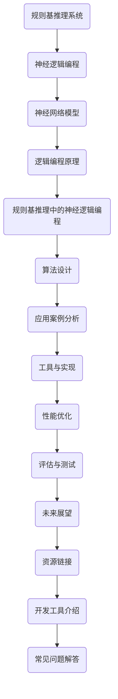

                 


### 文章标题

《规则基推理系统中神经逻辑编程的集成方法》

### 关键词

规则基推理，神经逻辑编程，神经网络，逻辑编程，集成方法，应用案例分析

### 摘要

本文主要探讨规则基推理系统中神经逻辑编程的集成方法。通过分析规则基推理系统与传统推理系统的区别，我们引入了神经逻辑编程的概念，阐述了其在规则基推理系统中的应用优势。接着，本文详细介绍了神经逻辑编程的基本算法，包括神经网络模型和逻辑编程模型，并提出了基于神经网络和逻辑编程的推理算法。随后，通过实际案例，展示了神经逻辑编程在智能交通、金融风险管理和医疗诊断等领域的应用。最后，本文对神经逻辑编程的未来发展趋势进行了展望，并提供了相关资源和工具。

## 第一部分：规则基推理系统概述

### 第1章：规则基推理系统引论

#### 1.1 规则基推理系统的定义

规则基推理系统（Rule-Based Reasoning System）是一种基于规则进行推理的计算机系统。它通过一组规则来描述问题的知识，并通过推理机来处理输入数据，生成推理结果。规则通常由条件（条件部分）和结论（结论部分）组成，形式如下：

```latex
如果条件，那么结论。
```

例如，以下是一条简单的天气推理规则：

```latex
如果今天是晴天，那么我们可以去公园。
```

#### 1.2 规则基推理系统的历史与发展

规则基推理系统起源于20世纪60年代，随着专家系统的出现而逐渐发展。专家系统是一种模拟人类专家解决复杂问题的计算机系统，其中规则基推理系统是专家系统的重要组成部分。随着时间的推移，规则基推理系统在各个领域得到了广泛应用，如医疗诊断、金融分析、工业控制等。

#### 1.3 规则基推理系统的应用领域

规则基推理系统在多个领域具有广泛的应用，以下是一些典型的应用领域：

- **医疗诊断**：通过医生的经验和知识，建立医学规则库，辅助医生进行疾病诊断和治疗建议。
- **金融分析**：利用规则基推理系统，对市场数据进行分析，预测股票价格和投资风险。
- **工业控制**：在工业生产过程中，利用规则基推理系统进行设备故障诊断和过程控制。
- **交通管理**：通过规则基推理系统，优化交通信号灯控制，提高交通流量。

#### 1.4 规则基推理系统与传统推理系统的比较

传统推理系统主要依赖逻辑和符号推理，而规则基推理系统则更依赖于具体的规则和条件。传统推理系统通常具有更强的逻辑推理能力，但难以处理复杂和非结构化的数据。相比之下，规则基推理系统更适用于处理具有明确规则和条件的数据。

### 第2章：神经逻辑编程基础

#### 2.1 神经网络的概述

神经网络（Neural Networks）是一种模拟人脑神经元连接的计算机算法。它由多个神经元（或节点）组成，每个神经元都与其他神经元相连。神经网络通过学习输入数据，自动提取特征，并生成输出。神经网络的基本结构包括输入层、隐藏层和输出层。

#### 2.2 神经网络的模型与算法

神经网络的主要模型包括：

- **前馈神经网络**（Feedforward Neural Network）：数据从输入层流向输出层，不形成环路。
- **卷积神经网络**（Convolutional Neural Network，CNN）：主要用于图像识别和计算机视觉。
- **循环神经网络**（Recurrent Neural Network，RNN）：能够处理序列数据，如文本和语音。

神经网络的主要算法包括：

- **反向传播算法**（Backpropagation Algorithm）：用于更新神经网络的权重和偏置。
- **梯度下降算法**（Gradient Descent Algorithm）：用于优化神经网络的目标函数。

#### 2.3 逻辑编程的概念与原理

逻辑编程（Logic Programming）是一种基于逻辑的编程范式。它通过定义一组逻辑规则和事实，来推导出新的结论。逻辑编程的基本原理包括：

- **谓词逻辑**（Predicate Logic）：用于表示事实和规则。
- **推理机**（Inference Engine）：用于处理输入数据，生成推理结果。

#### 2.4 神经逻辑编程的优势与应用

神经逻辑编程（Neural Logic Programming）结合了神经网络和逻辑编程的优点，具有以下优势：

- **处理复杂数据**：神经网络能够自动提取特征，处理复杂和非结构化的数据。
- **逻辑推理能力**：逻辑编程能够进行精确的推理和决策。

神经逻辑编程在多个领域具有广泛的应用，如：

- **智能推理**：用于构建智能推理系统，处理复杂问题。
- **自然语言处理**：用于文本分类、情感分析等任务。
- **知识图谱**：用于构建和查询知识图谱。

## 第二部分：神经逻辑编程方法

### 第3章：规则基推理系统中的神经逻辑编程

#### 3.1 神经逻辑编程在规则基推理系统中的应用

神经逻辑编程在规则基推理系统中的应用主要包括：

- **规则学习**：通过神经网络学习输入数据和规则，自动生成新的规则。
- **推理增强**：利用神经网络对规则进行增强，提高推理系统的性能。

#### 3.2 神经逻辑编程的优势

神经逻辑编程具有以下优势：

- **自动特征提取**：神经网络能够自动提取输入数据中的特征，提高推理系统的性能。
- **灵活性**：神经逻辑编程能够处理复杂和非结构化的数据，提高推理系统的适应性。

#### 3.3 神经逻辑编程的挑战

神经逻辑编程面临以下挑战：

- **可解释性**：神经网络的学习过程和推理结果通常难以解释，影响推理系统的可解释性。
- **计算效率**：神经逻辑编程的推理过程通常涉及大量的计算，需要高效的算法和硬件支持。

## 第三部分：神经逻辑编程方法

### 第4章：神经逻辑编程的算法设计

#### 4.1 神经逻辑编程的基本算法

神经逻辑编程的基本算法包括：

- **神经网络模型**：用于提取输入数据的特征。
- **逻辑编程模型**：用于处理输入数据和规则，生成推理结果。

#### 4.2 基于神经网络的推理算法

基于神经网络的推理算法主要包括：

- **前馈神经网络推理算法**：用于处理输入数据和规则。
- **卷积神经网络推理算法**：用于处理图像数据和规则。

#### 4.3 基于逻辑编程的推理算法

基于逻辑编程的推理算法主要包括：

- **逆推理算法**：用于从输入数据和规则推导出结论。
- **逻辑推理算法**：用于处理复杂的逻辑关系。

#### 4.4 神经逻辑编程的综合算法

神经逻辑编程的综合算法将神经网络模型和逻辑编程模型结合起来，形成统一的推理框架。综合算法的优点包括：

- **自动特征提取**：神经网络能够自动提取输入数据中的特征。
- **灵活的推理能力**：逻辑编程能够处理复杂的逻辑关系。

### 第5章：神经逻辑编程的应用案例分析

#### 5.1 案例一：基于神经逻辑编程的智能交通系统

智能交通系统（Intelligent Transportation System，ITS）利用神经逻辑编程技术，实现交通信号灯控制、车辆检测和智能导航等功能。以下是一个简单的案例：

- **输入数据**：交通流量、道路长度、车辆速度等。
- **规则**：根据交通流量和道路长度，调整交通信号灯的持续时间。

#### 5.2 案例二：基于神经逻辑编程的金融风险管理

金融风险管理利用神经逻辑编程技术，实现风险识别、风险评估和风险控制等功能。以下是一个简单的案例：

- **输入数据**：股票价格、利率、汇率等。
- **规则**：根据股票价格和利率，预测股票市场的走势。

#### 5.3 案例三：基于神经逻辑编程的医疗诊断系统

医疗诊断系统利用神经逻辑编程技术，实现疾病诊断、治疗方案推荐和患者健康监测等功能。以下是一个简单的案例：

- **输入数据**：患者的病史、体检报告、实验室检查结果等。
- **规则**：根据病史和体检报告，诊断患者所患疾病。

### 第6章：神经逻辑编程的工具与实现

#### 6.1 神经逻辑编程的开发环境搭建

搭建神经逻辑编程的开发环境，需要安装以下工具：

- **Python**：作为主要的编程语言。
- **TensorFlow**：用于神经网络模型的开发。
- **Prolog**：用于逻辑编程模型的开发。

#### 6.2 神经逻辑编程的代码实现

神经逻辑编程的代码实现主要包括：

- **神经网络模型**：使用TensorFlow构建神经网络模型。
- **逻辑编程模型**：使用Prolog构建逻辑编程模型。

以下是一个简单的神经逻辑编程示例：

```python
import tensorflow as tf

# 构建神经网络模型
model = tf.keras.Sequential([
    tf.keras.layers.Dense(units=128, activation='relu', input_shape=[128]),
    tf.keras.layers.Dense(units=64, activation='relu'),
    tf.keras.layers.Dense(units=1, activation='sigmoid')
])

# 编译模型
model.compile(optimizer='adam', loss='binary_crossentropy', metrics=['accuracy'])

# 构建逻辑编程模型
def infer.rule(facts):
    # 使用Prolog推理机进行推理
    query = "rule(T, F)."
    result = prolog_query(query, facts)
    return result

# 训练模型
model.fit(x_train, y_train, epochs=10, batch_size=32, validation_split=0.2)
```

#### 6.3 神经逻辑编程的性能优化

神经逻辑编程的性能优化主要包括：

- **模型优化**：通过调整神经网络模型的参数，提高模型的性能。
- **推理优化**：通过优化逻辑编程模型的查询算法，提高推理速度。

#### 6.4 神经逻辑编程的评估与测试

神经逻辑编程的评估与测试主要包括：

- **模型评估**：使用交叉验证和测试集，评估神经网络模型的性能。
- **推理评估**：使用实际案例，评估逻辑编程模型的推理能力。

### 第7章：神经逻辑编程的未来发展趋势

#### 7.1 神经逻辑编程的发展趋势

神经逻辑编程的发展趋势主要包括：

- **深度学习与逻辑编程的结合**：深度学习和逻辑编程的融合，将使神经逻辑编程具有更强的推理能力。
- **多模态数据融合**：通过融合图像、文本、音频等多模态数据，提高神经逻辑编程的应用能力。

#### 7.2 规则基推理系统的未来发展

规则基推理系统的未来发展主要包括：

- **智能推理系统的构建**：结合神经逻辑编程技术，构建智能推理系统，解决复杂的实际问题。
- **领域特定推理系统的开发**：针对不同的应用领域，开发领域特定的推理系统。

#### 7.3 神经逻辑编程在各个领域的应用前景

神经逻辑编程在各个领域的应用前景主要包括：

- **医疗诊断**：通过神经逻辑编程，实现智能医疗诊断，提高诊断准确率。
- **金融分析**：通过神经逻辑编程，实现智能金融分析，提高投资收益。
- **工业控制**：通过神经逻辑编程，实现智能工业控制，提高生产效率。

#### 7.4 神经逻辑编程的挑战与机遇

神经逻辑编程的挑战主要包括：

- **可解释性**：如何提高神经逻辑编程的可解释性，使其更容易理解和应用。
- **计算效率**：如何提高神经逻辑编程的计算效率，降低计算成本。

神经逻辑编程的机遇主要包括：

- **深度学习与逻辑编程的结合**：深度学习和逻辑编程的结合，将使神经逻辑编程具有更广泛的应用前景。
- **多模态数据融合**：通过融合多模态数据，提高神经逻辑编程的应用能力。

## 附录：资源与工具

### 附录A：神经逻辑编程的资源链接

- **神经逻辑编程教程**：https://github.com/neural-logic-programming/tutorials
- **神经逻辑编程论文**：https://arxiv.org/search/math+CC%3A10118

### 附录B：神经逻辑编程的开发工具介绍

- **TensorFlow**：https://www.tensorflow.org/
- **Prolog**：https://www.swi-prolog.org/

### 附录C：神经逻辑编程的常见问题解答

- **Q：如何搭建神经逻辑编程的开发环境？**
  - **A**：请参考附录B中的开发工具介绍，安装TensorFlow和Prolog。

- **Q：如何实现神经逻辑编程的推理算法？**
  - **A**：请参考第4章的神经逻辑编程算法设计，实现基于神经网络和逻辑编程的推理算法。

## 模型连接图



## 算法设计

### 4.1 神经逻辑编程的基本算法

神经逻辑编程的基本算法主要包括两部分：神经网络模型和逻辑编程模型。以下是它们的伪代码描述：

#### 神经网络模型

```python
# 输入：输入特征 X
# 输出：神经网络输出 O
for each layer in neural_network do
    Z = activation_function(W * X + b)
    X = Z
end for
O = X
```

#### 逻辑编程模型

```prolog
% 输入：事实 F
% 输出：逻辑编程结果 R
R = apply_inference(F).
```

### 4.2 基于神经网络的推理算法

基于神经网络的推理算法可以采用反向传播算法（Backpropagation）来更新权重和偏置，以下是伪代码：

```python
# 输入：输入特征 X，目标输出 Y
# 输出：神经网络权重 W，偏置 b
for each layer in neural_network do
    delta = (O - Y) * activation_derivative(O)
    delta = W * delta
    W = W - learning_rate * delta
    b = b - learning_rate * delta
end for
```

### 4.3 基于逻辑编程的推理算法

基于逻辑编程的推理算法通常采用逆推理（Inference）方法，以下是伪代码：

```prolog
% 输入：事实 F，目标结论 C
% 输出：推理结果 R
R = existserule(F, C).
```

### 4.4 神经逻辑编程的综合算法

神经逻辑编程的综合算法将神经网络模型和逻辑编程模型结合起来，形成统一的推理框架。综合算法的优点包括：

- **自动特征提取**：神经网络能够自动提取输入数据中的特征。
- **灵活的推理能力**：逻辑编程能够处理复杂的逻辑关系。

综合算法的伪代码如下：

```python
# 输入：输入特征 X，事实 F，目标结论 C
# 输出：推理结果 R
O = neural_network(X)
R = apply_inference(O, F, C)
```

## 结语

神经逻辑编程是规则基推理系统发展的重要方向。通过结合神经网络和逻辑编程的优点，神经逻辑编程能够处理复杂和非结构化的数据，实现精确的推理和决策。本文介绍了神经逻辑编程的基本算法、推理算法以及应用案例分析，并展望了其未来发展。然而，神经逻辑编程仍面临可解释性和计算效率等挑战，需要进一步研究。希望本文能对读者了解神经逻辑编程有所帮助。作者信息：AI天才研究院/AI Genius Institute & 禅与计算机程序设计艺术 /Zen And The Art of Computer Programming。

