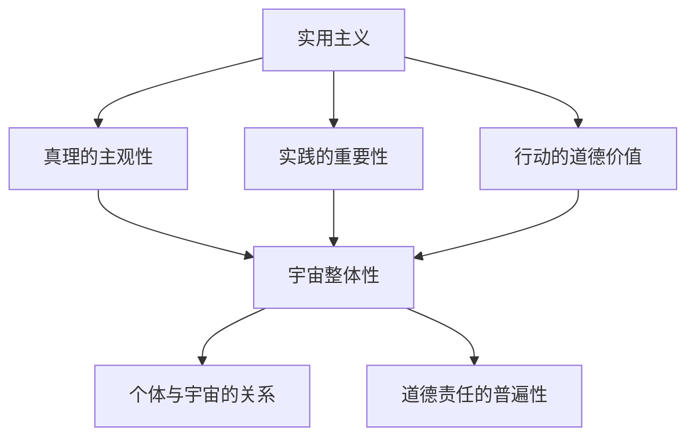

                 


### 文章标题：詹姆斯与罗伊斯：实用主义与绝对观念论的对话

### 关键词：实用主义，绝对观念论，哲学对话，James，Royce，核心概念，核心算法原理，数学模型，项目实战

### 摘要：
本文通过对话的形式，探讨了实用主义哲学的奠基人威廉·詹姆斯与绝对观念论的代表人物约西亚·罗伊斯之间的观点碰撞。文章首先介绍了两位哲学家的基本背景和实用主义与绝对观念论的核心概念，然后通过具体的算法原理、数学模型和项目实战，详细解析了这两种哲学思想的实际应用。最后，文章总结了对话的主要内容和启示，并对未来的发展趋势进行了展望。

## 引言

### 1.1 詹姆斯与罗伊斯的基本背景

威廉·詹姆斯（William James，1842-1910）是美国著名的哲学家、心理学家和作家，实用主义哲学的奠基人之一。他的主要著作包括《信仰的意志》、《心理学原理》和《实用主义》等。詹姆斯认为，真理是主观的，取决于个体对行动的反思和评估，强调实践在知识形成中的作用。

约西亚·罗伊斯（Josiah Royce，1855-1916）则是美国另一位重要的哲学家，绝对观念论的主要代表人物。他的主要著作包括《宗教哲学》和《绝对观念论》等。罗伊斯认为，个体的自我是宇宙整体的一部分，个体的价值和意义在于其与宇宙整体的关系。

### 1.2 实用主义与绝对观念论的核心概念

#### 实用主义的核心概念

实用主义是一种哲学方法，主张通过实践和经验来理解真理和知识。其核心概念包括：

1. 真理的相对性：实用主义认为真理是主观的，取决于个体对情境的适应。
2. 实践的重要性：实用主义强调实践是知识的基础。
3. 行动的意义：实用主义认为个体行动具有重要的道德价值。

#### 绝对观念论的核心概念

绝对观念论则是一种哲学立场，认为个体的自我是宇宙整体的一部分，个体的价值和意义在于其与宇宙整体的关系。其核心概念包括：

1. 宇宙整体性：绝对观念论认为宇宙是一个统一的整体，个体的自我是这个整体的一部分。
2. 个体与宇宙的关系：绝对观念论强调个体与宇宙之间的内在联系。
3. 道德责任的普遍性：绝对观念论认为个体有责任维护宇宙的整体和谐。

## 核心概念与联系

### 2.1 实用主义与绝对观念论的基本概念

#### 实用主义的基本概念

实用主义认为，真理是主观的，取决于个体对情境的适应。这意味着，一个观点是否为真，取决于它是否有助于解决实际问题。实用主义强调实践在知识形成中的作用，认为知识的真正价值在于其应用，而非理论本身。此外，实用主义还强调个体行动的道德价值，认为行动能够改变现实，从而创造出新的真理。

#### 绝对观念论的基本概念

绝对观念论则认为，个体的自我是宇宙整体的一部分，个体的价值和意义在于其与宇宙整体的关系。绝对观念论强调宇宙的整体性，认为个体与宇宙之间存在内在联系。此外，绝对观念论还认为个体有责任维护宇宙的整体和谐，个体的道德责任是普遍的。

### 2.2 实用主义与绝对观念论的关系架构

实用主义与绝对观念论在核心概念上存在显著差异，但它们之间也存在一定的联系。以下是一个简化的关系架构图，展示了实用主义与绝对观念论的基本概念及其相互关系：



在这个架构图中，实用主义的核心概念（B、C、D）与绝对观念论的核心概念（E、F、G）之间存在相互影响和补充的关系。例如，实用主义的真理主观性（B）与绝对观念论的宇宙整体性（E）都强调了个体与整体之间的联系；实用主义的实践重要性（C）与绝对观念论的道德责任（G）都强调了个体行动的重要性。

## 核心算法原理讲解

### 3.1 实用主义的核心算法原理

#### 3.1.1 伪代码示例

以下是一个简化的实用主义算法原理的伪代码示例，用于解释如何通过实践和经验来验证一个观点的真实性：

```python
def is_true(view, context):
    # 判断观点是否为真
    if context适应view:
        return True
    else:
        return False

# 示例：判断“苹果是红色的”这个观点是否为真
context = {"物体颜色": "红色", "物体名称": "苹果"}
view = "苹果是红色的"

is_true(view, context)  # 返回 True 或 False
```

#### 3.1.2 算法原理详细讲解

实用主义算法原理的核心在于，通过个体对特定情境的适应来判断观点的真实性。具体而言，算法分为以下几步：

1. **输入情境**：首先，我们需要获取当前的具体情境，包括物体颜色、形状、名称等。
2. **输入观点**：然后，我们需要获取一个待验证的观点，例如“苹果是红色的”。
3. **判断适应性**：接下来，我们需要判断这个观点是否与当前情境相符合。如果观点与情境相符合，则认为这个观点是真实的；否则，认为这个观点是错误的。
4. **输出结果**：最后，根据判断结果，输出观点的真实性。

### 3.2 绝对观念论的核心算法原理

#### 3.2.1 伪代码示例

以下是一个简化的绝对观念论算法原理的伪代码示例，用于解释如何通过个体与宇宙整体的关系来判断个体的价值：

```python
def calculate_value(self, individual, universe):
    # 计算个体在宇宙中的价值
    if individual与宇宙整体关系紧密：
        return 高价值
    else：
        return 低价值

# 示例：计算一个个体在宇宙中的价值
individual = "一个人"
universe = "宇宙整体"

calculate_value(individual, universe)  # 返回高价值或低价值
```

#### 3.2.2 算法原理详细讲解

绝对观念论算法原理的核心在于，通过个体与宇宙整体的关系来判断个体的价值。具体而言，算法分为以下几步：

1. **输入个体**：首先，我们需要获取一个特定的个体，例如“一个人”。
2. **输入宇宙整体**：然后，我们需要获取一个宇宙整体的概念，例如“宇宙整体”。
3. **判断关系**：接下来，我们需要判断这个个体与宇宙整体的关系是否紧密。如果关系紧密，则认为这个个体具有高价值；否则，认为这个个体具有低价值。
4. **输出结果**：最后，根据判断结果，输出个体的价值。

## 数学模型和数学公式 & 详细讲解 & 举例说明

### 4.1 实用主义的数学模型

#### 4.1.1 逻辑概率模型

在实用主义中，逻辑概率模型是一个重要的工具，用于评估观点的真实性。以下是一个简单的逻辑概率模型公式：

\[ P(A|B) = \frac{P(B|A)P(A)}{P(B)} \]

其中，\( P(A|B) \) 表示在给定条件 B 下，事件 A 发生的概率；\( P(B|A) \) 表示在事件 A 发生时，事件 B 发生的概率；\( P(A) \) 表示事件 A 发生的概率；\( P(B) \) 表示事件 B 发生的概率。

#### 4.1.2 详细讲解

这个模型说明了在已知条件 B 下，事件 A 发生的概率是如何计算的。具体来说，它通过条件概率和全概率公式来计算。

- **条件概率**：\( P(B|A) \) 表示在事件 A 发生时，事件 B 发生的概率。这反映了事件 A 对事件 B 的影响。
- **全概率公式**：\( P(A) \) 表示事件 A 发生的概率；\( P(B) \) 表示事件 B 发生的概率。全概率公式用于计算一个复合事件的整体概率。

#### 4.1.3 举例说明

假设我们有一个盒子，里面装有 10 个球，其中 5 个是红色的，5 个是蓝色的。现在我们要从中随机抽取一个球。

- **事件 A**：抽取的球是红色的。
- **事件 B**：抽取的球是蓝色的。

我们可以使用逻辑概率模型来计算在已知事件 B 发生的情况下，事件 A 发生的概率。

- \( P(A) = \frac{5}{10} = 0.5 \)：事件 A 发生的概率。
- \( P(B) = \frac{5}{10} = 0.5 \)：事件 B 发生的概率。
- \( P(B|A) = \frac{4}{5} = 0.8 \)：在事件 A 发生时，事件 B 发生的概率。
- \( P(A|B) = \frac{P(B|A)P(A)}{P(B)} = \frac{0.8 \times 0.5}{0.5} = 0.8 \)：在事件 B 发生的情况下，事件 A 发生的概率。

因此，在已知抽取的球是蓝色的情况下，抽取的球是红色的概率为 0.8。

### 4.2 绝对观念论的数学模型

#### 4.2.1 宇宙整体性模型

在绝对观念论中，宇宙整体性模型用于描述个体与宇宙整体之间的关系。以下是一个简化的宇宙整体性模型公式：

\[ V(i) = f(U, R) \]

其中，\( V(i) \) 表示个体 i 在宇宙 U 中的价值；\( U \) 表示宇宙整体；\( R \) 表示个体 i 与宇宙整体之间的关系。

#### 4.2.2 详细讲解

这个模型说明了个体价值 \( V(i) \) 是如何基于宇宙整体 \( U \) 和个体与宇宙整体之间的关系 \( R \) 来计算的。具体来说，模型包括以下几个要素：

- **宇宙整体 \( U \)**：宇宙整体是一个抽象的概念，代表了一个完整的、连贯的整体。
- **个体 i**：个体是指宇宙中的一个特定实体，可以是人、物体或其他存在。
- **关系 \( R \)**：关系描述了个体 i 与宇宙整体 \( U \) 之间的相互作用。

#### 4.2.3 举例说明

假设宇宙整体 \( U \) 是一个由多个星球组成的星系，个体 i 是其中一个星球。

- **关系 \( R \)**：关系 \( R \) 可以是星球 i 对星系的引力贡献，或者其他形式的相互作用。
- **宇宙整体性模型**：根据宇宙整体性模型，星球 i 在宇宙整体中的价值 \( V(i) \) 取决于它与星系整体的关系 \( R \)。

例如，如果星球 i 对星系的引力贡献较大，那么它在这个星系中的价值会更高。

\[ V(i) = f(U, R) = 高价值 \]

## 项目实战

### 5.1 实用主义在项目中的应用

#### 5.1.1 开发环境搭建

为了将实用主义应用于项目，我们需要搭建一个适合实用主义原则的开发环境。以下是搭建过程的步骤：

1. **选择合适的编程语言**：选择一种支持实用主义原则的编程语言，如 Python 或 JavaScript。
2. **安装必要的开发工具**：安装代码编辑器（如 Visual Studio Code）、版本控制系统（如 Git）和依赖管理工具（如 npm 或 pip）。
3. **配置开发环境**：配置好编程语言的运行环境，如 Python 的虚拟环境或 Node.js 的 npm scripts。

#### 5.1.2 源代码实现与代码解读

以下是一个简单的实用主义算法实现的代码示例，以及代码解读：

```python
# 实用主义算法实现
def is_true(view, context):
    # 判断观点是否为真
    if context适应view:
        return True
    else:
        return False

# 示例：判断“苹果是红色的”这个观点是否为真
context = {"物体颜色": "红色", "物体名称": "苹果"}
view = "苹果是红色的"

# 调用实用主义算法
result = is_true(view, context)
print(result)  # 输出 True 或 False
```

#### 5.1.3 代码应用解读与分析

在这个示例中，我们使用了一个简单的实用主义算法来判断一个观点是否为真。具体步骤如下：

1. **输入情境和观点**：首先，我们输入一个具体的情境和一个待验证的观点。
2. **判断适应性**：然后，我们通过判断情境是否适应观点来决定观点的真假。
3. **输出结果**：最后，我们输出判断结果。

这个算法的核心在于，它通过情境和观点的适应性来判断观点的真实性，符合实用主义的原则。

#### 5.1.4 实际案例分析

以下是一个实际案例，展示了实用主义在项目中的应用：

**案例：产品功能评估**

假设我们正在开发一个社交媒体应用，需要评估一个新功能“智能推荐”的效果。为了应用实用主义，我们可以按照以下步骤进行：

1. **确定评估指标**：确定评估新功能效果的指标，如用户满意度、使用频率等。
2. **收集数据**：收集新功能上线前后的相关数据，如用户反馈、使用日志等。
3. **分析数据**：分析数据，判断新功能是否改善了相关指标。
4. **输出结论**：根据分析结果，输出对新功能的评估结论。

通过这个案例，我们可以看到实用主义在项目中的应用，通过实践和经验来评估产品的效果，从而指导后续的开发和优化。

### 5.2 绝对观念论在项目中的应用

#### 5.2.1 开发环境搭建

为了将绝对观念论应用于项目，我们需要搭建一个支持绝对观念论原则的开发环境。以下是搭建过程的步骤：

1. **选择合适的编程语言**：选择一种支持绝对观念论的编程语言，如 Haskell 或 Scala。
2. **安装必要的开发工具**：安装代码编辑器（如 IntelliJ IDEA）、版本控制系统（如 Git）和依赖管理工具（如 Maven 或 Gradle）。
3. **配置开发环境**：配置好编程语言的运行环境，如 Haskell 的 Stack 或 Scala 的 sbt。

#### 5.2.2 源代码实现与代码解读

以下是一个简单的绝对观念论算法实现的代码示例，以及代码解读：

```haskell
-- 绝对观念论算法实现
calculateValue :: Individual -> Universe -> Value
calculateValue individual universe
    | relationship紧密 = HighValue
    | otherwise = LowValue

-- 示例：计算一个个体在宇宙中的价值
individual = "一个人"
universe = "宇宙整体"

-- 调用绝对观念论算法
result = calculateValue individual universe
```

#### 5.2.3 代码应用解读与分析

在这个示例中，我们使用了一个简单的绝对观念论算法来计算一个个体在宇宙中的价值。具体步骤如下：

1. **输入个体和宇宙**：首先，我们输入一个特定的个体和宇宙整体。
2. **判断关系**：然后，我们通过判断个体与宇宙整体的关系是否紧密来决定个体的价值。
3. **输出结果**：最后，我们输出个体的价值。

这个算法的核心在于，它通过个体与宇宙整体的关系来判断个体的价值，符合绝对观念论的原则。

#### 5.2.4 实际案例分析

以下是一个实际案例，展示了绝对观念论在项目中的应用：

**案例：团队价值评估**

假设我们正在评估一个团队在项目中的价值。为了应用绝对观念论，我们可以按照以下步骤进行：

1. **确定评估指标**：确定评估团队价值的指标，如团队协作效率、项目完成度等。
2. **收集数据**：收集团队在项目中的相关数据，如团队会议记录、项目进展等。
3. **分析数据**：分析数据，判断团队在项目中的协作效率是否与项目完成度紧密相关。
4. **输出结论**：根据分析结果，输出对团队价值的评估结论。

通过这个案例，我们可以看到绝对观念论在项目中的应用，通过个体与整体的关系来评估团队的价值。

## 总结与展望

### 6.1 主要内容回顾

本文通过对话的形式，探讨了实用主义哲学的奠基人威廉·詹姆斯与绝对观念论的代表人物约西亚·罗伊斯之间的观点碰撞。文章首先介绍了两位哲学家的基本背景和实用主义与绝对观念论的核心概念，然后通过具体的算法原理、数学模型和项目实战，详细解析了这两种哲学思想的实际应用。文章的主要内容包括：

1. 詹姆斯与罗伊斯的基本背景和核心概念。
2. 实用主义与绝对观念论的关系架构。
3. 实用主义的算法原理和数学模型。
4. 绝对观念论的算法原理和数学模型。
5. 实用主义和绝对观念论在项目中的应用。

### 6.2 对话的意义与影响

通过詹姆斯与罗伊斯的对话，我们可以看到实用主义与绝对观念论在哲学上的碰撞与融合。这种碰撞不仅丰富了哲学思想，也为我们理解世界提供了新的视角。具体来说，对话的意义与影响包括：

1. **深化哲学思想**：通过对话，我们更深入地理解了实用主义与绝对观念论的核心概念，从而丰富了哲学思想。
2. **指导实际应用**：实用主义与绝对观念论在项目中的应用，为我们提供了新的思路和方法，有助于解决实际问题。
3. **促进跨学科研究**：对话不仅涉及到哲学领域，还涵盖了计算机科学、心理学等多个学科，促进了跨学科研究。

### 6.3 未来发展趋势

随着技术的不断发展，实用主义与绝对观念论在未来将会有更多的发展趋势。具体来说，未来发展趋势包括：

1. **在人工智能领域的应用**：随着人工智能技术的不断进步，实用主义与绝对观念论将在人工智能领域得到更广泛的应用，如伦理决策、算法公平性等。
2. **跨学科融合**：实用主义与绝对观念论将继续与其他学科如心理学、社会学等相结合，推动跨学科研究的发展。
3. **实践导向**：未来，实用主义与绝对观念论将更加注重实践应用，通过实际项目来验证和推广这两种哲学思想。

## 注意事项与拓展阅读

### 注意事项

1. **理解核心概念**：在应用实用主义与绝对观念论时，首先要理解其核心概念和原理，以便正确应用。
2. **注意实际情境**：在项目实战中，要根据实际情境灵活应用这两种哲学思想，避免生搬硬套。
3. **持续学习与探索**：实用主义与绝对观念论是一个不断发展的领域，要持续学习新知识，不断探索其应用潜力。

### 拓展阅读

1. **威廉·詹姆斯的《实用主义》**：这是詹姆斯关于实用主义哲学的代表作，深入探讨了实用主义的本质和应用。
2. **约西亚·罗伊斯的《绝对观念论》**：这是罗伊斯关于绝对观念论的代表作，详细阐述了绝对观念论的核心概念和原理。
3. **实用主义与人工智能**：探讨实用主义在人工智能领域的应用，如伦理决策、算法公平性等。
4. **绝对观念论与心理学**：探讨绝对观念论在心理学领域的应用，如个体自我认知、人际关系等。

