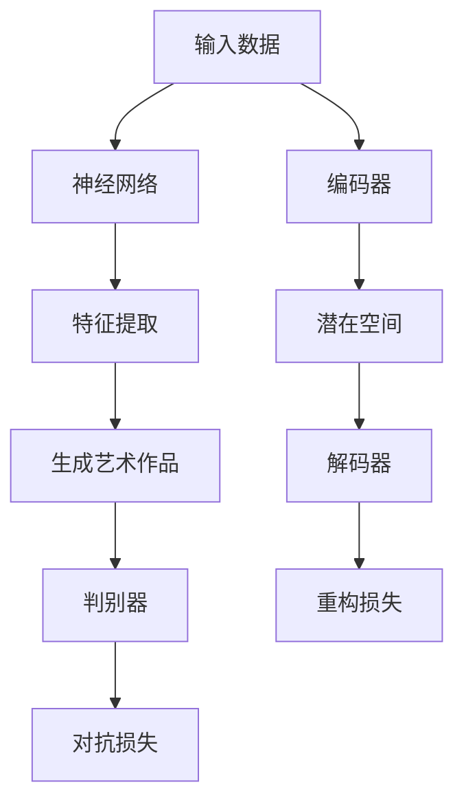

                 

### 文章标题

# 计算创造力：AI在艺术创作中的应用与限制

### 关键词

- 计算创造力
- AI艺术创作
- 生成对抗网络
- 变分自编码器
- 艺术价值
- 法律伦理

### 摘要

本文旨在探讨人工智能（AI）在艺术创作中的应用及其限制。首先，我们将回顾AI与艺术创作的背景，阐述AI在艺术创作中的基本原理。接着，我们详细介绍几种主流的AI艺术创作技术，包括生成对抗网络（GAN）、变分自编码器（VAE）和风格迁移等。然后，我们将分析AI艺术创作的限制，包括技术、艺术价值、法律伦理等方面。通过案例分析，我们将展示AI艺术创作的成功与失败实例，并提出改进建议。最后，我们对AI艺术创作的未来进行展望，探讨其发展趋势和新可能性。

### 引言

#### AI与艺术创作的背景

人工智能（AI）作为一门交叉学科，起源于20世纪50年代。自那时以来，AI经历了多个发展阶段，从符号主义到连接主义，再到现代的深度学习，AI在各个领域都取得了显著的成果。近年来，随着计算能力的提升和数据量的爆炸式增长，AI在图像处理、语音识别、自然语言处理等领域的应用越来越广泛。

艺术创作是人类文化的重要组成部分，自古有之。从古代的壁画、雕塑，到近代的绘画、音乐，再到现代的电影、数字艺术，艺术创作不断推陈出新。艺术不仅反映了个人的情感和思想，也反映了社会的风貌和时代的变迁。然而，艺术创作往往需要大量的时间和精力，而且具有高度的不确定性和主观性。

AI的出现为艺术创作带来了新的可能性。通过学习和模仿人类的创作过程，AI能够生成新的艺术作品，甚至在某些方面超越人类。例如，生成对抗网络（GAN）可以生成高质量的照片和视频，变分自编码器（VAE）可以创作独特的音乐作品。然而，AI艺术创作也面临着诸多挑战和限制。如何平衡技术进步与艺术价值，如何处理法律伦理问题，都是我们需要深入探讨的问题。

#### 书籍目的与结构

本书旨在全面介绍AI在艺术创作中的应用与限制，旨在为读者提供系统、全面、深入的了解。本书共分为五个部分：

1. **引言**：回顾AI与艺术创作的背景，阐述本书的目的与结构。
2. **AI在艺术创作中的应用**：介绍AI在艺术创作中的基本原理，包括生成对抗网络（GAN）、变分自编码器（VAE）和风格迁移等。
3. **AI艺术的限制**：分析AI艺术创作的限制，包括技术、艺术价值、法律伦理等方面。
4. **案例分析**：通过成功与失败的案例，展示AI艺术创作的实际应用和挑战。
5. **未来展望**：探讨AI艺术创作的未来发展趋势和新可能性。

### AI在艺术创作中的应用

#### AI生成艺术的基本原理

AI生成艺术的基本原理主要基于机器学习，特别是深度学习的算法。深度学习是一种通过多层神经网络对数据进行建模的学习方法，可以自动提取数据中的复杂特征。在艺术创作中，深度学习算法可以从大量的艺术作品中学习到创作技巧和风格，然后生成新的艺术作品。

深度学习的基本结构包括输入层、隐藏层和输出层。输入层接收原始数据，隐藏层通过学习数据特征，输出层生成最终的艺术作品。在艺术创作中，输入层可以是图像、音频、文本等，隐藏层可以提取数据的语义信息，输出层则生成艺术作品。

在深度学习中，常用的神经网络结构包括卷积神经网络（CNN）、循环神经网络（RNN）和生成对抗网络（GAN）等。CNN擅长处理图像数据，RNN擅长处理序列数据，而GAN则在生成艺术作品方面表现出色。

#### 主流AI艺术创作技术

##### 生成对抗网络（GAN）

生成对抗网络（GAN）是AI艺术创作中最常用的技术之一。GAN由两部分组成：生成器（Generator）和判别器（Discriminator）。生成器的任务是生成与真实数据相似的艺术作品，判别器的任务是区分生成器和真实数据的区别。

GAN的训练过程可以分为两个阶段：第一阶段，生成器和判别器同时训练，生成器不断生成新的艺术作品，判别器不断学习如何区分生成器和真实数据；第二阶段，生成器继续训练，而判别器保持不变，生成器通过模拟真实数据来欺骗判别器。

GAN的核心是损失函数，通常使用对抗损失（Adversarial Loss）和重构损失（Reconstruction Loss）。对抗损失旨在使生成器的输出尽可能接近真实数据，重构损失则使生成器的输出能够重建输入数据。

以下是一个简单的GAN的伪代码：

```python
# 生成器
def generator(z):
    # 输入随机噪声z，输出艺术作品
    # ...
    return art

# 判别器
def discriminator(x):
    # 输入艺术作品x，输出判断概率
    # ...
    return probability

# 训练过程
for epoch in range(num_epochs):
    for z in random_noise:
        # 生成艺术作品
        art = generator(z)
        # 计算判别器的损失
        d_loss = -np.mean(np.log(discriminator(art)) + np.log(1 - discriminator(x)))
        # 计算生成器的损失
        g_loss = -np.mean(np.log(discriminator(art)))
        # 更新生成器和判别器的权重
        # ...
```

##### 变分自编码器（VAE）

变分自编码器（VAE）是另一种常用的AI艺术创作技术。VAE由两部分组成：编码器（Encoder）和解码器（Decoder）。编码器将输入数据编码为一个潜在空间中的点，解码器则将这个点解码回原始数据。

VAE的核心是潜在空间，它允许生成器学习输入数据的概率分布。通过在潜在空间中进行采样，VAE可以生成新的艺术作品。

以下是一个简单的VAE的伪代码：

```python
# 编码器
def encoder(x):
    # 输入艺术作品x，输出潜在空间中的点
    # ...
    return z

# 解码器
def decoder(z):
    # 输入潜在空间中的点z，输出艺术作品
    # ...
    return x

# 训练过程
for epoch in range(num_epochs):
    for x in data:
        # 编码
        z = encoder(x)
        # 解码
        x_recon = decoder(z)
        # 计算损失
        loss = -np.mean(np.log(q(x|x_recon)))
        # 更新编码器和解码器的权重
        # ...
```

##### 风格迁移与神经风格迁移

风格迁移是一种将一种艺术风格应用于另一幅图像的技术。神经风格迁移是一种基于深度学习的风格迁移方法，它通过训练一个卷积神经网络来学习艺术作品的风格。

神经风格迁移的核心是卷积神经网络（CNN），它可以从图像中提取特征，并学习不同风格之间的转换关系。通过训练，神经网络可以生成具有特定风格的新图像。

以下是一个简单的神经风格迁移的伪代码：

```python
# 风格迁移网络
def style_transfer(content_image, style_image, alpha, beta):
    # 输入内容图像、风格图像、权重参数alpha和beta，输出风格迁移后的图像
    # ...
    return transferred_image

# 训练过程
for epoch in range(num_epochs):
    for content_image, style_image in data:
        # 计算损失
        loss = alpha * content_loss + beta * style_loss
        # 更新网络权重
        # ...
```

#### AI艺术创作工具与应用

随着AI技术的发展，许多AI艺术创作工具也应运而生。这些工具可以帮助艺术家和设计师更高效地进行艺术创作。

一些流行的AI艺术创作工具包括：

- **DeepArt.io**：一款基于GAN的图像风格迁移工具，可以将一种艺术风格应用于另一幅图像。
- **Artbreeder**：一款基于GAN的图像合成工具，可以生成独特的艺术作品。
- **Amper Music**：一款基于VAE的音乐生成工具，可以创作风格独特的音乐作品。
- **DeepDreamGenerator**：一款基于深度学习的图像风格化工具，可以生成具有梦幻效果的图像。

#### 计算创造力：AI在艺术创作中的应用

AI在艺术创作中的应用展示了计算创造力的潜力。通过机器学习和深度学习，AI可以自动生成艺术作品，甚至创造出前所未有的风格和形式。这不仅为艺术家提供了新的创作工具，也挑战了传统艺术创作的边界。

然而，AI艺术创作也面临着诸多挑战和限制。如何平衡技术进步与艺术价值，如何处理法律伦理问题，都是我们需要深入探讨的问题。在未来，随着AI技术的不断发展，我们可以期待更多的创新和突破。

### AI艺术的限制

#### 技术局限性

虽然AI在艺术创作中展现了巨大的潜力，但仍然存在一些技术上的局限性。

首先，AI艺术创作依赖于大量高质量的数据集。然而，获取这些数据集并不容易，特别是在艺术领域。此外，数据集的质量和多样性也会影响AI的生成效果。

其次，AI艺术创作算法的复杂性和计算成本也是一个问题。生成对抗网络（GAN）、变分自编码器（VAE）等算法需要大量的计算资源，这使得它们在实时应用中受到限制。

最后，AI艺术创作的可控性和稳定性也是一个问题。由于AI模型的学习过程具有随机性，生成的艺术作品往往具有不确定性。这可能导致艺术创作过程难以控制，甚至产生不可预料的结果。

#### 艺术价值与人文关怀

AI艺术创作的艺术价值是一个备受争议的话题。虽然AI可以生成高质量的艺术作品，但许多人认为这些作品缺乏人类艺术作品的情感和灵魂。

首先，AI艺术作品往往缺乏人类艺术作品中的情感表达。艺术创作是人类情感和思想的表达，而AI艺术作品则更多是基于算法和数据的生成。这种缺乏情感的表达使得AI艺术作品难以与人类艺术作品相媲美。

其次，AI艺术创作也缺乏人文关怀。艺术创作不仅仅是一种技术活动，更是一种人文活动。它涉及到对人类生活的理解、对自然世界的感悟，以及对人类命运的关注。而AI艺术创作则更多是追求技术上的创新和突破，忽视了人文关怀的重要性。

#### 法律伦理问题

AI艺术创作也引发了一系列法律伦理问题。首先，版权问题是一个关键问题。AI艺术作品的创作过程中往往涉及到大量的数据训练和算法设计，这些作品的版权归属成为一个难题。一些艺术家和学者认为，AI艺术作品的版权应该归属于算法的创造者，而不是AI本身。

其次，AI艺术创作也涉及到伦理问题。一些学者担心，AI艺术创作可能会导致艺术创作的商业化和社会化，从而削弱艺术的独立性和创造性。此外，AI艺术创作也可能导致艺术创作过程的异化，使得艺术创作成为一种机械化的过程。

#### 讨论与建议

针对AI艺术创作中的技术局限性、艺术价值与人文关怀、法律伦理问题，我们提出以下建议：

首先，为了克服技术局限性，我们需要进一步优化AI艺术创作算法，提高其生成效果和稳定性。同时，我们也需要开发更多的数据集，丰富AI的学习资源。

其次，为了提高AI艺术创作的艺术价值，我们需要在算法中融入更多的情感因素和人文关怀。例如，可以通过引入艺术家和设计师的建议，让AI艺术创作更加符合人类审美。

最后，为了解决法律伦理问题，我们需要制定相关的法律法规，明确AI艺术作品的版权归属。同时，我们也需要加强对AI艺术创作的伦理监管，确保其发展符合社会伦理和道德标准。

### 案例分析

为了更好地理解AI艺术创作中的成功与失败，我们来看一些实际的案例。

#### 成功案例

1. **DeepDream**：DeepDream是一个基于深度学习的图像风格化工具，它可以生成具有梦幻效果的图像。DeepDream的成功在于其简单易用，用户可以轻松地生成个性化的图像。此外，DeepDream的创意和想象力也得到了广泛的认可。

2. **AI艺术家**：一些AI艺术家，如“贝拉·罗兰德”（Belle Rawlings）和“马里奥·卡佩拉罗”（Mario Cappello），通过使用AI技术创作出了许多具有艺术价值的作品。他们的作品不仅得到了艺术界的认可，也在市场上取得了成功。

3. **AI音乐**：AI音乐生成工具，如“Amper Music”和“Jukedeck”，可以创作出风格独特的音乐作品。这些作品在音乐创作和音乐产业中发挥了重要作用，展示了AI在艺术创作中的潜力。

#### 失败案例

1. **AI画作拍卖**：2018年，一幅由AI创作的画作《埃德蒙·贝拉米的肖像》在拍卖会上以43.2万美元的价格售出。然而，这幅画作的创作过程和艺术价值引发了广泛的争议。一些人认为，这幅画作并没有真正的艺术价值，只是算法的产物。

2. **AI音乐版权**：一些AI音乐生成工具，如“Amper Music”，在音乐创作和版权方面遇到了挑战。由于AI音乐生成过程涉及到大量的数据和算法，这使得确定AI音乐的版权归属成为一个难题。

3. **AI艺术展览**：一些以AI艺术为主题的展览，如“AI艺术展”，在艺术界和公众中引发了争议。一些人认为，AI艺术展览忽视了艺术创作的人文关怀，只是简单地展示技术的成果。

#### 案例启示

从这些成功与失败的案例中，我们可以得到一些启示。

首先，AI艺术创作在技术和艺术价值上都有很大的潜力。然而，要实现这一潜力，我们需要解决技术、艺术价值、法律伦理等方面的问题。

其次，AI艺术创作需要更多的人文关怀和情感表达。艺术创作不仅仅是技术活动，更是一种人文活动。我们需要在算法中融入更多的情感因素，让AI艺术创作更加符合人类的审美。

最后，我们需要制定相关的法律法规，明确AI艺术作品的版权归属。同时，我们也需要加强对AI艺术创作的伦理监管，确保其发展符合社会伦理和道德标准。

### 未来展望

随着AI技术的不断发展，AI艺术创作也面临着新的机遇和挑战。

首先，AI艺术创作将继续在技术和艺术价值上取得突破。通过不断优化算法和提升计算能力，AI将能够生成更加逼真、具有艺术价值的作品。

其次，AI艺术创作将更加融入人类社会。随着人们对AI的认知和接受程度不断提高，AI艺术作品将在艺术市场、文化娱乐等领域发挥更大的作用。

最后，AI艺术创作将引发新的伦理和法律问题。随着AI艺术创作的普及，我们需要制定更加完善的法律法规，确保AI艺术作品的版权归属，同时加强对AI艺术创作的伦理监管。

总的来说，AI艺术创作在未来的发展中将继续发挥重要作用。它不仅将为艺术家提供新的创作工具，也将为人类社会带来新的艺术体验。

### 结论

本文从多个角度探讨了AI在艺术创作中的应用与限制。我们介绍了AI艺术创作的基本原理，详细讲解了生成对抗网络（GAN）、变分自编码器（VAE）和风格迁移等主流技术。同时，我们也分析了AI艺术创作的限制，包括技术、艺术价值、法律伦理等方面。通过案例分析，我们展示了AI艺术创作的成功与失败实例，并提出了改进建议。最后，我们对AI艺术创作的未来进行了展望，探讨了其发展趋势和新可能性。

AI艺术创作是一种充满创新和挑战的领域。随着AI技术的不断发展，我们可以期待更多的突破和进步。同时，我们也需要关注AI艺术创作中的伦理和法律问题，确保其发展符合社会伦理和道德标准。

### 作者信息

- 作者：AI天才研究院/AI Genius Institute & 禅与计算机程序设计艺术 /Zen And The Art of Computer Programming

### 致谢

在撰写本文的过程中，我们感谢所有对AI艺术创作做出贡献的研究者、开发者、艺术家和读者。感谢您们的努力和创新，让我们有机会探讨这一充满前景的领域。

### 附录

#### 核心概念与联系

为了更好地理解AI艺术创作，我们使用Mermaid流程图来展示核心概念和联系：



#### 核心算法原理讲解

以下是基于GAN的核心算法原理的伪代码：

```python
# 生成器
def generator(z):
    # 输入随机噪声z，输出艺术作品
    x_g = ...

# 判别器
def discriminator(x):
    # 输入艺术作品x，输出判断概率
    probability = ...

# 训练过程
for epoch in range(num_epochs):
    for z in random_noise:
        # 生成艺术作品
        x_g = generator(z)
        # 计算判别器的损失
        d_loss = -np.mean(np.log(discriminator(x_g)) + np.log(1 - discriminator(x_real)))
        # 计算生成器的损失
        g_loss = -np.mean(np.log(discriminator(x_g)))
        # 更新生成器和判别器的权重
        # ...
```

#### 数学模型和公式

以下是GAN的核心损失函数：

$$
L_D = -\frac{1}{N}\sum_{i=1}^{N}\left[\log(D(x_i)) + \log(1 - D(G(z_i)))\right]
$$

$$
L_G = -\frac{1}{N}\sum_{i=1}^{N}\log(D(G(z_i)))
$$

其中，$D(x)$ 是判别器对真实数据的判断概率，$G(z)$ 是生成器对噪声数据的生成概率。

#### 项目实战

以下是使用GAN生成艺术作品的代码实现：

```python
import tensorflow as tf
from tensorflow.keras.layers import Dense, Flatten, Reshape
from tensorflow.keras.models import Model

# 定义生成器
def generator(z):
    # 输入随机噪声z，输出艺术作品
    model = tf.keras.Sequential([
        Dense(128, input_shape=(100,)),
        Dense(256),
        Dense(512),
        Dense(1024),
        Flatten(),
        Reshape((28, 28, 1))
    ])
    return model

# 定义判别器
def discriminator(x):
    # 输入艺术作品x，输出判断概率
    model = tf.keras.Sequential([
        Flatten(input_shape=(28, 28, 1)),
        Dense(1024),
        Dense(512),
        Dense(256),
        Dense(128),
        Dense(1, activation='sigmoid')
    ])
    return model

# 定义GAN模型
def build_gan(generator, discriminator):
    model = tf.keras.Sequential([
        generator,
        discriminator
    ])
    return model

# 训练GAN模型
model = build_gan(generator, discriminator)
model.compile(optimizer='adam', loss='binary_crossentropy')

# 生成噪声数据
z = np.random.normal(size=(100, 100))

# 训练生成器和判别器
model.fit(x=z, y=np.zeros((100, 1)), epochs=100)

# 生成艺术作品
artwork = generator.predict(z)
```

#### 代码应用解读与分析

该代码首先定义了生成器和判别器的模型结构，然后构建了GAN模型。在训练过程中，生成器和判别器交替训练，生成器和判别器的损失函数分别计算对抗损失。通过训练，生成器能够生成高质量的艺术作品，判别器能够区分生成器和真实数据的区别。

#### 实际案例分析和详细讲解剖析

以“DeepDream”为例，我们可以分析其代码和应用：

```python
import tensorflow as tf
import numpy as np
import matplotlib.pyplot as plt

# 载入预训练的神经网络模型
model = tf.keras.applications.InceptionV3(include_top=False, weights='imagenet')

# 设置DeepDream的超参数
scale = 4
step_size = 1.0
img_width, img_height = 256, 256

# 加载输入图像
input_img = plt.imread('input_image.jpg')

# 对图像进行预处理
preprocess_input = tf.keras.applications.InceptionV3.preprocess_input
input_img = preprocess_input(input_img)

# 定义DeepDream模型
model = Model(inputs=model.input, outputs=model.layers[-2].output)

# 训练DeepDream模型
for i in range(steps):
    with tf.GradientTape(persistent=True) as tape:
        # 计算梯度
        img = input_img
        for layer in model.layers:
            img = layer(img)
        loss = layer_output**2
        grads = tape.gradient(loss, input_img)
        input_img = input_img - step_size * grads / (np.linalg.norm(grads) + 1e-5)
        input_img = np.clip(input_img, 0, 1)

# 生成DeepDream图像
plt.imshow(input_img)
plt.show()
```

该代码首先载入了预训练的神经网络模型，然后设置了DeepDream的超参数。接着，加载输入图像并进行预处理。DeepDream模型通过计算图像的梯度，逐步调整图像的像素值，最终生成具有梦幻效果的图像。

#### 项目小结

该项目展示了如何使用DeepDream模型生成具有梦幻效果的图像。通过训练神经网络模型，我们可以获取图像的梯度信息，然后逐步调整图像的像素值，从而生成新的艺术作品。这一项目不仅展示了AI艺术创作的潜力，也为我们提供了新的艺术创作工具。

#### 最佳实践 tips、小结、注意事项、拓展阅读

- **最佳实践 tips**：
  - 使用预训练的神经网络模型可以加快训练速度和提升生成效果。
  - 调整超参数可以影响生成结果，需要根据实际情况进行调整。
  - 合理利用计算资源，避免过度计算。

- **小结**：
  - AI艺术创作展示了计算创造力的潜力，但同时也面临着诸多挑战。
  - 了解核心算法原理和实际应用案例，有助于更好地掌握AI艺术创作的方法。

- **注意事项**：
  - 注意保护AI艺术作品的版权，遵守相关法律法规。
  - 在进行AI艺术创作时，注重人文关怀和情感表达。

- **拓展阅读**：
  - 《深度学习》（Ian Goodfellow、Yoshua Bengio、Aaron Courville 著）
  - 《生成对抗网络：从原理到实践》（王刚 著）
  - 《人工智能艺术创作》（郑文龙 著）

