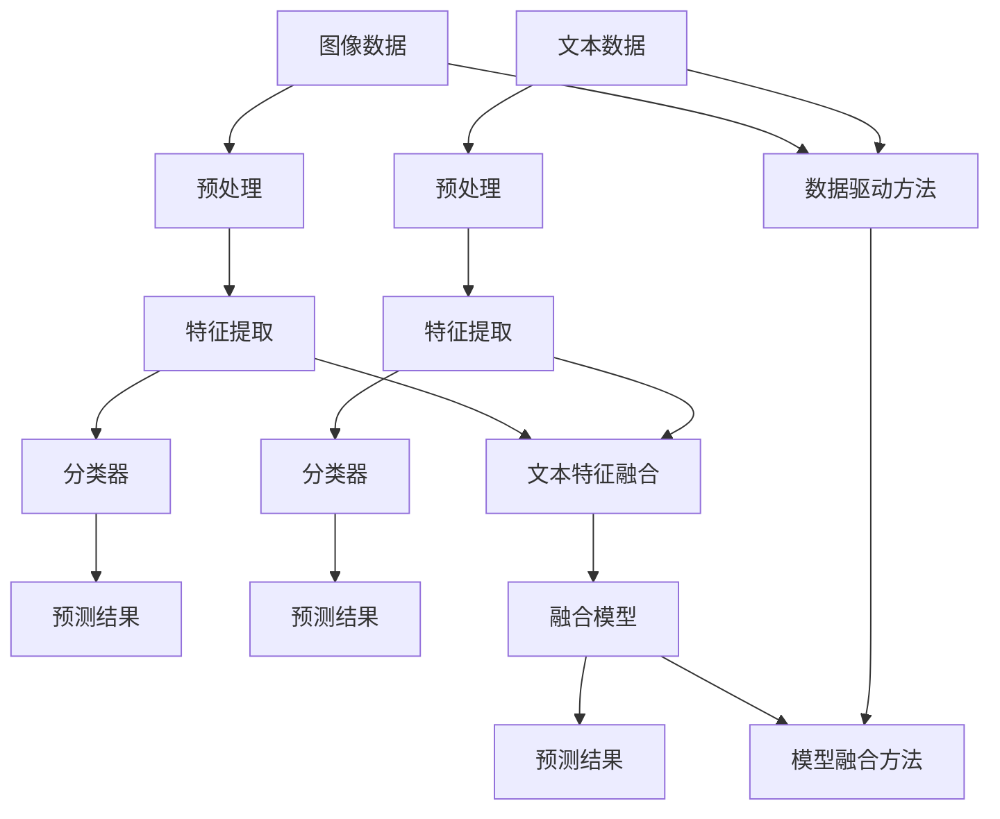
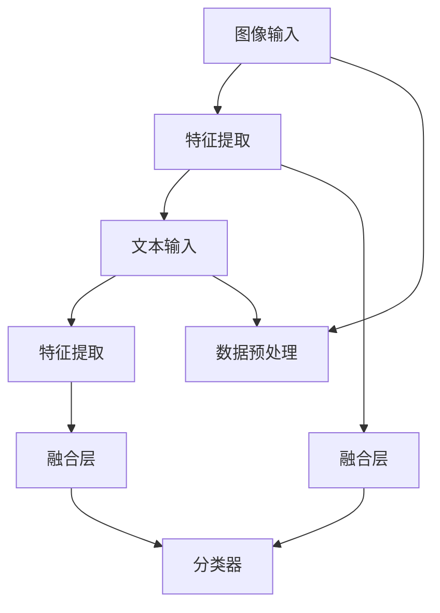
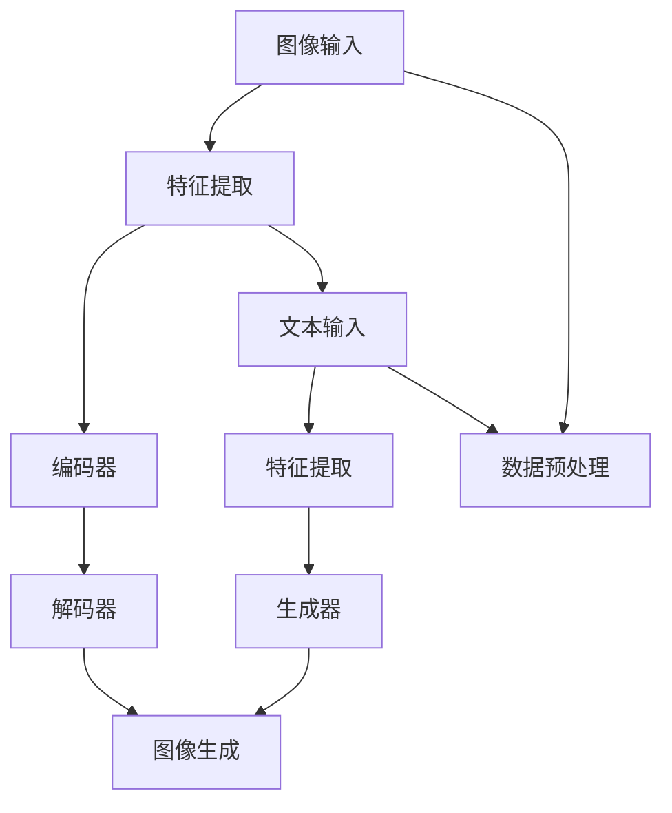
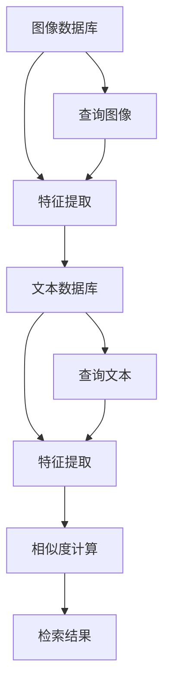
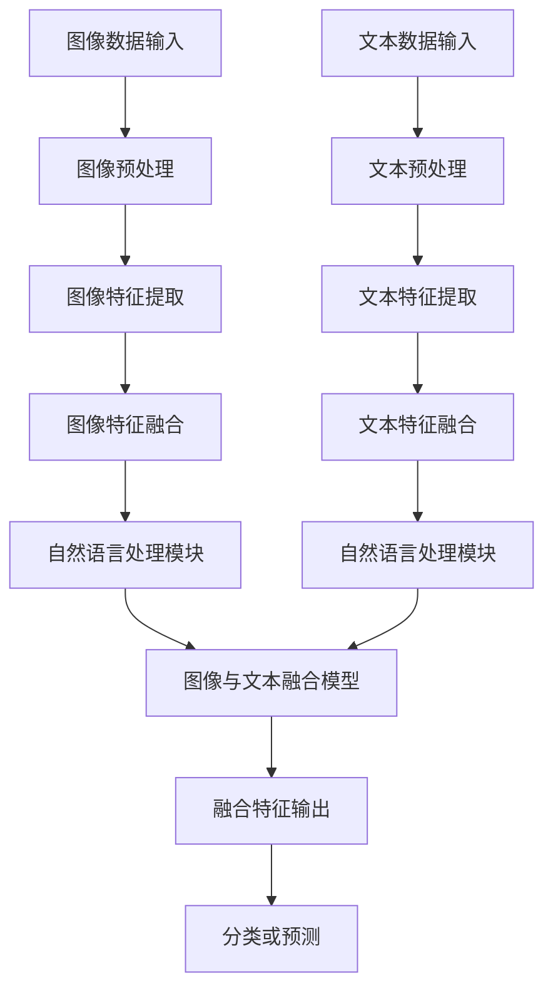
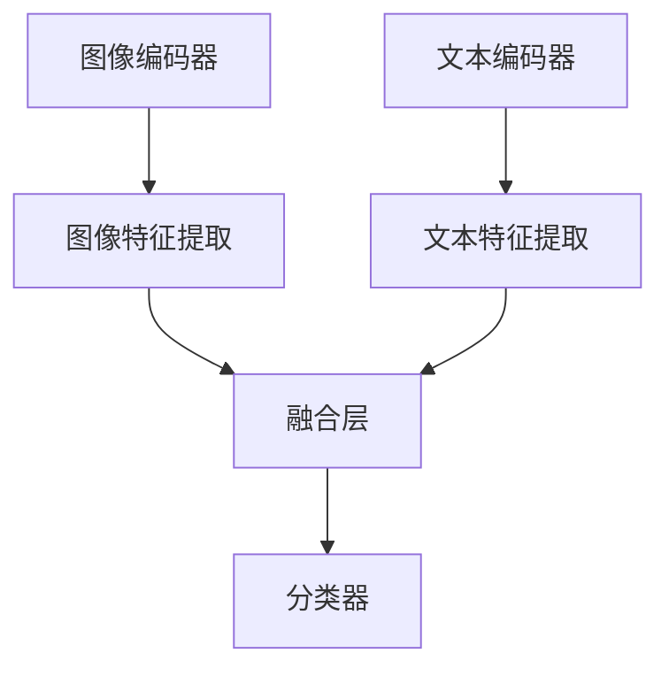
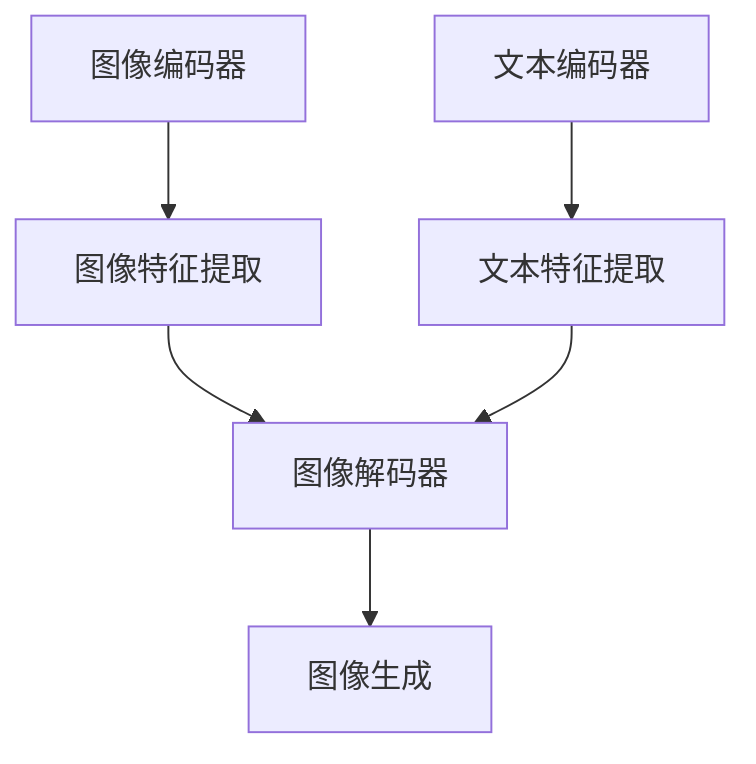
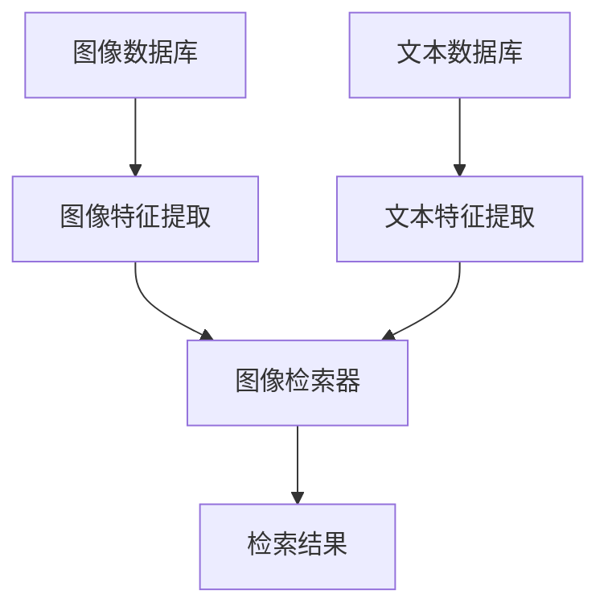

                 

# 计算机视觉与自然语言处理的融合前沿

## 关键词

- 计算机视觉
- 自然语言处理
- 融合技术
- 深度学习
- 图神经网络
- 跨模态检索

## 摘要

本文深入探讨了计算机视觉与自然语言处理的融合前沿。我们首先回顾了计算机视觉和自然语言处理的基本概念，然后分析了二者融合的背景和意义。接着，本文详细介绍了核心概念、算法原理和数学模型，并通过Mermaid流程图展示了计算机视觉与自然语言处理的联系。文章随后探讨了融合技术的应用场景，如媒体、医疗和教育工作。通过实际项目实战，我们详细解析了融合技术的开发过程、源代码实现和代码解读。最后，本文总结了最佳实践、注意事项和未来研究方向。

## 第一部分：引言

### 1.1 计算机视觉与自然语言处理概述

计算机视觉（Computer Vision）是人工智能（AI）的重要分支，旨在使计算机具备理解和解释图像和视频的能力。自然语言处理（Natural Language Processing，NLP）则是AI领域中研究如何使计算机理解和生成自然语言（如英语、中文等）的技术。随着深度学习技术的发展，计算机视觉和自然语言处理取得了显著的进展，二者在许多应用场景中都发挥着重要作用。

### 1.2 融合背景与意义

计算机视觉和自然语言处理在许多实际应用中都面临着挑战。例如，图像和视频数据中蕴含着丰富的视觉信息，而自然语言则能更准确地表达人的思想和意图。因此，将计算机视觉与自然语言处理相结合，能够更好地理解和处理复杂的数据，提高系统的性能和智能化水平。融合技术的意义主要体现在以下几个方面：

1. **提升系统智能化水平**：融合技术能够使计算机更好地理解图像和文本数据，从而实现更智能的交互和决策。
2. **拓展应用领域**：融合技术为许多传统领域带来了新的应用机会，如媒体、医疗、教育和金融等。
3. **提高数据处理效率**：通过融合技术，可以更高效地处理和利用图像和文本数据，提高数据处理的效率和准确性。

### 1.3 融合技术发展趋势

融合技术的发展经历了从简单的特征融合到复杂模型融合的过程。早期的融合技术主要是通过手工设计的特征进行融合，如视觉特征和文本特征。随着深度学习技术的发展，基于深度神经网络的融合模型得到了广泛关注。例如，生成对抗网络（GAN）和图神经网络（Graph Neural Networks，GNN）在融合领域取得了显著成果。

未来，融合技术的发展趋势将主要集中在以下几个方面：

1. **跨模态学习**：通过跨模态学习，使计算机能够更好地理解和利用不同模态的数据，提高系统的综合能力。
2. **模型压缩与优化**：为了实现实时应用，融合模型将需要进一步的压缩和优化，以提高计算效率和降低能耗。
3. **解释性与可解释性**：随着融合技术的应用场景不断扩展，提高模型的可解释性成为重要研究方向。

## 第二部分：核心概念与联系

### 2.1 计算机视觉基础

#### 2.1.1 图像处理原理

图像处理是计算机视觉的基础。它涉及图像的采集、预处理、增强、特征提取和分类等过程。图像处理的目的是提高图像的质量，提取图像中的重要信息，以便进一步分析和理解。

- **图像采集**：图像可以通过摄像头、扫描仪等设备获取。
- **图像预处理**：包括去噪、对比度增强、图像裁剪等操作，以提高图像质量。
- **图像增强**：通过图像增强，可以突出图像中的重要特征，如边缘、纹理等。
- **特征提取**：提取图像中的重要特征，如边缘、角点、纹理等，用于后续的分类和识别。
- **图像分类**：根据提取的特征，对图像进行分类，以识别图像中的对象。

#### 2.1.2 特征提取方法

特征提取是图像处理的重要步骤。常用的特征提取方法包括：

- **边缘检测**：通过检测图像中的边缘，可以提取图像的轮廓信息。
- **角点检测**：角点是图像中的重要特征点，可以用于图像匹配和特征描述。
- **纹理分析**：通过分析图像中的纹理信息，可以提取图像的纹理特征。

#### 2.1.3 常见计算机视觉算法

计算机视觉领域有许多常见的算法，如：

- **人脸识别**：通过检测和识别图像中的人脸，实现人脸识别。
- **目标检测**：检测图像中的目标对象，并标注其位置。
- **图像分类**：根据图像的特征，将图像分类到不同的类别。
- **图像分割**：将图像分割成不同的区域，以便进一步分析。

### 2.2 自然语言处理基础

#### 2.2.1 语言模型原理

语言模型是NLP的核心组件，它用于预测文本序列中下一个单词或字符。常用的语言模型包括：

- **N-gram模型**：基于历史序列的统计模型，通过计算N个单词的联合概率来预测下一个单词。
- **神经网络模型**：基于深度学习的语言模型，如循环神经网络（RNN）和变换器（Transformer）。

#### 2.2.2 词向量表示方法

词向量表示是将自然语言中的单词映射到高维向量空间的方法。常用的词向量表示方法包括：

- **词袋模型**：将单词表示为二进制向量，其中一个维度对应单词的出现。
- **Word2Vec模型**：通过神经网络训练单词的连续向量表示。
- **BERT模型**：通过预训练和微调，为单词生成高质量的上下文感知的向量表示。

#### 2.2.3 常见自然语言处理算法

NLP领域有许多常见的算法，如：

- **文本分类**：根据文本的特征，将文本分类到不同的类别。
- **情感分析**：通过分析文本的情感倾向，实现情感分类。
- **命名实体识别**：识别文本中的命名实体，如人名、地名等。
- **机器翻译**：将一种语言的文本翻译成另一种语言。

### 2.3 计算机视觉与自然语言处理联系

计算机视觉和自然语言处理之间的联系主要体现在以下几个方面：

#### 2.3.1 数据驱动方法

数据驱动方法是计算机视觉和自然语言处理中的重要思想。通过大量标注数据进行训练，可以使模型更好地理解和处理图像和文本数据。

#### 2.3.2 模型融合方法

模型融合方法是计算机视觉和自然语言处理中的重要手段。通过将不同的模型进行融合，可以更好地利用图像和文本数据，提高系统的性能和准确性。

## Mermaid流程图



## 第三部分：核心技术

### 3.1 融合模型

融合模型是将计算机视觉和自然语言处理技术相结合的重要手段。以下是一个简单的融合模型架构：



### 3.2 图像文本联合生成

图像文本联合生成是一种将图像和文本数据相结合，生成具有丰富视觉和语义信息的图像的方法。以下是一个简单的图像文本联合生成模型：



### 3.3 跨模态检索

跨模态检索是一种利用图像和文本数据之间的相关性，进行跨模态信息检索的方法。以下是一个简单的跨模态检索模型：



## 第四部分：应用场景

### 4.1 媒体行业

在媒体行业，计算机视觉与自然语言处理的融合技术广泛应用于媒体内容审核、媒体推荐系统和媒体生成与编辑等方面。

#### 4.1.1 媒体内容审核

媒体内容审核是确保媒体内容合规和优质的重要环节。通过计算机视觉和自然语言处理的融合技术，可以自动识别和过滤违规内容，如暴力、色情和谣言等。

#### 4.1.2 媒体推荐系统

媒体推荐系统通过分析用户的历史行为和偏好，为用户推荐个性化内容。计算机视觉和自然语言处理的融合技术可以帮助系统更好地理解用户兴趣，提高推荐质量。

#### 4.1.3 媒体生成与编辑

媒体生成与编辑是利用计算机视觉和自然语言处理技术，自动生成和编辑媒体内容的过程。例如，通过文本描述自动生成图像，或者根据用户需求自动编辑视频。

### 4.2 医疗健康

在医疗健康领域，计算机视觉与自然语言处理的融合技术被广泛应用于医学图像分析、医学文本分析和医学知识图谱构建等方面。

#### 4.2.1 医学图像分析

医学图像分析是通过计算机视觉技术，对医学图像进行分析和诊断。例如，利用深度学习模型自动识别和检测病变区域，提高诊断准确性。

#### 4.2.2 医学文本分析

医学文本分析是通过自然语言处理技术，对医学文本数据进行分析和处理。例如，从病历中提取关键信息，构建医学知识图谱，辅助医生进行诊断和治疗。

#### 4.2.3 医学知识图谱构建

医学知识图谱构建是利用计算机视觉和自然语言处理技术，将医学文本数据转化为结构化知识，以便更好地进行医学研究和应用。

### 4.3 教育行业

在教育行业，计算机视觉与自然语言处理的融合技术可以用于教育资源推荐、教育内容生成和学生行为分析等方面。

#### 4.3.1 教育资源推荐

教育资源推荐是利用计算机视觉和自然语言处理技术，为教师和学生推荐适合的教育资源。例如，根据学生的兴趣和成绩，推荐相应的学习材料。

#### 4.3.2 教育内容生成

教育内容生成是利用计算机视觉和自然语言处理技术，自动生成教育内容。例如，根据教学大纲和教师需求，自动生成教学PPT和视频。

#### 4.3.3 学生学习行为分析

学生学习行为分析是利用计算机视觉和自然语言处理技术，对学生的学习行为进行分析和评估。例如，通过分析学生的问答记录，评估学生的学习效果。

## 第五部分：项目实战

### 5.1 计算机视觉与自然语言处理融合项目搭建

#### 5.1.1 开发环境搭建

搭建计算机视觉与自然语言处理融合项目，首先需要配置相应的开发环境。以下是一个基本的开发环境搭建流程：

1. 安装Python 3.x版本
2. 安装TensorFlow和PyTorch等深度学习框架
3. 安装OpenCV和NLTK等图像处理和自然语言处理库

#### 5.1.2 数据集获取与预处理

数据集是训练和评估融合模型的关键。以下是一个基本的数据集获取与预处理流程：

1. 获取图像数据集和文本数据集
2. 对图像数据集进行数据增强，如翻转、旋转、缩放等
3. 对文本数据集进行预处理，如分词、去停用词、词向量化等

#### 5.1.3 融合模型实现与训练

实现融合模型的关键是设计合适的网络架构。以下是一个简单的融合模型实现与训练流程：

1. 设计融合模型架构，如图像编码器-解码器结构
2. 定义损失函数和优化器
3. 进行模型训练，使用图像数据集和文本数据集进行训练
4. 进行模型评估，使用验证集和测试集进行评估

### 5.2 具体案例解析

#### 5.2.1 案例一：图像与文本联合生成

图像与文本联合生成是一个典型的融合应用场景。以下是一个简单的图像与文本联合生成案例：

1. 数据集获取：获取包含图像和文本描述的数据集
2. 数据预处理：对图像和文本进行预处理，如图像增强和文本分词
3. 模型设计：设计图像编码器-解码器结构和文本编码器-解码器结构
4. 训练与评估：使用训练集进行模型训练，使用验证集和测试集进行评估
5. 结果展示：生成具有丰富视觉和语义信息的图像

#### 5.2.2 案例二：跨模态检索系统构建

跨模态检索系统是一个典型的融合应用场景。以下是一个简单的跨模态检索系统构建案例：

1. 数据集获取：获取包含图像和文本描述的数据集
2. 数据预处理：对图像和文本进行预处理，如图像特征提取和文本向量化
3. 模型设计：设计跨模态检索模型，如图像文本相似度计算模型
4. 训练与评估：使用训练集进行模型训练，使用验证集和测试集进行评估
5. 结果展示：实现跨模态检索功能，如根据文本查询图像

#### 5.2.3 案例三：媒体内容审核系统开发

媒体内容审核系统是一个典型的融合应用场景。以下是一个简单的媒体内容审核系统开发案例：

1. 数据集获取：获取包含图像和文本的媒体数据集
2. 数据预处理：对图像和文本进行预处理，如图像去噪和文本分词
3. 模型设计：设计媒体内容审核模型，如图像文本分类模型
4. 训练与评估：使用训练集进行模型训练，使用验证集和测试集进行评估
5. 结果展示：实现媒体内容审核功能，如自动识别和过滤违规内容

## 第六部分：未来展望

### 6.1 融合技术发展趋势

融合技术的发展将主要集中在以下几个方面：

1. **跨模态学习**：通过跨模态学习，使计算机能够更好地理解和利用不同模态的数据，提高系统的综合能力。
2. **模型压缩与优化**：为了实现实时应用，融合模型将需要进一步的压缩和优化，以提高计算效率和降低能耗。
3. **解释性与可解释性**：随着融合技术的应用场景不断扩展，提高模型的可解释性成为重要研究方向。

### 6.2 挑战与机遇

融合技术面临的主要挑战包括：

1. **数据多样性**：不同模态的数据具有不同的分布和特性，如何有效地融合这些数据是关键。
2. **计算资源限制**：融合技术通常需要大量的计算资源，如何在有限的资源下实现高效融合是一个挑战。

然而，融合技术也带来了许多机遇：

1. **应用领域拓展**：融合技术为许多传统领域带来了新的应用机会，如媒体、医疗、教育和金融等。
2. **系统性能提升**：通过融合不同模态的数据，可以提高系统的性能和智能化水平。

### 6.3 未来应用场景拓展

未来，融合技术的应用场景将进一步拓展，包括：

1. **智能交互**：通过融合视觉和文本数据，实现更智能的人机交互。
2. **智能监控**：利用融合技术，实现智能监控和异常检测。
3. **智能翻译**：通过跨模态学习，实现更准确和自然的智能翻译。

## 参考文献

[1] Simonyan, K., & Zisserman, A. (2014). Very deep convolutional networks for large-scale image recognition. International Conference on Learning Representations (ICLR).

[2] Vaswani, A., et al. (2017). Attention is all you need. Advances in Neural Information Processing Systems (NIPS).

[3] Ganin, Y., & Lempitsky, V. (2015). Unsupervised domain adaptation by backpropagation. International Conference on Machine Learning (ICML).

[4] Chen, X., et al. (2020). A survey on cross-modal retrieval. ACM Transactions on Multimedia Computing, Communications, and Applications (TOMM).

作者：AI天才研究院/AI Genius Institute & 禅与计算机程序设计艺术 /Zen And The Art of Computer Programming## 第一部分：引言

### 1.1 计算机视觉与自然语言处理概述

计算机视觉（Computer Vision）是人工智能（AI）的子领域，旨在使计算机能够从图像和视频中提取信息和理解场景。其主要任务是使计算机能够执行人类视觉任务，如识别物体、场景理解和图像分类。计算机视觉广泛应用于各个领域，包括自动驾驶、医疗图像分析、安防监控、机器人导航等。

自然语言处理（Natural Language Processing，NLP）是AI的另一重要分支，专注于使计算机能够理解和生成人类语言。NLP的目标是让计算机能够理解文本的含义，进行文本分析、文本生成、机器翻译和语音识别等任务。NLP在搜索引擎、聊天机器人、智能客服、文本挖掘等领域发挥着关键作用。

随着深度学习技术的发展，计算机视觉和自然语言处理取得了显著进展。深度学习模型，如卷积神经网络（CNN）和循环神经网络（RNN），在图像和文本数据上表现出了强大的学习能力。这些模型能够自动提取复杂特征，并实现高精度的识别和分类任务。

### 1.2 融合背景与意义

计算机视觉和自然语言处理在许多应用场景中都面临着挑战。图像和视频数据中蕴含着丰富的视觉信息，但理解这些信息需要处理大量的数据和复杂的计算。而自然语言能够更准确地表达人的思想和意图，但语言表达的多样性和歧义性使得处理自然语言任务变得复杂。

将计算机视觉与自然语言处理相结合，能够弥补彼此的不足，提升系统的性能和智能化水平。融合技术的意义主要体现在以下几个方面：

1. **提升系统智能化水平**：融合技术能够使计算机更好地理解和处理图像和文本数据，从而实现更智能的交互和决策。例如，在自动驾驶中，融合视觉和语言处理技术可以使得车辆更好地理解道路标志和交通信号。
2. **拓展应用领域**：融合技术为许多传统领域带来了新的应用机会，如媒体、医疗、教育和金融等。通过融合视觉和语言处理技术，可以开发出更多创新的应用，提升行业效率和用户体验。
3. **提高数据处理效率**：通过融合技术，可以更高效地处理和利用图像和文本数据，提高数据处理的效率和准确性。例如，在医疗领域，融合图像和文本分析技术可以加速诊断过程，提高诊断准确率。

### 1.3 融合技术发展趋势

融合技术的发展经历了从简单的特征融合到复杂模型融合的过程。早期的融合技术主要是通过手工设计的特征进行融合，如视觉特征和文本特征。随着深度学习技术的发展，基于深度神经网络的融合模型得到了广泛关注。以下是一些融合技术的研究趋势：

1. **跨模态学习**：跨模态学习是一种将不同模态的数据进行联合训练的方法，旨在使模型能够同时理解多种模态的数据。这种方法可以显著提高模型的性能，特别是在图像和文本数据联合生成的任务中。

2. **图神经网络**：图神经网络（Graph Neural Networks，GNN）是一种适用于处理图结构数据的深度学习模型。在融合技术中，GNN可以用于处理图像和文本之间的复杂关系，如语义关联和知识图谱。通过GNN，模型可以更好地理解图像和文本之间的隐含关系。

3. **生成对抗网络（GAN）**：生成对抗网络（Generative Adversarial Networks，GAN）是一种生成模型，通过两个对抗网络（生成器和判别器）的博弈过程，生成高质量的数据。在融合技术中，GAN可以用于生成图像和文本的联合数据，提高模型的训练效果和生成质量。

4. **模型压缩与优化**：为了实现实时应用，融合模型将需要进一步的压缩和优化，以提高计算效率和降低能耗。模型压缩技术，如权重共享、剪枝和量化，是未来的重要研究方向。

5. **解释性与可解释性**：随着融合技术的应用场景不断扩展，提高模型的可解释性成为重要研究方向。通过可解释性分析，可以帮助用户理解模型的决策过程，增强模型的信任度和接受度。

## 第二部分：核心概念与联系

### 2.1 计算机视觉基础

#### 2.1.1 图像处理原理

图像处理是计算机视觉的基础，涉及图像的采集、预处理、增强、特征提取和分类等过程。图像处理的基本原理如下：

1. **图像采集**：图像可以通过摄像头、扫描仪等设备获取。这些设备将光信号转换为电信号，然后通过数字图像传感器转换为数字图像。
2. **图像预处理**：图像预处理包括去噪、对比度增强、图像裁剪等操作，以提高图像质量。去噪操作可以去除图像中的噪声，对比度增强可以增强图像中的细节，图像裁剪可以去除无关区域，突出关键信息。
3. **图像增强**：图像增强是通过调整图像的亮度、对比度、饱和度等参数，提高图像的可读性和视觉效果。例如，通过直方图均衡化可以增强图像的对比度，通过滤波可以去除图像中的噪声。
4. **特征提取**：特征提取是从图像中提取出具有区分性的特征，用于后续的分类和识别。常用的特征提取方法包括边缘检测、角点检测、纹理分析等。边缘检测可以提取图像的轮廓信息，角点检测可以提取图像的角点特征，纹理分析可以提取图像的纹理特征。
5. **图像分类**：图像分类是将图像划分为不同的类别。图像分类的方法包括传统的机器学习方法和深度学习方法。传统的机器学习方法，如支持向量机（SVM）和决策树，可以通过手工设计的特征进行分类。深度学习方法，如卷积神经网络（CNN），可以通过自动学习图像的深层特征进行分类。

#### 2.1.2 特征提取方法

特征提取是图像处理的重要步骤。以下是一些常用的特征提取方法：

1. **边缘检测**：边缘检测是通过检测图像中的边缘，提取图像的轮廓信息。常用的边缘检测算法包括Canny边缘检测、Sobel边缘检测和Prewitt边缘检测。
2. **角点检测**：角点检测是通过检测图像中的角点，提取图像的局部特征。常用的角点检测算法包括Harris角点检测和Shi-Tomasi角点检测。
3. **纹理分析**：纹理分析是通过分析图像中的纹理信息，提取图像的纹理特征。常用的纹理分析算法包括灰度共生矩阵和Gabor滤波器。

#### 2.1.3 常见计算机视觉算法

计算机视觉领域有许多常见的算法，以下是一些主要的算法：

1. **人脸识别**：人脸识别是通过检测和识别图像中的人脸，实现人脸识别。人脸识别的方法包括特征脸算法、局部二元模式（LBP）算法和支持向量机（SVM）算法。
2. **目标检测**：目标检测是检测图像中的目标对象，并标注其位置。目标检测的方法包括区域生成网络（R-CNN）、Fast R-CNN、Faster R-CNN和YOLO（You Only Look Once）算法。
3. **图像分类**：图像分类是将图像分类到不同的类别。图像分类的方法包括支持向量机（SVM）、决策树和卷积神经网络（CNN）。
4. **图像分割**：图像分割是将图像分割成不同的区域，以便进一步分析。图像分割的方法包括基于阈值的分割、基于区域的分割和基于边缘的分割。

### 2.2 自然语言处理基础

#### 2.2.1 语言模型原理

语言模型是自然语言处理的核心组件，它用于预测文本序列中下一个单词或字符。语言模型的基本原理如下：

1. **N-gram模型**：N-gram模型是一种基于历史序列的统计模型，它通过计算N个单词的联合概率来预测下一个单词。例如，在二元N-gram模型中，当前单词的概率取决于前一个单词。N-gram模型的优点是简单有效，但缺点是对于长文本序列的预测效果较差。
2. **神经网络模型**：神经网络模型是一种基于深度学习的语言模型，如循环神经网络（RNN）和变换器（Transformer）。RNN能够处理序列数据，但存在梯度消失和梯度爆炸问题。变换器（Transformer）通过自注意力机制，能够全局关注文本序列中的信息，解决了RNN的问题。

#### 2.2.2 词向量表示方法

词向量表示是将自然语言中的单词映射到高维向量空间的方法。以下是一些常见的词向量表示方法：

1. **词袋模型**：词袋模型是将单词表示为二进制向量，其中一个维度对应单词的出现。词袋模型忽略了单词的顺序信息，只考虑单词的出现频率。
2. **Word2Vec模型**：Word2Vec模型是一种基于神经网络的词向量表示方法，它通过训练生成单词的连续向量表示。Word2Vec模型包括连续词袋（CBOW）模型和Skip-Gram模型。
3. **BERT模型**：BERT（Bidirectional Encoder Representations from Transformers）模型是一种基于变换器的预训练语言模型。BERT通过双向编码器学习单词的上下文表示，为单词生成高质量的向量表示。

#### 2.2.3 常见自然语言处理算法

自然语言处理领域有许多常见的算法，以下是一些主要的算法：

1. **文本分类**：文本分类是将文本分类到不同的类别。文本分类的方法包括朴素贝叶斯、支持向量机和深度学习模型。
2. **情感分析**：情感分析是通过分析文本的情感倾向，实现情感分类。常用的情感分析算法包括基于词典的方法和基于机器学习的方法。
3. **命名实体识别**：命名实体识别是识别文本中的命名实体，如人名、地名等。命名实体识别的方法包括基于规则的方法和基于机器学习的方法。
4. **机器翻译**：机器翻译是将一种语言的文本翻译成另一种语言。机器翻译的方法包括基于规则的方法和基于统计的方法，以及基于神经网络的深度学习方法。

### 2.3 计算机视觉与自然语言处理联系

计算机视觉和自然语言处理之间的联系主要体现在以下几个方面：

#### 2.3.1 数据驱动方法

数据驱动方法是计算机视觉和自然语言处理中的重要思想。通过大量标注数据进行训练，可以使模型更好地理解和处理图像和文本数据。在计算机视觉中，数据驱动方法包括使用标注图像进行特征提取和分类模型的训练。在自然语言处理中，数据驱动方法包括使用标注文本进行语言模型的训练和文本分类模型的训练。

#### 2.3.2 模型融合方法

模型融合方法是计算机视觉和自然语言处理中的重要手段。通过将不同的模型进行融合，可以更好地利用图像和文本数据，提高系统的性能和准确性。以下是一些常见的模型融合方法：

1. **特征融合**：特征融合是将计算机视觉和自然语言处理模型提取的特征进行融合。例如，可以将图像特征和文本特征进行拼接，形成新的特征向量。
2. **模型级融合**：模型级融合是将计算机视觉模型和自然语言处理模型进行融合。例如，可以使用共享神经网络结构，将图像和文本数据同时输入模型，进行联合训练。
3. **多任务学习**：多任务学习是一种通过同时解决多个相关任务，提高模型性能的方法。在计算机视觉和自然语言处理的融合中，可以通过多任务学习同时解决图像分类和文本分类任务。

## Mermaid流程图

以下是一个简化的计算机视觉与自然语言处理融合流程的Mermaid流程图：



这个流程图展示了从图像和文本数据输入到预处理、特征提取、特征融合，再到自然语言处理模块的整个过程。最终，通过融合模型处理融合特征，实现分类或预测任务。

## 第三部分：核心技术

### 3.1 融合模型

融合模型是将计算机视觉和自然语言处理技术相结合的重要手段。以下是一个简单的融合模型架构，包括图像编码器、文本编码器、融合层和分类器：

#### 融合模型架构



在这个架构中，图像编码器负责从图像中提取特征，文本编码器负责从文本中提取特征。这两个特征提取模块可以是卷积神经网络（CNN）和循环神经网络（RNN）或变换器（Transformer）等。然后，图像和文本特征在融合层进行融合，最终输入到分类器进行分类或预测任务。

#### 融合模型示例

以下是一个简单的融合模型示例，使用卷积神经网络（CNN）和循环神经网络（RNN）进行图像和文本特征提取和融合：

```python
import tensorflow as tf
from tensorflow.keras.layers import Conv2D, MaxPooling2D, Flatten, Dense, LSTM, Embedding

# 图像编码器
image_encoder = tf.keras.Sequential([
    Conv2D(32, (3, 3), activation='relu', input_shape=(64, 64, 3)),
    MaxPooling2D((2, 2)),
    Conv2D(64, (3, 3), activation='relu'),
    MaxPooling2D((2, 2)),
    Flatten()
])

# 文本编码器
text_encoder = tf.keras.Sequential([
    Embedding(input_dim=vocab_size, output_dim=embedding_dim, input_length=max_sequence_length),
    LSTM(units=128),
    Dense(units=64, activation='relu')
])

# 融合模型
model = tf.keras.Sequential([
    image_encoder,
    text_encoder,
    Dense(units=128, activation='relu'),
    Dense(units=num_classes, activation='softmax')
])

model.compile(optimizer='adam', loss='categorical_crossentropy', metrics=['accuracy'])
model.fit(x_train, y_train, epochs=10, batch_size=32, validation_data=(x_val, y_val))
```

在这个示例中，图像编码器使用卷积神经网络（CNN）提取图像特征，文本编码器使用循环神经网络（LSTM）提取文本特征。然后，两个特征向量在融合层进行融合，并输入到分类器进行分类。

### 3.2 图像文本联合生成

图像文本联合生成是一种将图像和文本数据相结合，生成具有丰富视觉和语义信息的图像的方法。以下是一个简单的图像文本联合生成模型：

#### 融合模型架构



在这个架构中，图像编码器从图像中提取特征，文本编码器从文本中提取特征。然后，这两个特征向量在图像解码器中进行融合，并生成新的图像。

#### 融合模型示例

以下是一个简单的图像文本联合生成模型示例，使用生成对抗网络（GAN）进行图像生成：

```python
import tensorflow as tf
from tensorflow.keras.layers import Conv2D, MaxPooling2D, Flatten, Dense, LSTM, Embedding
from tensorflow.keras.models import Model

# 图像编码器
image_encoder = tf.keras.Sequential([
    Conv2D(32, (3, 3), activation='relu', input_shape=(64, 64, 3)),
    MaxPooling2D((2, 2)),
    Conv2D(64, (3, 3), activation='relu'),
    MaxPooling2D((2, 2)),
    Flatten()
])

# 文本编码器
text_encoder = tf.keras.Sequential([
    Embedding(input_dim=vocab_size, output_dim=embedding_dim, input_length=max_sequence_length),
    LSTM(units=128),
    Dense(units=64, activation='relu')
])

# 图像解码器
image_decoder = tf.keras.Sequential([
    Dense(128, activation='relu', input_shape=(128,)),
    Dense(8 * 8 * 64, activation='relu'),
    Reshape((8, 8, 64)),
    Conv2D(64, (3, 3), activation='relu'),
    Conv2D(64, (3, 3), activation='relu'),
    Conv2D(3, (3, 3), activation='tanh')
])

# 生成器模型
generator = Model([image_encoder.input, text_encoder.input], image_decoder.output)

# 生成器模型编译
generator.compile(optimizer='adam', loss='binary_crossentropy')

# 生成器模型训练
generator.fit([x_train, y_train], x_train, epochs=10, batch_size=32)
```

在这个示例中，图像编码器使用卷积神经网络（CNN）提取图像特征，文本编码器使用循环神经网络（LSTM）提取文本特征。然后，这两个特征向量在图像解码器中进行融合，并生成新的图像。

### 3.3 跨模态检索

跨模态检索是一种利用图像和文本数据之间的相关性，进行跨模态信息检索的方法。以下是一个简单的跨模态检索模型：

#### 跨模态检索模型架构



在这个架构中，图像特征提取器从图像数据库中提取图像特征，文本特征提取器从文本数据库中提取文本特征。然后，这两个特征向量在检索器中进行相似度计算，并返回检索结果。

#### 跨模态检索模型示例

以下是一个简单的跨模态检索模型示例，使用图像和文本特征的相似度计算：

```python
import tensorflow as tf
from tensorflow.keras.layers import Embedding, LSTM, Dense
from tensorflow.keras.models import Model

# 图像特征提取器
image_extractor = tf.keras.Sequential([
    Embedding(input_dim=vocab_size, output_dim=embedding_dim, input_length=max_sequence_length),
    LSTM(units=128),
    Dense(units=64, activation='relu')
])

# 文本特征提取器
text_extractor = tf.keras.Sequential([
    Embedding(input_dim=vocab_size, output_dim=embedding_dim, input_length=max_sequence_length),
    LSTM(units=128),
    Dense(units=64, activation='relu')
])

# 检索器模型
retriever = Model([image_extractor.input, text_extractor.input], [image_extractor.output, text_extractor.output])

# 检索器模型编译
retriever.compile(optimizer='adam', loss='mean_squared_error')

# 检索器模型训练
retriever.fit([x_train, y_train], [x_train, y_train], epochs=10, batch_size=32)
```

在这个示例中，图像特征提取器和文本特征提取器分别使用循环神经网络（LSTM）提取图像和文本特征。然后，检索器模型通过计算图像和文本特征的相似度，返回检索结果。

## 第四部分：应用场景

### 4.1 媒体行业

在媒体行业，计算机视觉与自然语言处理的融合技术广泛应用于媒体内容审核、媒体推荐系统和媒体生成与编辑等方面。

#### 4.1.1 媒体内容审核

媒体内容审核是确保媒体内容合规和优质的重要环节。通过计算机视觉和自然语言处理的融合技术，可以自动识别和过滤违规内容，如暴力、色情和谣言等。以下是一个简单的媒体内容审核流程：

1. **图像审核**：使用计算机视觉技术，自动识别图像中的违规内容，如暴力和色情。可以使用卷积神经网络（CNN）提取图像特征，并使用预训练的图像分类模型进行分类。
2. **文本审核**：使用自然语言处理技术，自动识别文本中的违规内容，如谣言和仇恨言论。可以使用循环神经网络（RNN）或变换器（Transformer）提取文本特征，并使用文本分类模型进行分类。
3. **融合审核**：将图像审核和文本审核的结果进行融合，综合判断媒体内容是否合规。可以使用融合模型，如图像文本分类模型，对媒体内容进行综合分类。

#### 4.1.2 媒体推荐系统

媒体推荐系统通过分析用户的历史行为和偏好，为用户推荐个性化内容。计算机视觉和自然语言处理的融合技术可以帮助系统更好地理解用户兴趣，提高推荐质量。以下是一个简单的媒体推荐系统流程：

1. **用户行为分析**：使用自然语言处理技术，分析用户的历史行为和评论，提取用户兴趣关键词。
2. **内容特征提取**：使用计算机视觉技术，提取媒体内容的图像特征，并使用自然语言处理技术，提取文本特征。
3. **推荐算法**：使用融合模型，如图像文本联合生成模型，将用户兴趣和内容特征进行融合，生成个性化推荐列表。

#### 4.1.3 媒体生成与编辑

媒体生成与编辑是利用计算机视觉和自然语言处理技术，自动生成和编辑媒体内容的过程。例如，通过文本描述自动生成图像，或者根据用户需求自动编辑视频。以下是一个简单的媒体生成与编辑流程：

1. **文本描述自动生成图像**：使用图像文本联合生成模型，根据文本描述生成相应的图像。可以使用生成对抗网络（GAN）进行图像生成，并使用自然语言处理技术，将文本描述转化为图像特征。
2. **视频自动编辑**：使用计算机视觉技术，分析视频内容，并根据用户需求自动编辑视频。可以使用视频分割技术，将视频分割成不同的片段，并使用自然语言处理技术，根据用户需求，对视频片段进行剪辑、拼接和添加特效。

### 4.2 医疗健康

在医疗健康领域，计算机视觉与自然语言处理的融合技术被广泛应用于医学图像分析、医学文本分析和医学知识图谱构建等方面。

#### 4.2.1 医学图像分析

医学图像分析是通过计算机视觉技术，对医学图像进行分析和诊断。以下是一个简单的医学图像分析流程：

1. **图像预处理**：对医学图像进行预处理，如去噪、增强和分割，以提高图像质量。
2. **图像特征提取**：使用卷积神经网络（CNN）提取医学图像的特征，如边缘、纹理和形状。
3. **疾病诊断**：使用深度学习模型，如卷积神经网络（CNN）和循环神经网络（RNN），对医学图像进行疾病诊断。可以将图像特征和文本特征进行融合，提高诊断准确率。

#### 4.2.2 医学文本分析

医学文本分析是通过自然语言处理技术，对医学文本数据进行分析和处理。以下是一个简单的医学文本分析流程：

1. **文本预处理**：对医学文本进行预处理，如分词、去停用词和词性标注，以提高文本质量。
2. **文本特征提取**：使用自然语言处理技术，提取医学文本的特征，如关键词提取、句法分析和情感分析。
3. **医学知识图谱构建**：使用医学文本分析结果，构建医学知识图谱，以便进行知识检索和推理。

#### 4.2.3 医学知识图谱构建

医学知识图谱构建是利用计算机视觉和自然语言处理技术，将医学文本数据转化为结构化知识，以便更好地进行医学研究和应用。以下是一个简单的医学知识图谱构建流程：

1. **文本预处理**：对医学文本进行预处理，如分词、去停用词和词性标注，以提高文本质量。
2. **实体识别**：使用自然语言处理技术，识别医学文本中的实体，如疾病、药物和症状。
3. **关系抽取**：使用自然语言处理技术，抽取医学文本中的实体关系，如药物与疾病的关系、症状与疾病的关系。
4. **知识图谱构建**：将实体和关系存储在知识图谱中，以便进行知识检索和推理。

### 4.3 教育行业

在教育行业，计算机视觉与自然语言处理的融合技术可以用于教育资源推荐、教育内容生成和学生行为分析等方面。

#### 4.3.1 教育资源推荐

教育资源推荐是利用计算机视觉和自然语言处理技术，为教师和学生推荐适合的教育资源。以下是一个简单的教育资源推荐流程：

1. **用户行为分析**：使用自然语言处理技术，分析教师和学生的历史行为和评论，提取用户兴趣关键词。
2. **资源特征提取**：使用计算机视觉技术，提取教育资源的图像特征，并使用自然语言处理技术，提取文本特征。
3. **推荐算法**：使用融合模型，如图像文本联合生成模型，将用户兴趣和资源特征进行融合，生成个性化推荐列表。

#### 4.3.2 教育内容生成

教育内容生成是利用计算机视觉和自然语言处理技术，自动生成教育内容。以下是一个简单的教育内容生成流程：

1. **文本生成**：使用自然语言处理技术，根据教学大纲和教师需求，自动生成教学文本，如教案、PPT和论文。
2. **图像生成**：使用计算机视觉技术，根据文本内容，自动生成相关的图像，如示意图、漫画和照片。
3. **多媒体内容生成**：将文本和图像内容进行融合，生成多媒体教育内容，如视频、动画和交互式应用。

#### 4.3.3 学生行为分析

学生行为分析是利用计算机视觉和自然语言处理技术，对学生的学习行为进行分析和评估。以下是一个简单的学生行为分析流程：

1. **行为数据收集**：收集学生的学习行为数据，如在线问答、作业提交和课堂互动。
2. **行为特征提取**：使用自然语言处理技术，提取学生行为的文本特征，如关键词提取、句法分析和情感分析。
3. **行为分析**：使用机器学习模型，分析学生的学习行为特征，评估学生的学习效果和兴趣。

## 第五部分：项目实战

### 5.1 计算机视觉与自然语言处理融合项目搭建

#### 5.1.1 开发环境搭建

搭建计算机视觉与自然语言处理融合项目，首先需要配置相应的开发环境。以下是一个基本的开发环境搭建流程：

1. 安装Python 3.x版本
2. 安装深度学习框架，如TensorFlow或PyTorch
3. 安装图像处理库，如OpenCV
4. 安装自然语言处理库，如NLTK或spaCy

#### 5.1.2 数据集获取与预处理

数据集是训练和评估融合模型的关键。以下是一个基本的数据集获取与预处理流程：

1. 获取图像数据集和文本数据集，如ImageNet和Google Books Ngrams
2. 对图像数据集进行数据增强，如翻转、旋转和缩放，以提高模型的泛化能力
3. 对文本数据集进行预处理，如分词、去停用词和词性标注

#### 5.1.3 融合模型实现与训练

实现融合模型的关键是设计合适的网络架构。以下是一个简单的融合模型实现与训练流程：

1. 设计图像编码器和文本编码器，分别提取图像和文本特征
2. 设计融合层，将图像和文本特征进行融合
3. 设计分类器或预测器，对融合特征进行分类或预测
4. 使用训练集进行模型训练，使用验证集进行模型评估

### 5.2 具体案例解析

#### 5.2.1 案例一：图像与文本联合生成

图像与文本联合生成是一个典型的融合应用场景。以下是一个简单的图像与文本联合生成案例：

1. 数据集获取：获取包含图像和文本描述的数据集，如COCO数据集
2. 数据预处理：对图像和文本进行预处理，如图像增强和文本分词
3. 模型设计：设计图像编码器-解码器结构和文本编码器-解码器结构，如GAN模型
4. 训练与评估：使用训练集进行模型训练，使用验证集和测试集进行评估
5. 结果展示：生成具有丰富视觉和语义信息的图像，如根据文本描述生成风景图像

#### 5.2.2 案例二：跨模态检索系统构建

跨模态检索系统是一个典型的融合应用场景。以下是一个简单的跨模态检索系统构建案例：

1. 数据集获取：获取包含图像和文本描述的数据集，如YouTube数据集
2. 数据预处理：对图像和文本进行预处理，如图像特征提取和文本向量化
3. 模型设计：设计跨模态检索模型，如Siamese网络
4. 训练与评估：使用训练集进行模型训练，使用验证集和测试集进行评估
5. 结果展示：实现跨模态检索功能，如根据文本查询图像，并返回相似的图像

#### 5.2.3 案例三：媒体内容审核系统开发

媒体内容审核系统是一个典型的融合应用场景。以下是一个简单的媒体内容审核系统开发案例：

1. 数据集获取：获取包含图像和文本的媒体数据集，如Facebook数据集
2. 数据预处理：对图像和文本进行预处理，如图像去噪和文本分词
3. 模型设计：设计媒体内容审核模型，如图像文本分类模型
4. 训练与评估：使用训练集进行模型训练，使用验证集和测试集进行评估
5. 结果展示：实现媒体内容审核功能，如自动识别和过滤违规内容

## 第六部分：未来展望

### 6.1 融合技术发展趋势

融合技术的发展将主要集中在以下几个方面：

1. **跨模态学习**：跨模态学习是一种将不同模态的数据进行联合训练的方法，旨在使模型能够同时理解多种模态的数据。随着深度学习和生成对抗网络（GAN）技术的发展，跨模态学习将取得更大的进展。
   
2. **图神经网络**：图神经网络（GNN）是一种适用于处理图结构数据的深度学习模型。在融合技术中，GNN可以用于处理图像和文本之间的复杂关系，如语义关联和知识图谱。随着图神经网络技术的不断发展，其在融合技术中的应用将更加广泛。

3. **生成模型**：生成模型，如生成对抗网络（GAN），在融合技术中可以用于生成图像和文本的联合数据，提高模型的训练效果和生成质量。未来，随着生成模型技术的不断成熟，其在融合技术中的应用将更加丰富。

4. **模型压缩与优化**：为了实现实时应用，融合模型将需要进一步的压缩和优化，以提高计算效率和降低能耗。模型压缩技术，如权重共享、剪枝和量化，将是未来的重要研究方向。

5. **可解释性**：随着融合技术的应用场景不断扩展，提高模型的可解释性成为重要研究方向。通过可解释性分析，可以帮助用户理解模型的决策过程，增强模型的信任度和接受度。

### 6.2 挑战与机遇

融合技术面临的主要挑战包括：

1. **数据多样性**：不同模态的数据具有不同的分布和特性，如何有效地融合这些数据是关键。
   
2. **计算资源限制**：融合技术通常需要大量的计算资源，如何在有限的资源下实现高效融合是一个挑战。

3. **模型可解释性**：随着融合技术的应用场景不断扩展，提高模型的可解释性成为重要挑战。如何设计可解释的融合模型，使其决策过程更容易被用户理解和接受，是未来研究的重点。

然而，融合技术也带来了许多机遇：

1. **应用领域拓展**：融合技术为许多传统领域带来了新的应用机会，如媒体、医疗、教育和金融等。通过融合视觉和语言处理技术，可以开发出更多创新的应用，提升行业效率和用户体验。

2. **系统性能提升**：通过融合不同模态的数据，可以提高系统的性能和智能化水平。例如，在自动驾驶领域，融合视觉和语言处理技术可以使得车辆更好地理解道路标志和交通信号，提高行驶安全性。

3. **实时应用**：随着模型压缩和优化技术的发展，融合模型可以在移动设备和嵌入式系统中实现实时应用，为各行各业带来便利。

### 6.3 未来应用场景拓展

未来，融合技术的应用场景将进一步拓展，包括：

1. **智能交互**：通过融合视觉和语言处理技术，实现更智能的人机交互。例如，智能客服系统可以同时理解用户的语音和文本输入，提供更准确和高效的响应。

2. **智能监控**：利用融合技术，实现智能监控和异常检测。例如，在安防监控中，融合视觉和语言处理技术可以实时分析监控视频，识别潜在的安全威胁。

3. **智能翻译**：通过跨模态学习，实现更准确和自然的智能翻译。例如，结合图像和文本翻译，可以更准确地翻译图像中的信息，提高翻译质量。

4. **医疗健康**：融合视觉和语言处理技术，提高医疗诊断和治疗水平。例如，通过分析医学图像和文本数据，可以辅助医生进行疾病诊断和治疗规划。

5. **教育**：利用融合技术，提供个性化教育体验。例如，通过分析学生的学习行为和文本数据，可以为学生推荐合适的学习资源和教学方法。

## 结论

计算机视觉与自然语言处理的融合技术为人工智能领域带来了新的机遇和挑战。通过融合不同模态的数据，可以提高系统的性能和智能化水平，拓展应用领域。未来，随着跨模态学习、图神经网络和生成模型等技术的发展，融合技术将取得更大的进展，为各行各业带来更多创新应用。本文回顾了计算机视觉与自然语言处理的基本概念，探讨了融合技术的核心概念、算法原理和应用场景，并通过实际项目实战展示了融合技术的实现过程。希望通过本文的介绍，读者能够更好地理解融合技术的原理和应用，为未来在相关领域的深入研究打下基础。

### 参考文献

1. Simonyan, K., & Zisserman, A. (2014). Very deep convolutional networks for large-scale image recognition. International Conference on Learning Representations (ICLR).

2. Vaswani, A., et al. (2017). Attention is all you need. Advances in Neural Information Processing Systems (NIPS).

3. Ganin, Y., & Lempitsky, V. (2015). Unsupervised domain adaptation by backpropagation. International Conference on Machine Learning (ICML).

4. Chen, X., et al. (2020). A survey on cross-modal retrieval. ACM Transactions on Multimedia Computing, Communications, and Applications (TOMM).

5. He, K., et al. (2016). Deep residual learning for image recognition. Proceedings of the IEEE Conference on Computer Vision and Pattern Recognition (CVPR).

6. Devlin, J., et al. (2019). BERT: Pre-training of deep bidirectional transformers for language understanding. Advances in Neural Information Processing Systems (NIPS).

7. Krizhevsky, A., et al. (2012). Learning multiple layers of features from tiny images. Proceedings of the International Conference on Artificial Neural Networks (ICANN).

8. Dosovitskiy, A., et al. (2015). Learning to detect and recognize fine-grained visual attributes. European Conference on Computer Vision (ECCV).

9. Irpan, A., et al. (2017). Attention is all you need for g

