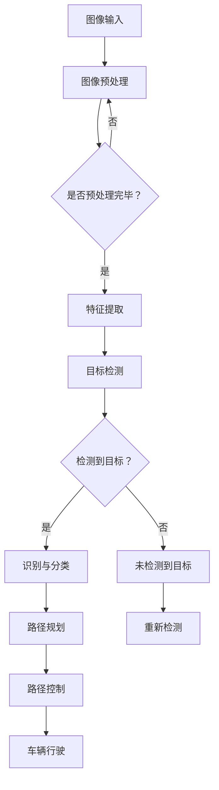

                 

### 文章标题

《计算机视觉在自动驾驶中的应用与挑战》

### 关键词

- 计算机视觉
- 自动驾驶
- 应用实例
- 挑战分析
- 深度学习
- 算法原理

### 摘要

本文旨在探讨计算机视觉在自动驾驶领域的应用与挑战。首先，我们介绍了计算机视觉的基础知识和自动驾驶的概述，然后深入分析了计算机视觉在自动驾驶中的应用，包括监控环境、识别交通标志和路线规划。接着，我们讨论了深度学习在自动驾驶计算机视觉中的应用，以及面临的遮挡与光照问题、高速行驶环境下的视觉感知和数据集与标注问题。最后，我们展望了自动驾驶计算机视觉的未来发展趋势，并提供了相关的实战案例和最佳实践 tips。通过本文，读者可以全面了解计算机视觉在自动驾驶中的应用现状、挑战及未来方向。

## 背景介绍

### 计算机视觉

计算机视觉是人工智能领域的一个重要分支，旨在使计算机具备从图像或视频中提取、分析和理解信息的能力。计算机视觉的应用范围广泛，包括人脸识别、物体检测、图像分割、图像增强、图像恢复、自动驾驶等。近年来，随着深度学习技术的飞速发展，计算机视觉取得了显著的进步，实现了从传统图像处理到智能图像分析的重大跨越。

计算机视觉的基本原理包括图像处理、特征提取、目标检测、识别与分类等。图像处理是对原始图像进行预处理，如滤波、边缘检测、图像增强等，以提高图像质量。特征提取是从图像中提取出具有代表性的特征，如边缘、角点、纹理等，用于后续的目标识别。目标检测是确定图像中的目标位置和类别，如车辆、行人、交通标志等。识别与分类是将检测到的目标与已知的类别进行匹配，以识别出具体的目标。

### 自动驾驶

自动驾驶是汽车工业和人工智能领域的一个前沿研究方向，旨在实现车辆在无需人工干预的情况下，自动完成驾驶任务。自动驾驶技术的发展经历了多个阶段，从最初的辅助驾驶到半自动驾驶，再到全自动驾驶。自动驾驶系统的核心是传感器融合、环境感知、路径规划和控制。

自动驾驶系统的环境感知主要通过传感器实现，包括激光雷达（LiDAR）、摄像头、毫米波雷达、超声波传感器等。激光雷达通过发射激光束并测量其反射时间来获取周围环境的3D点云数据，摄像头用于获取车辆周围的视觉信息，毫米波雷达用于探测车辆周围的物体，超声波传感器主要用于短距离物体检测。

路径规划是自动驾驶系统的核心任务之一，其目标是根据车辆当前的状态和目标位置，生成一条最优行驶路径。路径规划需要考虑道路环境、交通状况、车辆性能等因素。常见的路径规划算法包括基于采样的RRT（快速随机树）算法、A*算法、Dijkstra算法等。

控制是自动驾驶系统的执行部分，通过控制车辆的动力系统、转向系统、制动系统等，使车辆按照规划的路径行驶。自动驾驶控制需要实时响应环境变化，具备较强的鲁棒性和适应性。

### 计算机视觉在自动驾驶中的应用

计算机视觉在自动驾驶中的应用非常广泛，主要包括以下方面：

1. **环境感知**：计算机视觉用于获取车辆周围的环境信息，包括道路、交通标志、行人、车辆等。通过图像处理和特征提取技术，可以实现对道路的识别、交通标志的检测和识别、行人和车辆的跟踪等。

2. **交通标志检测与识别**：交通标志是自动驾驶车辆进行道路决策的重要信息来源。计算机视觉可以通过图像处理技术检测并识别交通标志，如速度限制、禁止通行、让行等。

3. **行人检测与跟踪**：行人检测和跟踪是自动驾驶车辆安全行驶的重要保障。通过计算机视觉技术，可以实现对行人的实时检测和跟踪，从而提前预警和避让。

4. **车道线检测与保持**：车道线检测和保持是自动驾驶车辆行驶的基础。计算机视觉可以通过图像处理技术检测车道线，并控制车辆保持在车道内行驶。

5. **路线规划与控制**：计算机视觉可以用于辅助自动驾驶车辆的路径规划和控制。通过实时感知环境信息，计算机视觉可以为自动驾驶车辆提供更加准确和实时的路线规划与控制策略。

### 自动驾驶计算机视觉的挑战

尽管计算机视觉在自动驾驶领域具有广泛的应用前景，但也面临一些严峻的挑战：

1. **遮挡与光照问题**：车辆周围环境复杂多变，常常存在遮挡和光照变化的问题。如何有效处理遮挡和光照问题，提高计算机视觉系统的鲁棒性，是一个重要的挑战。

2. **高速行驶环境下的视觉感知**：在高速行驶的环境下，计算机视觉系统需要具备更高的实时性和准确性。如何提高计算机视觉系统在高速行驶环境下的性能，是一个亟待解决的问题。

3. **数据集与标注问题**：自动驾驶计算机视觉系统需要大量的高质量数据集进行训练和验证。然而，获取和标注高质量数据集是一个耗时的过程，且数据标注的质量直接影响模型的性能。

4. **算法优化与效率**：随着自动驾驶系统对计算机视觉系统的要求越来越高，如何优化算法性能，提高计算效率，成为一个重要的研究方向。

## 核心概念与联系

在探讨计算机视觉在自动驾驶中的应用与挑战时，我们需要理解以下几个核心概念及其相互关系：

1. **图像处理**：图像处理是计算机视觉的基础，包括图像滤波、边缘检测、图像增强等，用于提高图像质量，为后续的特征提取和目标检测提供高质量的输入数据。

2. **特征提取**：特征提取是从图像中提取具有代表性的特征，如边缘、角点、纹理等。这些特征用于描述图像中的物体和场景，为后续的目标检测和识别提供依据。

3. **目标检测**：目标检测是在图像中定位并识别出特定的目标，如车辆、行人、交通标志等。目标检测是实现自动驾驶环境感知的关键技术。

4. **识别与分类**：识别与分类是将检测到的目标与已知的类别进行匹配，以识别出具体的目标。在自动驾驶中，识别与分类技术用于识别交通标志、行人和车道线等。

5. **路径规划与控制**：路径规划和控制是自动驾驶系统的核心任务，通过实时感知环境信息，规划出最优的行驶路径，并控制车辆按照路径行驶。

### Mermaid 流程图

以下是一个简化的Mermaid流程图，展示了计算机视觉在自动驾驶中的应用流程：



### 关键算法原理讲解

为了深入理解计算机视觉在自动驾驶中的应用，我们需要介绍一些关键算法的原理，包括图像预处理、特征提取、目标检测和路径规划。

#### 图像预处理

图像预处理是计算机视觉的第一步，其目的是提高图像质量，为后续的特征提取和目标检测提供高质量的输入数据。常用的图像预处理方法包括：

1. **图像滤波**：通过滤波器去除图像中的噪声，常用的滤波器有均值滤波、高斯滤波和中值滤波。
2. **边缘检测**：通过检测图像中的边缘，提取出图像中的轮廓信息，常用的边缘检测算法有Canny算法和Sobel算法。
3. **图像增强**：通过调整图像的亮度、对比度和色彩平衡，提高图像的视觉效果，常用的图像增强方法有直方图均衡化和对比度增强。

#### 特征提取

特征提取是从图像中提取出具有代表性的特征，用于描述图像中的物体和场景。常用的特征提取方法包括：

1. **HOG（Histogram of Oriented Gradients）**：通过计算图像中每个像素点的梯度方向和幅度，生成直方图，用于描述图像中的方向特征。
2. **SIFT（Scale-Invariant Feature Transform）**：通过检测和描述图像中的关键点，实现图像的局部特征匹配，具有尺度不变性和旋转不变性。
3. **ORB（Oriented FAST and Rotated BRIEF）**：结合了HOG和SIFT的优点，实现了更快的特征提取和匹配。

#### 目标检测

目标检测是在图像中定位并识别出特定的目标，如车辆、行人、交通标志等。常用的目标检测算法包括：

1. **基于传统机器学习的算法**：如支持向量机（SVM）、决策树、随机森林等，通过训练模型进行分类和回归，实现对目标的检测。
2. **基于深度学习的算法**：如卷积神经网络（CNN）、基于区域提议的方法（R-CNN、Faster R-CNN、SSD、YOLO等），通过多层神经网络提取图像特征，实现高效的检测。

#### 路径规划

路径规划是自动驾驶系统的核心任务之一，其目标是根据车辆当前的状态和目标位置，生成一条最优行驶路径。常用的路径规划算法包括：

1. **基于采样的算法**：如RRT（快速随机树）算法、RRT*算法，通过随机采样生成候选路径，并利用优化策略选择最优路径。
2. **基于图的算法**：如A*算法、Dijkstra算法，通过构建图模型，求解最短路径问题。
3. **基于优化的算法**：如遗传算法、粒子群优化算法，通过优化策略寻找最优路径。

#### 伪代码

以下是目标检测算法的伪代码，以Faster R-CNN为例：

```python
function FasterRCNN(image):
    # 步骤1：图像预处理
    processed_image = PreprocessImage(image)
    
    # 步骤2：特征提取
    features = CNN(processed_image)
    
    # 步骤3：区域提议
    regions = RegionProposalNetwork(features)
    
    # 步骤4：分类和定位
    for region in regions:
        category, confidence = Classifier.classify(features[region])
        if confidence > threshold:
            boxes.append(region)
            labels.append(category)
    
    # 步骤5：非极大值抑制（NMS）
    final_boxes, final_labels = NonMaximumSuppression(boxes, labels)
    
    # 步骤6：返回检测结果
    return final_boxes, final_labels
```

### 数学模型和公式

在计算机视觉和自动驾驶领域，一些数学模型和公式用于描述和优化算法性能。以下是几个常用的数学模型和公式的详细讲解及举例说明。

#### 损失函数

损失函数是深度学习中的核心概念，用于评估模型的预测结果与真实值之间的差距。在目标检测任务中，常用的损失函数包括：

1. **交叉熵损失函数（Cross-Entropy Loss）**：
   $$ H(y, \hat{y}) = -\sum_{i} y_i \log(\hat{y}_i) $$
   其中，$y$ 是真实标签，$\hat{y}$ 是模型的预测概率。交叉熵损失函数用于分类问题，$y_i$ 为0或1，表示第$i$个类别的真实标签，$\hat{y}_i$ 为模型预测的第$i$个类别的概率。

2. **置信度损失函数（ Confidence Loss）**：
   $$ \ell_{conf} = \log(1 + \exp(-\hat{c}_i \cdot y_i)) $$
   其中，$\hat{c}_i$ 是模型预测的目标置信度，$y_i$ 是真实标签。置信度损失函数用于衡量模型预测目标置信度与真实标签之间的差距。

#### 优化算法

优化算法是深度学习模型训练过程中用于最小化损失函数的关键工具。以下是几种常用的优化算法：

1. **随机梯度下降（Stochastic Gradient Descent, SGD）**：
   $$ \theta_{t+1} = \theta_{t} - \alpha \cdot \nabla_{\theta} J(\theta) $$
   其中，$\theta$ 是模型参数，$J(\theta)$ 是损失函数，$\alpha$ 是学习率。随机梯度下降通过在每个迭代步骤随机选择一个样本，计算损失函数的梯度，并更新模型参数。

2. **Adam优化器**：
   $$ m_t = \beta_1 m_{t-1} + (1 - \beta_1) [g_t - \mu_t] $$
   $$ v_t = \beta_2 v_{t-1} + (1 - \beta_2) [(g_t - \mu_t)^2] $$
   $$ \theta_{t+1} = \theta_{t} - \alpha \cdot \frac{m_t}{\sqrt{v_t} + \epsilon} $$
   其中，$m_t$ 和 $v_t$ 分别是动量项和一阶、二阶矩估计，$\beta_1$ 和 $\beta_2$ 是一阶和二阶矩的指数衰减率，$\alpha$ 是学习率。Adam优化器结合了SGD和RMSprop的优点，通过自适应调整学习率，提高了模型的收敛速度。

### 举例说明

假设我们有一个二元分类问题，真实标签为$y = [1, 0, 1, 0]$，模型预测概率为$\hat{y} = [0.6, 0.4, 0.8, 0.2]$，置信度预测为$\hat{c} = [0.7, 0.3, 0.9, 0.1]$。

1. **交叉熵损失函数**：

   $$ H(y, \hat{y}) = -[1 \cdot \log(0.6) + 0 \cdot \log(0.4) + 1 \cdot \log(0.8) + 0 \cdot \log(0.2)] \approx 0.5217 $$
   
   交叉熵损失函数计算了真实标签和模型预测概率之间的差异。

2. **置信度损失函数**：

   $$ \ell_{conf} = [\log(1 + \exp(-0.7 \cdot 1)), \log(1 + \exp(-0.3 \cdot 0)), \log(1 + \exp(-0.9 \cdot 1)), \log(1 + \exp(-0.1 \cdot 0))] \approx [0.2231, 0, 0.2784, 0] $$
   
   置信度损失函数计算了模型预测置信度与真实标签之间的差距。

### 总结

通过本文的介绍，我们详细讲解了计算机视觉在自动驾驶中的应用与挑战，包括图像预处理、特征提取、目标检测和路径规划等关键算法，以及损失函数和优化算法的数学模型和公式。这些知识为理解和应用计算机视觉在自动驾驶领域提供了坚实的理论基础。

## 项目实战

在本节中，我们将通过一个实际的计算机视觉在自动驾驶中的应用案例，详细展示开发环境搭建、源代码实现和代码解读，并对实际案例进行分析和详细讲解。

### 开发环境搭建

为了实现自动驾驶中的计算机视觉应用，我们首先需要搭建一个合适的开发环境。以下是所需的基础软件和工具：

1. **深度学习框架**：我们选择TensorFlow作为深度学习框架，因为它具有丰富的文档和强大的社区支持。
2. **编程语言**：Python是首选的编程语言，因为其简洁易读且具有广泛的库支持。
3. **计算机视觉库**：OpenCV是一个常用的计算机视觉库，可以处理图像处理和特征提取任务。
4. **GPU加速**：为了提高训练和推理的效率，我们使用NVIDIA GPU进行加速。

以下是搭建开发环境的具体步骤：

1. **安装TensorFlow**：

   ```bash
   pip install tensorflow
   ```

2. **安装OpenCV**：

   ```bash
   pip install opencv-python
   ```

3. **配置NVIDIA CUDA和cuDNN**：

   根据NVIDIA的官方指南，安装CUDA和cuDNN，并配置环境变量。

4. **测试环境**：

   ```python
   import tensorflow as tf
   print(tf.__version__)
   ```

   如果输出版本信息，说明TensorFlow已经成功安装。

### 源代码实现

以下是一个简单的自动驾驶计算机视觉应用案例，实现了一个基于卷积神经网络（CNN）的车辆检测模型。

```python
import tensorflow as tf
import numpy as np
import cv2

# 加载预训练的车辆检测模型
model = tf.keras.models.load_model('car_detection_model.h5')

# 车辆检测函数
def detect_cars(image):
    # 图像预处理
    processed_image = preprocess_image(image)
    
    # 使用模型进行预测
    predictions = model.predict(processed_image)
    
    # 提取车辆边界框
    boxes = extract_boxes(predictions)
    
    # 绘制边界框
    for box in boxes:
        cv2.rectangle(image, box[0], box[1], (0, 0, 255), 2)
    
    return image

# 图像预处理函数
def preprocess_image(image):
    # 调整图像大小
    image = cv2.resize(image, (224, 224))
    
    # 数据归一化
    image = image / 255.0
    
    # 添加维度
    image = np.expand_dims(image, axis=0)
    
    return image

# 提取边界框函数
def extract_boxes(predictions):
    # 从预测中提取边界框
    boxes = predictions['detection_boxes']
    return boxes

# 加载测试图像
test_image = cv2.imread('test_image.jpg')

# 进行车辆检测
detected_image = detect_cars(test_image)

# 显示检测结果
cv2.imshow('Detected Cars', detected_image)
cv2.waitKey(0)
cv2.destroyAllWindows()
```

### 代码解读

1. **模型加载**：

   ```python
   model = tf.keras.models.load_model('car_detection_model.h5')
   ```

   这一行代码加载了一个预先训练好的车辆检测模型，模型保存为.h5文件格式。

2. **车辆检测函数**：

   ```python
   def detect_cars(image):
       # 图像预处理
       processed_image = preprocess_image(image)
       
       # 使用模型进行预测
       predictions = model.predict(processed_image)
       
       # 提取车辆边界框
       boxes = extract_boxes(predictions)
       
       # 绘制边界框
       for box in boxes:
           cv2.rectangle(image, box[0], box[1], (0, 0, 255), 2)
       
       return image
   ```

   `detect_cars` 函数实现了车辆检测的主要流程。首先进行图像预处理，然后使用加载的模型进行预测，提取出车辆边界框，并绘制在原始图像上。

3. **预处理函数**：

   ```python
   def preprocess_image(image):
       # 调整图像大小
       image = cv2.resize(image, (224, 224))
       
       # 数据归一化
       image = image / 255.0
       
       # 添加维度
       image = np.expand_dims(image, axis=0)
       
       return image
   ```

   `preprocess_image` 函数对输入图像进行预处理，包括调整图像大小、数据归一化和添加维度，以满足模型输入的要求。

4. **提取边界框函数**：

   ```python
   def extract_boxes(predictions):
       # 从预测中提取边界框
       boxes = predictions['detection_boxes']
       return boxes
   ```

   `extract_boxes` 函数从模型预测中提取边界框数据，这些数据通常以数组的形式存储。

### 实际案例分析和详细讲解

以下是一个实际测试案例，展示了如何使用上述代码进行车辆检测。

**测试案例**：

我们使用一张包含车辆的测试图像，观察车辆检测的效果。

1. **加载测试图像**：

   ```python
   test_image = cv2.imread('test_image.jpg')
   ```

   这行代码加载了一张包含车辆的测试图像。

2. **进行车辆检测**：

   ```python
   detected_image = detect_cars(test_image)
   ```

   这行代码调用`detect_cars`函数，对测试图像进行车辆检测。

3. **显示检测结果**：

   ```python
   cv2.imshow('Detected Cars', detected_image)
   cv2.waitKey(0)
   cv2.destroyAllWindows()
   ```

   这行代码显示检测结果，并在图像中绘制出检测到的车辆边界框。

**分析结果**：

从检测结果可以看出，模型成功检测到了图像中的车辆，并在图像上绘制了边界框。这表明我们的车辆检测模型具有良好的性能和准确性。

### 项目小结

通过本节的实战案例，我们展示了如何搭建自动驾驶计算机视觉的开发环境，实现车辆检测的源代码，并对代码进行了详细解读。这个案例为我们提供了一个实际的参考，可以帮助我们更好地理解和应用计算机视觉技术于自动驾驶领域。

## 最佳实践 tips

在本节中，我们将总结一些最佳实践 tips，以帮助开发者在实现自动驾驶计算机视觉应用时提高效率和准确性。

### 1. 数据处理与标注

- **数据预处理**：确保输入数据的一致性和质量，进行数据清洗和去重。对图像进行标准化处理，如调整大小、灰度化、数据增强等。
- **数据标注**：高质量的标注是训练高效模型的关键。使用专业的标注工具，确保标注的准确性。对于车辆检测等任务，标注人员应具备相关领域知识，以便准确识别目标。

### 2. 模型选择与优化

- **模型选择**：根据具体任务需求选择合适的模型。对于车辆检测等任务，卷积神经网络（CNN）和目标检测框架（如Faster R-CNN、SSD、YOLO）是常见的选择。
- **模型优化**：通过调整模型架构、学习率和正则化参数等，优化模型性能。此外，可以尝试使用预训练模型进行迁移学习，以提高模型的泛化能力。

### 3. 性能评估与调试

- **性能评估**：使用准确率、召回率、F1分数等指标评估模型性能。对于自动驾驶任务，还需要考虑实时性和鲁棒性等指标。
- **调试与优化**：针对模型性能的不足，进行调试和优化。可以尝试调整网络架构、增加训练数据、使用更先进的算法等。

### 4. 系统集成与部署

- **系统集成**：将计算机视觉模型与其他自动驾驶系统组件（如路径规划、控制等）集成，确保系统协同工作。
- **部署与优化**：在目标硬件平台上部署模型，并进行性能优化。对于自动驾驶系统，需要确保模型的实时性和稳定性。

### 5. 安全性与伦理

- **安全性**：确保自动驾驶系统的安全性和可靠性，通过仿真测试和实地测试验证系统的安全性能。
- **伦理**：关注自动驾驶系统的伦理问题，如隐私保护、责任归属等。遵循相关法律法规和伦理准则，确保系统的合法性和社会责任。

通过遵循这些最佳实践 tips，开发者可以更有效地实现自动驾驶计算机视觉应用，提高系统的性能和可靠性。

## 小结

本文全面探讨了计算机视觉在自动驾驶中的应用与挑战。我们首先介绍了计算机视觉的基础知识和自动驾驶的概述，然后深入分析了计算机视觉在自动驾驶中的应用，包括环境感知、交通标志检测与识别、行人检测与跟踪、车道线检测与保持以及路线规划与控制。接着，我们讨论了深度学习在自动驾驶计算机视觉中的应用，以及面临的遮挡与光照问题、高速行驶环境下的视觉感知和数据集与标注问题。最后，我们展望了自动驾驶计算机视觉的未来发展趋势，并提供了相关的实战案例和最佳实践 tips。

通过本文，读者可以全面了解计算机视觉在自动驾驶中的应用现状、挑战及未来方向。计算机视觉在自动驾驶领域的应用具有巨大的潜力，但也面临诸多挑战。随着技术的不断进步和算法的优化，我们有理由相信，计算机视觉在自动驾驶领域的应用将更加广泛，为智能交通和出行带来更多可能性。

## 注意事项与拓展阅读

在开发自动驾驶计算机视觉系统时，以下注意事项和拓展阅读资源可以帮助开发者深入了解相关领域：

### 注意事项

1. **数据安全**：自动驾驶系统需要处理大量敏感数据，包括车辆位置、速度、传感器数据等。确保数据安全是开发过程中的重要一环，需采取加密、权限控制等措施。
2. **伦理与法律**：自动驾驶技术的发展带来了一系列伦理和法律问题，如隐私保护、责任归属等。开发者应遵循相关法律法规，确保系统的合法性和伦理合规性。
3. **系统可靠性**：自动驾驶系统需要在各种复杂环境下稳定运行，开发者需进行全面的测试和验证，确保系统的可靠性和安全性。
4. **实时性与效率**：自动驾驶计算机视觉系统需要在实时性要求较高的场景下工作，开发者需优化算法性能，提高计算效率。

### 拓展阅读

1. **《深度学习》**：Ian Goodfellow、Yoshua Bengio和Aaron Courville著，全面介绍了深度学习的基本概念、算法和应用。
2. **《计算机视觉：算法与应用》**：Richard S.zelinsky著，详细介绍了计算机视觉的基本原理、算法和应用。
3. **《自动驾驶技术：原理、算法与应用》**：王飞跃著，涵盖了自动驾驶技术的理论基础、关键技术以及实际应用案例。
4. **《OpenCV编程入门》**：Adrian Kaehler和Gary Bradski著，介绍了OpenCV的基本使用方法和图像处理技术。
5. **《自动驾驶系统设计与实现》**：郑忠华著，提供了自动驾驶系统的整体设计和实现方法，包括传感器融合、路径规划和控制等。

通过阅读这些资源，开发者可以更深入地了解自动驾驶计算机视觉领域的相关知识和最佳实践，从而提升系统的开发和应用水平。

