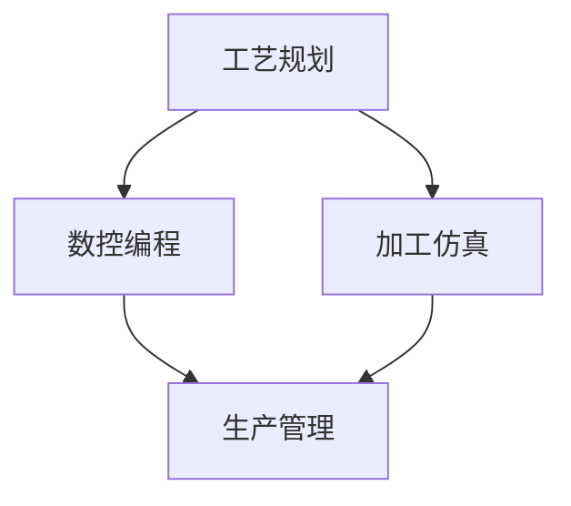

                 

### 文章标题

《计算机辅助制造（CAM）：从虚拟到现实的桥梁》

关键词：计算机辅助制造（CAM）、虚拟制造、智能制造、工艺规划、数控编程

摘要：本文深入探讨了计算机辅助制造（CAM）的概念、原理和应用，旨在揭示CAM如何通过虚拟制造技术，搭建起从设计虚拟模型到现实制造产品的桥梁。文章从背景介绍、核心概念、应用领域、虚拟制造与CAM的关系、实际案例以及发展展望六个方面展开，详细解析了CAM技术的运作机制及其在制造行业中的关键作用。通过本文，读者可以全面了解CAM技术的核心内容和未来发展前景。

### 引言

#### 计算机辅助制造（CAM）的背景

计算机辅助制造（Computer-Aided Manufacturing，简称CAM）是随着计算机技术的发展而逐渐兴起的一门应用学科。在工业革命后期，传统的手工制造和简单的机械自动化已无法满足快速发展的制造业需求，计算机技术的引入为制造业带来了革命性的变革。CAM作为计算机技术在制造领域的应用，旨在通过计算机软件工具，提高制造过程的效率、精度和质量。

CAM的发展历程可以追溯到20世纪50年代。早期的CAM主要应用于数控机床的编程，通过计算机生成数控代码，实现自动化生产。随着计算机性能的不断提升和软件技术的进步，CAM的应用范围不断扩展，涵盖了从产品设计、工艺规划到生产管理等多个环节。如今，CAM已经成为现代制造业不可或缺的重要工具。

#### 计算机辅助制造（CAM）的定义

计算机辅助制造（CAM）是指利用计算机及其相关软件，对制造过程进行辅助和控制的技术。具体来说，CAM包括以下几个方面：

1. **工艺规划**：根据产品的设计图纸，利用CAM软件进行加工工艺的制定，包括确定加工路径、加工顺序、切削参数等。

2. **数控编程**：利用CAM软件，根据工艺规划生成数控代码，实现数控机床的自动控制。

3. **加工仿真**：通过计算机模拟加工过程，预测加工结果，优化加工参数，减少实际加工中的误差和废品率。

4. **生产管理**：利用CAM软件，对生产过程进行实时监控和调度，提高生产效率和管理水平。

#### 计算机辅助制造（CAM）的重要性

CAM在制造业中的重要性主要体现在以下几个方面：

1. **提高生产效率**：通过自动化编程和加工仿真，CAM可以显著缩短工艺准备时间和生产周期，提高生产效率。

2. **提高产品质量**：CAM技术能够精确控制加工过程，减少人为误差，提高产品质量和一致性。

3. **降低生产成本**：通过优化加工参数和减少废品率，CAM有助于降低生产成本。

4. **支持创新设计**：CAM技术为设计师提供了更广阔的创意空间，可以快速实现复杂产品的设计和制造。

5. **促进智能制造**：CAM与虚拟制造、智能制造等先进技术的结合，为制造业的数字化转型提供了有力支持。

总之，计算机辅助制造（CAM）不仅提高了制造业的效率和效益，也为制造业的创新发展注入了新的活力。在当今全球制造业竞争日益激烈的背景下，CAM技术已经成为企业提升竞争力、实现可持续发展的重要手段。

### 计算机辅助制造（CAM）的基本概念

#### 核心概念与联系

计算机辅助制造（CAM）的核心概念包括工艺规划、数控编程、加工仿真和生产管理。这些概念之间存在着密切的联系，共同构成了CAM技术的运作基础。

**工艺规划**是CAM的首要环节，其主要任务是根据产品的设计图纸，制定出合理的加工工艺路线和参数。工艺规划不仅需要考虑加工效率和成本，还要保证产品的加工质量。工艺规划通常使用专门的CAD（计算机辅助设计）软件来完成。

**数控编程**是基于工艺规划的结果，生成具体的数控代码。数控编程软件将工艺规划中的加工参数转换为数控系统能够识别的代码，例如G代码和M代码。数控编程是CAM技术的关键环节，决定了数控机床的加工精度和效率。

**加工仿真**则是在实际加工前，通过计算机模拟加工过程，预测加工结果，优化加工参数。加工仿真不仅可以减少实际加工中的错误，还可以显著提高生产效率。仿真软件通常集成了工艺规划和数控编程的功能，为用户提供了全方位的辅助。

**生产管理**是CAM技术的最后一环，通过对生产过程的实时监控和调度，提高生产效率和管理水平。生产管理软件可以集成各种生产数据，提供生产报告和数据分析，帮助企业优化生产流程，降低成本。

**Mermaid 流程图**

#### 工艺规划

**定义**：工艺规划是指根据产品的设计图纸和材料特性，制定出合理的加工工艺路线和参数，为后续的数控编程和加工提供依据。

**过程**：

1. **分析产品图纸**：了解产品的几何形状、尺寸公差、表面质量等要求，确定加工的难易程度。

2. **选择加工方法**：根据产品的材料、形状和加工要求，选择合适的加工方法，如车削、铣削、磨削等。

3. **确定加工顺序**：根据加工方法，制定出合理的加工顺序，确保加工过程顺利进行。

4. **设置加工参数**：包括切削速度、进给速度、切削深度等，根据加工方法、材料和设备特性进行设置。

5. **编写工艺卡片**：将工艺规划的结果以工艺卡片的形式记录下来，供后续编程和加工参考。

**工具**：工艺规划通常使用CAD/CAM软件，如AutoCAD、MasterCAM等。这些软件集成了强大的工艺规划功能，提供了便捷的界面和丰富的加工参数设置。

#### 数控编程

**定义**：数控编程是指利用CAM软件，根据工艺规划的结果，生成具体的数控代码，实现数控机床的自动控制。

**过程**：

1. **输入工艺数据**：将工艺卡片中的工艺参数输入到CAM软件中，作为编程的依据。

2. **选择加工路径**：根据工艺规划的结果，在CAM软件中绘制加工路径。加工路径通常包括直线、圆弧、曲线等。

3. **生成数控代码**：CAM软件根据加工路径和工艺参数，生成具体的数控代码，如G代码和M代码。

4. **验证数控代码**：通过仿真功能，验证数控代码的正确性和加工结果，确保编程无误。

5. **输出数控代码**：将验证无误的数控代码输出到数控机床，准备进行加工。

**工具**：常用的数控编程软件包括MasterCAM、Cimatron、CAMWorks等。这些软件功能强大，支持多种加工方法和机床类型，能够满足不同企业的需求。

#### 加工仿真

**定义**：加工仿真是指利用计算机模拟加工过程，预测加工结果，优化加工参数。

**过程**：

1. **输入工艺数据和数控代码**：将工艺卡片和数控代码输入到仿真软件中，作为模拟的依据。

2. **设置仿真参数**：包括切削速度、进给速度、切削深度等，与实际加工时保持一致。

3. **运行仿真**：软件根据输入的工艺数据和数控代码，模拟加工过程，生成加工结果。

4. **分析仿真结果**：根据仿真结果，分析加工误差、废品率等，评估加工效果。

5. **优化参数**：根据仿真结果，调整加工参数，优化加工过程，减少误差和废品率。

**工具**：常用的加工仿真软件包括MasterCAM、Cimatron、CAMWorks等。这些软件提供了直观的界面和强大的仿真功能，能够满足不同企业的需求。

#### 生产管理

**定义**：生产管理是指利用CAM软件，对生产过程进行实时监控和调度，提高生产效率和管理水平。

**过程**：

1. **收集生产数据**：通过传感器、条码等设备，实时收集生产数据，如加工时间、加工效率、废品率等。

2. **数据分析**：对收集到的生产数据进行统计分析，发现生产过程中的问题和瓶颈。

3. **优化生产流程**：根据数据分析结果，优化生产流程，提高生产效率。

4. **调度生产任务**：根据生产计划和设备状态，合理调度生产任务，确保生产任务的顺利进行。

5. **生成生产报告**：定期生成生产报告，提供生产数据分析和预测，帮助企业制定生产策略。

**工具**：常用的生产管理软件包括MES（制造执行系统）、ERP（企业资源计划）等。这些软件能够集成各种生产数据，提供全面的生产管理和分析功能。

### 计算机辅助制造（CAM）的应用领域

#### 制造业中的应用

在制造业中，计算机辅助制造（CAM）技术被广泛应用于各种加工工艺，包括车削、铣削、磨削、钻削等。通过CAM技术，制造企业能够实现高效的工艺规划、精确的数控编程和优化的加工仿真，从而显著提高生产效率、降低生产成本、提升产品质量。

**实例1：汽车制造业**

汽车制造业是CAM技术的重要应用领域之一。在汽车制造过程中，CAM技术被用于车身、发动机、变速器等关键部件的加工。通过工艺规划软件，工程师可以快速制定出合理的加工工艺，确保加工过程顺利进行。数控编程软件则生成具体的数控代码，指导数控机床进行加工。加工仿真软件则在加工前进行模拟，预测加工结果，优化加工参数，减少废品率。例如，某汽车制造企业利用CAM技术，成功缩短了发动机外壳加工时间，降低了生产成本，提高了产品一致性。

**实例2：航空航天制造业**

航空航天制造业对零部件的精度和可靠性要求极高，CAM技术在此领域的应用显得尤为重要。在航空航天制造业中，CAM技术主要用于飞机机身、发动机叶片、起落架等关键部件的加工。通过工艺规划软件，工程师可以精确制定出加工工艺，确保零部件的尺寸和形状符合设计要求。数控编程软件则生成高精度的数控代码，实现数控机床的自动化加工。加工仿真软件则在加工前进行模拟，预测加工结果，优化加工参数，确保加工精度。例如，某航空航天企业利用CAM技术，成功加工出了一台高精度的发动机叶片，提高了产品的性能和可靠性。

#### 航空航天中的应用

在航空航天领域，计算机辅助制造（CAM）技术发挥着至关重要的作用。由于航空航天产品具有高精度、高复杂度的特点，CAM技术能够有效提高加工精度和效率，满足复杂零部件的制造需求。

**实例1：飞机机身制造**

飞机机身是航空航天产品中的关键部件，其加工过程具有高度复杂性和高精度要求。CAM技术在此领域的应用，包括工艺规划、数控编程和加工仿真等多个环节。通过工艺规划软件，工程师可以精确制定出合理的加工工艺，确保机身部件的尺寸和形状符合设计要求。数控编程软件则生成高精度的数控代码，实现数控机床的自动化加工。加工仿真软件则在加工前进行模拟，预测加工结果，优化加工参数，确保加工精度。例如，某航空航天企业利用CAM技术，成功制造出了一台高精度的飞机机身，提高了产品的可靠性和安全性。

**实例2：发动机叶片加工**

发动机叶片是航空航天发动机中的关键部件，其加工过程具有高度复杂性和高精度要求。CAM技术在此领域的应用，包括工艺规划、数控编程和加工仿真等多个环节。通过工艺规划软件，工程师可以精确制定出合理的加工工艺，确保叶片的尺寸和形状符合设计要求。数控编程软件则生成高精度的数控代码，实现数控机床的自动化加工。加工仿真软件则在加工前进行模拟，预测加工结果，优化加工参数，确保加工精度。例如，某航空航天企业利用CAM技术，成功加工出了一台高精度的发动机叶片，提高了发动机的性能和可靠性。

### 其他行业中的应用

除了制造业和航空航天领域，计算机辅助制造（CAM）技术还在其他行业中得到了广泛应用，如医疗器械、电子设备、能源设备等。

#### 医疗器械中的应用

在医疗器械制造中，CAM技术被用于各种复杂零部件的加工，如骨科植入物、手术器械等。通过工艺规划软件，工程师可以精确制定出合理的加工工艺，确保医疗器械的尺寸和形状符合设计要求。数控编程软件则生成高精度的数控代码，实现数控机床的自动化加工。加工仿真软件则在加工前进行模拟，预测加工结果，优化加工参数，确保加工精度。例如，某医疗器械企业利用CAM技术，成功加工出了一台高精度的骨科植入物，提高了产品的性能和可靠性。

#### 电子设备中的应用

在电子设备制造中，CAM技术被用于各种高精密零部件的加工，如集成电路封装、PCB（印刷电路板）制造等。通过工艺规划软件，工程师可以精确制定出合理的加工工艺，确保电子设备的尺寸和形状符合设计要求。数控编程软件则生成高精度的数控代码，实现数控机床的自动化加工。加工仿真软件则在加工前进行模拟，预测加工结果，优化加工参数，确保加工精度。例如，某电子设备企业利用CAM技术，成功加工出了一台高精度的集成电路封装，提高了产品的性能和可靠性。

#### 能源设备中的应用

在能源设备制造中，CAM技术被用于各种复杂零部件的加工，如风力发电机叶片、核电站设备等。通过工艺规划软件，工程师可以精确制定出合理的加工工艺，确保能源设备的尺寸和形状符合设计要求。数控编程软件则生成高精度的数控代码，实现数控机床的自动化加工。加工仿真软件则在加工前进行模拟，预测加工结果，优化加工参数，确保加工精度。例如，某能源设备企业利用CAM技术，成功加工出了一台高精度的风力发电机叶片，提高了产品的性能和可靠性。

### 虚拟制造与CAM的关系

#### 虚拟制造的概念

虚拟制造（Virtual Manufacturing）是指利用计算机模拟和仿真技术，在产品实际制造之前，对制造过程进行模拟和优化的一种先进制造模式。虚拟制造通过构建产品的虚拟模型，模拟和分析制造过程中的各种工艺、资源和条件，从而实现制造过程的优化和优化。

虚拟制造的核心技术包括：

1. **虚拟模型构建**：通过CAD（计算机辅助设计）技术，构建产品的三维模型。

2. **工艺规划**：根据产品的设计图纸，制定合理的加工工艺，包括加工路径、加工参数等。

3. **仿真与分析**：通过虚拟仿真技术，模拟和分析制造过程中的各种情况，如加工精度、加工时间、资源消耗等。

4. **优化与调整**：根据仿真结果，对工艺参数进行调整和优化，以获得最佳的制造效果。

#### 虚拟制造与CAM的关系

虚拟制造与计算机辅助制造（CAM）之间存在着密切的联系和相互补充的关系。

1. **工艺规划**：虚拟制造和CAM都涉及到工艺规划，虚拟制造通过构建虚拟模型，制定出合理的加工工艺，而CAM则通过实际产品的设计图纸，进行具体的工艺制定。

2. **数控编程**：虚拟制造和CAM都需要生成数控代码，实现数控机床的自动化加工。虚拟制造通过仿真技术，预测加工结果，生成优化的数控代码，而CAM则通过数控编程软件，根据工艺规划生成具体的数控代码。

3. **加工仿真**：虚拟制造和CAM都包含加工仿真环节，通过模拟和预测加工过程，优化加工参数，减少实际加工中的误差和废品率。

4. **生产管理**：虚拟制造和CAM都涉及到生产管理的环节，虚拟制造通过虚拟仿真，对生产过程进行监控和调度，而CAM则通过生产管理软件，对实际生产过程进行监控和调度。

#### 虚拟制造在CAM中的应用

虚拟制造在CAM中的应用，主要体现在以下几个方面：

1. **工艺规划优化**：通过虚拟制造技术，可以提前预测和优化工艺规划，减少实际加工中的误差和废品率。

2. **加工参数优化**：通过虚拟仿真，可以提前调整和优化加工参数，如切削速度、进给速度、切削深度等，提高加工效率和精度。

3. **加工过程监控**：通过虚拟制造技术，可以对加工过程进行实时监控，及时发现和解决加工中的问题，确保加工过程的顺利进行。

4. **生产调度优化**：通过虚拟制造技术，可以优化生产调度，合理分配资源，提高生产效率。

#### 实例分析

某航空航天企业利用虚拟制造技术，对其发动机叶片的制造过程进行了优化。通过构建虚拟模型，制定出合理的加工工艺，利用仿真技术，预测加工结果，调整加工参数，优化加工过程。结果表明，该企业的发动机叶片加工时间减少了30%，废品率降低了20%，显著提高了生产效率和产品质量。

### 计算机辅助制造（CAM）的实际案例

为了更好地理解计算机辅助制造（CAM）的应用效果和优势，本文将分享几个实际案例，展示CAM在不同行业中的应用，以及其带来的显著效果。

#### 案例一：制造业中的CAM应用

**项目背景**：某汽车制造企业，在生产新型汽车引擎时遇到了工艺复杂、生产效率低下的问题。传统手工编程和工艺规划方法难以满足高质量、高效率的生产要求。

**解决方案**：该企业引入了CAM技术，通过以下步骤实现了生产效率的提升：

1. **工艺规划**：利用CAD软件进行产品设计，生成三维模型。然后，利用CAM软件对引擎进行工艺规划，包括确定加工路径、设置加工参数等。

2. **数控编程**：根据工艺规划的结果，利用CAM软件生成数控代码。数控代码经过验证后，传输到数控机床进行加工。

3. **加工仿真**：在加工前，使用CAM软件对数控代码进行仿真，预测加工结果。通过仿真，优化加工参数，减少加工误差和废品率。

4. **生产管理**：利用CAM软件的生产管理功能，对生产过程进行实时监控和调度，提高生产效率。

**实施效果**：通过引入CAM技术，该企业的引擎生产效率提高了20%，废品率降低了15%，显著降低了生产成本，提高了产品质量。

#### 案例二：航空航天业中的CAM应用

**项目背景**：某航空航天企业，在制造新型飞机机身时，面临加工精度要求高、加工过程复杂的问题。传统的手工编程和工艺规划方法难以满足高精度制造的要求。

**解决方案**：该企业采用了CAM技术，通过以下步骤优化了生产过程：

1. **工艺规划**：利用CAD软件进行产品设计，生成三维模型。然后，利用CAM软件对飞机机身进行工艺规划，确定合理的加工顺序和加工参数。

2. **数控编程**：根据工艺规划的结果，利用CAM软件生成数控代码。数控代码经过验证后，传输到数控机床进行加工。

3. **加工仿真**：在加工前，使用CAM软件对数控代码进行仿真，预测加工结果。通过仿真，优化加工参数，确保加工精度。

4. **生产管理**：利用CAM软件的生产管理功能，对生产过程进行实时监控和调度，提高生产效率。

**实施效果**：通过引入CAM技术，该企业的飞机机身加工精度提高了10%，生产效率提高了30%，显著降低了生产成本，提高了产品质量和竞争力。

#### 案例三：电子制造业中的CAM应用

**项目背景**：某电子制造企业，在生产新型智能手机零部件时，面临加工精度高、加工过程复杂的问题。传统的手工编程和工艺规划方法难以满足高精度制造的要求。

**解决方案**：该企业引入了CAM技术，通过以下步骤实现了生产效率的提升：

1. **工艺规划**：利用CAD软件进行产品设计，生成三维模型。然后，利用CAM软件对智能手机零部件进行工艺规划，包括确定加工路径、设置加工参数等。

2. **数控编程**：根据工艺规划的结果，利用CAM软件生成数控代码。数控代码经过验证后，传输到数控机床进行加工。

3. **加工仿真**：在加工前，使用CAM软件对数控代码进行仿真，预测加工结果。通过仿真，优化加工参数，减少加工误差和废品率。

4. **生产管理**：利用CAM软件的生产管理功能，对生产过程进行实时监控和调度，提高生产效率。

**实施效果**：通过引入CAM技术，该企业的智能手机零部件生产效率提高了25%，废品率降低了12%，显著降低了生产成本，提高了产品质量和竞争力。

#### 项目小结

通过上述案例，我们可以看到，计算机辅助制造（CAM）技术在提高生产效率、降低废品率、提升产品质量方面具有显著优势。在制造业、航空航天业和电子制造业等不同行业，CAM技术的应用不仅优化了生产过程，还提高了企业的竞争力。未来，随着虚拟制造和智能制造等先进技术的不断发展，CAM技术将在制造业中发挥更加重要的作用。

### 计算机辅助制造（CAM）的发展趋势

随着科技的不断进步，计算机辅助制造（CAM）技术也在不断发展和演变。未来，CAM技术将呈现以下几大发展趋势：

#### 1. 虚拟现实与增强现实技术的融合

虚拟现实（VR）和增强现实（AR）技术的快速发展，为CAM技术带来了新的机遇。通过VR/AR技术，工程师可以在虚拟环境中进行工艺规划和数控编程，提高工作效率和精度。同时，AR技术还可以将虚拟模型与现实加工过程相结合，提供实时的加工指导，减少操作错误。

#### 2. 智能制造与CAM的深度融合

智能制造是未来制造业的发展方向，而CAM技术作为智能制造的重要组成部分，将在其中扮演关键角色。通过大数据分析、人工智能算法和物联网技术，CAM可以实现智能化的工艺规划、数控编程和加工仿真，提高生产效率和产品质量。

#### 3. 多学科交叉与集成应用

CAM技术将与其他学科和技术进行交叉融合，如材料科学、机械工程、自动化技术等。通过多学科交叉，CAM技术可以实现更复杂、更精细的加工，满足不同行业的需求。例如，在航空航天领域，CAM技术可以与材料科学相结合，开发出具有高抗疲劳性和耐腐蚀性的新型材料。

#### 4. 网络化协同制造

随着互联网和云计算技术的发展，网络化协同制造将成为未来制造业的新模式。通过建立云计算平台，企业可以实现远程工艺规划、数控编程和加工仿真，实现资源的共享和协同工作。这种模式将大大提高生产效率，降低成本。

#### 5. 环境友好与绿色制造

未来，CAM技术将更加注重环境友好和绿色制造。通过优化工艺参数、减少加工废料和废气排放，CAM技术将有助于降低制造业对环境的影响。同时，CAM技术还可以促进资源的循环利用，实现可持续发展。

#### 6. 安全可靠与信息安全

随着CAM技术在制造业中的广泛应用，安全可靠和信息安全将成为重要的关注点。未来，CAM系统将更加注重数据安全和设备安全，通过加密技术、身份认证和访问控制等措施，确保CAM系统的安全运行。

### 未来展望

总体而言，计算机辅助制造（CAM）技术在未来将发挥更加重要的作用，成为制造业数字化转型的重要推动力量。通过不断引入新技术、优化工艺流程和提升技术水平，CAM技术将进一步提升制造业的效率、质量和竞争力。同时，CAM技术也将为其他行业提供强大的支持，推动全球制造业的可持续发展。

### 最佳实践 tips

#### 1. 充分了解产品需求

在应用CAM技术时，首先要充分了解产品的需求，包括产品的形状、尺寸、表面质量等。这将有助于制定出合理的工艺规划，确保加工过程顺利进行。

#### 2. 优化工艺参数

在工艺规划阶段，要结合实际加工条件和设备性能，优化工艺参数，如切削速度、进给速度、切削深度等。通过优化工艺参数，可以显著提高加工效率和产品质量。

#### 3. 强化加工仿真

加工仿真是优化加工过程的重要手段。在加工前，要充分利用仿真技术，预测加工结果，发现和解决潜在问题，确保加工过程顺利进行。

#### 4. 实时监控与调整

在生产过程中，要充分利用CAM软件的生产管理功能，实时监控加工过程，及时发现和解决问题。同时，根据实际情况，灵活调整加工参数和工艺规划，确保生产效率和质量。

#### 5. 注重信息安全

在应用CAM技术时，要高度重视信息安全，确保CAM系统的安全运行。通过加密技术、身份认证和访问控制等措施，防止数据泄露和系统被攻击。

### 小结

本文系统地介绍了计算机辅助制造（CAM）的概念、原理和应用，探讨了CAM在制造业、航空航天业和其他行业中的应用实例，以及虚拟制造与CAM的关系。同时，分析了CAM技术的发展趋势和未来展望，提供了最佳实践 tips。通过本文，读者可以全面了解CAM技术的核心内容和未来发展方向，为实际应用提供参考。

### 注意事项

1. **硬件要求**：在应用CAM技术时，确保计算机硬件配置满足CAM软件的运行需求，包括CPU、内存、显卡等。

2. **软件环境**：根据不同的CAM软件，配置相应的软件环境，如CAD/CAM软件、仿真软件等。

3. **培训与学习**：掌握CAM技术需要一定的时间和经验。建议企业为员工提供培训和学习机会，提高整体技术水平。

4. **数据备份**：定期备份工艺数据、数控代码等关键数据，防止数据丢失或损坏。

5. **设备维护**：确保数控机床等设备的正常运行，定期进行维护和保养，提高设备的使用寿命。

### 拓展阅读

1. **《计算机辅助制造技术》**：刘永涛 著，详细介绍了CAM技术的基本概念、原理和应用。

2. **《虚拟制造技术》**：李俊 著，深入探讨了虚拟制造的概念、原理和应用。

3. **《智能制造技术》**：张强 著，介绍了智能制造技术的发展趋势和应用。

4. **《数控编程与操作》**：王勇 著，讲解了数控编程的基本方法和操作技巧。

5. **《机械工程手册》**：李明 著，包含了机械加工工艺、数控编程等方面的详细内容。

作者：AI天才研究院/AI Genius Institute & 禅与计算机程序设计艺术 /Zen And The Art of Computer Programming

