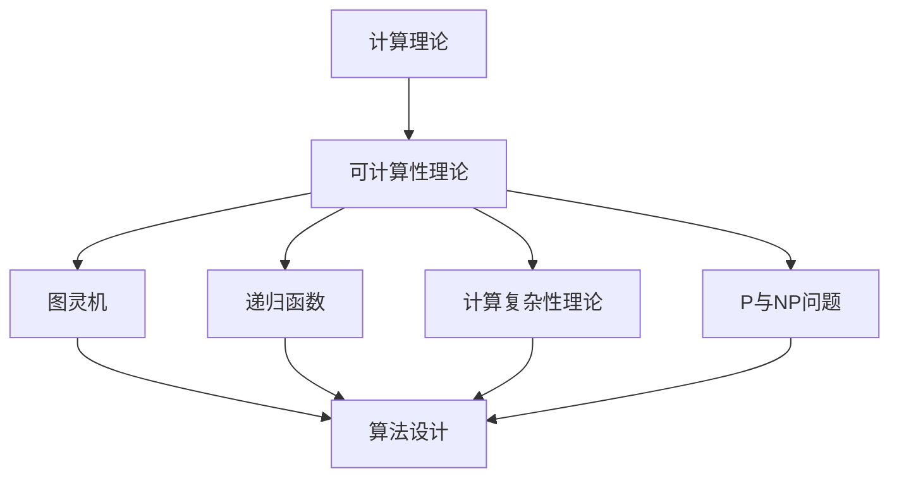

                 

### 文章标题

《计算理论与可计算性分析》

### 关键词

计算理论，可计算性分析，图灵机，递归函数，计算复杂性，算法理论，P与NP问题，计算模型，形式语言，算法设计，计算复杂性分类，密码学，人工智能，数据库管理，前沿研究与发展趋势。

### 摘要

本文旨在深入探讨计算理论与可计算性分析这一重要领域。首先，我们回顾了计算理论的基础知识，包括其定义、历史发展和主要分支。接着，详细介绍了可计算性理论的核心内容，如图灵机、递归函数和计算复杂性理论。随后，我们探讨了不同类型的计算模型，如图灵机、λ-演算和形式语言。在此基础上，我们进一步讨论了算法理论，包括算法设计原理、算法分析工具和算法分类与实现。接着，我们深入分析了计算复杂性，包括P与NP问题以及NP完全性。此外，本文还探讨了计算理论在密码学、人工智能和数据库管理等方面的应用，并介绍了计算理论的前沿研究和发展趋势。最后，我们对全书内容进行了总结，并展望了未来的研究方向。

## 前言

计算理论与可计算性分析是计算机科学和数学领域中的核心主题，它们为现代计算机技术的发展奠定了坚实的基础。计算理论研究的是计算的本质和可能性，而可计算性分析则关注于哪些问题是可以在有限的步骤内得到解决的。这两个领域相互交织，共同推动了计算机科学的进步。

### 书籍目的与读者对象

本书的目的是为那些希望深入了解计算理论与可计算性分析的读者提供一个系统、全面的指导。无论您是计算机科学专业的学生、研究人员，还是对这一领域感兴趣的普通读者，本书都将为您提供一个清晰的路径，帮助您掌握这些关键概念和技术。

### 可计算性分析领域背景

可计算性分析起源于20世纪初，当时数学家们开始研究什么样的数学问题是可以在有限步骤内解决的。这一研究背景可以追溯到图灵机的发明，它为计算提供了形式化的定义。随着计算机科学的兴起，可计算性分析逐渐成为计算机科学中的一个重要分支，其研究内容涵盖了从基础的计算模型到复杂的算法分析。

## 第1章 计算理论概述

### 计算理论的基本概念

计算理论是研究计算过程及其本质的学科。它关注的是计算的可能性、效率和复杂性。计算理论的基本概念包括计算、算法、计算模型和计算复杂性等。

- **计算**：计算是指执行一系列操作以解决问题或得到结果的过程。
- **算法**：算法是一系列定义明确的步骤，用于解决特定问题或执行特定任务。
- **计算模型**：计算模型是用于模拟计算过程的理论框架，常见的计算模型包括图灵机、λ-演算和形式语言等。
- **计算复杂性**：计算复杂性是指解决问题的计算资源需求，包括时间复杂性和空间复杂性。

### 计算理论的历史与发展

计算理论的发展可以追溯到20世纪初，当时数学家们开始探讨数学问题的可解性。以下是计算理论发展历程中的几个关键点：

- **图灵机的发明**（1936年）：艾伦·图灵提出了图灵机的概念，它为计算提供了形式化的定义，并成为现代计算理论的基础。
- **递归函数理论**（1930年代）：斯蒂芬·科尔·克莱因伯格和阿尔弗雷德·塔斯基等人发展了递归函数理论，为计算提供了数学基础。
- **复杂性理论**（1960年代）：兰姆伯特·潘普利尔提出了P和NP问题，这为计算复杂性理论奠定了基础。

### 计算理论的分支与联系

计算理论分为多个分支，每个分支都有其独特的主题和研究方法。以下是一些主要的计算理论分支：

- **形式语言理论**：研究能够被计算机处理的字符串集合和它们的属性。
- **自动机理论**：研究由有限状态转换图描述的计算模型。
- **计算复杂性理论**：研究算法的效率和问题解决的能力。
- **算法设计与分析**：研究如何设计有效的算法以及如何分析算法的性能。
- **计算模型理论**：研究不同的计算模型，如图灵机、λ-演算等。

这些分支之间有着紧密的联系，共同构成了计算理论的整体框架。例如，计算复杂性理论依赖于算法设计与分析的成果，而形式语言理论和自动机理论为计算模型提供了基础。

### 计算理论的重要性

计算理论的重要性体现在多个方面：

- **计算机科学的基石**：计算理论为计算机科学提供了基础，是理解和设计计算机系统的基础。
- **算法研究和优化**：计算理论帮助研究人员分析和优化算法，提高计算机程序的效率和性能。
- **实际问题解决**：计算理论的研究结果可以应用于解决各种实际问题，如密码学、人工智能和优化问题。
- **理论指导实践**：计算理论为实际应用提供了理论指导，帮助开发人员理解计算过程的本质。

综上所述，计算理论是计算机科学和数学领域中的核心主题，它不仅为现代计算机技术的发展奠定了坚实的基础，而且还在实际问题解决和算法优化中发挥着重要作用。在接下来的章节中，我们将进一步探讨可计算性理论、计算模型和算法理论等核心主题。

### 第2章 可计算性理论

可计算性理论是计算理论中的一个重要分支，它研究的是哪些问题是可以在有限的步骤内得到的。这一理论不仅为计算机科学提供了坚实的理论基础，还为我们理解计算能力的边界提供了深刻洞察。

#### 2.1 图灵机理论

图灵机是由英国数学家艾伦·图灵在1936年提出的一种抽象计算模型。图灵机是一个理想化的计算机，它通过读取和写入符号序列来执行计算任务。图灵机的定义涉及几个关键组成部分：

- **图灵带**：图灵带是一个无穷长的带子，上面可以写入和读取符号。带子上的每个位置都有一个当前符号，图灵机的读取和写入操作都是基于当前符号进行的。
- **读取头**：读取头可以读取当前符号，并根据读取到的符号进行操作。
- **控制单元**：控制单元根据当前状态和读取到的符号，决定下一步的操作，包括移动读取头、写入新符号和转换状态。
- **状态集合**：图灵机的状态集合包含所有可能的状态，每个状态对应图灵机的一个内部配置。

图灵机的操作可以通过以下步骤来描述：

1. **初始化**：图灵机开始时处于一个特定的初始状态，读取头位于带子上的一个特定位置，该位置上的符号称为“开始符号”。
2. **读取与写入**：在每一步操作中，读取头读取当前符号，并根据当前状态和读取到的符号，执行以下操作之一：
   - 写入新符号：将新符号写入当前位置。
   - 移动读取头：将读取头向左或向右移动一个位置。
   - 转换状态：将图灵机的状态转换为下一个状态。
3. **终止条件**：图灵机在执行完所有步骤后，如果达到了一个特定的终止状态，则计算结束。

图灵机的强大之处在于它的通用性。理论上，任何可计算的问题都可以通过图灵机来解决。这意味着图灵机能够模拟任何计算过程，从而成为现代计算机的理论基础。

#### 2.2 递归函数与可计算性

递归函数是可计算性理论中的另一个核心概念。递归函数是一种通过定义自身来构造函数的方法。具体来说，一个递归函数可以通过以下两种方式定义：

1. **基础函数**：基础函数是最基本的递归函数，例如常量函数、零函数和投影函数等。
2. **递归定义**：通过递归定义，可以将一个函数表示为另一个函数的组合。例如，阶乘函数可以通过递归定义如下：

   $$ f(n) = \begin{cases} 
   1 & \text{如果 } n = 0 \\
   n \times f(n-1) & \text{如果 } n > 0 
   \end{cases} $$

递归函数的可计算性是指一个递归函数是否能在有限的步骤内得到计算结果。可计算性理论的一个重要问题是如何证明一个函数是可计算的。这通常涉及到构造一个图灵机，该图灵机能够在有限的步骤内计算该函数。

递归函数与可计算性之间存在紧密的联系。一个函数是可计算的，当且仅当它可以由一个递归函数表示。这意味着递归函数为可计算性理论提供了一种形式化的方法来描述计算过程。

#### 2.3 计算复杂性理论

计算复杂性理论是研究算法效率和问题解决能力的学科。它的核心问题是确定解决特定问题所需的时间和空间资源。计算复杂性理论通常关注以下两个关键方面：

1. **时间复杂性**：时间复杂性是指算法执行所需的时间，通常用大O符号表示法来表示。例如，一个算法的时间复杂性可以表示为 \(O(n^2)\)，这意味着算法的执行时间与输入规模 \(n\) 的平方成正比。

2. **空间复杂性**：空间复杂性是指算法执行所需的空间，包括临时存储和栈空间。同样，空间复杂性也使用大O符号表示法来表示。

计算复杂性理论的一个重要问题是区分不同类型的问题。例如，P类问题是那些可以在多项式时间内解决的问题，而NP类问题是那些可以在多项式时间内验证解决方案的问题。P与NP问题至今仍是一个未解决的难题，它涉及到了计算能力的边界和复杂性理论的核心问题。

#### 2.4 可计算性理论的联系与架构

可计算性理论中的核心概念，如图灵机、递归函数和计算复杂性理论，相互关联并共同构成了一个完整的形式化框架。以下是一个简单的Mermaid流程图，展示了这些概念之间的关系：

在这个框架中，图灵机和递归函数为计算过程提供了形式化的定义，而计算复杂性理论则分析了计算资源的效率。P与NP问题则是计算复杂性理论中的一个关键问题，它涉及到了计算能力的边界。

综上所述，可计算性理论是计算理论中的一个重要分支，它通过图灵机、递归函数和计算复杂性理论，为计算过程提供了形式化的定义和分析方法。在接下来的章节中，我们将进一步探讨不同的计算模型，如λ-演算和形式语言，以及算法理论，这些概念将继续丰富我们对计算过程的理解。

### 第3章 计算模型

计算模型是计算理论中的核心组成部分，它们为我们理解和模拟计算过程提供了抽象的框架。本章将介绍几种重要的计算模型，包括图灵机、λ-演算和形式语言，并探讨它们的基本概念、特点和相互关系。

#### 3.1 图灵机模型

图灵机（Turing Machine）是艾伦·图灵在1936年提出的一种抽象计算模型。它通过一个无限长的带子和一系列操作规则来模拟计算过程。图灵机的核心组成部分包括：

- **无限长的带子**：图灵机的带子是一个无穷长的线性序列，每个位置上可以有一个符号。带子上的符号通过读取头进行访问。
- **读取头**：读取头可以读取带子上的符号，并写入新符号。读取头可以左移或右移，以访问带子上的不同位置。
- **状态控制单元**：状态控制单元根据当前状态和读取头的符号，决定下一步的操作，包括移动读取头、写入新符号和转换状态。
- **状态集合**：图灵机的状态集合包含了所有可能的状态。每个状态对应图灵机的一个内部配置。

图灵机的操作规则通常用状态转换表（State Transition Table）来表示。状态转换表定义了在特定状态下，读取头读取到的符号应该如何操作。图灵机的特点是其通用性，即理论上任何可计算的问题都可以通过图灵机来解决。

#### 3.2 λ-演算

λ-演算（λ-Calculus）是一种形式化计算模型，由数学家阿尔伯特·亨廷顿和斯蒂芬·克莱因伯格在1920年代提出。λ-演算通过函数表示和变量绑定来模拟计算过程。其核心概念包括：

- **抽象（Abstraction）**：λ-演算使用λ表达式来表示函数。λ表达式包含一个参数和一个函数体，例如，\(λx. x + 1\) 表示一个加一函数。
- **应用（Application）**：应用是将一个函数应用于一个参数。例如，将 \(λx. x + 1\) 应用于参数 \(y\)，得到 \(y + 1\)。
- **变量绑定**：变量绑定是指将变量与具体的值关联起来。在λ-演算中，变量绑定通过β-转换来实现，即通过替换变量与函数体中的参数来实现函数的应用。

λ-演算的优点在于其简洁性和表达力。λ-演算能够表达复杂的计算过程，并且具有形式化的语义，这使得它成为现代编程语言和计算机科学理论的基础。

#### 3.3 形式语言与自动机

形式语言（Formal Language）是计算机科学中的一个基本概念，它用来描述可以由计算机处理的字符串集合。形式语言包括以下几个关键组成部分：

- **字母表（Alphabet）**：字母表是构成形式语言的符号集合，例如，英语字母表包含所有的英文字母。
- **单词（Word）**：单词是由字母表中的符号组成的字符串，例如，"hello" 是一个单词。
- **语法（Grammar）**：语法是用于生成形式语言的规则集合，例如，上下文无关文法（CFG）用于生成上下文无关语言。

形式语言与自动机（Automata）密切相关。自动机是一种抽象的计算模型，用于识别和生成形式语言。常见的自动机包括：

- **有限状态自动机（Finite State Automaton, FSA）**：有限状态自动机是最简单的自动机，它由有限个状态和转换规则组成。有限状态自动机可以用于识别正则语言。
- **有穷状态机（Finite Automaton, FA）**：有穷状态机是有限状态自动机的一个子类，它没有初始状态和终止状态，但有接受状态。
- **推动力自动机（Pushdown Automaton, PDA）**：推动力自动机是一种能够使用栈的自动机，它可以用于识别上下文无关语言。
- **图灵机（Turing Machine）**：图灵机是能够处理任意形式语言的通用计算模型，它由一个无穷长的带子和一系列操作规则组成。

形式语言和自动机的关系是，自动机可以用来识别和生成形式语言。通过定义适当的自动机，可以识别出特定的字符串集合，从而实现对形式语言的表示和处理。

#### 3.4 计算模型之间的联系

不同的计算模型，如图灵机、λ-演算和形式语言，虽然在表达力和功能上有差异，但它们之间存在紧密的联系和相互补充。

- **图灵机与形式语言**：图灵机可以用来模拟形式语言中的任意字符串，这意味着图灵机能够识别和生成所有形式语言。
- **λ-演算与图灵机**：λ-演算可以被看作是图灵机的简化版本。λ-演算通过函数和变量绑定来模拟图灵机的计算过程，但它的表达能力比图灵机更简洁。
- **形式语言与自动机**：形式语言和自动机之间存在着直接的关系。形式语言可以通过自动机来识别和生成，而自动机的设计和实现通常基于形式语言的语法规则。

总的来说，计算模型为我们提供了不同的抽象层次，用于理解和模拟计算过程。不同的计算模型具有不同的特点和应用场景，但它们共同构成了计算理论的基础框架。通过理解这些计算模型，我们可以更好地设计算法、分析问题并解决复杂的计算问题。

### 第4章 算法理论

算法理论是计算理论的一个重要分支，它关注如何设计、分析和优化算法。算法是解决问题的步骤集合，这些步骤必须定义明确、逻辑连贯且能够在有限时间内完成。本章将深入探讨算法设计原理、算法分析工具和算法分类与实现。

#### 4.1 算法设计原理

算法设计是计算机科学中的一个核心问题。一个好的算法不仅要求能够正确地解决问题，还要求在时间和空间资源上尽可能高效。以下是几种常见的算法设计原理：

1. **分而治之**（Divide and Conquer）：这种策略将大问题分解成若干个小问题，分别解决，然后将小问题的解合并成大问题的解。经典的例子包括归并排序和快速排序。
   
   $$ 
   \text{快速排序}(A):
   \begin{cases} 
   \text{如果 } |A| \leq 1, \text{则结束} \\
   \text{选择 } A[\text{随机位置}] \text{作为基准元素} \\
   \text{将 } A \text{划分为两个子序列 } L \text{ 和 } R \\
   \text{递归地排序 } L \text{ 和 } R \\
   \text{将 } L \text{ 和 } R \text{ 的排序结果合并}
   \end{cases}
   $$

2. **动态规划**（Dynamic Programming）：动态规划是一种用于解决最优化问题的算法设计方法。它通过将问题分解为重叠子问题，并保存子问题的解来避免重复计算。经典的例子包括背包问题和最长公共子序列。

   $$
   \text{最长公共子序列}(X, Y):
   \begin{cases}
   \text{如果 } |X| = 0 \text{ 或 } |Y| = 0, \text{则 L = 0} \\
   \text{如果 } X\_i = Y\_i, \text{则 } L = L(X\_{i-1}, Y\_{i-1}) + 1 \\
   \text{如果 } X\_i \neq Y\_i, \text{则 } L = \max(L(X\_{i-1}, Y), L(X, Y\_{i-1})) \\
   \end{cases}
   $$

3. **贪心算法**（Greedy Algorithm）：贪心算法通过每一步选择当前最优解，并希望最终得到整体最优解。贪心算法通常适用于某些特定问题，例如找零问题和哈夫曼编码。

   $$
   \text{找零问题}:
   \begin{cases}
   \text{如果当前金额不足以支付，则选择最大面额的货币} \\
   \text{否则，选择最小面额的货币并减少当前金额}
   \end{cases}
   $$

#### 4.2 算法分析工具

算法分析是评估算法性能的重要工具。常见的算法分析工具包括时间复杂性和空间复杂性分析。

1. **时间复杂性分析**：时间复杂性分析用于评估算法执行所需的时间。时间复杂性通常用大O符号表示法来表示，例如 \(O(n)\)、\(O(n \log n)\) 和 \(O(n^2)\)。

   $$
   \text{快速排序的时间复杂性} = O(n \log n)
   $$

2. **空间复杂性分析**：空间复杂性分析用于评估算法执行所需的空间。空间复杂性也通常用大O符号表示法来表示。

   $$
   \text{动态规划的空间复杂性} = O(n^2)
   $$

#### 4.3 算法分类与实现

算法可以根据解决的问题类型和设计原理进行分类。以下是几种常见的算法分类：

1. **排序算法**：排序算法用于将一组元素按照特定的顺序排列。常见的排序算法包括快速排序、归并排序和堆排序。

2. **搜索算法**：搜索算法用于在数据结构中查找特定元素。常见的搜索算法包括二分搜索和深度优先搜索。

3. **图算法**：图算法用于处理图数据结构，常见的图算法包括最短路径算法（迪杰斯特拉算法和贝尔曼-福特算法）和最小生成树算法（普里姆算法和克鲁斯卡尔算法）。

以下是一个简单的图算法——迪杰斯特拉算法的伪代码实现：

$$
\text{迪杰斯特拉算法}:
\begin{cases}
\text{初始化} \\
D[v] = \infty \text{ for all } v \neq s \\
D[s] = 0 \\
\text{选择未访问的节点} u \text{ 使得 } D[u] \text{ 最小} \\
\text{访问 } u \\
\text{对于每个邻居 } v \text{ of } u \\
\text{如果 } D[v] > D[u] + w(u, v) \\
\text{则 } D[v] = D[u] + w(u, v) \\
\end{cases}
$$

4. **动态规划算法**：动态规划算法用于解决最优化问题，通过保存子问题的解来避免重复计算。动态规划算法广泛应用于背包问题、最长公共子序列和编辑距离等。

以下是一个简单的动态规划算法——最长公共子序列的伪代码实现：

$$
\text{最长公共子序列}(X, Y):
\begin{cases}
\text{如果 } |X| = 0 \text{ 或 } |Y| = 0, \text{则 L = 0} \\
\text{如果 } X\_i = Y\_i, \text{则 } L = L(X\_{i-1}, Y\_{i-1}) + 1 \\
\text{如果 } X\_i \neq Y\_i, \text{则 } L = \max(L(X\_{i-1}, Y), L(X, Y\_{i-1})) \\
\end{cases}
$$

综上所述，算法理论是计算机科学中不可或缺的一部分，它通过设计、分析和优化算法，为解决复杂问题提供了有效的方法。在接下来的章节中，我们将进一步探讨计算复杂性理论，深入分析计算问题的本质和边界。

### 第5章 计算复杂性

计算复杂性理论是计算理论中的一个重要分支，它研究算法的时间和空间资源需求，并试图理解不同问题的计算难度。本章将详细探讨计算复杂性理论的核心概念，包括P类问题、NP类问题和NP完全性问题，以及计算复杂性分类和可计算性难题。

#### 5.1 P与NP问题

P类问题（Class P）和NP类问题（Class NP）是计算复杂性理论中的基本分类。它们分别描述了一组可以在多项式时间内解决的决策问题。

1. **P类问题**：P类问题是指那些可以在多项式时间内（即输入规模 \(n\) 的某个多项式时间内）解决的问题。换句话说，如果一个决策问题 \(L\) 存在一个算法，该算法能够在时间 \(O(p(n))\) 内解决任意大小为 \(n\) 的实例，则 \(L\) 属于P类。

   例子：二分查找是最简单的P类问题之一，它可以在 \(O(\log n)\) 时间内找到排序数组中的特定元素。

2. **NP类问题**：NP类问题是指那些其解可以在多项式时间内验证的问题。也就是说，如果给定一个解 \(x\)，可以在时间 \(O(p(n))\) 内验证 \(x\) 是否为某个决策问题 \(L\) 的正确解，则 \(L\) 属于NP类。

   例子：SAT（ satisfiability problem，可满足性问题）是NP类问题的一个典型例子。给定一个逻辑公式，需要判断是否存在一组变量赋值使得公式为真。

P类问题和NP类问题之间的关系是计算复杂性理论中的一个核心问题。P = NP问题询问的是，所有的NP类问题是否也可以在多项式时间内解决。如果P = NP，则意味着许多复杂问题（如旅行商问题、背包问题等）将变得容易解决。然而，至今P = NP问题仍然是一个未解决的难题。

3. **NP完全性**：一个NP完全问题（NP-Complete problem）是既是NP问题又是NP难的问题。也就是说，一个NP完全问题不仅可以在多项式时间内验证解，而且所有其他NP问题都可以通过多项式时间变换转化为该问题。

   例子：旅行商问题（TSP，Travelling Salesman Problem）是一个著名的NP完全问题。给定一组城市和每对城市之间的距离，需要找到一条最短的路径，访问每一个城市一次并返回起点。

4. **NPC问题列表**：除了旅行商问题，还有许多其他问题被认为是NP完全的。这些问题的集合称为NPC问题列表。一些著名的NPC问题包括：图是二部图问题、最大独立集问题、最小覆盖集问题等。

#### 5.2 计算复杂性分类

计算复杂性理论将问题根据其计算难度分为不同的类别。以下是几种常见的计算复杂性分类：

1. **P类问题**：P类问题是最简单的一类问题，它们可以在多项式时间内解决。P类问题包括许多实用算法，如二分查找、排序算法等。

2. **NP类问题**：NP类问题包括那些可以在多项式时间内验证解的问题。虽然NP类问题比P类问题更复杂，但许多实际应用中的问题都属于NP类。

3. **NP-难问题**：NP-难问题是指那些可以在多项式时间内从一个已知NP问题转化而来，但本身可能不在多项式时间内解决的问题。

4. **NP-完全问题**：NP-完全问题是最复杂的一类问题，它们不仅属于NP类，而且它们是所有NP问题的最小下界。即任何NP问题都可以通过多项式时间变换转化为一个NP-完全问题。

5. **PSPACE类问题**：PSPACE类问题是指那些可以在多项式空间内解决的问题。PSPACE类包括P类问题和某些更复杂的问题。

6. **EXPTIME类问题**：EXPTIME类问题是指那些可以在指数时间内解决的问题。这类问题通常被认为是非常复杂的。

#### 5.3 可计算性难题

计算复杂性理论还涉及许多著名的可计算性难题，这些难题不仅对理论有重要意义，而且在实际应用中也具有重要意义。

1. **P vs NP问题**：正如前面所述，P vs NP问题是计算复杂性理论中最著名的问题之一。它询问的是所有NP问题是否都可以在多项式时间内解决。

2. **量子计算问题**：量子计算是一种基于量子力学原理的计算方法。量子计算可以解决某些传统计算机无法在合理时间内解决的问题。例如，量子计算可以用来解决某些特殊的NP完全问题，如整数分解问题。

3. **图是二部图问题**：图是二部图问题是一个著名的NP完全问题。它询问的是给定一个无向图，是否可以将其划分为两个互相独立的集合，使得每条边都连接这两个集合中的一个点。

4. **逼近问题**：某些计算问题可以近似解决，但不能精确解决。例如，寻找最大独立集问题可以通过近似算法来找到较好的解决方案，但无法保证找到最优解。

5. **随机算法与概率可计算性**：随机算法是一种使用随机性的算法，它们可以在概率意义上得到近似解。概率可计算性理论研究了这些算法的效率和可靠性。

综上所述，计算复杂性理论是理解计算问题的本质和边界的重要工具。通过对P类问题、NP类问题和NP完全性问题的研究，我们可以更好地理解计算问题的难度和解决方案。同时，计算复杂性理论还为我们提供了一种形式化的方法来分析和优化算法，从而在实际应用中取得更好的效果。在接下来的章节中，我们将探讨计算理论在不同领域中的应用。

### 第6章 计算理论的应用

计算理论不仅是一种抽象的理论框架，它在实际应用中也有着广泛的应用。本章将探讨计算理论在密码学、人工智能和数据库管理等领域中的应用，以及在这些领域中面临的挑战和前沿研究。

#### 6.1 密码学

密码学是研究信息保护和通信安全的学科，计算理论在密码学中的应用至关重要。以下是一些计算理论在密码学中的应用：

1. **加密算法**：加密算法通过将明文转换为密文来保护信息。计算理论为设计安全有效的加密算法提供了理论基础。例如，RSA加密算法是一种基于大整数分解问题的公钥加密算法，它利用了计算复杂性理论中的难解性。

   $$ 
   \text{RSA加密算法}:
   \begin{cases}
   \text{选择两个大素数 } p \text{ 和 } q \\
   \text{计算 } n = p \times q \\
   \text{计算 } \phi(n) = (p-1) \times (q-1) \\
   \text{选择一个与 } \phi(n) \text{ 互质的数 } e \\
   \text{计算 } d \text{ 使得 } d \times e \equiv 1 \pmod{\phi(n)} \\
   \text{公开 } n \text{ 和 } e \\
   \text{私藏 } d \\
   \text{加密 } M \text{ 为 } C = M^e \pmod{n} \\
   \text{解密 } C \text{ 为 } M = C^d \pmod{n} \\
   \end{cases}
   $$

2. **哈希函数**：哈希函数用于将数据映射到固定长度的字符串，并在数据传输过程中提供数据完整性验证。计算理论为设计安全的哈希函数提供了指导。例如，SHA-256是一种广泛使用的哈希函数，它基于MD5和SHA-1的安全性缺陷进行了改进。

   $$ 
   \text{SHA-256哈希函数}:
   \begin{cases}
   \text{将输入数据分组为512位的块} \\
   \text{初始化哈希值} \\
   \text{对于每个数据块，执行以下操作} \\
   \text{扩展 } W \text{ 为 } 64 \text{ 个32位的字} \\
   \text{初始化 } a, b, c, d, e, f, g, h \\
   \text{执行压缩函数，更新哈希值} \\
   \text{输出最终的哈希值} \\
   \end{cases}
   $$

3. **数字签名**：数字签名用于验证数据的完整性和发送者的身份。RSA算法和椭圆曲线加密算法（ECC）是常用的数字签名算法。数字签名利用了计算复杂性理论中的难解性问题，如大整数分解和离散对数问题。

   $$ 
   \text{RSA数字签名}:
   \begin{cases}
   \text{选择两个大素数 } p \text{ 和 } q \\
   \text{计算 } n = p \times q \\
   \text{计算 } \phi(n) = (p-1) \times (q-1) \\
   \text{选择一个与 } \phi(n) \text{ 互质的数 } e \\
   \text{计算 } d \text{ 使得 } d \times e \equiv 1 \pmod{\phi(n)} \\
   \text{公开 } n \text{ 和 } e \\
   \text{私藏 } d \\
   \text{签名 } M \text{ 为 } S = M^d \pmod{n} \\
   \text{验证 } S \text{ 为 } V = S^e \pmod{n} \\
   \end{cases}
   $$

#### 6.2 人工智能

人工智能（AI）是计算机科学的一个重要分支，它致力于使计算机具备人类智能的某些特征。计算理论在人工智能中的应用主要体现在以下几个方面：

1. **机器学习算法**：机器学习是AI的核心技术之一，它利用计算理论中的统计方法和优化算法来训练模型。常见的机器学习算法包括线性回归、支持向量机（SVM）和神经网络。

   $$ 
   \text{线性回归}:
   \begin{cases}
   \text{假设模型为 } y = \beta_0 + \beta_1 x \\
   \text{计算参数 } \beta_0 \text{ 和 } \beta_1 \\
   \text{使用最小二乘法优化参数} \\
   \end{cases}
   $$

2. **深度学习**：深度学习是一种基于多层神经网络的学习方法，它通过堆叠多个隐藏层来提取数据的高级特征。计算理论为深度学习的优化和训练提供了重要的工具。

   $$ 
   \text{前向传播与反向传播}:
   \begin{cases}
   \text{前向传播：计算神经网络的输出} \\
   \text{反向传播：计算梯度并更新权重} \\
   \end{cases}
   $$

3. **自然语言处理（NLP）**：NLP是AI中的一个重要应用领域，它致力于使计算机能够理解、生成和处理人类语言。计算理论为NLP中的模型和算法提供了理论基础。

   $$ 
   \text{词向量表示}:
   \begin{cases}
   \text{将单词映射到高维向量空间} \\
   \text{使用神经网络模型学习单词之间的关系} \\
   \end{cases}
   $$

4. **强化学习**：强化学习是一种通过与环境交互来学习最优策略的机器学习方法。计算理论为强化学习中的策略优化和价值估计提供了算法。

   $$ 
   \text{Q-学习}:
   \begin{cases}
   \text{初始化 } Q(s, a) \\
   \text{更新 } Q(s, a) \text{ 使得 } Q(s, a) \text{ 更接近 } r + \gamma \max_{a'} Q(s', a') \\
   \text{选择动作 } a \text{ 使得 } Q(s, a) \text{ 最大} \\
   \end{cases}
   $$

#### 6.3 数据库管理

数据库管理是计算机科学中的重要应用领域，它涉及到数据存储、检索和管理。计算理论在数据库管理中的应用主要体现在以下几个方面：

1. **查询优化**：查询优化是数据库系统中的一个关键任务，它通过选择最优查询计划来提高查询性能。计算理论为查询优化提供了算法和优化策略。

   $$ 
   \text{查询优化}:
   \begin{cases}
   \text{构建查询计划树} \\
   \text{使用代价模型评估查询计划} \\
   \text{选择最优查询计划} \\
   \end{cases}
   $$

2. **事务管理**：事务管理是数据库管理中的一项重要任务，它确保事务的原子性、一致性、隔离性和持久性（ACID特性）。计算理论为事务管理提供了算法和协议。

   $$ 
   \text{两段锁协议}:
   \begin{cases}
   \text{事务分为增长阶段和缩减阶段} \\
   \text{在增长阶段，事务请求并获取锁} \\
   \text{在缩减阶段，事务释放锁} \\
   \end{cases}
   $$

3. **索引技术**：索引技术用于加速数据检索。计算理论为索引设计提供了算法和优化策略。

   $$ 
   \text{B树索引}:
   \begin{cases}
   \text{构建B树结构} \\
   \text{使用B树进行查找和插入操作} \\
   \end{cases}
   $$

#### 6.4 挑战与前沿研究

计算理论在密码学、人工智能和数据库管理等领域中的应用面临着许多挑战和前沿研究课题：

1. **安全性**：随着计算能力的提高，传统的加密算法和密码技术面临着被破解的风险。研究新的加密算法和密码技术是密码学中的一个重要课题。

2. **效率和可扩展性**：在人工智能和数据库管理中，如何提高算法和系统的效率和可扩展性是一个关键问题。研究高效算法和分布式计算技术是解决这一问题的关键。

3. **大数据处理**：随着大数据时代的到来，如何处理和分析大规模数据集成为计算理论中的一个新的挑战。研究新的算法和系统架构，以支持大数据处理和分析是当前的一个重要方向。

4. **量子计算**：量子计算是一种新兴的计算模型，它利用量子力学原理进行计算。量子计算在密码学、人工智能和数据库管理等领域中具有巨大的潜力。研究量子计算算法和量子计算机的设计是当前的一个重要课题。

综上所述，计算理论在密码学、人工智能和数据库管理等领域中有着广泛的应用。通过研究新的算法和技术，我们可以更好地解决这些领域中的挑战，推动计算机科学和技术的进一步发展。

### 第7章 前沿研究与发展趋势

计算理论与可计算性分析作为计算机科学和数学的核心领域，近年来取得了显著的进展。本章将介绍计算理论和可计算性分析领域的几项前沿研究，并探讨这些研究的发展趋势和未来方向。

#### 7.1 新的计算模型与算法

计算模型和算法的研究一直是计算理论的前沿领域。近年来，研究者们提出了一系列新的计算模型和算法，以应对复杂的计算挑战。

1. **量子计算**：量子计算是一种基于量子力学原理的新型计算模型，它利用量子位（qubits）和量子纠缠来实现高效的计算。量子计算在密码学、优化问题和复杂系统模拟等领域展现出巨大的潜力。例如，Shor算法能够在多项式时间内解决大整数分解问题，而Grover算法可以显著提高搜索算法的效率。

2. **分布式计算与区块链**：随着互联网和云计算的发展，分布式计算成为计算理论的一个重要方向。区块链技术利用分布式计算原理，通过去中心化和加密算法实现了安全的数据存储和交易验证。研究者们正在探索区块链在供应链管理、金融和智能合约等领域的应用。

3. **近似计算与随机算法**：在许多现实问题中，精确计算可能是不现实的，因此近似计算和随机算法受到了广泛关注。这些算法通过概率方法和近似技术，可以在有限时间内找到近似解。例如，随机算法在图像处理、机器学习和数据挖掘等领域得到了广泛应用。

4. **神经网络与深度学习**：深度学习是一种基于多层神经网络的机器学习技术，近年来在计算机视觉、自然语言处理和推荐系统等领域取得了巨大成功。研究者们继续探索深度学习的理论基础和优化算法，以提高模型的效率和泛化能力。

#### 7.2 计算理论在量子计算中的应用

量子计算是计算理论中的一个重要研究方向，它结合了量子力学和计算理论。量子计算在许多传统计算难题上展现出显著的优势，同时也带来了一系列新的理论和实践挑战。

1. **量子算法**：量子算法利用量子位的并行性和量子纠缠来实现高效的计算。例如，Grover算法通过利用量子纠缠和量子门操作，可以在多项式时间内解决一般的搜索问题。此外，Shor算法利用量子计算的优势，可以在多项式时间内解决大整数分解问题，这一结果对现代密码学产生了深远影响。

2. **量子计算机的设计**：量子计算机的设计是量子计算领域的关键挑战之一。研究者们正在探索不同的量子计算机架构，如离子阱、超导电路和光量子计算等。这些研究旨在构建可扩展、稳定和实用的量子计算机。

3. **量子错误纠正**：量子计算中的噪声和错误是限制其性能和应用的关键因素。量子错误纠正技术通过编码和冗余来保护量子信息，从而提高量子计算的可靠性。研究者们正在开发不同的量子错误纠正方案，以应对量子计算的噪声和错误。

#### 7.3 计算理论在教育与普及中的应用

计算理论在教育中的应用越来越受到重视，它不仅有助于培养新一代的计算机科学家，还可以提高公众对计算机科学的理解。

1. **计算思维教育**：计算思维是一种解决问题的方法论，它强调抽象、算法化和逻辑推理。计算思维教育通过编程和算法设计，培养学生的创新能力和逻辑思维能力。许多学校和教育机构已经引入了计算思维课程，以适应科技发展的需求。

2. **在线教育与开放资源**：随着互联网技术的发展，在线教育和开放资源成为计算理论普及的重要手段。通过在线课程、开放教材和编程竞赛，学生和教师可以方便地获取最新的计算理论和实践知识。

3. **计算理论竞赛**：计算理论竞赛如ACM国际大学生程序设计竞赛（ICPC）和Google Code Jam等，为学生提供了展示计算能力和创新思维的平台。这些竞赛不仅激发了学生对计算理论的学习兴趣，还推动了计算理论在实践中的应用。

#### 7.4 发展趋势与未来方向

计算理论和可计算性分析领域的发展趋势和未来方向可以从以下几个方面进行展望：

1. **量子计算与经典计算的结合**：量子计算与经典计算的结合将推动计算能力的进一步提升。研究者们将继续探索量子算法在经典计算难题上的应用，同时开发适用于量子计算的软件和硬件。

2. **人工智能与计算理论的融合**：人工智能与计算理论的融合将推动计算理论的进一步发展。研究者们将深入探索神经网络的理论基础和优化方法，以实现更高效、更可靠的机器学习算法。

3. **大数据与计算理论**：大数据时代对计算理论提出了新的挑战和机遇。研究者们将探索如何利用计算理论解决大数据处理和分析中的关键问题，如数据挖掘、机器学习和数据可视化。

4. **计算理论的普及与教育**：计算理论的普及与教育将是未来发展的关键方向。通过在线教育、开放资源和计算思维教育，我们可以培养更多的计算理论人才，推动计算科学在各个领域的应用。

综上所述，计算理论和可计算性分析领域的前沿研究和发展趋势充满了机遇和挑战。通过不断探索和创新，计算理论将继续推动计算机科学和技术的发展，为未来的计算世界提供新的动力。

### 结论

通过对计算理论和可计算性分析的深入探讨，我们可以看到这些理论在计算机科学和数学中的核心地位。计算理论为我们提供了一种形式化的方法来理解计算过程，而可计算性分析则帮助我们识别和解决计算问题。

本文首先介绍了计算理论的基本概念和其发展历史，包括计算、算法、计算模型和计算复杂性等。接着，我们详细探讨了可计算性理论的核心内容，如图灵机、递归函数和计算复杂性理论。随后，我们介绍了不同类型的计算模型，如图灵机、λ-演算和形式语言，以及算法理论，包括算法设计原理、算法分析工具和算法分类与实现。本章还深入分析了计算复杂性理论，包括P与NP问题以及NP完全性问题。此外，本文还探讨了计算理论在密码学、人工智能和数据库管理等方面的应用，并介绍了计算理论的前沿研究和发展趋势。

在未来的研究中，我们可以期待计算理论和可计算性分析领域继续取得突破。量子计算和分布式计算等新型计算模型的研究将为计算理论带来新的发展方向。此外，计算理论在人工智能、大数据和量子计算等前沿领域的应用也将带来更多创新。通过不断探索和深入研究，计算理论将继续推动计算机科学和技术的进步，为解决复杂的计算问题提供新的方法和工具。

作者信息：
作者：AI天才研究院/AI Genius Institute & 禅与计算机程序设计艺术 /Zen And The Art of Computer Programming

