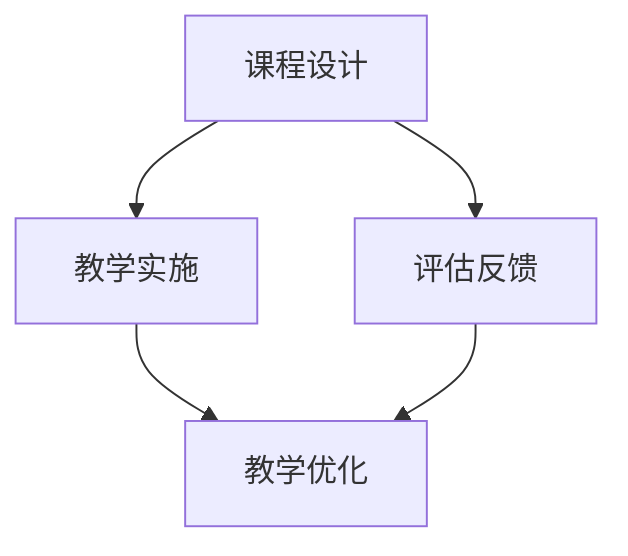

                 

# 《认知发展理论指导的AI课程学习系统》

## 关键词

认知发展理论、人工智能、课程学习系统、教育技术、个性化教学、教学评估

## 摘要

本文旨在探讨如何将认知发展理论应用于人工智能（AI）课程学习系统的设计、实施与优化中。通过回顾认知发展理论的基本概念和演进，以及AI课程学习系统的定义和特点，本文深入分析了认知发展理论在课程设计、教学过程和系统构建中的具体应用。此外，文章通过实际案例展示了认知发展理论指导下的AI课程学习系统如何实现个性化教学和有效评估，并展望了未来发展的趋势。

## 引言

在教育技术领域，人工智能（AI）的崛起为课程学习系统带来了革命性的变革。AI课程学习系统通过智能化的教学内容、个性化的学习路径和精准的评估反馈，极大地提升了学习效果和用户体验。然而，要实现这些目标，需要深入理解学生的学习过程和认知发展规律。认知发展理论为此提供了重要的理论依据和指导。

认知发展理论主要研究人类认知能力的发展和变化过程。自皮亚杰的认知发展阶段理论以来，认知发展理论经历了多个重要发展阶段，如维果茨基的社会文化理论和皮亚杰的认知建构主义理论。这些理论揭示了个体认知发展的阶段性和社会文化背景的影响，为教育提供了深刻的启示。

本文旨在结合认知发展理论，探讨如何设计和优化AI课程学习系统，使其更好地适应学生的认知发展规律，实现个性化教学和有效评估。文章将分为以下几个部分：

1. 认知发展理论概述
2. AI课程学习系统概述
3. 认知发展理论在AI课程学习系统中的应用
4. AI课程学习系统的构建与优化
5. 实际案例与教学实践
6. 评估与未来展望

## 认知发展理论概述

### 认知发展的基本概念

认知发展是指个体在成长过程中，感知、记忆、思维、语言等认知能力的逐渐成熟和完善。认知发展的核心概念包括：

1. **认知与意识**：认知是指个体对外界信息进行感知、处理、存储和利用的过程。意识是认知的高级形式，涉及对自身和外部世界的认识和理解。

2. **认知过程与结构**：认知过程包括感知、注意、记忆、思维、语言等。认知结构是指个体在认知过程中形成的信息加工和组织方式。

### 认知发展理论的演进

1. **皮亚杰的认知发展阶段理论**：瑞士心理学家皮亚杰提出了认知发展阶段理论，将认知发展分为四个阶段：感知运动阶段、前运算阶段、具体运算阶段和形式运算阶段。每个阶段都有其特定的认知特征和认知结构。

2. **维果茨基的社会文化理论**：维果茨基认为认知发展不仅是个体内部的过程，还受到社会文化背景的影响。他提出了最近发展区（ZPD）的概念，强调社会互动和语言在认知发展中的重要作用。

3. **皮亚杰的认知建构主义理论**：皮亚杰提出了认知建构主义理论，认为个体通过主动构建和调整内部认知结构来适应外部环境。学习是认知建构的过程，涉及感知、思考、反思和创造。

### 认知发展理论在教育教学中的应用

认知发展理论为教育教学提供了深刻的启示。根据不同认知发展阶段，教师可以设计适应学生认知水平的课程和教学策略。例如：

1. **课程目标的设定**：课程目标应与学生认知发展阶段相匹配，确保学生能够在认知上有所提高。

2. **课程内容的选择**：课程内容应充分考虑学生的认知特点和需求，避免超越学生的认知能力。

3. **教学方法的选择**：教学方法应基于学生的认知特点，采用互动、探索和反思等方式，激发学生的认知发展。

## AI课程学习系统概述

### AI课程学习系统的定义

AI课程学习系统是指利用人工智能技术，对教学内容、学习路径、评估反馈等方面进行智能化设计和优化的教育系统。AI课程学习系统具有以下特点：

1. **智能化**：通过机器学习和数据挖掘技术，AI课程学习系统能够根据学生的行为和表现，自动调整教学内容和路径，实现个性化教学。

2. **自适应**：AI课程学习系统能够根据学生的认知水平和学习进度，动态调整教学难度和内容，适应不同学生的需求。

3. **精准化**：AI课程学习系统能够通过实时数据分析和评估，为学生提供精准的反馈和指导，帮助学生及时调整学习策略。

4. **互动性**：AI课程学习系统通过虚拟助手、模拟实验和在线讨论等方式，增强学生与教学内容之间的互动，提高学习效果。

### AI课程学习系统的发展历程

1. **从教育技术到AI教育的转变**：随着计算机技术和互联网的发展，教育技术逐渐从传统的教学模式转向以学生为中心的个性化教学。AI技术的引入进一步推动了这一变革，使得教育系统能够更加智能化和精准化。

2. **人工智能在教育中的应用趋势**：未来，人工智能将在教育领域发挥更加重要的作用，包括智能辅导、个性化推荐、自动化评估等方面。随着技术的不断进步，AI课程学习系统将更加成熟和普及。

### 认知发展理论在AI课程学习系统中的重要性

认知发展理论为AI课程学习系统的设计提供了重要的理论依据。通过了解学生的认知发展阶段和特点，AI课程学习系统可以：

1. **适应学生的认知水平**：AI课程学习系统可以根据学生的认知发展水平，提供适当难度的教学内容，避免过度挑战或不足。

2. **促进学生的认知发展**：AI课程学习系统可以通过个性化教学和互动方式，激发学生的认知兴趣和动机，促进其认知发展。

3. **优化教学效果**：AI课程学习系统可以通过实时评估和反馈，帮助学生及时调整学习策略，提高学习效果。

## 认知发展理论在AI课程学习系统中的应用

### 课程设计中的应用

认知发展理论在课程设计中的应用主要体现在课程目标的设定、课程内容的选择和教学方法的选择等方面。

1. **课程目标的设定**：

   课程目标应与学生认知发展阶段相匹配，确保学生能够在认知上有所提高。例如，针对感知运动阶段的幼儿，课程目标可以设定为培养基本的感知和运动技能；针对形式运算阶段的中学生，课程目标可以设定为培养抽象思维和逻辑推理能力。

   ```mermaid
   graph TD
   A[感知运动阶段] --> B[基本感知与运动技能]
   A --> C[前运算阶段] --> D[具体概念与思维]
   A --> E[具体运算阶段] --> F[分类与序列]
   A --> G[形式运算阶段] --> H[抽象思维与逻辑推理]
   ```

2. **课程内容的选择**：

   课程内容应充分考虑学生的认知特点和需求，避免超越学生的认知能力。例如，对于感知运动阶段的幼儿，课程内容可以包括简单的形状识别、颜色匹配等；对于形式运算阶段的学生，课程内容可以包括复杂的数学问题、科学实验等。

   ```mermaid
   graph TD
   A[感知运动阶段] --> B[形状识别]
   A --> C[颜色匹配]
   A --> D[前运算阶段] --> E[分类]
   A --> D --> F[序列]
   A --> E --> G[具体运算阶段] --> H[数学问题]
   A --> E --> I[科学实验]
   A --> G --> J[形式运算阶段] --> K[抽象思维]
   A --> G --> L[逻辑推理]
   ```

3. **教学方法的选择**：

   教学方法应基于学生的认知特点，采用互动、探索和反思等方式，激发学生的认知兴趣和动机，促进其认知发展。例如，对于感知运动阶段的学生，可以采用游戏化教学，通过互动游戏培养感知和运动技能；对于形式运算阶段的学生，可以采用项目式学习，通过实际操作培养抽象思维和逻辑推理能力。

   ```mermaid
   graph TD
   A[感知运动阶段] --> B[游戏化教学]
   A --> C[前运算阶段] --> D[互动教学]
   A --> C --> E[探索教学]
   A --> D --> F[具体运算阶段] --> G[项目式学习]
   A --> D --> H[形式运算阶段] --> I[案例教学]
   ```

### 教学过程中的应用

认知发展理论在AI课程学习系统教学过程中的应用主要体现在学生学习过程的分析、AI教学工具的设计和评估与反馈等方面。

1. **学生学习过程的分析**：

   AI课程学习系统可以通过数据收集和分析，了解学生的学习过程和认知状态。例如，通过监测学生的在线行为，系统可以识别学生的学习习惯、学习兴趣和学习难点。基于这些信息，系统可以动态调整教学策略，提供个性化的学习支持。

   ```mermaid
   graph TD
   A[学生行为数据] --> B[学习习惯分析]
   A --> C[学习兴趣分析]
   A --> D[学习难点分析]
   ```

2. **AI教学工具的设计**：

   AI教学工具可以根据认知发展理论设计，以适应不同阶段学生的认知特点。例如，对于感知运动阶段的学生，可以设计互动式的教学工具，如虚拟实验室，以培养感知和运动技能；对于形式运算阶段的学生，可以设计逻辑推理游戏，以培养抽象思维和逻辑推理能力。

   ```mermaid
   graph TD
   A[感知运动阶段] --> B[虚拟实验室]
   A --> C[前运算阶段] --> D[互动式教学工具]
   A --> E[具体运算阶段] --> F[逻辑推理游戏]
   A --> G[形式运算阶段] --> H[抽象思维训练工具]
   ```

3. **评估与反馈**：

   AI课程学习系统可以通过实时评估和反馈，帮助学生及时调整学习策略，提高学习效果。评估指标可以包括学习进度、学习成果、学习态度等。基于这些指标，系统可以提供个性化的反馈和建议，帮助学生优化学习过程。

   ```mermaid
   graph TD
   A[学习进度评估] --> B[学习成果评估]
   A --> C[学习态度评估]
   B --> D[反馈机制]
   C --> E[学习策略调整]
   ```

### 评估与反馈

评估与反馈是认知发展理论在AI课程学习系统中的关键环节。通过实时评估和反馈，系统可以监测学生的学习过程和成果，提供个性化的学习支持。

1. **评估指标体系**：

   评估指标应包括学习进度、学习成果和学习态度等方面。学习进度评估可以反映学生的学习速度和稳定性，学习成果评估可以衡量学生的知识掌握程度和应用能力，学习态度评估可以了解学生的学习动机和行为习惯。

   ```mermaid
   graph TD
   A[学习进度评估] --> B[学习成果评估]
   A --> C[学习态度评估]
   ```

2. **反馈机制**：

   根据评估结果，系统可以提供个性化的反馈和建议。反馈内容可以包括学习进度提示、知识掌握情况、学习方法指导等。例如，对于学习进度较慢的学生，系统可以建议加强基础知识的学习；对于学习成果较差的学生，系统可以提供相关的学习资源和建议。

   ```mermaid
   graph TD
   A[评估结果] --> B[反馈机制]
   B --> C[学习进度提示]
   B --> D[知识掌握情况]
   B --> E[学习方法指导]
   ```

3. **学习策略调整**：

   基于评估和反馈，学生可以调整学习策略，优化学习过程。例如，学生可以根据反馈结果，调整学习时间、学习方式和学习内容，以提高学习效果。此外，学生还可以利用系统的推荐功能，选择适合自己的学习资源和辅导材料。

   ```mermaid
   graph TD
   A[反馈结果] --> B[学习策略调整]
   B --> C[学习时间调整]
   B --> D[学习方式调整]
   B --> E[学习内容调整]
   B --> F[资源推荐]
   ```

## AI课程学习系统的构建与优化

### 系统架构设计

AI课程学习系统的架构设计应考虑以下几个方面：

1. **前端设计**：

   前端设计应注重用户体验，界面简洁直观，易于操作。前端应包括课程展示、学习进度、评估反馈等模块。

   ```mermaid
   graph TD
   A[课程展示] --> B[学习进度]
   A --> C[评估反馈]
   ```

2. **后端设计**：

   后端设计应包括数据处理、算法实现和存储管理等模块。后端应实现数据收集、分析、存储和调用等功能。

   ```mermaid
   graph TD
   A[数据收集] --> B[数据分析]
   A --> C[数据存储]
   B --> D[算法实现]
   ```

3. **数据库设计**：

   数据库设计应包括用户信息、课程信息、学习记录等表结构。数据库应支持数据的快速查询和更新。

   ```mermaid
   graph TD
   A[用户信息] --> B[课程信息]
   A --> C[学习记录]
   ```

### 数据收集与处理

1. **数据收集**：

   数据收集包括学生行为数据、学习进度数据、评估结果数据等。数据收集应遵循隐私保护原则，确保学生数据的安全。

   ```mermaid
   graph TD
   A[学生行为数据] --> B[学习进度数据]
   A --> C[评估结果数据]
   ```

2. **数据处理**：

   数据处理包括数据清洗、数据分析和数据可视化等。数据处理应确保数据的准确性和可靠性，为教学决策提供支持。

   ```mermaid
   graph TD
   A[数据清洗] --> B[数据分析]
   A --> C[数据可视化]
   ```

### 系统开发与实现

1. **开发环境搭建**：

   开发环境包括服务器、数据库、编程工具等。开发环境应具备良好的性能和稳定性，支持系统的快速开发和部署。

   ```mermaid
   graph TD
   A[服务器] --> B[数据库]
   A --> C[编程工具]
   ```

2. **系统功能模块实现**：

   系统功能模块实现包括用户管理、课程管理、学习管理、评估管理等。每个模块应实现相应的功能，确保系统的稳定运行。

   ```mermaid
   graph TD
   A[用户管理] --> B[课程管理]
   A --> C[学习管理]
   A --> D[评估管理]
   ```

### 系统优化

1. **系统性能优化**：

   系统性能优化包括响应时间优化、系统稳定性优化等。优化应确保系统的高效运行和良好的用户体验。

   ```mermaid
   graph TD
   A[响应时间优化] --> B[系统稳定性优化]
   ```

2. **用户界面优化**：

   用户界面优化包括界面布局优化、交互体验优化等。优化应提高用户的操作效率和满意度。

   ```mermaid
   graph TD
   A[界面布局优化] --> B[交互体验优化]
   ```

3. **教学内容优化**：

   教学内容优化包括课程内容更新、学习资源丰富等。优化应确保教学内容的及时性和实用性。

   ```mermaid
   graph TD
   A[课程内容更新] --> B[学习资源丰富]
   ```

## 实际案例与教学实践

### 案例一：基于认知发展的编程教学

**教学目标**：

- 培养学生对编程的基本理解和兴趣
- 帮助学生掌握编程的基本语法和技能

**教学内容**：

- 基本编程概念
- 常用编程语言
- 编程实践项目

**教学方法**：

- 游戏化教学：通过编程游戏，激发学生的学习兴趣
- 项目式学习：通过实际项目，培养学生的编程能力

### 案例二：人工智能实验课程设计

**教学目标**：

- 帮助学生了解人工智能的基本原理和应用
- 培养学生的创新能力和实践能力

**教学内容**：

- 人工智能基础
- 常用人工智能算法
- 人工智能实验项目

**教学方法**：

- 案例教学：通过实际案例，引导学生了解人工智能的应用
- 实践教学：通过实验项目，培养学生的实践能力

## 评估与未来展望

### 评估指标体系

评估指标体系应包括学习进度、学习成果、学习态度等方面。具体指标如下：

1. **学习进度**：
   - 学习时长
   - 完成课程数
   - 学习频率

2. **学习成果**：
   - 知识掌握情况
   - 技能应用能力
   - 创新思维

3. **学习态度**：
   - 学习积极性
   - 学习习惯
   - 学习态度

### 评估方法与工具

1. **定量评估方法**：
   - 数据分析：通过数据收集和分析，评估学生的学习进度和成果
   - 量化指标：通过设置具体的量化指标，评估学生的学习态度

2. **定性评估方法**：
   - 问卷调查：通过问卷调查，了解学生的学习体验和反馈
   - 教师评价：通过教师评价，评估学生的学习效果和进步

### 未来发展趋势

1. **技术发展趋势**：
   - 人工智能技术的不断进步，将使AI课程学习系统更加智能化和精准化
   - 大数据和云计算技术的发展，将为AI课程学习系统提供强大的支持

2. **教育模式转变**：
   - 个性化教育的普及，将使学习更加个性化和灵活
   - 社会化学习的兴起，将使学习更加开放和互动

## 附录

### 附录A：认知发展理论在AI课程学习系统中的应用流程图



### 附录B：AI课程学习系统开发与优化伪代码示例

```python
# 数据收集
def collect_data():
    # 收集学生行为数据
    student_behavior_data = get_student_behavior_data()
    # 收集学习进度数据
    learning_progress_data = get_learning_progress_data()
    # 收集评估结果数据
    evaluation_result_data = get_evaluation_result_data()
    # 返回数据集
    return student_behavior_data, learning_progress_data, evaluation_result_data

# 数据处理
def process_data(student_behavior_data, learning_progress_data, evaluation_result_data):
    # 数据清洗
    cleaned_data = clean_data(student_behavior_data, learning_progress_data, evaluation_result_data)
    # 数据分析
    analyzed_data = analyze_data(cleaned_data)
    # 数据可视化
    visualize_data(analyzed_data)
    # 返回处理后的数据
    return analyzed_data

# 教学优化
def optimize_teaching(analyzed_data):
    # 根据数据分析结果，调整教学策略
    teaching_strategy = adjust_teaching_strategy(analyzed_data)
    # 更新课程内容
    update_course_content(teaching_strategy)
    # 返回优化后的教学方案
    return teaching_strategy
```

### 附录C：常见数学模型和数学公式

```latex
\documentclass{article}
\usepackage{amsmath}
\begin{document}
$$
E = mc^2
$$

$$
f(x) = x^2
$$

$$
\frac{d}{dx} f(x) = 2x
$$
\end{document}
```

## 总结

本文通过认知发展理论指导，探讨了AI课程学习系统的设计、实施和优化。从课程设计、教学过程、系统构建到评估与未来展望，认知发展理论为AI课程学习系统提供了重要的理论依据和指导。通过实际案例与教学实践，本文展示了认知发展理论在AI课程学习系统中的应用效果。未来，随着技术的不断发展，AI课程学习系统将更加智能化和个性化，为教育领域带来新的变革。

## 作者信息

作者：AI天才研究院/AI Genius Institute & 禅与计算机程序设计艺术 /Zen And The Art of Computer Programming

### 注意事项与拓展阅读

1. **注意事项**：

   - 在设计和实施AI课程学习系统时，应充分考虑学生的认知发展规律，确保教学内容的适宜性和教学方法的适用性。
   - 在数据收集和处理过程中，应遵循隐私保护原则，确保学生数据的安全和隐私。

2. **拓展阅读**：

   - 皮亚杰，《认知发展理论》
   - 维果茨基，《社会文化理论》
   - 刘慈欣，《三体》
   - 李开复，《人工智能》

通过拓展阅读，读者可以进一步了解认知发展理论和人工智能在教育中的应用，为实际教学提供更多的理论支持和实践指导。

