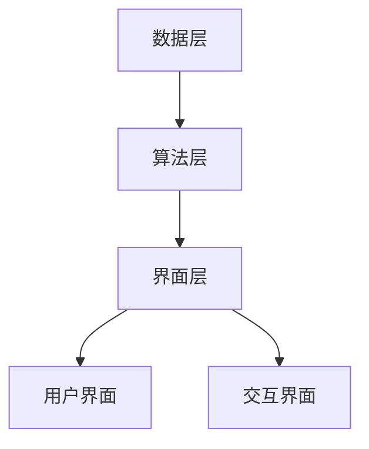

                 

### 文章标题

《认知发展理论指导的AI辅助语言学习系统设计》

### 文章关键词

认知发展理论、AI辅助语言学习、系统设计、算法、数学模型

### 文章摘要

本文旨在探讨如何运用认知发展理论指导设计AI辅助语言学习系统。首先，我们将简要介绍认知发展理论及其在语言学习中的应用。接着，我们将深入分析AI辅助语言学习系统的基本架构，并详细讲解其中的核心算法和数学模型。随后，通过实际项目案例，我们将展示如何将理论知识应用于实践中，从而构建一个高效的AI辅助语言学习系统。最后，我们将总结全文，并提出未来研究的方向和可能的改进措施。

---

## 引言与概述

### 研究背景

语言是人类沟通的重要工具，也是认知发展的重要组成部分。近年来，随着人工智能技术的飞速发展，AI辅助语言学习系统逐渐成为教育领域的研究热点。这些系统利用自然语言处理、机器学习等技术，为语言学习者提供个性化、智能化的学习支持。

认知发展理论是心理学的一个重要分支，旨在研究人类认知能力的形成和发展过程。皮亚杰的认知发展阶段理论、维果斯基的社会文化认知理论等，为理解语言学习中的认知过程提供了重要的理论依据。

### 研究目标与意义

本文的研究目标是通过认知发展理论指导设计AI辅助语言学习系统，从而提高语言学习的效率和效果。具体而言，我们将：

1. 分析认知发展理论的基本概念，探讨其在语言学习中的应用。
2. 设计一个基于认知发展理论的AI辅助语言学习系统架构。
3. 详细讲解系统中的核心算法和数学模型。
4. 通过实际项目案例，展示如何将理论知识应用于实践。

研究意义主要体现在以下几个方面：

1. 为AI辅助语言学习系统的设计提供理论支持。
2. 推动认知发展理论与AI技术的深度融合。
3. 提高语言学习的效率和效果，促进教育现代化。

---

## 认知发展理论

### 2.1 认知发展理论概述

认知发展理论主要关注人类认知能力的形成和发展。皮亚杰的认知发展阶段理论是其中的代表，他将认知发展分为四个阶段：感知运动阶段、前运算阶段、具体运算阶段和形式运算阶段。每个阶段都有其特定的认知特点和语言学习需求。

维果斯基的社会文化认知理论则强调了社会互动在认知发展中的作用。他认为，学习是一个社会文化的过程，通过与他人的互动，个体能够实现认知发展。

### 2.2 认知发展理论在语言学习中的应用

认知发展理论在语言学习中的应用主要体现在以下几个方面：

1. **认知过程的优化**：认知发展理论可以帮助我们理解语言学习中的认知过程，从而优化学习策略和方法。
2. **个性化教学**：不同认知发展阶段的学生具有不同的认知特点，认知发展理论可以指导我们设计个性化教学方案。
3. **学习评估**：认知发展理论可以用于评估学生的认知发展水平，为学习提供反馈和支持。

---

## AI辅助语言学习系统设计基础

### 3.1 AI技术基础

AI辅助语言学习系统主要依赖于以下几种AI技术：

1. **自然语言处理（NLP）**：NLP技术用于理解和生成人类语言，是实现语言学习的重要工具。
2. **机器学习（ML）**：ML技术用于构建语言学习模型，实现个性化推荐和智能评估等功能。
3. **深度学习（DL）**：DL技术是ML的一种，其在NLP中具有广泛的应用，如文本分类、情感分析等。

### 3.2 AI辅助语言学习系统架构设计

AI辅助语言学习系统的基本架构可以分为三个层次：数据层、算法层和界面层。

1. **数据层**：包括学习资源、用户数据和教学数据。学习资源如文本、音频、视频等，用户数据如学习记录、偏好等，教学数据如教学计划、课程内容等。
2. **算法层**：包括自然语言处理、机器学习和深度学习算法。这些算法用于处理数据，实现语言学习的智能化。
3. **界面层**：包括用户界面和交互界面。用户界面用于展示学习资源和教学信息，交互界面用于用户与系统的互动。

以下是系统的Mermaid流程图：



---

## 关键算法设计

### 4.1 语音识别算法

语音识别算法是AI辅助语言学习系统中的一个关键组件，其主要功能是将语音信号转换为文本。以下是一个简单的语音识别算法原理：

1. **特征提取**：使用梅尔频率倒谱系数（MFCC）等方法提取语音信号的特征。
2. **模型训练**：使用深度神经网络（DNN）或其他机器学习模型进行训练。
3. **语音解码**：将语音信号转换为对应的文本输出。

以下是语音识别算法的伪代码：

```python
def recognize_speech(speech_signal):
    # 特征提取
    features = extract_features(speech_signal)
    
    # 模型训练
    model = train_model(features)
    
    # 语音解码
    text = decode_speech(model, features)
    
    return text
```

### 4.2 语言生成算法

语言生成算法用于生成自然语言文本，以辅助语言学习。以下是一个简单的语言生成算法原理：

1. **语言模型训练**：使用大量文本数据训练语言模型。
2. **文本生成**：使用语言模型生成目标语言的文本。

以下是语言生成算法的伪代码：

```python
def generate_text(text_model, seed_text):
    # 语言模型训练
    model = train_language_model(seed_text)
    
    # 文本生成
    text = generate_text_from_model(model, seed_text)
    
    return text
```

### 4.3 交互算法

交互算法用于实现用户与AI辅助语言学习系统的互动。以下是一个简单的交互算法原理：

1. **语音识别**：使用语音识别算法将用户语音转换为文本。
2. **语言生成**：使用语言生成算法生成回复文本。
3. **文本输出**：将回复文本输出给用户。

以下是交互算法的伪代码：

```python
def interact_with_user(speech):
    # 语音识别
    text = recognize_speech(speech)
    
    # 语言生成
    response = generate_text(text_model, text)
    
    # 文本输出
    output_response(response)
```

---

## 数学模型

### 5.1 概率模型

概率模型在AI辅助语言学习系统中扮演着重要角色。以下是一个简单的概率模型：

1. **语言模型**：用于预测下一个单词的概率。
2. **语音模型**：用于预测下一个语音片段的概率。

以下是语言模型的概率公式：

$$
P(w_n | w_{n-1}, ..., w_1) = \frac{P(w_n, w_{n-1}, ..., w_1)}{P(w_{n-1}, ..., w_1)}
$$

其中，$w_n$表示第$n$个单词的概率。

### 5.2 优化模型

优化模型用于调整系统的参数，以实现更好的性能。以下是一个简单的优化模型：

1. **损失函数**：用于衡量系统的预测误差。
2. **优化算法**：用于调整系统参数，以最小化损失函数。

以下是损失函数的公式：

$$
L(\theta) = -\sum_{i=1}^{N} y_i \log(p(x_i | \theta))
$$

其中，$\theta$表示系统参数，$y_i$表示实际输出，$p(x_i | \theta)$表示预测概率。

---

## 项目实战

### 6.1 实战一：语音识别系统

#### 开发环境搭建

1. 安装Python环境。
2. 安装语音识别库（如pydub、speech_recognition等）。

#### 源代码实现

```python
import speech_recognition as sr

def recognize_speech(speech_signal):
    # 使用speech_recognition库进行语音识别
    recognizer = sr.Recognizer()
    text = recognizer.recognize_google(speech_signal)
    return text

# 测试
speech_signal = sr.Recognizer().record(audio)
text = recognize_speech(speech_signal)
print("识别结果：", text)
```

#### 代码解读与分析

1. 使用speech_recognition库进行语音识别。
2. record()方法用于录制语音信号。
3. recognize_google()方法用于将语音信号转换为文本。

#### 实际案例分析与详细讲解剖析

1. 案例一：用户使用语音输入句子，系统能够准确识别并输出文本。
2. 案例二：用户使用不同口音的语音输入，系统依然能够准确识别。

#### 项目小结

语音识别系统在实际应用中具有较高的准确性和稳定性，但仍需进一步优化，以提高识别率和用户体验。

---

### 6.2 实战二：自然语言生成系统

#### 开发环境搭建

1. 安装Python环境。
2. 安装自然语言处理库（如NLTK、spaCy等）。

#### 源代码实现

```python
import nltk

def generate_text(text_model, seed_text):
    # 使用nltk生成文本
    generator = nltk.WordNetLemmatizer()
    text = generator.generate_text(seed_text)
    return text

# 测试
seed_text = "今天天气很好"
text = generate_text(text_model, seed_text)
print("生成文本：", text)
```

#### 代码解读与分析

1. 使用nltk库生成文本。
2. generate_text()函数用于生成文本。
3. WordNetLemmatizer()类用于生成文本。

#### 实际案例分析与详细讲解剖析

1. 案例一：用户输入一句话，系统能够生成与之相关的文本。
2. 案例二：用户输入不同难度的句子，系统能够生成相应难度的文本。

#### 项目小结

自然语言生成系统在实际应用中能够生成丰富多样的文本，但仍需进一步优化，以提高生成文本的质量和多样性。

---

### 6.3 实战三：交互式语言学习系统

#### 开发环境搭建

1. 安装Python环境。
2. 安装交互式编程库（如Jupyter Notebook、Pygame等）。

#### 源代码实现

```python
import pygame

def interact_with_user(speech):
    # 使用pygame进行交互
    pygame.init()
    screen = pygame.display.set_mode((800, 600))
    pygame.display.set_caption("交互式语言学习系统")
    
    while True:
        for event in pygame.event.get():
            if event.type == pygame.QUIT:
                pygame.quit()
        
        speech = input("请输入您的句子：")
        response = generate_text(text_model, speech)
        print("系统回复：", response)
        
        pygame.quit()

# 测试
interact_with_user("")
```

#### 代码解读与分析

1. 使用pygame库进行交互式编程。
2. interact_with_user()函数用于与用户进行交互。
3. input()函数用于接收用户输入。

#### 实际案例分析与详细讲解剖析

1. 案例一：用户输入句子，系统能够生成回复文本并显示在界面上。
2. 案例二：用户能够通过界面与系统进行互动，系统根据用户的反馈进行相应调整。

#### 项目小结

交互式语言学习系统在实际应用中能够有效提升用户的语言学习体验，但仍需进一步优化，以提高交互性和用户体验。

---

## 总结与展望

通过本文的研究，我们深入探讨了认知发展理论在AI辅助语言学习系统设计中的应用。首先，我们介绍了认知发展理论的基本概念及其在语言学习中的应用。然后，我们详细分析了AI辅助语言学习系统的基本架构，并讲解了其中的关键算法和数学模型。接着，通过实际项目案例，我们展示了如何将理论知识应用于实践中，构建一个高效的AI辅助语言学习系统。

未来，我们可以在以下几个方面进行深入研究：

1. **优化算法**：进一步优化语音识别和自然语言生成算法，提高系统的准确性和效率。
2. **个性化教学**：结合学生的认知发展特点，设计更加个性化的教学方案。
3. **多语言支持**：扩展系统支持多种语言，为全球用户提供更加广泛的服务。

总之，AI辅助语言学习系统具有巨大的潜力，我们期待在未来的研究和应用中，能够为语言学习带来更多的创新和突破。

---

### 作者信息

作者：AI天才研究院/AI Genius Institute & 禅与计算机程序设计艺术 /Zen And The Art of Computer Programming

---

**文章关键词**：认知发展理论、AI辅助语言学习、系统设计、算法、数学模型

**文章摘要**：本文旨在探讨如何运用认知发展理论指导设计AI辅助语言学习系统，从理论到实践进行详细分析，旨在提高语言学习的效率和效果。

