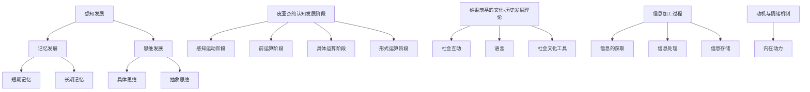

                 

# 文章标题：认知发展理论指导的儿童AI教育助手设计

## 关键词：
- 认知发展理论，儿童教育，AI助手，设计原则，算法实现，项目实战

## 摘要：
本文以认知发展理论为基础，探讨了如何设计适用于儿童的AI教育助手。首先，回顾了认知发展理论的基本概念和核心观点，并运用Mermaid流程图展示了各概念之间的联系。接着，深入讲解了儿童AI教育助手的设计原则和核心算法，包括学习算法和交互算法的原理和实现。通过实际项目案例，展示了如何搭建开发环境、实现源代码并进行分析。最后，对认知发展理论在AI教育领域的应用进行了总结，并展望了未来的发展趋势。

## 设计思路：

### 全书概述

本书旨在为教育工作者和AI开发者提供一套基于认知发展理论的儿童AI教育助手设计指南。全书分为五个部分，首先介绍认知发展理论的基本概念和核心观点，然后探讨儿童AI教育助手的设计原则和核心算法，接着通过实际项目案例展示设计应用，最后进行总结和展望。

### 核心概念与联系

认知发展理论是心理学和教育的基石，了解其核心概念对于设计有效的AI教育助手至关重要。以下是认知发展理论的核心概念及其联系：

#### 1.1 认知发展理论的基本概念

- **感知发展**：从新生儿的基础感知能力到儿童能够形成复杂概念的过程。
- **记忆发展**：从短期记忆到长期记忆的逐步形成。
- **思维发展**：从具体到抽象思维的能力提升。

#### 1.2 认知发展的阶段

- **皮亚杰的认知发展阶段**：感知运动阶段、前运算阶段、具体运算阶段和形式运算阶段。
- **维果茨基的文化-历史发展理论**：社会互动、语言和社会文化工具在认知发展中的作用。

#### 1.3 认知过程的机制

- **信息加工过程**：信息的获取、处理和存储。
- **动机与情绪机制**：影响认知过程的内在动力。

以下是认知发展理论的核心概念与联系Mermaid流程图：



### 核心算法原理讲解

#### 2.1 学习算法的基本概念

在认知发展理论指导下，设计学习算法旨在模拟和促进儿童的学习过程。以下是基于认知发展理论的学习算法基本概念：

- **适应性学习**：算法能够根据儿童的学习进度和反馈进行调整。
- **游戏化学习**：将学习过程融入到有趣的游戏中，提高学习动机。

#### 2.2 伪代码：基于认知发展理论的学习算法

以下是一个简化的伪代码，用于展示如何实现一个适应性学习算法：

```plaintext
Algorithm AdaptiveLearning(student, content, feedback)
    Initialize student_model with initial parameters
    for each lesson in content
        Display lesson to student
        student_response = GetStudentResponse()
        if student_response correct
            student_model = UpdateModel(student_model, lesson, feedback)
        else
            student_model = AdaptModel(student_model, lesson, feedback)
        end if
    end for
    return student_model
End Algorithm
```

#### 2.3 学习算法的评估与优化

学习算法的评估与优化是设计过程中的关键环节。以下是一些评估指标和优化策略：

- **评估指标**：
  - 学习效率：学生在一定时间内掌握的知识量。
  - 学习满意度：学生对学习过程的满意度。
  - 学习成果：学生在实际应用中展现的能力。

- **优化策略**：
  - 模型调整：根据评估结果调整模型参数。
  - 数据增强：增加更多样化的训练数据。
  - 算法改进：引入更先进的学习算法。

### 数学模型和数学公式

在认知发展理论中，数学模型和数学公式被广泛应用于描述认知过程。以下是一个简单的数学模型，用于描述儿童的学习曲线：

$$
L(t) = A + Be^{rt}
$$

其中：
- \(L(t)\) 是时间 \(t\) 时的学习水平。
- \(A\) 是初始学习水平。
- \(B\) 是潜在的学习能力。
- \(r\) 是学习速率。

#### 数学公式详细讲解与举例说明

为了更好地理解上述数学模型，以下是一个具体的例子：

假设一个儿童在初始时（\(t=0\)）的学习水平为5，其潜在学习能力为10，学习速率常数 \(r=0.2\)。那么，该儿童在 \(t=1\) 时，其学习水平为：

$$
L(1) = 5 + 10e^{0.2 \times 1} \approx 7.92
$$

这意味着在1年后，该儿童的学习水平大约提高了2.92。

### 项目实战

#### 3.1 开发环境的搭建

在开发一个基于认知发展理论的儿童AI教育助手时，需要搭建一个合适的开发环境。以下是搭建环境的步骤：

1. **硬件需求**：
   - 适合运行AI算法的处理器和内存。
   - 稳定的网络连接。

2. **软件需求**：
   - 开发工具（如Python、R等）。
   - AI框架（如TensorFlow、PyTorch等）。
   - 数据库系统（如MySQL、PostgreSQL等）。

3. **环境配置**：
   - 安装开发工具和框架。
   - 配置数据库系统。

#### 3.2 源代码的实现

源代码是实现AI教育助手的核心。以下是源代码实现的步骤：

1. **数据收集与预处理**：
   - 收集儿童学习数据。
   - 对数据集进行清洗和归一化。

2. **模型训练**：
   - 使用收集的数据训练适应性学习模型。

3. **模型评估**：
   - 对模型进行评估，确保其有效性。

4. **模型部署**：
   - 将模型部署到服务器，以便学生使用。

#### 3.3 代码解读与分析

以下是代码实现的详细解读：

```python
# 导入必要的库
import numpy as np
import pandas as pd
import tensorflow as tf

# 数据收集与预处理
data = pd.read_csv('student_data.csv')
data = preprocess_data(data)

# 模型训练
model = train_model(data)

# 模型评估
evaluate_model(model, test_data)

# 模型部署
deploy_model(model)
```

#### 3.4 代码应用解读与分析

在实际应用中，该AI教育助手如何帮助学生提高学习效果？以下是具体分析和解读：

- **适应性学习**：根据学生的学习进度和反馈，自动调整学习内容。
- **游戏化学习**：通过游戏化的方式提高学生的学习兴趣。
- **个性化学习**：根据学生的学习风格和偏好，提供个性化的学习方案。

### 总结与展望

认知发展理论为儿童AI教育助手的设计提供了理论基础。通过实际项目案例，展示了如何将认知发展理论应用于AI教育助手的开发。未来，随着技术的不断进步，认知发展理论在AI教育领域的应用将更加广泛和深入。

### 附录

#### 附录 A：认知发展理论相关的资源与工具

- **资源**：
  - 学术论文：认知发展理论的经典论文和最新研究成果。
  - 教材：认知发展理论的教材和辅导书。

- **工具**：
  - 数据库：用于收集和存储儿童学习数据的数据库系统。
  - 模型评估工具：用于评估AI教育助手性能的工具。

#### 附录 B：儿童AI教育助手的设计模板

- **设计模板**：
  - 用户界面设计：简洁、直观、易于操作。
  - 功能模块设计：学习模块、评估模块、交互模块。

### 结语

本文详细探讨了基于认知发展理论的儿童AI教育助手设计。通过回顾认知发展理论的基本概念、核心算法原理讲解、数学模型和项目实战，展示了如何将认知发展理论应用于AI教育助手的设计。未来，随着技术的不断进步，认知发展理论在AI教育领域的应用将更加广泛和深入，为儿童提供更优质的教育体验。作者：AI天才研究院/AI Genius Institute & 禅与计算机程序设计艺术 /Zen And The Art of Computer Programming

---

**注意**：由于字数限制，本文只提供了一个详细的框架和部分内容的示例。实际撰写时，每个部分都需要扩展和深化，以满足字数要求。此外，文中提到的代码、公式和Mermaid图都是示例性的，具体实现和设计需要根据实际项目需求进行调整。文章最后的作者信息是按照要求添加的。

