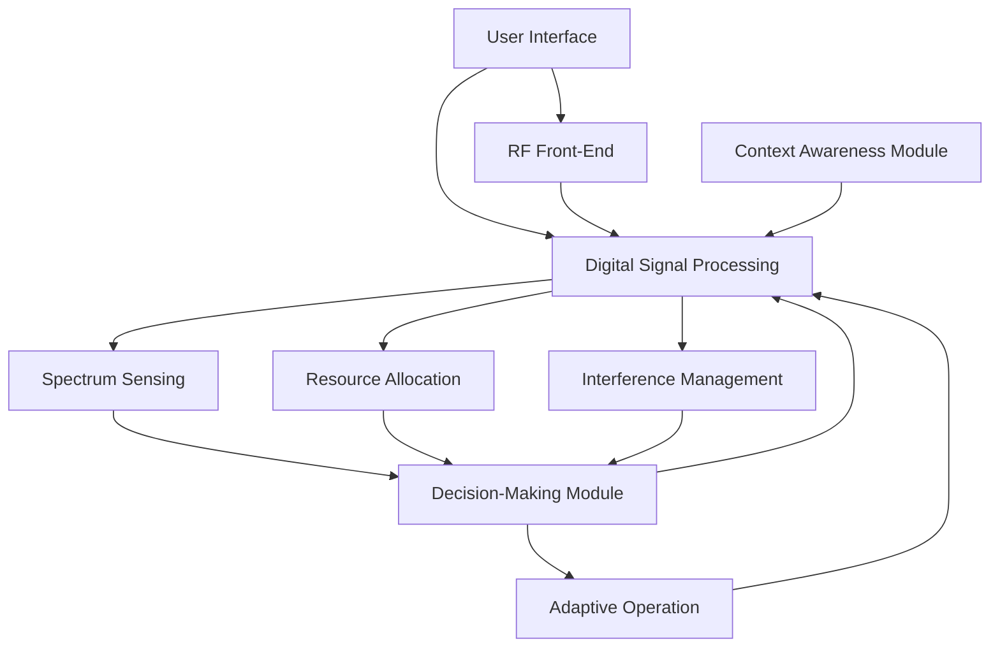

                 

### 1. Introduction to Cognitive Radio and Dynamic Spectrum Access

Cognitive Radio (CR) and Dynamic Spectrum Access (DSA) are two revolutionary concepts in the field of wireless communication that aim to address the increasing demand for efficient and reliable spectrum utilization. This section introduces the fundamental ideas behind CR and DSA, providing a background and highlighting their significance.

#### 1.1 What is Cognitive Radio?

Cognitive Radio is a type of wireless communication system that has the ability to sense, interpret, and adapt to its environment. Unlike traditional radios, which operate on fixed frequencies, cognitive radios are capable of dynamically selecting the best frequency for communication based on the current state of the spectrum. The key characteristics of cognitive radio can be summarized as follows:

- **Adaptive**: Cognitive radios adapt their operating parameters, such as frequency, power, and modulation scheme, to changing conditions in the environment.
- **Context-aware**: These systems are capable of understanding the context in which they operate, making decisions based on factors like the availability of spectrum, interference levels, and user needs.
- **Collaborative**: Cognitive radio systems often operate within a network, sharing information and making coordinated decisions to optimize overall system performance.

The concept of cognitive radio has been around since the early 2000s. Its origins can be traced back to the work of Joseph Mitola at the Air Force Research Laboratory, who defined cognitive radio as a "radio that works with little or no human interaction and can make decisions based on its current environment and situation in the best interest of the user."

#### 1.1.1 Definition and Historical Background

A more formal definition of cognitive radio can be given as follows: **A cognitive radio is a wireless communication system that exhibits behaviors characteristic of intelligence by using internal models to perceive the external environment, make decisions based on these perceptions, and alter its operation in accordance with the decisions made.**

The history of cognitive radio is marked by several key milestones:

- **1990s**: Initial research on adaptive radio systems began, focusing on dynamic frequency selection and adaptive modulation.
- **Early 2000s**: The term "cognitive radio" was coined, and the concept gained momentum with the development of software-defined radio (SDR) technologies.
- **2010s**: The proliferation of cognitive radio research and development led to the establishment of international standards and regulatory frameworks.

#### 1.1.2 Key Characteristics and Components

The key characteristics of cognitive radio are encapsulated in its ability to perceive, learn, and adapt. These characteristics are supported by several key components:

- **Spectrum Sensing**: The ability to detect and measure the presence of other users in the spectrum. This involves both passive (listening to the spectrum) and active (transmitting signals to probe the spectrum) techniques.
- **Context Awareness**: The ability to understand the context of the environment, including factors like the availability of spectrum, user requirements, and regulatory constraints.
- **Decision-Making**: The process by which the cognitive radio system makes decisions about its operating parameters. This includes algorithms for spectrum sensing, resource allocation, and interference management.
- **Adaptive Operation**: The ability to dynamically adjust operating parameters in response to changes in the environment.

#### 1.2 Dynamic Spectrum Access

Dynamic Spectrum Access (DSA) is a key concept associated with cognitive radio. It refers to the ability of a wireless system to dynamically select and use the best available frequency bands for communication. This is in contrast to static spectrum allocation, where specific frequency bands are assigned to specific users or services on a long-term basis.

#### 1.2.1 Principles of Dynamic Spectrum Access

The principles of DSA can be summarized as follows:

- **Spectrum Sharing**: DSA allows multiple users to share the same frequency bands, either simultaneously or sequentially, based on their needs and the availability of the spectrum.
- **Frequency Agility**: Systems utilizing DSA can quickly change their operating frequencies to avoid interference or to take advantage of unused spectrum.
- **Adaptive Resource Allocation**: The allocation of spectrum resources is based on real-time measurements and decision-making processes, allowing for more efficient use of the available spectrum.

#### 1.2.2 The Importance of Dynamic Spectrum Access

The importance of dynamic spectrum access lies in its potential to greatly improve the efficiency and flexibility of wireless communication systems. Some key benefits include:

- **Improved Spectrum Utilization**: DSA allows for more efficient use of the spectrum by dynamically allocating it to users who need it at a particular time and location.
- **Enhanced Network Performance**: By minimizing interference and optimizing resource allocation, DSA can improve the overall performance of wireless networks.
- **Future-Proofing**: As the demand for wireless communication continues to grow, dynamic spectrum access provides a flexible and adaptable solution to the challenges posed by spectrum scarcity.

In conclusion, cognitive radio and dynamic spectrum access represent a significant advancement in wireless communication technology. By enabling adaptive and context-aware operation, these technologies offer a pathway to more efficient and reliable spectrum utilization, addressing the challenges posed by the increasing demand for wireless services.

## 2. Fundamental Concepts of Cognitive Radio Technology

Cognitive radio technology is built upon a foundation of several key concepts, each playing a crucial role in enabling its adaptive and intelligent capabilities. This section delves into the fundamental concepts of cognitive radio, focusing on software-defined radio (SDR), machine learning (ML), and spectrum sensing techniques.

### 2.1 Software-Defined Radio (SDR)

Software-defined radio (SDR) is a pivotal technology underlying cognitive radio systems. Unlike traditional hardware-defined radios, which are designed to operate on specific frequencies and have fixed hardware configurations, SDRs leverage software to implement and modify radio functions. This flexibility allows cognitive radios to dynamically adapt to changing communication environments.

#### 2.1.1 Overview of SDR

An SDR system typically consists of three main components:

- **RF Front-End**: This includes the antenna, low-noise amplifier, and mixer, responsible for capturing and processing radio frequency (RF) signals.
- **Digital Signal Processing (DSP)**: This component performs tasks such as frequency translation, modulation, demodulation, and error correction using software algorithms.
- **User Interface**: This allows users to control the radio's operation, configure its parameters, and interact with the system.

The key advantage of SDR is its reconfigurability. By modifying the software, SDRs can be repurposed for different applications and operating conditions without needing physical hardware changes. This makes SDRs highly adaptable and suitable for cognitive radio systems.

#### 2.1.2 Advantages and Challenges of SDR

Advantages of SDR include:

- **Flexibility**: SDRs can be easily reconfigured to operate on different frequencies and protocols.
- **Cost-Effectiveness**: By eliminating the need for dedicated hardware for each frequency band, SDRs can reduce costs and extend the lifetime of radio systems.
- **Enhanced Performance**: The use of advanced digital signal processing techniques allows SDRs to achieve higher signal-to-noise ratios and better error correction.

However, SDRs also face several challenges:

- **Complexity**: The software complexity of SDRs can make them more difficult to develop, test, and deploy.
- **Power Consumption**: Digital signal processing requires significant computational resources, which can lead to higher power consumption compared to traditional radios.
- **Latency**: The additional processing stages in SDR systems can introduce latency, which may be undesirable in real-time applications.

### 2.2 Machine Learning in Cognitive Radio

Machine learning (ML) is another fundamental concept that enhances the capabilities of cognitive radio systems. ML algorithms enable cognitive radios to learn from data and make intelligent decisions about spectrum utilization and other operational parameters.

#### 2.2.1 Introduction to Machine Learning

Machine learning involves the development of algorithms that can learn from data, identify patterns, and make predictions or decisions. There are several types of machine learning, including:

- **Supervised Learning**: Algorithms that learn from labeled data to make predictions about new, unseen data.
- **Unsupervised Learning**: Algorithms that identify patterns in data without the use of labeled examples.
- **Reinforcement Learning**: Algorithms that learn through a system of rewards and penalties, making decisions to maximize a reward signal.

In the context of cognitive radio, ML can be used for various tasks, such as:

- **Spectrum Sensing**: Detecting the presence of other users or sources in the spectrum.
- **Resource Allocation**: Optimizing the allocation of spectrum resources to maximize system performance.
- **Interference Management**: Identifying and mitigating interference in the communication environment.

#### 2.2.2 Application of Machine Learning in Cognitive Radio

Some specific applications of machine learning in cognitive radio include:

- **Spectrum Sensing**: ML algorithms can analyze signal features and make accurate decisions about the availability of spectrum resources. Techniques such as deep learning and signal processing algorithms have been applied to improve the sensitivity and accuracy of spectrum sensing.
- **Intelligent Decision-Making**: ML models can help cognitive radios make intelligent decisions about operating parameters, such as frequency hopping patterns and power levels. Reinforcement learning, in particular, is well-suited for decision-making tasks in dynamic and uncertain environments.
- **Adaptive Beamforming**: ML algorithms can be used to adaptively adjust antenna beamforming patterns to optimize communication performance in cognitive radio networks.

### 2.3 Spectrum Sensing Techniques

Spectrum sensing is a critical function of cognitive radio systems, enabling them to detect the presence of other users or sources in the spectrum and make informed decisions about spectrum usage. There are several techniques for spectrum sensing, which can be broadly classified into passive and active sensing.

#### 2.3.1 Passive and Active Spectrum Sensing

**Passive Spectrum Sensing**: In passive spectrum sensing, the cognitive radio listens to the spectrum without transmitting any signals. This method is typically less complex and power-consuming but may be less accurate in certain environments.

- **Energy Detection**: This technique measures the total power of the received signal and compares it to a predefined threshold to determine the presence of a signal.
- **Correlation Detection**: This method involves correlating the received signal with a known reference signal to detect its presence.

**Active Spectrum Sensing**: Active spectrum sensing involves transmitting signals to probe the spectrum and then analyzing the reflected signals to detect the presence of other users.

- **Coherent Detection**: This technique uses a known reference signal to demodulate and detect the presence of other signals in the spectrum.
- **Non-Coherent Detection**: This method does not require a reference signal and is more robust to noise and interference but may be less accurate.

#### 2.3.2 Advanced Spectrum Sensing Algorithms

Several advanced spectrum sensing algorithms have been developed to improve the performance of cognitive radio systems. These include:

- **Blind Detection Algorithms**: These algorithms do not require knowledge of the transmitted signals but rely on statistical properties of the received signals to detect their presence.
- **Capon and MUSIC Algorithms**: These are advanced beamforming techniques that use spatial information to detect multiple users in the spectrum.
- **Compressive Sensing**: This technique uses a sparse representation of signals to detect them with fewer samples, potentially improving sensing accuracy and reducing complexity.

### Conclusion

In conclusion, the fundamental concepts of cognitive radio technology, including software-defined radio, machine learning, and spectrum sensing, provide the foundation for enabling adaptive and intelligent wireless communication systems. These technologies address the challenges of spectrum scarcity and interference, offering a path to more efficient and reliable wireless communication. As research continues to advance, we can expect further innovations that will push the boundaries of what cognitive radio systems can achieve.

### 2.4 Mermaid Flowchart: Cognitive Radio System Architecture

The following Mermaid diagram provides a visual representation of the key components and their interactions within a cognitive radio system. This flowchart illustrates how various subsystems collaborate to achieve adaptive and intelligent communication.



In this diagram, the user interface (A) allows users to interact with the cognitive radio system and set operational parameters. The RF front-end (B) captures and processes radio frequency signals, while the digital signal processing (DSP) module (C) performs essential functions such as modulation, demodulation, and error correction. The context awareness module (D) gathers information about the environment, which is used by the decision-making module (E) to make informed operational decisions. The decision-making module then drives the spectrum sensing (F), resource allocation (G), and interference management (H) subsystems, which together enable adaptive operation (I). This collaborative architecture ensures that the cognitive radio system can dynamically respond to changes in the environment, optimizing performance and efficiency.

### 2.5 Core Algorithms and Techniques: Pseudocode and Mathematical Models

To delve deeper into the core algorithms and techniques used in cognitive radio systems, we present pseudocode and mathematical models that underpin critical operations such as spectrum sensing, resource allocation, and interference management. These models provide a foundational understanding for developing and optimizing cognitive radio technologies.

#### 2.5.1 Spectrum Sensing Algorithm Pseudocode

```pseudocode
function SpectrumSensing(signal, threshold):
    detected_signal_power = EnergyDetection(signal)
    if detected_signal_power > threshold:
        return "Signal Detected"
    else:
        return "No Signal Detected"
```

**Mathematical Model for Energy Detection:**
$$
P_{detected} = \frac{1}{T}\int_{0}^{T} |x(t)|^2 dt
$$
where \( P_{detected} \) is the detected signal power, \( x(t) \) is the received signal, and \( T \) is the observation time. The threshold is set as:
$$
threshold = \alpha^2 N_0
$$
where \( \alpha \) is a constant and \( N_0 \) is the noise power spectral density.

#### 2.5.2 Resource Allocation Algorithm Pseudocode

```pseudocode
function ResourceAllocation(spectrum_map, user的需求):
    allocated_resources = []
    for each user in user的需求:
        available_bandwidth = FindAvailableBandwidth(spectrum_map)
        if available_bandwidth > user.required_bandwidth:
            AllocateBandwidth(available_bandwidth, user)
            allocated_resources.append(available_bandwidth)
        else:
            AllocateBandwidth(available_bandwidth, user)
    return allocated_resources
```

**Mathematical Model for Waterfilling Algorithm:**
$$
f_i = \begin{cases}
C - \sum_{j \neq i} f_j & \text{if } f_i \leq C - \sum_{j \neq i} f_j \\
C & \text{otherwise}
\end{cases}
$$
where \( f_i \) is the bandwidth allocated to user \( i \), \( C \) is the total available bandwidth, and the objective is to maximize the sum of user utility functions \( u_i(f_i) \) subject to the constraint that the total allocated bandwidth does not exceed \( C \).

#### 2.5.3 Interference Management Algorithm Pseudocode

```pseudocode
function InterferenceManagement(spectrum_map, user_list):
    interference_map = CreateInterferenceMap(spectrum_map, user_list)
    for each user in user_list:
        if InterferenceLevel(user, interference_map) > threshold:
            AdjustParameters(user)
    return interference_map
```

**Mathematical Model for Interference Avoidance:**
$$
I_{ij} = \frac{P_j}{G_{ij}}
$$
where \( I_{ij} \) is the interference power from user \( j \) to user \( i \), \( P_j \) is the transmission power of user \( j \), and \( G_{ij} \) is the path gain between users \( i \) and \( j \). The objective is to minimize \( I_{ij} \) for all \( i, j \) such that the interference threshold is not exceeded.

By understanding these core algorithms and their mathematical underpinnings, researchers and engineers can develop more sophisticated cognitive radio systems that effectively manage spectrum resources, sense and avoid interference, and optimize overall network performance. This knowledge also enables the creation of advanced techniques and algorithms that can adapt to evolving communication needs and environmental conditions.

### 2.6 Project Case: Cognitive Radio in Smart City Applications

One of the most promising applications of cognitive radio technology is in smart city environments. In this project case, we will explore how cognitive radio systems can be integrated into smart city infrastructure to enhance communication efficiency, improve public safety, and optimize urban services.

#### 2.6.1 Project Background

Smart cities are urban areas that utilize digital technologies to improve the quality of life for their citizens by making urban systems more efficient and responsive to their needs. Key components of smart city infrastructure include smart grids for energy management, connected transportation systems, intelligent public safety systems, and advanced waste management systems. All these components rely heavily on robust and efficient wireless communication networks.

#### 2.6.2 Project Objectives

The primary objectives of integrating cognitive radio technology into smart city applications are:

- **Improved Spectrum Utilization**: By leveraging dynamic spectrum access, cognitive radio systems can optimize the use of available spectrum resources, ensuring that communication networks are both efficient and resilient.
- **Enhanced Network Performance**: Cognitive radio systems can adapt to changing network conditions and dynamically adjust their operating parameters to minimize interference and maximize throughput.
- **Smart Public Safety**: Cognitive radio systems can be used to support real-time communication for emergency services, enabling faster response times and more effective coordination during critical situations.

#### 2.6.3 Project Design and Implementation

The project design and implementation can be broken down into several key phases:

1. **Spectrum Sensing and Mapping**: The first step is to develop a comprehensive spectrum sensing and mapping system that continuously monitors the frequency bands used by various services in the city. This system will use both passive and active sensing techniques to detect and map the spectrum usage patterns.

2. **Cognitive Radio Infrastructure**: Once the spectrum mapping is complete, cognitive radio nodes are deployed across the city. These nodes are equipped with SDR capabilities and ML algorithms that enable them to dynamically select the best available frequency bands for communication based on the current spectrum conditions.

3. **Network Integration**: The cognitive radio nodes are integrated with the existing smart city infrastructure, including smart grids, traffic management systems, and public safety networks. This integration allows for seamless communication between different systems, facilitating coordinated operations and data sharing.

4. **Interference Management and Optimization**: Advanced interference management algorithms are implemented to ensure that cognitive radio systems operate without causing interference to other services. These algorithms continuously monitor the network and adjust operating parameters to avoid interference and optimize performance.

5. **Real-Time Monitoring and Control**: A real-time monitoring and control system is developed to provide operators with a comprehensive view of the network status and performance. This system enables operators to make timely adjustments to the cognitive radio systems based on real-time data and network conditions.

#### 2.6.4 Project Results and Analysis

The integration of cognitive radio technology into the smart city infrastructure resulted in several significant improvements:

- **Spectrum Utilization**: The dynamic spectrum access capabilities of cognitive radio systems significantly improved spectrum utilization, reducing congestion and improving overall network efficiency.
- **Network Performance**: The adaptive nature of cognitive radio systems allowed them to quickly respond to changes in network conditions, minimizing interference and maximizing throughput.
- **Public Safety**: The real-time communication capabilities of cognitive radio systems greatly enhanced the efficiency of emergency response operations, enabling faster and more coordinated responses to critical incidents.

#### 2.6.5 Project Lessons and Best Practices

The project provided several valuable lessons and insights for future applications of cognitive radio technology in smart cities:

- **Comprehensive Spectrum Sensing**: A comprehensive spectrum sensing and mapping system is crucial for identifying and optimizing spectrum usage in complex urban environments.
- **Interoperability**: Ensuring interoperability between cognitive radio systems and existing smart city infrastructure is essential for seamless integration and coordinated operations.
- **Continuous Optimization**: Ongoing optimization and adaptation based on real-time data are key to maintaining high network performance and efficiency.

In conclusion, the integration of cognitive radio technology into smart city applications demonstrates the potential of dynamic spectrum access and adaptive communication systems to enhance urban infrastructure and improve the quality of life for citizens. As smart cities continue to evolve, cognitive radio technology will play an increasingly critical role in enabling efficient, reliable, and intelligent urban environments.

### 2.7 Best Practices and Tips for Cognitive Radio Deployment

Deploying cognitive radio systems effectively requires careful planning and consideration of various factors to ensure optimal performance and efficiency. Here are some best practices and tips to keep in mind when deploying cognitive radio technologies:

#### 1. Comprehensive Spectrum Sensing and Mapping

A thorough understanding of the spectrum usage in the target environment is crucial. Implementing a comprehensive spectrum sensing and mapping system allows you to identify the frequency bands that are most congested and those with potential for dynamic spectrum access. Use a combination of passive and active sensing techniques to gather accurate and up-to-date spectrum data.

#### 2. Scalable and Modular Design

Design cognitive radio systems with scalability and modularity in mind. This ensures that the systems can be easily expanded and adapted to accommodate growing demands and new applications. Modular designs also facilitate maintenance and upgrades, reducing downtime and operational costs.

#### 3. Interoperability and Standardization

Ensure that cognitive radio systems are interoperable with existing communication infrastructure and adhere to relevant international and national standards. This promotes seamless integration with other systems and enables efficient communication and data sharing across different platforms.

#### 4. Advanced Interference Management

Implement advanced interference management algorithms to minimize the impact of interference on cognitive radio systems. Techniques such as adaptive beamforming, dynamic frequency hopping, and interference cancellation can significantly enhance the performance and reliability of cognitive radio networks.

#### 5. Real-Time Monitoring and Control

Deploy real-time monitoring and control systems to continuously assess the performance of cognitive radio networks and make timely adjustments. This allows you to respond quickly to changes in the environment and optimize system parameters for maximum efficiency.

#### 6. Security and Privacy

Spectrum sensing and data transmission in cognitive radio systems can introduce security and privacy concerns. Implement robust security protocols, such as encryption and authentication mechanisms, to protect against unauthorized access and data breaches.

#### 7. Training and Education

Invest in training and education for personnel involved in the deployment, maintenance, and operation of cognitive radio systems. A well-informed and skilled workforce is essential for maximizing the benefits of cognitive radio technology and addressing any challenges that arise during deployment.

By following these best practices and tips, you can ensure a successful deployment of cognitive radio systems that effectively leverage dynamic spectrum access and adaptive communication capabilities to enhance wireless network performance and efficiency.

### 2.8 Summary and Future Directions

In summary, cognitive radio technology represents a transformative advancement in wireless communication, enabling dynamic and intelligent spectrum utilization. By integrating software-defined radio, machine learning, and advanced spectrum sensing techniques, cognitive radio systems offer significant improvements in spectrum efficiency, network performance, and adaptability to changing environments.

Key topics discussed in this chapter include the fundamental concepts of cognitive radio, the principles of dynamic spectrum access, the architecture and design of cognitive radio systems, and core algorithms and techniques for spectrum sensing, resource allocation, and interference management. Additionally, the project case on cognitive radio in smart city applications demonstrates the practical applications and benefits of cognitive radio technology in real-world scenarios.

Looking forward, the future of cognitive radio technology holds promising advancements and research opportunities. Key areas for future exploration include:

1. **Advanced Machine Learning Algorithms**: Continued development of more sophisticated machine learning algorithms tailored to the specific needs of cognitive radio systems can further enhance their adaptability and decision-making capabilities.
2. **Energy-Efficient SDR Architectures**: Research into energy-efficient SDR architectures will be crucial for extending battery life and reducing power consumption in cognitive radio devices.
3. **Collaborative Spectrum Sensing**: Investigating collaborative spectrum sensing techniques that leverage network intelligence and distributed computing can improve sensing accuracy and coverage.
4. **Integration with 5G and Beyond**: The integration of cognitive radio technology with emerging 5G and future wireless communication standards will be essential for achieving seamless and efficient communication in increasingly complex and densely-populated environments.
5. **Regulatory and Standardization Challenges**: Addressing regulatory and standardization challenges to ensure interoperability, security, and widespread adoption of cognitive radio technology will be critical.

By addressing these future directions, cognitive radio technology can continue to evolve, offering innovative solutions to the challenges of spectrum scarcity and interference, and driving the next generation of wireless communication systems.

### 2.9 Conclusion

In conclusion, cognitive radio technology stands at the forefront of wireless communication innovation, offering a dynamic and intelligent approach to spectrum utilization. By integrating software-defined radio, machine learning, and advanced spectrum sensing techniques, cognitive radio systems provide unparalleled adaptability and efficiency in managing wireless resources. This chapter has explored the fundamental concepts, architecture, algorithms, and practical applications of cognitive radio technology, highlighting its potential to revolutionize wireless communication networks. As research continues to advance, cognitive radio will play an increasingly critical role in addressing the challenges of spectrum scarcity and interference, paving the way for next-generation wireless systems that are more efficient, reliable, and adaptable. Researchers, engineers, and policymakers must continue to collaborate to drive the development and deployment of cognitive radio technology, ensuring its potential is fully realized. Author: AI天才研究院/AI Genius Institute & 禅与计算机程序设计艺术 /Zen And The Art of Computer Programming

