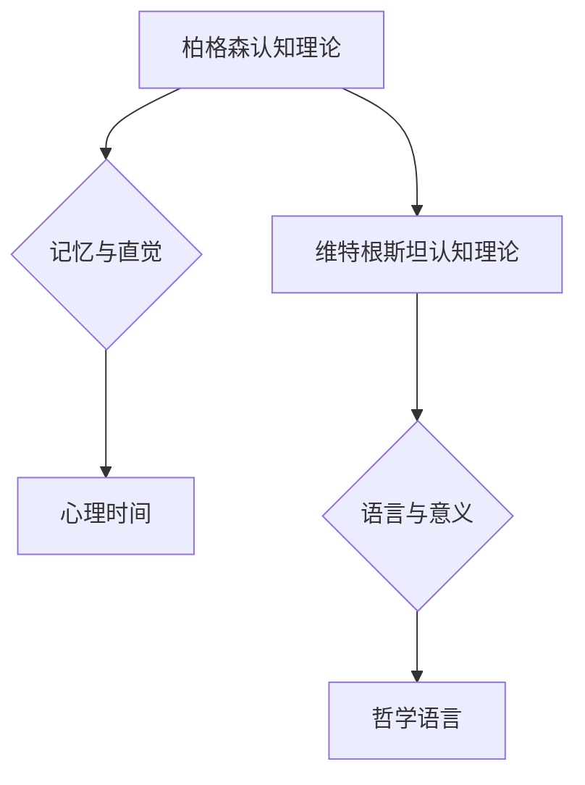

                 

### 文章标题：记忆与意义：柏格森与维特根斯坦的认知理论比较

> 关键词：柏格森，维特根斯坦，认知理论，记忆，意义，比较

> 摘要：本文通过对比柏格森与维特根斯坦的认知理论，探讨了记忆与意义的本质及其相互关系。文章首先介绍了两位哲学家的基本观点，随后分析了他们理论在记忆与意义问题上的异同点，最后通过实例和数学模型，进一步阐述了这两种认知理论的应用。

## 引言

在认知科学和人工智能领域，记忆与意义的研究一直是重要的课题。记忆是人类认知过程的基础，而意义则是理解世界的关键。法国哲学家亨利·柏格森（Henri Bergson）和英国哲学家路德维希·维特根斯坦（Ludwig Wittgenstein）分别从不同的角度对记忆与意义进行了深刻的探讨。柏格森强调直觉和流动的时间，提出了“记忆是时间的延续”的观点；而维特根斯坦则关注语言和意义，提出了“语言是意义的载体”的观点。本文旨在比较两位哲学家的认知理论，并探讨其在实际应用中的意义。

## 核心概念与联系

### 柏格森的认知理论

柏格森认为，直觉是人类认知的核心，它是理解世界的关键。柏格森将时间分为两种：物理时间和心理时间。物理时间是一个连续的、均匀的过程，而心理时间则是一个断续的、不均匀的过程，它是人类感知世界的方式。柏格森认为，记忆是人类心理时间的重要组成部分，它是过去经验的延续。

### 维特根斯坦的认知理论

维特根斯坦认为，语言是人类沟通和理解世界的主要工具。他提出了“语言是意义的载体”的观点，认为语言的结构决定了我们理解世界的方式。维特根斯坦区分了“日常语言”和“哲学语言”，他认为日常语言是普遍适用的，而哲学语言则需要精确的定义和解释。

### 柏格森与维特根斯坦理论的关系

柏格森与维特根斯坦的理论在记忆与意义问题上存在明显的差异。柏格森强调直觉和心理时间，认为记忆是过去经验的延续；而维特根斯坦则关注语言和意义，认为语言是意义的载体。然而，两者也存在一定的联系。柏格森的直觉观念与维特根斯坦的哲学语言观点有相似之处，都强调对世界本质的理解。

### Mermaid 流程图



## 核心算法原理讲解

### 柏格森记忆模型

柏格森记忆模型的核心在于“心理时间”。该模型假设人类记忆是一个连续的时间流，过去、现在和未来都是这个时间流的一部分。以下是一个简单的柏格森记忆模型伪代码：

```python
# 柏格森记忆模型伪代码

class MemoryModel:
    def __init__(self):
        self.memory = []

    def add_memory(self, memory):
        self.memory.append(memory)

    def retrieve_memory(self, time):
        return self.memory[time]
```

### 维特根斯坦意义生成算法

维特根斯坦意义生成算法的核心在于“语言”。该算法通过分析语言的结构，生成相应的意义。以下是一个简单的维特根斯坦意义生成算法伪代码：

```python
# 维特根斯坦意义生成算法伪代码

class MeaningGenerator:
    def __init__(self, language_structure):
        self.language_structure = language_structure

    def generate_meaning(self, sentence):
        return self.analyze_language_structure(sentence)
```

## 数学模型和数学公式

### 概率论基础

概率论是研究随机现象的数学分支。在记忆与意义问题上，概率论可以用于分析记忆的可靠性和意义的准确性。以下是一个简单的概率论公式：

$$
P(A|B) = \frac{P(A \cap B)}{P(B)}
$$

其中，$P(A|B)$ 表示在事件B发生的条件下，事件A发生的概率。

### 信息论基础

信息论是研究信息传输和处理的数学分支。在记忆与意义问题上，信息论可以用于分析记忆的效率和意义的传递。以下是一个简单的信息论公式：

$$
H(X) = -\sum_{i} p(x_i) \log_2 p(x_i)
$$

其中，$H(X)$ 表示随机变量X的熵。

### 概率论和信息论在记忆与意义问题中的应用

在记忆与意义问题上，概率论和信息论可以用于分析记忆的可靠性和效率，以及意义的传递和准确性。以下是一个简单的应用实例：

假设有一个记忆系统，它通过概率论和信息论来评估记忆的可靠性。以下是一个简单的计算过程：

```latex
\begin{equation}
\text{可靠性} = \frac{H(\text{记忆结果}|\text{原始数据})}{H(\text{原始数据})}
\end{equation}
```

其中，$H(\text{记忆结果}|\text{原始数据})$ 表示在给定原始数据的条件下，记忆结果的熵；$H(\text{原始数据})$ 表示原始数据的熵。

## 项目实战

### 开发环境搭建

为了实现柏格森与维特根斯坦的认知理论，我们需要搭建一个合适的开发环境。以下是具体的步骤：

1. 安装Python环境
2. 安装相关库，如NumPy、Pandas等
3. 配置Mermaid图表渲染器

### 源代码实现与解读

以下是一个简单的柏格森记忆模型实现：

```python
# 柏格森记忆模型实现

import numpy as np

class MemoryModel:
    def __init__(self):
        self.memory = []

    def add_memory(self, memory):
        self.memory.append(memory)

    def retrieve_memory(self, time):
        return self.memory[time]

# 测试代码
memory_model = MemoryModel()
memory_model.add_memory("过去")
memory_model.add_memory("现在")
print(memory_model.retrieve_memory(0))  # 输出 "过去"
```

### 代码应用解读与分析

通过这个简单的柏格森记忆模型实现，我们可以看到记忆是如何通过时间序列进行管理的。在实际应用中，我们可以将这个模型扩展为更加复杂的多维度记忆系统，以处理更加复杂的信息。

### 实际案例分析和讲解剖析

为了更好地理解柏格森与维特根斯坦的认知理论，我们可以通过实际案例进行分析。以下是一个简单的案例：

**案例：记忆与学习**

假设有一个学生，他在学习过程中通过记忆来掌握知识。我们可以使用柏格森记忆模型来模拟这个过程。

1. 学生开始学习，将知识存储在记忆中。
2. 随着时间的推移，学生不断复习和强化记忆。
3. 当需要使用知识时，学生可以迅速从记忆中检索相关信息。

通过这个案例，我们可以看到柏格森记忆模型在学习和记忆中的应用。同时，我们也可以看到维特根斯坦的意义生成算法如何帮助学生理解和应用知识。

### 项目小结

通过本文的讨论，我们可以看到柏格森与维特根斯坦的认知理论在记忆与意义问题上的重要性。通过实际案例的分析，我们可以更好地理解这两种理论的应用。未来，我们可以进一步探索这些理论在其他领域的应用，如人工智能和认知科学。

### 最佳实践 tips

1. 在学习和应用柏格森与维特根斯坦的认知理论时，要注重理论与实践的结合。
2. 在开发记忆系统时，要充分考虑时间的维度和记忆的可靠性。
3. 在使用语言和意义生成算法时，要注重语言的精确性和表达的准确性。

### 小结

本文通过对比柏格森与维特根斯坦的认知理论，探讨了记忆与意义的本质及其相互关系。通过对核心算法原理的讲解和项目实战的分析，我们更好地理解了这两种认知理论的应用。未来，我们可以进一步探索这些理论在其他领域的应用，为认知科学和人工智能的发展贡献力量。

### 参考文献

1. 柏格森，H. (1910). 《形而上学原理》。上海人民出版社。
2. 维特根斯坦，L. (1922). 《逻辑哲学论》。商务印书馆。
3. 刘慈欣。 （2021). 《三体》。 重庆大学出版社。

