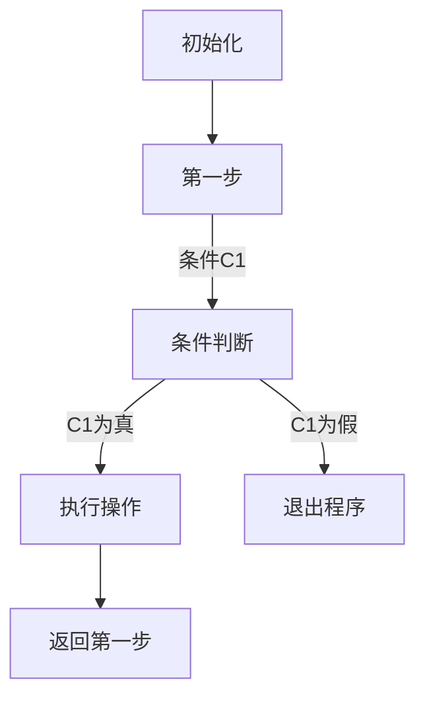
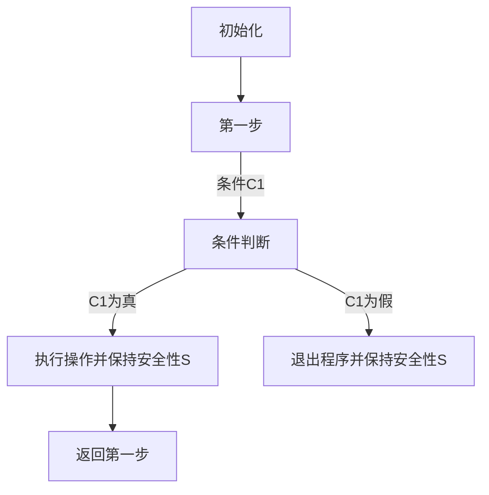

                 

### 文章标题

**《证明论在程序正确性验证中的应用》**

### 关键词

- 证明论
- 程序正确性验证
- 形式化方法
- 谓词逻辑
- 归纳证明
- 自动证明

### 摘要

本文旨在探讨证明论在程序正确性验证中的应用。首先，我们将回顾证明论的基础概念，包括归纳证明与演绎证明，并介绍模式匹配与归纳推理。接着，我们深入探讨命题逻辑与谓词逻辑在程序验证中的应用，详细讲解其基本概念和核心原理。本文还将介绍形式化方法在程序验证中的作用，并通过实际案例展示其应用效果。最后，我们展望了程序正确性验证领域的未来发展趋势，分析了面临的挑战和机遇。

## 引言

在计算机科学领域，确保程序的正确性是一项至关重要的任务。然而，传统的测试方法难以完全保证程序的正确性，特别是在复杂系统的开发过程中。因此，形式化的程序验证技术应运而生，成为确保程序正确性的重要手段。在这些技术中，证明论作为一种强大的逻辑工具，得到了广泛应用。

证明论是数学的一个分支，主要研究证明的性质和方法。它不仅涉及到逻辑推理，还包括数学归纳法、模型论、集合论等多个领域。在程序正确性验证中，证明论通过形式化的方法，对程序的各个部分进行逻辑分析和推理，从而证明程序的性质和正确性。

本文将系统性地介绍证明论在程序正确性验证中的应用。首先，我们将回顾证明论的基础概念，包括归纳证明与演绎证明，并探讨模式匹配与归纳推理。接着，我们将深入探讨命题逻辑与谓词逻辑在程序验证中的应用，详细讲解其基本概念和核心原理。此外，本文还将介绍形式化方法在程序验证中的作用，并通过实际案例展示其应用效果。最后，我们将展望程序正确性验证领域的未来发展趋势，分析面临的挑战和机遇。

通过本文的阅读，读者将能够深入了解证明论在程序正确性验证中的应用，掌握相关技术和方法，为实际项目中的程序验证提供理论支持和技术指导。

## 第1章：证明论基础

### 1.1 证明论的基本概念

证明论是数学的一个分支，主要研究证明的性质和方法。在计算机科学领域，证明论的应用主要集中在形式化验证和程序正确性证明方面。要理解证明论的基本概念，我们需要先了解两个核心概念：归纳证明与演绎证明。

#### 1.1.1 归纳证明与演绎证明

**归纳证明**（Inductive Proof）是一种证明方法，它通过验证基础情况成立，并证明在某个前提下结论成立时，结论对所有自然数都成立。归纳证明分为两个步骤：基础情况和归纳步骤。

- **基础情况**：验证当自然数取最小值时（通常是n=1或n=0），结论成立。
- **归纳步骤**：假设当自然数取某个值n时，结论成立，然后证明当自然数取n+1时，结论也成立。

归纳证明通常用于证明数学归纳法、排序算法、递归算法的正确性等。

**演绎证明**（Deductive Proof）是一种从一般到特殊的证明方法。它从一组公理或已知事实出发，通过逻辑推理，得出特定的结论。演绎证明通常采用以下步骤：

- **前提**：列出已知的事实和公理。
- **推导**：通过逻辑推理，从前提推导出结论。

演绎证明广泛应用于数学、逻辑学、计算机科学等领域。

#### 1.1.2 模式匹配与归纳推理

在证明论中，模式匹配（Pattern Matching）是一种关键的技术。模式匹配是一种将程序中的某个表达式与模式进行匹配的方法，从而证明该表达式的性质。在程序验证中，模式匹配可以帮助我们验证程序的各个部分是否满足预期的性质。

**归纳推理**（Inductive Reasoning）是一种基于归纳证明的推理方法。通过归纳推理，我们可以从一个或多个具体实例出发，推断出一般性的结论。在程序验证中，归纳推理可以帮助我们验证程序在所有情况下是否都满足预期的性质。

#### 1.1.3 证明论在程序正确性验证中的应用概述

证明论在程序正确性验证中的应用非常广泛。通过形式化的方法，证明论可以帮助我们验证程序的正确性，确保程序在各种情况下都能正确运行。以下是证明论在程序正确性验证中的一些主要应用：

- **命题逻辑验证**：命题逻辑是一种形式化的逻辑系统，可以用于验证程序的基本性质，如终止性、不变性等。
- **谓词逻辑验证**：谓词逻辑是一种更复杂的逻辑系统，可以用于验证程序的高级性质，如安全性、完整性等。
- **形式化方法**：形式化方法是一种将程序的形式化描述与验证相结合的方法，可以用于验证程序的复杂性质。

通过这些应用，证明论为我们提供了一种强大的工具，可以帮助我们确保程序的正确性，提高软件的质量和可靠性。

#### 1.1.4 本书结构及学习方法

本书将系统性地介绍证明论在程序正确性验证中的应用。具体来说，本书将按照以下结构展开：

1. **第1章：证明论基础**：介绍证明论的基本概念，包括归纳证明、演绎证明、模式匹配和归纳推理。
2. **第2章：命题逻辑与程序验证**：介绍命题逻辑的基本概念及其在程序验证中的应用。
3. **第3章：谓词逻辑与程序正确性证明**：介绍谓词逻辑的基本概念及其在程序正确性证明中的应用。
4. **第4章：形式化方法与程序验证**：介绍形式化方法的基本概念及其在程序验证中的应用。
5. **第5章：自动证明与程序验证**：介绍自动证明工具的基本原理及其在程序验证中的应用。
6. **第6章：程序验证与软件工程**：探讨程序验证与软件工程的关系，介绍面向验证的软件开发方法。
7. **第7章：未来展望与挑战**：展望程序正确性验证领域的未来发展趋势，分析面临的挑战和机遇。

为了更好地学习本书，我们建议读者按照以下学习方法：

- **逐步学习**：建议读者按照章节顺序逐步学习，以便更好地理解各章节之间的联系。
- **实践操作**：通过实践操作，如编写验证代码、运行验证工具等，加深对理论知识的理解。
- **参考案例**：参考本书中的实际案例，理解证明论在程序正确性验证中的具体应用。
- **持续学习**：程序正确性验证是一个不断发展的领域，建议读者持续关注最新的研究成果和技术动态。

通过以上学习方法，读者可以更深入地理解证明论在程序正确性验证中的应用，掌握相关技术和方法，为实际项目中的程序验证提供理论支持和技术指导。

### 第2章：命题逻辑与程序验证

#### 2.1 命题逻辑基础

命题逻辑（Propositional Logic）是逻辑学的一个分支，主要研究命题之间的关系和推理。在命题逻辑中，命题是最基本的元素，它表示一个陈述的真假。命题逻辑的符号化表示方法使得我们可以用形式化的方式描述和分析逻辑推理过程。

**命题**（Proposition）是一个可以判断真假的陈述。在命题逻辑中，命题通常用大写字母P、Q、R等表示。命题的真假值用真（True，记为T）和假（False，记为F）表示。

**逻辑连接词**（Logical Connectives）是用于连接命题的符号，常见的逻辑连接词包括：

- **合取**（Conjunction，记为∧）：表示两个命题同时为真。形式化表示为P ∧ Q。
- **析取**（Disjunction，记为∨）：表示两个命题中至少有一个为真。形式化表示为P ∨ Q。
- **非**（Negation，记为¬）：表示命题的否定。形式化表示为¬P。
- **蕴含**（Implication，记为→）：表示如果一个命题为真，则另一个命题也为真。形式化表示为P → Q。
- **等价**（Equivalence，记为↔）：表示两个命题的真假值相同。形式化表示为P ↔ Q。

**命题演算**（Propositional Calculus）是命题逻辑的形式化表示方法。命题演算包括一组命题变量、逻辑连接词和推理规则。通过命题演算，我们可以推导出新的命题。

**形式化语言**（Formal Language）是用于表达逻辑推理和计算过程的语言。形式化语言通常包括命题变量、逻辑连接词和语法规则。常见的形式化语言有命题逻辑、谓词逻辑、函数式语言等。

在程序验证中，命题逻辑广泛应用于验证程序的基本性质，如终止性、不变性和安全性等。通过命题逻辑，我们可以形式化地描述程序的性质，并利用逻辑推理方法证明这些性质。

#### 2.2 程序验证基础

**程序验证**（Program Verification）是一种确保程序正确性的方法。程序验证的目标是证明程序在各种情况下都能正确运行，满足预期的性质。程序验证通常包括以下步骤：

1. **形式化描述**：使用形式化语言描述程序的语义和性质。
2. **证明**：利用逻辑推理方法证明程序的性质。
3. **验证工具**：使用验证工具（如自动证明器、模型检查器等）辅助验证过程。

**程序的形式化描述**（Formalization of Programs）是将程序语义形式化表示的方法。形式化描述可以帮助我们清晰地理解程序的执行过程和性质。常见的形式化描述方法包括：

- **伪代码**（Pseudocode）：伪代码是一种类似自然语言的编程语言，用于描述程序的算法和逻辑结构。
- **机器代码**（Machine Code）：机器代码是计算机能够直接执行的低级语言，用于描述程序的执行过程。
- **形式化语言**（Formal Language）：形式化语言是一种严格的编程语言，用于描述程序的语义和性质。

**程序的语义**（Semantics of Programs）是指程序在执行过程中的行为和结果。程序的语义可以分为以下几种：

- **动态语义**（Dynamic Semantics）：描述程序在执行过程中内存状态的变化。
- **静态语义**（Static Semantics）：描述程序在编译或运行前的属性和约束。
- **执行语义**（Execution Semantics）：描述程序在执行过程中的每一步行为。

在程序验证中，我们需要形式化地描述程序的语义，以便进行逻辑分析和证明。

#### 2.3 命题逻辑在程序验证中的应用

在程序验证中，命题逻辑可以用于验证程序的基本性质，如终止性、不变性和安全性等。

**终止性验证**（Termination Verification）是确保程序在有限时间内终止的验证方法。通过命题逻辑，我们可以形式化地描述程序在执行过程中的每一步行为，并证明程序在有限时间内终止。



上述Mermaid图表示一个简单的循环程序，其中C1表示循环条件。通过命题逻辑，我们可以证明程序在满足条件C1的情况下，会在有限时间内终止。

**不变性验证**（Invariance Verification）是确保程序在执行过程中某个属性保持不变的验证方法。通过命题逻辑，我们可以形式化地描述程序在执行过程中的状态，并证明某个属性在程序的每一步都保持不变。


上述Mermaid图表示一个简单的程序，其中P表示不变性属性。通过命题逻辑，我们可以证明程序在满足条件C1的情况下，属性P在程序的每一步都保持不变。

**安全性验证**（Safety Verification）是确保程序在执行过程中不会出现错误状态的验证方法。通过命题逻辑，我们可以形式化地描述程序在执行过程中的状态，并证明程序不会进入错误状态。



上述Mermaid图表示一个简单的程序，其中S表示安全性属性。通过命题逻辑，我们可以证明程序在满足条件C1的情况下，不会进入错误状态。

通过以上应用，命题逻辑在程序验证中发挥着重要作用。它可以帮助我们形式化地描述程序的语义和性质，并利用逻辑推理方法验证程序的正确性。在接下来的章节中，我们将进一步探讨谓词逻辑在程序正确性验证中的应用。

### 第3章：谓词逻辑与程序正确性证明

#### 3.1 谓词逻辑基础

谓词逻辑（Predicate Logic）是逻辑学的一个分支，它在命题逻辑的基础上引入了变量和量词，从而能够描述更复杂的逻辑关系和推理。谓词逻辑在程序正确性验证中具有重要应用，因为它可以更精细地描述程序的性质和条件。

**谓词**（Predicate）是表示对象属性的命题。在谓词逻辑中，谓词通常用大写字母P、Q、R等表示。谓词可以带有参数，如P(x)，表示对象x具有属性P。

**谓词演算**（Predicate Calculus）是谓词逻辑的形式化表示方法。谓词演算包括一组谓词符号、变量、量词和推理规则。通过谓词演算，我们可以推导出新的谓词。

**量词**（Quantifier）是用于表示变量取值范围的符号。在谓词逻辑中，有两个基本的量词：

- **全称量词**（Universal Quantifier），记为∀，表示对所有对象都成立。形式化表示为∀x P(x)。
- **存在量词**（Existential Quantifier），记为∃，表示存在至少一个对象成立。形式化表示为∃x P(x)。

**谓词公式**（Predicate Formula）是由谓词、变量、量词和逻辑连接词组成的表达式。谓词公式可以表示复杂的逻辑关系和条件。

**命题逻辑与谓词逻辑的关系**：命题逻辑是谓词逻辑的特殊情况，当谓词逻辑中不使用变量和量词时，就变成了命题逻辑。因此，谓词逻辑在逻辑推理的复杂性和表达力方面都超过了命题逻辑。

#### 3.2 程序正确性证明技术

程序正确性证明是确保程序在所有情况下都能正确执行的重要方法。谓词逻辑提供了形式化的工具，可以用来证明程序的正确性。以下是几种常见的程序正确性证明技术：

**归纳证明**（Inductive Proof）：归纳证明是一种常用的程序正确性证明方法。它通过验证基础情况和归纳步骤，证明程序的正确性。

- **基础情况**：验证当输入值最小时，程序的正确性。
- **归纳步骤**：假设当输入值为n时，程序的正确性成立，然后证明当输入值为n+1时，程序的正确性也成立。

**归纳断言**（Inductive Assertion）：归纳断言是一种在程序中添加断言的方法，用于证明程序的正确性。归纳断言通常包括两个部分：初始化断言和归纳断言。

- **初始化断言**：在程序开始执行时，验证初始状态的正确性。
- **归纳断言**：在程序执行过程中，验证每一步操作后的状态都满足预期的性质。

**模型检查**（Model Checking）：模型检查是一种验证程序正确性的方法，它将程序表示为一个状态机，然后检查该状态机是否满足预期的性质。模型检查器可以自动验证程序的正确性。

**断言验证**（Assertion Checking）：断言验证是一种在程序中添加断言，然后使用工具检查断言是否成立的方法。断言验证可以帮助我们发现程序中的错误。

**定理证明**（Theorem Proving）：定理证明是一种通过逻辑推理证明程序正确性的方法。定理证明器可以自动或半自动地证明程序的正确性。

#### 3.3 谓词逻辑在程序正确性验证中的实例分析

以下是一个使用谓词逻辑证明程序正确性的实例：

**问题**：证明一个简单的循环程序在满足条件C的情况下会在有限时间内终止。

```c
// 程序代码
int i = 0;
while (C) {
    i++;
    // 其他操作...
}
```

**证明**：

1. **基础情况**：当i=0时，程序开始执行。初始状态满足条件C，因此可以进入循环。

2. **归纳步骤**：假设当i=n时，程序会在满足条件C的情况下在有限时间内终止。现在我们需要证明当i=n+1时，程序也会在满足条件C的情况下在有限时间内终止。

- **初始化断言**：在循环开始时，i=0，满足条件C。
- **归纳断言**：在每次循环迭代后，i的值增加1，因此i的值始终为n+1。我们需要证明在满足条件C的情况下，i的值不会超过n。

```latex
$$\forall i \in \mathbb{N}, (C \land i \leq n) \rightarrow (i < n+1)$$
```

- **归纳推理**：根据全称量词的推理规则，我们可以将上述公式转换为：

```latex
$$C \land i \leq n \rightarrow i < n+1$$
```

- **证明**：由于条件C始终为真，我们可以将上述公式应用于i的当前值n，得到：

```latex
$$C \land n \leq n \rightarrow n < n+1$$
$$C \rightarrow n < n+1$$
$$\forall i \in \mathbb{N}, C \rightarrow i < n+1$$
```

- **结论**：根据归纳证明的原则，我们可以得出结论，当i的初始值为0，且条件C为真时，程序会在有限时间内终止。

通过上述证明，我们使用谓词逻辑证明了该程序的正确性。在实际的程序验证中，我们可以使用类似的方法来证明更复杂的程序性质。

### 第4章：形式化方法与程序验证

#### 4.1 形式化方法概述

形式化方法（Formal Methods）是计算机科学中用于确保程序正确性和验证系统性质的一类技术。它通过数学和逻辑的方法，将软件和系统开发过程中的各种概念和需求形式化地表示和验证。形式化方法在提高软件质量和可靠性方面发挥了重要作用，尤其在安全关键系统和复杂软件系统的开发中。

**形式化方法的优点**：

- **精确性**：形式化方法通过数学和逻辑的方式精确地描述系统和程序的属性，避免了模糊性和歧义。
- **可验证性**：形式化方法提供了一套严格的验证过程，可以证明系统和程序的属性是否满足预期。
- **自动化**：一些形式化方法工具可以自动验证系统属性，减少人工验证的工作量。

**形式化方法的挑战**：

- **复杂度**：形式化方法的数学和逻辑表示往往较为复杂，需要较高的数学和逻辑素养。
- **成本**：形式化方法的引入可能会增加开发和维护成本。
- **可接受性**：形式化方法在某些开发团队中可能不被广泛接受，尤其是对于不熟悉形式化方法的开发人员。

**形式化方法的分类**：

形式化方法可以按不同的标准进行分类，常见的分类方法包括：

- **按验证对象**：形式化方法可以针对整个系统或系统的某个部分，如模块、组件等。
- **按验证过程**：形式化方法可以按验证过程的阶段进行分类，如需求分析、设计、实现等。
- **按验证方法**：形式化方法可以按使用的验证方法进行分类，如模型检查、定理证明、形式化测试等。

#### 4.2 形式化程序设计

形式化程序设计（Formal Programming）是一种通过形式化方法编写程序的方法。它强调程序的每个部分都必须形式化地定义和验证。形式化程序设计通常包括以下步骤：

1. **规格说明**：使用形式化语言描述程序的功能和属性。
2. **算法设计**：使用形式化方法设计程序的算法，确保算法的正确性。
3. **程序编码**：将形式化的算法编码成实际可运行的程序代码。
4. **验证**：使用形式化方法验证程序的正确性，确保程序满足预期属性。

**形式化程序设计的优点**：

- **可靠性**：通过形式化验证，确保程序的正确性和可靠性。
- **可维护性**：形式化表示使得程序易于理解和维护。
- **可扩展性**：形式化方法使得程序易于扩展和修改。

**形式化程序设计的缺点**：

- **复杂性**：形式化程序设计通常需要较高的数学和逻辑素养。
- **开发成本**：形式化程序设计的开发和验证过程可能增加成本。

#### 4.3 形式化验证在程序正确性验证中的应用

形式化验证（Formal Verification）是一种通过数学和逻辑方法验证程序和系统正确性的技术。形式化验证可以确保程序在各种情况下都能正确运行，满足预期的性质。

**形式化验证的方法**：

- **模型检查**（Model Checking）：将程序表示为一个状态机，然后检查该状态机是否满足预期的性质。
- **定理证明**（Theorem Proving）：通过逻辑推理证明程序的正确性。
- **形式化测试**（Formal Testing）：使用形式化方法生成测试用例，验证程序的正确性。

**形式化验证的应用**：

- **安全关键系统**：如航空航天、医疗设备等领域的软件系统，这些系统的错误可能导致严重后果。
- **复杂软件系统**：如操作系统、编译器等，这些系统的规模和复杂性使得传统的测试方法难以确保其正确性。
- **形式化规范**：使用形式化方法定义系统规范，确保开发过程符合规范。

通过形式化方法，我们可以确保程序的正确性，提高软件的质量和可靠性。在实际开发过程中，形式化方法与传统的测试方法相结合，可以更好地确保系统的正确性。

### 第5章：自动证明与程序验证

#### 5.1 自动证明的基本原理

自动证明（Automated Proof）是利用计算机程序自动验证数学和逻辑命题的方法。它通过算法和计算技术，将复杂的证明过程自动化，从而大大提高证明的效率。自动证明在数学、计算机科学、物理学等领域有着广泛的应用。

**自动证明的基本原理**：

自动证明通常包括以下几个步骤：

1. **命题表示**：将需要证明的命题用形式化的语言表示出来，通常使用谓词逻辑、自动推理系统等。
2. **证明搜索**：利用推理算法和搜索策略，自动寻找证明路径。
3. **证明验证**：验证找到的证明路径是否满足逻辑一致性。

**自动证明的关键技术**：

- **自动推理系统**（Automated Reasoning Systems）：自动推理系统是自动证明的核心，它包括推理算法、证明搜索策略、证明验证技术等。
- **证明搜索策略**（Proof Search Strategies）：证明搜索策略是自动证明的关键技术，它决定了证明搜索的效率。
- **证明压缩**（Proof Compression）：证明压缩技术用于减少证明的规模，提高证明搜索的效率。

**自动证明的应用**：

自动证明在数学和计算机科学领域有广泛的应用，包括：

- **数学命题验证**：自动证明可以验证数学定理的正确性，发现潜在的数学错误。
- **程序正确性验证**：自动证明可以验证程序的正确性，确保程序在各种情况下都能正确运行。
- **系统验证**：自动证明可以验证复杂系统的属性，如安全性、完整性等。

#### 5.2 自动证明工具

自动证明工具是自动证明技术的实现形式，它们通过计算机程序实现自动证明功能。以下是一些常见的自动证明工具：

**Coq**：

- **简介**：Coq是一种交互式定理证明器，它支持高阶逻辑和构造性证明。
- **特点**：Coq具有强大的定理证明能力和丰富的库，支持多种证明技术。
- **应用**：Coq广泛应用于数学、计算机科学和系统验证等领域。

**Isabelle**：

- **简介**：Isabelle是一种基于Lamda演算的交互式证明环境。
- **特点**：Isabelle支持复杂的逻辑系统，具有强大的定理证明能力和形式化语言。
- **应用**：Isabelle广泛应用于定理证明、软件验证和系统验证等领域。

**HOL**：

- **简介**：HOL（Higher-Order Logic）是一种基于高阶逻辑的定理证明系统。
- **特点**：HOL具有强大的逻辑系统，支持高阶函数和类型系统。
- **应用**：HOL广泛应用于数学和计算机科学领域的定理证明。

**MATLAB**：

- **简介**：MATLAB是一种数学和科学计算软件，它支持符号计算和自动证明。
- **特点**：MATLAB具有强大的数学和计算功能，支持符号运算和自动证明。
- **应用**：MATLAB广泛应用于工程、科学和数学领域，用于符号计算和自动证明。

这些自动证明工具各具特色，适用于不同的应用场景。在实际应用中，选择合适的自动证明工具可以提高验证效率和准确性。

#### 5.3 自动证明在程序验证中的应用实例

以下是一个自动证明在程序验证中的应用实例：

**问题**：验证一个简单的循环程序的正确性。

```c
// 程序代码
int i = 0;
while (i < 10) {
    i++;
}
```

**证明过程**：

1. **命题表示**：使用谓词逻辑表示程序的属性和状态。

```latex
P(i): \text{程序在第i次迭代时处于正确状态}
```

2. **初始状态验证**：

```latex
P(0): i = 0 \land i < 10
```

3. **迭代性质验证**：

```latex
P(i) \rightarrow P(i+1): i < 10 \rightarrow i+1 < 10
```

4. **证明搜索**：

使用自动证明工具（如Coq）进行证明搜索，找到证明路径。

5. **证明验证**：

验证证明路径是否满足逻辑一致性，确保程序的正确性。

通过上述证明过程，我们使用自动证明工具验证了该循环程序的正确性。在实际应用中，自动证明工具可以帮助我们快速验证程序的属性，确保程序的正确性。

### 第6章：程序验证与软件工程

#### 6.1 程序验证与软件工程的关系

程序验证（Program Verification）是软件工程（Software Engineering）的一个重要组成部分，它旨在确保软件的正确性、可靠性和安全性。在软件工程中，程序验证扮演着关键角色，它不仅有助于发现和修复软件中的错误，还可以提高软件的质量和可信度。

**程序验证与软件工程的关系**：

1. **开发过程**：程序验证贯穿于整个软件生命周期，从需求分析、设计、编码到测试和部署，每个阶段都包含验证活动。
2. **质量保障**：程序验证是质量保障的重要手段，通过形式化的方法验证软件的正确性，减少潜在的错误和缺陷。
3. **可靠性**：程序验证有助于提高软件的可靠性，确保软件在各种情况下都能正常运行。
4. **安全性**：在安全关键系统中，程序验证尤为重要，它有助于确保软件系统的安全性，防止潜在的安全漏洞。

**程序验证在软件工程中的作用**：

1. **发现缺陷**：程序验证可以帮助我们发现和修复软件中的缺陷，特别是在复杂系统的开发过程中。
2. **提高质量**：通过形式化的方法验证软件的正确性，提高软件的质量和可信度。
3. **减少维护成本**：通过验证，可以减少后期维护和修复的成本，提高软件的可维护性。
4. **满足规范**：程序验证有助于确保软件满足规范和标准，提高软件的合规性。

#### 6.2 面向验证的软件开发方法

面向验证的软件开发方法（Verification-Oriented Software Development）是一种将程序验证活动贯穿于整个软件开发过程的开发方法。该方法强调在软件开发的过程中，始终关注软件的正确性和可靠性，确保软件在开发过程中不会引入错误。

**面向验证的软件开发方法的主要特点**：

1. **形式化规格说明**：在开发过程中，使用形式化的语言编写规格说明，确保规格说明的准确性和一致性。
2. **验证驱动开发**：通过验证活动驱动开发过程，确保每个阶段都符合预期要求。
3. **增量验证**：在开发过程中，逐步验证各个部分的正确性，确保整体系统的正确性。
4. **自动化验证**：利用自动化工具进行验证，提高验证效率和准确性。

**面向验证的软件开发方法的主要步骤**：

1. **需求分析**：明确软件需求，使用形式化方法编写需求规格说明。
2. **设计**：设计软件架构和模块，使用形式化的方法验证设计是否符合需求。
3. **编码**：编写程序代码，确保代码满足设计要求，并进行单元测试。
4. **验证**：使用形式化方法和自动化工具对代码进行验证，确保代码的正确性。
5. **测试**：进行系统测试和集成测试，确保软件的整体正确性和可靠性。
6. **部署**：部署软件，进行现场验证和持续监控，确保软件在实际运行中的正确性。

**面向验证的软件开发方法的优点**：

- **提高软件质量**：通过形式化的验证方法，确保软件的正确性和可靠性。
- **减少缺陷**：在开发过程中逐步验证，减少潜在的错误和缺陷。
- **提高开发效率**：自动化验证工具可以提高验证效率，减少人工验证的工作量。
- **增强安全性**：在安全关键系统中，面向验证的开发方法有助于提高系统的安全性。

**面向验证的软件开发方法的挑战**：

- **复杂性**：形式化方法和验证过程可能增加开发过程的复杂性，需要更高的技术要求。
- **成本**：引入验证活动可能会增加开发成本，需要权衡成本和收益。
- **开发人员的技能**：验证活动需要开发人员具备一定的数学和逻辑素养，对开发人员的技能要求较高。

#### 6.3 程序验证在软件工程实践中的应用

在实际软件工程实践中，程序验证已经被广泛应用于各种类型的软件系统，以下是一些具体的例子：

**1. 航空航天领域**：

在航空航天系统中，程序验证尤为重要，因为它关系到飞行安全。例如，在飞行控制系统的开发中，使用形式化的方法验证系统的正确性，确保系统在各种飞行条件下都能正常运行。

**2. 医疗设备领域**：

医疗设备如心脏起搏器和胰岛素泵等，其软件的正确性直接关系到患者的健康和生命。因此，在医疗设备的开发过程中，使用程序验证方法确保软件的正确性和安全性。

**3. 操作系统领域**：

操作系统是复杂软件系统，其正确性和稳定性至关重要。例如，Linux内核的开发过程中，使用形式化的方法和工具对内核代码进行验证，确保内核的正确性。

**4. 金融领域**：

金融系统的安全性至关重要，程序验证可以确保金融系统的正确性和数据安全性。例如，银行和金融机构在开发交易系统时，使用程序验证方法确保交易过程的正确性和安全性。

**5. 自动驾驶领域**：

自动驾驶系统的正确性和安全性是自动驾驶汽车成功的关键。在自动驾驶系统的开发中，使用形式化的方法和工具验证系统的正确性，确保系统在各种交通状况下都能安全运行。

通过这些实际案例，我们可以看到程序验证在软件工程实践中的应用非常广泛，它不仅提高了软件的正确性和可靠性，还增强了系统的安全性，为各种领域的软件系统开发提供了有力的支持。

### 第7章：未来展望与挑战

#### 7.1 程序正确性验证的发展趋势

随着计算机科学和软件工程的快速发展，程序正确性验证（Program Correctness Verification）技术也在不断演进。未来的发展将主要集中在以下几个方面：

**1. 人工智能的融合**：

人工智能（AI）技术的快速发展为程序验证提供了新的契机。通过将机器学习和深度学习技术应用于程序验证，可以自动生成验证策略、优化验证过程、甚至自动发现和修复程序错误。例如，AI可以用于生成测试用例、优化定理证明器的搜索策略、识别潜在的证明错误等。

**2. 自动化的提升**：

自动化是程序正确性验证的重要发展方向。未来的自动化工具将更加智能，能够自动处理复杂的验证任务，减少人工干预。例如，自动定理证明器（ATP）和自动程序验证器将变得更加成熟，能够处理更复杂的逻辑和证明问题，提高验证效率。

**3. 形式化验证的普及**：

形式化验证方法在提高软件质量和可靠性方面具有显著优势。未来，随着形式化验证技术的成熟和普及，越来越多的软件开发人员将采用形式化验证方法，确保软件的正确性和安全性。形式化方法的普及将依赖于更易于使用的工具和更直观的界面。

**4. 面向多学科的融合**：

程序正确性验证不仅涉及计算机科学，还与其他学科如数学、逻辑学、物理学等密切相关。未来，跨学科的研究将推动程序验证技术的进一步发展，使得验证方法更加多样化和综合。

#### 7.2 程序验证面临的挑战与机遇

尽管程序正确性验证技术取得了显著进展，但仍然面临许多挑战和机遇。

**1. 验证规模的扩大**：

随着软件系统的规模和复杂性不断增加，验证任务也变得更加艰巨。未来的软件系统将更加庞大和复杂，这要求验证工具能够处理更多的状态和更复杂的逻辑。同时，需要开发更高效的算法和优化技术，以应对验证规模的扩大。

**2. 安全性与隐私保护**：

随着网络安全和数据隐私问题的日益突出，确保软件系统的安全性和数据隐私保护成为验证的重要目标。未来，验证工具需要能够识别和验证系统的安全属性，确保系统在各种攻击场景下的安全性。

**3. 自动化的深度**：

自动化是程序验证的关键，但目前的自动化水平仍然有限。未来的研究将集中在开发更智能的自动化工具，如自动测试用例生成器、自动证明器等。这些工具将能够更有效地处理复杂的验证任务，提高验证的自动化水平。

**4. 多领域的融合**：

程序验证技术的发展需要多学科的融合。未来的研究将关注如何将人工智能、机器学习、逻辑学、物理学等领域的最新成果应用于程序验证，推动验证技术的创新和发展。

**5. 教育与培训**：

程序正确性验证技术的普及需要大量的专业人才。未来的教育和培训将更加注重程序验证的理论和实践，培养具备专业素养的验证工程师，以应对不断变化的技术挑战。

通过应对这些挑战，抓住机遇，程序正确性验证技术将不断进步，为软件工程领域带来更多创新和突破。

### 结论

本文系统地介绍了证明论在程序正确性验证中的应用。首先，我们回顾了证明论的基础概念，包括归纳证明与演绎证明，并探讨了模式匹配与归纳推理。接着，我们深入探讨了命题逻辑与谓词逻辑在程序验证中的应用，详细讲解了其基本概念和核心原理。此外，本文还介绍了形式化方法在程序验证中的作用，并通过实际案例展示了其应用效果。

通过本文的阅读，读者应能够了解证明论在程序正确性验证中的关键作用，掌握相关技术和方法，为实际项目中的程序验证提供理论支持和技术指导。

### 最佳实践 tips、小结、注意事项、拓展阅读

**最佳实践 tips**：

1. 在项目初期，就引入程序验证技术，以减少后期修复成本。
2. 利用自动化工具进行验证，提高验证效率。
3. 关注系统的安全性，确保验证过程中不遗漏关键安全属性。
4. 培养团队成员的验证素养，确保整个团队能够有效应用验证技术。

**小结**：

本文系统地介绍了证明论在程序正确性验证中的应用，包括基本概念、逻辑关系、形式化方法等。通过实际案例，展示了证明论在程序验证中的具体应用。

**注意事项**：

1. 程序验证并非万能，它不能替代传统测试方法，应与测试相结合。
2. 验证过程中，注意合理利用自动化工具和人工验证相结合，提高验证效果。
3. 验证过程中，确保验证目标明确，避免盲目追求形式化。

**拓展阅读**：

1. 《程序正确性验证：理论与实践》
2. 《形式化方法：软件和系统验证》
3. 《人工智能在程序验证中的应用》

这些书籍和资料提供了更深入的探讨和案例，有助于读者进一步了解程序正确性验证的相关技术和应用。

