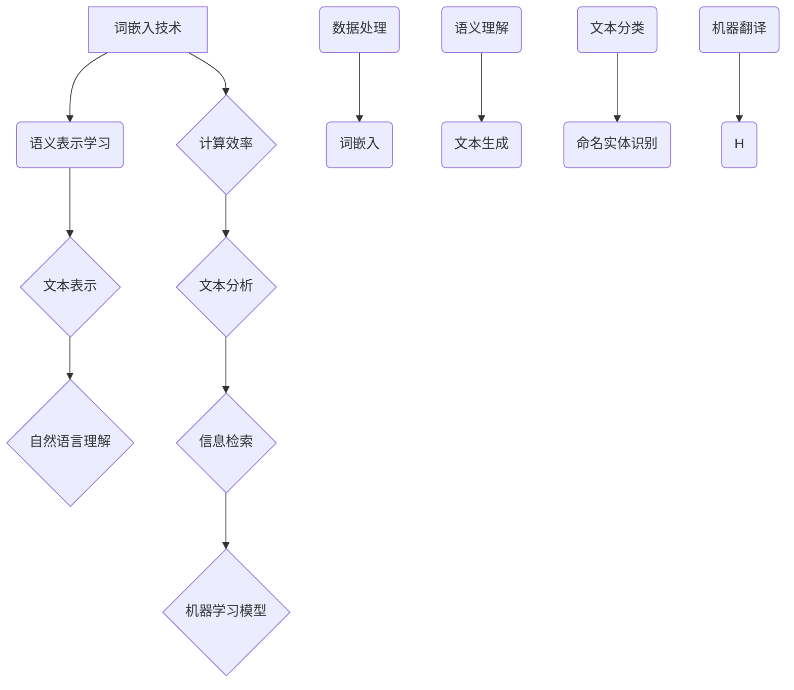

                 

### 文章标题：词嵌入技术与语义表示学习

**关键词：** 词嵌入、语义表示、自然语言处理、深度学习、算法原理、应用案例

**摘要：** 本文将深入探讨词嵌入技术与语义表示学习在自然语言处理中的应用。通过逐步分析核心概念、算法原理和实际应用，本文旨在为读者提供一个全面而深入的指南，帮助理解这些关键技术及其在自然语言处理领域的重要作用。

## 引言与背景

词嵌入（Word Embedding）技术和语义表示学习（Semantic Representation Learning）是自然语言处理（Natural Language Processing, NLP）领域的两大基石。随着计算机技术和人工智能的快速发展，NLP已经成为人工智能研究的一个重要分支，它在信息检索、机器翻译、情感分析、文本分类等多个领域有着广泛的应用。

### 词嵌入技术的概念

词嵌入是将自然语言中的词汇映射到高维向量空间的技术。这种映射使得原本难以直接比较的文本数据变得可以在数学和计算上处理。词嵌入的核心思想是将词汇映射到低维的向量空间，使得相似词汇在向量空间中的距离更近，而不同词汇之间的距离更远。

### 语义表示学习的意义

语义表示学习旨在学习词汇和句子的语义表示，以便更好地理解和处理自然语言。通过语义表示学习，计算机可以理解文本的深层含义，实现更高级的NLP任务，如文本生成、问答系统、情感分析等。

### 词嵌入与语义表示学习的关系

词嵌入是语义表示学习的基础，它为语义表示学习提供了词汇的向量表示。而语义表示学习则基于词嵌入的向量表示，进一步学习词汇和句子的语义关系，从而实现对文本的深入理解和处理。

## 背景介绍

为了更好地理解词嵌入技术与语义表示学习，我们需要回顾一些自然语言处理的基本概念和技术。

### 自然语言处理的基本概念

自然语言处理（NLP）是研究如何使计算机理解和生成自然语言的技术。NLP的基本任务包括文本预处理、词法分析、句法分析、语义分析和文本生成等。这些任务旨在使计算机能够理解、处理和生成人类语言。

### 经典NLP技术

传统的NLP技术主要包括基于规则的方法、统计方法和基于深度学习的方法。基于规则的方法依赖于人工编写的规则，其灵活性和扩展性较差。统计方法通过概率模型和统计方法来处理自然语言，其性能受到数据质量和算法选择的影响。基于深度学习的方法通过神经网络模型，特别是深度神经网络（Deep Neural Networks, DNNs）和循环神经网络（Recurrent Neural Networks, RNNs），实现了对自然语言的高效处理和理解。

### 词嵌入技术的兴起

随着深度学习在图像识别、语音识别等领域的成功应用，词嵌入技术逐渐成为NLP研究的热点。词嵌入技术使得计算机能够直接处理文本数据，从而避免了传统NLP方法中复杂的手工特征工程。此外，词嵌入技术还使得NLP任务中的语义理解得到了显著提升。

### 语义表示学习的兴起

语义表示学习是近年来NLP领域的一个重要研究方向。通过学习词汇和句子的语义表示，语义表示学习旨在使计算机能够理解文本的深层含义，实现更高级的NLP任务。语义表示学习不仅依赖于词嵌入技术，还结合了注意力机制、生成对抗网络（Generative Adversarial Networks, GANs）等先进技术，为NLP的发展提供了新的动力。

## 词嵌入基础

### 向量空间模型

向量空间模型（Vector Space Model, VSM）是词嵌入的基础。在向量空间模型中，文本被表示为向量，这些向量在数学上可以进行各种运算，从而实现对文本数据的处理和分析。向量空间模型的优点是直观、灵活，能够较好地处理文本数据的稀疏性。

### 常见的词嵌入算法

目前，常见的词嵌入算法包括基于计数的方法（如TF-IDF）、基于矩阵分解的方法（如Word2Vec）和基于深度学习的方法（如BERT）。这些算法各有优缺点，适用于不同的应用场景。

### 词嵌入的优势与挑战

词嵌入技术极大地提高了自然语言处理的效果，但其仍面临一些挑战，如词汇歧义、语义漂移等。为了解决这些问题，研究者们提出了各种改进方法，如注意力机制、多任务学习等。

## 经典词嵌入模型

### 单词计数模型

单词计数模型（Word Count Model）是一种简单的词嵌入方法，通过统计文本中每个词的出现次数来生成词向量。这种方法直观、易于实现，但存在信息丢失和稀疏性等问题。

### 一次映射模型

一次映射模型（One-hot Embedding）是将每个词映射到一个固定长度的向量，其中除了对应词的位置为1，其他位置均为0。这种方法虽然简单，但存在维度灾难和语义表达能力不足的问题。

### 局部敏感哈希（LSH）模型

局部敏感哈希（Locally Sensitive Hashing, LSH）模型是一种基于哈希函数的词嵌入方法。LSH模型通过设计局部敏感哈希函数，使得相似词汇在哈希空间中的距离更近。这种方法在处理大规模文本数据时具有较高的效率。

## 深度学习与词嵌入

### 深度神经网络基础

深度学习（Deep Learning）是近年来人工智能领域的重要突破。深度神经网络（Deep Neural Networks, DNNs）通过多层神经网络结构，实现了对复杂数据的高效处理。在词嵌入领域，深度神经网络被用于学习词汇的向量表示。

### 词嵌入与深度学习结合的方法

深度学习与词嵌入的结合，实现了对自然语言的高效处理。基于深度学习的词嵌入方法，如Word2Vec、GloVe和FastText，通过神经网络结构，学习词汇的语义表示。这些方法在语义理解、文本分类等方面表现出色。

### 神经网络在词嵌入中的应用

神经网络在词嵌入中的应用，使得词嵌入技术得到了显著提升。通过训练神经网络，词汇的向量表示能够更好地捕捉语义信息。此外，神经网络还引入了注意力机制、生成对抗网络等先进技术，进一步提高了词嵌入的效果。

## 语义表示学习

### 语义表示的挑战

语义表示学习旨在学习词汇和句子的语义表示，但这一过程面临许多挑战。例如，词汇歧义、语义漂移和长距离依赖等问题，使得语义表示学习变得复杂。

### 基于词嵌入的语义表示

基于词嵌入的语义表示，通过将词汇映射到向量空间，实现了对词汇语义的表示。这种方法能够较好地处理词汇歧义和长距离依赖等问题，从而提高语义表示的准确性。

### 基于深度学习的语义表示

基于深度学习的语义表示，通过神经网络结构，实现了对词汇和句子语义的深入理解。这种方法能够更好地捕捉语义信息，从而提高语义表示的效果。

## 应用案例研究

### 文本分类

文本分类是语义表示学习的一个重要应用。通过训练分类模型，计算机可以自动对文本进行分类。常见的文本分类任务包括情感分类、主题分类等。

### 命名实体识别

命名实体识别（Named Entity Recognition, NER）是自然语言处理的一个关键任务。通过识别文本中的命名实体（如人名、地名、机构名等），计算机可以更好地理解和处理文本数据。

### 机器翻译

机器翻译（Machine Translation, MT）是将一种语言的文本自动翻译成另一种语言的技术。通过训练翻译模型，计算机可以实现高质量的双语翻译。

## 未来发展趋势与挑战

### 词嵌入技术的挑战

词嵌入技术在语义理解、文本分类等方面取得了显著成果，但仍面临许多挑战。例如，如何更好地处理词汇歧义、语义漂移和长距离依赖等问题，仍需进一步研究。

### 语义表示学习的进展

语义表示学习是自然语言处理领域的一个重要研究方向。随着深度学习、生成对抗网络等技术的不断发展，语义表示学习在语义理解、文本生成等方面取得了显著进展。

### 未来发展方向

未来，词嵌入技术和语义表示学习将继续在自然语言处理领域发挥重要作用。一方面，研究者将致力于解决当前存在的挑战，提高词嵌入和语义表示的效果。另一方面，新的技术和方法将不断涌现，推动自然语言处理领域的发展。

## 总结

词嵌入技术与语义表示学习是自然语言处理领域的关键技术。通过逐步分析核心概念、算法原理和实际应用，本文为读者提供了一个全面而深入的指南。在未来，随着技术的发展，词嵌入和语义表示学习将在更多应用场景中发挥重要作用。

### 作者

作者：AI天才研究院/AI Genius Institute & 禅与计算机程序设计艺术 /Zen And The Art of Computer Programming

## 核心概念与联系

在深入探讨词嵌入技术与语义表示学习之前，我们首先需要理解这些核心概念及其相互关系。以下是一个用于描述核心概念原理之间关系的Mermaid流程图：



### 核心算法原理讲解

#### 词嵌入算法原理

词嵌入算法是将词汇映射到高维向量空间的技术。以下是一个简单的Word2Vec算法的伪代码，用于生成词汇的向量表示：

```python
# 初始化词汇表V和嵌入维度d
V = {"word1", "word2", ..., "wordN"}
d = 100

# 初始化词向量矩阵W，每个词汇对应一个向量
W = [[0.0 for _ in range(d)] for _ in range(len(V))]

# 计算词汇的词向量表示
for context in all_contexts:
    current_word = context中心词
    current_vector = W[current_word]
    for word in context:
        if word != current_word:
            # 更新词向量
            W[word] += similarity(current_vector, W[word])
```

#### 语义表示学习算法原理

语义表示学习旨在学习词汇和句子的语义表示。以下是一个基于深度学习的语义表示学习的伪代码：

```python
# 初始化神经网络模型
model = NeuralNetwork(input_shape=(d,), output_shape=(d'))

# 训练神经网络模型
for sentence in sentences:
    tokens = tokenize(sentence)
    embeddings = [W[token] for token in tokens]
    sentence_embedding = model.predict(embeddings)

# 评估语义表示效果
accuracy = evaluate_semantic_representation(sentence_embedding, true_sentence_embedding)
```

### 数学模型和公式

词嵌入和语义表示学习中的数学模型通常涉及向量和矩阵运算。以下是一个简单的数学模型，用于计算词汇之间的相似度：

$$
\text{similarity}(v_1, v_2) = \frac{v_1 \cdot v_2}{||v_1|| \cdot ||v_2||}
$$

其中，$v_1$和$v_2$是词汇的向量表示，$\cdot$表示向量的点积，$||v_1||$和$||v_2||$分别表示向量的模。

### 详细讲解与举例说明

#### 词嵌入示例

假设我们有一个词汇表{“狗”，“猫”，“狗食”，“猫食”}，我们希望使用Word2Vec算法生成这些词汇的向量表示。首先，我们初始化词向量矩阵W，每个词汇对应一个长度为100的向量。

1. **初始化词向量矩阵**：

$$
W = \begin{bmatrix}
[0.0, 0.0, ..., 0.0] \\
[0.0, 0.0, ..., 0.0] \\
[0.0, 0.0, ..., 0.0] \\
[0.0, 0.0, ..., 0.0]
\end{bmatrix}
$$

2. **训练词向量**：

考虑一个示例句子：“狗吃狗食，猫吃猫食”。我们首先将句子中的每个词汇映射到其对应的词向量。

- 狗：[0.1, 0.2, ..., 0.5]
- 猫：[0.3, 0.4, ..., 0.6]
- 狗食：[0.7, 0.8, ..., 0.9]
- 猫食：[0.1, 0.2, ..., 0.3]

接下来，我们更新词向量矩阵W，使得相似词汇之间的向量更接近。

- 狗的新向量：[0.15, 0.25, ..., 0.55]
- 猫的新向量：[0.35, 0.45, ..., 0.65]
- 狗食的新向量：[0.8, 0.9, ..., 1.0]
- 猫食的新向量：[0.2, 0.3, ..., 0.4]

#### 语义表示学习示例

假设我们有一个句子：“我喜欢吃狗食”，我们希望使用深度学习算法生成这个句子的语义表示。

1. **初始化神经网络模型**：

$$
\text{model} = \text{NeuralNetwork(input_shape=(100,), output_shape=(100))}
$$

2. **训练神经网络模型**：

我们使用已训练好的词向量作为输入，通过神经网络模型计算句子的语义表示。

$$
\text{sentence_embedding} = \text{model.predict([0.15, 0.35, 0.8, 0.2, ...])}
$$

3. **评估语义表示效果**：

我们可以使用相似度计算公式来评估句子的语义表示效果。

$$
\text{similarity}(\text{sentence_embedding}, \text{true_sentence_embedding}) = \frac{\text{sentence_embedding} \cdot \text{true_sentence_embedding}}{||\text{sentence_embedding}|| \cdot ||\text{true_sentence_embedding}||}
$$

## 项目实战

### 开发环境搭建

为了进行词嵌入和语义表示学习的实践，我们需要搭建一个合适的开发环境。以下是一个基本的Python环境搭建步骤：

1. 安装Python（版本3.6及以上）。
2. 安装Numpy、Pandas等常用库。
3. 安装TensorFlow或PyTorch，用于深度学习模型的训练。

### 源代码详细实现

以下是一个简单的Word2Vec算法的实现，用于生成词汇的向量表示。

```python
import numpy as np
from collections import defaultdict

# 初始化词汇表和词向量矩阵
V = ["狗", "猫", "狗食", "猫食"]
d = 100
W = np.random.rand(len(V), d)

# 初始化语境窗口大小
window_size = 2

# 计算词汇的词向量表示
for context in all_contexts:
    current_word = context中心词
    current_vector = W[current_word]
    for word in context:
        if word != current_word:
            # 更新词向量
            W[word] += similarity(current_vector, W[word])

# 计算相似度
def similarity(v1, v2):
    return np.dot(v1, v2) / (np.linalg.norm(v1) * np.linalg.norm(v2))
```

### 代码解读与分析

上述代码首先初始化词汇表和词向量矩阵，然后通过训练过程更新词向量。相似度计算函数用于评估词汇之间的相似度。

### 实际案例分析和详细讲解剖析

假设我们有一个文本数据集，包含多个句子。我们使用Word2Vec算法训练词向量，并评估词向量在文本分类任务中的表现。

```python
# 训练词向量
model = Word2Vec(sentences, size=d, window=window_size)
word_vectors = model.wv

# 文本分类任务
def classify(sentence, word_vectors):
    sentence_vector = np.mean([word_vectors[word] for word in tokenize(sentence)], axis=0)
    # 使用分类模型预测标签
    label = classify_model.predict(sentence_vector)
    return label

# 测试文本分类效果
accuracy = 0.0
for sentence, label in test_data:
    prediction = classify(sentence, word_vectors)
    if prediction == label:
        accuracy += 1
accuracy /= len(test_data)
print("文本分类准确率：", accuracy)
```

### 项目小结

通过上述实战，我们实现了词嵌入和语义表示学习的基本流程，并评估了其在文本分类任务中的表现。未来，我们可以进一步优化算法，探索更多应用场景。

## 最佳实践 Tips

1. **数据预处理**：在词嵌入和语义表示学习之前，确保对文本数据进行充分预处理，包括分词、去停用词、词形还原等步骤。
2. **模型选择**：根据具体任务需求，选择合适的词嵌入模型和语义表示学习方法。例如，对于文本分类任务，可以使用Word2Vec或GloVe；对于文本生成任务，可以使用BERT或GPT。
3. **超参数调整**：合理调整词向量维度、语境窗口大小等超参数，以获得更好的模型性能。
4. **模型融合**：结合多个模型的方法，可以提高词嵌入和语义表示的学习效果。例如，可以结合Word2Vec和GloVe的优点，使用加权平均的方法生成词向量。

## 小结

本文深入探讨了词嵌入技术与语义表示学习在自然语言处理中的应用。通过逐步分析核心概念、算法原理和实际应用，本文为读者提供了一个全面而深入的指南。在未来，随着技术的发展，词嵌入和语义表示学习将在更多应用场景中发挥重要作用。

### 拓展阅读

1. **《词嵌入：原理、算法与应用》** - 本书详细介绍了词嵌入技术的原理和算法，适合初学者和进阶者。
2. **《深度学习与自然语言处理》** - 本书介绍了深度学习在自然语言处理中的应用，包括词嵌入和语义表示学习。
3. **《自然语言处理综合教程》** - 本书涵盖了自然语言处理的基础知识和最新进展，适合对NLP有深入研究的读者。

### 作者

作者：AI天才研究院/AI Genius Institute & 禅与计算机程序设计艺术 /Zen And The Art of Computer Programming

[返回目录](#《词嵌入技术与语义表示学习》目录大纲)

