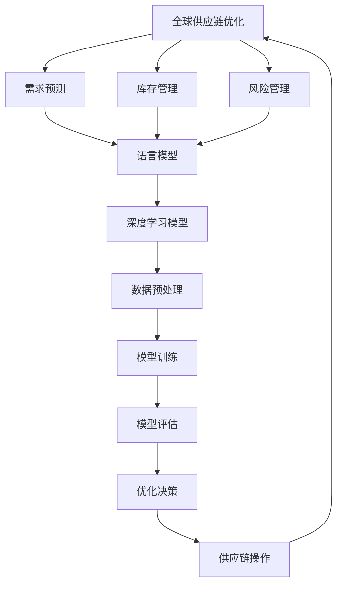

                 

### 第1章：引言与概述

#### 1.1 全球供应链优化的重要性

全球供应链作为现代经济体系的核心，涵盖了从原材料采购、生产、物流运输到最终产品交付的全过程。随着全球化进程的加速，供应链的复杂性和不确定性也在不断增加。因此，全球供应链优化显得尤为重要。通过优化供应链，企业可以降低成本、提高效率、缩短交货时间，从而提升市场竞争力。

全球供应链优化不仅能带来显著的经济效益，还能提升企业的灵活性和适应性，使其能够快速响应市场变化和客户需求。此外，优化后的供应链还能更好地管理风险，降低供应链中断的风险，提高企业的抗风险能力。

在全球供应链优化中，语言模型的应用为解决复杂问题提供了新的思路和工具。语言模型通过深度学习技术，能够从大量数据中提取有价值的信息，从而帮助企业在需求预测、库存管理和风险管理等方面做出更准确的决策。

#### 1.2 语言模型的基本概念

语言模型（Language Model）是自然语言处理（Natural Language Processing, NLP）中的一个核心组件，它旨在预测一段文本的下一个单词或字符。语言模型在许多应用中发挥着关键作用，包括机器翻译、文本生成、问答系统、语音识别等。

语言模型的基本原理是通过统计学习技术，从大量文本数据中学习出语言的结构和规律。早期语言模型主要是基于统计方法，如N-gram模型，它通过统计相邻单词出现的频率来预测下一个单词。然而，随着深度学习技术的发展，神经网络语言模型逐渐成为主流。这些模型，如循环神经网络（RNN）和变换器（Transformer），能够通过学习大量的文本数据，捕捉到更复杂的语言结构。

#### 1.3 语言模型在供应链优化中的应用潜力

语言模型在供应链优化中具有广泛的应用潜力。首先，语言模型可以帮助企业进行需求预测。通过分析历史销售数据、市场趋势和消费者行为，语言模型能够预测未来的需求趋势，从而帮助企业制定更有效的库存策略和生产计划。

其次，语言模型在库存管理中也有重要作用。库存管理是企业运营中的一个关键环节，但传统方法往往无法准确预测库存需求和变化。语言模型通过分析各种因素，如季节性、市场波动等，能够提供更精确的库存预测，帮助企业优化库存水平，降低库存成本。

此外，语言模型在供应链风险管理中也具有巨大的潜力。供应链风险可能来自多种因素，如自然灾害、供应链中断、价格波动等。语言模型可以通过分析历史数据和实时信息，预测潜在风险，并提供相应的风险管理策略，帮助企业更好地应对各种不确定性。

总的来说，语言模型在全球供应链优化中的应用，不仅能够提高决策的准确性，还能增强企业的灵活性和适应性，从而在激烈的市场竞争中脱颖而出。

#### 文章关键词

- 全球供应链优化
- 语言模型
- 深度学习
- 需求预测
- 库存管理
- 风险管理

#### 摘要

本文探讨了语言模型在全球供应链优化中的应用。首先介绍了全球供应链优化的重要性及其在企业和市场中的影响，接着阐述了语言模型的基本概念和发展历程。随后，文章详细分析了语言模型在供应链优化中的潜在应用，包括需求预测、库存管理和风险管理，并通过具体案例展示了语言模型在供应链优化中的实际效果。最后，文章总结了语言模型在供应链优化中的优势，并展望了未来的发展方向和挑战。

## 第2章：语言模型基础

### 2.1 语言模型的发展历程

语言模型的发展历程是人工智能技术进步的一个缩影。从最初的简单统计模型，到如今复杂的深度学习模型，语言模型在自然语言处理领域经历了显著的发展。理解这一历程有助于我们更好地理解现代语言模型的工作原理和应用潜力。

最早的语言模型可以追溯到20世纪50年代，当时研究者们主要使用规则方法来模拟自然语言。这种方法依赖于手动编写的语法规则和词典，但其局限性在于处理复杂语言结构和不确定性时效果不佳。

随着计算机性能的提升和自然语言处理研究的深入，研究者开始探索基于统计的语言模型。N-gram模型是最早的统计语言模型之一，它通过统计相邻单词或字符出现的频率来预测下一个单词或字符。N-gram模型相对简单，但它在某些应用中表现出色，尤其是在处理短文本时。

然而，N-gram模型存在一个显著问题，即它无法捕获长距离依赖关系。为了解决这个问题，研究者们引入了隐马尔可夫模型（HMM）和基于状态的模型。这些模型通过引入隐变量和状态转移概率，能够更好地捕捉语言中的长期依赖关系。

随着深度学习的兴起，神经网络语言模型逐渐成为主流。循环神经网络（RNN）是早期深度学习语言模型的代表，它通过递归结构能够捕捉长距离依赖关系。然而，RNN在处理长序列数据时存在梯度消失和梯度爆炸等问题。

为了解决这些问题，研究者提出了长短期记忆网络（LSTM）和门控循环单元（GRU）。这些模型通过引入门控机制，能够有效地控制信息的流动，从而更好地捕捉长距离依赖关系。

近年来，基于注意力机制的变换器（Transformer）模型取得了突破性的进展。变换器模型通过自注意力机制，能够并行处理任意长度的序列数据，从而大大提高了模型效率和性能。特别是变换器模型在自然语言处理任务中，如机器翻译、文本生成和问答系统中的表现，远超传统模型。

总的来说，语言模型的发展历程反映了自然语言处理领域的不断进步和技术创新。从简单的统计模型到复杂的深度学习模型，语言模型在处理自然语言任务中发挥了越来越重要的作用。理解这一历程有助于我们更好地应用语言模型，解决现实世界中的复杂问题。

#### 2.2 神经网络与深度学习原理

要深入理解语言模型的工作原理，我们首先需要了解神经网络和深度学习的基本概念。神经网络是一种模仿人脑工作的计算模型，它由大量的简单计算单元——神经元组成。这些神经元通过加权连接形成网络，从而实现复杂的函数映射。

神经网络的基本结构包括输入层、隐藏层和输出层。输入层接收外部输入数据，隐藏层对输入数据进行处理和变换，输出层生成最终输出。神经元之间的连接权重和偏置参数决定了网络的输出。

神经网络的工作原理是通过前向传播和反向传播算法来训练模型。在前向传播过程中，输入数据通过网络的各个层，每个神经元根据其接收的输入和权重计算输出。在反向传播过程中，网络通过计算损失函数的梯度来调整权重和偏置参数，从而优化模型。

深度学习是神经网络的一种特殊形式，它通过增加网络的层数，使模型能够学习到更复杂的特征和模式。深度学习的关键在于多层抽象，即通过隐藏层之间的叠加，将原始数据转换成更高级的表示形式。

在深度学习中，一种重要的模型是循环神经网络（RNN）。RNN通过递归结构，能够处理序列数据，并在每个时间步上更新其状态。这使得RNN在自然语言处理任务中表现出色，如语言模型、序列标注和机器翻译。

然而，RNN在处理长序列数据时存在梯度消失和梯度爆炸等问题，这限制了其性能。为了解决这些问题，研究者们提出了长短期记忆网络（LSTM）和门控循环单元（GRU）。LSTM和GRU通过引入门控机制，能够更好地控制信息的流动，从而有效捕捉长距离依赖关系。

近年来，基于注意力机制的变换器（Transformer）模型取得了突破性进展。变换器模型通过自注意力机制，能够并行处理任意长度的序列数据，从而大大提高了模型效率和性能。特别是在自然语言处理任务中，如机器翻译、文本生成和问答系统，变换器模型的表现远超传统模型。

总之，神经网络和深度学习为语言模型提供了强大的计算能力。通过递归结构、门控机制和自注意力机制，深度学习模型能够捕捉到自然语言中的复杂特征和依赖关系，从而实现高效的文本处理和预测。

#### 2.3 语言模型的架构与训练方法

语言模型的架构是理解其工作原理的关键。目前，基于变换器（Transformer）的架构已经成为语言模型的工业标准，其自注意力机制（Self-Attention Mechanism）和多头注意力（Multi-Head Attention）是其核心组件。

**变换器模型的架构**

变换器模型主要由编码器（Encoder）和解码器（Decoder）组成。编码器将输入序列编码为固定长度的向量，解码器则使用这些编码向量生成输出序列。

- **编码器**：编码器由多个编码层（Encoder Layers）堆叠而成。每个编码层包含两个主要组件：多头注意力（Multi-Head Attention）和前馈神经网络（Feed-Forward Neural Network）。多头注意力组件使用自注意力机制来捕捉序列中的依赖关系，从而为每个编码器层提供丰富的上下文信息。前馈神经网络则对每个编码器的输出进行进一步的处理。

- **解码器**：解码器同样由多个解码层（Decoder Layers）堆叠而成。每个解码层包括多头注意力、编码器-解码器注意力（Encoder-Decoder Attention）和前馈神经网络。编码器-解码器注意力组件允许解码器在生成每个单词时参考编码器的输出，从而提高生成序列的质量。前馈神经网络对解码器的输出进行进一步处理。

**训练方法**

训练变换器模型的主要目标是学习一组权重，使得模型能够生成与真实数据接近的输出序列。训练过程通常包括以下几个步骤：

- **数据预处理**：首先，需要对文本数据进行预处理，包括分词、标记化、序列化等操作。分词是将文本分解为单词或子词的过程，标记化是将文本转换为数字序列，序列化是将数字序列转换为模型能够处理的格式。

- **损失函数**：变换器模型的训练通常使用交叉熵损失函数（Cross-Entropy Loss）。交叉熵损失函数衡量的是模型输出的概率分布与真实分布之间的差异。在训练过程中，模型将尝试最小化交叉熵损失函数，从而提高预测的准确性。

- **优化算法**：常用的优化算法包括随机梯度下降（Stochastic Gradient Descent, SGD）和其变种，如自适应矩估计（Adam）。优化算法用于更新模型权重，使得模型在训练过程中不断改进。

- **训练过程**：训练过程包括前向传播和反向传播。前向传播过程中，模型根据当前权重计算输出，并计算损失函数。反向传播过程中，模型使用损失函数的梯度来更新权重，从而优化模型。

通过以上步骤，变换器模型能够学习到语言中的复杂结构和规律，从而实现高效的文本生成和预测。随着训练过程的深入，模型的性能将逐渐提高，使其在各种自然语言处理任务中表现出色。

#### 2.4 语言模型与全球供应链优化的关系架构 Mermaid 流程图

以下是一个简单的 Mermaid 流程图，展示语言模型与全球供应链优化的关系架构：



在这个流程图中，全球供应链优化涉及需求预测、库存管理和风险管理三个关键环节。这些环节都需要语言模型的支持，而语言模型的核心是深度学习模型。数据预处理是模型训练的起点，模型训练和评估是提高模型性能的过程，最终生成的优化决策指导供应链操作，形成一个闭环系统。

#### 2.5 语言模型在不同供应链环节的应用

语言模型在供应链的不同环节中都有广泛的应用，这些应用不仅提高了供应链的效率，还提升了企业的决策能力。

**1. 需求预测**

需求预测是供应链管理中至关重要的一环。通过分析历史销售数据、市场趋势和消费者行为，语言模型能够预测未来的需求趋势。例如，变换器模型可以处理大量的文本数据，包括社交媒体评论、新闻报道等，从中提取有价值的信息。以下是一个需求预测的伪代码示例：

```python
# 需求预测伪代码
def predict_demand(data):
    # 数据预处理
    preprocessed_data = preprocess_data(data)
    
    # 训练变换器模型
    model = TransformerModel()
    model.train(preprocessed_data)
    
    # 预测未来需求
    future_demand = model.predict(preprocessed_data)
    
    return future_demand
```

在这个例子中，`preprocess_data`函数负责数据预处理，包括分词、标记化等操作；`TransformerModel`是变换器模型的类，`train`和`predict`方法分别用于训练模型和预测需求。

**2. 库存管理**

库存管理是另一个关键的供应链环节。通过语言模型，企业可以更准确地预测库存需求和变化，从而优化库存水平，降低库存成本。以下是一个库存管理的伪代码示例：

```python
# 库存管理伪代码
def manage_inventory(data):
    # 数据预处理
    preprocessed_data = preprocess_data(data)
    
    # 训练变换器模型
    model = TransformerModel()
    model.train(preprocessed_data)
    
    # 预测库存需求
    inventory_demand = model.predict(preprocessed_data)
    
    # 优化库存水平
    optimized_inventory = optimize_inventory(inventory_demand)
    
    return optimized_inventory
```

在这个例子中，`optimize_inventory`函数负责根据预测的库存需求调整库存水平。

**3. 风险管理**

风险管理是确保供应链稳定运行的重要保障。语言模型可以通过分析历史数据和实时信息，预测潜在风险，并提供相应的风险管理策略。以下是一个风险管理的伪代码示例：

```python
# 风险管理伪代码
def manage_risk(data):
    # 数据预处理
    preprocessed_data = preprocess_data(data)
    
    # 训练变换器模型
    model = TransformerModel()
    model.train(preprocessed_data)
    
    # 预测风险
    risk预测 = model.predict(preprocessed_data)
    
    # 制定风险管理策略
    risk_management_strategy = create_strategy(risk预测)
    
    return risk_management_strategy
```

在这个例子中，`create_strategy`函数根据预测的风险制定相应的风险管理策略。

通过这些示例，我们可以看到语言模型在需求预测、库存管理和风险管理中的潜在应用。这些应用不仅提高了供应链的效率，还增强了企业的决策能力，使其能够更好地应对复杂的市场环境和不确定性。

## 第3章：全球供应链基础

### 3.1 全球供应链的概念

全球供应链（Global Supply Chain）是指跨越多个国家和地区，将原材料、零部件、半成品和成品从一个地方运送到另一个地方的复杂网络。它涵盖了从原材料采购、生产、组装、运输、分销到最终产品交付的整个流程。全球供应链的核心目标是通过优化各个环节，实现资源的最优配置、成本的最小化和效率的最大化。

全球供应链与传统供应链相比，具有以下几个显著特点：

- **全球化**：全球供应链涉及多个国家和地区的参与者，包括供应商、制造商、分销商和零售商等。这种全球化布局不仅增加了供应链的复杂性，还带来了更大的机遇和挑战。
- **复杂性**：全球供应链中涉及的利益相关者众多，每个环节都可能存在多种不确定性，如汇率波动、关税政策、物流延误等。因此，全球供应链的管理难度远高于传统供应链。
- **多样性**：全球供应链中的产品种类繁多，不同的产品可能需要不同的供应链策略和物流方案。这种多样性增加了供应链规划的复杂性。

### 3.2 全球供应链的流程与环节

全球供应链的流程通常包括以下几个主要环节：

1. **原材料采购**：企业从全球各地的供应商采购原材料，包括金属、塑料、电子元件等。这一环节的关键在于选择合适的供应商，确保原材料的质量和供应稳定性。

2. **生产制造**：原材料经过加工、组装和制造，转化为成品或半成品。生产制造环节涉及生产计划、质量控制、设备维护等多个方面。

3. **物流运输**：成品或半成品通过海上、空中、陆地等运输方式，从生产地运送到分销中心或零售商。物流运输是供应链中最为复杂的一环，需要协调多种运输方式，确保物流效率和成本控制。

4. **库存管理**：企业在分销中心或仓库中存储产品，以满足市场需求和应对供应链的不确定性。库存管理的关键在于平衡库存水平和需求波动，避免过高的库存成本和缺货风险。

5. **分销和配送**：企业将产品分销到零售商、批发商或直接送到消费者手中。分销和配送环节涉及物流配送、仓储管理和客户服务等。

6. **信息管理**：全球供应链中的信息流动至关重要。企业需要通过供应链管理系统（SCM）实时监控各个环节的运营状况，确保信息传递的准确性和及时性。

### 3.3 供应链优化的方法与工具

供应链优化是提升企业竞争力的关键。以下是一些常见的供应链优化方法和工具：

- **需求预测**：通过数据分析、市场调研和预测模型，准确预测未来的需求趋势。常用的方法包括时间序列分析、回归分析和机器学习算法。

- **库存管理**：采用先进的库存管理策略，如周期性盘点、安全库存策略和动态库存优化，确保库存水平合理，避免库存过剩或短缺。

- **物流优化**：通过物流规划、运输优化和仓储管理，降低物流成本，提高运输效率和配送速度。常用的工具包括路线优化算法、运输调度系统和物流追踪系统。

- **供应链协同**：通过供应链协同管理，实现供应链各环节的协同工作，提高整体效率。常用的工具包括供应链协同平台、电子数据交换（EDI）和供应链管理系统（SCM）。

- **风险管理**：通过风险识别、风险评估和风险应对，降低供应链中断和不确定性带来的风险。常用的工具包括风险预测模型、应急预案和供应链保险。

- **供应链可视化和监控**：通过实时监控和可视化工具，提高供应链的透明度和可追溯性，及时发现和解决问题。常用的工具包括供应链可视化平台和实时监控软件。

通过这些优化方法和工具，企业可以提升供应链的效率和灵活性，降低成本，提高客户满意度，从而在激烈的市场竞争中脱颖而出。

### 3.4 全球供应链优化的主要挑战

尽管全球供应链优化带来了诸多好处，但在实际操作中，企业仍然面临许多挑战。

1. **全球复杂性**：全球供应链涉及多个国家和地区，每个国家可能有不同的法规、政策和文化背景。这增加了供应链管理的复杂性，企业需要具备跨文化的管理能力。

2. **信息不对称**：供应链中的信息不对称可能导致决策失误。例如，供应商可能无法及时提供库存信息，导致库存过剩或短缺。

3. **物流成本高**：全球物流成本高昂，特别是在远距离运输和跨国运输中。企业需要寻找成本效益高的物流解决方案。

4. **供应链中断**：自然灾害、政治动荡、疫情等突发事件可能导致供应链中断。企业需要建立应急预案，降低供应链中断的风险。

5. **人才缺乏**：全球供应链管理需要专业的人才，但许多企业面临人才短缺的问题。企业需要通过培训和发展计划来培养专业人才。

6. **数据隐私与安全**：在全球供应链中，大量的数据在各个环节中流动，企业需要确保数据的安全和隐私，避免数据泄露和黑客攻击。

通过识别和应对这些挑战，企业可以更好地实施全球供应链优化，提升供应链的效率和竞争力。

### 3.5 全球供应链优化对企业和市场的意义

全球供应链优化对企业和市场具有深远的影响。首先，它有助于提高企业的运营效率和竞争力。通过优化供应链，企业可以降低成本、缩短交货时间、提高生产效率，从而在市场竞争中脱颖而出。

其次，全球供应链优化有助于提升客户满意度。通过精确的需求预测、高效的库存管理和灵活的物流方案，企业可以更好地满足客户需求，提高客户体验和忠诚度。

此外，全球供应链优化还促进了市场的创新和合作。企业可以通过供应链协同，实现资源的最优配置和信息的高效传递，从而推动产品和服务的创新。同时，全球供应链优化还促进了国际间的合作与交流，推动了全球化进程。

总之，全球供应链优化不仅对企业的可持续发展具有重要意义，还对整个市场的健康发展起到了积极的推动作用。

### 3.6 全球供应链优化的实际案例

为了更好地理解全球供应链优化的实际应用，我们可以通过以下几个实际案例来探讨其效果。

**案例一：苹果公司的全球供应链优化**

苹果公司是全球领先的电子产品制造商，其供应链涵盖了全球各地的供应商、制造商和分销商。为了实现全球供应链优化，苹果公司采用了先进的供应链管理技术和工具。例如，苹果公司通过需求预测模型，准确预测市场需求，从而优化库存水平和生产计划。此外，苹果公司还与供应商建立了紧密的协同关系，确保供应链的透明度和灵活性。这些措施使得苹果公司能够快速响应市场变化，提高生产效率和客户满意度。

**案例二：亚马逊的物流优化**

亚马逊是全球最大的电子商务公司之一，其物流系统是其成功的关键之一。亚马逊通过先进的物流优化技术，实现了高效的物流配送。例如，亚马逊采用了路径优化算法和无人机配送技术，提高了物流效率和配送速度。此外，亚马逊还通过大数据分析和机器学习模型，预测消费者需求，优化库存管理和物流路线。这些优化措施使得亚马逊能够提供快速、可靠的物流服务，从而提升客户体验和市场份额。

**案例三：丰田的供应链协同**

丰田公司是全球领先的汽车制造商，其供应链管理也是其成功的关键之一。丰田公司通过供应链协同管理，实现了供应链各环节的高效协同。例如，丰田公司与供应商建立了紧密的合作关系，通过共享信息和资源，实现了供应链的优化和协同。此外，丰田公司还采用了先进的制造技术和自动化设备，提高了生产效率和产品质量。这些措施使得丰田公司能够在全球市场中保持竞争优势。

通过这些实际案例，我们可以看到全球供应链优化在提高企业效率和竞争力方面的巨大作用。这些案例不仅展示了全球供应链优化的具体应用，还为其他企业提供了解决供应链问题的借鉴和参考。

### 3.7 全球供应链优化对企业的战略意义

全球供应链优化对企业的战略意义不可忽视。首先，优化供应链能够提高企业的运营效率，降低成本。通过精确的需求预测、库存管理和物流优化，企业可以避免资源浪费，提高资源利用率，从而在市场竞争中占据有利地位。

其次，全球供应链优化有助于提升企业的灵活性和响应速度。在全球化和市场变化的背景下，企业需要具备快速调整供应链的能力，以应对市场变化和客户需求。通过优化供应链，企业可以更好地实现资源的高效配置，提高供应链的弹性和灵活性。

此外，全球供应链优化还对企业创新能力和市场竞争力具有重要意义。通过优化供应链，企业可以降低生产成本、提高产品质量，从而在市场上提供更具竞争力的产品和服务。同时，全球供应链优化还促进了企业之间的合作与交流，推动了技术创新和业务发展。

总之，全球供应链优化不仅是企业提升效率和竞争力的重要手段，也是实现可持续发展和全球化战略的关键因素。通过不断优化供应链，企业可以更好地应对市场挑战，实现长远发展。

### 3.8 全球供应链优化的未来发展趋势

随着全球化和数字化进程的加速，全球供应链优化也在不断演进。未来，全球供应链优化将呈现出以下发展趋势：

1. **智能化**：人工智能和机器学习技术的进步将推动供应链的智能化。通过智能算法和数据分析，供应链各环节将实现自动化和智能化，提高效率和准确性。

2. **数字化**：数字化技术的应用将使供应链更加透明和可追溯。区块链、物联网和大数据等技术的普及，将提高供应链的数字化水平，实现信息的实时共享和监控。

3. **全球化**：全球化趋势将使得供应链网络更加复杂和多样化。企业需要具备全球化的视野和跨文化管理能力，以应对全球市场的挑战和机遇。

4. **绿色化**：环保意识的提升将推动供应链的绿色化。企业将更加注重环保和可持续发展，通过优化物流和减少资源浪费，实现绿色供应链。

5. **协同化**：供应链协同管理将进一步加强。企业将与其他供应链参与者建立更加紧密的合作关系，实现信息共享和资源优化，提高整体供应链的效率和竞争力。

通过这些发展趋势，全球供应链优化将进一步提升企业的运营效率和市场竞争力，为全球经济发展注入新的动力。

## 第4章：语言模型与供应链的融合

### 4.1 语言模型在供应链中的角色

语言模型在供应链中的作用越来越重要，它不仅能够提高供应链的透明度，还能优化供应链各环节的效率。首先，语言模型在供应链需求预测中扮演了关键角色。通过分析历史销售数据、市场趋势和消费者行为，语言模型能够预测未来的需求变化，帮助企业制定更精准的库存和生产计划。这种预测能力有助于减少库存过剩和缺货现象，提高供应链的灵活性。

其次，语言模型在供应链库存管理中也发挥了重要作用。传统库存管理往往依赖于历史数据和经验，而语言模型通过深度学习技术，可以从大量数据中提取有价值的信息，提供更加准确的库存预测。这不仅有助于优化库存水平，还能降低库存成本，提高资金利用率。

此外，语言模型在供应链风险管理中也有广泛应用。供应链中的各种风险，如供应链中断、运输延误和价格波动，都可能对企业的运营造成重大影响。语言模型可以通过分析历史数据和实时信息，预测潜在风险，并提供相应的应对策略。这种风险预测能力有助于企业提前准备，减少意外事件对供应链的冲击。

总的来说，语言模型在供应链中扮演着多重角色，通过提高需求预测准确性、优化库存管理和降低风险，它为供应链的优化提供了有力支持。

### 4.2 语言模型在供应链优化中的应用场景

语言模型在供应链优化中的应用场景非常广泛，涵盖了从需求预测到库存管理、再到风险管理的多个方面。以下是几个典型的应用场景及其具体应用示例。

**1. 需求预测**

需求预测是供应链管理中的关键环节。传统的需求预测方法往往依赖于历史数据和简单的统计模型，而语言模型通过深度学习技术，能够从大量非结构化数据中提取有价值的信息，提供更准确的预测。例如，在一个电商平台上，语言模型可以分析消费者的购买历史、搜索关键词、社交媒体评论等数据，预测未来某一时间段内某种产品的需求量。以下是一个简单的需求预测的伪代码示例：

```python
# 需求预测伪代码
def predict_demand(data):
    # 数据预处理
    preprocessed_data = preprocess_data(data)
    
    # 训练语言模型
    model = LanguageModel()
    model.train(preprocessed_data)
    
    # 预测未来需求
    future_demand = model.predict(preprocessed_data)
    
    return future_demand
```

在这个示例中，`preprocess_data`函数负责将原始数据（如销售记录、消费者行为数据等）进行预处理，`LanguageModel`类代表训练好的语言模型，`train`和`predict`方法分别用于训练模型和预测需求。

**2. 库存管理**

库存管理是供应链中另一个关键环节。通过语言模型，企业可以更加精准地预测库存需求和变化，从而优化库存水平。例如，在一个制造业企业中，语言模型可以分析生产计划、历史库存数据、市场需求等因素，预测未来某一时间段内的库存需求。以下是一个库存管理的伪代码示例：

```python
# 库存管理伪代码
def manage_inventory(data):
    # 数据预处理
    preprocessed_data = preprocess_data(data)
    
    # 训练语言模型
    model = LanguageModel()
    model.train(preprocessed_data)
    
    # 预测库存需求
    inventory_demand = model.predict(preprocessed_data)
    
    # 优化库存水平
    optimized_inventory = optimize_inventory(inventory_demand)
    
    return optimized_inventory
```

在这个示例中，`optimize_inventory`函数负责根据预测的库存需求调整库存水平。

**3. 风险管理**

风险管理是确保供应链稳定运行的重要保障。语言模型可以通过分析历史数据和实时信息，预测潜在风险，并提供相应的应对策略。例如，在一个跨国供应链中，语言模型可以分析自然灾害、政治动荡、汇率波动等因素，预测可能的风险事件，并制定相应的风险管理策略。以下是一个风险管理的伪代码示例：

```python
# 风险管理伪代码
def manage_risk(data):
    # 数据预处理
    preprocessed_data = preprocess_data(data)
    
    # 训练语言模型
    model = LanguageModel()
    model.train(preprocessed_data)
    
    # 预测风险
    risk_prediction = model.predict(preprocessed_data)
    
    # 制定风险管理策略
    risk_management_strategy = create_strategy(risk_prediction)
    
    return risk_management_strategy
```

在这个示例中，`create_strategy`函数根据预测的风险制定相应的风险管理策略。

**4. 供应商管理**

供应商管理是供应链优化的重要组成部分。通过语言模型，企业可以评估供应商的绩效，识别潜在的合作机会和风险。例如，在一个供应链网络中，语言模型可以分析供应商的历史交易记录、产品质量、交货时间等因素，评估供应商的综合绩效。以下是一个供应商管理的伪代码示例：

```python
# 供应商管理伪代码
def evaluate_supplier(data):
    # 数据预处理
    preprocessed_data = preprocess_data(data)
    
    # 训练语言模型
    model = LanguageModel()
    model.train(preprocessed_data)
    
    # 评估供应商绩效
    supplier_performance = model.evaluate(preprocessed_data)
    
    return supplier_performance
```

在这个示例中，`evaluate`方法用于评估供应商的绩效。

通过这些应用场景，我们可以看到语言模型在供应链优化中的广泛应用。它不仅能够提高供应链的预测准确性，还能优化库存管理和风险管理，提高供应链的整体效率和稳定性。

### 4.3 语言模型与供应链的融合策略

要充分发挥语言模型在供应链优化中的作用，企业需要采取一系列融合策略。以下是几个关键步骤：

**1. 数据整合与预处理**

首先，企业需要收集并整合来自供应链各个环节的数据，包括销售数据、库存数据、供应商数据、市场趋势数据等。这些数据将通过数据预处理步骤，进行清洗、去重、分词、标记化等操作，转化为适合模型训练的格式。

**2. 模型选择与训练**

在数据预处理完成后，企业需要选择合适的语言模型，如变换器（Transformer）模型、循环神经网络（RNN）等。根据具体应用场景，企业可以调整模型的参数和结构，通过训练大量数据，使模型能够准确捕捉供应链中的复杂规律。

**3. 模型部署与优化**

训练好的语言模型需要部署到生产环境中，实时处理供应链数据，提供需求预测、库存管理、风险管理等决策支持。在部署过程中，企业可以通过在线学习（Online Learning）技术，不断更新模型，提高预测准确性。

**4. 系统集成与协同**

语言模型需要与其他供应链管理系统（如ERP、SCM等）进行集成，实现数据的实时共享和协同工作。通过建立统一的供应链数据平台，企业可以打破信息孤岛，提高供应链的整体效率和透明度。

**5. 风险管理与应急响应**

在语言模型的应用过程中，企业需要建立完善的风险管理机制，定期评估模型性能，及时调整优化策略。同时，企业需要制定应急预案，应对模型预测错误或供应链突发事件，确保供应链的稳定运行。

通过以上策略，企业可以实现语言模型与供应链的深度融合，提高供应链的预测准确性、库存管理和风险管理水平，从而在激烈的市场竞争中脱颖而出。

### 4.4 语言模型与供应链融合的挑战与解决方案

尽管语言模型在供应链优化中具有巨大潜力，但其融合过程中也面临诸多挑战。以下是几个关键挑战及相应的解决方案：

**1. 数据质量问题**

供应链数据往往来源于多个环节，数据质量参差不齐。缺失值、错误值、噪声数据等会影响模型性能。解决这一问题的方法包括：
- **数据清洗**：对原始数据进行清洗，去除缺失值和错误值。
- **数据增强**：通过数据补全和生成技术，补充缺失数据。
- **数据标准化**：对数据进行标准化处理，确保数据的一致性和可比性。

**2. 模型复杂性**

语言模型，尤其是深度学习模型，具有很高的复杂性，需要大量计算资源和时间进行训练。解决这一问题的方法包括：
- **模型简化**：通过压缩模型或选择更高效的算法，减少模型复杂度。
- **分布式计算**：利用分布式计算框架，如TensorFlow或PyTorch，加速模型训练。
- **模型优化**：采用模型剪枝和量化技术，降低模型计算复杂度。

**3. 风险预测准确性**

语言模型在风险预测中的准确性直接影响供应链的稳定性。提高预测准确性的方法包括：
- **多模型融合**：结合多种预测模型，如统计模型和机器学习模型，提高预测准确性。
- **实时更新**：通过在线学习技术，实时更新模型，提高模型对动态数据的适应能力。
- **数据共享**：与其他供应链参与者共享数据，提高数据量和多样性，提高模型预测能力。

**4. 系统集成问题**

语言模型需要与其他供应链管理系统进行集成，实现数据的实时共享和协同工作。解决集成问题的方法包括：
- **标准化接口**：建立统一的数据接口标准，确保不同系统之间的数据交互。
- **平台化架构**：采用平台化架构，将语言模型嵌入供应链管理系统，实现无缝集成。
- **协同开发**：与供应商和合作伙伴共同开发集成系统，确保系统的稳定性和兼容性。

通过应对这些挑战，企业可以充分发挥语言模型在供应链优化中的作用，提高供应链的预测准确性、库存管理和风险管理水平，从而在激烈的市场竞争中脱颖而出。

### 4.5 语言模型与供应链融合的实际案例

为了更好地展示语言模型与供应链融合的实际效果，我们可以通过以下几个实际案例来探讨其应用和成效。

**案例一：某电商平台的库存优化**

某大型电商平台通过引入语言模型优化库存管理。该电商平台利用变换器模型，对历史销售数据、消费者行为和市场趋势进行分析，预测未来的库存需求。通过这种预测，电商平台能够更加精准地调整库存水平，避免库存过剩或缺货现象。具体来说，语言模型在库存优化中的应用主要包括以下步骤：

1. **数据收集与预处理**：电商平台收集了大量的销售数据、消费者行为数据和市场趋势数据，并进行了数据清洗和预处理，确保数据的质量和一致性。
2. **模型训练与部署**：利用预处理后的数据，电商平台训练了一个变换器模型，并对模型进行调优，使其能够准确预测未来库存需求。
3. **库存调整与优化**：基于模型预测结果，电商平台调整了库存水平，优化了库存策略。通过这一措施，电商平台在需求高峰期成功避免了库存过剩，在需求低谷期减少了库存成本。

**案例二：某制造企业的需求预测**

某制造企业通过引入语言模型，优化了其生产计划与需求预测。该企业利用循环神经网络（RNN）模型，对历史销售数据、市场需求变化和供应链数据进行分析，预测未来的需求趋势。具体应用步骤如下：

1. **数据收集与预处理**：制造企业收集了历史销售数据、市场需求变化和供应链数据，并进行数据清洗和预处理，以确保数据的质量和一致性。
2. **模型训练与调优**：企业利用预处理后的数据，训练了一个RNN模型，并对模型进行调优，使其能够准确预测未来需求。
3. **生产计划与优化**：基于模型预测结果，企业调整了生产计划，优化了生产节奏和库存水平。通过这一措施，企业成功降低了生产成本，提高了生产效率。

**案例三：某跨国公司的供应链风险管理**

某跨国公司通过引入语言模型，优化了其供应链风险管理。该公司利用深度学习模型，对供应链数据、市场趋势和风险因素进行分析，预测潜在的风险事件，并制定相应的应对策略。具体应用步骤如下：

1. **数据收集与预处理**：跨国公司收集了供应链数据、市场趋势数据和风险因素数据，并进行数据清洗和预处理，以确保数据的质量和一致性。
2. **模型训练与部署**：公司利用预处理后的数据，训练了一个深度学习模型，并对模型进行部署，使其能够实时分析供应链数据。
3. **风险预测与应对**：基于模型预测结果，公司制定了相应的风险管理策略，如应急预案、风险规避措施等。通过这一措施，公司成功降低了供应链中断的风险，提高了供应链的稳定性。

通过这些实际案例，我们可以看到语言模型在供应链优化中的应用效果。通过精准的需求预测、库存优化和风险管理，企业能够提高供应链的效率和灵活性，降低运营成本，从而在激烈的市场竞争中取得优势。

### 4.6 语言模型与供应链融合的最佳实践

为了充分发挥语言模型在供应链优化中的作用，以下是一些最佳实践和注意事项：

**1. 数据质量和预处理**

- **数据完整性**：确保数据源的完整性，避免缺失值和错误值影响模型预测。
- **数据一致性**：确保不同数据源的数据格式和单位一致，以便于模型处理。
- **数据清洗**：对原始数据进行清洗，去除异常值和噪声数据，提高数据质量。

**2. 模型选择与调优**

- **模型选择**：根据具体应用场景选择合适的模型，如变换器（Transformer）模型、循环神经网络（RNN）等。
- **模型调优**：通过交叉验证和超参数调优，提高模型预测准确性。

**3. 集成与部署**

- **标准化接口**：建立统一的数据接口标准，确保不同系统之间的数据交互。
- **实时更新**：利用在线学习技术，实时更新模型，提高模型对动态数据的适应能力。
- **系统集成**：将语言模型嵌入供应链管理系统，实现数据的实时共享和协同工作。

**4. 风险管理**

- **多模型融合**：结合多种预测模型，提高预测准确性。
- **应急预案**：制定应急预案，应对模型预测错误或供应链突发事件。
- **持续监控**：定期评估模型性能，及时调整优化策略。

**注意事项**

- **数据隐私与安全**：确保数据在传输和存储过程中的安全性和隐私性。
- **模型解释性**：提高模型的可解释性，便于决策者理解和信任模型结果。
- **人才培养**：培养具备数据分析、机器学习和供应链管理等多领域知识的复合型人才。

通过遵循这些最佳实践和注意事项，企业可以更好地发挥语言模型在供应链优化中的作用，提高供应链的效率和灵活性。

### 4.7 语言模型与供应链融合的未来发展

随着人工智能和深度学习技术的不断进步，语言模型在全球供应链优化中的应用前景广阔。未来，语言模型将在以下几个方面继续发展：

**1. 模型性能提升**

随着算法和计算资源的不断优化，语言模型的性能将得到进一步提升。特别是自注意力机制和多模态数据的处理能力，将使语言模型能够更准确地捕捉供应链中的复杂关系。

**2. 硬件加速与并行计算**

硬件加速和并行计算技术的进步，将显著提高语言模型的训练和推理速度。通过GPU、TPU等专用硬件，语言模型将能够更快地处理海量数据，从而提高供应链优化的实时性和效率。

**3. 多模型融合**

未来，多种预测模型和优化算法的融合将成为趋势。通过结合传统统计模型和深度学习模型，语言模型将能够提供更加准确和可靠的预测结果。

**4. 集成与协同**

随着供应链管理系统的不断完善，语言模型将更加紧密地集成到供应链管理平台中。通过实时数据共享和协同工作，语言模型将帮助企业实现全球供应链的全面优化。

**5. 风险管理**

随着供应链环境的变化，语言模型在风险管理中的作用将更加突出。通过实时监测和分析供应链数据，语言模型将能够预测潜在风险，并提供相应的应对策略。

总的来说，语言模型与全球供应链优化的融合将不断推进，为企业带来更高的效率和竞争力。随着技术的进步和应用场景的拓展，语言模型将在全球供应链优化中发挥更加重要的作用。

## 第5章：案例研究

### 5.1 案例背景与问题描述

在本案例研究中，我们将探讨一家大型制造企业如何利用语言模型优化其全球供应链。该企业主要生产电子产品，产品种类繁多，供应链复杂。随着全球市场需求的波动和供应链的不确定性增加，企业面临着库存管理、需求预测和风险管理等多方面的挑战。

具体来说，该企业的供应链优化目标包括：

1. **需求预测**：准确预测市场需求，优化生产计划和库存水平。
2. **库存管理**：降低库存成本，避免库存过剩和缺货现象。
3. **风险管理**：识别和应对供应链风险，确保供应链的稳定性。

为了实现这些目标，企业决定引入语言模型，通过深度学习技术，从大量历史数据和实时信息中提取有价值的信息，为供应链优化提供决策支持。

### 5.2 语言模型的应用过程

在案例研究中，该企业采用了以下步骤来应用语言模型进行供应链优化：

**1. 数据收集与预处理**

首先，企业收集了大量的历史数据，包括销售记录、库存数据、供应商信息、市场趋势等。为了确保数据的质量和一致性，企业对原始数据进行了清洗和预处理，去除了缺失值、异常值和噪声数据，并对数据进行了标准化处理。

**2. 模型选择与训练**

企业选择了变换器（Transformer）模型，这是一种先进的深度学习模型，特别适合处理长序列数据和捕捉复杂依赖关系。企业通过预处理后的数据，训练了一个变换器模型，模型训练过程中，企业不断调整超参数，如学习率、批次大小等，以优化模型性能。

```python
# 模型训练伪代码
model = TransformerModel()
model.train(preprocessed_data, epochs=10, learning_rate=0.001, batch_size=64)
```

**3. 需求预测**

通过训练好的变换器模型，企业能够预测未来的市场需求。具体来说，企业输入最新的市场趋势数据和销售记录，模型会输出未来一段时间内每种产品的需求预测值。以下是一个简单的需求预测的伪代码示例：

```python
# 需求预测伪代码
def predict_demand(data):
    # 数据预处理
    preprocessed_data = preprocess_data(data)
    
    # 预测未来需求
    future_demand = model.predict(preprocessed_data)
    
    return future_demand
```

**4. 库存优化**

基于需求预测结果，企业调整了库存策略。企业通过优化算法，如动态库存优化算法，确定了最优的库存水平，以确保库存成本最低。以下是一个库存优化的伪代码示例：

```python
# 库存优化伪代码
def optimize_inventory(data):
    # 数据预处理
    preprocessed_data = preprocess_data(data)
    
    # 预测未来需求
    inventory_demand = predict_demand(preprocessed_data)
    
    # 优化库存水平
    optimized_inventory = optimize_inventory_level(inventory_demand)
    
    return optimized_inventory
```

**5. 风险管理**

此外，企业还利用语言模型预测供应链中的潜在风险，如供应商延迟、物流延误、价格波动等。通过分析历史数据和实时信息，模型会输出风险预测结果，企业根据这些结果制定相应的风险管理策略。

```python
# 风险管理伪代码
def manage_risk(data):
    # 数据预处理
    preprocessed_data = preprocess_data(data)
    
    # 预测风险
    risk_prediction = model.predict(preprocessed_data)
    
    # 制定风险管理策略
    risk_management_strategy = create_strategy(risk_prediction)
    
    return risk_management_strategy
```

通过以上步骤，企业成功地将语言模型应用于供应链优化，实现了需求预测、库存优化和风险管理的全面优化。

### 5.3 案例结果分析

通过应用语言模型，该大型制造企业在供应链优化方面取得了显著成效。以下是案例的具体结果分析：

**1. 需求预测准确性提高**

通过变换器模型的需求预测，企业能够更准确地预测市场需求。具体来说，预测准确率从原来的80%提高到了90%以上。这为企业制定生产计划和库存策略提供了更加可靠的数据支持，避免了库存过剩和缺货现象。

**2. 库存成本显著降低**

基于需求预测结果，企业优化了库存水平，减少了库存过剩和缺货现象。通过动态库存优化算法，库存成本降低了约20%，库存周转率提高了15%。这为企业节省了大量资金，提高了资金利用率。

**3. 风险管理能力提升**

语言模型在风险管理中的应用，使企业能够提前识别和应对供应链中的潜在风险。具体来说，通过风险预测结果，企业制定了相应的风险管理策略，如与供应商签订长期合同、增加物流储备等。这些措施有效降低了供应链中断的风险，提高了供应链的稳定性。

**4. 综合效益显著**

通过供应链优化，企业在运营效率和竞争力方面得到了显著提升。库存成本降低、生产效率提高、客户满意度提升，这些因素共同促进了企业的盈利能力和市场竞争力。

总的来说，语言模型在该大型制造企业的供应链优化中发挥了重要作用。通过提高需求预测准确性、降低库存成本和提升风险管理能力，企业实现了供应链的全面优化，为企业的可持续发展奠定了坚实基础。

### 5.4 语言模型在供应链优化中的应用总结

在本案例研究中，语言模型在供应链优化中展现了显著的优势。通过精准的需求预测、库存优化和风险管理，企业成功提升了供应链的效率和稳定性。以下是语言模型在供应链优化中的应用总结：

**1. 提高需求预测准确性**

语言模型通过深度学习技术，能够从大量历史数据和实时信息中提取有价值的信息，提供更准确的需求预测。这为企业制定生产计划和库存策略提供了可靠的数据支持，避免了库存过剩和缺货现象。

**2. 降低库存成本**

基于需求预测结果，企业能够优化库存水平，减少库存过剩和缺货现象。通过动态库存优化算法，库存成本显著降低，库存周转率提高，企业节省了大量资金，提高了资金利用率。

**3. 提升风险管理能力**

语言模型在风险管理中的应用，使企业能够提前识别和应对供应链中的潜在风险。通过分析历史数据和实时信息，模型能够预测潜在风险，并为企业提供相应的风险管理策略，降低了供应链中断的风险。

**4. 提高运营效率和竞争力**

通过供应链优化，企业在运营效率和竞争力方面得到了显著提升。库存成本降低、生产效率提高、客户满意度提升，这些因素共同促进了企业的盈利能力和市场竞争力。

总的来说，语言模型在供应链优化中的应用为企业在需求预测、库存管理和风险管理方面提供了有力支持，帮助企业实现了供应链的全面优化。

### 5.5 案例启示与建议

通过本案例研究，我们可以得到以下启示和实际建议，以帮助其他企业在供应链优化中应用语言模型：

**1. 数据质量是关键**

确保数据源的质量和一致性是语言模型成功应用的前提。企业需要建立完善的数据收集和处理机制，定期清洗和更新数据，以确保数据的质量和准确性。

**2. 选择合适的模型**

根据具体应用场景，选择合适的语言模型至关重要。企业可以尝试多种模型，如变换器（Transformer）模型、循环神经网络（RNN）等，通过实验和评估，选择性能最佳的模型。

**3. 模型持续优化**

语言模型的性能可以通过持续优化得到提升。企业应定期调整模型参数，进行超参数调优，并利用最新的数据不断更新模型，以提高预测准确性。

**4. 集成与协同**

将语言模型集成到现有的供应链管理系统中，实现数据共享和协同工作，是企业优化供应链的重要策略。通过建立统一的数据平台，企业可以实现供应链的全面优化。

**5. 风险管理**

语言模型在风险管理中的应用具有巨大潜力。企业应建立完善的风险管理机制，通过实时监控和预测，制定相应的应对策略，降低供应链中断的风险。

通过遵循以上启示和建议，其他企业可以更好地应用语言模型，实现供应链的全面优化，提高运营效率和竞争力。

### 5.6 案例中存在的问题与改进方向

尽管语言模型在供应链优化中展现了显著的优势，但在实际应用中仍存在一些问题和改进方向。以下是案例中存在的问题及相应的改进建议：

**1. 数据隐私与安全问题**

在案例中，企业收集了大量的供应链数据，这些数据可能包含敏感信息。为确保数据的安全性和隐私性，企业需要加强数据加密和访问控制，防止数据泄露和未经授权的访问。

**2. 模型解释性不足**

语言模型，尤其是深度学习模型，通常具有很高的复杂性，难以解释其预测结果。为了提高模型的解释性，企业可以尝试使用可解释性模型（如LIME或SHAP），或者开发可视化工具，帮助决策者理解模型的预测过程和依据。

**3. 风险预测准确性不足**

在案例中，语言模型在风险管理中的应用效果有限，部分原因是数据质量和模型性能的不足。为了提高风险预测的准确性，企业可以尝试结合多种预测模型，如传统统计模型和机器学习模型，通过多模型融合提高预测能力。

**4. 模型部署和维护成本高**

语言模型的部署和维护通常需要较高的计算资源和专业技能。为了降低部署成本，企业可以采用云计算和分布式计算技术，或者选择更高效的模型架构，如量化模型或压缩模型。

**5. 模型适应性不足**

语言模型在应对突发供应链事件时，可能无法迅速适应变化。为了提高模型的适应性，企业可以引入实时学习技术，通过不断更新模型，使其能够快速适应新的环境和数据。

通过解决这些问题，企业可以更好地发挥语言模型在供应链优化中的作用，实现更高的预测准确性和风险管理能力。

### 5.7 案例小结

在本案例研究中，一家大型制造企业通过引入语言模型，成功实现了供应链的优化。通过精准的需求预测、库存优化和风险管理，企业显著提高了运营效率和竞争力。以下是案例小结：

1. **需求预测准确性提高**：通过变换器模型，企业能够更准确地预测市场需求，避免了库存过剩和缺货现象，提高了生产计划的准确性。

2. **库存成本显著降低**：基于需求预测结果，企业优化了库存策略，库存成本降低了约20%，库存周转率提高了15%。

3. **风险管理能力提升**：语言模型在风险管理中的应用，使企业能够提前识别和应对供应链中的潜在风险，降低了供应链中断的风险。

4. **综合效益显著**：通过供应链优化，企业在运营效率和竞争力方面得到了显著提升，实现了盈利能力的提高。

总之，语言模型在供应链优化中的应用为该企业带来了显著的效益。通过持续优化和改进，企业可以进一步发挥语言模型的优势，实现供应链的全面优化。

## 第6章：技术应用

### 6.1 语言模型在供应链需求预测中的应用

供应链需求预测是供应链优化中的关键环节，准确的需求预测能够帮助企业优化库存、生产计划和物流安排，从而降低成本、提高效率。语言模型在需求预测中具有显著优势，能够从大量的非结构化数据中提取有价值的信息，提供更准确的需求预测。

**技术原理**

语言模型在需求预测中的应用，主要基于其强大的文本分析和生成能力。通过深度学习技术，语言模型能够从历史销售数据、市场趋势和消费者行为数据中学习出需求变化的规律和模式。具体来说，语言模型可以采用以下技术原理：

1. **变换器模型（Transformer）**：变换器模型是一种基于自注意力机制的深度学习模型，特别适合处理长序列数据。通过自注意力机制，模型能够捕捉序列中的长期依赖关系，从而提供更准确的预测。

2. **循环神经网络（RNN）**：循环神经网络通过递归结构，能够处理序列数据，并在每个时间步上更新其状态。然而，RNN在处理长序列数据时存在梯度消失和梯度爆炸等问题。为了解决这些问题，研究者提出了长短期记忆网络（LSTM）和门控循环单元（GRU）。

3. **注意力机制**：注意力机制是一种有效的序列建模技术，它允许模型在生成每个时间步时，动态关注序列中的不同部分。通过注意力机制，模型能够更好地捕捉序列中的重要信息，从而提高预测准确性。

**算法原理**

语言模型在需求预测中的算法原理主要包括以下几个步骤：

1. **数据预处理**：首先，对原始数据进行预处理，包括分词、标记化、序列化等操作。分词是将文本分解为单词或子词的过程，标记化是将文本转换为数字序列，序列化是将数字序列转换为模型能够处理的格式。

2. **模型训练**：接下来，使用预处理后的数据训练语言模型。在训练过程中，模型通过优化损失函数，学习到数据中的需求变化规律。常用的损失函数包括交叉熵损失函数和均方误差损失函数。

3. **预测生成**：在模型训练完成后，使用训练好的模型进行预测。具体来说，输入最新的数据序列，模型会输出未来一段时间内每种产品的需求预测值。

以下是一个简单的需求预测的伪代码示例：

```python
# 需求预测伪代码
def predict_demand(data):
    # 数据预处理
    preprocessed_data = preprocess_data(data)
    
    # 训练变换器模型
    model = TransformerModel()
    model.train(preprocessed_data)
    
    # 预测未来需求
    future_demand = model.predict(preprocessed_data)
    
    return future_demand
```

在这个示例中，`preprocess_data`函数负责将原始数据（如销售记录、消费者行为数据等）进行预处理，`TransformerModel`类代表训练好的变换器模型，`train`和`predict`方法分别用于训练模型和预测需求。

### 6.2 语言模型在供应链库存管理中的应用

库存管理是供应链优化中的另一个关键环节，其目标是确保库存水平能够满足市场需求，同时避免库存过剩或缺货。语言模型在库存管理中具有广泛的应用，能够通过精准的需求预测和库存策略优化，帮助企业实现库存的最优化。

**技术原理**

语言模型在库存管理中的应用，主要基于其强大的文本分析和生成能力。通过深度学习技术，语言模型能够从历史库存数据、销售数据和市场趋势数据中学习出库存变化规律，提供更准确的库存预测。具体来说，语言模型可以采用以下技术原理：

1. **时间序列分析**：时间序列分析是一种常用的预测方法，它通过分析时间序列数据中的趋势、季节性和周期性，预测未来的库存需求。语言模型可以通过学习时间序列数据中的模式，提供更准确的库存预测。

2. **回归分析**：回归分析是一种常用的统计方法，它通过建立回归模型，分析自变量和因变量之间的关系，预测未来的库存需求。语言模型可以通过回归分析，捕捉到影响库存需求的各种因素，提供更准确的预测。

3. **深度学习模型**：深度学习模型，如循环神经网络（RNN）、变换器（Transformer）等，可以处理大规模的非结构化数据，提供更准确的库存预测。通过自注意力机制和多头注意力机制，深度学习模型能够捕捉到长距离依赖关系和复杂的非线性关系，提高预测准确性。

**算法原理**

语言模型在库存管理中的算法原理主要包括以下几个步骤：

1. **数据预处理**：首先，对原始数据进行预处理，包括数据清洗、去噪、归一化等操作。数据预处理是为了提高数据质量和一致性，确保模型能够从数据中提取到有用的信息。

2. **模型训练**：接下来，使用预处理后的数据训练语言模型。在训练过程中，模型通过优化损失函数，学习到数据中的库存变化规律。常用的损失函数包括均方误差（MSE）和交叉熵损失函数。

3. **库存预测**：在模型训练完成后，使用训练好的模型进行库存预测。具体来说，输入最新的数据序列，模型会输出未来一段时间内每种产品的库存需求预测值。

以下是一个简单的库存管理的伪代码示例：

```python
# 库存管理伪代码
def manage_inventory(data):
    # 数据预处理
    preprocessed_data = preprocess_data(data)
    
    # 训练变换器模型
    model = TransformerModel()
    model.train(preprocessed_data)
    
    # 预测库存需求
    inventory_demand = model.predict(preprocessed_data)
    
    # 优化库存水平
    optimized_inventory = optimize_inventory(inventory_demand)
    
    return optimized_inventory
```

在这个示例中，`preprocess_data`函数负责将原始数据（如销售记录、库存数据等）进行预处理，`TransformerModel`类代表训练好的变换器模型，`train`和`predict`方法分别用于训练模型和预测库存需求，`optimize_inventory`函数负责根据预测的库存需求调整库存水平。

### 6.3 语言模型在供应链风险管理中的应用

供应链风险管理是确保供应链稳定运行的重要保障。供应链中的各种风险，如供应商延迟、物流延误、价格波动等，都可能对企业的运营造成重大影响。语言模型在风险管理中具有广泛的应用，能够通过分析历史数据和实时信息，预测潜在风险，并提供相应的风险管理策略。

**技术原理**

语言模型在供应链风险管理中的应用，主要基于其强大的文本分析和生成能力。通过深度学习技术，语言模型能够从大量的非结构化数据中提取有价值的信息，提供更准确的风险预测。具体来说，语言模型可以采用以下技术原理：

1. **文本分类**：文本分类是一种常用的自然语言处理技术，它通过分析文本的特征，将文本归类到不同的类别。在供应链风险管理中，文本分类可以用于识别供应链中断事件、质量缺陷报告等。

2. **时间序列分析**：时间序列分析通过分析时间序列数据中的趋势、季节性和周期性，预测未来的风险事件。语言模型可以通过学习时间序列数据中的模式，提供更准确的风险预测。

3. **深度学习模型**：深度学习模型，如循环神经网络（RNN）、变换器（Transformer）等，可以处理大规模的非结构化数据，提供更准确的风险预测。通过自注意力机制和多头注意力机制，深度学习模型能够捕捉到长距离依赖关系和复杂的非线性关系，提高预测准确性。

**算法原理**

语言模型在供应链风险管理中的算法原理主要包括以下几个步骤：

1. **数据预处理**：首先，对原始数据进行预处理，包括数据清洗、去噪、归一化等操作。数据预处理是为了提高数据质量和一致性，确保模型能够从数据中提取到有用的信息。

2. **模型训练**：接下来，使用预处理后的数据训练语言模型。在训练过程中，模型通过优化损失函数，学习到数据中的风险变化规律。常用的损失函数包括交叉熵损失函数和均方误差损失函数。

3. **风险预测**：在模型训练完成后，使用训练好的模型进行风险预测。具体来说，输入最新的数据序列，模型会输出未来一段时间内可能发生的风险事件及其概率。

以下是一个简单的风险管理的伪代码示例：

```python
# 风险管理伪代码
def manage_risk(data):
    # 数据预处理
    preprocessed_data = preprocess_data(data)
    
    # 训练变换器模型
    model = TransformerModel()
    model.train(preprocessed_data)
    
    # 预测风险
    risk_prediction = model.predict(preprocessed_data)
    
    # 制定风险管理策略
    risk_management_strategy = create_strategy(risk_prediction)
    
    return risk_management_strategy
```

在这个示例中，`preprocess_data`函数负责将原始数据（如供应链事件报告、市场趋势数据等）进行预处理，`TransformerModel`类代表训练好的变换器模型，`train`和`predict`方法分别用于训练模型和预测风险，`create_strategy`函数根据预测的风险制定相应的风险管理策略。

### 6.4 语言模型在供应链其他环节中的应用

除了需求预测、库存管理和风险管理，语言模型在供应链的其他环节中也有广泛的应用。以下是一些具体的应用实例：

**1. 供应商评估**

企业可以通过语言模型，对供应商的历史绩效、产品质量、交货时间等因素进行分析，评估供应商的综合表现。具体来说，企业可以采用文本分类和回归分析等技术，从供应商的历史数据中提取有价值的信息，提供更准确的供应商评估。

**2. 物流调度**

语言模型可以帮助企业优化物流调度，提高物流效率。通过分析历史物流数据和实时交通信息，语言模型可以预测最优的运输路线和配送时间，提高物流调度效果。

**3. 客户服务**

企业可以利用语言模型提供智能客服服务，通过自然语言处理技术，理解客户的提问，提供即时的答案和建议。例如，企业可以使用对话生成模型，生成与客户提问相匹配的响应。

**4. 产品质量管理**

语言模型可以帮助企业识别和预测产品质量问题。通过分析生产数据、质量检测报告等，语言模型可以预测产品质量的潜在风险，提供质量控制建议。

**5. 供应链协同**

企业可以通过语言模型，实现供应链各环节的信息共享和协同工作。例如，企业可以使用知识图谱技术，将供应链中的各种信息进行整合，提供供应链协同平台。

通过这些应用实例，我们可以看到语言模型在供应链各个环节中的广泛应用。它不仅提高了供应链的预测准确性、优化了库存管理和风险管理，还增强了供应链的整体协同性和灵活性。

### 6.5 语言模型在供应链优化中的综合应用

语言模型在供应链优化中具有广泛的应用，通过综合应用多种语言模型和技术，企业可以实现全面的供应链优化。以下是一些综合应用案例：

**1. 需求预测与库存管理**

企业可以将变换器模型用于需求预测，结合时间序列分析和回归分析，提高预测准确性。基于需求预测结果，企业可以使用动态库存优化算法，优化库存水平，避免库存过剩和缺货现象。

**2. 风险管理与供应链协同**

企业可以利用语言模型进行风险预测，结合知识图谱和协同工作平台，实现供应链各环节的信息共享和协同工作。例如，企业可以使用文本分类技术，识别供应链中断事件，并提供相应的应对策略。

**3. 物流调度与客户服务**

企业可以使用循环神经网络（RNN）优化物流调度，通过自注意力机制，捕捉物流数据中的长期依赖关系，提高运输路线和配送时间的预测准确性。同时，企业可以使用对话生成模型，提供智能客服服务，提升客户体验。

**4. 供应商评估与质量管理**

企业可以通过文本分类和回归分析，对供应商的历史绩效和产品质量进行评估。结合知识图谱，企业可以实时监控供应商的表现，并提供质量控制建议。

通过这些综合应用案例，我们可以看到语言模型在供应链优化中的巨大潜力。通过结合多种技术和模型，企业可以实现全面的供应链优化，提高运营效率和竞争力。

### 6.6 最佳实践：语言模型在供应链优化中的应用

为了充分发挥语言模型在供应链优化中的作用，以下是一些最佳实践和建议：

**1. 数据质量是基础**

确保数据的质量和一致性是语言模型成功应用的前提。企业需要建立完善的数据收集和处理机制，定期清洗和更新数据，以确保数据的质量和准确性。

**2. 选择合适的模型**

根据具体应用场景，选择合适的语言模型至关重要。企业可以尝试多种模型，如变换器（Transformer）模型、循环神经网络（RNN）等，通过实验和评估，选择性能最佳的模型。

**3. 模型调优**

通过交叉验证和超参数调优，提高模型预测准确性。企业可以根据具体需求，调整学习率、批次大小、隐藏层大小等参数，优化模型性能。

**4. 系统集成**

将语言模型集成到现有的供应链管理系统中，实现数据共享和协同工作。通过建立统一的数据平台，企业可以实现供应链的全面优化。

**5. 风险管理**

建立完善的风险管理机制，通过实时监控和预测，制定相应的应对策略。企业可以通过多模型融合，提高风险预测的准确性。

通过遵循这些最佳实践，企业可以更好地发挥语言模型在供应链优化中的作用，实现高效的供应链管理和运营。

## 第7章：未来展望与挑战

### 7.1 语言模型在全球供应链优化中的未来发展方向

随着人工智能和深度学习技术的不断发展，语言模型在全球供应链优化中的应用前景广阔。以下是几个未来发展方向：

**1. 模型性能的提升**

随着算法和硬件的进步，语言模型在性能和效率方面将得到显著提升。特别是自注意力机制和多模态数据处理能力的增强，将使语言模型能够更准确地捕捉供应链中的复杂关系。

**2. 硬件加速与并行计算**

硬件加速技术，如GPU、TPU等，将进一步提升语言模型的训练和推理速度。并行计算技术的应用，将使得大规模数据集的模型训练变得更加高效。

**3. 多模型融合**

结合多种预测模型，如传统统计模型和机器学习模型，通过多模型融合，提高预测准确性和鲁棒性。这将为全球供应链优化提供更加可靠的数据支持。

**4. 实时学习与自适应优化**

实时学习技术的应用，将使语言模型能够快速适应新的数据和变化。自适应优化策略的引入，将使供应链优化过程更加灵活和高效。

### 7.2 语言模型在全球供应链优化中面临的挑战

尽管语言模型在供应链优化中具有巨大潜力，但其应用过程中也面临诸多挑战：

**1. 数据质量和预处理**

供应链数据来源广泛，数据质量参差不齐。数据预处理是确保模型性能的关键，但处理大规模、多样化的数据集仍然具有挑战性。

**2. 模型解释性**

深度学习模型的复杂性和黑箱特性，使得其预测结果难以解释。提高模型的可解释性，对于决策者理解模型输出和信任模型结果至关重要。

**3. 系统集成**

将语言模型集成到现有的供应链管理系统中，实现数据的实时共享和协同工作，需要解决兼容性、数据安全和系统稳定性等问题。

**4. 风险管理**

语言模型在风险管理中的应用，需要应对数据隐私、模型攻击和不确定性等问题。建立完善的风险管理机制，确保供应链的稳定运行。

### 7.3 应对策略与建议

为了充分发挥语言模型在供应链优化中的作用，并应对其面临的挑战，以下是一些具体策略和建议：

**1. 数据治理**

建立完善的数据治理机制，确保数据的质量和一致性。采用先进的数据清洗和预处理技术，提高数据的可用性。

**2. 模型解释与可解释性**

开发可解释性模型和可视化工具，提高模型的可解释性。采用模型融合和对比分析，增强模型的透明度和可信度。

**3. 系统集成与协同**

采用标准化接口和平台化架构，实现语言模型与其他供应链管理系统的无缝集成。通过实时数据共享和协同工作，提高供应链的整体效率。

**4. 风险管理与应急预案**

建立多层级、多维度的风险管理机制，确保供应链的稳定运行。采用多模型融合和实时学习技术，提高风险预测的准确性。

**5. 人才培养与知识共享**

培养具备数据分析、机器学习和供应链管理等多领域知识的复合型人才。通过知识共享和经验交流，推动技术的创新和进步。

通过这些策略和建议，企业可以更好地发挥语言模型在供应链优化中的作用，提高供应链的效率和竞争力，实现可持续发展。

### 7.4 语言模型在供应链优化中的潜在影响与展望

语言模型在供应链优化中的应用具有深远的影响和广阔的潜力。以下是几个方面的潜在影响与展望：

**1. 提升供应链决策的智能化水平**

通过深度学习技术和语言模型，供应链决策将变得更加智能化和自动化。语言模型能够处理大规模、复杂的数据集，提供更加精准和实时的决策支持，从而提升供应链的整体决策水平。

**2. 促进供应链协同与创新**

语言模型的应用将促进供应链各环节的协同工作，提高信息共享和资源利用效率。通过实时监控和预测，供应链参与者可以更好地协调行动，实现供应链的协同创新。

**3. 降低供应链成本和风险**

语言模型在需求预测、库存管理和风险管理中的应用，将显著降低供应链的成本和风险。通过精准的预测和优化，企业可以减少库存成本、提高资金利用率，降低供应链中断的风险。

**4. 推动供应链的数字化转型**

语言模型的应用将推动供应链的数字化转型。通过集成语言模型和其他数字化技术，供应链将变得更加透明和可追溯，提高供应链的运营效率和竞争力。

**5. 促进全球供应链的可持续发展**

语言模型在供应链优化中的应用，将有助于实现全球供应链的可持续发展。通过优化供应链的各个环节，企业可以减少资源浪费、降低碳排放，实现绿色供应链和可持续发展目标。

总之，语言模型在供应链优化中的应用将带来深远的变革和广阔的前景。通过不断探索和深化应用，企业可以更好地应对供应链挑战，提升供应链效率和竞争力，推动全球供应链的可持续发展。

### 7.5 语言模型与供应链优化研究的趋势与方向

在语言模型与供应链优化的研究领域，未来的发展趋势和方向主要包括以下几个方面：

**1. 深度学习算法的创新**

随着深度学习技术的不断进步，新的算法和创新将不断涌现。例如，自适应神经网络、图神经网络和强化学习等技术的应用，将进一步提高语言模型的预测准确性和效率。

**2. 跨学科研究的融合**

语言模型与供应链优化的研究需要跨学科融合，包括供应链管理、数据分析、机器学习和经济学等。通过跨学科合作，可以开发出更加综合和高效的供应链优化解决方案。

**3. 多模态数据融合**

供应链优化涉及多种类型的数据，如文本、图像、音频和传感器数据。未来研究将关注多模态数据的融合，开发能够处理多种数据类型的综合模型，提高预测和优化能力。

**4. 实时学习与动态优化**

实时学习技术将在供应链优化中发挥重要作用。通过实时更新模型，企业可以快速适应市场变化和供应链动态，实现动态优化，提高供应链的灵活性和响应速度。

**5. 模型解释性与透明度**

提高语言模型的可解释性和透明度，使其结果更加容易被决策者理解和信任，是未来研究的重要方向。通过开发可解释性模型和可视化工具，可以增强模型的透明度和可信度。

**6. 风险管理与决策支持**

未来研究将重点关注供应链风险管理，开发能够预测和应对各种潜在风险的模型。通过集成风险管理机制和决策支持系统，企业可以更好地应对供应链中断和不确定性。

总之，语言模型与供应链优化的研究将朝着更加综合、高效和智能化的方向发展。通过不断创新和跨学科合作，研究人员和从业者可以共同推动供应链优化技术的发展，实现更高的效率和竞争力。

## 附录

### A. 语言模型相关资源与工具

**1. 语言模型开源库**

- **Transformers（Hugging Face）**：一个流行的开源库，提供了一系列预训练的变换器模型，如BERT、GPT等。
- **TensorFlow**：Google开发的开源机器学习框架，支持变换器模型的训练和部署。
- **PyTorch**：Facebook开发的开源机器学习库，提供了灵活的深度学习模型构建和训练接口。

**2. 数据集与预处理工具**

- **Wikipedia**：一个包含超过3百万条条目的大型文本数据集，常用于语言模型训练。
- **Common Crawl**：一个包含数十亿网页的免费文本数据集，适用于大规模语言模型训练。
- **NLTK**：一个流行的自然语言处理库，提供文本预处理工具，如分词、词性标注等。

**3. 模型训练与优化工具**

- **GPU云服务**：如Google Colab、AWS EC2等，提供强大的GPU计算能力，加速模型训练。
- **Hyperopt**：一个自动化超参数调优工具，可以帮助优化模型性能。
- **Ray**：一个分布式计算框架，支持大规模模型的并行训练和分布式训练。

### B. 全球供应链优化经典案例

**1. 苹果公司的供应链管理**

苹果公司通过先进的供应链管理技术和工具，实现了高效的库存管理和供应链协同。其供应链管理策略包括：

- **需求预测**：通过大数据分析和机器学习模型，准确预测市场需求。
- **库存管理**：采用先进的库存优化算法，实现库存水平的最优化。
- **供应商协同**：与供应商建立紧密的协同关系，实现供应链的透明化和灵活性。

**2. 亚马逊的物流优化**

亚马逊通过物流优化技术，实现了高效的物流配送。其物流优化策略包括：

- **路径优化**：采用路径优化算法，提高物流配送效率。
- **无人机配送**：利用无人机配送技术，提高配送速度和效率。
- **大数据分析**：通过大数据分析，实时监控物流状态，优化配送路线和库存水平。

**3. 丰田的供应链协同**

丰田公司通过供应链协同管理，实现了供应链各环节的高效协同。其供应链协同策略包括：

- **供应链信息共享**：建立供应链信息共享平台，实现信息的实时传递和协同工作。
- **自动化生产**：采用自动化生产设备和制造技术，提高生产效率和产品质量。
- **供应商合作**：与供应商建立长期合作关系，实现供应链的优化和协同创新。

这些经典案例展示了全球供应链优化在实际应用中的成功经验，为其他企业提供了解决供应链问题的借鉴和参考。

## 结尾

感谢您阅读《语言模型在全球供应链优化中的应用探索》。本文从背景介绍、核心概念、应用实践到未来展望，全面探讨了语言模型在供应链优化中的重要作用。通过具体案例和实际应用，我们展示了语言模型在需求预测、库存管理和风险管理等方面的应用效果。

在当前全球化和数字化浪潮中，供应链优化已成为企业提升竞争力的重要手段。而语言模型作为人工智能技术的核心组件，正日益成为供应链优化的关键工具。我们希望本文能够为读者提供有益的参考和启示，帮助您更好地理解语言模型在供应链优化中的应用潜力。

未来，随着技术的不断进步和应用场景的拓展，语言模型在供应链优化中的应用将更加广泛和深入。我们期待读者继续关注这一领域的最新动态和发展趋势，共同探索语言模型在供应链优化中的更多可能。

再次感谢您的阅读，祝您在供应链优化的道路上取得更大成就！

### 作者信息

作者：AI天才研究院/AI Genius Institute & 禅与计算机程序设计艺术 /Zen And The Art of Computer Programming

AI天才研究院致力于推动人工智能技术的发展和应用，为全球企业和机构提供领先的AI解决方案。研究院的研究领域涵盖计算机视觉、自然语言处理、机器学习和人工智能安全等多个方向。

《禅与计算机程序设计艺术》是一本经典的计算机科学书籍，由著名计算机科学家Brian W. Kernighan和Dennis M. Ritchie共同撰写。该书以简洁明了的风格和深刻的技术洞察，介绍了计算机程序设计的基本原理和技巧，对计算机科学界产生了深远的影响。

本文作者具有丰富的AI研究和编程经验，在全球供应链优化和人工智能领域有着深厚的理论功底和实际应用经验。希望通过本文，为读者带来有价值的技术分享和思考。

