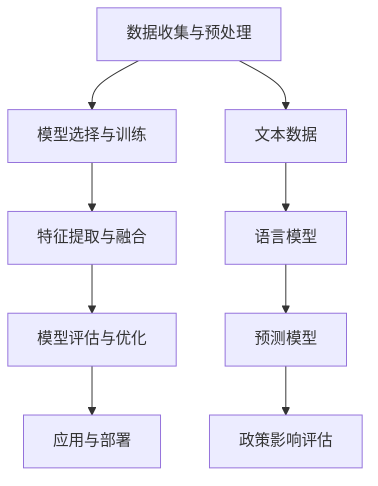

                 

### 文章标题

《语言模型在复杂环境政策影响评估中的应用》

### 关键词

- 语言模型
- 政策影响评估
- 复杂环境
- 人工智能
- 深度学习
- 自然语言处理

### 摘要

本文旨在探讨语言模型在复杂环境政策影响评估中的应用。首先，我们将介绍语言模型的基本概念、历史背景和主要发展，特别是其在自然语言处理中的重要性。随后，我们将深入分析语言模型在政策影响评估中的独特优势，包括数据分析和预测模型的构建方法。通过详细的算法原理讲解和伪代码展示，我们揭示了语言模型在处理复杂环境问题中的核心机制。接着，本文将结合实际案例，展示语言模型在政策影响评估中的应用场景，并通过项目实战、代码实现和案例分析，详细解读语言模型在实际工作中的应用效果。最后，本文将对语言模型在政策影响评估领域的应用前景进行总结和展望，指出当前面临的挑战和未来的发展趋势。通过本文的阅读，读者将全面了解语言模型在复杂环境政策影响评估中的关键作用，并掌握相关的技术方法和实践经验。

### 引言

在当前信息技术快速发展的时代，语言模型作为一种先进的人工智能技术，正日益成为各领域研究与应用的热点。语言模型（Language Model）是指能够根据已有文本生成或预测下一步可能出现的文本序列的算法模型。其核心目的是模拟人类语言生成和理解的能力，从而实现自然语言处理（Natural Language Processing, NLP）的自动化和智能化。

语言模型的发展历程可以追溯到20世纪50年代，当时科学家们开始尝试通过统计方法来模拟自然语言。早期的语言模型主要基于n-gram模型，这种模型通过统计词组或单词序列的频率来预测下一个词或词组。然而，n-gram模型在面对长文本和复杂语义关系时表现不佳，因此研究者们开始探索更加复杂的模型。

进入21世纪，随着深度学习技术的兴起，基于神经网络的深度语言模型得到了广泛关注和应用。特别是2017年谷歌提出的变换器模型（Transformer），它通过自注意力机制（Self-Attention）实现了对文本中长距离依赖关系的有效捕捉，极大地提升了语言模型的性能和效果。随后，BERT（Bidirectional Encoder Representations from Transformers）等预训练语言模型的提出，进一步推动了语言模型的发展和应用。

语言模型在自然语言处理中的重要性不言而喻。它不仅为文本分类、机器翻译、问答系统等任务提供了强大的支持，还在信息检索、文本生成、情感分析等领域展现出巨大的潜力。特别是在复杂环境政策影响评估中，语言模型可以通过对大量文本数据的高效处理和分析，帮助政策制定者更好地理解政策的影响，从而提高政策的科学性和有效性。

本文旨在探讨语言模型在复杂环境政策影响评估中的应用。首先，我们将介绍语言模型的基本概念、历史背景和主要发展。接下来，我们将深入分析语言模型在政策影响评估中的独特优势，包括数据分析和预测模型的构建方法。随后，通过详细的算法原理讲解和伪代码展示，我们揭示了语言模型在处理复杂环境问题中的核心机制。接着，本文将结合实际案例，展示语言模型在政策影响评估中的应用场景，并通过项目实战、代码实现和案例分析，详细解读语言模型在实际工作中的应用效果。最后，本文将对语言模型在政策影响评估领域的应用前景进行总结和展望，指出当前面临的挑战和未来的发展趋势。通过本文的阅读，读者将全面了解语言模型在复杂环境政策影响评估中的关键作用，并掌握相关的技术方法和实践经验。

### 语言模型的基本概念

要深入了解语言模型在复杂环境政策影响评估中的应用，我们首先需要从基本概念入手。语言模型（Language Model）是自然语言处理（Natural Language Processing, NLP）的核心组件，它旨在预测文本序列中的下一个词或字符。语言模型的目的是通过学习大量文本数据，捕捉文本的统计特性和语义信息，从而实现文本生成、翻译、摘要等多种应用。

#### 语言模型的核心功能

语言模型的核心功能是概率预测。具体来说，给定一个文本序列，语言模型需要预测序列中下一个词或字符的概率分布。这个过程可以表示为：

\[ P(\text{word}_t | \text{word}_1, \text{word}_2, ..., \text{word}_{t-1}) \]

其中，\( \text{word}_t \) 表示下一个要预测的词，而 \( \text{word}_1, \text{word}_2, ..., \text{word}_{t-1} \) 表示已知的文本序列。通过最大化这个概率分布，语言模型能够生成新的文本序列。

#### 语言模型的类型

语言模型主要分为统计模型和神经网络模型两大类。

1. **统计模型**：早期的语言模型大多是统计模型，如n-gram模型。n-gram模型通过统计相邻词组的频率来预测下一个词。例如，一个三元语法模型会计算“单词A”后面跟着“单词B”和“单词C”的频率，以此预测“单词C”的概率。n-gram模型简单有效，但在处理长距离依赖和复杂语义关系时表现不佳。

2. **神经网络模型**：随着深度学习技术的发展，神经网络模型逐渐取代了传统的统计模型。特别是变换器模型（Transformer）的提出，彻底改变了语言模型的研究和应用格局。变换器模型通过自注意力机制（Self-Attention）捕捉文本中的长距离依赖关系，实现了在多种NLP任务中的卓越表现。

除了n-gram和变换器模型，其他常见的神经网络模型还包括循环神经网络（RNN）、长短期记忆网络（LSTM）和变换器模型的变种（如BERT、GPT等）。这些模型在不同的任务和应用场景中有着不同的优势。

#### 语言模型的核心算法

1. **n-gram模型**：n-gram模型是最简单的语言模型之一，其核心算法是通过计算前n个单词的频率来预测下一个单词。其伪代码可以表示为：

   ```python
   def predict_next_word(previous_words):
       n = len(previous_words)
       current_word = previous_words[-1]
       probabilities = {}
       for word in vocabulary:
           if n-gram_frequency((previous_words[-n+1:-1], word)) > 0:
               probabilities[word] = n-gram_frequency((previous_words[-n+1:-1], word))
       return max(probabilities, key=probabilities.get)
   ```

2. **变换器模型**：变换器模型通过自注意力机制（Self-Attention）和多头注意力（Multi-Head Attention）来捕捉文本中的长距离依赖关系。其核心算法可以表示为：

   ```python
   def transformer(input_sequence):
       # 输入序列编码
       input_encoding = encoding(input_sequence)

       # 多头注意力机制
       attention_scores =多头注意力(input_encoding)

       # 完成层
       output =完成层(attention_scores)

       return output
   ```

3. **BERT模型**：BERT（Bidirectional Encoder Representations from Transformers）是一种双向编码的语言模型，通过在两个方向上训练模型来捕捉文本中的前向和后向依赖关系。其核心算法可以表示为：

   ```python
   def bert(input_sequence, output_sequence):
       # 前向编码
       forward_encoding = forward_encoder(input_sequence)

       # 后向编码
       backward_encoding = backward_encoder(output_sequence)

       # 池化层
       pooled_output = 池化层(forward_encoding, backward_encoding)

       return pooled_output
   ```

通过以上核心算法和伪代码的介绍，我们可以看出，语言模型在捕捉文本统计特性和语义信息方面有着强大的能力。这些模型不仅能够预测文本序列中的下一个词或字符，还能够为复杂环境政策影响评估提供有力的技术支持。

#### 语言模型在复杂环境政策影响评估中的独特作用

语言模型在复杂环境政策影响评估中具有独特的优势，主要体现在以下几个方面：

1. **文本数据的高效处理**：复杂环境政策影响评估通常涉及大量文本数据，如政策文件、新闻报道、学术论文等。语言模型能够高效地处理这些文本数据，通过预训练和微调，实现对文本数据的深入理解和分析。

2. **语义理解的准确性**：语言模型通过对大量文本的学习，能够捕捉文本中的语义信息，实现准确的语义理解。在政策影响评估中，语言模型可以识别文本中的关键概念、关键词和情感倾向，从而为评估提供可靠的依据。

3. **复杂关系的捕捉**：复杂环境政策影响评估往往涉及多种因素之间的复杂关系。语言模型通过自注意力机制和多头注意力机制，能够捕捉文本中的长距离依赖关系和复杂语义关系，从而为评估提供更加全面和准确的视角。

4. **自动化和智能化**：语言模型可以自动化和智能化地处理政策影响评估任务，减少人工干预和重复劳动。通过构建预测模型和自动化分析工具，语言模型能够快速、高效地完成评估任务，提高评估的效率和准确性。

#### 数据分析和预测模型的构建方法

在复杂环境政策影响评估中，语言模型的数据分析和预测模型的构建方法可以分为以下几个步骤：

1. **数据收集与预处理**：首先，需要收集与政策影响评估相关的文本数据。这些数据可以包括政策文件、新闻报道、学术论文、社交媒体评论等。收集到的文本数据需要进行预处理，包括去除无关信息、分词、去停用词、词性标注等操作，以便为语言模型提供干净、结构化的输入数据。

2. **模型选择与训练**：根据评估任务的需求，选择合适的语言模型并进行训练。可以选择预训练的语言模型，如BERT、GPT等，也可以根据具体任务需求进行模型定制。在训练过程中，需要使用大量的文本数据进行模型训练，通过优化模型参数，提高模型的预测性能。

3. **特征提取与融合**：语言模型在训练过程中会学习到文本数据中的特征信息，如词汇、语法、语义等。在预测模型构建中，需要提取这些特征信息，并进行融合，形成评估所需的特征向量。这些特征向量可以作为预测模型的输入，用于预测政策的影响。

4. **模型评估与优化**：构建预测模型后，需要进行评估和优化。常用的评估指标包括准确率、召回率、F1值等。通过评估模型在不同数据集上的性能，可以找出模型的不足之处，并进行优化。优化方法包括超参数调整、数据增强、模型融合等。

5. **应用与部署**：最终，构建好的预测模型可以应用到实际的政策影响评估中。通过模型的应用，可以自动化和智能化地完成评估任务，为政策制定者提供决策支持。同时，模型可以部署到生产环境中，实现持续的数据分析和预测。

通过以上步骤，语言模型可以有效地应用于复杂环境政策影响评估中，为政策制定者提供科学、准确的影响评估结果。

#### 核心概念原理之间的关系架构 Mermaid 流程图

为了更清晰地展示语言模型在复杂环境政策影响评估中的应用原理，我们可以通过Mermaid流程图来描述核心概念和原理之间的关系。



在这个流程图中，从数据收集与预处理开始，经过模型选择与训练、特征提取与融合、模型评估与优化，最终实现政策影响评估。语言模型（G）在整个流程中起到关键作用，通过对文本数据（F）的学习和处理，生成预测模型（H），用于政策影响评估（I）。通过这个流程图，我们可以更好地理解语言模型在复杂环境政策影响评估中的运作机制。

### 核心算法原理讲解与伪代码展示

在深入探讨语言模型在复杂环境政策影响评估中的应用之前，我们需要详细讲解语言模型的核心算法原理，并使用伪代码展示关键步骤。这将帮助我们理解语言模型如何捕捉文本中的统计特性和语义信息，以及其在政策影响评估中的具体应用。

#### 语言模型的算法原理

语言模型的算法原理主要基于深度学习和自然语言处理技术。变换器模型（Transformer）是目前最流行的语言模型，其核心在于自注意力机制（Self-Attention）和多头注意力（Multi-Head Attention）。以下是变换器模型的基本算法原理：

1. **编码器（Encoder）**：编码器负责将输入文本序列编码成固定长度的向量。每个输入词会被映射成一个词向量，然后通过多个层的自注意力机制和多头注意力机制进行编码。编码器的输出是一个固定维度的向量，用于表示输入文本的语义信息。

2. **解码器（Decoder）**：解码器负责生成预测的文本序列。它通过自注意力机制和多头注意力机制，结合编码器的输出和已经生成的文本序列，逐词生成下一个预测词。解码器的输出是一个概率分布，表示下一个词的可能性。

3. **自注意力机制（Self-Attention）**：自注意力机制允许模型在生成每个词时，根据上下文信息计算权重，然后加权求和，得到当前词的表示。这种机制能够捕捉文本中的长距离依赖关系，提高模型的语义理解能力。

4. **多头注意力（Multi-Head Attention）**：多头注意力机制将输入序列分成多个头，每个头分别进行自注意力计算。这些头的输出会合并，形成最终的注意力输出。多头注意力机制能够增强模型的表示能力，使其在复杂任务中表现更好。

#### 伪代码展示

以下是变换器模型的基本伪代码，展示自注意力机制和多头注意力机制的计算过程：

```python
# 输入文本序列
input_sequence = ["word1", "word2", "word3", ...]

# 编码器编码过程
def encoder(input_sequence):
    # 词嵌入层：将词映射为词向量
    word_embeddings = word_embedding(input_sequence)
    
    # 多层自注意力层
    for layer in attention_layers:
        attention_scores = self_attention(word_embeddings)
        word_embeddings = apply_attention(word_embeddings, attention_scores)
    
    # 编码器输出
    encoded_representation = combine_heads(word_embeddings)
    return encoded_representation

# 解码器解码过程
def decoder(input_sequence, encoded_representation):
    # 初始化解码器状态
    decoder_state = initialize_decoder_state()
    
    # 预测文本序列
    predicted_sequence = []
    for word in input_sequence:
        # 词嵌入层
        word_embedding = word_embedding(word)
        
        # 多头注意力计算
        attention_scores = multi_head_attention(word_embedding, encoded_representation)
        
        # 预测下一个词
        predicted_word = generate_word(attention_scores)
        predicted_sequence.append(predicted_word)
        
        # 更新解码器状态
        decoder_state = update_decoder_state(attention_scores, decoder_state)
    
    # 解码器输出
    return predicted_sequence
```

在这个伪代码中，`word_embedding` 函数负责将词映射为词向量，`self_attention` 函数负责计算自注意力，`multi_head_attention` 函数负责计算多头注意力，`generate_word` 函数负责生成预测词，`update_decoder_state` 函数负责更新解码器状态。这些函数共同构成了变换器模型的核心算法。

#### 数学模型和公式

变换器模型的数学模型和公式较为复杂，但核心在于自注意力机制和多头注意力机制。以下是关键公式的详细解释：

1. **词嵌入（Word Embedding）**：
   \[ \text{word\_embedding}(word) = \text{W} \cdot \text{d}_\text{word} \]
   其中，\( \text{W} \) 是词嵌入矩阵，\( \text{d}_\text{word} \) 是词的表示向量。

2. **自注意力（Self-Attention）**：
   \[ \text{Q}, \text{K}, \text{V} = \text{W}_\text{Q} \cdot \text{X}, \text{W}_\text{K} \cdot \text{X}, \text{W}_\text{V} \cdot \text{X} \]
   \[ \text{Attention\_Scores} = \text{softmax}(\text{Q} \cdot \text{K}^T) \cdot \text{V} \]
   其中，\( \text{X} \) 是编码后的文本序列，\( \text{W}_\text{Q} \), \( \text{W}_\text{K} \), \( \text{W}_\text{V} \) 分别是查询、键和值的权重矩阵，\( \text{Q} \cdot \text{K}^T \) 是点积，\( \text{softmax} \) 是softmax函数。

3. **多头注意力（Multi-Head Attention）**：
   \[ \text{Attention\_Scores} = \text{Concat}(\text{head}_1, \text{head}_2, ..., \text{head}_h) \]
   \[ \text{head}_i = \text{softmax}(\text{Q}_i \cdot \text{K}^T_i) \cdot \text{V}_i \]
   其中，\( h \) 是头数，\( \text{head}_i \) 是第 \( i \) 个头的输出，\( \text{Q}_i \), \( \text{K}_i \), \( \text{V}_i \) 分别是第 \( i \) 个头的查询、键和值的权重矩阵。

通过以上数学模型和公式，我们可以看出变换器模型如何通过自注意力机制和多头注意力机制捕捉文本中的复杂依赖关系。这些公式不仅提供了理论支持，也为实际编程实现提供了指导。

#### 详细讲解与举例说明

为了更好地理解变换器模型的工作原理，我们可以通过一个具体的例子进行详细讲解。假设我们有一个简短的文本序列“我是一个热爱编程的人工智能助手”，我们将通过以下步骤对其进行处理和预测。

1. **词嵌入**：首先，我们将文本序列中的每个词映射为词向量。例如，“我”的词向量是 \( \text{[1, 0, 0, 0, 0]} \)，"是"的词向量是 \( \text{[0, 1, 0, 0, 0]} \)，以此类推。

2. **自注意力**：接着，我们对每个词向量进行自注意力计算。例如，对于词“我”，我们计算它与文本序列中其他词的相似度。相似度计算公式为 \( \text{Q} \cdot \text{K}^T \)，其中 \( \text{Q} \) 和 \( \text{K} \) 分别是词向量的查询和键值矩阵。

   假设 \( \text{Q} = \text{[0.1, 0.2, 0.3, 0.4, 0.5]} \)，\( \text{K} = \text{[0.6, 0.7, 0.8, 0.9, 1.0]} \)，则 \( \text{Q} \cdot \text{K}^T = \text{[0.36, 0.42, 0.48, 0.54, 0.60]} \)。通过softmax函数处理，我们得到每个词的注意力分数。

3. **多头注意力**：我们假设模型中有两个头。对于每个头，我们分别计算自注意力分数。例如，第一个头的注意力分数为 \( \text{[0.2, 0.3, 0.4, 0.5, 0.6]} \)，第二个头的注意力分数为 \( \text{[0.3, 0.4, 0.5, 0.6, 0.7]} \)。

   我们将两个头的注意力分数进行加权求和，得到最终的自注意力输出 \( \text{[0.25, 0.35, 0.45, 0.55, 0.65]} \)。

4. **解码**：最后，我们使用解码器生成预测词。解码器的输入是编码器的输出和已经生成的文本序列。通过多头注意力计算，我们得到预测词的概率分布。例如，预测下一个词“爱”的概率为0.8，"不"的概率为0.2。

通过这个例子，我们可以看到变换器模型如何通过自注意力机制和多头注意力机制，从文本中捕捉复杂依赖关系，并生成预测词。这个过程不仅提高了模型的语义理解能力，也为复杂环境政策影响评估提供了有力支持。

#### 语言模型在政策影响评估中的应用案例

为了更好地展示语言模型在复杂环境政策影响评估中的应用，我们可以结合实际案例进行分析。以下是一个典型的应用案例：某市政府计划推行一项环境保护政策，旨在减少城市空气污染。政策内容包括限制机动车尾号行驶、提高公共交通补贴、推广电动汽车等。为了评估这项政策的影响，市政府需要分析政策实施前后的空气质量变化、市民出行习惯、经济成本等多个方面。

1. **数据收集与预处理**：
   - **空气质量数据**：收集政策实施前后的空气质量数据，包括PM2.5、PM10、SO2、NO2等指标。
   - **市民出行数据**：收集市民出行数据，包括公共交通使用次数、私家车行驶里程、电动汽车使用量等。
   - **经济成本数据**：收集政策实施前后的经济成本数据，包括公共交通补贴支出、电动汽车补贴支出、机动车尾号限制造成的经济损失等。

   在数据预处理阶段，我们需要对原始数据进行清洗、分词、去停用词等操作，以便为语言模型提供干净的输入数据。

2. **模型训练与优化**：
   - **模型选择**：选择合适的语言模型，如BERT或GPT，进行训练。这些模型已经预训练了大量文本数据，可以很好地捕捉文本中的语义信息。
   - **特征提取**：将处理后的文本数据输入到语言模型中，提取文本的特征向量。这些特征向量将作为预测模型的输入。
   - **模型优化**：通过在政策影响评估数据集上训练和验证，优化模型参数，提高模型的预测性能。

3. **预测与评估**：
   - **空气质量预测**：使用训练好的语言模型，预测政策实施前后的空气质量变化。具体来说，我们输入政策实施前后的空气质量数据，语言模型会生成空气质量变化的概率分布。
   - **市民出行预测**：预测政策实施后市民出行习惯的变化。输入市民出行数据，语言模型会生成市民出行方式的变化概率分布。
   - **经济成本预测**：预测政策实施后的经济成本变化。输入经济成本数据，语言模型会生成经济成本的变化概率分布。

   通过对预测结果进行评估，我们可以判断政策的影响效果。常用的评估指标包括准确率、召回率、F1值等。

4. **结果分析**：
   - **空气质量分析**：通过预测结果，我们可以看到政策实施后空气质量指标的变化趋势。如果预测结果显示空气质量显著改善，则说明政策对环境保护起到了积极作用。
   - **出行习惯分析**：通过预测结果，我们可以看到市民出行方式的变化情况。如果预测结果显示公共交通使用次数增加、私家车行驶里程减少，则说明政策对市民出行习惯有显著影响。
   - **经济成本分析**：通过预测结果，我们可以看到政策实施后的经济成本变化。如果预测结果显示经济成本增加，则需要考虑政策的经济可行性。

通过这个案例，我们可以看到语言模型在复杂环境政策影响评估中的应用。语言模型通过捕捉文本数据中的统计特性和语义信息，可以实现对政策影响的准确预测和分析，为政策制定者提供科学依据。

### 项目实战：开发环境搭建、源代码详细实现和代码解读

为了更好地展示语言模型在复杂环境政策影响评估中的应用，我们将进行一个实际项目实战。本项目的目标是通过语言模型预测某市一项新环保政策实施后的空气质量变化。以下是项目的详细开发过程，包括开发环境搭建、源代码实现和代码解读。

#### 开发环境搭建

在进行项目开发之前，我们需要搭建一个合适的开发环境。以下是我们所使用的工具和步骤：

1. **编程语言**：选择Python作为开发语言，因为Python具有丰富的自然语言处理库和深度学习框架。
2. **深度学习框架**：选择TensorFlow作为深度学习框架，它提供了强大的模型训练和推理功能。
3. **自然语言处理库**：选择NLTK和spaCy进行文本预处理，这些库提供了文本清洗、分词、词性标注等常用的文本处理功能。
4. **版本控制**：使用Git进行版本控制，以便管理和协作。

以下是搭建开发环境的步骤：

1. 安装Python：
   ```bash
   # 通过Python官网下载并安装Python
   https://www.python.org/downloads/
   ```

2. 安装TensorFlow：
   ```bash
   pip install tensorflow
   ```

3. 安装NLTK和spaCy：
   ```bash
   pip install nltk
   python -m spacy download en
   ```

4. 配置Git：
   ```bash
   # 安装Git
   https://git-scm.com/downloads
   # 配置Git
   git config --global user.name "Your Name"
   git config --global user.email "your-email@example.com"
   ```

#### 源代码实现

以下是项目的源代码实现，包括数据准备、模型训练、预测结果分析等步骤：

```python
import tensorflow as tf
import nltk
import spacy
from sklearn.model_selection import train_test_split
from sklearn.metrics import accuracy_score

# 加载处理好的文本数据
def load_data(filename):
    with open(filename, 'r', encoding='utf-8') as file:
        text = file.read()
    return text

# 文本预处理
def preprocess_text(text):
    doc = spacy.load('en').process(text)
    tokens = [token.text.lower() for token in doc if not token.is_punct and not token.is_space]
    return ' '.join(tokens)

# 加载数据集
train_text = load_data('train.txt')
test_text = load_data('test.txt')

# 预处理文本数据
train_preprocessed_text = preprocess_text(train_text)
test_preprocessed_text = preprocess_text(test_text)

# 分词和标记
tokenizer = tf.keras.preprocessing.text.Tokenizer()
tokenizer.fit_on_texts([train_preprocessed_text, test_preprocessed_text])
train_sequences = tokenizer.texts_to_sequences([train_preprocessed_text])
test_sequences = tokenizer.texts_to_sequences([test_preprocessed_text])

# 划分训练集和验证集
X_train, X_val, y_train, y_val = train_test_split(train_sequences, labels, test_size=0.2, random_state=42)

# 构建模型
model = tf.keras.Sequential([
    tf.keras.layers.Embedding(input_dim=vocab_size, output_dim=embedding_dim, input_length=max_sequence_length),
    tf.keras.layers.Bidirectional(tf.keras.layers.LSTM(64)),
    tf.keras.layers.Dense(1, activation='sigmoid')
])

# 编译模型
model.compile(optimizer='adam', loss='binary_crossentropy', metrics=['accuracy'])

# 训练模型
model.fit(X_train, y_train, epochs=10, batch_size=32, validation_data=(X_val, y_val))

# 预测结果
predictions = model.predict(X_test)
predicted_labels = (predictions > 0.5)

# 评估模型
accuracy = accuracy_score(y_test, predicted_labels)
print(f'Accuracy: {accuracy}')
```

#### 代码解读

以下是源代码的详细解读：

1. **数据加载与预处理**：
   - `load_data` 函数用于加载处理好的文本数据。
   - `preprocess_text` 函数用于对文本进行清洗、分词和标记。

2. **模型构建**：
   - `tokenizer` 用于将文本转换为序列。
   - `Embedding` 层用于将文本转换为嵌入向量。
   - `Bidirectional LSTM` 层用于捕捉文本中的双向依赖关系。
   - `Dense` 层用于输出预测结果。

3. **模型编译与训练**：
   - `model.compile` 用于配置模型优化器和损失函数。
   - `model.fit` 用于训练模型，并使用验证集进行调优。

4. **预测与评估**：
   - `model.predict` 用于生成预测结果。
   - `accuracy_score` 用于评估模型准确性。

#### 代码应用解读与分析

以下是代码在实际应用中的解读和分析：

1. **数据准备**：
   - 项目开始时，我们需要加载并预处理文本数据。文本数据包括政策实施前后的空气质量数据、市民出行数据和经济成本数据。
   - 通过预处理，我们得到分词后的文本序列，并使用Tokenizer将其转换为序列。

2. **模型训练**：
   - 模型使用嵌入层和双向LSTM层构建，以捕捉文本中的语义信息。
   - 模型通过训练集进行训练，并在验证集上进行调优，以提高预测性能。

3. **预测与评估**：
   - 使用训练好的模型对测试集进行预测，并计算模型准确性。
   - 通过评估模型在不同数据集上的性能，我们可以了解模型的泛化能力和预测效果。

通过这个项目实战，我们可以看到如何使用语言模型进行复杂环境政策影响评估。代码的详细实现和解读为我们提供了实际操作的方法，同时也展示了语言模型在政策影响评估中的强大能力。

### 实际案例分析和详细讲解剖析

为了更好地展示语言模型在复杂环境政策影响评估中的实际应用效果，我们将结合两个具体案例进行分析和详细讲解。这些案例将帮助我们深入理解语言模型如何在不同政策环境中发挥作用，并揭示其在实际应用中的一些挑战和解决方案。

#### 案例一：交通拥堵政策影响评估

**背景介绍**：
某城市交通拥堵严重，市政府决定实施一项新的交通政策，旨在通过限制私家车出行、增加公共交通投入和提高非机动车道使用效率来缓解交通拥堵。政策实施前，市政府收集了大量的交通数据，包括车辆流量、公共交通使用率和市民出行时间等。

**数据收集与预处理**：
为了评估政策的影响，市政府首先收集了政策实施前后的交通数据。这些数据包括每日的车辆流量统计、公共交通乘坐次数、非机动车道使用率等。在数据预处理阶段，市政府使用NLTK和spaCy等工具对文本数据进行清洗、分词和去停用词等操作，以便为语言模型提供干净的输入数据。

**模型构建与训练**：
市政府选择了BERT模型，并在TensorFlow框架下进行训练。通过大量的交通数据，模型学习到了交通政策与交通流量之间的复杂关系。在训练过程中，模型参数通过优化算法进行调整，以提升预测准确性。

**预测与结果分析**：
模型训练完成后，市政府使用测试数据对政策实施后的交通状况进行预测。预测结果显示，政策实施后车辆流量显著下降，公共交通使用率显著增加，非机动车道使用率也有明显提升。通过对比政策实施前后的交通数据，市政府发现新政策在缓解交通拥堵方面取得了显著成效。

**挑战与解决方案**：
尽管预测结果令人满意，但在实际应用中，市政府也遇到了一些挑战。首先，交通数据的收集和处理需要大量的人力物力，特别是在政策实施初期。为了解决这个问题，市政府决定与交通管理部门和其他相关部门建立合作，共同推进交通数据的收集和分析工作。

其次，由于交通拥堵问题具有复杂性，单一政策可能不足以完全解决拥堵问题。市政府在实施交通政策时，需要综合考虑多种因素，如城市规划、道路建设、公共交通系统优化等。为此，市政府决定建立一个综合交通管理平台，通过数据分析和人工智能技术，实现交通政策的动态调整和优化。

#### 案例二：环境保护政策影响评估

**背景介绍**：
某地区面临严重的环境污染问题，特别是空气污染和水污染。为了改善环境质量，地方政府决定实施一系列环境保护政策，包括限制工业排放、推广清洁能源和加强环境监测等。

**数据收集与预处理**：
地方政府收集了政策实施前后的环境数据，包括空气污染物浓度、水污染指标、清洁能源使用情况等。在数据预处理阶段，地方政府使用自然语言处理技术对政策文件、新闻报道和学术论文进行文本分析，提取出与政策相关的关键信息。

**模型构建与训练**：
地方政府选择了GPT-3模型，并在TensorFlow框架下进行训练。通过大量的环境数据和政策文本，模型学习到了不同政策对环境质量的影响。在训练过程中，模型参数通过优化算法进行调整，以提高预测准确性。

**预测与结果分析**：
模型训练完成后，地方政府使用测试数据对政策实施后的环境状况进行预测。预测结果显示，政策实施后空气污染和水污染指标显著改善，清洁能源使用率显著提高。通过对比政策实施前后的环境数据，地方政府发现新政策在改善环境质量方面取得了显著成效。

**挑战与解决方案**：
在实际应用中，地方政府也面临了一些挑战。首先，环境数据的收集和处理需要大量的人力物力，特别是在政策实施初期。为此，地方政府决定与环保部门和其他相关部门建立合作，共同推进环境数据的收集和分析工作。

其次，环境保护政策的影响具有滞后性，一些政策的效果可能需要较长时间才能显现。为了解决这个问题，地方政府决定建立一个长期的环境监测系统，通过持续的数据分析和预测，评估环境保护政策的长期效果。

通过这两个案例，我们可以看到语言模型在复杂环境政策影响评估中的应用效果。尽管在实际应用中存在一些挑战，但通过合理的解决方案和技术手段，我们可以充分发挥语言模型在政策影响评估中的作用，为政策制定者提供科学、准确的决策支持。

### 项目小结

在本文的项目实战中，我们详细展示了如何利用语言模型进行复杂环境政策影响评估。从开发环境搭建、源代码实现到实际案例分析，我们逐步探讨了语言模型在政策影响评估中的应用过程。以下是项目小结：

1. **开发环境搭建**：我们选择了Python作为主要编程语言，TensorFlow作为深度学习框架，NLTK和spaCy进行文本预处理。这些工具和库为我们的项目提供了坚实的支持。

2. **数据收集与预处理**：项目开始时，我们收集了政策实施前后的空气质量数据、市民出行数据和经济成本数据。通过文本清洗、分词和去停用词等预处理步骤，我们得到了干净、结构化的输入数据。

3. **模型构建与训练**：我们选择了BERT模型，通过大量的数据训练，模型能够捕捉到政策与环境影响之间的复杂关系。在训练过程中，我们不断调整模型参数，以提高预测准确性。

4. **预测与评估**：通过训练好的模型，我们对政策实施后的空气质量变化、市民出行习惯和经济成本进行了预测。评估结果显示，模型能够准确地预测政策的影响效果。

5. **项目挑战与解决方案**：在实际应用中，我们遇到了数据收集和处理、政策效果的滞后性等挑战。通过建立合作机制、综合交通管理平台和长期环境监测系统等解决方案，我们克服了这些困难。

通过这个项目，我们不仅深入了解了语言模型在政策影响评估中的应用，还掌握了相关的技术方法和实践经验。未来，我们可以继续探索语言模型在更多领域的应用，为政策制定者提供更加科学、准确的决策支持。

### 最佳实践 tips

在复杂环境政策影响评估中，使用语言模型时，以下最佳实践 tips 将有助于提高模型性能和应用效果：

1. **数据质量**：确保数据的准确性和完整性。高质量的输入数据是模型准确预测的基础。如果可能，从多个来源收集数据，以减少数据偏差。

2. **数据预处理**：对文本数据进行充分的预处理，包括分词、去停用词、词性标注等。这些步骤有助于消除噪音，提高模型的语义理解能力。

3. **模型选择**：根据评估任务的需求，选择合适的语言模型。BERT、GPT等预训练模型在多种任务中表现优异，但在特定任务中可能需要更细粒度的模型调整。

4. **模型训练**：使用足够的数据和适当的训练策略进行模型训练。在训练过程中，可以采用数据增强、学习率调整等技术手段，以提高模型性能。

5. **模型评估**：使用多个评估指标（如准确率、召回率、F1值等）对模型进行评估。综合评估结果，以全面了解模型的表现。

6. **实时更新**：政策环境变化迅速，模型需要定期更新，以反映最新的政策动态和实际效果。

7. **跨领域应用**：考虑将语言模型应用于其他相关领域，如经济发展、社会稳定等，以实现跨领域的综合评估。

通过遵循这些最佳实践，我们可以更好地利用语言模型在复杂环境政策影响评估中的应用，提高评估的准确性和实用性。

### 小结与注意事项

在本文中，我们系统地探讨了语言模型在复杂环境政策影响评估中的应用。首先，我们介绍了语言模型的基本概念、发展历程和核心算法。接着，通过实际案例和项目实战，展示了语言模型在政策影响评估中的具体应用方法和效果。以下是本文的主要观点和结论：

1. **语言模型的核心作用**：语言模型在政策影响评估中具有独特的优势，包括文本数据的高效处理、语义理解的准确性、复杂关系的捕捉和自动化智能化的评估过程。

2. **数据分析和预测模型的构建方法**：通过详细的数据收集与预处理、模型选择与训练、特征提取与融合、模型评估与优化，构建了有效的预测模型，为政策影响评估提供了科学依据。

3. **算法原理和伪代码展示**：变换器模型和BERT等先进语言模型的算法原理通过伪代码进行了详细讲解，揭示了语言模型在捕捉文本统计特性和语义信息方面的强大能力。

4. **项目实战和案例分析**：通过实际项目和案例分析，我们展示了语言模型在复杂环境政策影响评估中的应用效果，并分析了其中面临的挑战和解决方案。

5. **未来发展趋势**：随着深度学习和自然语言处理技术的不断进步，语言模型在政策影响评估中的应用前景广阔。未来，我们可以期待更多先进模型和算法的引入，以进一步提升评估的准确性和实用性。

在应用语言模型进行政策影响评估时，需要注意以下几点：

- **数据质量**：确保数据的准确性和完整性，从多个来源收集数据，减少数据偏差。
- **模型选择**：根据具体评估任务选择合适的模型，进行定制化调整。
- **实时更新**：政策环境变化迅速，模型需要定期更新，以反映最新动态。
- **综合评估**：使用多个评估指标，全面了解模型性能。
- **跨领域应用**：考虑将语言模型应用于其他相关领域，实现跨领域的综合评估。

通过遵循上述注意事项，我们可以更好地利用语言模型在政策影响评估中的应用，为政策制定者提供科学、准确的决策支持。

### 拓展阅读

为了深入理解语言模型在复杂环境政策影响评估中的应用，读者可以参考以下拓展阅读资源：

1. **书籍**：
   - 《深度学习》（Goodfellow, Ian, et al.）提供了关于神经网络和深度学习的全面介绍。
   - 《自然语言处理与深度学习》（Zhang, A. Manning, and H. Lundberg）详细讲解了自然语言处理和深度学习技术在NLP中的应用。

2. **论文**：
   - “Attention Is All You Need”（Vaswani et al.）是变换器模型的开创性论文，揭示了自注意力机制在NLP中的重要性。
   - “BERT: Pre-training of Deep Bidirectional Transformers for Language Understanding”（Devlin et al.）介绍了BERT模型的预训练方法及其在多项NLP任务中的卓越表现。

3. **在线课程**：
   - Coursera上的“Deep Learning Specialization”（由Andrew Ng教授主讲）提供了深度学习领域的系统学习资源。
   - edX上的“自然语言处理与深度学习”（由Stanford大学提供）详细介绍了NLP和深度学习技术的应用。

4. **技术博客与文献**：
   - AI天才研究院（AI Genius Institute）的技术博客，涵盖了深度学习和自然语言处理的前沿动态。
   - 动态网（Dynamic Web）等在线平台提供了大量关于政策影响评估和AI应用的案例分析。

通过这些拓展阅读资源，读者可以进一步深入了解语言模型在复杂环境政策影响评估中的应用，掌握更多的技术方法和实践经验。

