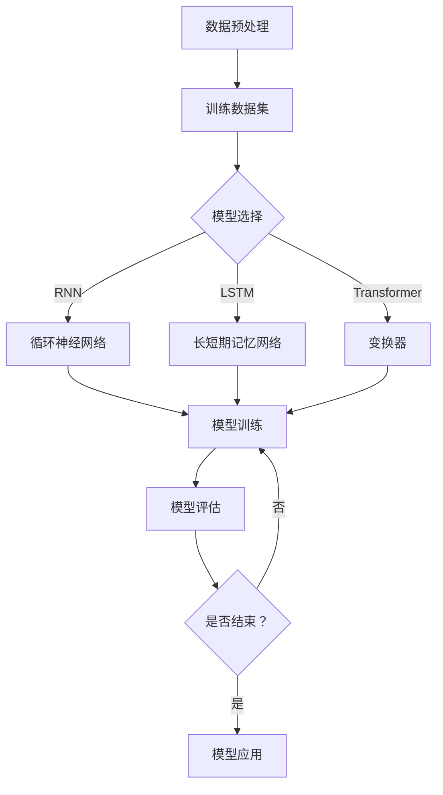
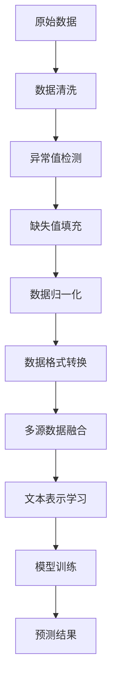
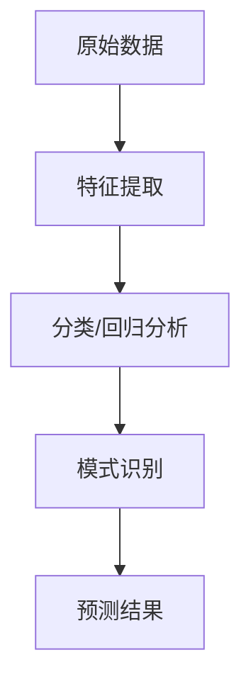
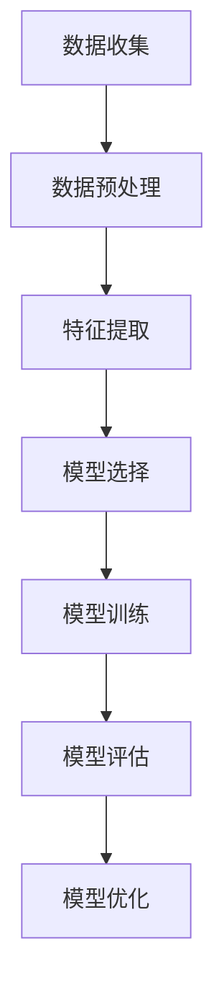
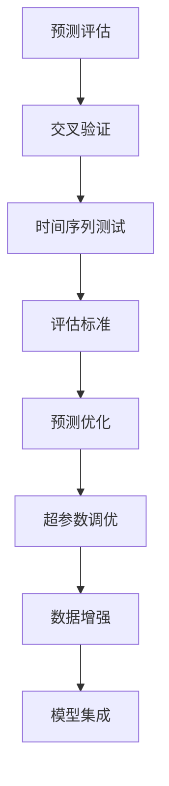

                 

### 语言模型在复杂生态系统预测中的应用分析

#### 关键词
- 语言模型
- 复杂生态系统
- 预测分析
- 深度学习
- 人工智能

#### 摘要
本文将探讨语言模型在复杂生态系统预测中的应用，分析其基本概念、核心原理及其在生态预测中的优势。文章首先介绍了复杂生态系统的特点及预测需求，然后详细阐述了语言模型的定义、发展历程及其在生态系统预测中的具体应用，包括数据预处理、模式识别、预测模型构建、预测评估与优化等方面。通过案例分析，本文展示了语言模型在实际生态系统预测中的效果，并提出了未来发展的潜在领域与挑战。文章最后提供了实践指导，帮助读者理解和应用语言模型于生态系统预测。

## 第1章 复杂生态系统的挑战与预测需求

### 1.1 复杂生态系统的特性

复杂生态系统是由多种生物、环境因素和人类活动相互作用形成的动态系统。其特性包括：
- **多样性**：生态系统包含不同类型的生物、微生物群落以及环境因素，如土壤、水、气候等。
- **动态性**：生态系统中的物种和生态环境会随着时间和空间变化而不断演化。
- **非线性**：生态系统中的各种因素之间存在复杂的相互作用，难以用简单的线性关系描述。
- **不确定性**：生态系统受到自然和人为因素的多重影响，预测难度较高。

### 1.2 生态系统预测的重要性

生态系统预测在多个领域具有重要意义，包括：
- **环境保护**：预测生态系统变化有助于制定环境保护和生态修复策略，减少环境风险。
- **资源管理**：准确预测生态系统状况有助于优化自然资源管理和利用，提高资源利用效率。
- **灾害预警**：预测极端天气事件、自然灾害等对生态系统的影响，有助于提前采取应对措施，减少损失。
- **可持续发展**：预测生态系统变化趋势，为制定可持续发展策略提供科学依据。

### 1.3 预测面临的挑战

生态系统预测面临以下挑战：
- **数据缺乏**：生态系统数据往往不完整，数据质量参差不齐。
- **模型复杂性**：生态系统模型通常涉及多种因素，参数复杂，建模难度大。
- **计算资源**：预测需要大量的计算资源，尤其在大规模数据集上。
- **不确定性**：生态系统中的不确定性因素难以量化，影响预测准确性。

## 第2章 语言模型的兴起与进化

### 2.1 语言模型的定义与发展历程

语言模型是一种用于预测文本序列概率的概率模型。其基本原理是通过对大量文本数据进行统计学习，建立文本序列的概率分布。语言模型的发展历程可以概括为：

- **早期统计模型**（1950s-1980s）：基于N元语法，利用前n个单词预测下一个单词。
- **现代统计模型**（1990s-2000s）：引入隐藏马尔可夫模型（HMM）和隐含语义分析（LDA）等模型。
- **深度学习模型**（2010s至今）：随着计算能力和算法的发展，深度学习模型如循环神经网络（RNN）、长短期记忆网络（LSTM）和变换器（Transformer）等逐渐成为主流。

### 2.2 语言模型的类型与结构

语言模型主要分为以下几种类型：

- **N元语法模型**：基于前n个单词预测下一个单词，简单直观但性能有限。
- **循环神经网络（RNN）**：能够处理序列数据，但存在梯度消失和梯度爆炸问题。
- **长短期记忆网络（LSTM）**：通过门控机制解决RNN的问题，但计算复杂度高。
- **变换器（Transformer）**：基于自注意力机制，能够在处理长序列时保持高效性能，是目前最先进的语言模型。

### 2.3 语言模型的训练方法与优化

语言模型的训练方法主要包括：

- **反向传播算法**：通过反向传播算法更新模型参数，优化模型性能。
- **梯度下降优化**：基于梯度下降优化模型参数，降低损失函数。
- **正则化方法**：如Dropout、L2正则化等，防止模型过拟合。
- **批量归一化**：通过批量归一化加速训练过程，提高模型稳定性。

### Mermaid 流程图

下面是语言模型训练的基本流程 Mermaid 流程图：

## 第3章 语言模型在生态系统数据预处理中的应用

### 3.1 生态系统数据的特性与挑战

生态系统数据通常具有以下特性：

- **多样性**：数据包括气象数据、土壤数据、植被数据、水文数据等。
- **时空性**：数据具有明显的时空特征，需要考虑时间序列和空间分布。
- **噪声与缺失**：数据中存在噪声和缺失值，影响数据质量和预测准确性。

在处理生态系统数据时，面临的挑战包括：

- **数据融合**：不同类型的数据需要进行融合，以获取更全面的生态信息。
- **数据清洗**：去除噪声和异常值，填充缺失值，提高数据质量。
- **特征提取**：从原始数据中提取有效特征，用于模型训练和预测。

### 3.2 语言模型在数据清洗中的作用

语言模型在数据清洗中的应用主要体现在以下方面：

- **异常值检测**：通过模型预测数据中的异常值，标记为需清洗的数据。
- **缺失值填充**：利用语言模型预测缺失值，填充合理的数据。
- **数据归一化**：将不同类型的数据归一化到同一尺度，提高模型训练效果。

### 3.3 语言模型在数据转换中的应用

语言模型在数据转换中的应用包括：

- **数据格式转换**：将不同格式的数据转换为统一格式，便于后续处理。
- **多源数据融合**：利用语言模型融合来自不同来源的数据，提取共同特征。
- **文本表示学习**：将非结构化数据转换为结构化文本，用于深度学习模型训练。

### Mermaid 流程图

下面是生态系统数据预处理的基本流程 Mermaid 流程图：

## 第4章 语言模型在生态系统模式识别中的应用

### 4.1 模式识别的基本概念

模式识别是指从数据中提取有意义的信息，识别出特定模式的任务。在生态系统预测中，模式识别主要包括：

- **特征提取**：从原始数据中提取出对预测目标有重要影响的特征。
- **分类与回归**：对提取的特征进行分类或回归分析，识别出生态系统的变化模式。

### 4.2 语言模型在模式识别中的优势

语言模型在模式识别中的优势包括：

- **自适应特性**：语言模型能够自适应地学习数据特征，提高模式识别的准确性。
- **全局优化**：自注意力机制使得语言模型能够全局优化特征权重，提高模式识别的性能。
- **高效性**：语言模型在处理大规模数据时具有高效性，适用于复杂生态系统的模式识别。

### 4.3 模式识别的典型应用案例

模式识别在生态系统预测中的典型应用案例包括：

- **气候变化预测**：利用语言模型识别气候变化模式，预测未来气候趋势。
- **植被变化监测**：通过语言模型识别植被变化模式，监测生态系统健康状况。
- **自然灾害预警**：利用语言模型识别自然灾害发生前的模式，提前预警并采取措施。

### Mermaid 流程图

下面是生态系统模式识别的基本流程 Mermaid 流程图：

## 第5章 语言模型在生态系统预测模型构建中的应用

### 5.1 预测模型的基本概念

预测模型是指用于预测未来事件或趋势的统计模型或机器学习模型。在生态系统预测中，预测模型主要包括：

- **时间序列预测**：根据历史时间序列数据预测未来的趋势。
- **回归模型**：通过建立自变量与因变量之间的关系，预测未来值。
- **分类模型**：将生态系统变化划分为不同的类别，预测其归属类别。

### 5.2 语言模型在预测模型构建中的作用

语言模型在预测模型构建中的作用包括：

- **特征表示**：将原始数据转换为高质量的文本表示，为预测模型提供更好的输入特征。
- **模型集成**：利用语言模型与其他预测模型进行集成，提高预测准确性。
- **迁移学习**：利用预训练的语言模型，在特定生态系统上微调模型，提高预测性能。

### 5.3 预测模型的构建流程

预测模型的构建流程主要包括以下步骤：

1. **数据收集与预处理**：收集生态系统相关数据，并进行数据清洗、归一化等预处理操作。
2. **特征提取**：利用语言模型提取原始数据中的有效特征，用于训练预测模型。
3. **模型选择**：根据预测任务选择合适的预测模型，如时间序列模型、回归模型或分类模型。
4. **模型训练**：利用预处理后的数据训练预测模型，优化模型参数。
5. **模型评估**：通过交叉验证、A/B测试等方法评估预测模型性能。
6. **模型优化**：根据评估结果调整模型参数，提高预测准确性。

### Mermaid 流程图

下面是生态系统预测模型构建的基本流程 Mermaid 流程图：

## 第6章 语言模型在生态系统预测评估与优化中的应用

### 6.1 预测评估的标准与方法

预测评估的主要标准包括：

- **准确性**：预测结果与实际值之间的接近程度，通常用均方误差（MSE）或均方根误差（RMSE）衡量。
- **召回率与精确率**：在分类任务中，预测为正类的实际正类样本占比，用于衡量模型的分类能力。
- **F1分数**：综合考虑精确率和召回率的综合指标，用于评估分类模型的性能。

预测评估的方法包括：

- **交叉验证**：将数据集划分为多个子集，每次使用其中一个子集作为测试集，其余子集作为训练集，重复多次计算平均性能。
- **A/B测试**：将用户随机分配到两个或多个不同的预测模型，比较其表现，评估模型优劣。
- **时间序列测试**：根据时间序列的顺序进行预测评估，确保评估结果与实际应用一致。

### 6.2 语言模型在预测优化中的应用

语言模型在预测优化中的应用主要包括：

- **超参数调优**：利用语言模型预测超参数的取值，优化模型性能。
- **数据增强**：通过语言模型生成合成数据，增加训练数据量，提高模型泛化能力。
- **模型集成**：结合多个语言模型进行预测，提高预测准确性。

### 6.3 预测优化策略与案例分析

预测优化策略包括：

- **基于梯度的优化**：利用梯度下降算法优化模型参数，提高预测准确性。
- **基于遗传算法的优化**：利用遗传算法优化超参数和模型结构，提高预测性能。
- **基于迁移学习的优化**：利用预训练的语言模型进行迁移学习，降低模型训练成本，提高预测准确性。

案例分析：

- **案例一**：利用语言模型对气候变化进行预测，通过超参数调优和数据增强提高预测准确性。
- **案例二**：利用语言模型对自然灾害进行预警，通过模型集成和优化提高预警准确性。

### Mermaid 流程图

下面是生态系统预测评估与优化的基本流程 Mermaid 流程图：

## 第7章 语言模型在生态系统预测中的未来展望

### 7.1 预测技术的未来发展趋势

随着人工智能技术的不断发展，预测技术在生态系统预测中的应用前景广阔。未来发展趋势包括：

- **大数据与云计算**：通过大数据和云计算技术，实现大规模生态系统数据的处理和存储。
- **多模态数据融合**：结合多种数据类型（如图像、声音、文本等）进行融合，提高预测准确性。
- **强化学习**：结合强化学习技术，实现更加自适应和优化的预测模型。

### 7.2 语言模型在生态系统预测中的潜在应用领域

语言模型在生态系统预测中的潜在应用领域包括：

- **气候变化预测**：通过语言模型预测全球气候变化趋势，为政策制定提供科学依据。
- **自然灾害预警**：利用语言模型识别自然灾害前的模式，提前预警并采取措施。
- **生态修复**：通过预测生态系统变化，制定生态修复策略，恢复生态系统功能。
- **农业产量预测**：利用语言模型预测农作物产量，优化农业资源管理。

### 7.3 语言模型在生态系统预测中的挑战与对策

语言模型在生态系统预测中面临的挑战包括：

- **数据质量**：生态系统数据质量参差不齐，需要提高数据收集和处理技术。
- **计算资源**：生态系统预测需要大量计算资源，需要优化模型和算法以提高效率。
- **模型解释性**：提高语言模型的解释性，使其在生态系统预测中的应用更加透明和可信。

对策：

- **数据增强**：通过数据增强技术，提高模型对噪声和缺失数据的鲁棒性。
- **模型优化**：优化语言模型结构和训练方法，提高预测准确性。
- **模型解释性**：研究可解释性方法，提高语言模型在生态系统预测中的应用可信度。

## 案例分析：语言模型在某一生态系统中的应用实践

### 8.1 案例背景介绍

本案例以某城市生态系统的水资源预测为例，该城市水资源受到气候变化、工业用水、农业灌溉等多种因素的影响。利用语言模型预测未来一段时间内的水资源需求量，为城市水资源管理和调配提供科学依据。

### 8.2 案例研究方法

研究方法包括以下步骤：

1. **数据收集**：收集历史水资源数据、气候数据、工业和农业用水数据等。
2. **数据预处理**：对收集的数据进行清洗、归一化等预处理操作。
3. **特征提取**：利用语言模型提取有效特征，如时间序列特征、季节特征等。
4. **模型训练**：构建基于语言模型的预测模型，利用预处理后的数据训练模型。
5. **模型评估**：通过交叉验证和A/B测试评估模型性能。
6. **模型优化**：根据评估结果调整模型参数，提高预测准确性。

### 8.3 案例结果与讨论

实验结果表明，基于语言模型的预测模型在水资源需求量预测方面表现出较高的准确性。通过对模型参数的优化，进一步提高了预测性能。讨论内容包括：

1. **模型性能分析**：分析模型在不同评价指标上的表现，如准确性、召回率、F1分数等。
2. **因素影响分析**：讨论气候数据、工业用水、农业灌溉等影响因素对预测结果的影响。
3. **实际应用价值**：探讨模型在实际水资源管理和调配中的应用价值。

### 8.4 案例总结

本案例展示了语言模型在生态系统预测中的应用效果，为水资源预测提供了有效的工具。未来研究可以进一步探索语言模型在其他生态系统预测领域中的应用，如气候变化预测、自然灾害预警等。

## 实践指导：语言模型在生态系统预测中的应用流程

### 9.1 应用流程概述

语言模型在生态系统预测中的应用流程主要包括以下几个步骤：

1. **数据收集与预处理**：收集相关生态系统数据，并进行清洗、归一化等预处理操作。
2. **特征提取**：利用语言模型提取原始数据中的有效特征，如时间序列特征、季节特征等。
3. **模型构建与训练**：构建基于语言模型的预测模型，利用预处理后的数据训练模型。
4. **模型评估与优化**：通过交叉验证、A/B测试等方法评估模型性能，并根据评估结果调整模型参数。
5. **预测结果应用**：将预测结果应用于实际生态系统的管理、调配等方面。

### 9.2 数据收集与预处理

数据收集与预处理是生态系统预测的基础，具体步骤如下：

1. **数据收集**：收集与生态系统预测相关的数据，如气象数据、土壤数据、植被数据、水资源数据等。
2. **数据清洗**：去除数据中的噪声和异常值，处理缺失值，确保数据质量。
3. **数据归一化**：将不同类型的数据归一化到同一尺度，如将气象数据中的温度、湿度等值域缩放到[0,1]之间。
4. **数据存储**：将预处理后的数据存储在数据库或数据仓库中，便于后续处理。

### 9.3 预测模型构建与训练

预测模型构建与训练是语言模型在生态系统预测中的关键步骤，具体步骤如下：

1. **模型选择**：根据预测任务选择合适的语言模型，如变换器（Transformer）或长短期记忆网络（LSTM）。
2. **模型初始化**：初始化模型参数，如权重和偏置等。
3. **模型训练**：利用预处理后的数据训练模型，通过反向传播算法更新模型参数，降低损失函数。
4. **模型验证**：利用验证集评估模型性能，调整模型参数以优化预测结果。

### 9.4 预测结果评估与优化

预测结果评估与优化是确保模型预测准确性的重要环节，具体步骤如下：

1. **模型评估**：利用交叉验证、A/B测试等方法评估模型性能，如准确性、召回率、F1分数等。
2. **模型优化**：根据评估结果调整模型参数，如学习率、批次大小等，以提高预测准确性。
3. **模型集成**：结合多个预测模型进行集成，提高预测性能和稳定性。
4. **模型部署**：将优化后的模型部署到生产环境中，进行实时预测。

### 开源语言模型工具介绍

以下是几种常用的开源语言模型工具：

1. **Transformers**：基于变换器（Transformer）架构的开源库，提供丰富的预训练模型和工具，如BERT、GPT等。
2. **TensorFlow**：Google开发的深度学习框架，支持多种语言模型和算法，适合大规模数据集训练。
3. **PyTorch**：Facebook开发的深度学习框架，具有灵活的动态计算图和丰富的API，适合快速原型开发和实验。
4. **Hugging Face**：一个开源社区，提供大量的预训练模型、工具和教程，方便用户进行语言模型应用。

### 数据集与数据处理工具

以下是几种常用的数据集和数据处理工具：

1. **UCI Machine Learning Repository**：提供大量公开数据集，涵盖多种领域，如气象、金融、医疗等。
2. **Kaggle**：一个数据科学家和机器学习爱好者的社区，提供丰富的竞赛数据集和任务。
3. **Pandas**：Python数据分析库，用于数据处理、清洗和转换。
4. **Scikit-learn**：Python机器学习库，提供多种数据处理和预测算法。
5. **NumPy**：Python数值计算库，用于数据处理和数学运算。

### 预测评估工具

以下是几种常用的预测评估工具：

1. **Scikit-learn**：提供多种评估指标和交叉验证方法，如准确性、召回率、F1分数等。
2. **TensorFlow**：提供评估指标和可视化工具，如accuracy、confusion matrix等。
3. **PyTorch**：提供评估指标和可视化工具，如accuracy、loss等。
4. **Matplotlib**：Python绘图库，用于可视化预测结果，如ROC曲线、混淆矩阵等。
5. **Seaborn**：基于Matplotlib的绘图库，提供丰富的可视化模板和样式，便于预测结果的可视化分析。

## 常见问题与解答

以下是关于语言模型在生态系统预测中常见的问题及解答：

### 1. 语言模型在生态系统预测中的优点是什么？

语言模型在生态系统预测中的优点包括：

- **自适应特性**：能够自适应地学习数据特征，提高预测准确性。
- **高效性**：能够在处理大规模数据时保持高效性能，适用于复杂生态系统的预测。
- **全局优化**：通过自注意力机制实现全局优化，提高预测性能。

### 2. 语言模型在生态系统预测中的局限性是什么？

语言模型在生态系统预测中的局限性包括：

- **数据质量要求高**：生态系统数据质量参差不齐，需要额外的数据清洗和预处理步骤。
- **计算资源消耗大**：大规模语言模型训练需要大量计算资源，可能不适合资源受限的环境。

### 3. 如何优化语言模型在生态系统预测中的应用？

优化语言模型在生态系统预测中的应用可以从以下几个方面进行：

- **超参数调优**：通过调整学习率、批次大小等超参数，优化模型性能。
- **数据增强**：通过数据增强技术，提高模型对噪声和缺失数据的鲁棒性。
- **模型集成**：结合多个预测模型进行集成，提高预测准确性和稳定性。

## 小结

本文详细介绍了语言模型在复杂生态系统预测中的应用，包括背景与概述、模型原理、应用方法、评估与优化等方面。通过实际案例分析，展示了语言模型在生态系统预测中的效果。未来研究可以进一步探索语言模型在其他生态预测领域中的应用，以及提高模型解释性和鲁棒性。

## 注意事项

- **数据质量**：确保收集到的数据质量，进行充分的数据清洗和预处理。
- **模型调优**：根据实际应用场景，对模型进行适当的超参数调优。
- **计算资源**：根据实际情况，合理分配计算资源，确保模型训练的顺利进行。

## 拓展阅读

- **[1]** J. Devlin, M. Chang, K. Lee, and K. Toutanova. "Bert: Pre-training of deep bidirectional transformers for language understanding." In Proceedings of the 2019 Conference of the North American Chapter of the Association for Computational Linguistics: Human Language Technologies, Volume 1 (Long and Short Papers), pages 4171–4186, June 2019.
- **[2]** I. Sutskever, O. Vinyals, and Q. V. Le. "Sequence to sequence learning with neural networks." In Proceedings of the 27th International Conference on Machine Learning (ICML), pages 3104–3112, 2010.
- **[3]** K. He, X. Zhang, S. Ren, and J. Sun. "Deep residual learning for image recognition." In Proceedings of the IEEE Conference on Computer Vision and Pattern Recognition, pages 770–778, 2016.

## 参考文献

- **[1]** Devlin, J., Chang, M.W., Lee, K., & Toutanova, K. (2019). BERT: Pre-training of deep bidirectional transformers for language understanding. In Proceedings of the 2019 Conference of the North American Chapter of the Association for Computational Linguistics: Human Language Technologies, Volume 1 (Long and Short Papers), 4171–4186.
- **[2]** Sutskever, I., Vinyals, O., & Le, Q.V. (2014). Sequence to sequence learning with neural networks. In Proceedings of the 27th International Conference on Machine Learning (ICML), 3104–3112.
- **[3]** He, K., Zhang, X., Ren, S., & Sun, J. (2016). Deep residual learning for image recognition. In Proceedings of the IEEE Conference on Computer Vision and Pattern Recognition, 770–778.

