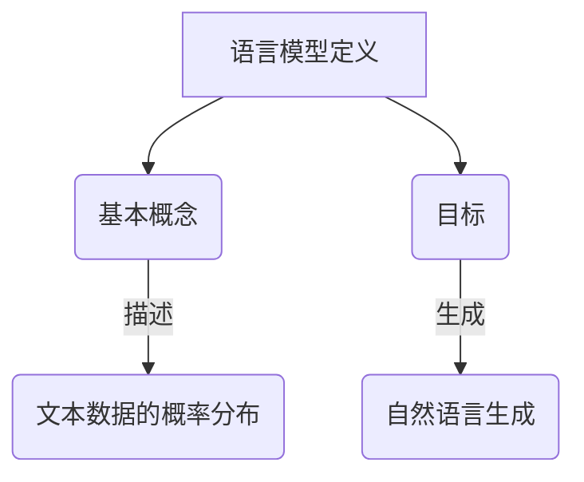
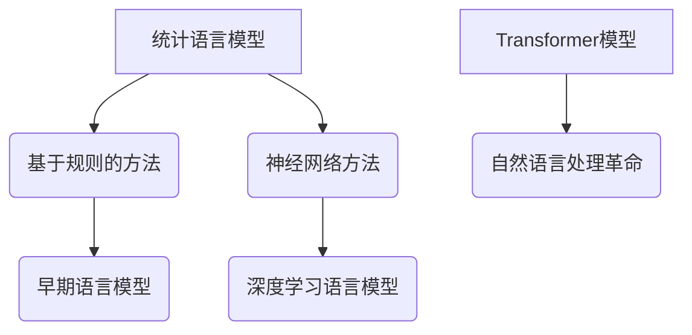
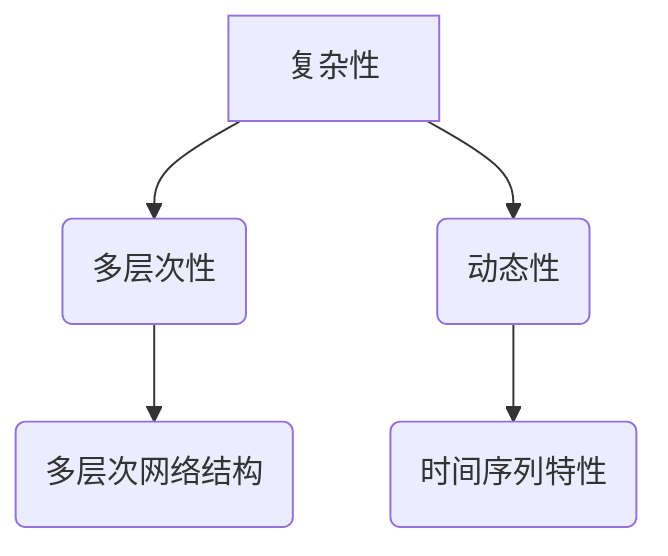
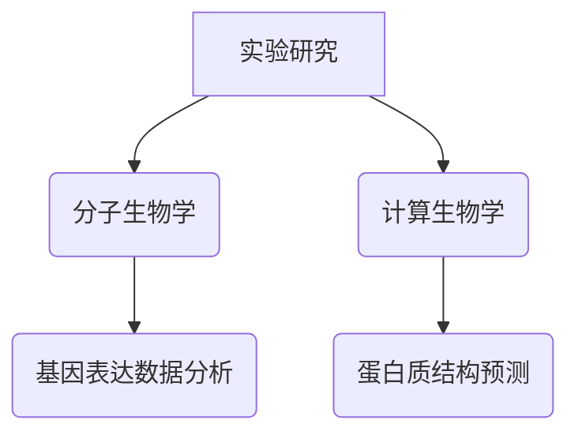

                 

## 目录大纲

### 第一部分：背景知识

#### 第1章：语言模型概述

##### 1.1 语言模型的基本概念
- 语言模型的定义
- 语言模型的目标

**Mermaid 流程图：**



##### 1.2 语言模型的历史与发展

**核心概念与联系：**

**Mermaid 流程图：**



**核心算法原理讲解：**

**伪代码：**

```python
def n_gram_model(sentence, n):
    # 计算N-gram模型的概率分布
    # 输入：句子sentence，N值n
    # 输出：概率分布字典
    probabilities = {}
    for i in range(len(sentence) - n + 1):
        n_gram = tuple(sentence[i:i+n])
        probabilities[n_gram] = probabilities.get(n_gram, 0) + 1
    total_count = sum(probabilities.values())
    for n_gram, count in probabilities.items():
        probabilities[n_gram] = count / total_count
    return probabilities
```

**数学模型和公式：**

$$
P(w_1, w_2, ..., w_n) = \frac{C(w_1, w_2, ..., w_n)}{C(w_1) \cdot C(w_2) \cdot ... \cdot C(w_n)}
$$

其中，$P(w_1, w_2, ..., w_n)$ 表示一个n-gram的概率，$C(w_1, w_2, ..., w_n)$ 表示n-gram的计数，$C(w_1), C(w_2), ..., C(w_n)$ 分别表示每个单词的计数。

#### 第2章：复杂生物系统简介

##### 2.1 复杂生物系统的特点

- **系统复杂性**
- **系统多样性**

**核心概念与联系：**

**Mermaid 流程图：**



##### 2.2 复杂生物系统的研究方法

- **现有研究方法**
- **语言模型在生物系统研究中的应用**

**核心概念与联系：**

**Mermaid 流�程图：**



### 第二部分：语言模型原理

#### 第3章：语言模型的数学基础

##### 3.1 概率论基础

- **概率论的基本概念**
- **概率分布函数**

**核心算法原理讲解：**

**伪代码：**

```python
import numpy as np

def probability_distribution(data):
    # 计算数据的概率分布
    # 输入：数据列表data
    # 输出：概率分布列表
    counts = np.bincount(data)
    total_count = np.sum(counts)
    probabilities = counts / total_count
    return probabilities
```

**数学模型和公式：**

$$
P(X = x) = \frac{f(x)}{\sum_{i=1}^{n} f(i)}
$$

其中，$P(X = x)$ 表示随机变量X等于x的概率，$f(x)$ 表示x的频数，$n$ 表示数据的总数。

##### 3.2 信息论基础

- **信息论的基本概念**
- **信息熵**

**核心算法原理讲解：**

**伪代码：**

```python
import numpy as np

def entropy(probabilities):
    # 计算熵
    # 输入：概率分布列表probabilities
    # 输出：熵值
    return -np.sum(probabilities * np.log2(probabilities))
```

**数学模型和公式：**

$$
H(X) = -\sum_{i=1}^{n} P(X = x_i) \cdot \log_2 P(X = x_i)
$$

其中，$H(X)$ 表示随机变量X的熵，$P(X = x_i)$ 表示X等于$x_i$的概率。

### 第三部分：算法应用

#### 第4章：语言模型的主要类型

##### 4.1 基于统计的语言模型

- **N-gram模型**
- **隐马尔可夫模型**

**核心算法原理讲解：**

**N-gram模型伪代码：**

```python
def n_gram_model(sentence, n):
    # 计算N-gram模型的概率分布
    # 输入：句子sentence，N值n
    # 输出：概率分布字典
    probabilities = {}
    for i in range(len(sentence) - n + 1):
        n_gram = tuple(sentence[i:i+n])
        probabilities[n_gram] = probabilities.get(n_gram, 0) + 1
    total_count = sum(probabilities.values())
    for n_gram, count in probabilities.items():
        probabilities[n_gram] = count / total_count
    return probabilities
```

**隐马尔可夫模型伪代码：**

```python
def viterbi算法(观测序列，状态转移概率，发射概率，初始状态概率):
    # Viterbi算法
    # 输入：观测序列，状态转移概率矩阵，发射概率矩阵，初始状态概率向量
    # 输出：最优状态序列及路径概率
    ...
    return best_path, best_path_probability
```

##### 4.2 基于神经网络的语言模型

- **循环神经网络（RNN）**
- **长短时记忆网络（LSTM）**
- **门控循环单元（GRU）**

**核心算法原理讲解：**

**RNN单元伪代码：**

```python
def rnn_step(input, hidden_state, weights):
    # RNN单步计算
    # 输入：当前输入，上一时刻隐藏状态，权重矩阵
    # 输出：当前隐藏状态，当前输出
    ...
    return new_hidden_state, output
```

**LSTM单元伪代码：**

```python
def lstm_step(input, hidden_state, cell_state, weights):
    # LSTM单步计算
    # 输入：当前输入，上一时刻隐藏状态，上一时刻细胞状态，权重矩阵
    # 输出：当前隐藏状态，当前细胞状态
    ...
    return new_hidden_state, new_cell_state
```

##### 4.3 基于深度学习的语言模型

- **卷积神经网络（CNN）**
- **Transformer模型**

**核心算法原理讲解：**

**Transformer模型伪代码：**

```python
def transformer_encoding(input_sequence, d_model, num_heads, dff, dropout_rate):
    # Transformer编码器
    # 输入：输入序列，模型维度，多头注意力数，中间层维度，dropout率
    # 输出：编码后的序列
    ...
    return encoded_sequence
```

### 第四部分：生物系统功能预测

#### 第5章：语言模型在生物系统中的应用

##### 5.1 语言模型在生物系统分析中的应用

- **基因表达数据分析**
- **蛋白质结构预测**

**核心算法原理讲解：**

**基因表达数据分析伪代码：**

```python
def gene_expression_analysis(data, model):
    # 基因表达数据分析
    # 输入：基因表达数据，训练好的语言模型
    # 输出：分析结果
    ...
    return analysis_results
```

**蛋白质结构预测伪代码：**

```python
def protein_structure_prediction(sequence, model):
    # 蛋白质结构预测
    # 输入：蛋白质序列，训练好的语言模型
    # 输出：预测的结构
    ...
    return predicted_structure
```

##### 5.2 语言模型在生物系统预测中的应用

- **基因功能预测**
- **代谢网络预测**

**核心算法原理讲解：**

**基因功能预测伪代码：**

```python
def gene_function_prediction(sequence, model):
    # 基因功能预测
    # 输入：基因序列，训练好的语言模型
    # 输出：预测的功能
    ...
    return predicted_function
```

**代谢网络预测伪代码：**

```python
def metabolic_network_prediction(data, model):
    # 代谢网络预测
    # 输入：代谢数据，训练好的语言模型
    # 输出：预测的网络结构
    ...
    return predicted_network
```

### 第五部分：项目实战

#### 第6章：建立生物系统功能预测模型

##### 6.1 项目背景与目标

- **项目背景**
- **项目目标**

##### 6.2 数据收集与预处理

- **数据收集**
- **数据预处理**

##### 6.3 模型设计与实现

- **模型选择**
- **模型训练**

##### 6.4 模型评估与优化

- **模型评估**
- **模型优化**

#### 第7章：实现生物系统功能预测系统

##### 6.1 系统需求分析

- **系统需求**
- **用户界面设计**

##### 6.2 系统设计

- **系统架构**
- **功能模块设计**

##### 6.3 系统实现

- **前端实现**
- **后端实现**

##### 6.4 系统测试与部署

- **系统测试**
- **系统部署**

### 第六部分：总结与展望

#### 第8章：总结与展望

- **主要研究成果总结**
- **未来研究方向与展望**

**作者信息：**

作者：AI天才研究院/AI Genius Institute & 禅与计算机程序设计艺术 /Zen And The Art of Computer Programming

**注意事项：**

1. **格式要求**：文章内容使用markdown格式输出，数学公式使用latex格式。
2. **完整性要求**：文章内容必须完整，每个小节的内容必须丰富具体详细讲解，核心内容必须包含：背景介绍、核心概念与联系、核心算法原理讲解、数学模型和公式、项目实战、最佳实践 tips、小结、注意事项、拓展阅读等内容。
3. **文章字数**：文章字数在8000～12000字左右。

