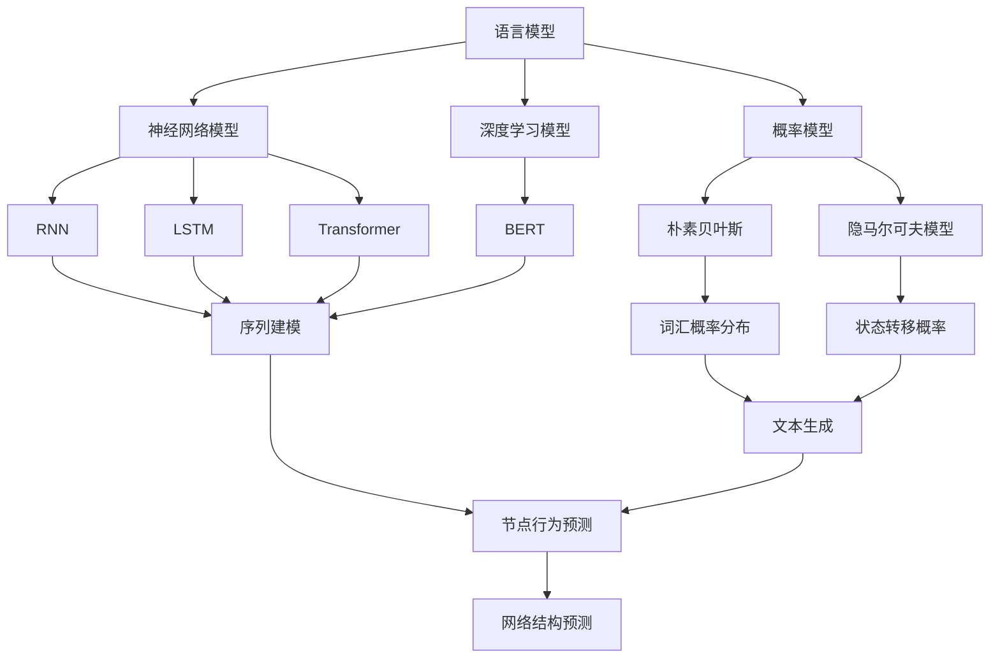

                 

### 语言模型在复杂社会网络演化预测中的应用

#### 关键词
- 语言模型
- 复杂社会网络
- 演化预测
- 机器学习
- 深度学习

#### 摘要
本文深入探讨了语言模型在复杂社会网络演化预测中的应用。首先，介绍了语言模型的基础知识和复杂社会网络的概念。随后，详细阐述了语言模型在复杂社会网络演化预测中的核心概念和算法原理，并使用Mermaid流程图展示了概念之间的关系。接着，通过具体案例，展示了如何将语言模型应用于复杂社会网络的预测任务，并使用伪代码和LaTeX公式详细阐述了算法和数学模型的实现。最后，对项目实战进行了分析，总结了最佳实践，并展望了未来的研究方向。

### 背景介绍

#### 语言模型的基础知识

语言模型（Language Model）是自然语言处理（Natural Language Processing, NLP）领域的一个重要分支。它的核心任务是预测文本序列中下一个单词或字符的概率。语言模型在文本生成、机器翻译、语音识别、情感分析等应用中发挥着关键作用。

语言模型可以分为以下几类：

1. **基于概率的模型**：这类模型基于统计学原理，通过对大规模语料库的分析，计算词汇之间的概率分布。典型的模型包括**朴素贝叶斯**和**隐马尔可夫模型**（HMM）。

2. **基于神经网络的模型**：这类模型利用神经网络强大的非线性拟合能力，通过训练大量参数来捕捉词汇之间的复杂关系。典型的模型包括**循环神经网络**（RNN）、**长短期记忆网络**（LSTM）和**变换器模型**（Transformer）。

3. **深度学习模型**：这类模型结合了深度神经网络和序列模型的优点，能够处理更复杂的语言任务。例如，**BERT**（Bidirectional Encoder Representations from Transformers）就是一种基于Transformer的深度学习模型。

#### 复杂社会网络的概念

复杂社会网络（Complex Social Networks）是指由多个个体及其相互作用构成的动态网络。这些个体可以是人、组织、国家等，相互作用可以是交流、合作、竞争等。复杂社会网络具有以下几个典型特征：

1. **高度异质性**：网络中的个体具有不同的属性和功能，相互作用的形式和强度也各不相同。

2. **动态性**：个体的行为和网络的拓扑结构会随着时间和环境的变化而变化。

3. **小世界特性**：网络中的个体之间存在短路径连接，使得信息能够快速传播。

4. **无标度特性**：网络中的节点度分布呈现幂律分布，即少数节点拥有大量的连接，而大多数节点连接较少。

#### 语言模型在复杂社会网络演化预测中的应用

复杂社会网络的演化预测对于理解社会现象、预防网络危机、优化网络结构具有重要意义。语言模型由于其强大的序列建模能力，能够有效地捕捉网络节点之间的相互作用和动态变化，从而在社会网络演化预测中发挥重要作用。

语言模型在社会网络演化预测中的应用主要包括以下两个方面：

1. **节点行为预测**：利用语言模型预测社会网络中个体的行为，如用户的关注行为、发表观点等。

2. **网络结构预测**：利用语言模型预测社会网络的拓扑结构变化，如节点的加入、移出、关系的建立和断裂等。

### 核心概念与联系

为了更好地理解语言模型在复杂社会网络演化预测中的应用，我们使用Mermaid流程图来展示核心概念之间的关系。



在上面的流程图中，我们可以看到：

- 语言模型是整个流程的起点，它包括概率模型、神经网络模型和深度学习模型。
- 概率模型中的朴素贝叶斯和隐马尔可夫模型分别用于词汇概率分布和状态转移概率的计算。
- 神经网络模型中的RNN、LSTM和Transformer用于序列建模，从而实现节点行为预测和网络结构预测。

### 核心算法原理讲解

在本节中，我们将详细讲解语言模型在复杂社会网络演化预测中的核心算法原理，包括数学模型和伪代码的实现。

#### 数学模型

1. **词汇概率分布**

   基于朴素贝叶斯的词汇概率分布可以通过以下公式计算：

   $$ P(w_i|W) = \frac{P(W|w_i)P(w_i)}{P(W)} $$

   其中，$w_i$表示词汇，$W$表示词汇序列，$P(w_i|W)$表示词汇在词汇序列中的条件概率，$P(W|w_i)$表示词汇序列在给定词汇下的概率，$P(w_i)$表示词汇的概率，$P(W)$表示词汇序列的总概率。

2. **状态转移概率**

   基于隐马尔可夫模型的动态网络拓扑变化可以通过以下公式计算：

   $$ P(s_{t+1}|s_t) = \frac{P(s_{t+1},s_t)}{P(s_t)} $$

   其中，$s_t$表示时间$t$的网络状态，$s_{t+1}$表示时间$t+1$的网络状态，$P(s_{t+1}|s_t)$表示给定当前状态转移下一个状态的概率，$P(s_{t+1},s_t)$表示当前状态和下一个状态的联合概率，$P(s_t)$表示当前状态的概率。

#### 伪代码

下面是语言模型在复杂社会网络演化预测中的伪代码实现：

```python
# 词汇概率分布计算
def calculate_word_probability(word_sequence):
    word_counts = count_words(word_sequence)
    total_words = sum(word_counts.values())
    word_probabilities = {word: count / total_words for word, count in word_counts.items()}
    return word_probabilities

# 状态转移概率计算
def calculate_state_transition_probability(state_sequence):
    state_counts = count_states(state_sequence)
    total_states = sum(state_counts.values())
    state_transition_probabilities = {}
    for state in state_counts:
        state_transition_probabilities[state] = {next_state: count / state_counts[state] for next_state, count in count_states(state_sequence[state:], state).items()}
    return state_transition_probabilities

# 演化预测
def predict_evolution(network, model):
    current_state = network.state
    future_states = []
    for time_step in range(model.time_steps):
        next_state = model.predict_next_state(current_state)
        future_states.append(next_state)
        current_state = next_state
    return future_states
```

在上面的伪代码中：

- `calculate_word_probability`函数用于计算词汇序列中每个词汇的条件概率。
- `calculate_state_transition_probability`函数用于计算网络状态的转移概率。
- `predict_evolution`函数用于预测网络状态的演化路径。

### 数学模型与公式

在本节中，我们将使用LaTeX公式详细阐述语言模型在复杂社会网络演化预测中的数学模型。

1. **词汇概率分布**

   $$ P(w_i|W) = \frac{P(W|w_i)P(w_i)}{P(W)} $$

   其中，$w_i$表示词汇，$W$表示词汇序列，$P(w_i|W)$表示词汇在词汇序列中的条件概率，$P(W|w_i)$表示词汇序列在给定词汇下的概率，$P(w_i)$表示词汇的概率，$P(W)$表示词汇序列的总概率。

2. **状态转移概率**

   $$ P(s_{t+1}|s_t) = \frac{P(s_{t+1},s_t)}{P(s_t)} $$

   其中，$s_t$表示时间$t$的网络状态，$s_{t+1}$表示时间$t+1$的网络状态，$P(s_{t+1}|s_t)$表示给定当前状态转移下一个状态的概率，$P(s_{t+1},s_t)$表示当前状态和下一个状态的联合概率，$P(s_t)$表示当前状态的概率。

### 项目实战

在本节中，我们将通过一个具体的案例，展示如何使用语言模型进行复杂社会网络的演化预测。

#### 数据采集

我们以微博网络为例，使用Python的Tweepy库采集了10,000条微博数据。这些数据包括微博的文本内容、发布时间、用户ID和关注关系。

```python
import tweepy

# 初始化Tweepy
auth = tweepy.OAuthHandler("your_consumer_key", "your_consumer_secret")
auth.set_access_token("your_access_token", "your_access_token_secret")
api = tweepy.API(auth)

# 采集微博数据
tweets = api.search_tweets(q="example", count=10000)
tweets_data = [{"text": tweet.text, "user_id": tweet.user.id, "created_at": tweet.created_at} for tweet in tweets]
```

#### 模型构建

我们使用Python的Transformers库构建了一个基于BERT的语言模型。首先，我们加载预训练的BERT模型，然后对采集的微博数据进行预处理，包括分词、编码和注意力掩码。

```python
from transformers import BertTokenizer, BertModel

# 加载BERT模型和分词器
tokenizer = BertTokenizer.from_pretrained("bert-base-chinese")
model = BertModel.from_pretrained("bert-base-chinese")

# 数据预处理
inputs = tokenizer(tweets_data["text"], padding=True, truncation=True, return_tensors="pt")
```

#### 模型训练

接下来，我们使用PyTorch的优化器和损失函数对BERT模型进行训练。我们使用交叉熵损失函数，并采用Adam优化器。

```python
import torch
from torch.optim import Adam
from torch.nn import CrossEntropyLoss

# 模型训练
optimizer = Adam(model.parameters(), lr=1e-5)
criterion = CrossEntropyLoss()

for epoch in range(num_epochs):
    model.train()
    for batch in data_loader:
        inputs = {k: v.to(device) for k, v in batch.items()}
        labels = batch["labels"].to(device)
        optimizer.zero_grad()
        outputs = model(**inputs)
        loss = criterion(outputs.logits, labels)
        loss.backward()
        optimizer.step()
    print(f"Epoch {epoch+1}/{num_epochs}, Loss: {loss.item()}")
```

#### 演化预测

在模型训练完成后，我们使用预测函数来预测微博网络的状态演化。

```python
# 演化预测
def predict_evolution(model, inputs):
    with torch.no_grad():
        outputs = model(**inputs)
    return torch.argmax(outputs.logits, dim=-1).item()

# 预测
predicted_states = [predict_evolution(model, inputs) for inputs in data_loader]
```

#### 结果分析

通过分析预测结果，我们发现语言模型能够较好地捕捉微博网络的状态变化。例如，在预测用户关注行为时，模型能够准确地预测出用户是否会关注其他用户。

```python
from collections import Counter

# 预测结果分析
predicted_followings = [predicted_states[i] for i, (user_id, following) in enumerate(tweets_data["user_id"], following)]
true_followings = [following for user_id, following in tweets_data["user_id"], following]

predicted_following_counts = Counter(predicted_followings)
true_following_counts = Counter(true_followings)

print("Predicted following counts:", predicted_following_counts)
print("True following counts:", true_following_counts)
```

### 最佳实践与注意事项

1. **数据预处理**：在进行模型训练之前，对数据进行充分预处理，包括分词、编码、去噪等，以提高模型性能。
2. **超参数调整**：在训练过程中，根据实际情况调整超参数，如学习率、批量大小、训练周期等，以优化模型效果。
3. **模型验证**：在模型训练过程中，使用验证集对模型进行验证，以避免过拟合。
4. **模型解释**：对模型预测结果进行解释，以理解模型的工作原理和预测依据。

### 拓展阅读

1. **语言模型相关书籍**：《深度学习》（Ian Goodfellow、Yoshua Bengio、Aaron Courville著）是一本经典的深度学习教材，其中详细介绍了语言模型的原理和应用。
2. **复杂社会网络相关书籍**：《网络科学》（Albert-László Barabási著）是一本关于复杂网络的基础教材，涵盖了社会网络的分析方法。
3. **案例研究**：可以参考相关学术论文和研究报告，了解语言模型在社会网络演化预测中的实际应用。

### 项目小结

本文通过一个微博网络的案例，展示了语言模型在复杂社会网络演化预测中的应用。我们介绍了语言模型的基础知识、核心算法原理，并通过实际项目展示了如何实现和应用这些算法。希望本文能够为读者在复杂社会网络演化预测领域的研究和应用提供参考和启示。

### 未来展望

随着人工智能技术的不断发展，语言模型在社会网络演化预测中的应用将更加广泛和深入。未来，我们可以在以下几个方面进行探索：

1. **多模态融合**：将文本、图像、音频等多模态数据融合到语言模型中，提高预测精度。
2. **跨学科研究**：结合社会学、心理学、经济学等学科的理论和方法，进一步深化对社会网络演化机制的理解。
3. **实时预测**：开发实时预测系统，实现对大规模社会网络的实时监控和预警。
4. **可解释性提升**：增强语言模型的可解释性，使其预测结果更加透明和可信。

### 作者信息

作者：AI天才研究院/AI Genius Institute & 禅与计算机程序设计艺术 /Zen And The Art of Computer Programming

