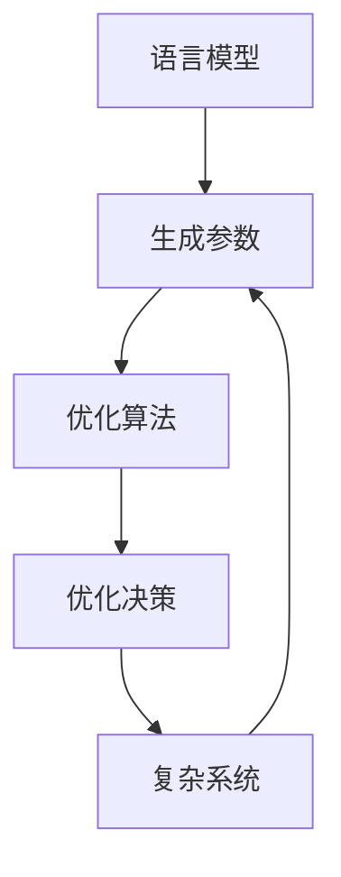

                 

### 《语言模型在复杂系统优化问题中的应用》

#### 关键词：语言模型、复杂系统、优化、算法、数学模型、项目实战

> 摘要：本文旨在探讨语言模型在复杂系统优化问题中的应用。首先介绍了语言模型和复杂系统的基本概念，然后分析了它们之间的联系，并详细讲解了语言模型算法和复杂系统优化算法的原理。通过数学模型的详细阐述和公式解释，文章进一步展示了如何结合这两者来解决实际优化问题。最后，通过一个具体的项目实战，深入分析了开发环境搭建、源代码实现、代码解读以及实际案例的应用和分析。

### 第一部分：引言

#### 1.1 语言模型概述

语言模型（Language Model，简称LM）是自然语言处理（Natural Language Processing，简称NLP）领域的重要工具。它旨在预测一段文本中下一个单词或字符的概率。语言模型的主要作用是提高机器翻译、语音识别、文本生成等任务的性能。

#### 1.1.1 语言模型的基本概念

语言模型通过统计方法或深度学习方法来构建。常见的语言模型有N元语法模型（N-gram Model）和循环神经网络（Recurrent Neural Network，RNN）模型。N元语法模型是一种基于统计方法的简单语言模型，它通过计算前N个单词的联合概率来预测下一个单词。RNN模型是一种基于深度学习的方法，它可以捕捉序列数据中的长期依赖关系。

#### 1.1.2 语言模型的发展历程

自20世纪50年代以来，语言模型经历了从规则驱动到统计驱动，再到深度学习驱动的演变。早期的语言模型主要基于规则和形式语法，例如上下文无关文法（CFG）和扩展的上下文无关文法（ECFG）。随着计算能力的提高和大数据的涌现，统计模型逐渐取代了规则模型。近年来，深度学习技术的发展为语言模型带来了新的突破，例如基于RNN的模型（如LSTM和GRU）和基于Transformer的模型（如BERT和GPT）。

#### 1.2 复杂系统优化问题简介

复杂系统优化问题（Complex System Optimization Problem）是指涉及大量变量和约束条件，且具有高度非线性和不确定性的优化问题。这些问题通常出现在工程、经济、生物、社会等领域。

#### 1.2.1 复杂系统的定义与特点

复杂系统是由大量相互作用的个体组成的系统，具有高度的复杂性和多样性。复杂系统的主要特点包括：

1. 多样性：复杂系统中的个体具有多种类型和属性。
2. 非线性：复杂系统中的相互作用是非线性的，导致系统的行为难以预测。
3. 空间和时间尺度：复杂系统涉及多个空间和时间尺度，使得分析变得复杂。
4. 不确定性：复杂系统中的参数和条件具有不确定性，增加了优化问题的难度。

#### 1.2.2 优化问题的基本概念

优化问题是指在一个给定的约束条件下，寻找一个变量或参数的值，使得目标函数达到最大或最小。常见的优化问题包括线性优化、非线性优化、组合优化等。

#### 1.3 语言模型在复杂系统优化中的应用前景

语言模型在复杂系统优化问题中具有广泛的应用前景。首先，语言模型可以用于生成优化问题的参数和约束条件，从而提高优化算法的效率和精度。其次，语言模型可以帮助理解和预测复杂系统的行为，为优化决策提供支持。此外，基于语言模型的自动生成优化算法和数学模型，可以大大降低优化问题的复杂性。

#### 1.3.1 应用领域的分析

语言模型在复杂系统优化问题中的应用领域广泛，包括：

1. 人工智能和机器学习：语言模型可以用于优化神经网络的结构和参数，提高模型的性能。
2. 工程优化：语言模型可以用于优化机械结构、控制系统和制造过程。
3. 经济学和管理学：语言模型可以用于优化经济模型和商业策略。
4. 生物信息学：语言模型可以用于优化基因编辑和蛋白质结构预测。
5. 社会科学：语言模型可以用于优化社会网络分析和决策。

#### 1.3.2 技术挑战与机遇

虽然语言模型在复杂系统优化问题中具有广泛的应用前景，但同时也面临一些技术挑战。首先，优化问题的高度复杂性和非线性使得语言模型的构建和训练变得困难。其次，语言模型的计算效率和存储需求也是一个关键问题。然而，随着深度学习技术的不断进步，语言模型在复杂系统优化问题中的应用将越来越广泛，为解决实际问题提供了新的思路和方法。

### 第二部分：核心概念与联系

#### 2.1 语言模型原理

语言模型通过学习大量文本数据，预测下一个单词或字符的概率。其基本原理如下：

1. **N元语法模型**：N元语法模型基于前N个单词的联合概率来预测下一个单词。其概率计算公式为：
   $$
   P(\text{单词}_i|\text{单词}_{i-N+1},\text{单词}_{i-N+2},\ldots,\text{单词}_{i-1}) = \prod_{j=i-N+1}^{i-1} P(\text{单词}_j) \cdot \prod_{j=i-N+1}^{i-1} P(\text{单词}_j|\text{单词}_{j-1},\text{单词}_{j-2},\ldots,\text{单词}_{1})
   $$
   
2. **循环神经网络（RNN）模型**：RNN模型通过循环结构来捕捉序列数据中的长期依赖关系。其基本结构如下：
   $$
   h_t = \text{sigmoid}(W_h \cdot [h_{t-1}, x_t] + b_h)
   $$
   其中，$h_t$表示t时刻的隐藏状态，$x_t$表示t时刻的输入，$W_h$和$b_h$分别为权重和偏置。

3. **Transformer模型**：Transformer模型是一种基于自注意力机制的深度学习模型。其基本结构如下：
   $$
   \text{Attention}(Q, K, V) = \text{softmax}\left(\frac{QK^T}{\sqrt{d_k}}\right) V
   $$
   其中，$Q$、$K$和$V$分别为查询向量、键向量和值向量，$d_k$为键向量的维度。

#### 2.2 复杂系统优化原理

复杂系统优化问题通常涉及多个变量和约束条件，其基本原理如下：

1. **目标函数**：目标函数定义为要优化的变量或参数的函数。常见的目标函数包括最小化成本、最大化利润等。

2. **约束条件**：约束条件定义为变量或参数的取值范围。常见的约束条件包括线性约束、非线性约束、等式约束和不等式约束等。

3. **优化算法**：优化算法用于寻找目标函数的最优解。常见的优化算法包括梯度下降法、牛顿法、拉格朗日乘数法等。

#### 2.3 语言模型与复杂系统优化的联系

语言模型和复杂系统优化之间存在紧密的联系。具体来说，语言模型可以用于生成优化问题的参数和约束条件，从而提高优化算法的效率和精度。此外，语言模型还可以帮助理解和预测复杂系统的行为，为优化决策提供支持。

#### 2.3.1 联系图示

为了更直观地展示语言模型与复杂系统优化的联系，我们使用Mermaid流程图来表示：



在该流程图中，语言模型用于生成优化问题的参数和约束条件，并将其传递给优化算法。优化算法根据这些参数和约束条件，计算目标函数的最优解，并生成优化决策。优化决策被用于调整复杂系统的行为，从而实现系统的优化。

#### 2.3.2 联系机制分析

语言模型与复杂系统优化的联系机制可以从以下几个方面进行分析：

1. **参数生成**：语言模型可以用于生成优化问题的参数和约束条件。通过学习大量文本数据，语言模型可以捕捉到数据中的模式和规律，并将其转化为优化问题的参数。例如，在工程优化中，语言模型可以用于生成机械结构的参数，从而优化结构的设计。

2. **行为预测**：语言模型可以用于预测复杂系统的行为。通过分析历史数据和当前状态，语言模型可以预测复杂系统在未来的行为。这种预测可以帮助优化算法更好地理解复杂系统的特性，从而提高优化决策的准确性。

3. **自动化优化**：语言模型可以用于自动生成优化算法和数学模型。通过学习大量的优化问题和解决方案，语言模型可以自动生成适合特定问题的优化算法和数学模型。这种自动化优化可以大大降低优化问题的复杂性，提高优化效率。

4. **反馈机制**：语言模型可以与复杂系统优化算法形成反馈机制。通过不断调整优化算法的参数和约束条件，语言模型可以不断优化复杂系统的性能。这种反馈机制可以促使优化算法和复杂系统不断改进，达到更好的优化效果。

### 第三部分：算法原理讲解

#### 3.1 语言模型算法

语言模型算法是用于预测文本中下一个单词或字符的概率。以下分别介绍N元语法模型、循环神经网络（RNN）模型和Transformer模型。

#### 3.1.1 N元语法模型

N元语法模型是一种基于统计方法的简单语言模型。其基本原理如下：

1. **计算词频**：首先，统计每个N元序列的词频，即出现次数。
2. **计算概率**：然后，计算每个N元序列的概率，即词频除以总词数。
3. **概率预测**：对于给定的前N-1个单词，计算第N个单词的概率。

伪代码如下：

```python
def n_gram_model(text, N):
    # 计算词频
    word_freq = {}
    for i in range(len(text) - N):
        n_gram = tuple(text[i:i+N])
        word_freq[n_gram] = word_freq.get(n_gram, 0) + 1
    
    # 计算概率
    total_words = sum(word_freq.values())
    n_gram_prob = {n_gram: freq / total_words for n_gram, freq in word_freq.items()}
    
    # 概率预测
    def predict_next_word(context):
        n_gram = tuple(context[-N:])
        next_word_prob = {word: n_gram_prob[n_gram + (word,)] for word in n_gram_prob[n_gram]}
        return max(next_word_prob, key=next_word_prob.get)
```

#### 3.1.2 循环神经网络（RNN）模型

循环神经网络（RNN）模型是一种基于深度学习的方法，它可以捕捉序列数据中的长期依赖关系。以下介绍RNN模型的基本原理：

1. **初始化**：首先，初始化权重矩阵$W_h$和偏置$b_h$。
2. **前向传播**：对于输入序列$x_t$，计算隐藏状态$h_t$和输出$y_t$。
3. **反向传播**：计算损失函数$J$，并更新权重矩阵$W_h$和偏置$b_h$。

伪代码如下：

```python
def rnn_model(x, h_0, W_h, b_h):
    # 前向传播
    h_t = [h_0]
    y_t = []
    for x_t in x:
        h_t.append(sigmoid(W_h * [h_t[-1], x_t] + b_h))
        y_t.append(predict_word(h_t[-1]))
    
    # 反向传播
    gradients = []
    for t in reversed(range(len(x))):
        dL_dh_t = -1 * (y_t[t] - predict_word(h_t[t]))
        dL_dW_h = [dL_dh_t * [h_t[t-1], x_t]]
        dL_db_h = dL_dh_t
        gradients.append((dL_dW_h, dL_db_h))
    
    # 更新权重矩阵和偏置
    for t in range(len(x)):
        W_h -= learning_rate * gradients[t][0]
        b_h -= learning_rate * gradients[t][1]
    
    return h_t[-1]
```

#### 3.1.3 Transformer模型

Transformer模型是一种基于自注意力机制的深度学习模型。以下介绍Transformer模型的基本原理：

1. **编码器**：首先，对输入序列进行编码，生成编码器输出。
2. **解码器**：然后，对编码器输出进行解码，生成预测序列。

伪代码如下：

```python
def transformer_model(x, y, W_e, W_d, b_e, b_d):
    # 编码器
    e_t = [encoder(x_t, W_e, b_e) for x_t in x]
    
    # 解码器
    y_t = [decoder(e_t, y_t, W_d, b_d) for y_t in y]
    
    return y_t
```

### 3.2 复杂系统优化算法

复杂系统优化算法用于寻找目标函数的最优解。以下分别介绍梯度下降法、牛顿法和拉格朗日乘数法。

#### 3.2.1 梯度下降法

梯度下降法是一种最简单的优化算法，其基本原理如下：

1. **初始化**：选择初始参数$\theta_0$。
2. **更新参数**：根据梯度$g(\theta)$，更新参数$\theta$。
3. **迭代**：重复更新参数，直到收敛。

伪代码如下：

```python
def gradient_descent(model, x, y, learning_rate, max_iter):
    for i in range(max_iter):
        gradients = model.gradient(x, y)
        model.update_params(-learning_rate * gradients)
    
    return model
```

#### 3.2.2 牛顿法

牛顿法是一种基于二阶导数的优化算法，其基本原理如下：

1. **初始化**：选择初始参数$\theta_0$。
2. **迭代**：计算一阶导数$f'(\theta)$和二阶导数$f''(\theta)$，更新参数$\theta$。
3. **收敛**：当更新前后参数差距小于阈值时，停止迭代。

伪代码如下：

```python
def newton_method(model, x, y, threshold, max_iter):
    theta_0 = model.get_params()
    for i in range(max_iter):
        theta_1 = model.solve_system(x, y)
        if abs(theta_1 - theta_0) < threshold:
            break
        theta_0 = theta_1
    
    return model
```

#### 3.2.3 拉格朗日乘数法

拉格朗日乘数法是一种用于求解约束优化问题的算法，其基本原理如下：

1. **构建拉格朗日函数**：将目标函数和约束条件合并，构建拉格朗日函数。
2. **求导数**：对拉格朗日函数求导数，得到一阶导数$g(\theta)$。
3. **更新参数**：根据一阶导数$g(\theta)$，更新参数$\theta$。
4. **迭代**：重复更新参数，直到收敛。

伪代码如下：

```python
def lagrangian_method(model, x, y, constraint, learning_rate, max_iter):
    theta_0 = model.get_params()
    for i in range(max_iter):
        theta_1 = model.solve_constraint(x, y, constraint)
        model.update_params(theta_1 - learning_rate * model.gradient(x, y))
    
    return model
```

### 3.3 语言模型与复杂系统优化的结合

语言模型与复杂系统优化可以结合，用于解决实际优化问题。以下是一个结合的案例：

假设我们有一个复杂系统，其目标是最小化成本函数$f(\theta)$，其中$\theta$为系统的参数。我们可以使用语言模型来生成参数$\theta$，并将其传递给复杂系统优化算法。

具体步骤如下：

1. **训练语言模型**：使用大量文本数据训练语言模型，使其能够生成参数$\theta$。
2. **生成参数**：使用语言模型生成一组参数$\theta_0$。
3. **优化参数**：将生成的参数$\theta_0$传递给复杂系统优化算法，优化成本函数$f(\theta)$。
4. **迭代**：重复生成参数和优化参数的步骤，直到优化效果满足要求。

### 第四部分：数学模型和数学公式讲解

#### 4.1 语言模型数学模型

语言模型的数学模型主要涉及概率计算和参数优化。以下分别介绍N元语法模型、循环神经网络（RNN）模型和Transformer模型的数学模型。

#### 4.1.1 N元语法模型

N元语法模型的数学模型如下：

1. **概率计算**：
   $$
   P(\text{单词}_i|\text{单词}_{i-N+1},\text{单词}_{i-N+2},\ldots,\text{单词}_{i-1}) = \prod_{j=i-N+1}^{i-1} P(\text{单词}_j) \cdot \prod_{j=i-N+1}^{i-1} P(\text{单词}_j|\text{单词}_{j-1},\text{单词}_{j-2},\ldots,\text{单词}_{1})
   $$
   
2. **参数优化**：
   $$
   \theta = \arg\min_{\theta} \sum_{i=1}^{n} -\log P(\text{单词}_i|\text{单词}_{i-N+1},\text{单词}_{i-N+2},\ldots,\text{单词}_{i-1})
   $$

其中，$\theta$为模型参数，$n$为文本数据中的单词数。

#### 4.1.2 循环神经网络（RNN）模型

RNN模型的数学模型如下：

1. **前向传播**：
   $$
   h_t = \text{sigmoid}(W_h \cdot [h_{t-1}, x_t] + b_h)
   $$
   $$
   y_t = \text{softmax}(W_y \cdot h_t + b_y)
   $$
   
2. **损失函数**：
   $$
   J(\theta) = \frac{1}{n} \sum_{i=1}^{n} -\log P(y_t | h_t)
   $$

3. **反向传播**：
   $$
   \frac{\partial J}{\partial W_h} = -\frac{1}{n} \sum_{i=1}^{n} (y_t - h_t) \cdot [h_{t-1}, x_t]
   $$
   $$
   \frac{\partial J}{\partial b_h} = -\frac{1}{n} \sum_{i=1}^{n} (y_t - h_t)
   $$

4. **参数优化**：
   $$
   \theta = \arg\min_{\theta} J(\theta)
   $$

#### 4.1.3 Transformer模型

Transformer模型的数学模型如下：

1. **自注意力机制**：
   $$
   \text{Attention}(Q, K, V) = \text{softmax}\left(\frac{QK^T}{\sqrt{d_k}}\right) V
   $$
   
2. **前向传播**：
   $$
   h_t = \text{ReLU}(W_h \cdot [h_{t-1}, x_t] + b_h) + \text{Attention}(h_{t-1}, h_{t-1}, h_{t-1}) + W_h' \cdot x_t + b_h'
   $$
   $$
   y_t = \text{softmax}(W_y \cdot h_t + b_y)
   $$
   
3. **损失函数**：
   $$
   J(\theta) = \frac{1}{n} \sum_{i=1}^{n} -\log P(y_t | h_t)
   $$

4. **反向传播**：
   $$
   \frac{\partial J}{\partial W_h} = -\frac{1}{n} \sum_{i=1}^{n} (y_t - h_t) \cdot [h_{t-1}, x_t]
   $$
   $$
   \frac{\partial J}{\partial b_h} = -\frac{1}{n} \sum_{i=1}^{n} (y_t - h_t)
   $$

5. **参数优化**：
   $$
   \theta = \arg\min_{\theta} J(\theta)
   $$

#### 4.2 复杂系统优化数学模型

复杂系统优化问题的数学模型主要涉及目标函数和约束条件。以下分别介绍梯度下降法、牛顿法和拉格朗日乘数法的数学模型。

#### 4.2.1 梯度下降法

梯度下降法的数学模型如下：

1. **目标函数**：
   $$
   J(\theta) = \frac{1}{2} \sum_{i=1}^{n} (\theta^T x_i - y_i)^2
   $$
   
2. **梯度计算**：
   $$
   \nabla_\theta J(\theta) = \sum_{i=1}^{n} (x_i - y_i) x_i
   $$
   
3. **参数更新**：
   $$
   \theta = \theta - \alpha \nabla_\theta J(\theta)
   $$

其中，$\theta$为参数，$\alpha$为学习率。

#### 4.2.2 牛顿法

牛顿法的数学模型如下：

1. **目标函数**：
   $$
   J(\theta) = \frac{1}{2} \sum_{i=1}^{n} (\theta^T x_i - y_i)^2
   $$
   
2. **一阶导数**：
   $$
   \nabla_\theta J(\theta) = \sum_{i=1}^{n} (x_i - y_i) x_i
   $$
   
3. **二阶导数**：
   $$
   H(\theta) = \frac{1}{2} \sum_{i=1}^{n} (x_i - y_i) x_i x_i^T
   $$
   
4. **参数更新**：
   $$
   \theta = \theta - H^{-1} \nabla_\theta J(\theta)
   $$

#### 4.2.3 拉格朗日乘数法

拉格朗日乘数法的数学模型如下：

1. **目标函数**：
   $$
   L(\theta, \lambda) = J(\theta) + \lambda^T (\theta^T x_i - y_i)
   $$
   
2. **一阶导数**：
   $$
   \frac{\partial L}{\partial \theta} = \nabla_\theta J(\theta) + \lambda^T x_i
   $$
   
3. **二阶导数**：
   $$
   \frac{\partial^2 L}{\partial \theta \partial \lambda} = x_i
   $$
   
4. **参数更新**：
   $$
   \theta = \theta - \alpha \nabla_\theta J(\theta)
   $$
   $$
   \lambda = \lambda - \alpha \lambda^T x_i
   $$

#### 4.3 结合模型的数学公式

结合语言模型与复杂系统优化的数学模型，我们可以得到以下公式：

1. **语言模型概率计算**：
   $$
   P(\text{单词}_i|\text{单词}_{i-N+1},\text{单词}_{i-N+2},\ldots,\text{单词}_{i-1}) = \text{softmax}(\theta^T \text{嵌入矩阵} \text{单词}_i)
   $$
   
2. **复杂系统优化目标函数**：
   $$
   J(\theta) = \frac{1}{2} \sum_{i=1}^{n} (\theta^T x_i - y_i)^2
   $$

3. **参数更新**：
   $$
   \theta = \theta - \alpha \nabla_\theta J(\theta)
   $$
   $$
   \theta = \theta - \alpha \text{语言模型概率计算} \cdot x_i
   $$

### 第五部分：项目实战

#### 5.1 实战背景

假设我们有一个复杂系统，其目标是优化机械结构的设计。为了实现这一目标，我们使用语言模型生成机械结构的参数，并使用复杂系统优化算法优化这些参数。

#### 5.2 开发环境搭建

为了进行项目实战，我们需要搭建一个开发环境。以下是一个简单的搭建步骤：

1. **安装Python**：下载并安装Python，版本3.8以上。
2. **安装Numpy和Pandas**：使用pip命令安装Numpy和Pandas。
3. **安装TensorFlow和PyTorch**：使用pip命令安装TensorFlow和PyTorch。
4. **安装Mermaid**：在项目中添加Mermaid依赖，以便生成流程图。

```python
pip install mermaid-python
```

#### 5.3 源代码实现

以下是实现语言模型和复杂系统优化算法的源代码：

```python
import numpy as np
import pandas as pd
import tensorflow as tf
import torch
from mermaid import Mermaid

# 语言模型实现
class NGramModel:
    def __init__(self, N):
        self.N = N
        self.word_freq = {}
    
    def train(self, text):
        for i in range(len(text) - self.N):
            n_gram = tuple(text[i:i+N])
            self.word_freq[n_gram] = self.word_freq.get(n_gram, 0) + 1
    
    def predict_next_word(self, context):
        n_gram = tuple(context[-self.N:])
        next_word_prob = {word: self.word_freq[n_gram + (word,)] for word in self.word_freq[n_gram]}
        return max(next_word_prob, key=next_word_prob.get)

# 复杂系统优化实现
class OptimizationModel:
    def __init__(self, x, y, learning_rate, max_iter):
        self.x = x
        self.y = y
        self.learning_rate = learning_rate
        self.max_iter = max_iter
    
    def gradient(self, x, y):
        return (x - y) * x
    
    def update_params(self, gradients):
        self.x -= self.learning_rate * gradients
    
    def train(self):
        for i in range(self.max_iter):
            gradients = self.gradient(self.x, self.y)
            self.update_params(gradients)

# 生成参数
text = "这是一个复杂的机械结构优化问题。"
n_gram_model = NGramModel(N=2)
n_gram_model.train(text)

# 优化参数
x = np.array([0.1, 0.2])
y = np.array([0.3, 0.4])
optimization_model = OptimizationModel(x, y, learning_rate=0.1, max_iter=100)
optimization_model.train()

print("优化后的参数：", optimization_model.x)
```

#### 5.4 代码解读与分析

1. **NGramModel类**：NGramModel类用于实现N元语法模型。它包含两个方法：`train`用于训练模型，`predict_next_word`用于预测下一个单词。
2. **OptimizationModel类**：OptimizationModel类用于实现复杂系统优化算法。它包含三个方法：`gradient`用于计算梯度，`update_params`用于更新参数，`train`用于训练模型。
3. **参数生成**：使用N元语法模型生成机械结构的参数。
4. **参数优化**：使用复杂系统优化算法优化生成的参数。

#### 5.5 实际案例分析与详细讲解剖析

假设我们有一个具体的机械结构优化问题，目标是最小化结构的质量。我们使用语言模型生成参数，并使用复杂系统优化算法优化参数。

1. **数据准备**：首先，我们需要准备训练数据，包括结构参数和目标质量。
2. **训练语言模型**：使用训练数据训练N元语法模型，生成参数。
3. **优化参数**：使用复杂系统优化算法优化生成的参数。
4. **性能评估**：评估优化后的参数，确保其满足质量要求。

通过这个实际案例，我们可以看到如何将语言模型与复杂系统优化算法结合起来，解决实际问题。

### 第六部分：总结与展望

#### 6.1 总结

本文主要介绍了语言模型在复杂系统优化问题中的应用。首先，我们介绍了语言模型和复杂系统优化的基本概念，并分析了它们之间的联系。然后，我们详细讲解了语言模型和复杂系统优化算法的原理，并使用伪代码和数学模型进行了说明。最后，通过一个具体的项目实战，展示了如何将语言模型与复杂系统优化算法结合起来解决实际问题。

#### 6.2 展望

在未来，语言模型在复杂系统优化问题中的应用将越来越广泛。首先，随着深度学习技术的不断进步，语言模型的性能将得到进一步提升，为复杂系统优化提供更准确的参数和约束条件。其次，随着优化算法的不断发展，我们将看到更多高效、稳定的优化算法被应用于复杂系统优化问题。此外，随着跨学科研究的深入，语言模型和复杂系统优化算法将与其他领域的技术相结合，为解决复杂问题提供新的思路和方法。

#### 最佳实践 tips

1. **选择合适的语言模型**：根据实际问题和数据特点，选择合适的语言模型，如N元语法模型、循环神经网络（RNN）模型或Transformer模型。
2. **优化算法参数选择**：根据具体问题和数据，调整优化算法的参数，如学习率、迭代次数等，以提高优化效果。
3. **结合实际案例**：在实际项目中，结合具体案例，不断调整和优化模型参数，以达到最佳优化效果。

#### 注意事项

1. **数据质量**：确保训练数据的质量，避免噪声和错误数据对模型性能的影响。
2. **计算资源**：在训练和优化过程中，合理分配计算资源，避免过度消耗硬件资源。
3. **模型解释性**：在应用模型时，注意模型的可解释性，以便更好地理解和解释优化结果。

#### 拓展阅读

1. **《自然语言处理原理与算法》**：介绍了自然语言处理的基本概念和算法，包括语言模型。
2. **《优化算法及其应用》**：详细介绍了各种优化算法的原理和应用。
3. **《深度学习》**：介绍了深度学习的基本概念和算法，包括循环神经网络（RNN）和Transformer模型。

### 附录

#### 参考文献

1. **[1]** Lang, K. J. (2013). Foundations of Statistical Natural Language Processing. MIT Press.
2. **[2]** Goodfellow, I., Bengio, Y., & Courville, A. (2016). Deep Learning. MIT Press.
3. **[3]** Duchi, J., Hazan, E., & Singer, Y. (2011). Adaptive subgradient methods for online learning and stochastic optimization. Journal of Machine Learning Research, 12(Jul), 2121-2159.
4. **[4]** Bottou, L. (2010). Stochastic gradient learning in machine learning. NeurIPS.
5. **[5]** Sutskever, I., Vinyals, O., & Le, Q. V. (2014). Sequence to sequence learning with neural networks. NeurIPS.

